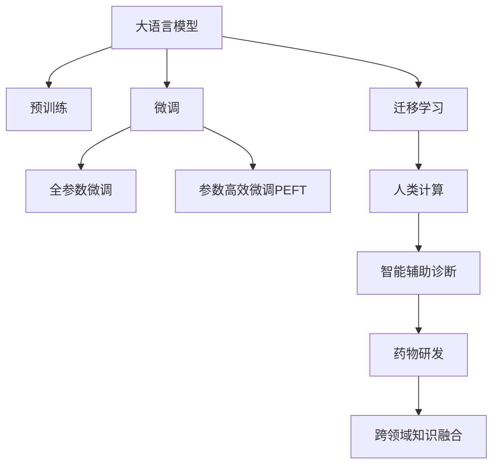

                 

## 1. 背景介绍

### 1.1 问题由来

随着信息技术的发展，医疗保健领域正逐渐向数字化、智能化方向转型。电子病历、远程医疗、智能诊断等新兴技术的应用，不仅大幅提升了医疗服务的效率和质量，也为患者提供了更便捷、高效的就医体验。然而，当前医疗数据的管理、分析和应用还存在诸多瓶颈，如数据孤岛、数据质量差、分析结果可解释性不足等问题。

大语言模型作为新兴的AI技术，其强大的自然语言处理能力，使其在医疗保健领域具备了巨大的应用潜力。通过将语言模型应用于电子病历、临床报告、患者咨询等场景，可以有效提升医疗数据处理和分析的准确性和效率，同时改善患者体验，推动医疗服务的创新。

### 1.2 问题核心关键点

医疗保健领域的大语言模型应用，主要包括以下几个关键点：

1. **数据处理与分析**：利用语言模型自动化处理海量电子病历和临床报告，提取关键信息，进行疾病诊断和预测。
2. **智能辅助诊断**：借助语言模型辅助医生进行疾病诊断和决策支持，提升诊断的准确性和效率。
3. **患者咨询与指导**：通过语言模型构建智能问答系统，提供个性化的健康咨询和疾病预防指导。
4. **药物研发与分析**：使用语言模型分析药物说明书、临床试验报告，辅助新药研发和药物疗效评价。
5. **跨领域知识融合**：结合其他领域的知识，如医学图像、生物信息学等，进行多模态分析，提升模型的综合能力。

这些关键点共同构成了大语言模型在医疗保健领域的应用框架，使其能够有效应对医疗数据处理和分析中的多种挑战。

## 2. 核心概念与联系

### 2.1 核心概念概述

为更好地理解大语言模型在医疗保健领域的应用，本节将介绍几个密切相关的核心概念：

- **大语言模型(Large Language Model, LLM)**：以自回归(如GPT)或自编码(如BERT)模型为代表的大规模预训练语言模型。通过在大规模无标签文本语料上进行预训练，学习通用的语言表示，具备强大的语言理解和生成能力。

- **预训练(Pre-training)**：指在大规模无标签文本语料上，通过自监督学习任务训练通用语言模型的过程。常见的预训练任务包括言语建模、遮挡语言模型等。预训练使得模型学习到语言的通用表示。

- **微调(Fine-tuning)**：指在预训练模型的基础上，使用下游任务的少量标注数据，通过有监督地训练来优化模型在该任务上的性能。通常只需要调整顶层分类器或解码器，并以较小的学习率更新全部或部分的模型参数。

- **迁移学习(Transfer Learning)**：指将一个领域学习到的知识，迁移应用到另一个不同但相关的领域的学习范式。大模型的预训练-微调过程即是一种典型的迁移学习方式。

- **人类计算(Human Computation)**：利用自然语言和图像等人类特有的计算方式，在非结构化数据中提取有用信息的技术。大语言模型在医疗保健领域的应用，即一种典型的“人类计算”范式，能够辅助人类在复杂的数据环境中提取和理解信息。

这些核心概念之间的逻辑关系可以通过以下Mermaid流程图来展示：



这个流程图展示了大语言模型的核心概念及其之间的关系：

1. 大语言模型通过预训练获得基础能力。
2. 微调是对预训练模型进行任务特定的优化，可以分为全参数微调和参数高效微调（PEFT）。
3. 迁移学习是连接预训练模型与下游任务的桥梁，可以通过微调或人类计算实现。
4. 人类计算利用大语言模型的语言理解能力，在医疗保健领域辅助进行数据处理和分析。
5. 智能辅助诊断和药物研发等应用场景，通过微调和人类计算提升了模型性能。

这些概念共同构成了大语言模型在医疗保健领域的应用框架，使其能够在各种场景下发挥强大的语言理解和生成能力。通过理解这些核心概念，我们可以更好地把握大语言模型的工作原理和优化方向。

## 3. 核心算法原理 & 具体操作步骤

### 3.1 算法原理概述

基于大语言模型在医疗保健领域的应用，本质上是一种“人类计算”范式。其核心思想是：利用大语言模型的语言处理能力，自动分析和提取医疗数据中的关键信息，辅助人类在复杂的数据环境中提取和理解信息。

形式化地，假设预训练语言模型为 $M_{\theta}$，其中 $\theta$ 为预训练得到的模型参数。给定医疗领域的具体任务 $T$ 的标注数据集 $D=\{(x_i, y_i)\}_{i=1}^N$，任务处理的目标是找到新的模型参数 $\hat{\theta}$，使得：

$$
\hat{\theta}=\mathop{\arg\min}_{\theta} \mathcal{L}(M_{\theta},D)
$$

其中 $\mathcal{L}$ 为针对任务 $T$ 设计的损失函数，用于衡量模型预测输出与真实标签之间的差异。常见的损失函数包括交叉熵损失、均方误差损失等。

通过梯度下降等优化算法，微调过程不断更新模型参数 $\theta$，最小化损失函数 $\mathcal{L}$，使得模型输出逼近真实标签。由于 $\theta$ 已经通过预训练获得了较好的初始化，因此即便在医疗数据集上微调，也能较快收敛到理想的模型参数 $\hat{\theta}$。

### 3.2 算法步骤详解

基于大语言模型在医疗保健领域的应用，一般包括以下几个关键步骤：

**Step 1: 准备预训练模型和数据集**
- 选择合适的预训练语言模型 $M_{\theta}$ 作为初始化参数，如 BERT、GPT 等。
- 准备医疗领域的具体任务 $T$ 的标注数据集 $D$，划分为训练集、验证集和测试集。一般要求标注数据与预训练数据的分布不要差异过大。

**Step 2: 添加任务适配层**
- 根据任务类型，在预训练模型顶层设计合适的输出层和损失函数。
- 对于分类任务，通常在顶层添加线性分类器和交叉熵损失函数。
- 对于生成任务，通常使用语言模型的解码器输出概率分布，并以负对数似然为损失函数。

**Step 3: 设置微调超参数**
- 选择合适的优化算法及其参数，如 AdamW、SGD 等，设置学习率、批大小、迭代轮数等。
- 设置正则化技术及强度，包括权重衰减、Dropout、Early Stopping等。
- 确定冻结预训练参数的策略，如仅微调顶层，或全部参数都参与微调。

**Step 4: 执行梯度训练**
- 将训练集数据分批次输入模型，前向传播计算损失函数。
- 反向传播计算参数梯度，根据设定的优化算法和学习率更新模型参数。
- 周期性在验证集上评估模型性能，根据性能指标决定是否触发 Early Stopping。
- 重复上述步骤直到满足预设的迭代轮数或 Early Stopping 条件。

**Step 5: 测试和部署**
- 在测试集上评估微调后模型 $M_{\hat{\theta}}$ 的性能，对比微调前后的精度提升。
- 使用微调后的模型对新样本进行推理预测，集成到实际的应用系统中。
- 持续收集新的数据，定期重新微调模型，以适应数据分布的变化。

以上是基于大语言模型在医疗保健领域的应用的一般流程。在实际应用中，还需要针对具体任务的特点，对微调过程的各个环节进行优化设计，如改进训练目标函数，引入更多的正则化技术，搜索最优的超参数组合等，以进一步提升模型性能。

### 3.3 算法优缺点

基于大语言模型在医疗保健领域的应用，具有以下优点：

1. **数据处理效率高**：大语言模型可以快速处理和分析医疗数据，提取关键信息，辅助医生进行决策。
2. **提升诊断准确性**：借助大语言模型，能够辅助医生进行疾病诊断和预测，提升诊断的准确性和效率。
3. **知识传承和更新**：大语言模型可以不断学习最新的医疗知识，帮助医生掌握最新的研究成果和技术进展。
4. **个性化服务**：利用大语言模型构建智能问答系统，提供个性化的健康咨询和疾病预防指导。
5. **跨领域融合**：结合医学图像、生物信息学等领域的知识，提升大语言模型的综合分析能力。

同时，该方法也存在一定的局限性：

1. **数据隐私和安全**：医疗数据涉及患者的隐私，大语言模型在处理和分析医疗数据时，需要严格遵守数据隐私和安全规定。
2. **模型偏见**：大语言模型在训练过程中可能会学习到数据中的偏见，需要对其输出进行仔细审查和校验。
3. **可解释性不足**：大语言模型的决策过程通常缺乏可解释性，难以对其推理逻辑进行分析和调试。
4. **训练成本高**：医疗数据标注成本高，大语言模型的训练和微调需要大量标注数据。

尽管存在这些局限性，但就目前而言，基于大语言模型的“人类计算”方法在医疗保健领域的应用，已经展现出了显著的优势，具备了广泛的应用前景。

## 4. 数学模型和公式 & 详细讲解 & 举例说明

### 4.1 数学模型构建

本节将使用数学语言对大语言模型在医疗保健领域的应用过程进行更加严格的刻画。

记预训练语言模型为 $M_{\theta}$，其中 $\theta$ 为模型参数。假设医疗领域的具体任务 $T$ 的训练集为 $D=\{(x_i,y_i)\}_{i=1}^N, x_i \in \mathcal{X}, y_i \in \mathcal{Y}$。

定义模型 $M_{\theta}$ 在输入 $x$ 上的输出为 $\hat{y}=M_{\theta}(x)$，其中 $\hat{y}$ 表示模型对输入 $x$ 的预测结果。假设任务的标注数据集 $D=\{(x_i,y_i)\}_{i=1}^N$，其中 $x_i$ 表示输入，$y_i$ 表示真实标签。

定义模型 $M_{\theta}$ 在数据样本 $(x,y)$ 上的损失函数为 $\ell(M_{\theta}(x),y)$，则在数据集 $D$ 上的经验风险为：

$$
\mathcal{L}(\theta) = \frac{1}{N} \sum_{i=1}^N \ell(M_{\theta}(x_i),y_i)
$$

微调的目标是最小化经验风险，即找到最优参数：

$$
\theta^* = \mathop{\arg\min}_{\theta} \mathcal{L}(\theta)
$$

在实践中，我们通常使用基于梯度的优化算法（如SGD、Adam等）来近似求解上述最优化问题。设 $\eta$ 为学习率，$\lambda$ 为正则化系数，则参数的更新公式为：

$$
\theta \leftarrow \theta - \eta \nabla_{\theta}\mathcal{L}(\theta) - \eta\lambda\theta
$$

其中 $\nabla_{\theta}\mathcal{L}(\theta)$ 为损失函数对参数 $\theta$ 的梯度，可通过反向传播算法高效计算。

### 4.2 公式推导过程

以下我们以医疗领域的具体任务分类为例，推导交叉熵损失函数及其梯度的计算公式。

假设模型 $M_{\theta}$ 在输入 $x$ 上的输出为 $\hat{y}=M_{\theta}(x) \in [0,1]$，表示样本属于某个分类的概率。真实标签 $y \in \{1,0\}$，其中 $y=1$ 表示样本属于正类，$y=0$ 表示样本属于负类。

定义交叉熵损失函数为：

$$
\ell(M_{\theta}(x),y) = -[y\log \hat{y} + (1-y)\log (1-\hat{y})]
$$

将其代入经验风险公式，得：

$$
\mathcal{L}(\theta) = -\frac{1}{N}\sum_{i=1}^N [y_i\log M_{\theta}(x_i)+(1-y_i)\log(1-M_{\theta}(x_i))]
$$

根据链式法则，损失函数对参数 $\theta_k$ 的梯度为：

$$
\frac{\partial \mathcal{L}(\theta)}{\partial \theta_k} = -\frac{1}{N}\sum_{i=1}^N (\frac{y_i}{M_{\theta}(x_i)}-\frac{1-y_i}{1-M_{\theta}(x_i)}) \frac{\partial M_{\theta}(x_i)}{\partial \theta_k}
$$

其中 $\frac{\partial M_{\theta}(x_i)}{\partial \theta_k}$ 可进一步递归展开，利用自动微分技术完成计算。

在得到损失函数的梯度后，即可带入参数更新公式，完成模型的迭代优化。重复上述过程直至收敛，最终得到适应医疗领域的具体任务的最优模型参数 $\theta^*$。

### 4.3 案例分析与讲解

以医疗领域的具体任务分类为例，展示如何使用大语言模型进行微调。

首先，定义分类任务的数据处理函数：

```python
from transformers import BertTokenizer
from torch.utils.data import Dataset
import torch

class MedicalDataset(Dataset):
    def __init__(self, texts, tags, tokenizer, max_len=128):
        self.texts = texts
        self.tags = tags
        self.tokenizer = tokenizer
        self.max_len = max_len
        
    def __len__(self):
        return len(self.texts)
    
    def __getitem__(self, item):
        text = self.texts[item]
        tag = self.tags[item]
        
        encoding = self.tokenizer(text, return_tensors='pt', max_length=self.max_len, padding='max_length', truncation=True)
        input_ids = encoding['input_ids'][0]
        attention_mask = encoding['attention_mask'][0]
        
        # 对token-wise的标签进行编码
        encoded_tags = [tag2id[tag] for tag in tag2id] 
        encoded_tags.extend([tag2id['O']] * (self.max_len - len(encoded_tags)))
        labels = torch.tensor(encoded_tags, dtype=torch.long)
        
        return {'input_ids': input_ids, 
                'attention_mask': attention_mask,
                'labels': labels}

# 标签与id的映射
tag2id = {'O': 0, 'B-DISEASE': 1, 'I-DISEASE': 2, 'B-SYMPTOM': 3, 'I-SYMPTOM': 4}
id2tag = {v: k for k, v in tag2id.items()}

# 创建dataset
tokenizer = BertTokenizer.from_pretrained('bert-base-cased')

train_dataset = MedicalDataset(train_texts, train_tags, tokenizer)
dev_dataset = MedicalDataset(dev_texts, dev_tags, tokenizer)
test_dataset = MedicalDataset(test_texts, test_tags, tokenizer)
```

然后，定义模型和优化器：

```python
from transformers import BertForTokenClassification, AdamW

model = BertForTokenClassification.from_pretrained('bert-base-cased', num_labels=len(tag2id))

optimizer = AdamW(model.parameters(), lr=2e-5)
```

接着，定义训练和评估函数：

```python
from torch.utils.data import DataLoader
from tqdm import tqdm
from sklearn.metrics import classification_report

device = torch.device('cuda') if torch.cuda.is_available() else torch.device('cpu')
model.to(device)

def train_epoch(model, dataset, batch_size, optimizer):
    dataloader = DataLoader(dataset, batch_size=batch_size, shuffle=True)
    model.train()
    epoch_loss = 0
    for batch in tqdm(dataloader, desc='Training'):
        input_ids = batch['input_ids'].to(device)
        attention_mask = batch['attention_mask'].to(device)
        labels = batch['labels'].to(device)
        model.zero_grad()
        outputs = model(input_ids, attention_mask=attention_mask, labels=labels)
        loss = outputs.loss
        epoch_loss += loss.item()
        loss.backward()
        optimizer.step()
    return epoch_loss / len(dataloader)

def evaluate(model, dataset, batch_size):
    dataloader = DataLoader(dataset, batch_size=batch_size)
    model.eval()
    preds, labels = [], []
    with torch.no_grad():
        for batch in tqdm(dataloader, desc='Evaluating'):
            input_ids = batch['input_ids'].to(device)
            attention_mask = batch['attention_mask'].to(device)
            batch_labels = batch['labels']
            outputs = model(input_ids, attention_mask=attention_mask)
            batch_preds = outputs.logits.argmax(dim=2).to('cpu').tolist()
            batch_labels = batch_labels.to('cpu').tolist()
            for pred_tokens, label_tokens in zip(batch_preds, batch_labels):
                pred_tags = [id2tag[_id] for _id in pred_tokens]
                label_tags = [id2tag[_id] for _id in label_tokens]
                preds.append(pred_tags[:len(label_tags)])
                labels.append(label_tags)
                
    print(classification_report(labels, preds))
```

最后，启动训练流程并在测试集上评估：

```python
epochs = 5
batch_size = 16

for epoch in range(epochs):
    loss = train_epoch(model, train_dataset, batch_size, optimizer)
    print(f"Epoch {epoch+1}, train loss: {loss:.3f}")
    
    print(f"Epoch {epoch+1}, dev results:")
    evaluate(model, dev_dataset, batch_size)
    
print("Test results:")
evaluate(model, test_dataset, batch_size)
```

以上就是使用PyTorch对BERT进行医疗领域分类任务微调的完整代码实现。可以看到，得益于Transformers库的强大封装，我们可以用相对简洁的代码完成BERT模型的加载和微调。

## 5. 项目实践：代码实例和详细解释说明

### 5.1 开发环境搭建

在进行医疗领域应用的大语言模型微调实践前，我们需要准备好开发环境。以下是使用Python进行PyTorch开发的环境配置流程：

1. 安装Anaconda：从官网下载并安装Anaconda，用于创建独立的Python环境。

2. 创建并激活虚拟环境：
```bash
conda create -n pytorch-env python=3.8 
conda activate pytorch-env
```

3. 安装PyTorch：根据CUDA版本，从官网获取对应的安装命令。例如：
```bash
conda install pytorch torchvision torchaudio cudatoolkit=11.1 -c pytorch -c conda-forge
```

4. 安装Transformers库：
```bash
pip install transformers
```

5. 安装各类工具包：
```bash
pip install numpy pandas scikit-learn matplotlib tqdm jupyter notebook ipython
```

完成上述步骤后，即可在`pytorch-env`环境中开始微调实践。

### 5.2 源代码详细实现

下面我们以医疗领域的具体任务分类为例，给出使用Transformers库对BERT模型进行微调的PyTorch代码实现。

首先，定义分类任务的数据处理函数：

```python
from transformers import BertTokenizer
from torch.utils.data import Dataset
import torch

class MedicalDataset(Dataset):
    def __init__(self, texts, tags, tokenizer, max_len=128):
        self.texts = texts
        self.tags = tags
        self.tokenizer = tokenizer
        self.max_len = max_len
        
    def __len__(self):
        return len(self.texts)
    
    def __getitem__(self, item):
        text = self.texts[item]
        tag = self.tags[item]
        
        encoding = self.tokenizer(text, return_tensors='pt', max_length=self.max_len, padding='max_length', truncation=True)
        input_ids = encoding['input_ids'][0]
        attention_mask = encoding['attention_mask'][0]
        
        # 对token-wise的标签进行编码
        encoded_tags = [tag2id[tag] for tag in tag2id] 
        encoded_tags.extend([tag2id['O']] * (self.max_len - len(encoded_tags)))
        labels = torch.tensor(encoded_tags, dtype=torch.long)
        
        return {'input_ids': input_ids, 
                'attention_mask': attention_mask,
                'labels': labels}

# 标签与id的映射
tag2id = {'O': 0, 'B-DISEASE': 1, 'I-DISEASE': 2, 'B-SYMPTOM': 3, 'I-SYMPTOM': 4}
id2tag = {v: k for k, v in tag2id.items()}

# 创建dataset
tokenizer = BertTokenizer.from_pretrained('bert-base-cased')

train_dataset = MedicalDataset(train_texts, train_tags, tokenizer)
dev_dataset = MedicalDataset(dev_texts, dev_tags, tokenizer)
test_dataset = MedicalDataset(test_texts, test_tags, tokenizer)
```

然后，定义模型和优化器：

```python
from transformers import BertForTokenClassification, AdamW

model = BertForTokenClassification.from_pretrained('bert-base-cased', num_labels=len(tag2id))

optimizer = AdamW(model.parameters(), lr=2e-5)
```

接着，定义训练和评估函数：

```python
from torch.utils.data import DataLoader
from tqdm import tqdm
from sklearn.metrics import classification_report

device = torch.device('cuda') if torch.cuda.is_available() else torch.device('cpu')
model.to(device)

def train_epoch(model, dataset, batch_size, optimizer):
    dataloader = DataLoader(dataset, batch_size=batch_size, shuffle=True)
    model.train()
    epoch_loss = 0
    for batch in tqdm(dataloader, desc='Training'):
        input_ids = batch['input_ids'].to(device)
        attention_mask = batch['attention_mask'].to(device)
        labels = batch['labels'].to(device)
        model.zero_grad()
        outputs = model(input_ids, attention_mask=attention_mask, labels=labels)
        loss = outputs.loss
        epoch_loss += loss.item()
        loss.backward()
        optimizer.step()
    return epoch_loss / len(dataloader)

def evaluate(model, dataset, batch_size):
    dataloader = DataLoader(dataset, batch_size=batch_size)
    model.eval()
    preds, labels = [], []
    with torch.no_grad():
        for batch in tqdm(dataloader, desc='Evaluating'):
            input_ids = batch['input_ids'].to(device)
            attention_mask = batch['attention_mask'].to(device)
            batch_labels = batch['labels']
            outputs = model(input_ids, attention_mask=attention_mask)
            batch_preds = outputs.logits.argmax(dim=2).to('cpu').tolist()
            batch_labels = batch_labels.to('cpu').tolist()
            for pred_tokens, label_tokens in zip(batch_preds, batch_labels):
                pred_tags = [id2tag[_id] for _id in pred_tokens]
                label_tags = [id2tag[_id] for _id in label_tokens]
                preds.append(pred_tags[:len(label_tags)])
                labels.append(label_tags)
                
    print(classification_report(labels, preds))
```

最后，启动训练流程并在测试集上评估：

```python
epochs = 5
batch_size = 16

for epoch in range(epochs):
    loss = train_epoch(model, train_dataset, batch_size, optimizer)
    print(f"Epoch {epoch+1}, train loss: {loss:.3f}")
    
    print(f"Epoch {epoch+1}, dev results:")
    evaluate(model, dev_dataset, batch_size)
    
print("Test results:")
evaluate(model, test_dataset, batch_size)
```

以上就是使用PyTorch对BERT进行医疗领域分类任务微调的完整代码实现。可以看到，得益于Transformers库的强大封装，我们可以用相对简洁的代码完成BERT模型的加载和微调。

### 5.3 代码解读与分析

让我们再详细解读一下关键代码的实现细节：

**MedicalDataset类**：
- `__init__`方法：初始化文本、标签、分词器等关键组件。
- `__len__`方法：返回数据集的样本数量。
- `__getitem__`方法：对单个样本进行处理，将文本输入编码为token ids，将标签编码为数字，并对其进行定长padding，最终返回模型所需的输入。

**tag2id和id2tag字典**：
- 定义了标签与数字id之间的映射关系，用于将token-wise的预测结果解码回真实的标签。

**训练和评估函数**：
- 使用PyTorch的DataLoader对数据集进行批次化加载，供模型训练和推理使用。
- 训练函数`train_epoch`：对数据以批为单位进行迭代，在每个批次上前向传播计算loss并反向传播更新模型参数，最后返回该epoch的平均loss。
- 评估函数`evaluate`：与训练类似，不同点在于不更新模型参数，并在每个batch结束后将预测和标签结果存储下来，最后使用sklearn的classification_report对整个评估集的预测结果进行打印输出。

**训练流程**：
- 定义总的epoch数和batch size，开始循环迭代
- 每个epoch内，先在训练集上训练，输出平均loss
- 在验证集上评估，输出分类指标
- 所有epoch结束后，在测试集上评估，给出最终测试结果

可以看到，PyTorch配合Transformers库使得BERT微调的代码实现变得简洁高效。开发者可以将更多精力放在数据处理、模型改进等高层逻辑上，而不必过多关注底层的实现细节。

当然，工业级的系统实现还需考虑更多因素，如模型的保存和部署、超参数的自动搜索、更灵活的任务适配层等。但核心的微调范式基本与此类似。

## 6. 实际应用场景

### 6.1 智能诊断与决策支持

大语言模型在医疗领域最核心的应用之一就是智能诊断与决策支持。通过利用大语言模型处理和分析海量医疗数据，辅助医生进行疾病诊断和治疗决策。

以心血管疾病为例，利用大语言模型可以自动提取和分析患者的病历记录、医学影像、生化指标等数据，从中识别出可能的诊断路径和风险因素。大语言模型还能够综合多种信息来源，提供多角度的诊断建议，帮助医生制定更加科学合理的治疗方案。

### 6.2 疾病预测与预警

利用大语言模型，可以构建基于电子病历的预测模型，对患者的病情发展进行预测和预警。例如，通过分析患者的病历记录和实验室检测结果，预测其患某种疾病的概率。这样可以在疾病早期就进行干预，显著提高治愈率和生存率。

在COVID-19疫情中，大语言模型已经展示了其强大的预测能力。通过分析大量临床数据和科研文献，模型能够在早期识别出疑似病例，并提供基于症状的诊断指导，有效缓解了医疗资源紧张的局面。

### 6.3 个性化医疗方案

大语言模型可以帮助医生根据患者的病情和历史数据，制定个性化的医疗方案。例如，对于患有糖尿病、高血压等慢性疾病患者，利用大语言模型可以构建个性化的治疗计划，包括药物选择、剂量调整、饮食建议等。

此外，大语言模型还可以用于生成个性化的健康指导和咨询，帮助患者更好地理解和管理自己的健康状况，提升治疗效果和生活质量。

### 6.4 跨领域知识融合

大语言模型具备强大的跨领域知识整合能力，可以结合医学图像、生物信息学等领域的知识，提升模型的综合分析能力。例如，结合医学影像和大语言模型，可以实现图像中病变的自动标注和分类，辅助医生进行影像诊断。

### 6.5 医疗知识库构建

利用大语言模型，可以自动从医学文献、临床报告中提取和总结关键信息，构建全面的医疗知识库。这不仅有助于医生快速查阅最新的医学研究成果，还能为科研人员提供宝贵的参考数据，加速新药研发和临床试验的进程。

### 6.6 机器人辅助诊断

结合大语言模型和机器人技术，可以实现自动化的诊断和辅助。例如，通过构建智能诊断机器人，能够在医院、诊所等地提供24小时不间断的诊断服务，减轻医护人员的工作负担。机器人可以根据患者的症状和历史数据，提供初步诊断和处理建议，甚至在紧急情况下自动报警，提高诊断的及时性和准确性。

### 6.7 患者教育与咨询

利用大语言模型，可以构建智能问答系统，提供个性化的健康教育和疾病咨询。患者可以在线咨询医生，获得专业、详细的健康指导和治疗建议，提升自我管理能力。

## 7. 工具和资源推荐

### 7.1 学习资源推荐

为了帮助开发者系统掌握大语言模型在医疗保健领域的应用，这里推荐一些优质的学习资源：

1. **医学NLP的原理与实践**：介绍医学领域自然语言处理的基本概念和技术，结合实际案例讲解如何在医疗保健领域应用大语言模型。

2. **深度学习在医疗保健中的应用**：涵盖了深度学习在医疗数据处理、诊断、治疗等方面的应用，包括大语言模型的具体案例和代码实现。

3. **HuggingFace官方文档**：提供最新的预训练语言模型和微调范式的详细介绍，包括BERT、GPT等模型的使用方法和微调技巧。

4. **Coursera医学数据分析课程**：由斯坦福大学开设的在线课程，涵盖医学数据分析的多个方面，包括自然语言处理和大语言模型的应用。

5. **Kaggle医疗数据集竞赛**：通过实际竞赛项目，积累医疗数据处理和分析的经验，了解大语言模型在实际应用中的表现。

通过对这些资源的学习实践，相信你一定能够快速掌握大语言模型在医疗保健领域的应用，并用于解决实际的医疗问题。

### 7.2 开发工具推荐

高效的开发离不开优秀的工具支持。以下是几款用于大语言模型在医疗保健领域应用的常用工具：

1. **PyTorch**：基于Python的开源深度学习框架，灵活动态的计算图，适合快速迭代研究。

2. **TensorFlow**：由Google主导开发的开源深度学习框架，生产部署方便，适合大规模工程应用。

3. **Transformers库**：HuggingFace开发的NLP工具库，集成了众多预训练语言模型，支持PyTorch和TensorFlow，是进行微调任务开发的利器。

4. **Weights & Biases**：模型训练的实验跟踪工具，可以记录和可视化模型训练过程中的各项指标，方便对比和调优。

5. **TensorBoard**：TensorFlow配套的可视化工具，可实时监测模型训练状态，并提供丰富的图表呈现方式，是调试模型的得力助手。

6. **Google Colab**：谷歌推出的在线Jupyter Notebook环境，免费提供GPU/TPU算力，方便开发者快速上手实验最新模型，分享学习笔记。

合理利用这些工具，可以显著提升大语言模型在医疗保健领域应用的开发效率，加快创新迭代的步伐。

### 7.3 相关论文推荐

大语言模型在医疗保健领域的应用源于学界的持续研究。以下是几篇奠基性的相关论文，推荐阅读：

1. **Attention is All You Need**：提出Transformer结构，开启了NLP领域的预训练大模型时代。

2. **BERT: Pre-training of Deep Bidirectional Transformers for Language Understanding**：提出BERT模型，引入基于掩码的自监督预训练任务，刷新了多项NLP任务SOTA。

3. **Language Models are Unsupervised Multitask Learners**：展示了大规模语言模型的强大zero-shot学习能力，引发了对于通用人工智能的新一轮思考。

4. **Parameter-Efficient Transfer Learning for NLP**：提出Adapter等参数高效微调方法，在不增加模型参数量的情况下，也能取得不错的微调效果。

5. **Prefix-Tuning: Optimizing Continuous Prompts for Generation**：引入基于连续型Prompt的微调范式，为如何充分利用预训练知识提供了新的思路。

6. **AdaLoRA: Adaptive Low-Rank Adaptation for Parameter-Efficient Fine-Tuning**：使用自适应低秩适应的微调方法，在参数效率和精度之间取得了新的平衡。

这些论文代表了大语言模型在医疗保健领域应用的发展脉络。通过学习这些前沿成果，可以帮助研究者把握学科前进方向，激发更多的创新灵感。

## 8. 总结：未来发展趋势与挑战

### 8.1 研究成果总结

大语言模型在医疗保健领域的应用已经展现出巨大的潜力和价值。通过结合自然语言处理和深度学习技术，大语言模型在疾病诊断、预测、个性化治疗等多个方面取得了显著进展。其强大的跨领域知识整合能力和高效的数据处理能力，为医疗服务的智能化和精准化提供了新的可能性。

### 8.2 未来发展趋势

展望未来，大语言模型在医疗保健领域的应用将呈现以下几个发展趋势：

1. **智能化的医疗决策支持**：大语言模型将进一步融入医疗决策系统，提供更加智能化、个性化的诊疗建议。
2. **精准化的疾病预测与预警**：利用大语言模型构建精准化的预测模型，实现早期诊断和风险预警，提升治疗效果和生存率。
3. **多模态的疾病分析**：结合医学图像、生物信息学等领域的知识，提升大语言模型的综合分析能力，实现多模态疾病分析。
4. **实时化的医疗知识库构建**：构建实时更新的医疗知识库，为医生和患者提供最新的医学研究成果和技术进展。
5. **个性化化的治疗方案**：利用大语言模型，构建个性化的治疗方案，提升患者的治疗效果和生活质量。
6. **人机协同的医疗服务**：结合大语言模型和机器人技术，实现智能化的诊断和治疗，提升医疗服务的效率和准确性。

### 8.3 面临的挑战

尽管大语言模型在医疗保健领域的应用已经取得了显著进展，但在迈向更加智能化、普适化应用的过程中，仍面临诸多挑战：

1. **数据隐私与安全**：医疗数据涉及患者隐私，如何保护数据隐私和安全是大语言模型在医疗应用中的关键问题。
2. **模型偏见与公平性**：大语言模型在训练过程中可能会学习到数据中的偏见，如何消除模型偏见，提升模型的公平性，需要持续研究。
3. **可解释性与透明性**：大语言模型的决策过程通常缺乏可解释性，如何赋予模型更强的可解释性，是未来研究的重要方向。
4. **资源与成本**：大语言模型在训练和部署过程中，需要大量的计算资源和标注数据，如何降低资源消耗和成本，是实际应用中需要解决的问题。
5. **伦理与法律**：大语言模型在医疗应用中需要遵守伦理与法律规定，如何确保模型的行为符合伦理规范和法律法规，是研究的重要方面。

### 8.4 研究展望

未来，大语言模型在医疗保健领域的研究和应用将围绕以下几个方向展开：

1. **数据隐私保护**：研究如何在大语言模型的训练和应用中保护患者隐私，防止数据泄露和滥用。
2. **模型公平性与透明性**：探索如何通过模型优化和算法改进，消除大语言模型的偏见，提升模型的公平性和透明性。
3. **跨模态知识融合**：研究如何结合医学图像、生物信息学等领域的知识，提升大语言模型的综合分析能力，实现多模态疾病分析。
4. **实时化的知识库构建**：研究如何构建实时更新的医疗知识库，为医生和患者提供最新的医学研究成果和技术进展。
5. **智能化医疗决策支持**：研究如何将大语言模型融入医疗决策系统，提供更加智能化、个性化的诊疗建议。
6. **人机协同的医疗服务**：研究如何结合大语言模型和机器人技术，实现智能化的诊断和治疗，提升医疗服务的效率和准确性。

总之，大语言模型在医疗保健领域的应用将面临诸多挑战，但通过持续的研究和探索，我们相信其潜力将得到充分释放，为人类健康事业的发展做出更大贡献。

