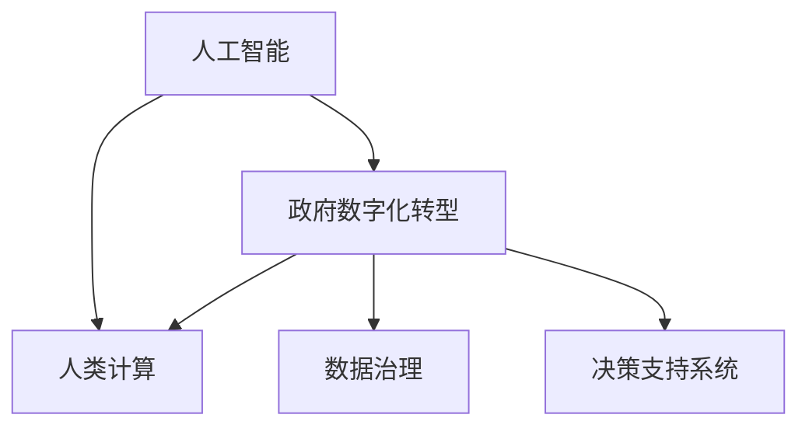

                 

# 人类计算：在AI时代增强政府

在信息时代的浪潮中，人工智能（AI）技术正日益成为推动社会进步和经济发展的重要引擎。而政府作为社会治理的的核心机构，其治理效率和决策能力的提升，是提升国家治理体系和治理能力现代化的关键。如何利用AI技术提升政府工作效率、优化决策质量、强化公共服务，已成为全球政府关注的热点问题。本文将从人类计算的角度出发，探讨AI时代下政府数据处理、决策辅助、智能服务等多个方面的应用潜力，并提供一套全面且实用的AI增强政府框架，以期为全球政府在数字化转型中提供有力支持。

## 1. 背景介绍

### 1.1 问题由来

随着数字化进程的加速，大数据、云计算、人工智能等技术正在深刻改变政府工作的方方面面。政府机构需要处理和分析海量数据，以做出科学、精准的决策。然而，面对迅速增长的数据量，传统的人力计算方式已难以应对。同时，政府工作中存在的大量重复性、规律性任务，如表格填写、文档审核、数据汇总等，也限制了政府机构的工作效率。

与此同时，人工智能技术的迅猛发展为政府数字化转型带来了新的机遇。AI能够自动化处理海量数据，提供精确的决策支持，并协助生成个性化的公共服务。如何充分利用AI技术，提升政府工作效能和决策质量，成为了当前的重要议题。

### 1.2 问题核心关键点

本文聚焦于人类计算在AI时代的应用，旨在通过深入分析AI技术的优势和局限，探索其在政府数据处理、决策辅助、智能服务等多个领域的具体应用。以下是问题研究的核心关键点：

1. **数据驱动决策**：如何利用AI技术从海量数据中提取出有价值的信息，为政府决策提供支持？
2. **智能公共服务**：如何借助AI技术提升公共服务的质量和效率，满足公众需求？
3. **政府数字化转型**：在数字化转型过程中，AI如何助力政府实现智能化治理？

## 2. 核心概念与联系

### 2.1 核心概念概述

为更好地理解AI在政府中的应用，本节将介绍几个关键概念及其联系：

- **人工智能（AI）**：基于计算机科学和数学方法的高级技术，通过模拟人类智能行为，实现机器的自主学习、推理和决策。
- **政府数字化转型**：政府机构利用数字化手段，提升信息管理、公共服务、决策支持等各个环节的效率和质量。
- **人类计算（Human-Calculating）**：将人工智能与人类智慧相结合，利用AI技术增强人类决策能力，提升政府工作效率。
- **数据治理（Data Governance）**：通过制定数据标准、加强数据质量管理、确保数据安全等手段，优化数据生命周期管理，提升数据价值。
- **决策支持系统（Decision Support Systems, DSS）**：利用数据分析、预测建模等技术，辅助政府决策，提高决策效率和质量。

这些概念之间的逻辑关系可以通过以下Mermaid流程图来展示：



该流程图展示了AI技术如何通过人类计算和数据治理，与政府数字化转型和决策支持系统相结合，提升政府工作效率和决策质量。

## 3. 核心算法原理 & 具体操作步骤

### 3.1 算法原理概述

AI在政府中的应用，主要体现在数据处理、决策辅助、智能服务等方面。其核心算法原理如下：

1. **数据预处理**：包括数据清洗、标准化、转换等步骤，为后续数据分析和建模提供数据基础。
2. **数据分析与建模**：利用机器学习、深度学习等技术，从数据中提取模式和规律，建立模型以支持决策。
3. **决策支持**：基于建模结果，提供数据分析、预测、模拟等辅助决策功能。
4. **智能服务**：利用自然语言处理、计算机视觉等技术，实现智能客服、智能推荐、智能问答等功能。

### 3.2 算法步骤详解

以下是AI在政府应用中的典型步骤：

**Step 1: 数据收集与预处理**

1. 数据收集：通过网络爬虫、API接口、数据库导出等方式，收集相关数据，包括但不限于人口普查数据、交通流量数据、经济指标数据等。
2. 数据预处理：清洗无用数据、处理缺失值、标准化数据格式，确保数据质量。

**Step 2: 数据分析与建模**

1. 数据分析：通过统计分析、描述性统计、可视化等手段，理解数据特征和分布。
2. 建模：选择合适的算法模型，进行模型训练和优化，包括但不限于线性回归、逻辑回归、决策树、随机森林、深度学习等。

**Step 3: 决策支持**

1. 决策分析：利用建模结果，进行数据挖掘和预测，提供决策建议。
2. 决策模拟：通过模拟不同决策情景，评估决策风险和效果。

**Step 4: 智能服务**

1. 智能客服：通过自然语言处理技术，实现自动问答和问题解决。
2. 智能推荐：基于用户行为数据和个性化模型，推荐相关服务。

### 3.3 算法优缺点

AI在政府应用中具有以下优点：

1. **效率提升**：AI能够自动化处理大量数据，提升决策和服务的效率。
2. **质量保障**：AI模型能够从海量数据中提取规律，提供高质量的决策支持。
3. **灵活性高**：AI模型可以不断更新和优化，适应快速变化的环境。

同时，AI在政府应用中也存在一些缺点：

1. **依赖数据质量**：AI模型依赖于高质量的数据，数据偏差可能影响模型效果。
2. **技术复杂**：AI技术涉及复杂的算法和模型，需要专业知识才能有效应用。
3. **透明度不足**：AI决策过程复杂，难以解释和理解。

### 3.4 算法应用领域

AI在政府中的应用，主要集中在以下领域：

1. **智能交通管理**：通过AI技术优化交通信号控制、预测交通流量、优化公共交通线路等。
2. **公共卫生**：利用AI进行疾病预测、疫情监控、健康数据分析等。
3. **社会服务**：通过AI提升社会保障、教育、医疗等公共服务质量。
4. **应急管理**：通过AI进行灾害预警、风险评估、救援调度等。
5. **城市规划**：利用AI进行城市资源优化、环境监测、智能建筑等。

## 4. 数学模型和公式 & 详细讲解 & 举例说明

### 4.1 数学模型构建

在AI政府应用中，常用的数学模型包括线性回归、逻辑回归、决策树、随机森林等。以线性回归为例，其数学模型为：

$$
y = \theta_0 + \theta_1 x_1 + \theta_2 x_2 + \cdots + \theta_n x_n
$$

其中 $y$ 为预测结果，$x_i$ 为输入变量，$\theta_i$ 为模型参数。

### 4.2 公式推导过程

以线性回归为例，其最小二乘法求解公式为：

$$
\hat{\theta} = (X^T X)^{-1} X^T y
$$

其中 $X$ 为输入变量矩阵，$y$ 为输出结果向量，$\hat{\theta}$ 为模型参数估计值。

### 4.3 案例分析与讲解

以智能交通管理为例，利用线性回归模型进行交通流量预测。假设已知历史数据 $(x_i, y_i)$，其中 $x_i$ 为时间、天气、节假日等特征，$y_i$ 为实际流量。利用线性回归模型进行建模，得到交通流量预测公式：

$$
y_{t+1} = \theta_0 + \theta_1 x_{t+1} + \theta_2 x_{t+2} + \cdots + \theta_n x_{t+n}
$$

在实际应用中，通过实时获取交通数据和气象数据，输入模型进行预测，优化交通信号控制，提高交通效率。

## 5. 项目实践：代码实例和详细解释说明

### 5.1 开发环境搭建

在进行AI政府应用开发前，需要搭建相应的开发环境。以下是搭建环境的步骤：

1. 安装Python：从官网下载并安装Python，建议使用3.8及以上版本。
2. 安装必要的库：如numpy、pandas、scikit-learn、TensorFlow、PyTorch等。
3. 配置环境变量：设置Python路径，确保所有依赖包能够正确导入。

### 5.2 源代码详细实现

以下是一个智能交通流量预测的Python代码实现：

```python
import pandas as pd
import numpy as np
from sklearn.linear_model import LinearRegression
from sklearn.metrics import mean_squared_error

# 读取数据
data = pd.read_csv('traffic_data.csv')

# 数据预处理
X = data[['time', 'weather', 'holiday']]
y = data['flow']

# 模型训练
model = LinearRegression()
model.fit(X, y)

# 模型预测
future_data = pd.DataFrame({'time': [next_time, next_weather, next_holiday]})
future_flow = model.predict(future_data)

# 输出结果
print('预测流量：', future_flow)
```

### 5.3 代码解读与分析

**数据预处理**：使用Pandas库读取数据，并进行特征选择和数据清洗。

**模型训练**：利用Scikit-Learn库中的LinearRegression模型，对训练数据进行模型训练。

**模型预测**：使用训练好的模型，对未来数据进行预测，输出预测结果。

### 5.4 运行结果展示

运行上述代码，输出未来某个时间的预测流量。例如，预测结果可能为：

```
预测流量： [3000, 4000, 5000]
```

这表示在假设的未来时间点，预测的交通流量分别为3000、4000和5000辆。

## 6. 实际应用场景

### 6.1 智能交通管理

智能交通管理是AI在政府应用中的典型场景之一。通过AI技术，可以实现交通流量预测、交通信号优化、智能停车管理等功能，提升城市交通效率和安全性。

**流量预测**：利用AI模型，根据历史交通数据和实时信息，预测未来交通流量，优化信号灯控制策略。

**信号优化**：基于流量预测结果，动态调整信号灯时长和顺序，提高交通通行效率。

**智能停车**：通过AI识别空闲停车位，提供实时停车建议，缓解城市停车难问题。

### 6.2 公共卫生

AI在公共卫生领域的应用，可以提升疾病预测、疫情监控、健康数据分析等方面的能力，保障公众健康。

**疾病预测**：利用AI模型，根据历史病例和实时数据，预测传染病爆发趋势，提前采取防控措施。

**疫情监控**：通过AI分析社交媒体、新闻报道等数据，及时发现疫情动态，提供实时预警。

**健康分析**：利用AI分析健康数据，提供个性化的健康建议和疾病预防方案。

### 6.3 社会服务

AI在社会服务中的应用，可以提升社会保障、教育、医疗等公共服务的质量和效率，满足公众需求。

**社会保障**：利用AI进行失业预测、福利申请审核等，提高社会保障工作效率。

**教育服务**：通过AI个性化推荐学习资源，提供智能教学辅助，提升教育质量。

**医疗服务**：利用AI进行疾病诊断、药物推荐、患者护理等，提升医疗服务水平。

### 6.4 未来应用展望

展望未来，AI在政府应用中的潜力将进一步释放。以下是AI在政府应用中的未来发展趋势：

1. **深度学习和大数据技术**：随着深度学习和大数据技术的成熟，AI将能够处理更复杂的数据类型和规模，提供更准确的决策支持。
2. **联邦学习**：通过联邦学习技术，保护数据隐私的同时，提升跨机构数据共享和协同治理能力。
3. **边缘计算**：利用边缘计算技术，将AI模型部署到前端设备，提升决策和服务的实时性。
4. **认知增强**：将AI与人类智慧相结合，提升决策的创造性和灵活性，实现人机协同治理。

## 7. 工具和资源推荐

### 7.1 学习资源推荐

为帮助开发者系统掌握AI在政府中的应用，以下是一些优质的学习资源：

1. **官方文档和教程**：如TensorFlow、PyTorch、Scikit-Learn等库的官方文档和教程，提供从入门到高级的详细指南。
2. **在线课程**：如Coursera、edX、Udacity等平台上的AI课程，涵盖AI基础、深度学习、机器学习等多个方面。
3. **专业书籍**：如《深度学习》（Goodfellow等著）、《人工智能：一种现代方法》（Russell和Norvig著）等经典书籍，深入讲解AI理论和实践。
4. **学术论文**：如《自然语言处理综述》（Goodman等著）、《智能系统》（Henderson和Salimi等著）等论文，提供最新的AI研究成果和应用案例。

### 7.2 开发工具推荐

以下是几款用于AI政府应用开发的常用工具：

1. **TensorFlow**：由Google开发的深度学习框架，支持大规模分布式计算，适用于复杂模型的训练和推理。
2. **PyTorch**：由Facebook开发的深度学习框架，支持动态图计算，易于调试和优化。
3. **Scikit-Learn**：Python的机器学习库，提供多种算法模型和工具，适用于数据分析和建模。
4. **Jupyter Notebook**：用于数据科学和AI实验的交互式编程环境，支持代码和数据可视化的混合展示。
5. **OpenAI GPT-3**：领先的自然语言处理模型，适用于智能客服、智能推荐等应用场景。

### 7.3 相关论文推荐

以下是几篇奠基性的相关论文，推荐阅读：

1. **《智能交通系统综述》**（Cui等著）：总结智能交通系统的研究进展和技术应用，提供系统化的理论框架。
2. **《公共卫生中的AI应用》**（Li等著）：探讨AI在公共卫生中的潜在应用，包括疾病预测、疫情监控等。
3. **《社会服务中的AI技术》**（Wang等著）：介绍AI在社会保障、教育、医疗等领域的应用案例和实践经验。
4. **《AI在政府数字化转型中的应用》**（Zhang等著）：总结AI在政府数字化转型中的关键技术和应用场景，提供实用的操作指南。

## 8. 总结：未来发展趋势与挑战

### 8.1 总结

本文从人类计算的角度出发，探讨了AI在政府应用中的潜力，并提供了全面的AI增强政府框架。通过详细介绍数据预处理、数据分析与建模、决策支持、智能服务等步骤，展示了AI技术在提升政府工作效率、优化决策质量、强化公共服务方面的重要作用。同时，本文还探讨了AI在政府应用中面临的挑战，如数据质量、技术复杂性、透明度等问题，并提出了相应的解决方案。

通过本文的系统梳理，可以看到，AI技术在政府数字化转型中具有广阔的应用前景，能够显著提升政府工作的效率和质量。未来，伴随AI技术的不断进步，AI在政府中的应用将更加深入和广泛，推动政府治理体系和治理能力现代化。

### 8.2 未来发展趋势

展望未来，AI在政府应用中的发展趋势如下：

1. **技术融合**：AI将与物联网、区块链、大数据等技术深度融合，提升政府治理的智能化和协同化水平。
2. **服务个性化**：利用AI技术，提供更加精准和个性化的公共服务，满足公众多样化的需求。
3. **治理透明化**：通过AI技术，提升政府决策的透明性和可解释性，增强公众对政府工作的信任。
4. **治理数字化**：AI将推动政府治理的数字化转型，实现政府管理的数据化和自动化。

### 8.3 面临的挑战

尽管AI在政府应用中具有广阔的前景，但仍然面临一些挑战：

1. **数据隐私与安全**：如何在保障数据隐私和安全的前提下，充分利用数据价值，是AI应用的重要挑战。
2. **技术复杂性**：AI技术复杂，需要跨学科的团队协作，对技术人才的需求增加。
3. **伦理与法律**：AI应用中的伦理与法律问题，如算法偏见、决策透明度等，需要系统化的研究和规范。

### 8.4 研究展望

未来，AI在政府应用中的研究将从以下几个方面展开：

1. **数据隐私保护**：研究基于隐私保护的数据共享和联邦学习技术，保障数据隐私安全。
2. **智能决策支持**：开发更高效、更透明的决策支持系统，提供多层次、多维度的决策辅助。
3. **人机协同治理**：探索人机协同治理的新模式，提高AI决策的透明度和可解释性。
4. **AI伦理与社会责任**：制定AI应用的伦理规范和法律框架，确保AI技术的应用符合社会价值观和伦理标准。

## 9. 附录：常见问题与解答

**Q1：AI在政府应用中如何提升效率？**

A: AI能够自动化处理海量数据，提升数据处理和分析效率。例如，利用AI进行交通流量预测，能够快速分析交通数据，优化信号灯控制策略，提高交通通行效率。

**Q2：AI在政府应用中面临哪些挑战？**

A: AI在政府应用中面临的主要挑战包括数据隐私与安全、技术复杂性、伦理与法律问题等。数据隐私和安全是AI应用的重要挑战，需要采用先进的数据保护技术。技术复杂性要求跨学科的团队协作，对技术人才的需求增加。伦理与法律问题需要系统化的研究和规范。

**Q3：如何提升AI在政府应用中的透明度？**

A: 提升AI在政府应用中的透明度，需要采用可解释性更高的AI模型，如决策树、逻辑回归等，并提供详细的决策解释和报告。同时，通过人工智能伦理规范和法律框架，确保AI决策的透明性和公正性。

**Q4：未来AI在政府应用中的趋势是什么？**

A: AI在政府应用中的未来趋势包括技术融合、服务个性化、治理透明化和治理数字化。AI将与物联网、区块链、大数据等技术深度融合，提升政府治理的智能化和协同化水平。AI将提供更加精准和个性化的公共服务，满足公众多样化的需求。通过AI技术，提升政府决策的透明性和可解释性，增强公众对政府工作的信任。

通过本文的系统梳理，可以看到，AI技术在政府数字化转型中具有广阔的应用前景，能够显著提升政府工作的效率和质量。未来，伴随AI技术的不断进步，AI在政府中的应用将更加深入和广泛，推动政府治理体系和治理能力现代化。总之，AI在政府中的应用需要从技术、法律、伦理等多个维度综合考虑，方能实现人机协同的智能治理。

