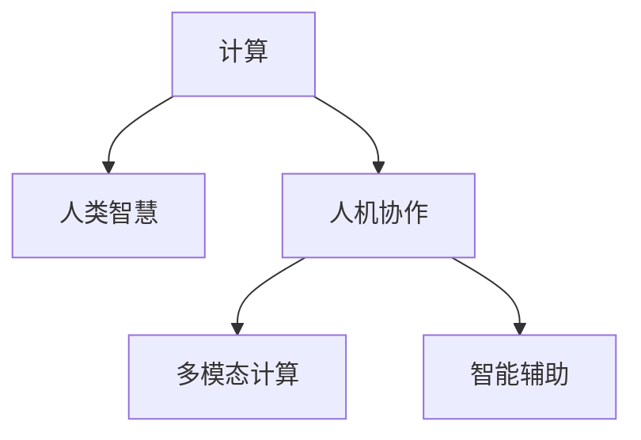

                 

# 人类计算：释放人类创造力的无限潜力

> 关键词：人类计算, 创造力释放, 人工智能, 计算理论, 数据科学

## 1. 背景介绍

### 1.1 问题由来
随着信息技术的飞速发展，人类进入了一个前所未有的计算时代。从早期的机械计算器到如今的超级计算机，计算技术已经深刻改变了人类的生产、生活和思维方式。但与此同时，人们也发现，机器计算虽然强大，却缺乏人类的直觉和创造力。如何更好地发挥人类的计算潜力，将计算与人类智慧相结合，成为一个亟待解决的问题。

### 1.2 问题核心关键点
人类计算（Human Computation），顾名思义，是将人类智慧与计算技术相结合，以人类的直觉和创造力为优势，解决机器难以胜任的问题。这包括但不限于自然语言处理、图像识别、设计、工程、音乐、艺术等领域。人类计算的核心关键点包括：

- **人类直觉**：人类拥有独一无二的直觉和创造力，能够从非结构化数据中提炼出有价值的信息。
- **计算技术**：利用先进的数据科学、机器学习、深度学习等计算技术，提升处理复杂问题的能力。
- **多学科融合**：人类计算涉及计算理论、数据科学、心理学、设计学等多个学科，需要多学科协同合作。
- **人机协作**：将人类与机器有机结合，利用各自优势，共同解决问题。

### 1.3 问题研究意义
研究人类计算具有重要意义：

1. **提升问题解决能力**：通过结合人类智慧与计算技术，可以解决机器难以胜任的复杂问题，提高问题解决的效率和质量。
2. **推动创新发展**：人类计算不仅能够解决传统问题，还能够创造出新的价值，推动技术创新和社会进步。
3. **促进教育与培训**：通过参与复杂问题的解决过程，能够有效提升人类的计算和逻辑思维能力，促进教育和培训。
4. **优化资源配置**：合理分配计算资源与人力资源，最大化资源利用率，提升整体效益。
5. **应对未来挑战**：随着计算任务的复杂性不断增加，人类计算将成为应对未来技术挑战的关键手段。

## 2. 核心概念与联系

### 2.1 核心概念概述

为了更好地理解人类计算的概念和应用，本节将介绍几个关键概念及其相互关系：

- **计算**：利用算法和计算资源解决特定问题的过程。
- **人类智慧**：指人类的直觉、创造力、逻辑思维和综合判断能力。
- **人机协作**：指将人类智慧与机器计算相结合，共同完成任务的过程。
- **多模态计算**：指利用不同感官和多源数据进行计算，以提高问题解决的准确性和全面性。
- **智能辅助**：指利用人工智能技术辅助人类计算，提升计算效率和准确性。

这些概念之间的联系可以通过以下Mermaid流程图来展示：



这个流程图展示了计算与人类智慧的结合过程，以及人机协作、多模态计算和智能辅助等关键技术如何共同促进问题解决。

## 3. 核心算法原理 & 具体操作步骤
### 3.1 算法原理概述

人类计算的核心算法原理，是将人类智慧与计算技术有机结合，利用计算资源提升问题解决的效率，同时利用人类直觉和创造力处理机器难以胜任的问题。以下是对这一原理的详细解释：

1. **数据获取与预处理**：通过传感器、图像识别、自然语言处理等技术，获取原始数据。
2. **数据增强与清洗**：利用数据增强技术和数据清洗技术，提升数据质量和可用性。
3. **多源数据融合**：将不同来源的数据进行融合，利用多模态计算技术，提升问题解决的全面性和准确性。
4. **模型训练与优化**：利用机器学习和深度学习模型，对数据进行训练和优化，提升模型预测和推理能力。
5. **人机协作决策**：在计算模型的基础上，引入人类直觉和创造力，进行决策和创新。

### 3.2 算法步骤详解

基于上述算法原理，以下是人类计算的具体操作步骤：

**Step 1: 数据收集与预处理**
- 收集多源数据，包括传感器数据、图像、视频、文本等。
- 利用数据清洗技术，去除噪声和错误数据，提升数据质量。
- 使用数据增强技术，如数据扩充、数据合成等，提升数据多样性。

**Step 2: 多源数据融合**
- 将不同模态的数据进行融合，如文本与图像结合，声音与图像结合等。
- 利用多模态计算技术，如深度融合、异构融合等，提升数据的一致性和完整性。
- 引入人类直觉，对融合后的数据进行分析和判断，发现潜在问题和解决方案。

**Step 3: 模型训练与优化**
- 选择合适的机器学习或深度学习模型，如神经网络、支持向量机等。
- 对模型进行训练和优化，提升模型预测和推理能力。
- 利用正则化技术，如L2正则、Dropout等，避免过拟合。

**Step 4: 人机协作决策**
- 将计算结果展示给人类，引入人类直觉和创造力，进行决策和创新。
- 利用人工智能技术，如智能推荐系统、自动化决策系统等，辅助人类决策。
- 循环迭代，不断优化决策过程，提升问题解决的效率和质量。

### 3.3 算法优缺点

人类计算具有以下优点：

1. **高效性**：利用计算资源提升问题解决的效率，能够快速处理大量数据。
2. **全面性**：结合人类直觉和创造力，能够处理复杂多变的问题。
3. **灵活性**：适应性强，能够应对不同场景和需求的变化。
4. **创新性**：能够产生新的解决方案，推动技术创新和应用发展。

同时，人类计算也存在一些缺点：

1. **依赖人类直觉**：对人类智慧的依赖可能导致错误判断和决策。
2. **数据质量要求高**：需要高质量、高一致性的数据，数据处理复杂。
3. **计算资源消耗大**：需要先进的数据科学和计算技术，资源消耗大。
4. **人机协作复杂**：需要复杂的人机交互界面和协作机制，技术要求高。

### 3.4 算法应用领域

人类计算在多个领域都具有广泛应用，以下是几个典型案例：

**1. 设计**
- 利用计算机辅助设计（CAD）软件，结合人类直觉，进行产品设计、原型制作等。
- 利用增强现实（AR）和虚拟现实（VR）技术，进行虚拟设计和模拟，提升设计效果。

**2. 医疗**
- 利用医学影像分析技术，结合医生经验，进行疾病诊断和治疗方案设计。
- 利用自然语言处理技术，进行病历分析和临床决策支持。

**3. 金融**
- 利用大数据和机器学习技术，结合人类直觉，进行投资分析和风险管理。
- 利用人工智能技术，进行智能投资和交易决策，提升投资效率。

**4. 教育**
- 利用在线教育平台，结合学生反馈，进行个性化教育和课程设计。
- 利用智能推荐系统，进行学习资源推荐和学生行为分析。

**5. 艺术**
- 利用计算机生成艺术作品，结合人类创意，进行艺术创作和创新。
- 利用图像识别和自然语言处理技术，进行艺术作品分析和版权保护。

## 4. 数学模型和公式 & 详细讲解  
### 4.1 数学模型构建

人类计算的数学模型构建，需要综合考虑数据收集、处理、融合、模型训练和决策等多个环节。以下是一个简单的数学模型构建过程：

**输入**：原始数据集 $D=\{(x_i,y_i)\}_{i=1}^N$，其中 $x_i$ 为输入特征，$y_i$ 为标签。

**输出**：预测结果 $\hat{y}=f(x)$，其中 $f(x)$ 为计算模型。

**目标**：最小化预测误差，即 $\min_{f(x)}\mathcal{L}(f(x),y)$，其中 $\mathcal{L}$ 为损失函数，如均方误差（MSE）、交叉熵（CE）等。

### 4.2 公式推导过程

以下是一个简单的回归问题，其数学模型为 $y=f(x)+\epsilon$，其中 $\epsilon$ 为随机误差。

假设 $y$ 为输出，$x$ 为输入特征，$\epsilon$ 为随机误差，目标是最小化均方误差损失函数：

$$
\mathcal{L}=\frac{1}{N}\sum_{i=1}^N(y_i-f(x_i))^2
$$

通过最小化上述损失函数，得到最优模型参数 $\theta$：

$$
\theta=\mathop{\arg\min}_{\theta}\frac{1}{N}\sum_{i=1}^N(y_i-f(x_i))^2
$$

**推导过程**：

1. 假设 $f(x)$ 为线性模型，即 $f(x)=\theta^Tx+b$，其中 $\theta$ 为模型参数，$b$ 为偏置项。
2. 将 $f(x)$ 代入损失函数，得：

$$
\mathcal{L}=\frac{1}{N}\sum_{i=1}^N(y_i-\theta^Tx_i-b)^2
$$

3. 对 $\theta$ 和 $b$ 求偏导，得：

$$
\frac{\partial \mathcal{L}}{\partial \theta}=\frac{2}{N}\sum_{i=1}^N(x_i)(y_i-f(x_i))=-\frac{2}{N}\sum_{i=1}^N(x_i)(y_i-\theta^Tx_i-b)
$$

$$
\frac{\partial \mathcal{L}}{\partial b}=\frac{2}{N}\sum_{i=1}^N(y_i-f(x_i))
$$

4. 将偏导结果代入，求解 $\theta$ 和 $b$，得：

$$
\theta=(\sum_{i=1}^Nx_ix_i^T)^{-1}\sum_{i=1}^Nx_iy_i
$$

$$
b=\frac{1}{N}\sum_{i=1}^Ny_i-\theta^T\sum_{i=1}^Nx_i
$$

**案例分析与讲解**：

假设有一个房价预测问题，已知房屋面积 $x_i$ 和价格 $y_i$，目标是预测新房屋的价格。

- **数据收集**：收集历史房屋数据，包括面积和价格。
- **数据预处理**：对数据进行清洗和归一化处理。
- **模型训练**：利用回归模型对数据进行训练，得到最优模型参数。
- **预测与评估**：利用训练好的模型对新房屋价格进行预测，并评估预测结果。

### 4.3 案例分析与讲解

以医疗影像分析为例，说明人类计算在实际应用中的具体过程：

**1. 数据收集与预处理**
- 收集医疗影像数据，如X光片、CT片、MRI片等。
- 利用图像处理技术，进行去噪和增强，提升数据质量。

**2. 多源数据融合**
- 结合医生经验，对影像数据进行初步分析，发现潜在问题。
- 利用图像处理技术，进行特征提取和融合，提升数据分析效果。

**3. 模型训练与优化**
- 利用卷积神经网络（CNN）模型，对影像数据进行训练和优化。
- 利用正则化技术，如L2正则、Dropout等，避免过拟合。

**4. 人机协作决策**
- 将计算结果展示给医生，结合医生直觉和经验，进行诊断和治疗方案设计。
- 利用智能推荐系统，进行疾病分类和治疗方案推荐，提升诊断和治疗效果。

## 5. 项目实践：代码实例和详细解释说明
### 5.1 开发环境搭建

在进行人类计算项目实践前，我们需要准备好开发环境。以下是使用Python进行PyTorch开发的环境配置流程：

1. 安装Anaconda：从官网下载并安装Anaconda，用于创建独立的Python环境。

2. 创建并激活虚拟环境：
```bash
conda create -n human-computation python=3.8 
conda activate human-computation
```

3. 安装PyTorch：根据CUDA版本，从官网获取对应的安装命令。例如：
```bash
conda install pytorch torchvision torchaudio cudatoolkit=11.1 -c pytorch -c conda-forge
```

4. 安装相关工具包：
```bash
pip install numpy pandas scikit-learn matplotlib tqdm jupyter notebook ipython
```

完成上述步骤后，即可在`human-computation-env`环境中开始项目实践。

### 5.2 源代码详细实现

这里我们以医疗影像分析为例，给出使用PyTorch进行人类计算的代码实现。

首先，定义医疗影像数据处理函数：

```python
from torch.utils.data import Dataset, DataLoader
from torchvision import transforms
import torch
import numpy as np

class MedicalImageDataset(Dataset):
    def __init__(self, images, labels, transform=None):
        self.images = images
        self.labels = labels
        self.transform = transform
        
    def __len__(self):
        return len(self.images)
    
    def __getitem__(self, idx):
        image = self.images[idx]
        label = self.labels[idx]
        
        if self.transform:
            image = self.transform(image)
        
        return {'image': image, 
                'label': label}
```

然后，定义训练和评估函数：

```python
from torchvision.models import resnet18
from torch.nn import BCELoss
from torch.optim import Adam

model = resnet18(pretrained=False)
model.fc = torch.nn.Linear(512, 2)  # 输出疾病分类
criterion = BCELoss()

optimizer = Adam(model.parameters(), lr=0.001)

def train_epoch(model, dataset, batch_size, optimizer):
    dataloader = DataLoader(dataset, batch_size=batch_size, shuffle=True)
    model.train()
    epoch_loss = 0
    for batch in dataloader:
        inputs, labels = batch['image'].to(device), batch['label'].to(device)
        model.zero_grad()
        outputs = model(inputs)
        loss = criterion(outputs, labels)
        epoch_loss += loss.item()
        loss.backward()
        optimizer.step()
    return epoch_loss / len(dataloader)

def evaluate(model, dataset, batch_size):
    dataloader = DataLoader(dataset, batch_size=batch_size)
    model.eval()
    preds, labels = [], []
    with torch.no_grad():
        for batch in dataloader:
            inputs, labels = batch['image'].to(device), batch['label'].to(device)
            outputs = model(inputs)
            batch_preds = outputs.argmax(dim=1).to('cpu').tolist()
            batch_labels = labels.to('cpu').tolist()
            for pred, label in zip(batch_preds, batch_labels):
                preds.append(pred)
                labels.append(label)
                
    print('Accuracy: %.2f%%' % (sum(labels) / len(labels) * 100))
    return preds, labels

def main():
    # 数据准备
    train_data = ...
    dev_data = ...
    test_data = ...
    
    # 数据转换
    transform = transforms.Compose([
        transforms.Resize(256),
        transforms.CenterCrop(224),
        transforms.ToTensor(),
        transforms.Normalize(mean=[0.485, 0.456, 0.406], std=[0.229, 0.224, 0.225])
    ])
    
    # 模型训练
    device = torch.device('cuda' if torch.cuda.is_available() else 'cpu')
    model.to(device)
    
    for epoch in range(10):
        loss = train_epoch(model, train_data, 32, optimizer)
        print(f'Epoch {epoch+1}, train loss: {loss:.4f}')
        
        preds_dev, labels_dev = evaluate(model, dev_data, 32)
        print(f'Epoch {epoch+1}, dev accuracy: {sum(labels_dev) / len(labels_dev) * 100}')
    
    preds_test, labels_test = evaluate(model, test_data, 32)
    print(f'Epoch {epoch+1}, test accuracy: {sum(labels_test) / len(labels_test) * 100}')
    
if __name__ == '__main__':
    main()
```

### 5.3 代码解读与分析

让我们再详细解读一下关键代码的实现细节：

**MedicalImageDataset类**：
- `__init__`方法：初始化图像和标签，可选地设置数据转换方式。
- `__len__`方法：返回数据集的样本数量。
- `__getitem__`方法：对单个样本进行处理，将图像转换为Tensor，并进行标签编码。

**训练和评估函数**：
- `train_epoch`：对数据以批为单位进行迭代，在每个批次上前向传播计算loss并反向传播更新模型参数。
- `evaluate`：与训练类似，不同点在于不更新模型参数，并在每个batch结束后将预测和标签结果存储下来，最后使用准确率评估模型的性能。

**main函数**：
- 数据准备：加载训练集、验证集和测试集。
- 数据转换：定义数据转换方式，包括图像大小调整、中心裁剪、归一化等。
- 模型训练：设置模型和优化器，进行多轮迭代训练，输出每个epoch的训练损失和验证集准确率。
- 模型评估：在测试集上进行模型评估，输出测试集准确率。

可以看出，PyTorch的封装使得模型训练和评估过程非常简洁高效，开发者可以专注于数据处理和模型优化等高层逻辑上。

## 6. 实际应用场景
### 6.1 智能医疗
智能医疗是人类计算的重要应用领域之一，通过结合医生经验和计算技术，能够显著提升医疗诊断和治疗效果。

**案例**：医学影像分析

**过程**：
- 医生对患者影像数据进行初步判断，发现可能存在的问题区域。
- 利用计算技术，对影像数据进行特征提取和分析，辅助医生进行诊断。
- 结合计算结果和医生经验，进行最终的疾病分类和治疗方案设计。

**应用场景**：
- 医学影像分析：利用计算技术辅助医生进行影像数据分析和疾病诊断。
- 智能诊疗：利用计算技术进行疾病预测和治疗方案推荐，提升诊疗效果。
- 健康监测：利用计算技术进行健康数据分析和预测，提升患者健康管理水平。

### 6.2 金融风控
金融风控是另一个重要应用领域，通过结合计算技术和人机协作，能够提升风险管理能力和决策效率。

**案例**：信用评分

**过程**：
- 收集用户的个人信息、信用记录等数据。
- 利用计算技术，对数据进行分析和建模，生成信用评分。
- 结合计算结果和专家经验，进行风险评估和决策。

**应用场景**：
- 信用评分：利用计算技术进行信用评分，提升贷款审批效率。
- 风险管理：利用计算技术进行风险评估和预警，提高风险管理能力。
- 客户分析：利用计算技术进行客户行为分析和预测，提升客户服务质量。

### 6.3 智能设计
智能设计是近年来兴起的领域，通过结合计算技术和人机协作，能够快速设计和优化复杂系统。

**案例**：汽车设计

**过程**：
- 设计师根据需求提出设计方案，利用计算技术进行仿真和分析。
- 结合计算结果和设计师经验，进行设计优化和改进。
- 利用计算技术进行生产仿真和优化，提升设计效率和产品质量。

**应用场景**：
- 产品设计：利用计算技术进行产品设计和仿真，提升设计效率和质量。
- 制造优化：利用计算技术进行制造仿真和优化，提升生产效率和产品质量。
- 智能装配：利用计算技术进行智能装配和优化，提升装配效率和精度。

## 7. 工具和资源推荐
### 7.1 学习资源推荐

为了帮助开发者系统掌握人类计算的理论基础和实践技巧，这里推荐一些优质的学习资源：

1. 《Human Computation and Cognitive Systems》课程：斯坦福大学开设的计算机科学与心理学交叉课程，探讨人机协作和智能系统设计。

2. 《Designing Intelligent Systems with Human-Computer Interaction》书籍：讲解人机交互技术和智能系统设计，适合工程实践参考。

3. 《Cognitive Systems: A User-Centered Design Approach》书籍：介绍认知系统设计方法和用户中心设计，适合人机交互设计师参考。

4. 《Artificial Intelligence: A Modern Approach》书籍：由人工智能领域权威专家撰写，全面介绍人工智能技术和应用，包括人类计算。

5. 《Human-Computer Interaction: Key Interactions》书籍：讲解人机交互技术和设计原则，适合设计人员参考。

通过对这些资源的学习实践，相信你一定能够快速掌握人类计算的精髓，并用于解决实际的复杂问题。

### 7.2 开发工具推荐

高效的开发离不开优秀的工具支持。以下是几款用于人类计算开发的常用工具：

1. Python：开放源代码的通用编程语言，支持科学计算和数据处理。
2. PyTorch：基于Python的科学计算库，支持深度学习和机器学习。
3. TensorFlow：由Google开发的机器学习库，支持分布式计算和深度学习。
4. Keras：基于TensorFlow和Theano的深度学习库，简单易用，适合快速原型开发。
5. Scikit-learn：Python科学计算库，支持各种机器学习算法和工具。
6. Jupyter Notebook：基于Web的交互式编程环境，支持多语言和多种工具集成。

合理利用这些工具，可以显著提升人类计算任务的开发效率，加快创新迭代的步伐。

### 7.3 相关论文推荐

人类计算的研究源于学界的持续研究。以下是几篇奠基性的相关论文，推荐阅读：

1. "Human-Centered Design for Smart Cities"论文：探讨人机协作在智慧城市中的应用，提出智能城市设计的框架和方法。

2. "Human-In-the-Loop Machine Learning: An Overview"论文：介绍人机协作机器学习技术，探索人机协作在数据处理和决策中的应用。

3. "Human-Computer Interaction and Cognitive Systems"论文：探讨人机交互和认知系统设计，提出人机协作系统的设计原则和方法。

4. "Human-AI Collaboration: Opportunities and Challenges"论文：分析人机协作面临的挑战和机遇，提出解决思路和未来发展方向。

5. "Human Computing in Natural Language Processing"论文：探讨人类计算在自然语言处理中的应用，提出相关算法和模型。

这些论文代表了大计算与人类智慧结合的研究脉络。通过学习这些前沿成果，可以帮助研究者把握学科前进方向，激发更多的创新灵感。

## 8. 总结：未来发展趋势与挑战
### 8.1 研究成果总结
本文对人类计算的研究背景、核心概念、算法原理和操作步骤进行了全面系统的介绍。通过对人类计算的深入分析，我们理解了计算技术与人机协作的结合方式，认识到人类计算的潜力和应用价值。

### 8.2 未来发展趋势
展望未来，人类计算的发展趋势如下：

1. **计算技术与人类智慧结合**：未来将更加强调计算技术与人类智慧的深度结合，通过人机协作，提升问题解决的效率和效果。
2. **多学科融合**：未来将进一步融合计算科学、心理学、设计学等多学科知识，构建更加全面和高效的问题解决系统。
3. **人工智能辅助**：人工智能技术将进一步融入人类计算系统，提供更精准和高效的数据分析和决策支持。
4. **实时化与智能化**：未来将更加强调实时化和智能化，提升计算系统对动态环境和复杂任务的适应能力。
5. **大规模应用**：未来将更多地应用于医疗、金融、设计、制造等领域，解决实际复杂问题。

### 8.3 面临的挑战
尽管人类计算有着广阔的应用前景，但在发展过程中也面临诸多挑战：

1. **数据质量与处理**：高质量数据的需求和数据处理的复杂性，是制约人类计算发展的关键瓶颈。
2. **人机协作效率**：如何高效地结合人类直觉和计算技术，是实现人机协作的核心挑战。
3. **技术融合难度**：计算技术与多学科知识的融合，需要克服技术复杂性和知识冲突。
4. **伦理与安全**：计算技术与人类智慧的结合，需要考虑伦理与安全问题，确保技术的公平、公正和透明。

### 8.4 研究展望
面对这些挑战，未来需要在以下几个方面进行深入研究：

1. **数据获取与处理**：探索高效的数据获取和处理技术，提升数据质量和处理效率。
2. **人机协作机制**：设计高效的人机协作机制，提升人机协作效率和效果。
3. **多学科融合**：推动计算科学与多学科知识的融合，构建更加全面和高效的问题解决系统。
4. **伦理与安全**：建立伦理与安全约束机制，确保技术的公平、公正和透明。

通过在上述方面的持续研究，人类计算有望进一步拓展其应用边界，推动技术创新和社会进步。

## 9. 附录：常见问题与解答

**Q1：人类计算的核心理念是什么？**

A: 人类计算的核心理念是结合人类智慧与计算技术，利用计算资源提升问题解决的效率，同时利用人类直觉和创造力处理复杂问题，实现人机协作。

**Q2：人类计算与传统计算有何区别？**

A: 人类计算与传统计算的最大区别在于结合了人类智慧，能够在面对复杂、多变、不确定的问题时，提供更灵活和高效的解决方案。

**Q3：人类计算在实际应用中面临哪些挑战？**

A: 人类计算在实际应用中面临数据质量、人机协作效率、技术融合难度和伦理与安全等问题。

**Q4：人类计算的典型应用场景有哪些？**

A: 人类计算的典型应用场景包括设计、医疗、金融、教育、艺术等，通过结合计算技术与人类智慧，提升问题解决的效率和效果。

**Q5：人类计算的发展前景如何？**

A: 人类计算具有广阔的发展前景，未来将更加强调计算技术与人类智慧的深度结合，推动技术创新和社会进步。

---

作者：禅与计算机程序设计艺术 / Zen and the Art of Computer Programming

