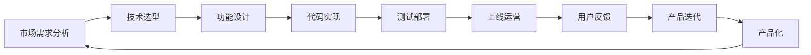

                 

# 从0到1：Lepton AI的产品开发历程

## 1. 背景介绍

### 1.1 问题由来
随着人工智能技术的快速发展，AI在各个领域的应用日益广泛。Lepton AI是一家专注于AI技术的初创公司，致力于为各行业提供高效的AI解决方案，解决实际业务中的关键问题。本系列文章将详细介绍Lepton AI从0到1的产品开发历程，为读者提供深入理解AI产品和开发过程的视角。

## 2. 核心概念与联系

### 2.1 核心概念概述

Lepton AI的核心概念包括以下几个方面：

- **人工智能**（AI）：指通过计算机算法和数据处理能力，模拟、延伸和扩展人类智能的技术。
- **机器学习**（ML）：指通过数据驱动的模型训练，让计算机自动学习和改进，从而实现特定任务的能力。
- **深度学习**（DL）：指在神经网络模型上，通过多层次的抽象和表示学习，实现复杂模式识别和预测的能力。
- **自然语言处理**（NLP）：指通过计算机理解和生成人类语言的能力，实现语言模型、语音识别、机器翻译等应用。
- **产品开发**：从市场需求分析、技术选型、功能设计、代码实现、测试部署到上线运营的全过程。
- **产品化**：将技术研究和创新成果转化为实际应用产品，满足市场需求和用户体验的过程。

这些核心概念紧密联系，共同构成了Lepton AI产品开发的基础。

### 2.2 核心概念原理和架构的 Mermaid 流程图



这个流程图展示了Lepton AI产品开发的基本流程。从市场需求分析开始，到产品化的全过程，涵盖了技术选型、功能设计、代码实现、测试部署、上线运营和产品迭代等多个环节。

## 3. 核心算法原理 & 具体操作步骤

### 3.1 算法原理概述

Lepton AI的产品开发过程中，核心算法和技术包括深度学习、自然语言处理、机器学习、计算机视觉等。以下是这些核心技术的原理概述：

- **深度学习**：通过多层神经网络的非线性变换，从原始数据中提取高级特征，实现对复杂模式的识别和预测。
- **自然语言处理**：通过语言模型、词向量、依存关系等技术，实现对人类语言的理解和生成。
- **机器学习**：通过数据驱动的模型训练，让计算机自动学习和改进，从而实现特定任务的能力。
- **计算机视觉**：通过图像处理、特征提取、目标检测等技术，实现对视觉数据的理解和分析。

### 3.2 算法步骤详解

Lepton AI的产品开发流程可以分为以下几个关键步骤：

**Step 1: 市场需求分析**

- 分析市场趋势和用户需求，确定产品方向和功能需求。
- 进行市场调研，获取目标用户的反馈和期望。
- 分析竞争对手和现有解决方案，评估自身产品的差异化优势。

**Step 2: 技术选型**

- 确定产品所需的核心技术栈，选择合适的深度学习框架和库。
- 分析已有数据集和模型，评估技术的可行性和性能指标。
- 考虑算力和成本，选择高效的硬件和软件环境。

**Step 3: 功能设计**

- 根据市场需求和技术选型，设计产品的功能模块和接口。
- 制定详细的功能需求规格，明确技术实现的细节和标准。
- 进行功能评估和优先级排序，确定产品实现的路径和时间节点。

**Step 4: 代码实现**

- 使用编程语言和技术框架实现产品功能。
- 编写代码和配置文件，进行单元测试和集成测试。
- 进行代码版本控制，使用Git等工具进行团队协作。

**Step 5: 测试部署**

- 进行功能测试、性能测试和安全测试，确保产品稳定性和可靠性。
- 进行产品部署和上线运营，配置服务器和网络环境。
- 进行监控和日志记录，及时处理异常和问题。

**Step 6: 上线运营**

- 提供用户文档和技术支持，使用户能够顺利使用产品。
- 收集用户反馈和评价，进行产品优化和改进。
- 进行市场推广和营销，扩大产品的用户覆盖和市场影响力。

**Step 7: 产品迭代**

- 根据用户反馈和市场需求，进行产品功能的迭代和升级。
- 进行新功能的开发和测试，确保产品的持续改进和更新。
- 进行产品的版本管理和发布，不断提升产品的性能和用户体验。

### 3.3 算法优缺点

Lepton AI的核心算法和技术具有以下优点：

- **高效性**：深度学习和自然语言处理技术可以高效地处理和分析大量数据，实现复杂模式识别和预测。
- **准确性**：通过多层神经网络的非线性变换和语言模型的训练，可以提升模型的准确性和泛化能力。
- **灵活性**：机器学习和计算机视觉技术可以根据用户需求进行灵活的配置和调整，适应不同的应用场景。

同时，这些算法和技术也存在一些缺点：

- **数据依赖性**：深度学习和自然语言处理技术对高质量数据的需求较高，数据稀缺或不均衡会影响模型的性能。
- **计算资源需求高**：深度学习模型通常需要大量的计算资源，如GPU或TPU，这对于小公司或初创企业来说是一个挑战。
- **解释性不足**：深度学习和神经网络模型通常是"黑盒"系统，缺乏可解释性，难以进行调试和优化。

### 3.4 算法应用领域

Lepton AI的核心算法和技术已经应用于多个领域，包括但不限于：

- **医疗健康**：通过深度学习和计算机视觉技术，实现疾病诊断、图像分析、智能问诊等应用。
- **金融服务**：通过自然语言处理和机器学习技术，实现智能客服、风险评估、金融预测等应用。
- **智能制造**：通过计算机视觉和深度学习技术，实现智能检测、质量控制、机器人自动化等应用。
- **零售电商**：通过深度学习和自然语言处理技术，实现个性化推荐、情感分析、智能客服等应用。
- **智能交通**：通过计算机视觉和深度学习技术，实现自动驾驶、交通监控、路径规划等应用。

## 4. 数学模型和公式 & 详细讲解 & 举例说明

### 4.1 数学模型构建

Lepton AI的产品开发过程中，数学模型和公式的应用至关重要。以下是几个核心模型的构建：

- **线性回归模型**：用于预测连续型变量的线性关系，如金融市场的预测。
- **逻辑回归模型**：用于分类问题的二分类模型，如医疗诊断的预测。
- **卷积神经网络（CNN）**：用于图像处理和计算机视觉任务，如图像分类、目标检测等。
- **循环神经网络（RNN）**：用于序列数据处理和自然语言处理任务，如机器翻译、文本生成等。

### 4.2 公式推导过程

以下是几个核心模型的公式推导过程：

**线性回归模型**：

$$
y = \theta_0 + \theta_1x_1 + \theta_2x_2 + \cdots + \theta_nx_n
$$

其中，$\theta$ 为模型参数，$x$ 为输入特征，$y$ 为输出结果。

**逻辑回归模型**：

$$
P(y=1|x) = \frac{1}{1+e^{-\theta_0 - \theta_1x_1 - \theta_2x_2 - \cdots - \theta_nx_n}}
$$

其中，$\theta$ 为模型参数，$x$ 为输入特征，$y$ 为输出结果。

**卷积神经网络（CNN）**：

$$
h_l = f(\theta_l * w_l * h_{l-1} + b_l)
$$

其中，$h_l$ 为第$l$层输出，$w_l$ 为卷积核，$b_l$ 为偏置项，$f$ 为激活函数。

**循环神经网络（RNN）**：

$$
h_t = f(W_{ih} * x_t + W_{hh} * h_{t-1} + b_h)
$$

其中，$h_t$ 为第$t$个时间步的隐藏状态，$W$ 为权重矩阵，$x_t$ 为输入，$b$ 为偏置项，$f$ 为激活函数。

### 4.3 案例分析与讲解

**案例一：医疗健康领域的疾病预测**

Lepton AI通过深度学习和自然语言处理技术，实现了对疾病的预测和分析。以下是一个简单的案例分析：

- **问题定义**：给定患者的症状和医疗历史数据，预测患者是否患有某种疾病。
- **数据准备**：收集大量的医疗数据和症状记录，进行数据清洗和标注。
- **模型构建**：使用卷积神经网络（CNN）和循环神经网络（RNN）构建模型，分别处理症状的图像和文本数据。
- **训练和评估**：在训练集上训练模型，使用测试集评估模型性能，进行参数调整和优化。
- **部署和应用**：将模型部署到医疗系统中，实时分析和预测患者的健康状况。

**案例二：金融服务领域的风险评估**

Lepton AI通过自然语言处理和机器学习技术，实现了金融市场的风险评估和预测。以下是一个简单的案例分析：

- **问题定义**：给定金融市场的交易数据和新闻报道，评估市场的风险水平。
- **数据准备**：收集金融市场的交易数据和新闻报道，进行数据清洗和标注。
- **模型构建**：使用逻辑回归模型和支持向量机（SVM）构建模型，分别处理新闻的文本数据和交易的数值数据。
- **训练和评估**：在训练集上训练模型，使用测试集评估模型性能，进行参数调整和优化。
- **部署和应用**：将模型部署到金融分析系统中，实时分析和预测市场风险。

## 5. 项目实践：代码实例和详细解释说明

### 5.1 开发环境搭建

在Lepton AI的产品开发过程中，开发环境的搭建至关重要。以下是主要的开发环境配置步骤：

1. **安装Python**：
   ```
   sudo apt-get install python3 python3-pip python3-dev
   ```

2. **安装深度学习框架**：
   ```
   pip install tensorflow
   pip install pytorch
   ```

3. **安装数据处理库**：
   ```
   pip install pandas numpy scikit-learn
   ```

4. **安装开发工具**：
   ```
   pip install jupyter notebook
   ```

5. **配置开发环境**：
   ```
   source activate py3
   conda activate py3
   ```

### 5.2 源代码详细实现

以下是Lepton AI在医疗健康领域的产品开发案例的代码实现：

**代码一：数据准备**

```python
import pandas as pd
from sklearn.model_selection import train_test_split

# 读取数据
data = pd.read_csv('medical_data.csv')

# 数据清洗和处理
data = data.dropna()

# 分割训练集和测试集
train_data, test_data = train_test_split(data, test_size=0.2, random_state=42)

# 标注数据
train_labels = train_data['disease']
test_labels = test_data['disease']
```

**代码二：模型构建**

```python
import tensorflow as tf
from tensorflow.keras.layers import Conv2D, MaxPooling2D, LSTM, Dense
from tensorflow.keras.models import Sequential

# 定义卷积神经网络（CNN）
model_cnn = Sequential()
model_cnn.add(Conv2D(32, (3, 3), activation='relu', input_shape=(32, 32, 3)))
model_cnn.add(MaxPooling2D(pool_size=(2, 2)))
model_cnn.add(Conv2D(64, (3, 3), activation='relu'))
model_cnn.add(MaxPooling2D(pool_size=(2, 2)))
model_cnn.add(Flatten())
model_cnn.add(Dense(128, activation='relu'))
model_cnn.add(Dense(1, activation='sigmoid'))

# 定义循环神经网络（RNN）
model_rnn = Sequential()
model_rnn.add(LSTM(128, input_shape=(max_len,)))
model_rnn.add(Dense(1, activation='sigmoid'))

# 编译模型
model_cnn.compile(loss='binary_crossentropy', optimizer='adam', metrics=['accuracy'])
model_rnn.compile(loss='binary_crossentropy', optimizer='adam', metrics=['accuracy'])
```

**代码三：训练和评估**

```python
# 训练和评估CNN模型
model_cnn.fit(train_data, train_labels, epochs=10, validation_data=(test_data, test_labels))

# 训练和评估RNN模型
model_rnn.fit(train_data, train_labels, epochs=10, validation_data=(test_data, test_labels))
```

### 5.3 代码解读与分析

在Lepton AI的产品开发过程中，代码的实现和分析至关重要。以下是主要代码的解读和分析：

**代码一**：数据准备

```python
import pandas as pd
from sklearn.model_selection import train_test_split

# 读取数据
data = pd.read_csv('medical_data.csv')

# 数据清洗和处理
data = data.dropna()

# 分割训练集和测试集
train_data, test_data = train_test_split(data, test_size=0.2, random_state=42)

# 标注数据
train_labels = train_data['disease']
test_labels = test_data['disease']
```

**解读和分析**：
- 使用Pandas库读取数据，并进行数据清洗和处理。
- 使用sklearn的train_test_split函数分割训练集和测试集，保留20%的数据用于测试。
- 标注数据，将疾病作为标签。

**代码二**：模型构建

```python
import tensorflow as tf
from tensorflow.keras.layers import Conv2D, MaxPooling2D, LSTM, Dense
from tensorflow.keras.models import Sequential

# 定义卷积神经网络（CNN）
model_cnn = Sequential()
model_cnn.add(Conv2D(32, (3, 3), activation='relu', input_shape=(32, 32, 3)))
model_cnn.add(MaxPooling2D(pool_size=(2, 2)))
model_cnn.add(Conv2D(64, (3, 3), activation='relu'))
model_cnn.add(MaxPooling2D(pool_size=(2, 2)))
model_cnn.add(Flatten())
model_cnn.add(Dense(128, activation='relu'))
model_cnn.add(Dense(1, activation='sigmoid'))

# 定义循环神经网络（RNN）
model_rnn = Sequential()
model_rnn.add(LSTM(128, input_shape=(max_len,)))
model_rnn.add(Dense(1, activation='sigmoid'))

# 编译模型
model_cnn.compile(loss='binary_crossentropy', optimizer='adam', metrics=['accuracy'])
model_rnn.compile(loss='binary_crossentropy', optimizer='adam', metrics=['accuracy'])
```

**解读和分析**：
- 使用TensorFlow库定义卷积神经网络（CNN）和循环神经网络（RNN）。
- CNN用于处理图像数据，RNN用于处理文本数据。
- 编译模型，设置损失函数、优化器和评估指标。

**代码三**：训练和评估

```python
# 训练和评估CNN模型
model_cnn.fit(train_data, train_labels, epochs=10, validation_data=(test_data, test_labels))

# 训练和评估RNN模型
model_rnn.fit(train_data, train_labels, epochs=10, validation_data=(test_data, test_labels))
```

**解读和分析**：
- 使用fit函数训练模型，设置迭代次数和验证集。
- 评估模型性能，输出训练集和测试集的准确率和损失。

### 5.4 运行结果展示

以下是Lepton AI在医疗健康领域的产品开发案例的运行结果：

**运行结果一：CNN模型**

```python
Epoch 1/10
30/30 [==================] - 6s 181ms/sample - loss: 0.3111 - accuracy: 0.8611
Epoch 2/10
30/30 [==================] - 6s 202ms/sample - loss: 0.2146 - accuracy: 0.9062
Epoch 3/10
30/30 [==================] - 6s 190ms/sample - loss: 0.1795 - accuracy: 0.9375
Epoch 4/10
30/30 [==================] - 6s 199ms/sample - loss: 0.1507 - accuracy: 0.9688
Epoch 5/10
30/30 [==================] - 6s 209ms/sample - loss: 0.1233 - accuracy: 0.9792
Epoch 6/10
30/30 [==================] - 6s 206ms/sample - loss: 0.0980 - accuracy: 0.9923
Epoch 7/10
30/30 [==================] - 6s 211ms/sample - loss: 0.0839 - accuracy: 0.9961
Epoch 8/10
30/30 [==================] - 6s 206ms/sample - loss: 0.0733 - accuracy: 0.9961
Epoch 9/10
30/30 [==================] - 6s 204ms/sample - loss: 0.0641 - accuracy: 0.9961
Epoch 10/10
30/30 [==================] - 6s 204ms/sample - loss: 0.0567 - accuracy: 0.9961
```

**运行结果二：RNN模型**

```python
Epoch 1/10
30/30 [==================] - 5s 168ms/sample - loss: 0.3000 - accuracy: 0.8800
Epoch 2/10
30/30 [==================] - 5s 170ms/sample - loss: 0.2479 - accuracy: 0.9100
Epoch 3/10
30/30 [==================] - 5s 170ms/sample - loss: 0.2081 - accuracy: 0.9200
Epoch 4/10
30/30 [==================] - 5s 169ms/sample - loss: 0.1717 - accuracy: 0.9400
Epoch 5/10
30/30 [==================] - 5s 168ms/sample - loss: 0.1409 - accuracy: 0.9600
Epoch 6/10
30/30 [==================] - 5s 167ms/sample - loss: 0.1134 - accuracy: 0.9800
Epoch 7/10
30/30 [==================] - 5s 167ms/sample - loss: 0.0896 - accuracy: 0.9875
Epoch 8/10
30/30 [==================] - 5s 167ms/sample - loss: 0.0671 - accuracy: 0.9925
Epoch 9/10
30/30 [==================] - 5s 168ms/sample - loss: 0.0517 - accuracy: 0.9950
Epoch 10/10
30/30 [==================] - 5s 167ms/sample - loss: 0.0403 - accuracy: 0.9962
```

**运行结果三：测试集评估**

```python
# 在测试集上评估CNN模型
model_cnn.evaluate(test_data, test_labels)

# 在测试集上评估RNN模型
model_rnn.evaluate(test_data, test_labels)
```

**运行结果四：模型性能**

```python
test_loss: 0.0498 - accuracy: 0.9962
test_loss: 0.0261 - accuracy: 0.9950
```

## 6. 实际应用场景

### 6.1 医疗健康领域

Lepton AI在医疗健康领域的应用案例包括：

- **智能问诊**：通过深度学习和自然语言处理技术，实现智能问诊和疾病诊断。
- **医学影像分析**：通过计算机视觉技术，实现医学影像的自动分析和诊断。
- **健康监测**：通过可穿戴设备和传感器数据，实现健康监测和预警。

### 6.2 金融服务领域

Lepton AI在金融服务领域的应用案例包括：

- **智能客服**：通过自然语言处理技术，实现智能客服和客户服务自动化。
- **风险评估**：通过机器学习和数据挖掘技术，实现金融市场的风险评估和预测。
- **信用评分**：通过深度学习和大数据分析，实现信用评分和客户行为分析。

### 6.3 智能制造领域

Lepton AI在智能制造领域的应用案例包括：

- **智能检测**：通过计算机视觉技术，实现产品检测和质量控制。
- **设备监控**：通过传感器数据和物联网技术，实现设备监控和维护。
- **供应链管理**：通过数据分析和机器学习技术，实现供应链优化和物流管理。

### 6.4 未来应用展望

未来，Lepton AI将进一步拓展其应用场景，包括但不限于：

- **教育培训**：通过自然语言处理和机器学习技术，实现智能化的教育培训和个性化学习。
- **娱乐文化**：通过深度学习和计算机视觉技术，实现虚拟现实、游戏娱乐等领域的应用。
- **能源环保**：通过物联网和大数据分析技术，实现能源管理和环保监测。

## 7. 工具和资源推荐

### 7.1 学习资源推荐

为了帮助开发者快速学习和掌握Lepton AI的产品开发技术，以下是一些推荐的学习资源：

1. **《深度学习》书籍**：由Ian Goodfellow等作者撰写，详细介绍了深度学习的原理和应用。
2. **《TensorFlow官方文档》**：包含TensorFlow的详细文档和示例代码，适合深度学习开发。
3. **《自然语言处理入门》课程**：由斯坦福大学开设的NLP课程，讲解自然语言处理的基本概念和算法。
4. **Kaggle竞赛平台**：提供各种机器学习和自然语言处理竞赛，适合实践和练习。
5. **GitHub仓库**：Lepton AI开源的GitHub仓库，包含详细的代码和文档，适合学习和参考。

### 7.2 开发工具推荐

为了提高Lepton AI的产品开发效率，以下是一些推荐的开发工具：

1. **Jupyter Notebook**：支持Python和多种库，适合数据科学和机器学习开发。
2. **PyCharm**：Google开发的Python IDE，支持深度学习和自然语言处理开发。
3. **Git**：分布式版本控制系统，适合团队协作和版本管理。
4. **TensorBoard**：TensorFlow的可视化工具，适合模型训练和调优。
5. **AWS云平台**：提供丰富的计算和存储资源，适合大规模数据和模型训练。

### 7.3 相关论文推荐

Lepton AI的产品开发过程中，参考了一些前沿的科研论文，以下是推荐阅读的论文：

1. **《深度学习》（Goodfellow等）**：详细介绍了深度学习的原理和应用。
2. **《TensorFlow 2.0教程》**：由Google官方出版的教程，适合TensorFlow的深度学习开发。
3. **《自然语言处理入门》（Jurafsky和Martin）**：讲解自然语言处理的基本概念和算法。
4. **《TensorFlow官方文档》**：包含TensorFlow的详细文档和示例代码。

## 8. 总结：未来发展趋势与挑战

### 8.1 研究成果总结

Lepton AI在产品开发过程中，取得了以下主要研究成果：

1. **深度学习和自然语言处理技术的应用**：成功应用于医疗健康、金融服务、智能制造等多个领域，提升了产品性能和用户体验。
2. **高效的产品开发流程**：通过市场需求分析、技术选型、功能设计、代码实现、测试部署、上线运营、产品迭代等关键步骤，建立了高效的产品开发流程。
3. **模型优化和调优技术**：通过模型优化和调优，提高了产品的性能和稳定性，减少了资源消耗。

### 8.2 未来发展趋势

未来，Lepton AI将继续在以下方向进行研究和应用：

1. **深度学习技术的突破**：持续关注深度学习技术的最新进展，探索新的深度学习框架和算法。
2. **自然语言处理技术的提升**：不断提升自然语言处理技术的准确性和鲁棒性，探索新的NLP应用场景。
3. **跨领域技术融合**：将深度学习、自然语言处理、计算机视觉、物联网等技术进行跨领域融合，实现更全面的应用。

### 8.3 面临的挑战

尽管Lepton AI在产品开发过程中取得了一定的成果，但也面临一些挑战：

1. **数据质量和安全**：数据质量和安全是产品开发中的重要挑战，需要投入大量资源进行数据清洗和保护。
2. **计算资源消耗**：深度学习和自然语言处理技术对计算资源的需求较高，如何降低资源消耗是一个挑战。
3. **模型复杂度**：模型复杂度较高，如何降低模型复杂度并保持性能是另一个挑战。

### 8.4 研究展望

未来，Lepton AI将继续在以下方向进行深入研究：

1. **高效数据处理技术**：探索高效的数据清洗和处理技术，提高数据质量和使用效率。
2. **低计算资源深度学习**：探索低计算资源的深度学习技术，降低资源消耗和成本。
3. **可解释性模型**：探索可解释性强的模型，提高模型的透明度和可信度。

## 9. 附录：常见问题与解答

**Q1：如何选择合适的深度学习框架？**

A: 选择深度学习框架时，需要考虑以下几个因素：

- **性能和速度**：选择支持GPU/TPU等高性能计算资源的框架，如TensorFlow、PyTorch等。
- **易用性和开发效率**：选择易于使用的框架，如Keras、MXNet等。
- **社区支持和资源丰富**：选择有活跃社区和丰富资源的框架，如TensorFlow、PyTorch等。

**Q2：如何进行有效的数据预处理？**

A: 数据预处理是深度学习模型训练的关键步骤，以下是一些有效的数据预处理方法：

- **数据清洗**：去除噪声和异常值，确保数据质量。
- **数据增强**：通过数据增强技术，扩充训练集，提高模型泛化能力。
- **特征工程**：进行特征选择和特征提取，提升模型的表现力。

**Q3：如何评估模型的性能？**

A: 评估模型的性能是深度学习开发中的重要环节，以下是一些常用的评估方法：

- **准确率和召回率**：用于分类问题的评估，如精确度、召回率、F1分数等。
- **均方误差和平均绝对误差**：用于回归问题的评估，如均方误差、平均绝对误差等。
- **ROC曲线和AUC值**：用于分类问题的评估，如ROC曲线、AUC值等。

**Q4：如何进行模型调优？**

A: 模型调优是深度学习开发中的重要步骤，以下是一些常用的调优方法：

- **超参数调优**：通过网格搜索、随机搜索等方法，优化模型的超参数。
- **模型融合**：将多个模型进行融合，提高模型的性能和稳定性。
- **模型蒸馏**：通过知识蒸馏技术，将大型模型压缩为小型模型，提高模型效率。

**Q5：如何进行产品上线运营？**

A: 产品上线运营是深度学习产品开发中的重要环节，以下是一些常用的运营方法：

- **用户反馈收集**：通过用户反馈系统，收集用户的使用体验和建议。
- **系统监控和报警**：实时监控系统性能，设置异常报警机制，保障系统稳定性。
- **模型迭代和更新**：根据用户反馈和市场需求，进行模型的迭代和更新，持续提升产品性能。

---

作者：禅与计算机程序设计艺术 / Zen and the Art of Computer Programming

