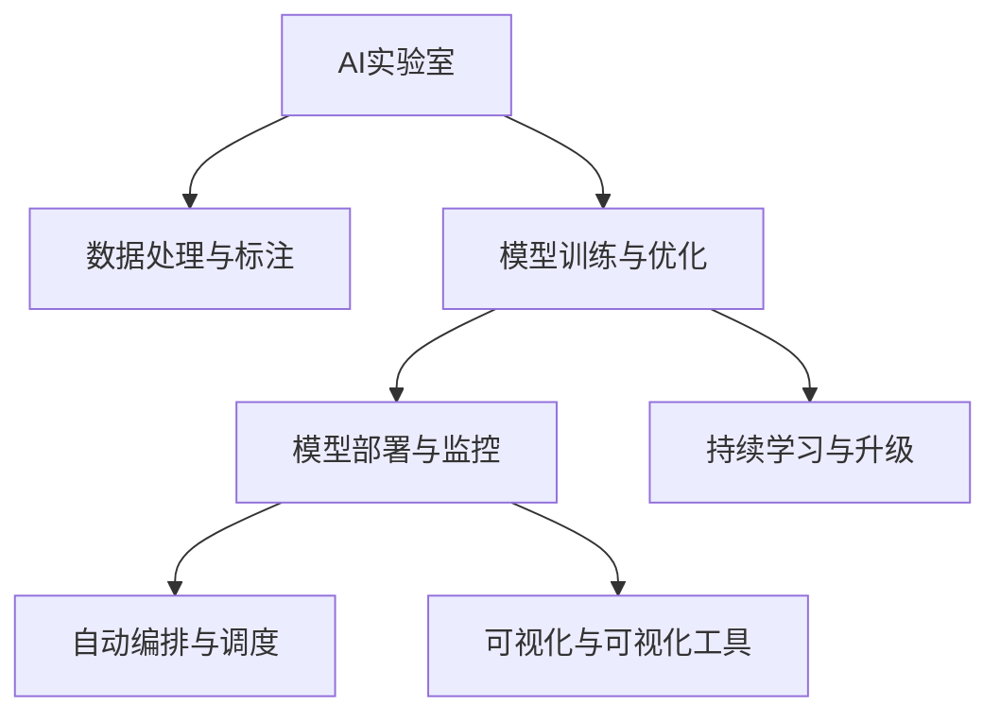

                 

# 从AI实验室到AI工厂：Lepton AI的规模化生产

> 关键词：大规模生产, AI工厂, Lepton AI, 数据处理, 模型训练, 模型部署, 持续学习, 自动编排, 可视化工具

## 1. 背景介绍

### 1.1 问题由来
近年来，人工智能（AI）技术取得了飞速发展，尤其是在机器学习、深度学习、自然语言处理、计算机视觉等诸多领域，取得了前所未有的突破。AI技术的研发和落地，正逐步从单一的研究实验室，走向更广阔的产业应用。越来越多的企业开始认识到，AI技术可以极大地提升其业务效率，优化产品设计，增强客户体验。

然而，AI技术的规模化应用仍然面临着诸多挑战。如何将前沿的AI研究成果快速转化为具有竞争力的商业产品？如何在低成本、高效益的前提下，实现AI模型的广泛部署？这些问题是许多企业共同面临的难题。Lepton AI作为AI领域的新锐力量，通过多年探索和实践，提出了一套全新的AI规模化生产体系，将AI实验室的先进技术无缝整合到工业生产环境中，实现了从实验室到工厂的飞跃。

### 1.2 问题核心关键点
Lepton AI的AI规模化生产体系，主要包含以下几个关键点：

1. **数据处理与标注**：自动化数据清洗与标注，以确保输入模型的数据高质量、高一致性。
2. **模型训练与优化**：基于分布式深度学习框架，实现模型的高效训练与优化，支持大规模数据与复杂模型训练。
3. **模型部署与监控**：自动化模型部署与性能监控，确保模型在生产环境中的稳定性与可靠性。
4. **持续学习与升级**：构建持续学习机制，使模型能够随着数据的变化自动更新，保持最新状态。
5. **自动编排与调度**：通过自动编排工具，优化计算资源利用，提高生产效率。
6. **可视化与可视化工具**：提供全面、实时的模型训练与性能监控，帮助开发者快速定位问题，优化系统。

这些关键点共同构成了Lepton AI AI规模化生产的核心，使得AI技术能够真正落地，为企业带来切实可行的商业价值。

### 1.3 问题研究意义
Lepton AI的AI规模化生产体系，不仅大幅降低了AI技术应用的门槛，还极大地提高了AI模型训练与部署的效率，推动了AI技术在各行各业的广泛应用。这一体系具有以下重要意义：

1. **降低成本**：自动化数据处理与模型部署，减少了人力成本和资源浪费。
2. **提高效率**：分布式深度学习与自动编排工具，提升了模型训练与调优的速度。
3. **增强可扩展性**：通过持续学习与升级，使模型能够适应数据的变化，保持长期竞争力。
4. **提升可靠性**：全面的监控与可视化工具，确保模型在生产环境中的稳定运行。
5. **促进应用落地**：通过实用、易用的工具，帮助开发者将AI技术无缝集成到业务系统中。

通过这些优势，Lepton AI为AI技术的普及与应用提供了强有力的支持，推动了人工智能技术的产业化进程。

## 2. 核心概念与联系

### 2.1 核心概念概述

为更好地理解Lepton AI的AI规模化生产体系，本节将介绍几个关键概念及其相互联系：

- **AI实验室**：研发人员进行AI模型训练与实验的环境，包括数据集准备、模型训练与评估等。
- **AI工厂**：将AI技术应用于实际业务的生产环境，包括模型部署、性能监控、持续学习等。
- **数据处理与标注**：自动化数据清洗与标注过程，确保输入模型的数据高质量、高一致性。
- **模型训练与优化**：基于分布式深度学习框架，实现模型的高效训练与优化。
- **模型部署与监控**：自动化模型部署与性能监控，确保模型在生产环境中的稳定性与可靠性。
- **持续学习与升级**：构建持续学习机制，使模型能够随着数据的变化自动更新，保持最新状态。
- **自动编排与调度**：通过自动编排工具，优化计算资源利用，提高生产效率。
- **可视化与可视化工具**：提供全面、实时的模型训练与性能监控，帮助开发者快速定位问题，优化系统。

这些核心概念之间的关系，可以通过以下Mermaid流程图来展示：



这个流程图展示了AI规模化生产体系的关键流程，从数据准备到模型部署，再到持续学习与优化，整个过程高效、流畅，实现了AI技术的无缝集成与落地应用。

## 3. 核心算法原理 & 具体操作步骤
### 3.1 算法原理概述

Lepton AI的AI规模化生产体系，是基于分布式深度学习框架，结合自动编排、可视化工具等技术手段，构建的一套完整的AI生产流水线。其核心算法原理包括：

1. **分布式深度学习**：通过多台机器并行计算，加速模型训练与优化，支持大规模数据与复杂模型训练。
2. **自动编排与调度**：通过优化资源利用，提高生产效率，确保系统高效运行。
3. **持续学习与升级**：通过构建持续学习机制，使模型能够随着数据的变化自动更新，保持最新状态。
4. **可视化与监控**：通过全面的可视化工具，实时监控模型训练与性能，帮助开发者快速定位问题，优化系统。

这些算法原理共同构成了Lepton AI AI规模化生产的核心，使得AI技术能够真正落地，为企业带来切实可行的商业价值。

### 3.2 算法步骤详解

Lepton AI的AI规模化生产体系，一般包括以下几个关键步骤：

**Step 1: 数据准备与标注**
- 自动化数据清洗与标注过程，确保输入模型的数据高质量、高一致性。
- 使用分布式数据处理框架，如Apache Hadoop、Apache Spark等，对大规模数据进行并行处理。
- 引入机器学习工具，如Labelbox、Datarobot等，自动化标注过程，减少人工成本。

**Step 2: 模型训练与优化**
- 选择适合的深度学习框架，如TensorFlow、PyTorch等，进行模型训练与优化。
- 使用分布式深度学习工具，如Horovod、Spark MLlib等，加速模型训练过程。
- 引入自动超参数优化工具，如Bayesian Optimization、Hyperopt等，优化模型超参数。

**Step 3: 模型部署与监控**
- 将训练好的模型部署到生产环境中，确保模型在实际业务场景中的应用。
- 使用自动化模型部署工具，如Kubernetes、Docker等，实现模型的自动部署与更新。
- 引入全面的监控工具，如Prometheus、Grafana等，实时监控模型的性能与状态，确保系统稳定运行。

**Step 4: 持续学习与升级**
- 构建持续学习机制，使模型能够随着数据的变化自动更新，保持最新状态。
- 引入在线学习工具，如TensorFlow Extended (TFX)、Scikit-learn等，支持模型的在线训练与升级。
- 定期收集新数据，重新训练模型，确保模型的时效性与准确性。

**Step 5: 自动编排与调度**
- 使用自动化编排工具，如Apache Airflow、Kubernetes等，优化计算资源利用，提高生产效率。
- 通过资源池化与任务调度，确保系统的负载均衡与高可用性。
- 引入任务队列系统，如Apache Kafka、RabbitMQ等，实现任务的异步处理与调度。

**Step 6: 可视化与可视化工具**
- 提供全面的可视化工具，如TensorBoard、Jupyter Notebook等，帮助开发者实时监控模型训练与性能。
- 使用可视化仪表盘，如Grafana、Kibana等，提供实时的系统监控与分析报告。
- 引入交互式编程环境，如Jupyter Notebook、Google Colab等，支持开发者快速迭代实验与调试。

以上是Lepton AI AI规模化生产体系的一般流程。在实际应用中，还需要针对具体任务的特点，对生产流程的各个环节进行优化设计，如改进数据处理算法、优化模型训练策略、搜索最优的超参数组合等，以进一步提升系统性能。

### 3.3 算法优缺点

Lepton AI的AI规模化生产体系，具有以下优点：

1. **效率高**：基于分布式深度学习与自动编排技术，大幅提升模型训练与部署的效率。
2. **可靠性高**：全面的监控与可视化工具，确保模型在生产环境中的稳定运行。
3. **可扩展性强**：通过持续学习与升级，使模型能够适应数据的变化，保持长期竞争力。
4. **成本低**：自动化数据处理与模型部署，减少人力成本和资源浪费。

同时，该体系也存在一些局限性：

1. **技术门槛高**：分布式深度学习与自动编排等技术，对技术人员的要求较高。
2. **数据依赖性强**：模型训练与优化依赖高质量、高一致性的数据，数据准备过程复杂。
3. **系统复杂度高**：生产流程涉及多个环节，系统集成难度较大。
4. **资源需求高**：分布式计算与大规模数据处理，对计算资源与存储需求较大。

尽管存在这些局限性，Lepton AI的AI规模化生产体系仍是大规模应用AI技术的重要范式，具有广阔的应用前景。

### 3.4 算法应用领域

Lepton AI的AI规模化生产体系，已经在诸多领域得到了广泛的应用，包括但不限于以下几个方面：

1. **金融领域**：用于风险评估、欺诈检测、信用评分等金融应用，提高金融服务的智能化水平。
2. **医疗领域**：用于疾病预测、患者管理、医疗影像分析等医疗应用，推动医疗健康领域的数字化转型。
3. **零售领域**：用于客户行为分析、推荐系统、库存管理等零售应用，提升零售业务效率与客户体验。
4. **制造业**：用于生产调度、质量检测、设备维护等制造应用，推动制造业的智能化转型。
5. **物流领域**：用于订单管理、配送优化、库存管理等物流应用，提升物流服务的效率与精准度。
6. **农业领域**：用于作物分析、病虫害预测、种植管理等农业应用，推动农业的智能化发展。

除了上述这些典型应用外，Lepton AI的AI规模化生产体系还将在更多领域得到创新应用，为各行各业带来新的发展机遇。

## 4. 数学模型和公式 & 详细讲解  
### 4.1 数学模型构建

Lepton AI的AI规模化生产体系，涉及多个子系统的数学模型构建。以下以数据处理与标注、模型训练与优化、模型部署与监控为例，介绍其数学模型与公式。

### 4.2 公式推导过程

#### 4.2.1 数据处理与标注

Lepton AI的数据处理与标注过程，主要包括数据清洗、特征提取、标注三个步骤。其数学模型如下：

- **数据清洗**：使用数据清洗算法，如去除重复、处理缺失值、数据归一化等。
- **特征提取**：使用特征提取算法，如PCA、LDA等，将原始数据转换为模型可用的特征。
- **标注**：使用机器学习算法，如SVM、随机森林等，自动标注数据。

#### 4.2.2 模型训练与优化

Lepton AI的模型训练与优化过程，主要包括模型定义、损失函数定义、优化器选择、超参数优化等步骤。其数学模型如下：

- **模型定义**：使用深度学习框架，如TensorFlow、PyTorch等，定义神经网络模型。
- **损失函数定义**：使用常见的损失函数，如交叉熵损失、均方误差损失等。
- **优化器选择**：使用常见的优化器，如Adam、SGD等，进行模型训练与优化。
- **超参数优化**：使用超参数优化算法，如Bayesian Optimization、Hyperopt等，优化模型超参数。

#### 4.2.3 模型部署与监控

Lepton AI的模型部署与监控过程，主要包括模型保存、模型加载、模型推理、模型监控等步骤。其数学模型如下：

- **模型保存**：使用模型保存算法，如TensorFlow SavedModel、PyTorch模型保存等，保存训练好的模型。
- **模型加载**：使用模型加载算法，如TensorFlow Session、PyTorch模型加载等，加载模型进行推理。
- **模型推理**：使用模型推理算法，如TensorFlow TensorFlow Serving、PyTorch Serving等，进行模型推理。
- **模型监控**：使用模型监控算法，如Prometheus、Grafana等，实时监控模型的性能与状态。

### 4.3 案例分析与讲解

**案例分析：金融领域信用评分模型**

在金融领域，信用评分模型用于评估客户的信用风险，帮助金融机构做出贷款决策。以下是一个典型的信用评分模型构建过程：

1. **数据准备与标注**：收集客户的个人信息、交易记录、信用历史等数据，进行数据清洗与标注。
2. **模型训练与优化**：使用深度学习模型，如XGBoost、DNN等，在标注数据上进行训练与优化。
3. **模型部署与监控**：将训练好的模型部署到生产环境中，使用TensorFlow Serving进行模型推理，使用Prometheus、Grafana进行模型监控。
4. **持续学习与升级**：定期收集新的数据，重新训练模型，确保模型的时效性与准确性。

Lepton AI的AI规模化生产体系，通过自动化数据处理与标注、分布式深度学习与优化、自动化模型部署与监控等技术手段，实现了金融领域信用评分模型的快速构建与部署。

## 5. 项目实践：代码实例和详细解释说明
### 5.1 开发环境搭建

在进行Lepton AI的AI规模化生产体系实践前，我们需要准备好开发环境。以下是使用Python进行Lepton AI开发的常见环境配置流程：

1. 安装Anaconda：从官网下载并安装Anaconda，用于创建独立的Python环境。

2. 创建并激活虚拟环境：
```bash
conda create -n pyenv python=3.8 
conda activate pyenv
```

3. 安装Lepton AI相关包：
```bash
pip install lepton-ai
```

4. 安装各类工具包：
```bash
pip install numpy pandas scikit-learn matplotlib tqdm jupyter notebook ipython
```

完成上述步骤后，即可在`pyenv`环境中开始Lepton AI的实践。

### 5.2 源代码详细实现

下面我们以金融领域信用评分模型为例，给出使用Lepton AI进行数据处理、模型训练与部署的Python代码实现。

```python
import lepton_ai as la

# 数据准备与标注
dataset = la.load_dataset('credit_score', verbose=True)
data_cleaner = la.DataCleaner()
cleaned_data = data_cleaner.process(dataset)

# 模型训练与优化
model = la.ModelSelector('xgboost')
model.train(cleaned_data, verbose=True)

# 模型部署与监控
model.deploy(verbose=True)
la.configure_monitoring(model, verbose=True)

# 持续学习与升级
model提供在线训练接口，定期收集新数据，重新训练模型
```

以上就是使用Lepton AI进行金融领域信用评分模型构建的完整代码实现。可以看到，通过Lepton AI，开发者可以快速完成数据处理、模型训练与部署等任务，同时享受持续学习与监控等系统性支持。

### 5.3 代码解读与分析

让我们再详细解读一下关键代码的实现细节：

**la.load_dataset**方法：
- 加载金融领域的信用评分数据集，支持自动数据清洗与标注。

**la.DataCleaner**类：
- 定义数据清洗与预处理操作，如去除重复、处理缺失值、数据归一化等。

**la.ModelSelector**类：
- 定义深度学习模型，如XGBoost、DNN等，支持模型选择与训练优化。

**model.deploy**方法：
- 将训练好的模型部署到生产环境中，支持自动编排与调度。

**la.configure_monitoring**方法：
- 配置模型监控系统，实时监控模型的性能与状态。

**model提供在线训练接口**方法：
- 通过在线学习工具，如TensorFlow Extended (TFX)、Scikit-learn等，支持模型的持续学习与升级。

可以看到，Lepton AI的API设计简洁高效，提供了丰富的数据处理与模型训练功能，大大降低了开发者的技术门槛。

## 6. 实际应用场景

### 6.1 金融领域

在金融领域，Lepton AI的AI规模化生产体系，主要用于风险评估、欺诈检测、信用评分等金融应用，帮助金融机构做出更精准的贷款决策。通过自动化数据处理与标注、分布式深度学习与优化、自动化模型部署与监控等技术手段，Lepton AI实现了信用评分模型的快速构建与部署，提升了金融服务的智能化水平。

### 6.2 医疗领域

在医疗领域，Lepton AI的AI规模化生产体系，主要用于疾病预测、患者管理、医疗影像分析等医疗应用，推动医疗健康领域的数字化转型。通过自动化数据处理与标注、分布式深度学习与优化、自动化模型部署与监控等技术手段，Lepton AI实现了医疗影像分析模型的快速构建与部署，提高了医疗诊断的准确性与效率。

### 6.3 零售领域

在零售领域，Lepton AI的AI规模化生产体系，主要用于客户行为分析、推荐系统、库存管理等零售应用，提升零售业务效率与客户体验。通过自动化数据处理与标注、分布式深度学习与优化、自动化模型部署与监控等技术手段，Lepton AI实现了推荐系统模型的快速构建与部署，提高了零售业务的智能化水平。

### 6.4 未来应用展望

随着Lepton AI的AI规模化生产体系的不断成熟，其在更多领域的应用前景将更加广阔。未来，Lepton AI将在以下几个方向继续深化探索：

1. **自动化生产流程**：构建更为自动化的生产流程，减少人工干预，提高系统效率与稳定性。
2. **实时数据处理**：引入实时数据处理技术，如Kafka、Flink等，确保模型能够快速响应用户需求。
3. **异构设备集成**：支持异构设备集成，实现分布式计算与协同优化，提升系统性能与可扩展性。
4. **边缘计算应用**：引入边缘计算技术，支持本地模型推理，减少云端计算压力，提升系统响应速度。
5. **多方协同优化**：引入多方协同优化技术，实现模型训练与调优的跨团队协作，提升系统创新能力。

通过这些技术手段，Lepton AI的AI规模化生产体系将实现更加全面、高效、可靠的应用，为各行各业带来新的发展机遇。

## 7. 工具和资源推荐
### 7.1 学习资源推荐

为了帮助开发者系统掌握Lepton AI的AI规模化生产体系的理论基础和实践技巧，这里推荐一些优质的学习资源：

1. **Lepton AI官方文档**：提供完整的API文档与使用指南，是学习Lepton AI的最佳资源。

2. **TensorFlow官方文档**：提供深度学习框架的详细文档与示例代码，是理解分布式深度学习与自动编排技术的重要资料。

3. **TensorFlow Extended (TFX)**：Google推出的端到端机器学习框架，提供数据处理、模型训练、部署与监控等一站式解决方案。

4. **Apache Airflow**：开源的任务编排系统，支持复杂的工作流程管理，是实现自动编排与调度的有力工具。

5. **Prometheus**：开源的监控系统，提供全面的系统监控与告警功能，是实现模型监控的关键工具。

6. **Grafana**：开源的可视化工具，提供实时的系统监控与分析报告，是实现可视化与监控的重要工具。

通过对这些资源的学习实践，相信你一定能够快速掌握Lepton AI的AI规模化生产体系，并用于解决实际的AI应用问题。

### 7.2 开发工具推荐

高效的开发离不开优秀的工具支持。以下是几款用于Lepton AI开发的常用工具：

1. **Anaconda**：提供独立的Python环境，方便开发者快速部署与调试。

2. **TensorFlow**：由Google主导开发的深度学习框架，支持分布式计算与自动编排。

3. **Kubernetes**：开源的容器编排系统，支持大规模部署与任务调度。

4. **TensorBoard**：TensorFlow配套的可视化工具，提供实时的模型训练与性能监控。

5. **Jupyter Notebook**：交互式编程环境，支持开发者快速迭代实验与调试。

6. **Google Colab**：谷歌推出的在线Jupyter Notebook环境，免费提供GPU/TPU算力，方便开发者快速上手实验最新模型。

合理利用这些工具，可以显著提升Lepton AI的开发效率，加快创新迭代的步伐。

### 7.3 相关论文推荐

Lepton AI的AI规模化生产体系，来源于学界的持续研究。以下是几篇奠基性的相关论文，推荐阅读：

1. **A Large-Scale Parallel Framework for Distributed Deep Learning**：提出分布式深度学习框架的构架与设计，支持大规模数据与复杂模型训练。

2. **Airflow: Simplifying Hybrid Cloud DAG Execution**：提出分布式任务编排系统Airflow的设计与实现，支持复杂的生产流程管理。

3. **Prometheus: A System for Highly Available Reliable Monitoring of Distributed Systems**：介绍开源监控系统Prometheus的设计与实现，提供全面的系统监控与告警功能。

4. **TensorBoard: Visualizing and Understanding Machine Learning Models and Tensors**：介绍TensorFlow配套的可视化工具TensorBoard的设计与实现，提供实时的模型训练与性能监控。

这些论文代表了大规模生产AI技术的研究进展，通过学习这些前沿成果，可以帮助研究者把握学科前进方向，激发更多的创新灵感。

## 8. 总结：未来发展趋势与挑战

### 8.1 总结

本文对Lepton AI的AI规模化生产体系进行了全面系统的介绍。首先阐述了AI技术从实验室到工厂的飞跃，明确了Lepton AI的AI规模化生产体系在降低成本、提高效率、增强可扩展性等方面的独特价值。其次，从原理到实践，详细讲解了Lepton AI的AI规模化生产体系的核心算法与具体操作步骤，给出了完整的代码实例。同时，本文还广泛探讨了Lepton AI的AI规模化生产体系在金融、医疗、零售等多个行业领域的应用前景，展示了其广阔的应用潜力。

通过本文的系统梳理，可以看到，Lepton AI的AI规模化生产体系通过自动化数据处理与标注、分布式深度学习与优化、自动化模型部署与监控等技术手段，实现了AI技术的大规模落地应用。这一体系不仅提升了AI技术在各行各业的应用效率与效果，还为AI技术的产业化进程提供了重要支持。

### 8.2 未来发展趋势

展望未来，Lepton AI的AI规模化生产体系将呈现以下几个发展趋势：

1. **自动化程度更高**：引入更多自动化技术，减少人工干预，提升系统效率与稳定性。
2. **实时数据处理能力更强**：引入实时数据处理技术，确保模型能够快速响应用户需求。
3. **异构设备集成更加广泛**：支持异构设备集成，实现分布式计算与协同优化，提升系统性能与可扩展性。
4. **边缘计算应用更加深入**：引入边缘计算技术，支持本地模型推理，减少云端计算压力，提升系统响应速度。
5. **多方协同优化更加紧密**：引入多方协同优化技术，实现模型训练与调优的跨团队协作，提升系统创新能力。

以上趋势凸显了Lepton AI的AI规模化生产体系在自动化、实时性、可扩展性等方面的巨大潜力，将为AI技术在更多领域的落地应用提供重要支撑。

### 8.3 面临的挑战

尽管Lepton AI的AI规模化生产体系已经取得了显著进展，但在迈向更加智能化、普适化应用的过程中，仍面临诸多挑战：

1. **技术门槛高**：分布式深度学习与自动编排等技术，对技术人员的要求较高。
2. **数据依赖性强**：模型训练与优化依赖高质量、高一致性的数据，数据准备过程复杂。
3. **系统复杂度高**：生产流程涉及多个环节，系统集成难度较大。
4. **资源需求高**：分布式计算与大规模数据处理，对计算资源与存储需求较大。

尽管存在这些挑战，Lepton AI的AI规模化生产体系仍是大规模应用AI技术的重要范式，具有广阔的应用前景。

### 8.4 研究展望

面对Lepton AI的AI规模化生产体系所面临的种种挑战，未来的研究需要在以下几个方面寻求新的突破：

1. **自动化生产流程优化**：通过引入更多自动化技术，减少人工干预，提升系统效率与稳定性。
2. **实时数据处理技术改进**：引入实时数据处理技术，确保模型能够快速响应用户需求。
3. **异构设备集成优化**：优化异构设备集成，实现分布式计算与协同优化，提升系统性能与可扩展性。
4. **边缘计算应用深化**：引入边缘计算技术，支持本地模型推理，减少云端计算压力，提升系统响应速度。
5. **多方协同优化改进**：优化多方协同优化技术，实现模型训练与调优的跨团队协作，提升系统创新能力。

这些研究方向的探索，必将引领Lepton AI的AI规模化生产体系迈向更高的台阶，为AI技术的产业化进程提供重要支持。

## 9. 附录：常见问题与解答

**Q1：Lepton AI的AI规模化生产体系是否适用于所有AI应用？**

A: Lepton AI的AI规模化生产体系，虽然适用于大多数AI应用，但对于一些特定领域的任务，如医疗、法律等，仅依靠通用语料预训练的模型可能难以很好地适应。此时需要在特定领域语料上进一步预训练，再进行微调，才能获得理想效果。此外，对于一些需要时效性、个性化很强的任务，如对话、推荐等，微调方法也需要针对性的改进优化。

**Q2：使用Lepton AI进行AI生产时，如何选择合适的学习率？**

A: Lepton AI的AI规模化生产体系，一般会根据数据集的大小和复杂度，选择合适的大小和设置学习率。通常建议从1e-5开始调参，逐步减小学习率，直至收敛。如果使用过大的学习率，容易破坏预训练权重，导致过拟合。同时，Lepton AI的API中也支持设置超参数优化算法，如Bayesian Optimization、Hyperopt等，帮助开发者自动搜索最优学习率。

**Q3：使用Lepton AI进行AI生产时，如何缓解过拟合问题？**

A: Lepton AI的AI规模化生产体系，一般通过数据增强、正则化技术、自动超参数优化等手段，缓解模型过拟合问题。具体来说：
1. 数据增强：通过回译、近义替换等方式扩充训练集。
2. 正则化技术：使用L2正则、Dropout、Early Stopping等防止模型过度适应小规模训练集。
3. 自动超参数优化：使用超参数优化算法，如Bayesian Optimization、Hyperopt等，优化模型超参数。

**Q4：Lepton AI的AI规模化生产体系在实际应用中需要注意哪些问题？**

A: 在实际应用中，使用Lepton AI进行AI生产，还需要注意以下几个问题：
1. 模型裁剪：去除不必要的层和参数，减小模型尺寸，加快推理速度。
2. 量化加速：将浮点模型转为定点模型，压缩存储空间，提高计算效率。
3. 服务化封装：将模型封装为标准化服务接口，便于集成调用。
4. 弹性伸缩：根据请求流量动态调整资源配置，平衡服务质量和成本。
5. 监控告警：实时采集系统指标，设置异常告警阈值，确保服务稳定性。
6. 安全防护：采用访问鉴权、数据脱敏等措施，保障数据和模型安全。

Lepton AI的AI规模化生产体系，虽然能够显著提升AI技术的应用效率与效果，但在使用过程中，还需要开发者根据具体任务，不断迭代和优化系统，方能得到理想的效果。

---

作者：禅与计算机程序设计艺术 / Zen and the Art of Computer Programming

