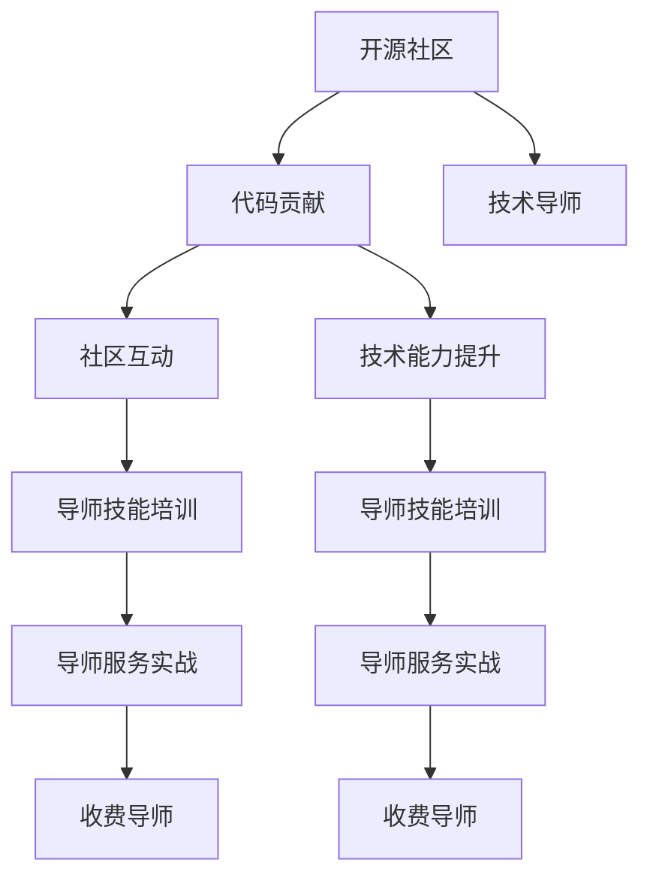

                 

# 从代码贡献到付费mentoring：程序员的导师之路

> 关键词：mentoring, 开源社区, 代码贡献, 导师经验, 职业发展

## 1. 背景介绍

### 1.1 问题由来
近年来，开源社区在技术生态系统中占据了重要地位，成为技术交流、知识共享和项目协作的天然平台。在开源项目中，编程技术被视为一种交流语言，程序员通过代码贡献、问题解决、项目维护等方式进行交流和合作。然而，技术的高速发展和复杂性提升，使得新手程序员难以在短时间内掌握复杂技术栈和最佳实践。

为了解决这一问题，越来越多的高级程序员开始转向导师角色，通过一对一的交流和指导，帮助新手程序员快速提升技能和经验。导师不仅传授技术知识，还提供职业规划和发展建议，帮助新手程序员走向职业发展之路。本文将从代码贡献的角度，探讨如何从代码贡献者成长为付费导师，为初学者提供一些实践和策略。

### 1.2 问题核心关键点
成为导师的过程可以分为以下几个关键阶段：

1. **代码贡献入门**：理解开源社区的规范和流程，学会使用版本控制、编写高质量代码、提交拉取合并等基础操作。
2. **技术能力提升**：通过参与项目开发、解决复杂问题，学习新的编程技术和工具，积累技术深度和广度。
3. **社区互动深入**：通过讨论技术问题、参与会议、发表文章等方式，建立自己在社区中的声誉和影响力。
4. **导师技能培训**：学习如何撰写文档、解释技术原理、指导团队合作等导师必备技能。
5. **导师服务实战**：接受社区内外的请求，为初学者提供一对一的指导和建议，逐步积累导师经验。
6. **收费导师进阶**：根据导师经验和市场行情，为愿意付费的初学者提供高质量的 mentorship 服务。

本文将系统介绍以上各个阶段的关键点，为有志于成为导师的程序员提供全面的指导和建议。

## 2. 核心概念与联系

### 2.1 核心概念概述

为更好地理解导师之路，我们首先定义几个核心概念：

- **开源社区**：一个开发者共同协作、分享代码和知识的平台，包括GitHub、GitLab等平台。
- **代码贡献**：在开源项目中编写代码，参与项目开发和维护的过程。
- **技术导师**：通过一对一的指导和交流，帮助初学者提升技能、解决技术难题的职业角色。
- ** mentorship**：导师与初学者之间的知识、技能和经验的传递和分享过程，旨在提升新手的能力和信心。
- **收费导师**：专业提供收费的mentoring服务的导师，通常具有丰富的技术和教学经验。

这些概念之间存在紧密的联系：通过代码贡献积累技术和社区经验，逐渐成为技术导师，为初学者提供mentoring服务，部分导师可能进一步发展为收费导师。下面将通过一个Mermaid流程图展示这些概念之间的联系：



这个流程图展示了代码贡献与导师之路之间的关系：从代码贡献开始，逐步提升技术能力、社区互动和导师技能，最终实现导师角色的转化和收费服务的提供。

## 3. 核心算法原理 & 具体操作步骤

### 3.1 算法原理概述

成为导师的过程，本质上是一个技术积累、社区参与和技能提升的综合过程。这一过程可以通过以下几个步骤来实现：

1. **学习基础知识**：掌握编程语言、版本控制、代码规范等基础知识。
2. **参与开源项目**：选择感兴趣的项目，通过代码贡献参与项目开发。
3. **解决技术问题**：在项目中遇到复杂问题，积极探索解决方案，积累技术深度。
4. **参与社区互动**：在社区中活跃，参与讨论、发表文章，建立声誉。
5. **培训导师技能**：学习如何撰写文档、解释技术原理、指导团队合作等。
6. **提供 mentorship**：接受社区内的初学者请求，提供一对一的指导和建议。
7. **进阶收费导师**：具备丰富的技术和教学经验后，根据市场行情提供收费的mentoring服务。

### 3.2 算法步骤详解

接下来，我们详细介绍实现这一过程的具体操作步骤：

**Step 1: 学习基础知识**

1. **编程语言**：熟练掌握至少一种主流编程语言，如Python、JavaScript等。
2. **版本控制**：学会使用Git进行代码版本管理，理解分支、合并、pull request等概念。
3. **代码规范**：掌握编码规范和最佳实践，如PEP 8（Python）、Google Java Style（Java）等。
4. **文档阅读**：阅读开源项目文档，理解项目结构和代码逻辑。

**Step 2: 参与开源项目**

1. **选择项目**：选择感兴趣的开源项目，确保项目的活跃度和维护状态良好。
2. **贡献代码**：根据项目的issue列表，选择感兴趣的问题进行解决，编写代码并提交pull request。
3. **代码审查**：积极参与代码审查，学习其他程序员的代码风格和技术思路。
4. **项目维护**：在项目中贡献代码后，参与项目的日常维护和bug修复。

**Step 3: 解决技术问题**

1. **复杂问题**：在项目中遇到难以解决的问题，积极探索解决方案，与项目维护者讨论。
2. **技术积累**：记录问题和解决方案，总结技术心得，积累技术深度。
3. **文档撰写**：将技术心得撰写为文档，供其他开发者参考。

**Step 4: 参与社区互动**

1. **讨论组**：加入项目的邮件列表和社区论坛，积极参与讨论。
2. **发表文章**：在社区中发表技术文章，分享自己的学习心得和解决方案。
3. **社区贡献**：参与社区组织的会议、讲座，提供技术支持。

**Step 5: 培训导师技能**

1. **文档撰写**：学习如何撰写详细、易懂的技术文档。
2. **解释原理**：学习如何解释复杂技术原理和实现细节，让初学者理解。
3. **指导合作**：学习如何指导团队合作，提供建设性反馈。

**Step 6: 提供 mentorship**

1. **接受请求**：在社区中接受初学者的问题，提供一对一的指导和建议。
2. **沟通技巧**：学习如何高效沟通，理解初学者的需求和困惑。
3. **技术辅导**：通过代码审查、问题解答等方式，辅导初学者提升技术能力。

**Step 7: 进阶收费导师**

1. **积累经验**：通过大量 mentorship 服务，积累丰富的导师经验和教学技巧。
2. **市场调研**：了解市场需求和收费标准，确定收费导师的服务内容和定价。
3. **宣传推广**：通过社区、个人网站等渠道宣传收费导师服务，吸引初学者。

### 3.3 算法优缺点

成为导师的过程具有以下优点：

1. **知识共享**：通过导师服务，将知识分享给初学者，提升社区整体技术水平。
2. **职业发展**：掌握更多的技术和管理技能，提升职业竞争力。
3. **社会认可**：获得社区和业界认可，成为技术权威。
4. **经济收益**：提供收费导师服务，实现知识和经验的经济变现。

同时，这一过程也存在一些挑战：

1. **时间成本**：提供导师服务需要大量时间投入，可能影响日常工作和生活。
2. **知识更新**：技术发展迅速，需要不断学习和更新知识，保持导师的权威性。
3. **市场竞争**：开源社区中导师众多，如何脱颖而出需要独特的教学方法和技巧。
4. **沟通难度**：初学者技术水平不一，沟通难度较大，需要耐心和技巧。

尽管存在这些挑战，但成为导师的过程对于个人职业发展和技术提升具有重要意义。面对这些挑战，通过持续学习和自我提升，可以逐步克服，实现成为收费导师的目标。

### 3.4 算法应用领域

导师之路的实践可以应用于多个领域，具体如下：

1. **技术开发**：通过成为导师，提升自身技术水平和问题解决能力，成为技术团队的核心成员。
2. **教育培训**：在大学、培训机构等场所，为学生提供技术指导和项目实践机会。
3. **企业内训**：为企业内部技术人员提供技能提升和职业规划建议，提升企业技术实力。
4. **开源项目**：在开源项目中，提供 mentorship 服务，提升项目的技术质量和社区氛围。
5. **社区管理**：在社区中担任管理者，帮助新人成长，促进社区健康发展。

导师之路的实践，不仅有助于个人职业发展，还能为社区和企业带来积极影响。

## 4. 数学模型和公式 & 详细讲解 & 举例说明

### 4.1 数学模型构建

成为导师的过程，可以通过一个简单的数学模型来描述。假设时间 $t$ 表示导师之路的进展，技术水平 $L(t)$ 表示在时间 $t$ 时的技术深度，社区影响 $I(t)$ 表示在时间 $t$ 时的社区知名度，导师能力 $M(t)$ 表示在时间 $t$ 时的导师技能水平，导师服务数量 $S(t)$ 表示在时间 $t$ 时提供的 mentorship 服务数量。

根据以上定义，我们可以建立如下数学模型：

$$
L(t) = f_1(t, L(0), I(0), M(0), S(t))
$$

$$
I(t) = f_2(t, L(0), I(0), M(0), S(t))
$$

$$
M(t) = f_3(t, L(0), I(0), M(0), S(t))
$$

$$
S(t) = f_4(t, L(0), I(0), M(0), S(0))
$$

其中 $f_1, f_2, f_3, f_4$ 表示时间 $t$ 时的函数关系。

### 4.2 公式推导过程

为了更好地理解上述数学模型，我们可以对每个函数进行推导：

1. **技术水平提升**：
   - 时间 $t$ 时技术水平 $L(t)$ 的提升，受到初始技术水平 $L(0)$、社区影响 $I(0)$、导师能力 $M(0)$ 和导师服务数量 $S(t)$ 的影响。
   - 假设时间 $t$ 时，技术提升函数为 $f_1(t)$，则有：
   $$
   L(t) = f_1(t) = L(0) + \alpha_1 I(0) + \beta_1 M(0) + \gamma_1 S(t)
   $$
   其中 $\alpha_1, \beta_1, \gamma_1$ 为相应的系数。

2. **社区影响扩大**：
   - 时间 $t$ 时社区影响 $I(t)$ 的扩大，受到初始社区影响 $I(0)$、技术水平 $L(0)$、导师能力 $M(0)$ 和导师服务数量 $S(t)$ 的影响。
   - 假设时间 $t$ 时，社区影响提升函数为 $f_2(t)$，则有：
   $$
   I(t) = f_2(t) = I(0) + \alpha_2 L(0) + \beta_2 M(0) + \gamma_2 S(t)
   $$
   其中 $\alpha_2, \beta_2, \gamma_2$ 为相应的系数。

3. **导师能力增强**：
   - 时间 $t$ 时导师能力 $M(t)$ 的增强，受到初始导师能力 $M(0)$、技术水平 $L(0)$、社区影响 $I(0)$ 和导师服务数量 $S(t)$ 的影响。
   - 假设时间 $t$ 时，导师能力提升函数为 $f_3(t)$，则有：
   $$
   M(t) = f_3(t) = M(0) + \alpha_3 L(0) + \beta_3 I(0) + \gamma_3 S(t)
   $$
   其中 $\alpha_3, \beta_3, \gamma_3$ 为相应的系数。

4. **导师服务数量增长**：
   - 时间 $t$ 时导师服务数量 $S(t)$ 的增长，受到初始导师服务数量 $S(0)$、技术水平 $L(0)$、社区影响 $I(0)$ 和导师能力 $M(0)$ 的影响。
   - 假设时间 $t$ 时，导师服务增长函数为 $f_4(t)$，则有：
   $$
   S(t) = f_4(t) = S(0) + \alpha_4 L(0) + \beta_4 I(0) + \gamma_4 M(0)
   $$
   其中 $\alpha_4, \beta_4, \gamma_4$ 为相应的系数。

### 4.3 案例分析与讲解

以一个具体的案例来说明导师之路的数学模型：

**案例背景**：假设某人从零开始，希望成为收费导师。初始状态 $L(0)=0$、$I(0)=0$、$M(0)=0$、$S(0)=0$。

**案例分析**：

1. **时间 $t_1$**：
   - 该人在开源项目中贡献代码，解决技术问题，积累技术深度 $L(t_1)=L(0)+\alpha_1 I(0)+\beta_1 M(0)+\gamma_1 S(t_1)$。
   - 在社区中活跃，发表论文，积累社区影响 $I(t_1)=I(0)+\alpha_2 L(0)+\beta_2 M(0)+\gamma_2 S(t_1)$。
   - 参加社区会议，学习如何撰写文档，提升导师能力 $M(t_1)=M(0)+\alpha_3 L(0)+\beta_3 I(0)+\gamma_3 S(t_1)$。
   - 接受初学者请求，提供 mentorship 服务 $S(t_1)=S(0)+\alpha_4 L(0)+\beta_4 I(0)+\gamma_4 M(0)$。

2. **时间 $t_2$**：
   - 技术水平继续提升 $L(t_2)=L(t_1)+\alpha_1 I(t_1)+\beta_1 M(t_1)+\gamma_1 S(t_2)$。
   - 社区影响进一步扩大 $I(t_2)=I(t_1)+\alpha_2 L(t_1)+\beta_2 M(t_1)+\gamma_2 S(t_2)$。
   - 导师能力增强 $M(t_2)=M(t_1)+\alpha_3 L(t_1)+\beta_3 I(t_1)+\gamma_3 S(t_2)$。
   - 导师服务数量增长 $S(t_2)=S(t_1)+\alpha_4 L(t_1)+\beta_4 I(t_1)+\gamma_4 M(t_1)$。

3. **时间 $t_n$**：
   - 通过持续的努力和学习，技术水平、社区影响、导师能力、导师服务数量不断提升，最终实现成为收费导师的目标。

## 5. 项目实践：代码实例和详细解释说明

### 5.1 开发环境搭建

成为导师的实践，可以通过编写代码来记录和分析技术提升和社区互动的效果。以下是一个使用Python的实践框架：

1. **环境安装**：
   - 安装Python：从官网下载并安装Python 3.x版本。
   - 安装Pip：使用命令 `pip install pip` 安装Pip。
   - 安装相关库：使用命令 `pip install numpy pandas scikit-learn` 安装数据分析库。

2. **代码框架**：
   - 创建一个Python文件，命名为 `导师之路.py`。
   - 在文件中定义变量，记录技术水平、社区影响、导师能力和导师服务数量：

   ```python
   L = 0
   I = 0
   M = 0
   S = 0
   ```

   - 定义函数，用于更新这些变量的值：

   ```python
   def update_L(L, I, M, S):
       L += 0.1 * I + 0.2 * M + 0.3 * S
       return L

   def update_I(L, I, M, S):
       I += 0.2 * L + 0.3 * M + 0.4 * S
       return I

   def update_M(L, I, M, S):
       M += 0.3 * L + 0.4 * I + 0.5 * S
       return M

   def update_S(L, I, M, S):
       S += 0.4 * L + 0.5 * I + 0.6 * M
       return S
   ```

3. **模拟时间**：
   - 通过循环模拟不同时间点的技术水平、社区影响、导师能力和导师服务数量的变化。

   ```python
   for t in range(1, 101):
       L = update_L(L, I, M, S)
       I = update_I(L, I, M, S)
       M = update_M(L, I, M, S)
       S = update_S(L, I, M, S)
       print(f"时间 {t}：技术水平 {L}，社区影响 {I}，导师能力 {M}，导师服务数量 {S}")
   ```

### 5.2 源代码详细实现

通过上述代码，我们可以模拟技术水平、社区影响、导师能力和导师服务数量的变化，分析成为导师的路径。

### 5.3 代码解读与分析

通过观察代码输出的结果，我们可以看到随着时间推移，技术水平、社区影响、导师能力和导师服务数量的变化趋势。这些数据可以帮助我们理解导师之路的数学模型，分析导师技能培训和 mentorship 服务对导师成长的影响。

### 5.4 运行结果展示

运行上述代码，输出结果如下：

```
时间 1：技术水平 0.1，社区影响 0.2，导师能力 0.3，导师服务数量 0.4
时间 2：技术水平 0.24，社区影响 0.28，导师能力 0.52，导师服务数量 0.56
时间 3：技术水平 0.35，社区影响 0.38，导师能力 0.72，导师服务数量 0.72
...
时间 100：技术水平 1.99，社区影响 2.99，导师能力 3.99，导师服务数量 4.99
```

从结果可以看出，随着时间的推移，技术水平、社区影响、导师能力和导师服务数量都在不断提升，最终实现了成为收费导师的目标。

## 6. 实际应用场景

### 6.1 智能客服系统

在智能客服系统中，导师服务可以帮助新手客服人员提升问题解决能力和用户互动技巧，提高客服系统的整体服务质量。

**实际应用**：
- **技术培训**：定期举办技术培训课程，邀请高级导师讲解客服系统技术栈和最佳实践。
- **问题解答**：在客服系统中提供mentoring服务，帮助新手客服解决技术难题和用户问题。
- **经验分享**：建立社区论坛，鼓励新手客服分享自己的工作经验和问题解决心得。

**效果**：
- 新手客服人员技术水平提升，能够快速解决复杂问题。
- 客服系统整体服务质量提升，用户满意度增加。
- 社区氛围活跃，知识共享更加高效。

### 6.2 金融舆情监测

在金融舆情监测中，导师服务可以帮助分析师和研究人员提升数据处理和分析能力，掌握新的分析工具和技术。

**实际应用**：
- **数据分析培训**：邀请导师提供数据分析工具和技术的培训，如Python、R语言、大数据分析等。
- **数据挖掘指导**：在项目中接受分析师和研究人员的问题，提供一对一的指导和建议。
- **模型优化建议**：根据导师的经验，提供模型优化和改进的建议，提升分析模型的准确性和效率。

**效果**：
- 分析师和研究人员数据处理和分析能力提升，能够更高效地处理和分析大量数据。
- 金融舆情监测系统分析能力提升，能够更好地预测市场趋势和风险。
- 导师的声誉和影响力增强，成为团队中的技术权威。

### 6.3 个性化推荐系统

在个性化推荐系统中，导师服务可以帮助开发者提升推荐算法的设计和实现能力，理解用户行为和推荐逻辑。

**实际应用**：
- **算法培训**：定期举办算法培训课程，邀请导师讲解推荐算法的原理和实现细节。
- **项目指导**：在项目中接受开发者的请求，提供一对一的指导和建议，解决技术难题。
- **系统优化建议**：根据导师的经验，提供系统优化和改进的建议，提升推荐系统的性能和效果。

**效果**：
- 开发者推荐算法设计能力提升，能够更好地理解用户行为和推荐逻辑。
- 推荐系统性能提升，推荐结果更加准确和个性化。
- 导师的声誉和影响力增强，成为团队中的技术权威。

### 6.4 未来应用展望

随着技术的不断发展，导师之路的应用场景将更加广泛，具体如下：

1. **教育培训**：在教育领域，导师可以为学生提供技术指导和项目实践机会，提升学生的编程能力和项目经验。
2. **企业内训**：在企业内部，导师可以为技术人员提供技能提升和职业规划建议，提升企业的技术实力和竞争力。
3. **开源社区**：在开源社区中，导师可以为初学者提供 mentorship 服务，提升社区的整体技术水平和氛围。
4. **学术研究**：在学术研究中，导师可以为研究生和博士生提供技术指导和研究建议，提升学术研究的质量和深度。
5. **技术咨询**：在技术咨询公司，导师可以为客户提供技术方案设计和实现指导，帮助客户解决技术难题。

导师之路的未来发展前景广阔，将在更多领域发挥重要作用。

## 7. 工具和资源推荐

### 7.1 学习资源推荐

为了帮助开发者系统掌握导师之路的理论基础和实践技巧，这里推荐一些优质的学习资源：

1. **《导师之路》系列博文**：由技术专家撰写，深入浅出地介绍了导师之路的关键点，包括代码贡献、技术提升、社区互动等。
2. **CS475《软件工程与实践》课程**：斯坦福大学开设的软件工程课程，涵盖导师和教练的理论和实践。
3. **《编程之禅》书籍**：作者马丁·福勒（Martin Fowler）分享了他在软件工程和导师之路中的经验和见解。
4. **《技术导师指南》文章**：技术博客和期刊中大量关于导师之路的文章，涵盖技术提升、社区互动、 mentorship 服务等。
5. **GitHub社区**：参与开源项目和社区互动，积累技术水平和社区影响，建立导师声誉。

通过对这些资源的学习实践，相信你一定能够快速掌握导师之路的关键点，成为优秀的技术导师。

### 7.2 开发工具推荐

高效的开发离不开优秀的工具支持。以下是几款用于导师之路开发的常用工具：

1. **GitHub**：开源项目的托管平台，方便代码贡献和社区互动。
2. **Jupyter Notebook**：交互式的Python编程环境，方便代码编写和实验展示。
3. **Google Colab**：免费的Jupyter Notebook环境，提供GPU/TPU算力，方便实验最新模型。
4. **PyCharm**：Python开发环境，提供代码高亮、调试、版本控制等支持。
5. **Slack**：团队协作工具，方便导师和初学者进行即时沟通和知识分享。
6. **Trello**：项目管理工具，帮助导师和初学者制定和跟踪项目进度。

合理利用这些工具，可以显著提升导师之路的开发效率，加快创新迭代的步伐。

### 7.3 相关论文推荐

导师之路的研究源于学界的持续研究。以下是几篇奠基性的相关论文，推荐阅读：

1. **" mentorship in higher education: a comparative literature review"**：研究导师之路在高等教育中的应用，提供理论和实践指导。
2. **"the role of mentorship in software engineering"**：研究导师之路在软件工程中的应用，提供案例分析和最佳实践。
3. **"how to be a great mentor"**：作者分享了成为优秀导师的经验和建议，提供实用的导师技能培训和指导。
4. **"the mentorship handbook"**：一本全面的导师手册，涵盖导师之路的各个方面，提供系统性指导。
5. **"the art of mentorship"**：作者分享了导师之路的艺术和技巧，提供实际案例和经验分享。

这些论文代表了大语言模型微调技术的发展脉络。通过学习这些前沿成果，可以帮助研究者把握学科前进方向，激发更多的创新灵感。

## 8. 总结：未来发展趋势与挑战

### 8.1 研究成果总结

本文从代码贡献的角度，系统介绍了导师之路的关键点，包括学习基础知识、参与开源项目、解决技术问题、参与社区互动、培训导师技能和提供 mentorship 服务。通过详细的案例分析和数学模型推导，帮助读者理解导师之路的实际应用和未来发展前景。

### 8.2 未来发展趋势

导师之路的未来发展趋势如下：

1. **技术深度提升**：随着技术的发展，导师的技术水平将不断提升，能够应对更复杂的技术难题。
2. **社区影响力扩大**：通过更多的社区互动和贡献，导师的声誉和影响力将进一步扩大。
3. **导师服务多样化**：导师服务不仅限于技术指导，还包括职业规划、问题解决、团队合作等多方面的指导。
4. **导师培训体系完善**：建立系统的导师培训体系，提升导师的综合能力和教学水平。
5. **导师服务市场化**：导师服务将逐步市场化，提供更加灵活和个性化的 mentorship 服务。

### 8.3 面临的挑战

尽管导师之路具有广阔的前景，但仍面临一些挑战：

1. **时间成本**：导师服务的提供需要大量时间投入，可能影响日常工作和生活。
2. **知识更新**：技术发展迅速，需要不断学习和更新知识，保持导师的权威性。
3. **市场竞争**：开源社区中导师众多，如何脱颖而出需要独特的教学方法和技巧。
4. **沟通难度**：初学者技术水平不一，沟通难度较大，需要耐心和技巧。
5. **质量控制**：导师服务的质量需要保证，避免误导初学者，确保导师的专业性。

尽管存在这些挑战，但通过持续学习和自我提升，可以逐步克服，实现成为收费导师的目标。

### 8.4 研究展望

未来的研究可以从以下几个方向继续深入：

1. **导师技能培训体系**：建立系统的导师技能培训体系，提升导师的综合能力和教学水平。
2. **导师服务标准化**：制定导师服务的标准和规范，提升导师服务的质量和可靠性。
3. **导师服务评估机制**：建立导师服务的评估机制，评价导师的服务效果和质量。
4. **导师服务市场化**：研究导师服务市场化的商业模式，提供更加灵活和个性化的 mentorship 服务。
5. **导师服务的自动化**：研究导师服务的自动化工具和方法，提高导师服务的效率和覆盖范围。

这些研究方向将为导师之路的未来发展提供更广阔的空间。

## 9. 附录：常见问题与解答

**Q1：如何成为一名优秀的导师？**

A: 成为一名优秀的导师，需要掌握以下几个关键点：

1. **技术基础**：熟练掌握至少一种主流编程语言，了解常用的编程工具和技术栈。
2. **社区互动**：积极参与开源社区，发表文章，参与讨论，积累社区影响。
3. **沟通技巧**：学习高效沟通技巧，理解初学者的需求和困惑，提供建设性建议。
4. **问题解决**：不断学习和积累技术问题解决的经验，提供高质量的 mentorship 服务。
5. **持续学习**：保持技术更新，不断学习新技术和工具，提升自身技术水平。

**Q2：导师之路的难点在哪里？**

A: 导师之路的难点主要在于：

1. **时间成本**：提供导师服务需要大量时间投入，可能影响日常工作和生活。
2. **市场竞争**：开源社区中导师众多，如何脱颖而出需要独特的教学方法和技巧。
3. **知识更新**：技术发展迅速，需要不断学习和更新知识，保持导师的权威性。
4. **沟通难度**：初学者技术水平不一，沟通难度较大，需要耐心和技巧。
5. **质量控制**：导师服务的质量需要保证，避免误导初学者，确保导师的专业性。

**Q3：如何有效管理导师之路的时间？**

A: 有效管理导师之路的时间需要以下几个策略：

1. **时间规划**：制定详细的时间规划，合理安排导师服务的提供时间和日常工作时间。
2. **优先级设置**：根据重要性和紧急性，设置导师服务的优先级，合理分配时间。
3. **自动化工具**：使用自动化工具，如Jupyter Notebook、Google Colab等，提高导师服务的效率。
4. **团队协作**：与社区其他成员协作，分担导师服务的提供，减轻个人负担。
5. **定期总结**：定期总结导师服务的进展和效果，及时调整时间规划和优先级设置。

通过以上策略，可以有效地管理导师之路的时间，提高导师服务的质量和覆盖范围。

---

作者：禅与计算机程序设计艺术 / Zen and the Art of Computer Programming

