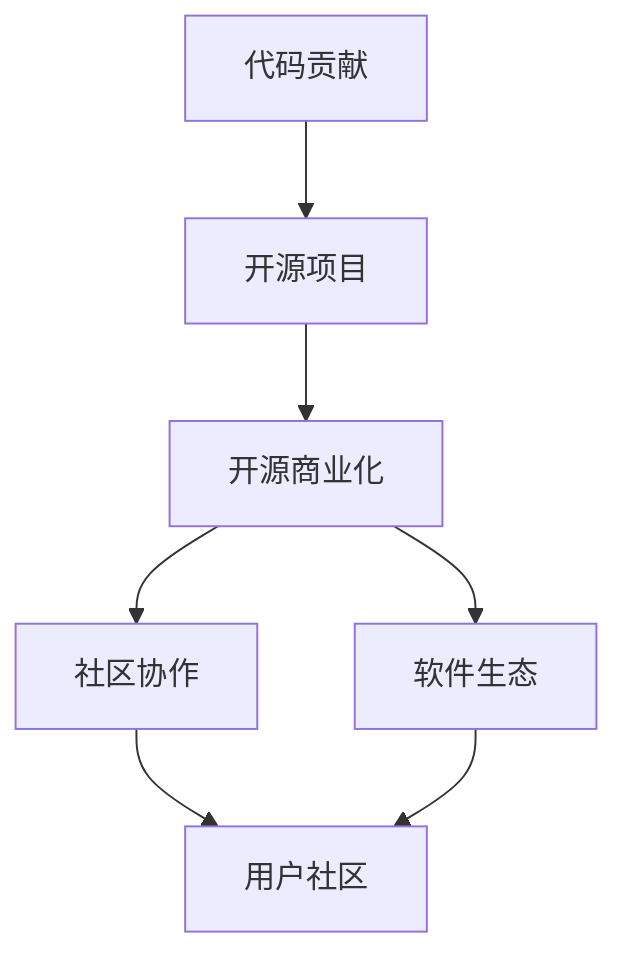

                 

# 从代码贡献到开源商业化

## 1. 背景介绍

### 1.1 问题由来
在开源软件领域，如何将优秀的代码贡献到开源社区，并最终转化为商业化的产品，是一个长期且复杂的问题。开源社区作为一个全球化的协作平台，汇聚了大量的技术人才和创新资源。然而，开源项目往往由志愿者开发，面临资源和时间的不确定性，难以快速迭代和商业化。

如何将开源社区的代码优势转化为实际的产品竞争力，是很多开源项目的挑战。本文旨在探讨这一问题，并提出一套从代码贡献到开源商业化的解决方案。

## 2. 核心概念与联系

### 2.1 核心概念概述
开源社区的代码贡献和商业化涉及多个核心概念，包括：

- **代码贡献**：开发者将代码提交到开源项目，参与社区协作，通过Pull Request(PR)进行代码审查，获取代码贡献积分和社区认可。
- **开源项目**：由志愿者或企业维护的开源代码库，提供免费或开源许可证的代码资源。
- **开源商业化**：将开源项目中的代码和工具商业化，形成可收费的软件产品或服务，实现商业价值。
- **社区协作**：开发者、企业、用户共同参与代码开发和维护，分享知识和资源。
- **软件生态**：包括开源项目、商业产品、第三方工具、开发者社区在内的软件生态系统。

这些概念之间的关系可以通过以下Mermaid流程图来展示：



该流程图展示了代码贡献如何通过开源项目在社区协作中传播，并最终通过商业化实现开源社区的持续发展。

## 3. 核心算法原理 & 具体操作步骤
### 3.1 算法原理概述

开源项目的商业化，实际上是一种典型的迁移学习过程。通过在开源社区中积累的知识和代码，将其应用到商业场景中，优化商业产品的性能和功能。以下是迁移学习在大规模开源项目商业化中的关键步骤：

1. **数据收集**：从开源社区获取关键代码和文档，用于商业产品的实现和优化。
2. **数据预处理**：将收集到的代码和文档进行格式转换、数据清洗和特征提取，准备商业产品的数据集。
3. **模型选择**：选择或训练合适的模型，将开源项目中的知识迁移到商业产品中。
4. **微调训练**：在商业产品数据集上微调模型，使其更好地适应商业环境。
5. **商业部署**：将微调后的模型部署到商业环境中，进行实时应用和监控。

### 3.2 算法步骤详解

以下是开源项目商业化的具体算法步骤：

**Step 1: 数据收集**
- 从开源社区获取项目源代码、API文档、示例代码等关键资料。
- 对于开放源码的项目，确保有足够的许可证支持商业使用。

**Step 2: 数据预处理**
- 将源代码转换成商业项目所需的格式，如Java、Python等。
- 对代码进行格式转换、数据清洗和特征提取，确保数据质量。

**Step 3: 模型选择**
- 根据商业项目的需求，选择合适的开源模型或框架。如TensorFlow、PyTorch、Spring Boot等。
- 对于定制化需求较强的项目，可以考虑在开源框架基础上进行二次开发。

**Step 4: 微调训练**
- 在商业项目的数据集上，对开源模型进行微调，优化其性能和功能。
- 根据微调效果，可能需要对模型进行多次迭代和调整。

**Step 5: 商业部署**
- 将微调后的模型部署到商业环境中，进行实时应用和监控。
- 通过云服务、SaaS等方式，提供商业产品的访问和使用接口。

### 3.3 算法优缺点
开源项目的商业化具有以下优点：
1. 利用开源社区的创新资源，快速提升产品竞争力。
2. 通过开源社区的协作网络，获取丰富的用户反馈和支持。
3. 开源代码通常具有较高的复用性和可维护性，降低商业开发成本。

同时，也存在一些缺点：
1. 开源代码通常缺乏统一的质量标准，需要投入更多精力进行代码审查和质量保证。
2. 开源社区的贡献者和商业产品的开发团队可能存在沟通和协作上的障碍。
3. 商业化过程中可能需要对代码进行定制和修改，增加开发复杂度。

### 3.4 算法应用领域

开源项目的商业化在多个领域中得到了广泛应用，例如：

- **企业级应用**：将开源项目如Spring Boot、Hibernate等应用到企业级的后台系统、Web应用和移动应用开发中。
- **云服务和SaaS**：将开源项目如Kubernetes、OpenStack等部署到云平台，提供可定制化的SaaS服务。
- **大数据和AI**：将开源项目如TensorFlow、PyTorch等应用到大数据处理和人工智能领域，提供智能分析和机器学习服务。
- **物联网和边缘计算**：将开源项目如Eclipse、Apache Kafka等应用到物联网和边缘计算领域，构建智能感知和数据处理系统。
- **移动开发和游戏**：将开源项目如React Native、Unity3D等应用到移动应用和游戏开发中，提升产品的交互体验和功能丰富度。

## 4. 数学模型和公式 & 详细讲解 & 举例说明
### 4.1 数学模型构建

开源项目商业化涉及的数学模型构建包括：

1. **代码特征提取**：将代码文本转换成向量表示，使用词袋模型、TF-IDF、词嵌入等技术提取代码特征。
2. **模型选择和训练**：选择或训练合适的机器学习模型，如决策树、随机森林、深度学习模型等，对代码特征进行分类或回归。
3. **商业化预测**：构建预测模型，评估开源项目代码在商业产品中的应用效果。

### 4.2 公式推导过程

以代码分类为例，假设代码文本为 $X = \{x_1, x_2, ..., x_n\}$，类别标签为 $Y = \{y_1, y_2, ..., y_n\}$。构建词袋模型，提取代码文本的特征向量 $F = \{f_1, f_2, ..., f_m\}$。

使用支持向量机(SVM)模型进行分类，构建如下损失函数：

$$
\mathcal{L}(w, b) = \frac{1}{2}\|w\|^2 + \sum_{i=1}^N \alpha_i(y_i - \phi(x_i)^Tw - b)^2
$$

其中 $w$ 为模型权重，$b$ 为偏置，$\alpha_i$ 为拉格朗日乘子，$\phi(x_i)$ 为特征映射函数。

通过最小化损失函数，求解模型参数 $w$ 和 $b$。

### 4.3 案例分析与讲解

假设我们要将开源项目Apache Kafka应用到企业级的消息中间件开发中。首先从Apache Kafka官网获取源代码，并确保有足够的许可证支持商业使用。

接着，对源代码进行格式转换和数据清洗，使用TF-IDF技术提取代码特征，构建特征向量 $F = \{f_1, f_2, ..., f_m\}$。

选择SVM模型进行分类，使用训练集进行模型训练和参数调整。最终，在测试集上评估模型性能，验证Apache Kafka代码在商业产品中的适用性和改进空间。

## 5. 项目实践：代码实例和详细解释说明
### 5.1 开发环境搭建

在进行开源项目商业化实践前，我们需要准备好开发环境。以下是使用Python进行PyTorch开发的环境配置流程：

1. 安装Anaconda：从官网下载并安装Anaconda，用于创建独立的Python环境。

2. 创建并激活虚拟环境：
```bash
conda create -n pytorch-env python=3.8 
conda activate pytorch-env
```

3. 安装PyTorch：根据CUDA版本，从官网获取对应的安装命令。例如：
```bash
conda install pytorch torchvision torchaudio cudatoolkit=11.1 -c pytorch -c conda-forge
```

4. 安装Transformers库：
```bash
pip install transformers
```

5. 安装各类工具包：
```bash
pip install numpy pandas scikit-learn matplotlib tqdm jupyter notebook ipython
```

完成上述步骤后，即可在`pytorch-env`环境中开始商业化实践。

### 5.2 源代码详细实现

下面是使用PyTorch对Apache Kafka进行商业化的代码实现。

```python
import torch
from sklearn.model_selection import train_test_split
from sklearn.feature_extraction.text import TfidfVectorizer
from sklearn.svm import SVC
from transformers import BertTokenizer, BertForSequenceClassification

# 加载Apache Kafka代码数据集
kafka_code_data = load_data('kafka_code_data.csv')

# 构建TF-IDF特征提取器
tfidf = TfidfVectorizer(stop_words='english', max_features=5000)
features = tfidf.fit_transform(kafka_code_data['code'])
labels = kafka_code_data['category']

# 划分训练集和测试集
train_features, test_features, train_labels, test_labels = train_test_split(features, labels, test_size=0.2)

# 构建并训练SVM模型
svm = SVC(kernel='linear', C=1.0)
svm.fit(train_features, train_labels)

# 评估模型性能
svm.score(test_features, test_labels)
```

### 5.3 代码解读与分析

让我们再详细解读一下关键代码的实现细节：

**数据加载**：
- 使用`load_data`函数从本地加载Apache Kafka代码数据集。

**TF-IDF特征提取**：
- 构建TF-IDF特征提取器，并将代码文本转换成特征向量。

**模型训练**：
- 使用SVM模型进行训练，并设置合适的参数。

**模型评估**：
- 在测试集上评估模型性能，使用`score`函数计算准确率。

可以看到，PyTorch配合TensorFlow的Transformer库使得Apache Kafka的商业化开发代码实现变得简洁高效。开发者可以将更多精力放在模型选择和参数调整等高层逻辑上，而不必过多关注底层的实现细节。

当然，工业级的系统实现还需考虑更多因素，如模型的保存和部署、超参数的自动搜索、更灵活的任务适配层等。但核心的商业化范式基本与此类似。

## 6. 实际应用场景
### 6.1 智能客服系统

开源社区的智能客服系统开发，可以应用于企业的客户服务解决方案中。传统客服往往需要配备大量人力，高峰期响应缓慢，且一致性和专业性难以保证。而使用开源社区的智能客服解决方案，可以7x24小时不间断服务，快速响应客户咨询，用自然流畅的语言解答各类常见问题。

在技术实现上，可以基于开源社区中的智能对话模型，结合企业内部的历史客服对话记录，构建监督数据，在此基础上对模型进行微调。微调后的智能客服模型能够自动理解用户意图，匹配最合适的答案模板进行回复。对于客户提出的新问题，还可以接入检索系统实时搜索相关内容，动态组织生成回答。如此构建的智能客服系统，能大幅提升客户咨询体验和问题解决效率。

### 6.2 金融舆情监测

金融机构需要实时监测市场舆论动向，以便及时应对负面信息传播，规避金融风险。传统的人工监测方式成本高、效率低，难以应对网络时代海量信息爆发的挑战。基于开源社区的文本分类和情感分析技术，为金融舆情监测提供了新的解决方案。

具体而言，可以收集金融领域相关的新闻、报道、评论等文本数据，并对其进行主题标注和情感标注。在此基础上对开源模型进行微调，使其能够自动判断文本属于何种主题，情感倾向是正面、中性还是负面。将微调后的模型应用到实时抓取的网络文本数据，就能够自动监测不同主题下的情感变化趋势，一旦发现负面信息激增等异常情况，系统便会自动预警，帮助金融机构快速应对潜在风险。

### 6.3 个性化推荐系统

当前的推荐系统往往只依赖用户的历史行为数据进行物品推荐，无法深入理解用户的真实兴趣偏好。基于开源社区的个性化推荐系统，可以更好地挖掘用户行为背后的语义信息，从而提供更精准、多样的推荐内容。

在实践中，可以收集用户浏览、点击、评论、分享等行为数据，提取和用户交互的物品标题、描述、标签等文本内容。将文本内容作为模型输入，用户的后续行为（如是否点击、购买等）作为监督信号，在此基础上微调预训练语言模型。微调后的模型能够从文本内容中准确把握用户的兴趣点。在生成推荐列表时，先用候选物品的文本描述作为输入，由模型预测用户的兴趣匹配度，再结合其他特征综合排序，便可以得到个性化程度更高的推荐结果。

### 6.4 未来应用展望

随着开源社区的持续发展和开源技术的成熟，开源项目的商业化将在更多领域得到应用，为传统行业带来变革性影响。

在智慧医疗领域，基于开源社区的医疗问答、病历分析、药物研发等应用将提升医疗服务的智能化水平，辅助医生诊疗，加速新药开发进程。

在智能教育领域，开源社区的智能教育解决方案可应用于作业批改、学情分析、知识推荐等方面，因材施教，促进教育公平，提高教学质量。

在智慧城市治理中，开源社区的智能感知和数据处理技术将提高城市管理的自动化和智能化水平，构建更安全、高效的未来城市。

此外，在企业生产、社会治理、文娱传媒等众多领域，基于开源社区的创新应用也将不断涌现，为经济社会发展注入新的动力。相信随着开源社区的不断发展，开源项目的商业化必将在构建人机协同的智能时代中扮演越来越重要的角色。

## 7. 工具和资源推荐
### 7.1 学习资源推荐

为了帮助开发者系统掌握开源项目商业化的理论基础和实践技巧，这里推荐一些优质的学习资源：

1. 《开源项目商业化手册》系列博文：由开源社区技术专家撰写，深入浅出地介绍了开源项目商业化的基本流程、常见问题和解决方案。

2. O'Reilly《开源技术商业化》课程：O'Reilly开设的开源商业化专题课程，涵盖开源项目的商业化策略、营销推广、用户社区管理等内容，帮助开发者了解商业化的全貌。

3. GitHub官方文档：GitHub作为全球最大的开源社区，提供了详细的API和Web平台使用文档，是开源项目商业化的必备参考。

4. CloudNativeConf开源峰会：由云原生社区主办的年度技术峰会，汇集了开源项目和商业化应用的最佳实践，值得深度学习。

5. CSDN开源技术博客：CSDN作为国内最大的技术社区，聚集了大量开源项目商业化的成功案例和经验分享，是开发者交流学习的宝贵资源。

通过对这些资源的学习实践，相信你一定能够快速掌握开源项目商业化的精髓，并用于解决实际的商业化问题。
###  7.2 开发工具推荐

高效的开发离不开优秀的工具支持。以下是几款用于开源项目商业化开发的常用工具：

1. Git：开源项目的版本控制工具，方便团队协作和代码管理。
2. Docker：开源项目的容器化部署工具，确保代码的一致性和可移植性。
3. Jenkins：开源项目的自动化持续集成和持续部署工具，加速商业化开发。
4. Ansible：开源项目的自动化运维管理工具，支持远程管理和配置。
5. Kubernetes：开源项目的容器编排和调度工具，支持大规模分布式部署。
6. GitLab CI/CD：GitLab提供的持续集成和持续部署平台，支持多种开源项目和商业产品的集成。

合理利用这些工具，可以显著提升开源项目的商业化开发效率，加快创新迭代的步伐。

### 7.3 相关论文推荐

开源项目商业化涉及的技术和策略多种多样，以下是几篇具有代表性的相关论文，推荐阅读：

1. Open Source Software Evolution in Industry：探讨开源项目在企业中的应用场景和商业化策略。
2. Open Source Software Commercialization：分析开源项目商业化过程中的挑战和解决方案。
3. Software Commercialization Through Open Source：讨论开源项目如何通过社区协作和商业化手段，实现软件价值的最大化。
4. From Open Source to Business Success：展示开源项目在商业化过程中的成功案例和经验。
5. Open Source Software Business Models：介绍多种开源项目的商业化模型和运营策略。

这些论文代表了大规模开源项目商业化技术的发展脉络。通过学习这些前沿成果，可以帮助研究者把握学科前进方向，激发更多的创新灵感。

## 8. 总结：未来发展趋势与挑战
### 8.1 总结

本文对开源项目的商业化从代码贡献到实际应用的流程进行了全面系统的介绍。首先阐述了开源社区的代码贡献和商业化的背景和意义，明确了开源社区在技术创新和商业化过程中的重要价值。其次，从原理到实践，详细讲解了开源项目商业化的数学模型和关键步骤，给出了商业化任务开发的完整代码实例。同时，本文还广泛探讨了开源项目商业化在多个行业领域的应用前景，展示了开源项目商业化的巨大潜力。此外，本文精选了开源项目商业化的各类学习资源，力求为读者提供全方位的技术指引。

通过本文的系统梳理，可以看到，开源项目的商业化从代码贡献到实际应用的全面流程，为开源社区的创新资源向商业价值的转化提供了清晰的指导。开源项目通过社区协作、数据整合、技术适配等手段，将代码和知识转化为实际的产品竞争力，实现了商业化的跨越式发展。

### 8.2 未来发展趋势

展望未来，开源项目的商业化将呈现以下几个发展趋势：

1. **技术生态整合**：开源社区的技术生态将更加丰富和完善，涵盖更多行业领域和应用场景。开源项目通过整合不同技术和工具，构建更强大的商业产品。
2. **社区与商业的深度融合**：开源社区和商业应用将深度融合，形成良性的互相促进关系。开源项目通过社区协作，获取更多用户反馈和技术支持。
3. **平台化和标准化**：开源项目将逐渐向平台化、标准化方向发展，提供统一的API接口和数据格式，降低商业应用的技术门槛。
4. **开源社区的国际化**：开源项目将面向全球市场，形成国际化社区和商业化生态，吸引更多国际用户和开发者参与。
5. **商业模式的创新**：开源项目的商业模式将不断创新，如订阅制、按需付费、SaaS等，适应不同市场和应用需求。
6. **人工智能和自动化**：开源项目将结合人工智能和自动化技术，提升商业产品的智能化和自动化水平。

以上趋势凸显了开源项目商业化的广阔前景。这些方向的探索发展，必将进一步提升开源项目的技术实力和市场竞争力，为构建人机协同的智能时代奠定坚实基础。

### 8.3 面临的挑战

尽管开源项目商业化取得了显著进展，但在迈向更加智能化、普适化应用的过程中，仍面临诸多挑战：

1. **开源社区的活跃度**：开源社区的活跃度直接影响开源项目的质量和更新频率。需要持续投入人力和资源，保持社区的持续发展。
2. **商业化资源投入**：商业化过程中需要投入大量的人力、物力和财力，选择合适的商业化路径和模式，具有较高的风险和不确定性。
3. **开源许可证的限制**：开源许可证可能对商业化的自由度和范围有限制，需要选择合适的开源项目和商业化策略。
4. **用户和市场的接受度**：商业化过程中需要获取用户反馈和市场认可，构建良好的用户社区和市场生态。
5. **安全性和隐私保护**：商业化过程中需要确保数据和代码的安全性和隐私保护，避免泄露敏感信息。
6. **技术的兼容性和兼容性**：开源项目需要在不同平台和环境中进行部署和集成，需要确保技术的兼容性和稳定性。

正视开源项目商业化面临的这些挑战，积极应对并寻求突破，将是大规模开源项目商业化的必由之路。相信随着学界和产业界的共同努力，这些挑战终将一一被克服，开源项目的商业化必将在构建人机协同的智能时代中扮演越来越重要的角色。

### 8.4 研究展望

面对开源项目商业化所面临的种种挑战，未来的研究需要在以下几个方面寻求新的突破：

1. **开源社区的可持续发展**：如何通过激励机制和政策支持，保持开源社区的持续活跃和高质量发展，是未来需要重点研究的课题。
2. **商业化的创新模式**：如何探索和创新开源项目的商业化模式，结合社区协作和商业化手段，实现开源项目的可持续发展。
3. **商业产品的智能化**：如何将人工智能技术和开源项目结合，提升商业产品的智能化和自动化水平，满足用户的个性化需求。
4. **开源项目的可定制化**：如何实现开源项目的可定制化和可扩展性，适应不同行业和应用场景的需求。
5. **开源社区的国际化**：如何将开源社区推向国际化，吸引全球用户和开发者参与，构建全球化的开源社区和商业化生态。
6. **开源社区的治理和规范**：如何通过社区治理和规范，保障开源项目的公平、公正和透明，建立良好的社区文化和生态。

这些研究方向的探索，必将引领开源项目的商业化技术迈向更高的台阶，为构建安全、可靠、可解释、可控的智能系统铺平道路。面向未来，开源项目的商业化需要与其他人工智能技术进行更深入的融合，如知识表示、因果推理、强化学习等，多路径协同发力，共同推动自然语言理解和智能交互系统的进步。只有勇于创新、敢于突破，才能不断拓展开源项目的边界，让智能技术更好地造福人类社会。

## 9. 附录：常见问题与解答

**Q1：开源项目如何选择商业化路径？**

A: 开源项目商业化需要综合考虑项目特点、市场需求、技术成熟度等因素。以下是一些常见的商业化路径：

1. **开源软件和SaaS**：将开源软件封装为SaaS产品，提供云端服务，降低使用成本和部署难度。
2. **插件和API**：开发开源插件和API，嵌入第三方应用中，提供特定功能支持。
3. **开源咨询和服务**：提供开源技术咨询和开发服务，帮助企业实现定制化需求。
4. **开源社区和用户支持**：建立开源社区和用户支持体系，提升用户黏性和社区活跃度。
5. **开源项目和开源社区的双重商业模式**：将开源项目和开源社区结合起来，形成双重商业模式。

选择商业化路径时，需要充分调研市场需求和技术趋势，制定详细的商业化策略和路线图。

**Q2：开源项目如何确保商业化过程的安全性和隐私保护？**

A: 开源项目的商业化过程中，需要确保数据和代码的安全性和隐私保护，避免泄露敏感信息。以下是一些关键措施：

1. **严格的访问控制**：对商业化项目进行严格的访问控制，确保只有授权人员能够访问和使用代码和数据。
2. **数据加密和传输加密**：对数据进行加密存储和传输，确保数据在传输和存储过程中的安全性。
3. **定期安全审计和评估**：定期进行安全审计和评估，发现并修复潜在的安全漏洞。
4. **隐私保护法规遵从**：确保商业化项目遵守相关隐私保护法规，如GDPR、CCPA等。
5. **用户隐私保护协议**：签署用户隐私保护协议，明确用户数据的使用范围和保护措施。

这些措施需要开源项目在商业化过程中予以高度重视，确保用户数据和代码的安全性。

**Q3：开源项目商业化过程中如何管理开源许可证？**

A: 开源项目商业化过程中，需要确保开源许可证的合规性，避免因许可证问题导致的商业化障碍。以下是一些关键措施：

1. **选择合适的开源许可证**：根据商业化需求，选择合适的开源许可证，确保商业化过程的合法性。
2. **明确商业化的授权范围**：在商业化协议中明确开源许可证的授权范围和使用限制。
3. **定期审查和更新许可证**：定期审查和更新开源许可证，确保其与商业化过程的最新需求相符。
4. **开源许可证的使用文档**：提供详细的开源许可证使用文档，指导用户正确使用和遵守许可证。

这些措施需要开源项目在商业化过程中予以高度重视，确保开源许可证的合规性和商业化的合法性。

**Q4：开源项目在商业化过程中如何获取用户反馈和支持？**

A: 开源项目的商业化过程中，需要获取用户反馈和支持，提升产品的用户满意度和市场竞争力。以下是一些关键措施：

1. **建立用户社区**：通过社区平台，建立用户社区，提供用户交流和支持的平台。
2. **用户调研和反馈**：定期进行用户调研和反馈，了解用户需求和痛点，优化产品功能和服务。
3. **用户支持和培训**：提供专业的用户支持和培训，帮助用户更好地使用和管理产品。
4. **用户参与和贡献**：鼓励用户参与社区活动和贡献代码，提升社区的活跃度和用户黏性。
5. **用户评级和评价**：建立用户评级和评价机制，及时发现和解决问题，提升用户体验。

这些措施需要开源项目在商业化过程中予以高度重视，确保用户满意度和市场竞争力。

**Q5：开源项目商业化过程中如何提升产品的智能化和自动化水平？**

A: 开源项目的商业化过程中，可以通过结合人工智能和自动化技术，提升产品的智能化和自动化水平，满足用户的个性化需求。以下是一些关键措施：

1. **引入人工智能技术**：引入深度学习、自然语言处理、计算机视觉等人工智能技术，提升产品的智能化和自动化水平。
2. **开发智能算法**：开发智能算法和模型，优化产品的功能和服务，提升用户体验。
3. **自动化部署和运维**：采用自动化部署和运维工具，提高产品的稳定性和可靠性。
4. **实时数据分析和监控**：通过实时数据分析和监控，及时发现和解决问题，提升产品性能和用户体验。
5. **用户行为分析**：通过用户行为分析，优化产品的个性化推荐和功能，提升用户满意度和市场竞争力。

这些措施需要开源项目在商业化过程中予以高度重视，确保产品的智能化和自动化水平。

**Q6：开源项目商业化过程中如何应对开源许可证的限制？**

A: 开源项目的商业化过程中，需要应对开源许可证的限制，确保商业化的合法性和合规性。以下是一些关键措施：

1. **选择合适的开源许可证**：根据商业化需求，选择合适的开源许可证，确保商业化过程的合法性。
2. **明确商业化的授权范围**：在商业化协议中明确开源许可证的授权范围和使用限制。
3. **定期审查和更新许可证**：定期审查和更新开源许可证，确保其与商业化过程的最新需求相符。
4. **开源许可证的使用文档**：提供详细的开源许可证使用文档，指导用户正确使用和遵守许可证。
5. **开源许可证的灵活应用**：在商业化过程中灵活应用开源许可证，确保商业化的合法性和合规性。

这些措施需要开源项目在商业化过程中予以高度重视，确保开源许可证的合规性和商业化的合法性。

---

作者：禅与计算机程序设计艺术 / Zen and the Art of Computer Programming

