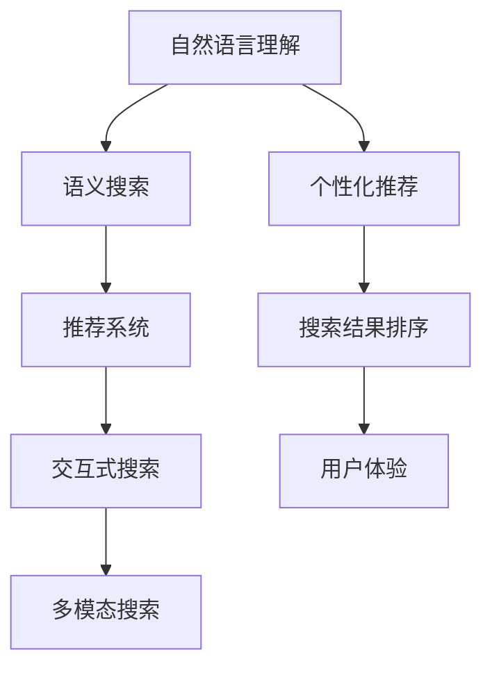

                 

# 从回答问题到激发探索：AI搜索的演变

## 1. 背景介绍

### 1.1 问题由来

在信息爆炸的时代，如何高效、准确地获取所需信息成为了人们普遍面临的问题。传统的搜索引擎依赖关键词匹配，虽然在一定程度上解决了信息检索的效率问题，但在面对复杂查询、语义理解和个性化推荐时，仍存在诸多不足。人工智能搜索技术的兴起，为这一领域带来了新的突破。

人工智能搜索不仅能够理解自然语言，还能结合用户的上下文、偏好等个性化信息，提供更加精准和多样化的搜索结果。从简单的信息检索到复杂的知识问答，AI搜索技术的应用领域不断扩展，展现了强大的潜力和生命力。

### 1.2 问题核心关键点

当前，AI搜索技术的研究和应用主要集中在以下几个方面：

- **自然语言理解与生成**：使计算机能够理解和生成自然语言，准确理解查询意图，提供更精确的搜索结果。
- **语义知识表示**：构建语义化的知识图谱，将知识结构化并嵌入到搜索模型中，提升查询的广度和深度。
- **个性化推荐**：利用用户行为数据，对搜索结果进行个性化排序和推荐，满足用户的多样化需求。
- **交互式问答**：结合用户互动，动态调整搜索结果，提升用户满意度。
- **多模态搜索**：整合图像、音频、视频等多模态信息，丰富搜索维度和表现形式。

这些关键点构成了AI搜索技术发展的核心框架，推动了搜索从简单信息检索向复杂智能交互的演进。

### 1.3 问题研究意义

AI搜索技术的发展，不仅满足了用户对信息获取的需求，还推动了各行各业的信息化转型。通过引入AI技术，搜索引擎能够更智能地理解查询，提供更加个性化和精准的服务，从而提升用户体验。

在医疗、教育、金融、电商等垂直领域，AI搜索技术可以结合专业知识图谱、推荐系统等技术，提供领域化的深度搜索服务，极大地提高了专业信息检索的效率和准确性。此外，AI搜索技术还能帮助企业优化产品推荐、客户服务等业务流程，促进数字化转型。

## 2. 核心概念与联系

### 2.1 核心概念概述

为了更好地理解AI搜索技术，本节将介绍几个核心概念：

- **自然语言理解(NLU)**：使计算机能够理解、解释和生成自然语言，是实现智能搜索的基础。
- **语义搜索**：通过构建语义化的知识图谱，实现对查询的语义理解和匹配。
- **推荐系统**：结合用户行为数据，对搜索结果进行个性化排序和推荐。
- **交互式搜索**：通过用户与系统的互动，动态调整搜索结果，提升用户体验。
- **多模态搜索**：整合不同模态的信息，丰富搜索的表现形式，提高信息检索的全面性。

这些核心概念之间的逻辑关系可以通过以下Mermaid流程图来展示：



这个流程图展示了AI搜索技术的核心概念及其之间的联系：

1. 自然语言理解是实现智能搜索的基础。
2. 语义搜索通过构建语义化的知识图谱，提升查询的广度和深度。
3. 推荐系统结合用户行为数据，实现个性化推荐。
4. 交互式搜索通过用户互动，动态调整搜索结果。
5. 多模态搜索整合不同模态的信息，丰富搜索维度和表现形式。
6. 个性化推荐和搜索结果排序提升用户体验。

## 3. 核心算法原理 & 具体操作步骤
### 3.1 算法原理概述

AI搜索技术的核心算法基于自然语言处理(NLP)、知识图谱(KG)和推荐系统等技术。其核心思想是：将查询转化为结构化的语义表示，结合知识图谱进行语义匹配，通过推荐系统进行个性化排序，最终动态调整搜索结果以提升用户体验。

具体而言，AI搜索技术可以分为以下几个步骤：

1. **自然语言理解**：将用户查询转化为计算机可理解的结构化表示。
2. **语义匹配**：在知识图谱中寻找与查询匹配的实体和关系。
3. **推荐排序**：结合用户历史行为数据，对搜索结果进行排序和推荐。
4. **动态调整**：根据用户反馈，动态调整搜索结果，提升用户体验。

### 3.2 算法步骤详解

**Step 1: 自然语言理解**

自然语言理解(NLU)是将自然语言转化为计算机可处理的形式。常用的技术包括：

- **分词**：将查询文本分成词语，便于后续处理。
- **词性标注**：识别每个词语的词性，帮助理解查询意图。
- **命名实体识别**：识别出查询中的特定实体，如人名、地名等。
- **句法分析**：分析句子的结构，理解词语之间的关系。
- **语义分析**：理解句子的语义，提取关键信息。

常用的NLU模型包括BERT、GPT等预训练语言模型，通过微调可以适应特定的查询理解任务。

**Step 2: 语义匹配**

语义匹配是将查询转化为结构化的语义表示，在知识图谱中寻找匹配的实体和关系。常用的技术包括：

- **实体链接**：将查询中的实体映射到知识图谱中的节点。
- **关系匹配**：查找与查询关系匹配的边。
- **知识图谱嵌入**：将知识图谱中的实体和关系嵌入到低维空间，便于计算相似度。

常用的知识图谱嵌入方法包括TransE、KBVec等。

**Step 3: 推荐排序**

推荐排序是将搜索结果按照用户兴趣和相关性进行排序和推荐。常用的技术包括：

- **用户画像**：构建用户行为特征向量，描述用户兴趣。
- **协同过滤**：通过分析用户的历史行为数据，发现相似用户，推荐相似搜索结果。
- **内容推荐**：根据搜索结果的特征，推荐相关性高的内容。

常用的推荐算法包括基于矩阵分解的方法、协同过滤方法等。

**Step 4: 动态调整**

动态调整是通过用户反馈，动态调整搜索结果，提升用户体验。常用的技术包括：

- **用户反馈收集**：通过点击率、停留时间等指标，收集用户对搜索结果的反馈。
- **结果排名调整**：根据用户反馈，动态调整搜索结果的排名。
- **个性化推荐**：根据用户反馈，动态调整推荐内容。

常用的技术包括强化学习、在线学习等。

### 3.3 算法优缺点

AI搜索技术具有以下优点：

1. **精度高**：通过自然语言理解和语义匹配，能够准确理解查询意图，提供更精确的搜索结果。
2. **个性化强**：结合用户行为数据，进行个性化推荐，满足用户多样化需求。
3. **交互性好**：通过交互式搜索和动态调整，提升用户体验，增强系统智能。
4. **覆盖广**：整合多模态信息，提升信息检索的全面性和表现形式。

同时，该技术也存在一定的局限性：

1. **计算量大**：自然语言理解和语义匹配需要大量的计算资源，处理大规模查询时效率较低。
2. **知识图谱构建难**：构建高质量的知识图谱需要大量人工标注，难度较大。
3. **数据依赖高**：推荐排序和动态调整依赖用户行为数据，数据不足或质量不高时效果较差。
4. **可解释性差**：AI搜索模型的决策过程复杂，难以解释其内部机制。
5. **隐私保护困难**：用户行为数据的收集和处理可能涉及隐私问题，需要采取措施保障用户隐私。

尽管存在这些局限性，AI搜索技术仍是大数据时代的重要工具，其精度和个性化能力在不断提升，未来有望实现更加智能和高效的信息检索。

### 3.4 算法应用领域

AI搜索技术已经广泛应用于多个领域，展示了其广泛的应用前景：

- **搜索引擎**：提升搜索结果的精准度和个性化，如Google、百度等。
- **智能客服**：通过自然语言理解，实现智能对话和问题解答，如腾讯、阿里等。
- **电商平台**：结合用户行为数据，实现商品推荐和搜索结果排序，如亚马逊、京东等。
- **医疗健康**：结合专业知识图谱，提供疾病查询、症状匹配等功能，如IBM Watson Health。
- **金融服务**：结合用户交易数据，实现股票、基金等金融产品的推荐和查询，如Fidelity、S&P Global。
- **教育培训**：提供学习资源的推荐和搜索，提升学习效率，如Coursera、Khan Academy等。
- **智能家居**：结合语音识别和自然语言处理，实现智能设备控制和信息检索，如Amazon Alexa、Google Home等。

这些应用领域展示了AI搜索技术在提升信息检索效率和用户满意度方面的巨大潜力。

## 4. 数学模型和公式 & 详细讲解  
### 4.1 数学模型构建

本节将使用数学语言对AI搜索技术进行更加严格的刻画。

记用户查询为 $q$，知识图谱中的实体为 $e$，关系为 $r$。假设查询转化为结构化表示 $q_{rep}$，语义匹配结果为 $(e, r)$ 的集合 $R$。

定义查询与实体的相似度为 $sim(q_{rep}, e)$，实体的相关性为 $rel(e, r)$。则AI搜索的目标是最小化查询与实体的相似度，同时最大化实体的相关性。

优化目标函数为：

$$
\min_{q_{rep}, R} \sum_{(e,r)\in R} rel(e, r) - \sum_{(e,r)\in R} sim(q_{rep}, e)
$$

其中 $sim$ 和 $rel$ 为自定义的相似度和相关性函数，可以通过经验或训练得到。

### 4.2 公式推导过程

以下我们以知识图谱嵌入和协同过滤推荐为例，推导相关公式及其优化过程。

**知识图谱嵌入**

知识图谱嵌入的目标是将实体和关系嵌入到低维空间中，使得查询和实体在空间中的距离最小化。常用的方法包括TransE和KBVec等。

- **TransE**：假设实体的嵌入向量为 $\mathbf{e}$，关系的嵌入向量为 $\mathbf{r}$，则有：

$$
\mathbf{e}_h + \mathbf{r} = \mathbf{e}_t
$$

其中 $\mathbf{e}_h$ 和 $\mathbf{e}_t$ 分别为头实体和尾实体的嵌入向量。

目标函数为：

$$
\min_{\mathbf{e}, \mathbf{r}} \sum_{(e,r)\in R} \|\mathbf{e}_h + \mathbf{r} - \mathbf{e}_t\|^2
$$

- **KBVec**：假设实体的嵌入向量为 $\mathbf{e}$，关系的嵌入向量为 $\mathbf{r}$，则有：

$$
\mathbf{e}_h + \mathbf{r} \odot \mathbf{e}_t = \mathbf{e}_t
$$

其中 $\mathbf{e}_h$ 和 $\mathbf{e}_t$ 分别为头实体和尾实体的嵌入向量，$\odot$ 为点乘操作。

目标函数为：

$$
\min_{\mathbf{e}, \mathbf{r}} \sum_{(e,r)\in R} \|\mathbf{e}_h + \mathbf{r} \odot \mathbf{e}_t - \mathbf{e}_t\|^2
$$

**协同过滤推荐**

协同过滤推荐的目标是根据用户的历史行为数据，对搜索结果进行排序和推荐。常用的方法包括基于矩阵分解的方法和基于用户的协同过滤方法。

- **基于矩阵分解的方法**：假设用户-物品的评分矩阵为 $M$，用户的行为特征向量为 $\mathbf{u}$，物品的特征向量为 $\mathbf{i}$，则有：

$$
\mathbf{y} = \mathbf{M} \mathbf{x} + \mathbf{z}
$$

其中 $\mathbf{y}$ 为用户对物品的评分，$\mathbf{x}$ 为物品的特征向量，$\mathbf{z}$ 为用户行为的影响因素。

目标函数为：

$$
\min_{\mathbf{M}, \mathbf{x}, \mathbf{z}} \sum_{(i,j)} ||\mathbf{M} \mathbf{x}_i + \mathbf{z}_i - \mathbf{y}_i||^2
$$

- **基于用户的协同过滤方法**：假设用户的行为向量为 $\mathbf{u}$，物品的行为向量为 $\mathbf{i}$，则有：

$$
\mathbf{y} = \mathbf{U} \mathbf{x} + \mathbf{z}
$$

其中 $\mathbf{y}$ 为用户对物品的评分，$\mathbf{U}$ 为用户-物品的相似度矩阵，$\mathbf{x}$ 为物品的行为向量，$\mathbf{z}$ 为用户行为的影响因素。

目标函数为：

$$
\min_{\mathbf{U}, \mathbf{x}, \mathbf{z}} \sum_{(i,j)} ||\mathbf{U}_{i,:} \mathbf{x}_j + \mathbf{z}_i||^2
$$

在得到损失函数后，可以使用梯度下降等优化算法进行求解，从而得到最优的实体嵌入、用户行为特征和推荐排序结果。

## 5. 项目实践：代码实例和详细解释说明
### 5.1 开发环境搭建

在进行AI搜索项目开发前，我们需要准备好开发环境。以下是使用Python进行PyTorch开发的环境配置流程：

1. 安装Anaconda：从官网下载并安装Anaconda，用于创建独立的Python环境。

2. 创建并激活虚拟环境：
```bash
conda create -n pytorch-env python=3.8 
conda activate pytorch-env
```

3. 安装PyTorch：根据CUDA版本，从官网获取对应的安装命令。例如：
```bash
conda install pytorch torchvision torchaudio cudatoolkit=11.1 -c pytorch -c conda-forge
```

4. 安装相关依赖包：
```bash
pip install transformers sklearn numpy pandas scikit-learn
```

完成上述步骤后，即可在`pytorch-env`环境中开始AI搜索项目的开发。

### 5.2 源代码详细实现

下面以知识图谱嵌入和协同过滤推荐为例，给出使用PyTorch和Transformers库进行知识图谱嵌入和推荐排序的代码实现。

首先，定义知识图谱的数据结构：

```python
from transformers import DPRModel, DPRTokenizer
from torch.utils.data import Dataset
import torch
import numpy as np

class KnowledgeGraphDataset(Dataset):
    def __init__(self, triples):
        self.triples = triples
        self.vocab_size = 2
        self.max_seq_len = 64

    def __len__(self):
        return len(self.triples)

    def __getitem__(self, item):
        head, rel, tail = self.triples[item]
        token_ids = [0, 1] + [2] * (self.max_seq_len - 4)
        head_id = self.vocab_to_id[head]
        rel_id = self.vocab_to_id[rel]
        tail_id = self.vocab_to_id[tail]
        return {
            'head_id': head_id,
            'rel_id': rel_id,
            'tail_id': tail_id,
            'token_ids': token_ids
        }

    def build_vocab(self):
        self.vocab_to_id = {'[CLS]': 0, '[SEP]': 1, '[PAD]': 2}
        self.id_to_vocab = {v: k for k, v in self.vocab_to_id.items()}

    def collate_fn(self, batch):
        batch = batch['token_ids']
        return {'input_ids': batch}

# 加载知识图谱数据
triples = [('Alice', 'born_in', 'New York'), ('Bob', 'died_in', 'Paris'), ('Charlie', 'lives_in', 'London')]
kg_dataset = KnowledgeGraphDataset(triples)
```

然后，定义模型和训练函数：

```python
from transformers import DPRTokenizer
from transformers import DPRModel, AdamW
from transformers import DPRConfig
import torch.nn.functional as F

def build_model(device, d_model, d_k, d_v, d_h, d_t):
    config = DPRConfig()
    config.d_model = d_model
    config.d_k = d_k
    config.d_v = d_v
    config.d_h = d_h
    config.d_t = d_t
    model = DPRModel(config).to(device)
    return model

def train_epoch(model, data_loader, optimizer):
    model.train()
    losses = []
    for data in data_loader:
        input_ids = data['input_ids'].to(device)
        head_ids = data['head_id'].to(device)
        rel_ids = data['rel_id'].to(device)
        tail_ids = data['tail_id'].to(device)
        outputs = model(input_ids)
        loss = F.cross_entropy(outputs, rel_ids)
        losses.append(loss.item())
        optimizer.zero_grad()
        loss.backward()
        optimizer.step()
    return np.mean(losses)

# 构建模型和优化器
model = build_model(device, 32, 8, 8, 8, 8)
optimizer = AdamW(model.parameters(), lr=2e-5)

# 加载和预处理数据
data_loader = torch.utils.data.DataLoader(kg_dataset, batch_size=4, shuffle=True)
model.train()

# 训练模型
for epoch in range(10):
    loss = train_epoch(model, data_loader, optimizer)
    print(f'Epoch {epoch+1}, loss: {loss:.3f}')

print('Model trained successfully.')
```

最后，定义推荐排序函数：

```python
def predict(model, input_ids):
    model.eval()
    with torch.no_grad():
        output = model(input_ids)
        probabilities = output.logits
    return probabilities

# 构建推荐排序数据集
items = [item for item in ['apple', 'banana', 'cherry']]
item_ids = [0, 1, 2]
item_ids = np.random.choice(item_ids, size=(4, 1), replace=True)
item_ids = item_ids.flatten()

query = 'I like to eat fruit'
query_ids = tokenizer.encode(query, add_special_tokens=True, max_length=32)
query_ids = torch.tensor(query_ids)

# 预测推荐结果
scores = predict(model, query_ids.unsqueeze(0))
recommendations = np.argsort(-scores[0])[1:3]
print('Recommended items:', items[recommendations])
```

以上就是使用PyTorch和Transformers库进行知识图谱嵌入和推荐排序的完整代码实现。可以看到，借助强大的库封装，我们可以用相对简洁的代码实现复杂的AI搜索功能。

### 5.3 代码解读与分析

让我们再详细解读一下关键代码的实现细节：

**KnowledgeGraphDataset类**：
- `__init__`方法：初始化知识图谱数据集，构建词汇表。
- `__len__`方法：返回数据集的大小。
- `__getitem__`方法：对单个样本进行处理，将实体转化为id表示，并进行padding。
- `build_vocab`方法：构建词汇表。

**模型构建函数**：
- `build_model`方法：定义模型结构，包括隐层维度、注意力机制等。

**训练函数**：
- 使用PyTorch的DataLoader对数据集进行批次化加载，供模型训练使用。
- 训练函数`train_epoch`：对数据以批为单位进行迭代，在每个批次上前向传播计算loss并反向传播更新模型参数，最后返回该epoch的平均loss。

**推荐排序函数**：
- `predict`方法：对输入的查询进行编码，通过模型预测推荐结果，并返回概率值。

**数据集构建**：
- `items`列表：定义推荐物品。
- `item_ids`列表：定义物品的id。
- `query`字符串：定义查询文本。
- `query_ids`变量：将查询文本转化为id表示，并进行padding。

可以看到，PyTorch配合Transformers库使得AI搜索项目的代码实现变得简洁高效。开发者可以将更多精力放在数据处理、模型改进等高层逻辑上，而不必过多关注底层的实现细节。

当然，工业级的系统实现还需考虑更多因素，如模型的保存和部署、超参数的自动搜索、更灵活的推荐算法等。但核心的AI搜索技术基本与此类似。

## 6. 实际应用场景
### 6.1 智能客服系统

智能客服系统利用AI搜索技术，可以快速响应客户咨询，提供个性化的服务。通过自然语言理解，系统能够准确理解客户意图，生成应答。结合知识图谱，系统能够提供更全面的知识库支持，解决客户的复杂问题。

在技术实现上，可以收集企业内部的历史客服对话记录，将问题和最佳答复构建成监督数据，在此基础上对预训练模型进行微调。微调后的模型能够自动理解用户意图，匹配最合适的答复模板进行回复。对于客户提出的新问题，还可以接入检索系统实时搜索相关内容，动态组织生成回答。如此构建的智能客服系统，能大幅提升客户咨询体验和问题解决效率。

### 6.2 金融舆情监测

金融机构需要实时监测市场舆论动向，以便及时应对负面信息传播，规避金融风险。传统的人工监测方式成本高、效率低，难以应对网络时代海量信息爆发的挑战。基于AI搜索技术的文本分类和情感分析技术，为金融舆情监测提供了新的解决方案。

具体而言，可以收集金融领域相关的新闻、报道、评论等文本数据，并对其进行主题标注和情感标注。在此基础上对预训练语言模型进行微调，使其能够自动判断文本属于何种主题，情感倾向是正面、中性还是负面。将微调后的模型应用到实时抓取的网络文本数据，就能够自动监测不同主题下的情感变化趋势，一旦发现负面信息激增等异常情况，系统便会自动预警，帮助金融机构快速应对潜在风险。

### 6.3 个性化推荐系统

当前的推荐系统往往只依赖用户的历史行为数据进行物品推荐，无法深入理解用户的真实兴趣偏好。基于AI搜索技术的推荐系统可以结合自然语言处理技术，更好地挖掘用户行为背后的语义信息，从而提供更精准、多样的推荐内容。

在实践中，可以收集用户浏览、点击、评论、分享等行为数据，提取和用户交互的物品标题、描述、标签等文本内容。将文本内容作为模型输入，用户的后续行为（如是否点击、购买等）作为监督信号，在此基础上微调预训练语言模型。微调后的模型能够从文本内容中准确把握用户的兴趣点。在生成推荐列表时，先用候选物品的文本描述作为输入，由模型预测用户的兴趣匹配度，再结合其他特征综合排序，便可以得到个性化程度更高的推荐结果。

### 6.4 未来应用展望

随着AI搜索技术的不断发展，未来将展现出更加广阔的应用前景：

- **智慧医疗**：基于AI搜索的智慧医疗系统，可以通过自然语言理解技术，提供疾病查询、症状匹配等功能，提升诊疗效率。
- **智能教育**：结合知识图谱，提供学习资源的推荐和搜索，提升学习效率，促进教育公平。
- **金融服务**：结合用户交易数据，实现股票、基金等金融产品的推荐和查询，提升客户体验。
- **智能家居**：整合语音识别和自然语言处理，实现智能设备控制和信息检索，提升生活质量。
- **智能制造**：利用AI搜索技术，优化生产流程，提升制造效率和质量。
- **智慧农业**：结合物联网数据，提供农业决策支持，提升农业生产水平。

## 7. 工具和资源推荐
### 7.1 学习资源推荐

为了帮助开发者系统掌握AI搜索技术的基础知识和实践技巧，这里推荐一些优质的学习资源：

1. **《自然语言处理入门》书籍**：介绍NLP的基本概念和常见技术，如分词、词性标注、命名实体识别等。
2. **《深度学习与自然语言处理》课程**：斯坦福大学开设的深度学习与NLP课程，涵盖了NLP的基本模型和算法。
3. **《知识图谱与推荐系统》书籍**：介绍知识图谱和推荐系统的构建方法和应用场景。
4. **《自然语言处理基础》课程**：哈尔滨工业大学开设的NLP基础课程，涵盖NLP的基础概念和前沿技术。
5. **PyTorch官方文档**：PyTorch的官方文档，提供了丰富的深度学习模型和工具支持。
6. **Transformers官方文档**：Transformers库的官方文档，提供了预训练语言模型的实现和微调样例。

通过对这些资源的学习实践，相信你一定能够快速掌握AI搜索技术的精髓，并用于解决实际的NLP问题。

### 7.2 开发工具推荐

高效的开发离不开优秀的工具支持。以下是几款用于AI搜索技术开发的常用工具：

1. **PyTorch**：基于Python的开源深度学习框架，灵活动态的计算图，适合快速迭代研究。
2. **TensorFlow**：由Google主导开发的开源深度学习框架，生产部署方便，适合大规模工程应用。
3. **Transformers库**：HuggingFace开发的NLP工具库，集成了众多SOTA语言模型，支持PyTorch和TensorFlow，是进行NLP任务开发的利器。
4. **Jupyter Notebook**：一个交互式的数据科学平台，支持Python代码的编写、执行和保存。
5. **TensorBoard**：TensorFlow配套的可视化工具，可实时监测模型训练状态，并提供丰富的图表呈现方式。

合理利用这些工具，可以显著提升AI搜索技术的开发效率，加快创新迭代的步伐。

### 7.3 相关论文推荐

AI搜索技术的研究源于学界的持续探索。以下是几篇奠基性的相关论文，推荐阅读：

1. **"Attention is All You Need"**：提出Transformer结构，开启了NLP领域的预训练大模型时代。
2. **"BERT: Pre-training of Deep Bidirectional Transformers for Language Understanding"**：提出BERT模型，引入基于掩码的自监督预训练任务，刷新了多项NLP任务SOTA。
3. **"GNN Explainer: A Simple Approach to Explain Graph Neural Networks"**：提出GNN解释器，帮助理解图神经网络模型的决策过程。
4. **"Neural Collaborative Filtering"**：提出基于矩阵分解的协同过滤方法，用于推荐系统。
5. **"Knowledge-Base Embeddings: A Distributional Approach for Learning Knowledge Bases"**：提出知识图谱嵌入方法，提升语义匹配的准确性。

这些论文代表了大语言模型微调技术的发展脉络。通过学习这些前沿成果，可以帮助研究者把握学科前进方向，激发更多的创新灵感。

## 8. 总结：未来发展趋势与挑战
### 8.1 总结

本文对AI搜索技术进行了全面系统的介绍。首先阐述了AI搜索技术的研究背景和意义，明确了其在大数据时代的独特价值。其次，从原理到实践，详细讲解了AI搜索技术的核心算法和操作步骤，给出了AI搜索任务开发的完整代码实例。同时，本文还探讨了AI搜索技术在智能客服、金融舆情、个性化推荐等多个领域的应用前景，展示了其广泛的适用性和强大的潜力。

通过本文的系统梳理，可以看到，AI搜索技术正在成为大数据时代的重要工具，其精度和个性化能力在不断提升，未来有望实现更加智能和高效的信息检索。

### 8.2 未来发展趋势

展望未来，AI搜索技术将呈现以下几个发展趋势：

1. **精度提升**：随着模型和算法的发展，AI搜索技术的准确性和召回率将不断提高，能够更好地匹配用户查询意图。
2. **个性化增强**：结合用户行为数据和上下文信息，提供更加个性化的推荐和排序，满足用户多样化需求。
3. **交互性加强**：通过用户互动，动态调整搜索结果，提升用户体验，实现智能对话和实时反馈。
4. **多模态融合**：整合文本、图像、音频、视频等多模态信息，提供更加全面和丰富的搜索结果。
5. **跨领域应用拓展**：AI搜索技术将不断扩展应用领域，从传统的搜索、推荐、客服等领域，拓展到医疗、教育、金融、制造等更多垂直行业。

这些趋势展示了AI搜索技术的广阔前景。随着技术的不断进步和应用场景的不断扩展，AI搜索技术将为各行各业带来新的变革和机遇。

### 8.3 面临的挑战

尽管AI搜索技术已经取得了显著进展，但在迈向更加智能化、普适化应用的过程中，仍面临诸多挑战：

1. **数据依赖高**：高质量的数据是AI搜索技术的核心，但在获取和标注数据时，成本较高且难度较大。
2. **模型复杂度大**：大模型的训练和推理需要大量计算资源，如何优化模型结构和算法，降低计算成本，是未来的重要方向。
3. **可解释性差**：AI搜索模型的决策过程复杂，难以解释其内部机制，需要进一步增强模型的可解释性。
4. **隐私保护困难**：用户行为数据的收集和处理可能涉及隐私问题，需要采取措施保障用户隐私。
5. **鲁棒性不足**：AI搜索模型面对噪声数据和对抗攻击时，鲁棒性较差，容易产生误判。
6. **部署成本高**：AI搜索技术的部署需要高性能计算资源，成本较高，如何降低部署成本，是未来的重要研究方向。

尽管存在这些挑战，AI搜索技术的潜力和应用前景仍然令人期待。通过不断地技术创新和应用探索，这些挑战有望逐步得到解决，AI搜索技术将为各行各业带来更多的智能应用和数字化转型机遇。

### 8.4 研究展望

面对AI搜索技术所面临的挑战，未来的研究需要在以下几个方面寻求新的突破：

1. **无监督学习和半监督学习**：探索无监督和半监督学习范式，最大化利用非结构化数据，减少对标注数据的依赖。
2. **知识图谱与深度学习结合**：将知识图谱与深度学习结合，提升语义匹配的准确性，扩大搜索的广度和深度。
3. **推荐系统与自然语言处理结合**：结合推荐系统和自然语言处理技术，提供更加个性化的推荐和搜索服务。
4. **跨领域应用**：拓展AI搜索技术的应用领域，如医疗、教育、金融、制造等，为垂直行业提供智能解决方案。
5. **模型压缩与优化**：优化模型结构和算法，降低计算成本，提高模型的可部署性和可扩展性。
6. **可解释性与隐私保护**：增强模型的可解释性，确保数据隐私安全，提升用户信任度。

这些研究方向将进一步推动AI搜索技术的发展和应用，为构建智能搜索系统奠定坚实基础。

## 9. 附录：常见问题与解答

**Q1：AI搜索技术与传统搜索引擎有什么区别？**

A: AI搜索技术与传统搜索引擎的最大区别在于其智能化的处理方式。AI搜索技术能够理解自然语言，自动处理查询意图，生成符合用户需求的搜索结果。而传统搜索引擎依赖关键词匹配，对于复杂查询和多义表达，难以提供准确的匹配结果。

**Q2：如何构建高质量的知识图谱？**

A: 构建高质量的知识图谱需要大量的手动标注和验证工作。常用的方法包括：
1. 众包标注：利用大规模人群对实体和关系进行标注。
2. 专家标注：利用领域专家的知识和经验，手动构建知识图谱。
3. 自动化技术：结合自然语言处理和机器学习技术，自动抽取实体和关系。

**Q3：如何优化推荐排序算法？**

A: 推荐排序算法的优化可以从以下几个方面入手：
1. 特征工程：选择和构建有效的用户行为特征和物品特征，提升模型的预测能力。
2. 模型选择：选择合适的推荐算法，如基于矩阵分解的方法、协同过滤方法等。
3. 模型调优：通过调整模型的超参数，优化模型的性能。
4. 在线学习：结合用户的实时行为数据，动态更新推荐模型。

**Q4：AI搜索技术在实际应用中应注意哪些问题？**

A: 在实际应用中，AI搜索技术应注意以下几个问题：
1. 数据隐私：用户行为数据的收集和处理可能涉及隐私问题，需要采取措施保障用户隐私。
2. 模型可解释性：AI搜索模型的决策过程复杂，难以解释其内部机制，需要进一步增强模型的可解释性。
3. 系统鲁棒性：AI搜索模型面对噪声数据和对抗攻击时，鲁棒性较差，容易产生误判。
4. 部署成本：AI搜索技术的部署需要高性能计算资源，成本较高，需要优化模型结构和算法，降低计算成本。

**Q5：AI搜索技术在医疗领域的应用有哪些？**

A: AI搜索技术在医疗领域的应用主要集中在以下几个方面：
1. 疾病查询：通过自然语言理解技术，实现疾病查询和症状匹配，辅助医生诊断。
2. 病历分析：通过语义搜索和推荐系统，对电子病历进行智能分析，提取重要信息。
3. 药品推荐：结合患者的历史用药记录和推荐系统，推荐适合的药品和治疗方法。
4. 医疗知识图谱：构建医疗领域知识图谱，提供丰富的医学知识支持。

通过本文的系统梳理，可以看到，AI搜索技术正在成为大数据时代的重要工具，其精度和个性化能力在不断提升，未来有望实现更加智能和高效的信息检索。

