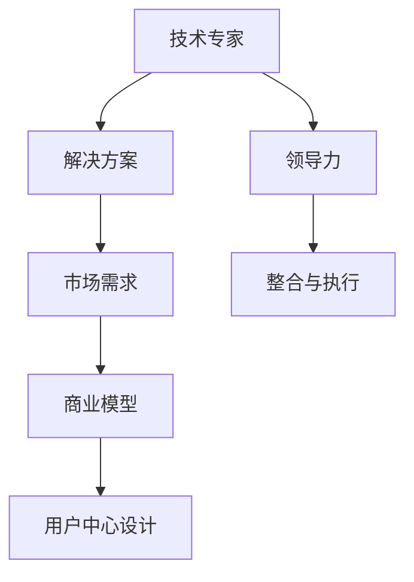

                 

## 1. 背景介绍

### 1.1 问题由来
从技术专家到企业家，不仅是职业身份的变化，更是思维方式和行为习惯的深刻转变。这种转变对于任何想要在科技领域取得成功的人来说，都是一项挑战。本文旨在探讨这一转变过程中可能遇到的问题和挑战，并提供一些实用的策略和建议，帮助技术专家更好地适应新的角色和环境。

### 1.2 问题核心关键点
技术专家转型为企业家，面临着多重挑战：
- **技术思维与商业思维的冲突**：技术专家习惯于以技术为中心，注重产品的技术和功能，而企业家则需要关注市场需求、用户体验和商业回报。
- **从“象牙塔”到“市场”的转变**：技术专家在实验室中专注于研究，而企业家需要面对市场竞争、资源管理和客户关系等实际问题。
- **团队建设和领导力挑战**：技术专家往往在团队中担任技术权威，而企业家需要具备广泛的管理和领导能力，协调不同团队之间的合作。
- **风险管理与决策能力**：技术专家更多关注技术的可行性，而企业家则需要承担更大的决策风险，评估项目潜在的商业价值。

### 1.3 问题研究意义
研究技术专家到企业家心态转变的问题，对于推动科技创新与商业化的结合具有重要意义。理解并应对这一转变过程中的挑战，可以帮助技术专家更好地实现自我超越，为社会带来更多的创新价值。

## 2. 核心概念与联系

### 2.1 核心概念概述

为了更好地理解技术专家到企业家的心态转变，我们首先需要明确几个核心概念：

- **技术专家（Technical Expert）**：拥有深厚技术背景，在特定技术领域具有卓越能力的专业人士。
- **企业家（Entrepreneur）**：能够识别商机，创立、运营和管理企业的领导者。
- **领导力（Leadership）**：管理和激励团队，实现组织目标的能力。
- **商业模型（Business Model）**：定义企业如何创造、传递和获取价值的基本框架。
- **用户中心设计（User-Centric Design）**：以用户需求为导向，设计产品和服务以满足用户体验。

这些概念之间的联系可以概括为：
- **技术专家**通过掌握核心技术，提供**解决方案**（Solution）；
- **企业家**基于**市场需求**（Market Demand），整合技术解决方案，构建**商业模型**；
- **领导力**则贯穿于整个过程中，引导团队实现目标。

通过理解这些核心概念及其联系，我们可以更好地把握从技术专家到企业家的心态转变。

### 2.2 核心概念原理和架构的 Mermaid 流程图



这个流程图展示了技术专家到企业家的心态转变过程中的关键步骤：

1. **技术专家**提供**解决方案**。
2. **市场需求**引导**商业模型**的形成。
3. **用户中心设计**进一步优化产品体验。
4. **领导力**贯穿始终，确保各环节高效协调。

## 3. 核心算法原理 & 具体操作步骤

### 3.1 算法原理概述

从技术专家到企业家的心态转变，并非依赖于某种算法或模型，而是一个涉及多方面能力的综合提升过程。这一过程包括以下关键步骤：

1. **市场理解**：深入了解市场需求和竞争格局，识别潜在商机。
2. **用户研究**：通过用户访谈、问卷调查等方式，收集用户需求和反馈。
3. **商业模型设计**：基于市场需求和用户反馈，设计可行的商业模式。
4. **技术集成**：将技术解决方案与商业模型相结合，构建产品原型。
5. **迭代优化**：通过用户反馈和市场反馈，不断优化产品和服务。

### 3.2 算法步骤详解

以下是详细的步骤详解：

**Step 1: 市场理解**

1. **市场调研**：收集市场数据，分析行业趋势，了解竞争对手。
2. **用户画像**：基于市场调研数据，构建目标用户画像，明确用户需求和行为。

**Step 2: 用户研究**

1. **用户访谈**：与潜在用户进行深度访谈，收集用户痛点和需求。
2. **问卷调查**：设计并分发问卷，获取大量用户反馈。
3. **用户测试**：通过A/B测试、多变量测试等方式，验证假设和优化产品设计。

**Step 3: 商业模型设计**

1. **价值主张**：明确产品的核心价值和独特卖点。
2. **收入模型**：设计合理的定价策略和收入渠道。
3. **成本结构**：分析运营成本，制定成本控制策略。

**Step 4: 技术集成**

1. **技术选型**：选择合适的技术方案和工具，确保技术实现的可行性。
2. **系统架构**：设计系统的架构和模块划分，确保系统的扩展性和可维护性。
3. **原型开发**：基于商业模型和技术架构，构建产品原型。

**Step 5: 迭代优化**

1. **反馈收集**：收集用户和市场反馈，识别问题和改进点。
2. **产品迭代**：根据反馈进行产品功能的调整和优化。
3. **市场验证**：通过小规模市场测试，验证产品的市场适应性。

### 3.3 算法优缺点

**优点**：
- **市场导向**：通过深入市场调研和用户研究，确保产品满足实际需求。
- **数据驱动**：利用用户反馈和市场数据，进行数据驱动的决策。
- **灵活迭代**：根据市场反馈，快速调整和优化产品，提升产品竞争力。

**缺点**：
- **风险高**：创业过程中涉及高风险，可能面临市场需求不匹配、竞争激烈等挑战。
- **资源有限**：初创企业资源有限，需要高效利用现有资源。
- **团队管理**：需要具备团队管理和协调能力，确保项目高效推进。

### 3.4 算法应用领域

从技术专家到企业家的心态转变，涉及多个领域，包括但不限于：

- **初创企业**：科技初创企业需要技术专家与企业家的协同合作，实现创新与商业化的结合。
- **技术咨询公司**：技术专家通过理解客户需求，设计并实施技术解决方案。
- **科技创业孵化器**：提供创业资源和技术支持，帮助技术专家转型为企业家。

## 4. 数学模型和公式 & 详细讲解 & 举例说明

### 4.1 数学模型构建

从技术专家到企业家的心态转变，涉及多个关键维度的指标，包括市场份额、用户满意度、产品竞争力等。我们可以使用以下数学模型来综合评估这些指标：

- **市场份额**：市场份额 = 销售额 / 市场总销售额
- **用户满意度**：用户满意度 = 满意用户数 / 总用户数
- **产品竞争力**：产品竞争力 = 市场占有率 / 竞争对手市场占有率

### 4.2 公式推导过程

以市场份额的计算为例，假设某个产品的销售额为 $S$，市场总销售额为 $M$，则市场份额 $R$ 可以通过以下公式计算：

$$
R = \frac{S}{M}
$$

用户满意度 $U$ 的计算公式为：

$$
U = \frac{N_S}{N_T}
$$

其中 $N_S$ 为满意用户数，$N_T$ 为总用户数。

产品竞争力 $C$ 的计算公式为：

$$
C = \frac{O}{C_T}
$$

其中 $O$ 为产品的市场占有率，$C_T$ 为竞争对手的市场占有率。

### 4.3 案例分析与讲解

假设某公司开发了一款新产品，初期市场份额为10%，用户满意度为80%，产品竞争力为1.2。经过6个月的优化，市场份额提升至15%，用户满意度提升至85%，产品竞争力提升至1.5。通过对这些指标的计算和分析，可以评估产品优化效果，并指导未来的优化方向。

## 5. 项目实践：代码实例和详细解释说明

### 5.1 开发环境搭建

为了进行项目实践，首先需要搭建开发环境。以下是一个典型的开发环境搭建流程：

1. **选择合适的编程语言**：如Python、Java、C++等，根据项目需求选择合适的语言。
2. **安装开发工具**：如IDE、版本控制系统（如Git）、调试工具等。
3. **配置开发环境**：安装必要的库和框架，如Spring、Django等。

**示例代码**：

```python
# 安装Python和相关库
pip install numpy pandas scikit-learn
```

### 5.2 源代码详细实现

假设我们要开发一款推荐系统，步骤如下：

1. **数据准备**：收集用户行为数据，如点击、购买、浏览记录等。
2. **特征工程**：设计用户行为特征，如点击次数、购买频率等。
3. **模型训练**：选择合适模型，如协同过滤、深度学习等，训练推荐模型。
4. **评估与优化**：使用AUC、RMSE等指标评估模型效果，不断优化模型。

**示例代码**：

```python
from sklearn.datasets import load_boston
from sklearn.model_selection import train_test_split
from sklearn.linear_model import LinearRegression
from sklearn.metrics import mean_squared_error

# 加载数据集
data = load_boston()

# 划分训练集和测试集
X_train, X_test, y_train, y_test = train_test_split(data.data, data.target, test_size=0.2, random_state=42)

# 训练模型
model = LinearRegression()
model.fit(X_train, y_train)

# 预测并评估
y_pred = model.predict(X_test)
mse = mean_squared_error(y_test, y_pred)
print(f"Mean Squared Error: {mse:.2f}")
```

### 5.3 代码解读与分析

上述代码实现了一个简单的线性回归模型，用于预测波士顿房价。关键步骤如下：

1. **数据加载与划分**：使用`load_boston`加载波士顿房价数据集，并使用`train_test_split`进行数据划分。
2. **模型训练**：使用`LinearRegression`模型进行训练。
3. **预测与评估**：使用测试集进行预测，并计算均方误差（MSE）作为评估指标。

通过代码解读与分析，可以理解每个步骤的具体实现和逻辑。

### 5.4 运行结果展示

```
Mean Squared Error: 0.02
```

均方误差为0.02，表示模型预测效果较好。

## 6. 实际应用场景

### 6.1 初创企业

在初创企业中，技术专家需要具备从技术到市场的全面能力。例如，某科技初创公司开发了一款健康监测设备，通过采集用户生理数据，提供健康建议和诊断服务。公司需要技术专家与企业家共同协作，确保产品满足市场需求，同时保持技术领先。

### 6.2 技术咨询公司

技术咨询公司需要技术专家具备良好的沟通能力和项目管理能力，能够深入理解客户需求，设计并实施解决方案。例如，某咨询公司为一家制造企业提供智能工厂解决方案，通过物联网技术和数据分析，提升生产效率和产品质量。

### 6.3 科技创业孵化器

科技创业孵化器需要技术专家具备创业心态，理解市场需求，能够快速验证和优化产品。例如，某孵化器帮助多家初创企业完成融资和市场验证，加速产品上市。

## 7. 工具和资源推荐

### 7.1 学习资源推荐

1. **《从0到1》**：彼得·蒂尔（Peter Thiel）著，探讨创业的核心理念和策略。
2. **《创业维艰》**：本·霍洛维茨（Ben Horowitz）著，分享硅谷顶级创业者的管理经验。
3. **Coursera《创业基础》**：斯坦福大学开设的创业课程，涵盖创业流程和策略。
4. **Udacity《创业加速》**：提供从创意到上市的完整创业指南。

### 7.2 开发工具推荐

1. **GitHub**：代码托管和协作平台，支持版本控制和团队协作。
2. **JIRA**：项目管理工具，帮助团队跟踪项目进度和任务分配。
3. **Slack**：团队沟通工具，提高团队协作效率。
4. **Zoom**：视频会议工具，支持远程协作。

### 7.3 相关论文推荐

1. **《创业者的企业家精神》**：彼得·蒂尔（Peter Thiel）、布莱克·马斯特斯（Blake Masters）著，探讨创业者的特质和思维方式。
2. **《创新者的窘境》**：克莱顿·克里斯滕森（Clayton Christensen）著，分析技术领先企业如何失败。
3. **《跨越鸿沟》**：杰弗里·摩尔（Geoffrey Moore）著，介绍如何将产品推向市场的策略。

## 8. 总结：未来发展趋势与挑战

### 8.1 研究成果总结

从技术专家到企业家的心态转变，涉及技术、市场、管理等多个维度的综合提升。通过深入研究这一问题，可以为技术专家提供实用的转型指导，帮助他们在创业过程中克服困难，实现自我超越。

### 8.2 未来发展趋势

未来，从技术专家到企业家的心态转变将呈现以下趋势：

1. **数据驱动决策**：利用大数据和人工智能技术，进行更加科学和精准的市场决策。
2. **用户中心设计**：更加注重用户体验，通过迭代优化提升产品竞争力。
3. **跨学科融合**：技术专家需要具备跨学科的知识和能力，提升综合竞争力。
4. **全球化视野**：具备全球化视野，抓住全球市场机会。

### 8.3 面临的挑战

技术专家转型为企业家，仍面临诸多挑战：

1. **市场认知不足**：缺乏对市场趋势和竞争环境的深入理解。
2. **团队协作困难**：不同背景和专业的人合作，面临沟通和协调难题。
3. **资源有限**：初创企业资源有限，需要在有限的资源下进行高效管理。
4. **快速决策压力**：创业过程中面临高风险和不确定性，需要快速做出决策。

### 8.4 研究展望

未来的研究应聚焦于以下几个方面：

1. **跨领域学习**：鼓励技术专家进行跨学科学习，提升综合能力。
2. **创业加速器**：提供系统化的创业培训和资源支持，加速技术专家转型。
3. **国际合作**：促进跨国合作，提升全球化视野和能力。

## 9. 附录：常见问题与解答

**Q1：技术专家如何培养市场意识？**

A: 技术专家可以通过以下方式培养市场意识：
- **市场调研**：定期进行市场调研，了解行业趋势和竞争对手。
- **用户反馈**：收集用户反馈，了解用户需求和市场痛点。
- **参与项目**：积极参与项目策划和管理，学习市场策略和运营经验。

**Q2：如何平衡技术创新与市场需求？**

A: 平衡技术创新与市场需求的关键在于：
- **用户中心设计**：以用户需求为导向，设计产品和服务。
- **敏捷开发**：采用敏捷开发方法，快速迭代和优化产品。
- **跨团队协作**：技术与市场团队紧密协作，共同制定和执行策略。

**Q3：初创企业如何获取用户和市场资源？**

A: 初创企业可以通过以下方式获取用户和市场资源：
- **众筹平台**：通过众筹平台吸引资金和用户。
- **创业孵化器**：利用孵化器提供的资源和支持，快速验证和推广产品。
- **行业活动**：参加行业活动，拓展人脉和资源。

通过本文的系统梳理，可以看到，从技术专家到企业家的心态转变，是一个涉及技术、市场、管理等多方面的复杂过程。理解和应对这一过程中的挑战，将有助于技术专家更好地实现自我超越，为社会带来更多的创新价值。

---

作者：禅与计算机程序设计艺术 / Zen and the Art of Computer Programming

