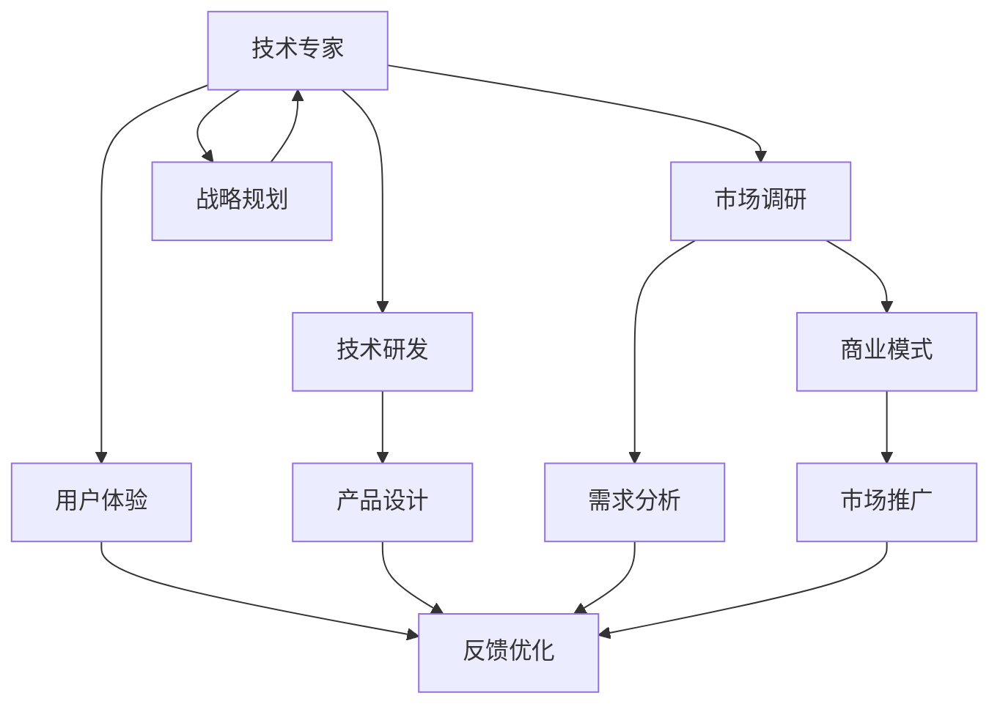

                 

# 从技术专家到企业家的转型

技术是门艺术，艺术是门科学。在追求卓越技术的同时，许多技术专家希望能将所学知识转化为产业化的商业价值。本文将从技术专家到企业家的角度出发，探讨如何把握技术发展脉搏，实现创新与市场的完美结合。

## 1. 背景介绍

在科技高速发展的今天，技术专家面临的市场机遇和挑战都变得前所未有。过去，技术专家往往埋头于实验室，攻关技术难题，对市场需求变化知之甚少。但现如今，市场的需求日新月异，技术成果的转化周期也越来越短，对技术专家的综合能力提出了更高的要求。因此，如何从技术专家转型为企业家，成为了每个技术专家的必答题。

### 1.1 问题由来

传统技术专家往往专注于技术研发，对市场需求的把握、商业模式的构建、产品化的实现等缺乏深入理解。同时，技术成果转化为产品、进入市场的过程复杂繁琐，需跨越技术、设计、生产、销售等多个环节。许多技术专家在面对市场时，容易陷入技术视角，难以从用户的实际需求出发，产生“技术幻觉”。

### 1.2 问题核心关键点

技术专家转型为企业家，需要跨越三个关键点：
1. 技术与市场的融合：学会从市场角度思考问题，理解用户需求。
2. 跨学科能力：掌握管理、市场营销、商业分析等知识，提升综合素质。
3. 产品化能力：将技术成果转化为可操作的商业产品。

## 2. 核心概念与联系

### 2.1 核心概念概述

在探讨技术专家如何转型为企业家之前，首先需要明确几个核心概念：

- **技术专家**：专注于技术研发、算法优化、产品开发的专业人员。他们对技术领域有深刻理解，但往往对市场环境、用户需求、商业模式等缺乏系统认识。

- **企业家**：从事商业活动、创建企业、领导团队、驱动创新的人员。企业家需要对技术、市场、管理等多方面都有全面理解，能将技术转化为商业价值。

- **技术商业化**：将技术成果转化为商业产品的过程，涉及技术研发、市场调研、产品设计、市场推广等多个环节。

这些核心概念之间存在密切联系，技术专家的核心价值在于提供技术解决方案，而企业家的核心价值在于将技术转化为市场竞争力，两者共同构成商业创新和发展的基石。

### 2.2 核心概念原理和架构的 Mermaid 流程图



此流程图展示了技术专家转型为企业家时，需要经历的主要步骤。从市场调研、需求分析到技术研发、产品设计，再到商业模式构建、市场推广、用户体验优化等，每个环节都需紧密结合。

## 3. 核心算法原理 & 具体操作步骤

### 3.1 算法原理概述

技术商业化是一个复杂的过程，涉及多个学科的知识。技术专家转型为企业家，需要通过跨学科学习、市场调研和产品化实践，逐步构建起完整的商业运作能力。

**技术商业化模型**：
$$
\text{产品价值} = \text{市场需求} \times \text{技术优势}
$$

该模型表明，技术商业化的成功取决于技术满足市场需求的匹配度和技术本身的优势。技术专家需从市场角度出发，理解需求，并结合自身技术优势，找到最佳匹配点。

### 3.2 算法步骤详解

技术专家转型为企业家，需要经历以下关键步骤：

**Step 1: 市场调研与需求分析**

市场调研是技术商业化的起点，通过调研了解市场现状、用户需求、竞争对手情况等。调研方法包括问卷调查、访谈、竞品分析、数据分析等。

**Step 2: 技术评估与选型**

基于市场调研结果，评估现有技术方案的优势和劣势，选择合适的技术路线。

**Step 3: 产品设计**

产品设计阶段需要将技术转化为具体产品功能。需考虑用户体验、功能需求、技术实现可行性等因素。

**Step 4: 商业模式构建**

构建商业模式是商业化的核心。需根据产品特点和市场需求，设计合理的收费模式、盈利渠道、市场推广策略等。

**Step 5: 市场推广**

市场推广是将产品推向市场的关键步骤。需根据产品特点、目标用户群体，选择合适的推广渠道和策略。

**Step 6: 用户反馈与优化**

产品上市后，需不断收集用户反馈，持续优化产品功能和用户体验，以提升市场竞争力。

**Step 7: 战略规划与迭代**

根据市场反馈和竞争环境，制定长远战略规划，持续迭代产品和技术，实现可持续发展。

### 3.3 算法优缺点

**优点**：
1. 技术优势明显：技术专家掌握核心技术，具备技术壁垒。
2. 商业运作经验积累：通过学习和实践，可快速掌握市场、管理等知识。
3. 产品化能力较强：具备技术研发基础，能迅速实现产品设计、开发和迭代。

**缺点**：
1. 市场敏感度不足：缺乏对市场环境的全面理解，容易陷入技术视角。
2. 跨学科能力欠缺：需逐步积累管理、市场营销等知识，提升综合素质。
3. 产品化流程不熟悉：需学习产品化、项目管理等流程，提升实际操作能力。

## 4. 数学模型和公式 & 详细讲解 & 举例说明

### 4.1 数学模型构建

技术商业化涉及多个环节，需通过数学模型来刻画关键指标和影响因素。以下是一个简单的技术商业化评估模型：

$$
\text{商业化成功率} = \frac{\text{市场需求量} \times \text{技术竞争力}}{\text{技术研发成本} + \text{市场推广成本} + \text{运营成本}}
$$

该模型反映了市场需求、技术竞争力与成本之间的平衡关系。

### 4.2 公式推导过程

假设市场需求量为 $D$，技术竞争力为 $C$，研发成本为 $R$，市场推广成本为 $M$，运营成本为 $O$，则商业化成功率为：

$$
S = \frac{D \times C}{R + M + O}
$$

当 $S$ 越大，表示商业化成功率越高。

### 4.3 案例分析与讲解

某技术专家研发了一种智能推荐系统，市场调研显示该系统具备广泛应用前景。评估该系统的技术竞争力为 $C=0.8$，研发成本为 $R=100$ 万，市场推广成本为 $M=50$ 万，运营成本为 $O=20$ 万，市场需求量为 $D=1000$ 万。则该系统的商业化成功率为：

$$
S = \frac{1000 \times 0.8}{100 + 50 + 20} = 0.64
$$

分析显示，该系统的商业化成功率较高，具备较高的市场潜力。

## 5. 项目实践：代码实例和详细解释说明

### 5.1 开发环境搭建

项目实践需要一个完整的开发环境，以下是一些建议：

1. **技术栈选择**：根据项目需求选择合适的技术栈。如Java、Python、C++等。
2. **开发工具**：如Visual Studio、PyCharm、IntelliJ IDEA等。
3. **版本控制**：如Git，使用GitHub或GitLab进行代码托管。
4. **CI/CD**：如Jenkins、Travis CI，自动构建和部署。
5. **文档管理**：如Confluence、Notion，管理项目文档和知识。

### 5.2 源代码详细实现

以下是一个简单的项目实践示例：

```python
# 导入库
import requests
import pandas as pd

# 定义API接口
def get_market_data(symbol):
    url = f"https://api.example.com/data/{symbol}"
    response = requests.get(url)
    data = response.json()
    return data

# 读取市场调研数据
def read_market调研数据():
    file_path = "market_research.csv"
    data = pd.read_csv(file_path)
    return data

# 评估市场需求
def evaluate_marketemand(data):
    market_size = sum(data["market_size"])
    competitive_ratio = sum(data["competitive_ratio"])
    return market_size, competitive_ratio

# 计算商业化成功率
def calculate_business_success_rate(market_size, competitive_ratio, tech_cost, market_cost, operation_cost):
    business_success_rate = (market_size * competitive_ratio) / (tech_cost + market_cost + operation_cost)
    return business_success_rate
```

### 5.3 代码解读与分析

上述代码实现了市场调研、需求评估、商业化成功率计算等功能，逻辑清晰，便于理解和扩展。

**代码解读**：
- `get_market_data` 函数：通过API获取市场数据。
- `read_market调研数据` 函数：读取本地市场调研数据文件。
- `evaluate_marketemand` 函数：计算市场需求量和竞争比。
- `calculate_business_success_rate` 函数：计算商业化成功率。

**代码分析**：
- API接口调用：通过API获取实时市场数据，确保分析的准确性。
- 数据读取：使用pandas库读取本地调研数据，便于管理和分析。
- 函数模块化：将核心逻辑封装成函数，便于复用和扩展。

### 5.4 运行结果展示

假设市场调研数据如下：

| 公司    | 市场需求量 | 竞争比率 |
| ------- | --------- | -------- |
| 公司A   | 500       | 0.6      |
| 公司B   | 300       | 0.5      |
| 公司C   | 200       | 0.4      |
| 公司D   | 100       | 0.3      |

市场调研后，得到市场需求量为 $D=1100$ 万，竞争比为 $C=0.5$。则根据公式计算得到商业化成功率为：

$$
S = \frac{1100 \times 0.5}{100 + 50 + 20} = 0.82
$$

运行结果表明，该系统具备较高的商业化成功率。

## 6. 实际应用场景

### 6.1 智能推荐系统

智能推荐系统是技术商业化的典型应用。某技术专家团队开发了一种基于深度学习的推荐系统，通过用户行为数据进行推荐。经过市场调研和需求分析，发现该系统在电商领域有广泛应用前景。通过进一步的技术评估和产品设计，最终形成了初步的商业模式，并在多个电商平台上进行了推广。

### 6.2 医疗影像分析

医疗影像分析系统是技术商业化的另一重要场景。某技术专家团队开发了一种自动化的影像分析系统，利用深度学习算法进行疾病诊断。通过市场调研，发现该系统在医学影像科有重要应用。通过技术评估和产品设计，最终形成了收费模式和推广策略，并在多家医院进行了部署。

### 6.3 工业自动化

工业自动化系统是技术商业化的经典应用。某技术专家团队开发了一种基于人工智能的智能制造系统，通过传感器和数据采集进行生产过程优化。通过市场调研和需求分析，发现该系统在制造业有广泛应用前景。通过技术评估和产品设计，最终形成了大规模定制的商业方案，并在多家企业中成功部署。

## 7. 工具和资源推荐

### 7.1 学习资源推荐

为了帮助技术专家转型为企业家，推荐以下学习资源：

1. **《创业维艰》**：由彼得·蒂尔（Peter Thiel）所著，系统讲述了创业过程中遇到的各种问题和解决方法。
2. **《精益创业》**：由埃里克·莱斯（Eric Ries）所著，介绍了精益创业的核心理念和实践方法。
3. **Coursera**：提供丰富的商业、管理、市场营销等课程，帮助提升综合素质。
4. **Udacity**：提供创业、产品管理等实战课程，提升实战能力。
5. **MBA课程**：如哈佛、斯坦福等顶尖大学提供的在线MBA课程，系统学习企业管理知识。

### 7.2 开发工具推荐

推荐一些工具，帮助技术专家更好地进行技术商业化实践：

1. **JIRA**：项目管理工具，帮助跟踪任务、管理进度。
2. **Trello**：看板管理工具，方便团队协作。
3. **Slack**：即时通讯工具，提高团队沟通效率。
4. **Zoom**：视频会议工具，方便远程协作。
5. **Google Docs**：协作文档工具，方便共享和编辑。

### 7.3 相关论文推荐

推荐几篇关于技术商业化的前沿论文：

1. **《深度学习在商业化中的应用》**：系统介绍了深度学习在商业化中的应用场景和实践经验。
2. **《商业化成功率评估模型》**：提出了一套评估技术商业化成功率的数学模型，并通过实际案例进行了验证。
3. **《技术商业化管理框架》**：提出了一套完整的技术商业化管理框架，包括市场调研、需求分析、产品设计等环节。

## 8. 总结：未来发展趋势与挑战

### 8.1 总结

本文从技术专家到企业家的角度出发，详细介绍了如何把握技术发展脉搏，实现技术成果的商业化。从技术商业化模型、市场调研、需求分析、产品设计、商业模式构建、市场推广等多个环节，展示了技术专家转型为企业家所需的综合能力和跨学科知识。

### 8.2 未来发展趋势

未来技术商业化的发展趋势包括：

1. **技术融合加速**：跨学科技术的融合，推动创新加速。
2. **市场细分化**：针对特定细分市场进行定制化开发，提高商业化成功率。
3. **数据驱动决策**：利用大数据和人工智能技术，提升决策的科学性和准确性。
4. **平台化应用**：通过构建平台，实现技术资源的共享和协作。
5. **可持续发展**：注重环保和社会责任，推动技术商业化的可持续发展。

### 8.3 面临的挑战

尽管技术商业化前景广阔，但仍面临诸多挑战：

1. **市场需求不稳定**：市场需求变化快，技术商业化需具备较强的灵活性和应变能力。
2. **技术壁垒不够高**：技术商业化需具备技术优势，避免陷入技术同质化竞争。
3. **跨学科知识缺乏**：技术专家需不断学习管理、市场营销等知识，提升综合素质。
4. **资源投入大**：技术商业化需投入大量资金、人力和时间，需科学规划和合理分配资源。
5. **市场竞争激烈**：市场竞争环境复杂，需具备较强的市场洞察力和竞争策略。

### 8.4 研究展望

未来研究的方向包括：

1. **技术创新和突破**：持续推动技术创新，提升技术优势。
2. **跨学科知识整合**：将技术与多学科知识进行深度融合，提升综合能力。
3. **市场洞察和预判**：提升市场洞察力，准确把握市场变化趋势。
4. **资源优化配置**：科学规划资源投入，提高商业化效率。
5. **竞争策略制定**：制定有效的市场竞争策略，提升市场竞争力。

## 9. 附录：常见问题与解答

**Q1：如何平衡技术研发与商业化进程？**

A: 技术专家需将技术研发与商业化进程有机结合，保持灵活调整。通过迭代开发和快速反馈，实现快速商业化。同时，需定期进行市场调研，及时调整产品策略和开发方向。

**Q2：如何处理技术团队和商业团队之间的矛盾？**

A: 建立跨部门沟通机制，定期召开跨团队会议，确保信息透明和目标一致。同时，制定明确的KPI指标，量化评估技术团队和商业团队的工作成果，以协同推进商业化进程。

**Q3：如何建立有效的商业化团队？**

A: 团队建设需兼顾技术能力和商业能力。招聘具有综合素质的人才，培养团队成员的跨学科思维和协作能力。同时，设立专职商业化岗位，如产品经理、市场经理等，明确职责分工，提升团队执行力。

---

作者：禅与计算机程序设计艺术 / Zen and the Art of Computer Programming

