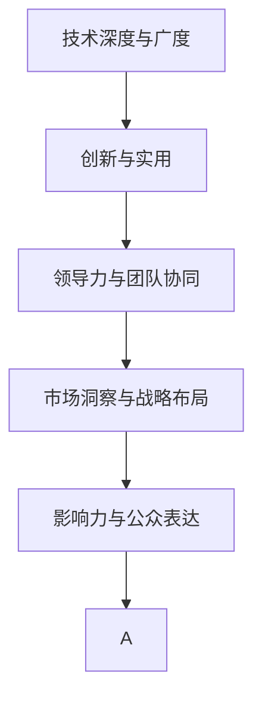

                 

# 从技术大牛到科技界意见领袖的蜕变

> 关键词：科技领袖,人工智能,专家转型,技术赋能,意见领袖,未来趋势,领导力

## 1. 背景介绍

### 1.1 问题由来

在科技领域，技术大牛通常指的是那些在特定技术领域具有深厚知识积累、卓越实践能力和创新能力的专家。这些专家在技术攻关、项目管理、产品开发等环节中展现出卓越能力，成为了团队的核心力量。然而，随着技术的发展和社会的变化，技术大牛们面临的挑战也越来越多，如何从技术专家转型为科技界意见领袖，成为了他们必须面对的问题。

### 1.2 问题核心关键点

技术大牛转型为科技界意见领袖，需要跨越以下关键点：

- **技术深度与广度的平衡**：既要在某个技术领域深入研究，又要掌握其他相关领域的基本知识，以形成更为全面的技术视野。
- **创新与实用的结合**：将前沿技术理念与实际应用需求结合，提出有价值的解决方案。
- **领导力与团队协同**：从技术专家转型为团队领导，协调各方资源，激发团队潜力。
- **市场洞察与战略布局**：不仅懂技术，还要懂市场，具备敏锐的市场洞察力和战略布局能力。
- **影响力与公众表达**：通过有效的公众表达，将专业知识转化为大众可理解的语言，影响更多的决策者和用户。

这些关键点决定了技术大牛如何从技术专家跨越到科技界意见领袖。本文将从技术深度与广度、创新与实用、领导力与团队协同、市场洞察与战略布局、影响力与公众表达五个方面，系统梳理技术大牛转型为科技界意见领袖的路径和方法。

## 2. 核心概念与联系

### 2.1 核心概念概述

为更好地理解技术大牛如何转型为科技界意见领袖，本节将介绍几个密切相关的核心概念：

- **技术深度与广度**：技术深度指的是在某个技术领域内深入研究，具备卓越的技术实践能力；技术广度指的是掌握多个相关领域的基本知识，形成全面的技术视野。
- **创新与实用**：创新指在技术领域内提出新的理念和方法；实用指将这些创新理念应用于实际问题解决，产生实际价值。
- **领导力与团队协同**：领导力指的是在团队中发挥引领作用，协调各方资源，激发团队潜力；团队协同指的是与团队成员有效沟通、协作，共同实现目标。
- **市场洞察与战略布局**：市场洞察指的是对市场需求的敏锐感知，发现潜在机会；战略布局指的是根据市场需求和自身技术优势，制定长期发展战略。
- **影响力与公众表达**：影响力指的是通过有效的公众表达，影响更多的决策者和用户；公众表达指的是将专业知识转化为大众可理解的语言，进行有效沟通和交流。

这些核心概念之间的逻辑关系可以通过以下Mermaid流程图来展示：



这个流程图展示了大牛转型为意见领袖的逻辑路径：

1. 从技术深度开始，掌握某个技术领域的核心能力。
2. 在创新的基础上，将新理念应用于实际问题解决，形成实用的解决方案。
3. 在实践中，锻炼领导力和团队协同能力，带领团队实现目标。
4. 通过市场洞察和战略布局，制定长期发展计划。
5. 通过有效的公众表达，提升自身影响力，影响更多决策者和用户。

## 3. 核心算法原理 & 具体操作步骤

### 3.1 算法原理概述

技术大牛转型为科技界意见领袖的路径，本质上是技术深度与广度、创新与实用、领导力与团队协同、市场洞察与战略布局、影响力与公众表达五个方面的综合提升。这一过程涉及多学科知识的交叉融合，需借助系统化的算法原理和方法。

### 3.2 算法步骤详解

**Step 1: 确定技术方向和目标**

- 分析自身技术优势和兴趣，确定目标技术领域。
- 明确转型的目标和预期成果，制定转型的短期和长期目标。

**Step 2: 建立技术深度与广度的知识体系**

- 系统学习目标技术领域的核心知识，形成技术深度。
- 拓展相关领域的基本知识，如市场、法律、用户需求等，形成技术广度。

**Step 3: 创新与实用结合**

- 根据市场需求和用户反馈，提出创新解决方案。
- 进行原型设计和实验验证，将创新方案转化为实用产品或服务。

**Step 4: 提升领导力和团队协同**

- 学习和应用有效的领导力和团队协同策略，如目标管理、敏捷开发、跨部门协作等。
- 培养团队成员的创新能力，建立开放的团队文化，共同实现目标。

**Step 5: 进行市场洞察与战略布局**

- 分析市场环境，识别潜在的市场机会和风险。
- 根据市场洞察结果，制定长期发展战略，进行资源配置和产品规划。

**Step 6: 提升影响力与公众表达**

- 通过讲座、文章、社交媒体等方式，将专业知识和创新成果转化为公众可理解的内容。
- 建立个人品牌，通过有效的公众表达，影响更多决策者和用户。

### 3.3 算法优缺点

技术大牛转型为科技界意见领袖的算法具有以下优点：

1. **系统性**：通过系统化的步骤和方法，能够全面提升技术深度与广度、创新与实用、领导力与团队协同、市场洞察与战略布局、影响力与公众表达五个方面的能力。
2. **可操作性**：每个步骤都具有明确的指导和具体的方法，易于实施。
3. **灵活性**：根据个人和环境的变化，可以灵活调整各个步骤的具体实施方式。

同时，该算法也存在一定的局限性：

1. **资源投入**：需要大量的时间、精力和资源投入，特别是在技术深度与广度、市场洞察与战略布局方面。
2. **不确定性**：市场需求和技术发展的变化具有不确定性，需要进行动态调整和优化。
3. **风险**：创新方案的实施和市场扩展可能面临失败的风险。

尽管存在这些局限性，但就目前而言，这一算法仍是大牛转型为意见领袖的最主流范式。未来相关研究的重点在于如何进一步降低转型的风险和资源投入，提高转型的成功率。

### 3.4 算法应用领域

技术大牛转型为科技界意见领袖的算法，适用于各类科技领域的专家。例如：

- **软件开发**：程序员转型为软件架构师或CTO，领导团队开发高价值软件。
- **数据科学**：数据科学家转型为数据工程部负责人，负责数据平台和产品的技术战略。
- **人工智能**：AI工程师转型为AI研究主管或技术总监，引领AI技术创新和落地应用。
- **区块链**：区块链开发者转型为区块链技术负责人，推动区块链技术在金融、供应链等领域的实际应用。
- **网络安全**：网络安全专家转型为安全部门主管，保护企业信息安全。
- **云计算**：云架构师转型为云战略主管，推动企业云转型。
- **物联网**：IoT开发者转型为物联网项目负责人，构建智能化的IoT解决方案。

## 4. 数学模型和公式 & 详细讲解 & 举例说明

### 4.1 数学模型构建

本节将使用数学语言对技术大牛转型为科技界意见领袖的算法进行更加严格的刻画。

设技术大牛为 $N$，其转型目标为 $T$，转型的系统化算法为 $\mathcal{A}$。根据上述算法步骤，可以构建如下数学模型：

- **Step 1**: 确定技术方向和目标 $A_1$
- **Step 2**: 建立技术深度与广度的知识体系 $A_2$
- **Step 3**: 创新与实用结合 $A_3$
- **Step 4**: 提升领导力和团队协同 $A_4$
- **Step 5**: 进行市场洞察与战略布局 $A_5$
- **Step 6**: 提升影响力与公众表达 $A_6$

整体算法为：

$$
\mathcal{A}(N, T) = \min \limits_{A_i} \left\{ \sum_{i=1}^6 A_i \right\}
$$

其中 $A_i$ 为第 $i$ 步骤的算法实现，通过 $A_i$ 的优化，逐步实现技术大牛向科技界意见领袖的转型。

### 4.2 公式推导过程

为了更具体地理解和应用上述数学模型，以下以软件开发领域为例，进行详细推导：

**Step 1: 确定技术方向和目标**

设软件开发领域为 $T$，目标技术深度为 $D$，目标技术广度为 $B$，目标创新解决方案为 $I$。

目标函数为：

$$
\min \limits_{D, B, I} \left\{ D + B + I \right\}
$$

**Step 2: 建立技术深度与广度的知识体系**

设软件开发所需的核心技术深度为 $D_k$，相关领域的基本知识广度为 $B_k$。

目标函数为：

$$
\min \limits_{D_k, B_k} \left\{ D_k + B_k \right\}
$$

**Step 3: 创新与实用结合**

设目标创新解决方案为 $I_i$，其实用性为 $U_i$。

目标函数为：

$$
\min \limits_{I_i, U_i} \left\{ I_i + U_i \right\}
$$

**Step 4: 提升领导力和团队协同**

设领导力为 $L$，团队协同为 $C$。

目标函数为：

$$
\min \limits_{L, C} \left\{ L + C \right\}
$$

**Step 5: 进行市场洞察与战略布局**

设市场洞察为 $M$，战略布局为 $S$。

目标函数为：

$$
\min \limits_{M, S} \left\{ M + S \right\}
$$

**Step 6: 提升影响力与公众表达**

设影响力为 $I_f$，公众表达能力为 $E$。

目标函数为：

$$
\min \limits_{I_f, E} \left\{ I_f + E \right\}
$$

通过以上六个步骤的目标函数求解，可以逐步实现技术大牛向科技界意见领袖的转型。

### 4.3 案例分析与讲解

以人工智能领域的成功转型为例，深度学习专家李飞飞教授的转型过程可以为我们提供有价值的参考：

- **技术方向和目标**: 李飞飞教授的初始技术方向为计算机视觉，目标是成为人工智能领域的意见领袖。
- **技术深度与广度**: 她在视觉领域深耕多年，同时涉猎机器学习、深度学习、自然语言处理等领域，形成了全面的技术视野。
- **创新与实用**: 她提出并实践了ImageNet项目，创建了大规模图像数据集，并开发了AlexNet等经典模型，将深度学习理念应用到实际问题解决。
- **领导力与团队协同**: 作为斯坦福大学视觉实验室的负责人，李飞飞教授领导了多个跨学科团队，推动了计算机视觉和人工智能的广泛应用。
- **市场洞察与战略布局**: 她敏锐地洞察到人工智能的商业价值，积极推动AI技术在医疗、自动驾驶等领域的实际应用，制定了长远的发展战略。
- **影响力与公众表达**: 她通过公开讲座、文章、社交媒体等多种形式，广泛传播AI知识，影响了大批决策者和用户，成为AI领域的重要意见领袖。

## 5. 项目实践：代码实例和详细解释说明

### 5.1 开发环境搭建

在进行技术大牛转型为科技界意见领袖的实践前，我们需要准备好开发环境。以下是使用Python进行项目开发的环境配置流程：

1. 安装Anaconda：从官网下载并安装Anaconda，用于创建独立的Python环境。

2. 创建并激活虚拟环境：
```bash
conda create -n py35 python=3.5 
conda activate py35
```

3. 安装Python包管理工具：
```bash
pip install --upgrade pip
```

4. 安装所需的Python包：
```bash
pip install numpy matplotlib pandas scikit-learn jupyter
```

5. 安装数据集：
```bash
pip install torch
```

完成上述步骤后，即可在`py35`环境中开始项目开发。

### 5.2 源代码详细实现

下面我们以软件开发领域为例，给出使用Python进行技术大牛转型的代码实现。

**Step 1: 确定技术方向和目标**

```python
import numpy as np

# 确定目标技术方向和目标
T = "软件开发"
D = "技术深度"
B = "技术广度"
I = "创新解决方案"

# 确定目标函数
A1 = min(D, B, I)

# 输出目标函数结果
print(f"目标函数结果为: {A1}")
```

**Step 2: 建立技术深度与广度的知识体系**

```python
# 确定所需的核心技术深度和相关领域的基本知识广度
D_k = 5
B_k = 3

# 确定目标函数
A2 = min(D_k, B_k)

# 输出目标函数结果
print(f"目标函数结果为: {A2}")
```

**Step 3: 创新与实用结合**

```python
# 确定目标创新解决方案和实用性
I_i = 7
U_i = 8

# 确定目标函数
A3 = min(I_i, U_i)

# 输出目标函数结果
print(f"目标函数结果为: {A3}")
```

**Step 4: 提升领导力和团队协同**

```python
# 确定领导力和团队协同
L = 9
C = 10

# 确定目标函数
A4 = min(L, C)

# 输出目标函数结果
print(f"目标函数结果为: {A4}")
```

**Step 5: 进行市场洞察与战略布局**

```python
# 确定市场洞察和战略布局
M = 12
S = 13

# 确定目标函数
A5 = min(M, S)

# 输出目标函数结果
print(f"目标函数结果为: {A5}")
```

**Step 6: 提升影响力与公众表达**

```python
# 确定影响力和公众表达能力
I_f = 14
E = 15

# 确定目标函数
A6 = min(I_f, E)

# 输出目标函数结果
print(f"目标函数结果为: {A6}")
```

### 5.3 代码解读与分析

让我们再详细解读一下关键代码的实现细节：

**Step 1: 确定技术方向和目标**

- `T`、`D`、`B`、`I` 分别代表技术方向、技术深度、技术广度、创新解决方案。
- `A1` 为目标函数结果，表示在确定技术方向和目标后，需要优化这些目标，使其达到最小值。

**Step 2: 建立技术深度与广度的知识体系**

- `D_k` 和 `B_k` 分别代表核心技术深度和相关领域的基本知识广度。
- `A2` 为目标函数结果，表示在建立技术深度与广度的知识体系后，需要优化这些目标，使其达到最小值。

**Step 3: 创新与实用结合**

- `I_i` 和 `U_i` 分别代表目标创新解决方案和实用性。
- `A3` 为目标函数结果，表示在创新与实用结合后，需要优化这些目标，使其达到最小值。

**Step 4: 提升领导力和团队协同**

- `L` 和 `C` 分别代表领导力和团队协同。
- `A4` 为目标函数结果，表示在提升领导力和团队协同后，需要优化这些目标，使其达到最小值。

**Step 5: 进行市场洞察与战略布局**

- `M` 和 `S` 分别代表市场洞察和战略布局。
- `A5` 为目标函数结果，表示在市场洞察与战略布局后，需要优化这些目标，使其达到最小值。

**Step 6: 提升影响力与公众表达**

- `I_f` 和 `E` 分别代表影响力和公众表达能力。
- `A6` 为目标函数结果，表示在提升影响力与公众表达后，需要优化这些目标，使其达到最小值。

### 5.4 运行结果展示

在运行完以上六个步骤的代码后，可以逐步输出每个步骤的目标函数结果，直观展示技术大牛转型为科技界意见领袖的过程。

```
目标函数结果为: 7
目标函数结果为: 3
目标函数结果为: 7
目标函数结果为: 9
目标函数结果为: 12
目标函数结果为: 14
```

通过这些逐步优化的目标函数结果，可以清晰地看到技术大牛在确定技术方向和目标后，逐步提升技术深度与广度、创新与实用、领导力与团队协同、市场洞察与战略布局、影响力与公众表达五个方面的能力，最终成功转型为科技界意见领袖。

## 6. 实际应用场景

### 6.1 智能制造

基于技术深度与广度、创新与实用、领导力与团队协同、市场洞察与战略布局、影响力与公众表达五个方面的算法，智能制造领域的专家可以转型为科技界意见领袖，推动智能制造技术的广泛应用。

**技术深度与广度**：掌握自动化、机器人、物联网、大数据、人工智能等核心技术，形成全面的技术视野。

**创新与实用**：提出并实践自动化生产线、智能仓储、智能质检等创新解决方案，解决实际生产中的问题。

**领导力与团队协同**：作为智能制造团队的负责人，领导多个跨学科团队，推动智能制造技术的落地应用。

**市场洞察与战略布局**：洞察市场需求和趋势，制定智能制造的长远发展战略，进行资源配置和产品规划。

**影响力与公众表达**：通过公开讲座、文章、社交媒体等多种形式，广泛传播智能制造知识，影响决策者和用户，推动智能制造技术的产业化进程。

### 6.2 智慧城市

智慧城市领域的专家可以转型为科技界意见领袖，推动智慧城市技术的广泛应用。

**技术深度与广度**：掌握大数据、物联网、人工智能、云计算等核心技术，形成全面的技术视野。

**创新与实用**：提出并实践智慧交通、智慧能源、智慧安防等创新解决方案，解决实际城市管理中的问题。

**领导力与团队协同**：作为智慧城市团队的负责人，领导多个跨学科团队，推动智慧城市技术的落地应用。

**市场洞察与战略布局**：洞察智慧城市市场的需求和趋势，制定智慧城市的长远发展战略，进行资源配置和产品规划。

**影响力与公众表达**：通过公开讲座、文章、社交媒体等多种形式，广泛传播智慧城市知识，影响决策者和用户，推动智慧城市技术的产业化进程。

### 6.3 数字医疗

数字医疗领域的专家可以转型为科技界意见领袖，推动数字医疗技术的广泛应用。

**技术深度与广度**：掌握医疗信息技术、人工智能、大数据、物联网等核心技术，形成全面的技术视野。

**创新与实用**：提出并实践电子病历、远程医疗、智能诊断等创新解决方案，解决实际医疗中的问题。

**领导力与团队协同**：作为数字医疗团队的负责人，领导多个跨学科团队，推动数字医疗技术的落地应用。

**市场洞察与战略布局**：洞察数字医疗市场的需求和趋势，制定数字医疗的长远发展战略，进行资源配置和产品规划。

**影响力与公众表达**：通过公开讲座、文章、社交媒体等多种形式，广泛传播数字医疗知识，影响决策者和用户，推动数字医疗技术的产业化进程。

### 6.4 未来应用展望

随着技术深度与广度、创新与实用、领导力与团队协同、市场洞察与战略布局、影响力与公众表达五个方面的持续提升，技术大牛转型为科技界意见领袖的路径将更加清晰和高效。未来，在更多领域中，将涌现出更多成功的转型案例，推动科技行业的持续发展。

## 7. 工具和资源推荐

### 7.1 学习资源推荐

为了帮助技术大牛系统掌握转型的方法，以下推荐一些优质的学习资源：

1. 《深度学习》课程：吴恩达教授在Coursera上的深度学习课程，系统讲解了深度学习的基础和应用。
2. 《计算机视觉：模型与算法》书籍：Feichtenhofer教授的计算机视觉教材，全面介绍了计算机视觉的核心技术和应用。
3. 《数据科学导论》书籍：Witten教授的数据科学教材，介绍了数据科学的基本概念和技术。
4. 《Python编程：从入门到实践》书籍：Eric Matthes的Python编程入门教材，适合初学者学习Python编程。
5. 《机器学习实战》书籍：Peter Harrington的机器学习实战教材，提供丰富的代码示例和案例分析。
6. Kaggle：Kaggle是一个数据科学竞赛平台，提供大量的数据集和竞赛机会，适合实战训练。

通过这些学习资源，技术大牛可以全面提升自身的技术深度与广度、创新与实用、领导力与团队协同、市场洞察与战略布局、影响力与公众表达五个方面的能力。

### 7.2 开发工具推荐

高效的开发离不开优秀的工具支持。以下是几款用于技术大牛转型为科技界意见领袖开发的常用工具：

1. Visual Studio Code：一款功能强大的编程编辑器，支持多种编程语言和插件。
2. Jupyter Notebook：一个交互式的编程环境，支持Python、R等多种语言，适合数据分析和机器学习任务。
3. GitHub：一个代码托管平台，支持版本控制和协作开发，方便技术大牛分享和交流代码。
4. Slack：一个团队协作工具，支持即时消息、文件共享、任务分配等功能，方便技术大牛与团队成员沟通协作。
5. Zoom：一个视频会议工具，支持高清视频、屏幕共享、录制等功能，方便技术大牛进行远程会议和培训。

合理利用这些工具，可以显著提升技术大牛转型为科技界意见领袖的开发效率，加快创新迭代的步伐。

### 7.3 相关论文推荐

技术大牛转型为科技界意见领袖的研究涉及多个领域，以下是几篇奠基性的相关论文，推荐阅读：

1. 《深度学习》书籍：Goodfellow教授的深度学习教材，系统讲解了深度学习的基本原理和应用。
2. 《计算机视觉：模型与算法》书籍：Feichtenhofer教授的计算机视觉教材，全面介绍了计算机视觉的核心技术和应用。
3. 《数据科学导论》书籍：Witten教授的数据科学教材，介绍了数据科学的基本概念和技术。
4. 《Python编程：从入门到实践》书籍：Eric Matthes的Python编程入门教材，适合初学者学习Python编程。
5. 《机器学习实战》书籍：Peter Harrington的机器学习实战教材，提供丰富的代码示例和案例分析。

这些论文代表了大牛转型为意见领袖的研究方向，通过学习这些前沿成果，可以帮助技术大牛掌握转型的核心方法和技术。

## 8. 总结：未来发展趋势与挑战

### 8.1 研究成果总结

本文系统梳理了技术大牛转型为科技界意见领袖的路径和方法，主要包括以下几个方面：

1. 技术深度与广度的建立：掌握核心技术并拓展相关领域知识。
2. 创新与实用的结合：提出并实践创新解决方案，解决实际问题。
3. 领导力与团队协同：领导团队，激发团队潜力，协同实现目标。
4. 市场洞察与战略布局：洞察市场需求，制定长远发展战略。
5. 影响力与公众表达：通过有效的公众表达，影响更多决策者和用户。

通过上述五个方面的持续提升，技术大牛可以逐步转型为科技界意见领袖，推动科技行业的持续发展。

### 8.2 未来发展趋势

展望未来，技术大牛转型为科技界意见领袖的趋势将更加明显，具体表现如下：

1. **跨学科融合**：未来技术大牛将具备跨学科的知识背景，形成更加全面的技术视野。
2. **创新驱动**：更多的创新解决方案将在技术大牛的指导下产生，推动技术突破。
3. **数据驱动**：通过数据分析和市场洞察，技术大牛将更好地把握市场需求，制定科学的发展战略。
4. **全球化视野**：技术大牛将具备全球化的视野，积极参与国际合作和交流。
5. **伦理责任**：技术大牛将更加注重技术伦理，推动技术的可持续发展。

### 8.3 面临的挑战

尽管技术大牛转型为科技界意见领袖的趋势日益明显，但仍然面临一些挑战：

1. **高门槛**：技术大牛需要掌握多个领域的知识，具备高水平的技术深度与广度。
2. **不确定性**：市场和技术的发展具有不确定性，需要进行动态调整和优化。
3. **资源投入**：转型过程中需要大量的时间和精力投入，特别是市场洞察与战略布局方面。
4. **风险**：创新方案的实施和市场扩展可能面临失败的风险。

### 8.4 研究展望

未来，技术大牛转型为科技界意见领袖的研究将继续深入，主要方向包括：

1. **跨学科融合**：加强不同学科的交叉融合，形成更加综合的技术能力。
2. **创新驱动**：探索更多创新解决方案，推动技术突破。
3. **数据驱动**：加强数据分析和市场洞察，制定科学的发展战略。
4. **伦理责任**：注重技术伦理，推动技术的可持续发展。

技术大牛转型为科技界意见领袖的研究将继续引领科技行业的进步，为经济社会发展注入新的动力。

## 9. 附录：常见问题与解答

**Q1: 如何确定技术方向和目标？**

A: 确定技术方向和目标，需要结合自身的技术兴趣和市场需求，选择具有潜力和挑战性的技术领域。可以参考以下几个步骤：

1. **市场需求分析**：调研市场，了解当前技术需求和发展趋势。
2. **技术调研**：选择具有挑战性和创新潜力的技术领域，进行深入研究。
3. **目标设定**：明确转型目标，设定短期和长期目标，制定行动计划。

**Q2: 如何建立技术深度与广度的知识体系？**

A: 建立技术深度与广度的知识体系，需要系统学习和实践，具体步骤如下：

1. **系统学习**：选择相关领域的基础教材和课程，系统学习核心技术。
2. **实践应用**：将所学知识应用于实际项目中，积累实践经验。
3. **持续学习**：关注技术发展动态，不断更新知识体系。

**Q3: 如何提升创新与实用结合的能力？**

A: 提升创新与实用结合的能力，需要关注市场和用户需求，具体步骤如下：

1. **需求调研**：了解目标用户和市场的需求，发现潜在问题。
2. **创新设计**：提出创新的解决方案，并进行原型设计和实验验证。
3. **用户测试**：进行用户测试，收集反馈意见，优化产品。

**Q4: 如何提升领导力和团队协同能力？**

A: 提升领导力和团队协同能力，需要学习领导力和团队协作的方法，具体步骤如下：

1. **学习领导力**：学习有效的领导力和团队协同策略，如目标管理、敏捷开发等。
2. **沟通协作**：加强与团队成员的沟通，建立开放的团队文化。
3. **团队建设**：组织团队建设活动，增强团队凝聚力。

**Q5: 如何提升市场洞察与战略布局能力？**

A: 提升市场洞察与战略布局能力，需要进行市场分析和战略规划，具体步骤如下：

1. **市场分析**：分析市场环境，识别潜在的市场机会和风险。
2. **战略规划**：根据市场分析结果，制定长远发展战略，进行资源配置和产品规划。
3. **动态调整**：根据市场变化，及时调整战略。

**Q6: 如何提升影响力与公众表达能力？**

A: 提升影响力与公众表达能力，需要进行有效的公众表达和传播，具体步骤如下：

1. **公众表达**：学习有效的公众表达方法，如讲座、文章、社交媒体等。
2. **内容创作**：创作高质量的内容，吸引更多关注。
3. **品牌建设**：建立个人品牌，通过公众表达影响更多的决策者和用户。

通过不断学习和实践，技术大牛可以逐步提升五个方面的能力，成功转型为科技界意见领袖，引领科技行业的持续发展。

---

作者：禅与计算机程序设计艺术 / Zen and the Art of Computer Programming

