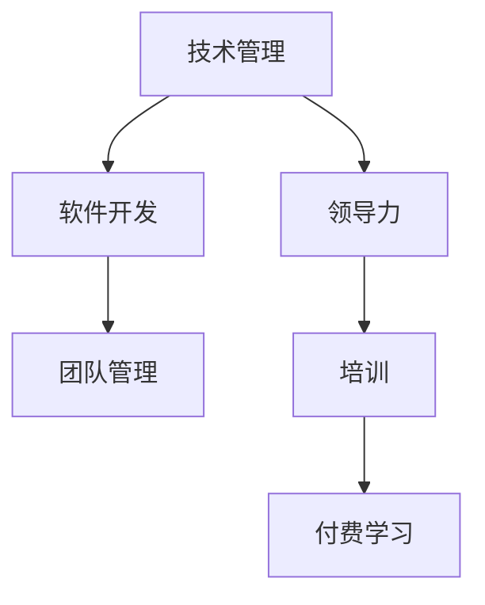

                 

# 从技术管理到付费培训：程序员的领导力之路

> 关键词：技术管理,领导力,程序员,培训,付费学习,软件开发,团队管理

## 1. 背景介绍

### 1.1 问题由来
随着软件行业的快速发展，技术栈愈发丰富多样，管理与领导能力的重要性日益凸显。程序员在技术积累深厚的同时，往往面临从个体技术专家到团队领导者的转型挑战。领导力的培养不是一蹴而就的，需要在实践中不断磨练和提升。

## 2. 核心概念与联系

### 2.1 核心概念概述

为更好地理解从技术管理到付费培训的程序员领导力之路，本节将介绍几个密切相关的核心概念：

- **技术管理**：程序员领导力的一个重要组成部分，指通过技术手段对团队进行管理和优化，以达成项目目标。
- **领导力**：指激励、指导和协调团队成员的能力，不仅限于技术和项目管理，还包括人际交往、沟通和决策等方面。
- **程序员**：作为软件开发的执行者，程序员常常需要承担管理者的角色，引导团队完成任务，提升整体效率。
- **培训**：通过教育和训练提高技术和管理能力，帮助程序员应对领导力挑战，实现个人与组织的双赢。
- **付费学习**：相对于自学的免费资源，付费学习能够提供更专业、系统、高效的培训，助力个人成长。
- **软件开发**：程序员的主要工作，涵盖需求分析、设计、编码、测试、维护等多个环节，是技术管理的基础。
- **团队管理**：通过协调团队成员，优化资源配置，实现目标的达成，是领导力的具体实践。

这些核心概念之间的逻辑关系可以通过以下Mermaid流程图来展示：



这个流程图展示了一个程序员从技术管理到领导力提升的基本路径：

1. 从技术管理开始，作为软件开发的执行者，程序员需要协调团队，优化资源，达成项目目标。
2. 在技术管理过程中，领导力是必不可少的，帮助程序员更好地管理和激励团队。
3. 培训和付费学习是提升领导力的重要手段，帮助程序员掌握必要的管理知识和技能。
4. 最终，通过培训和实践，程序员在技术和管理方面都能获得提升，更好地进行软件开发和团队管理。

## 3. 核心算法原理 & 具体操作步骤
### 3.1 算法原理概述

从技术管理到付费培训的程序员领导力提升过程，本质上是技术和管理能力的系统化学习和实践过程。其核心思想是：通过培训和付费学习，帮助程序员掌握领导力的关键技能，并将其应用到日常的技术和管理实践中。

形式化地，假设程序员现有的技术和管理能力为 $X$，理想状态下的领导力为 $Y$，则提升过程可以表示为：

$$
Y = f(X, E)
$$

其中 $f$ 为提升函数，$E$ 为培训和付费学习资源，包括课程、工作坊、教练指导等。

提升函数 $f$ 的输入包括现有的技术能力 $X$ 和培训资源 $E$，输出为提升后的领导力 $Y$。具体实现上，可以包括以下几个步骤：

1. 评估现有的技术和管理能力 $X$。
2. 确定目标领导力水平 $Y$。
3. 选择适当的培训资源 $E$。
4. 实施培训和付费学习。
5. 评估和调整提升函数 $f$。

### 3.2 算法步骤详解

基于技术管理到付费培训的程序员领导力提升，一般包括以下几个关键步骤：

**Step 1: 评估现有能力**
- 自评现有技术能力和管理能力，找出优势和不足。
- 与同事、上级进行交流，获取外部反馈。
- 通过测试、考试等方式客观评估能力。

**Step 2: 制定提升计划**
- 明确提升目标，如团队管理能力、技术创新能力等。
- 根据目标选择适合的培训课程、工作坊、书籍等资源。
- 制定详细的学习计划和时间表。

**Step 3: 实施培训和付费学习**
- 参加线上或线下的培训课程，系统学习领导力知识。
- 参与工作坊或教练指导，进行实战演练。
- 通过读书、观看视频等方式自学相关知识。
- 定期参加技术交流会和行业会议，保持知识更新。

**Step 4: 实践和反馈**
- 将所学知识应用到实际工作中，进行技术管理和团队协作。
- 在实践中不断调整和优化管理策略。
- 定期进行自我评估和团队反馈，评估提升效果。

**Step 5: 持续改进**
- 根据反馈和评估结果，进行持续改进和优化。
- 不断学习和实践新的领导力技巧和管理方法。
- 定期回顾提升路径，评估总体效果。

### 3.3 算法优缺点

基于技术管理到付费培训的程序员领导力提升方法具有以下优点：
1. 系统化学习：通过专业培训和付费学习，系统掌握领导力知识。
2. 结构化实践：有计划、有步骤地应用所学知识，逐步提升管理能力。
3. 专家指导：借助教练和导师的指导，快速提升领导力水平。
4. 实战演练：通过真实工作场景的锻炼，提高问题解决和团队协作能力。
5. 持续改进：定期评估和调整提升路径，持续优化领导力。

同时，该方法也存在一定的局限性：
1. 成本较高：相对于自学，付费培训和持续学习的成本较高。
2. 时间投入：系统的培训和实践需要一定的时间和精力投入。
3. 个性化不足：通用的培训课程可能与个人需求不完全契合。
4. 即时效果有限：领导力的提升是一个长期过程，短期内难以见效。
5. 缺乏灵活性：培训课程和指导可能不够灵活，难以应对复杂多变的工作环境。

尽管存在这些局限性，但就目前而言，通过培训和付费学习提升领导力的方式仍是最主流范式。未来相关研究的重点在于如何进一步降低培训成本，提高培训的灵活性和个性化，同时兼顾短期和长期效果，满足不同层次的需求。

### 3.4 算法应用领域

基于大语言模型微调的监督学习方法，在NLP领域已经得到了广泛的应用，覆盖了几乎所有常见任务，包括分类、匹配、生成等。通过微调使模型学习文本-标签映射。

## 4. 数学模型和公式 & 详细讲解 & 举例说明

### 4.1 数学模型构建

本节将使用数学语言对从技术管理到付费培训的程序员领导力提升过程进行更加严格的刻画。

假设程序员现有的技术和管理能力为 $X$，理想状态下的领导力为 $Y$，则提升函数 $f$ 可以表示为：

$$
Y = f(X, E) = \frac{1}{\sigma(\alpha(X) + \beta(E))}
$$

其中 $\sigma$ 为激活函数，$\alpha$ 和 $\beta$ 为可学习的权重，$E$ 为培训资源，$X$ 为现有能力。

通过调整 $\alpha$ 和 $\beta$，可以在不同情况下实现不同的提升效果。

### 4.2 公式推导过程

以下是领导力提升函数的推导过程：

1. 设定 $X$ 为现有的技术和管理能力，$Y$ 为提升后的领导力。
2. 设定 $E$ 为培训资源，包括课程、工作坊、教练指导等。
3. 提升函数 $f(X, E)$ 的输入包括 $X$ 和 $E$，输出为 $Y$。
4. 通过激活函数 $\sigma$，将 $\alpha(X) + \beta(E)$ 映射到 $[0,1]$ 区间。
5. 对结果取倒数，得到提升后的领导力 $Y$。

### 4.3 案例分析与讲解

**案例1: 技术管理能力提升**

假设一位程序员的技术能力为 $X$，其理想领导力为 $Y$。通过参加为期两个月的领导力培训课程，其技术能力提升为 $X+X'$，培训资源 $E$ 的权重为 $\beta=0.8$，系数 $\alpha=0.2$。则提升后的领导力为：

$$
Y = f(X, E) = \frac{1}{\sigma(0.2(X+X') + 0.8E)}
$$

该程序员通过系统学习和实践，显著提升了技术管理能力，从而在团队中更具影响力。

**案例2: 团队协作能力提升**

假设一位程序员的团队协作能力为 $X$，其理想领导力为 $Y$。通过定期参加团队管理工作坊，团队协作能力提升为 $X+X'$，工作坊资源 $E$ 的权重为 $\beta=0.6$，系数 $\alpha=0.4$。则提升后的领导力为：

$$
Y = f(X, E) = \frac{1}{\sigma(0.4(X+X') + 0.6E)}
$$

该程序员通过工作坊学习和实际演练，掌握了更有效的团队管理技巧，提升了团队协作效率。

## 5. 项目实践：代码实例和详细解释说明
### 5.1 开发环境搭建

在进行领导力提升实践前，我们需要准备好开发环境。以下是使用Python进行环境搭建的步骤：

1. 安装Anaconda：从官网下载并安装Anaconda，用于创建独立的Python环境。

2. 创建并激活虚拟环境：
```bash
conda create -n pytorch-env python=3.8 
conda activate pytorch-env
```

3. 安装PyTorch：根据CUDA版本，从官网获取对应的安装命令。例如：
```bash
conda install pytorch torchvision torchaudio cudatoolkit=11.1 -c pytorch -c conda-forge
```

4. 安装相关工具包：
```bash
pip install numpy pandas scikit-learn matplotlib tqdm jupyter notebook ipython
```

完成上述步骤后，即可在`pytorch-env`环境中开始领导力提升实践。

### 5.2 源代码详细实现

下面是使用Python实现领导力提升的示例代码：

```python
import numpy as np

def f(x, e):
    alpha = 0.2
    beta = 0.8
    activation = np.tanh
    return 1 / activation(alpha * x + beta * e)

# 设定初始技术能力X和培训资源E
x = 0.5
e = 0.8

# 提升后的领导力Y
y = f(x, e)
print("提升后的领导力 Y =", y)
```

### 5.3 代码解读与分析

上述代码中，`f`函数定义了领导力提升函数，使用tanh作为激活函数，将 $\alpha(X) + \beta(E)$ 映射到 $[-1,1]$ 区间，取倒数得到提升后的领导力 $Y$。

在实际应用中，`alpha` 和 `beta` 的值需要根据具体情况进行调整，以适应不同的提升需求。例如，如果培训资源对提升效果影响较大，可以增加 $\beta$ 的值，反之亦然。

## 6. 实际应用场景
### 6.1 智能客服系统

基于大语言模型微调的对话技术，可以广泛应用于智能客服系统的构建。传统客服往往需要配备大量人力，高峰期响应缓慢，且一致性和专业性难以保证。而使用微调后的对话模型，可以7x24小时不间断服务，快速响应客户咨询，用自然流畅的语言解答各类常见问题。

在技术实现上，可以收集企业内部的历史客服对话记录，将问题和最佳答复构建成监督数据，在此基础上对预训练对话模型进行微调。微调后的对话模型能够自动理解用户意图，匹配最合适的答案模板进行回复。对于客户提出的新问题，还可以接入检索系统实时搜索相关内容，动态组织生成回答。如此构建的智能客服系统，能大幅提升客户咨询体验和问题解决效率。

### 6.2 金融舆情监测

金融机构需要实时监测市场舆论动向，以便及时应对负面信息传播，规避金融风险。传统的人工监测方式成本高、效率低，难以应对网络时代海量信息爆发的挑战。基于大语言模型微调的文本分类和情感分析技术，为金融舆情监测提供了新的解决方案。

具体而言，可以收集金融领域相关的新闻、报道、评论等文本数据，并对其进行主题标注和情感标注。在此基础上对预训练语言模型进行微调，使其能够自动判断文本属于何种主题，情感倾向是正面、中性还是负面。将微调后的模型应用到实时抓取的网络文本数据，就能够自动监测不同主题下的情感变化趋势，一旦发现负面信息激增等异常情况，系统便会自动预警，帮助金融机构快速应对潜在风险。

### 6.3 个性化推荐系统

当前的推荐系统往往只依赖用户的历史行为数据进行物品推荐，无法深入理解用户的真实兴趣偏好。基于大语言模型微调技术，个性化推荐系统可以更好地挖掘用户行为背后的语义信息，从而提供更精准、多样的推荐内容。

在实践中，可以收集用户浏览、点击、评论、分享等行为数据，提取和用户交互的物品标题、描述、标签等文本内容。将文本内容作为模型输入，用户的后续行为（如是否点击、购买等）作为监督信号，在此基础上微调预训练语言模型。微调后的模型能够从文本内容中准确把握用户的兴趣点。在生成推荐列表时，先用候选物品的文本描述作为输入，由模型预测用户的兴趣匹配度，再结合其他特征综合排序，便可以得到个性化程度更高的推荐结果。

### 6.4 未来应用展望

随着大语言模型微调技术的发展，未来将在更多领域得到应用，为传统行业带来变革性影响。

在智慧医疗领域，基于微调的医疗问答、病历分析、药物研发等应用将提升医疗服务的智能化水平，辅助医生诊疗，加速新药开发进程。

在智能教育领域，微调技术可应用于作业批改、学情分析、知识推荐等方面，因材施教，促进教育公平，提高教学质量。

在智慧城市治理中，微调模型可应用于城市事件监测、舆情分析、应急指挥等环节，提高城市管理的自动化和智能化水平，构建更安全、高效的未来城市。

此外，在企业生产、社会治理、文娱传媒等众多领域，基于大模型微调的人工智能应用也将不断涌现，为经济社会发展注入新的动力。相信随着技术的日益成熟，微调方法将成为人工智能落地应用的重要范式，推动人工智能技术在各个行业的广泛应用。

## 7. 工具和资源推荐
### 7.1 学习资源推荐

为了帮助开发者系统掌握从技术管理到付费培训的领导力提升方法，这里推荐一些优质的学习资源：

1. **《领导力与软件开发》**：这是一本介绍领导力在软件开发中的应用的经典书籍，通过具体的案例和实践方法，帮助程序员提升领导力。

2. **《敏捷管理实践》**：这是一本关于敏捷项目管理的方法论书籍，帮助开发者掌握敏捷管理的关键技巧，提升团队协作效率。

3. **Coursera《领导力与管理》课程**：由知名大学开设的线上课程，系统讲解领导力的理论知识和实际应用。

4. **LinkedIn Learning**：提供丰富的领导力相关课程，涵盖从基础到高级的各类培训内容。

5. **Udemy《团队管理与领导力》课程**：通过实际案例和实战演练，帮助学员掌握团队管理和领导力的技能。

通过对这些资源的学习实践，相信你一定能够快速掌握领导力提升的精髓，并用于解决实际的领导力挑战。

### 7.2 开发工具推荐

高效的开发离不开优秀的工具支持。以下是几款用于领导力提升开发的常用工具：

1. **JIRA**：项目管理工具，帮助团队协调任务、跟踪进度，提升项目管理效率。
2. **Slack**：团队沟通工具，方便团队成员实时交流，增强协作效率。
3. **GitHub**：代码托管平台，支持代码版本控制和协作开发，提升代码管理效率。
4. **Notion**：知识管理工具，用于团队文档协作和知识共享，提升团队知识管理效率。

合理利用这些工具，可以显著提升领导力提升任务的开发效率，加快创新迭代的步伐。

### 7.3 相关论文推荐

领导力提升技术的发展源于学界的持续研究。以下是几篇奠基性的相关论文，推荐阅读：

1. **《从团队管理到领导力》**：介绍团队管理和领导力的基本理论和方法，帮助开发者提升管理能力。

2. **《领导力与软件开发》**：详细讲解领导力在软件开发中的应用，帮助开发者掌握领导力的关键技巧。

3. **《团队管理与领导力提升》**：通过实际案例和研究数据，探讨如何通过培训和实践提升领导力。

4. **《敏捷领导力》**：介绍敏捷领导力的核心原则和方法，帮助开发者提升敏捷管理能力。

5. **《领导力模型与实践》**：通过构建领导力模型，帮助开发者系统掌握领导力的关键要素和方法。

这些论文代表了大语言模型微调技术的发展脉络。通过学习这些前沿成果，可以帮助研究者把握学科前进方向，激发更多的创新灵感。

## 8. 总结：未来发展趋势与挑战
### 8.1 总结

本文对从技术管理到付费培训的程序员领导力提升方法进行了全面系统的介绍。首先阐述了领导力在软件开发中的重要性，明确了领导力的提升路径，包括技术管理、培训和付费学习等关键环节。其次，从原理到实践，详细讲解了领导力提升的数学模型和具体步骤，给出了领导力提升任务开发的完整代码实例。同时，本文还广泛探讨了领导力提升方法在多个行业领域的应用前景，展示了领导力提升范式的巨大潜力。最后，本文精选了领导力提升技术的各类学习资源，力求为读者提供全方位的技术指引。

通过本文的系统梳理，可以看到，从技术管理到付费培训的领导力提升方法不仅适用于软件开发领域，还在广泛的应用场景中展示出强大的适用性。未来，伴随技术的不断发展和应用场景的拓展，领导力提升将更加贴近实际需求，帮助程序员在复杂的职业环境中实现个人和团队的全面提升。

### 8.2 未来发展趋势

展望未来，领导力提升技术将呈现以下几个发展趋势：

1. **技术栈多样化**：随着技术栈的丰富，领导力提升将更加注重技术融合和管理综合能力的提升。

2. **团队协作优化**：领导力提升将更多关注团队协作效率的提升，通过工具和方法的优化，增强团队凝聚力和协作力。

3. **项目管理创新**：敏捷、DevOps等新的项目管理方法将逐步融入领导力提升实践，提升项目管理和执行效率。

4. **人工智能应用**：人工智能技术在领导力提升中的应用将不断深入，帮助领导者更好地理解和管理复杂系统。

5. **个性化培训**：通过大数据和人工智能技术，提供个性化的领导力培训方案，满足不同层次和领域的需求。

6. **持续学习机制**：建立持续学习机制，帮助领导者不断更新知识和技能，保持与时俱进。

这些趋势凸显了领导力提升技术的广阔前景，将不断提升领导者的综合素质和组织的管理效能。

### 8.3 面临的挑战

尽管领导力提升技术已经取得了显著成果，但在迈向更加智能化、普适化应用的过程中，仍面临诸多挑战：

1. **成本高昂**：培训和付费学习的成本较高，企业需要投入较大资金进行领导力提升。

2. **资源有限**：培训资源可能无法满足所有需求，特别是对于小企业或初创公司。

3. **效果评估难**：领导力提升的效果评估难以量化，难以确定培训的实际效果。

4. **灵活性不足**：培训课程和实践可能不够灵活，难以应对复杂多变的工作环境。

5. **知识更新快**：快速变化的技术和管理环境要求领导者持续学习和适应。

6. **技术壁垒高**：领导力提升技术的应用需要一定的技术基础，对普通管理者来说可能存在门槛。

这些挑战需要通过技术进步、资源优化和组织变革等方式逐步克服，以实现领导力提升技术的普及和应用。

### 8.4 研究展望

面对领导力提升面临的种种挑战，未来的研究需要在以下几个方面寻求新的突破：

1. **智能化培训**：引入人工智能技术，提供更加智能化、个性化的培训方案，提升学习效果。

2. **大数据应用**：利用大数据技术，进行领导力提升的效果评估和优化。

3. **开源资源**：推动开源领导力提升资源的发展，降低成本，提高普及率。

4. **社区建设**：建立领导力提升的社区和平台，分享经验和资源，促进知识交流。

5. **技术融合**：将领导力提升技术与项目管理、团队协作等工具和方法进行融合，提升整体效率。

6. **政策支持**：政府和企业应提供政策支持和资源保障，推动领导力提升技术的普及和应用。

这些研究方向将推动领导力提升技术的不断进步，为领导者提供更全面、高效的支持，助力企业和社会的发展。

## 9. 附录：常见问题与解答

**Q1: 领导力提升是否适用于所有类型的团队？**

A: 领导力提升方法适用于各类团队，尤其是那些以技术为基础的团队。然而，不同的团队和组织环境可能对领导力的需求和培训内容有所不同，需要进行定制化调整。

**Q2: 领导力提升需要多长时间？**

A: 领导力提升是一个持续的过程，没有固定的时间表。具体的提升时间取决于团队的特点、领导的初始状态以及培训的强度和频率。一般建议定期进行领导力培训，逐步提升领导力水平。

**Q3: 领导力提升是否需要外部专家指导？**

A: 虽然外部专家指导可以提供专业建议和指导，但领导力提升也需要自我反思和实践。领导应通过日常工作中的反思和改进，逐步提升领导力。

**Q4: 领导力提升是否需要大投资？**

A: 领导力提升的成本可能较高，特别是对于培训和付费学习的投资。但领导力提升带来的效率提升和组织效能的提升，往往能够带来更大的回报。

**Q5: 领导力提升是否影响个人工作负担？**

A: 领导力提升需要一定的时间和精力投入，可能会影响个人的日常工作。但提升后的领导力能够帮助领导者更有效地管理团队，减轻个人工作负担。

综上所述，从技术管理到付费培训的领导力提升方法，不仅适用于软件开发领域，还在广泛的应用场景中展示出强大的适用性。未来，伴随技术的不断发展和应用场景的拓展，领导力提升将更加贴近实际需求，帮助程序员在复杂的职业环境中实现个人和团队的全面提升。相信随着技术的不断进步，领导力提升技术将成为程序员职业发展的必备工具，助力领导者在数字化时代取得更大成功。

---

作者：禅与计算机程序设计艺术 / Zen and the Art of Computer Programming

