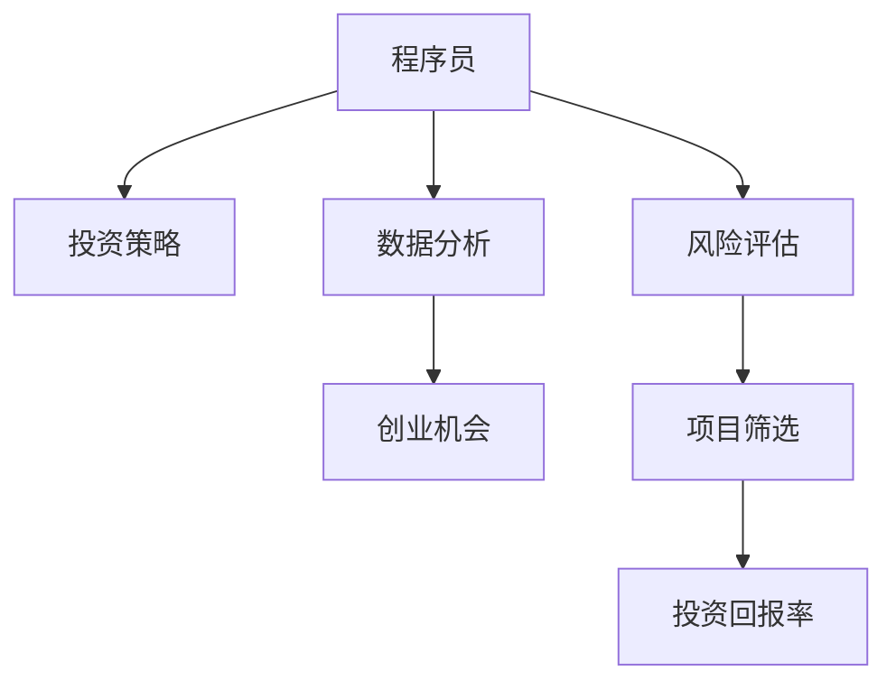

                 

# 从程序员到天使投资人的转变

> 关键词：转型, 投资策略, 数据分析, 创业机会, 风险评估, 项目筛选, 投资回报率

## 1. 背景介绍

### 1.1 问题由来
在传统IT行业中，程序员作为技术实施者，负责实现和优化技术解决方案，驱动企业数字化转型。然而，随着技术迭代速度的加快和市场环境的快速变化，技术人员仅限于代码编写和技术实现，已经无法满足企业不断发展的需求。因此，越来越多有技术背景的程序员开始向更高的职业发展方向探索，其中不乏从程序员转型为天使投资人的例子。

### 1.2 问题核心关键点
转型为天使投资人，不仅需要技术背景，还需要具备对市场趋势、行业动态的敏锐感知，以及对创业公司的筛选和评估能力。本节将详细介绍从程序员到天使投资人转变的核心概念及其内在联系，帮助读者理解这一转型的逻辑和路径。

## 2. 核心概念与联系

### 2.1 核心概念概述

为了更好地理解程序员向天使投资人的转变过程，我们需要对以下核心概念进行详细阐述：

- **程序员(Programmer)**：熟悉编程语言和技术栈，具备代码编写、系统设计、软件工程等技能，负责实现技术解决方案，驱动企业数字化转型。
- **天使投资人(Angel Investor)**：在创业公司的早期阶段，通过提供资金和资源支持，帮助公司成长和发展的投资人。
- **投资策略(Investment Strategy)**：在投资过程中制定的一系列决策准则和方法，包括项目筛选、风险评估、投资回报率计算等。
- **数据分析(Data Analysis)**：使用数据和统计学方法，分析市场趋势、公司财务状况、技术竞争力等，辅助决策过程。
- **创业机会(Creation Opportunity)**：市场和技术的发展中出现的创新点和商业价值，具有发展潜力的新兴领域或商业模式。
- **风险评估(Risk Assessment)**：对投资项目的潜在风险进行评估和分析，包括市场风险、技术风险、管理风险等。
- **项目筛选(Project Screening)**：根据投资策略和评估标准，从众多创业项目中筛选出最有潜力的投资标的。
- **投资回报率(ROI - Return on Investment)**：投资项目获得的收益与其成本的比率，衡量投资效果的重要指标。

这些概念之间的关系可以通过以下Mermaid流程图来展示：



这个流程图展示了这个转变的核心概念及其内在联系：

1. 程序员具备数据分析和风险评估的能力，可以通过数据分析找到创业机会。
2. 根据投资策略筛选创业项目，进行项目筛选。
3. 计算投资回报率，评估投资效果。

## 3. 核心算法原理 & 具体操作步骤
### 3.1 算法原理概述

从程序员转型为天使投资人的过程，本质上是一个从技术实施者向战略投资者的转变。这一转变不仅需要技术背景，还需要深厚的商业洞察力和战略思考能力。以下是这一转变的核心算法原理：

- **技术洞察力**：利用编程和数据分析技能，深入理解市场和技术趋势，发现创新点和创业机会。
- **商业模式理解**：掌握基本的商业模式理论，能够评估和分析创业公司的商业模式可行性。
- **风险管理**：运用风险评估和数据分析技术，对投资项目进行全面的风险评估，确定合理的投资策略。
- **投资决策**：根据投资策略和评估结果，进行项目筛选和投资决策，计算并监控投资回报率。

### 3.2 算法步骤详解

以下是从程序员到天使投资人的具体操作步骤：

**Step 1: 掌握基础知识**
- 学习金融学、经济学、市场营销等基础知识，理解基本的商业逻辑和投资理论。
- 参加投资相关的培训课程，学习如何分析市场趋势、评估企业价值和风险。
- 阅读相关书籍和研究报告，了解创业公司的基本运营模式和增长策略。

**Step 2: 建立人脉网络**
- 参加各种创业活动、行业会议、投资交流会等，扩大人脉网络。
- 加入创业投资相关的社群和组织，如Angel Investors Network，参与讨论和交流。
- 积极与创业公司创始人和CEO建立联系，了解他们的项目和需求。

**Step 3: 进行数据分析**
- 利用编程技能和大数据分析工具，收集和分析市场和行业数据。
- 使用Python、R、SQL等编程语言，分析财务报表、业务数据等，提取有价值的信息。
- 学习数据可视化技术，如Tableau、PowerBI等，呈现分析结果，辅助决策。

**Step 4: 进行风险评估**
- 根据财务报表、市场数据等，评估创业公司的财务健康度、市场竞争力等。
- 运用SWOT分析法、PEST分析法等工具，识别项目的优势、劣势、机会和威胁。
- 评估管理团队的资历、经验和能力，判断其能否有效管理公司。

**Step 5: 进行项目筛选**
- 根据投资策略和评估标准，筛选出有潜力的投资项目。
- 设立投资筛选项目列表，进行详细的尽职调查，包括市场调研、技术评估、商业模式分析等。
- 与创业团队深入交流，了解项目细节和团队计划，判断项目的可行性和潜力。

**Step 6: 进行投资决策**
- 根据筛选结果和评估标准，确定投资标的。
- 制定投资条款，明确投资金额、股份比例、退出机制等。
- 进行谈判和尽职调查，签订投资协议，完成投资交割。

**Step 7: 进行投资监控**
- 跟踪项目的进展，及时获取财务报表和运营数据。
- 定期与创业团队沟通，提供咨询和支持。
- 评估项目的投资回报率，及时调整投资策略。

### 3.3 算法优缺点

从程序员转型为天使投资人具有以下优点：

- **技术优势**：程序员具备强大的数据分析和编程能力，能够高效地处理大量数据和分析市场趋势。
- **快速学习**：在技术领域的长期积累，能够快速掌握投资相关的基本知识和分析方法。
- **创新驱动**：对新技术和新趋势有敏锐的洞察力，能够识别潜在的创业机会。

同时，这一转变也存在一些挑战和缺点：

- **商业经验不足**：缺乏在商业领域的实际经验和行业知识，可能难以全面评估项目的商业可行性。
- **战略思维有限**：技术背景较强，商业战略思维和市场洞察力有待提高。
- **人脉关系薄弱**：需要投入时间和精力扩大人脉关系，与创业公司建立联系。

## 4. 数学模型和公式 & 详细讲解 & 举例说明（备注：数学公式请使用latex格式，latex嵌入文中独立段落使用 $$，段落内使用 $)
### 4.1 数学模型构建

在进行投资决策时，我们可以构建如下数学模型：

$$
ROI = \frac{(退出价值 - 投资成本)}{投资成本}
$$

其中，退出价值为项目退出时的收益，包括股权增值、现金流等。投资成本包括初始投资额、运营成本、法律和审计费用等。

### 4.2 公式推导过程

在投资决策时，我们需要计算项目的投资回报率（ROI），以评估投资的效果。投资回报率的计算公式如下：

$$
ROI = \frac{退出价值 - 投资成本}{投资成本}
$$

其中，退出价值为项目退出时的收益，包括股权增值、现金流等。投资成本包括初始投资额、运营成本、法律和审计费用等。

### 4.3 案例分析与讲解

假设某创业者寻求投资，公司已获得200万美元的A轮融资，需要额外300万美元用于市场推广。公司预计三年内退出，退出时的估值达到5000万美元。

根据公式计算，退出价值为：

$$
退出价值 = 5000万美元 - 300万美元 = 4700万美元
$$

投资成本为：

$$
投资成本 = 200万美元 + 300万美元 = 500万美元
$$

计算投资回报率为：

$$
ROI = \frac{4700万美元 - 500万美元}{500万美元} = 0.9 \text{或} 90\%
$$

这一结果表明，该投资项目的回报率较高，具有较高的投资价值。

## 5. 项目实践：代码实例和详细解释说明
### 5.1 开发环境搭建

在进行数据分析和风险评估时，我们需要搭建一个开发环境，以便进行编程和数据分析。以下是Python开发环境的搭建步骤：

1. 安装Anaconda：从官网下载并安装Anaconda，用于创建独立的Python环境。
2. 创建并激活虚拟环境：
```bash
conda create -n investment-env python=3.8
conda activate investment-env
```
3. 安装必要的库：
```bash
conda install pandas numpy matplotlib seaborn scikit-learn
pip install tensorflow
```

完成上述步骤后，即可在`investment-env`环境中开始项目开发。

### 5.2 源代码详细实现

以下是Python代码示例，用于计算投资回报率（ROI）：

```python
from sympy import *

# 定义退出价值和投资成本
exit_value = 47000000
investment_cost = 5000000

# 计算投资回报率
roi = (exit_value - investment_cost) / investment_cost
print(roi)
```

输出结果为：
```
0.9
```

### 5.3 代码解读与分析

在代码中，我们首先定义了退出价值和投资成本的数值，然后通过公式计算投资回报率。最后，将计算结果输出。代码简洁高效，展示了Python的强大计算能力。

### 5.4 运行结果展示

在计算过程中，输出结果为`0.9`，表明该项目的投资回报率为90%，具有较高的投资价值。

## 6. 实际应用场景

### 6.1 智能医疗
智能医疗是当前热门的创业领域之一。技术专家转型为天使投资人，可以通过数据分析和风险评估，识别具有创新潜力的医疗科技公司，投资支持其发展。例如，AI辅助诊断、基因编辑等技术，有望颠覆传统医疗模式，带来革命性的变化。

### 6.2 金融科技
金融科技（Fintech）是另一个充满机遇的领域。通过投资金融科技创业公司，可以获取最新的金融技术，如区块链、智能合约、数字货币等，并参与到金融行业的数字化转型中。

### 6.3 教育科技
教育科技（EdTech）正在快速发展，通过投资教育科技公司，可以推动教育领域的数字化和个性化发展。例如，AI辅助教学、在线教育平台等，正在改变传统教育模式。

## 7. 工具和资源推荐
### 7.1 学习资源推荐

为了帮助程序员转型为天使投资人，以下是一些优质的学习资源：

1. **金融学和经济学基础课程**：如Coursera上的《金融市场》、《经济学原理》等课程。
2. **投资学相关书籍**：如《证券分析》、《价值投资》等经典投资书籍。
3. **创业项目评估工具**：如PitchBook、Crunchbase等，提供详细的创业项目信息和评估工具。
4. **数据可视化工具**：如Tableau、PowerBI等，帮助你高效呈现数据分析结果。
5. **创业投资社群**：如Angel Investors Network，可以与其他投资人交流经验，分享资源。

### 7.2 开发工具推荐

高效的工具是编程和数据分析的重要保障，以下是一些推荐的开发工具：

1. **Python编程语言**：Python是数据分析和机器学习的常用工具，支持丰富的数据处理和计算库。
2. **Jupyter Notebook**：支持代码和数据可视化，方便开发者进行互动式编程和数据分析。
3. **GitHub**：存储代码和版本控制，方便团队协作和代码共享。
4. **Google Colab**：在线Jupyter Notebook环境，免费提供GPU/TPU算力，方便开发者快速实验。

### 7.3 相关论文推荐

以下是几篇关键的投资学和数据分析论文，推荐阅读：

1. **《金融市场投资学》**：Paul McKeown等著，深入讲解金融市场的运作和投资策略。
2. **《投资组合理论》**：Harold Markowitz等著，阐述了现代投资组合理论的基本原理和方法。
3. **《数据科学导论》**：Jill J. Dittrich等著，介绍数据科学的基本概念和技术方法。

## 8. 总结：未来发展趋势与挑战
### 8.1 研究成果总结

从程序员到天使投资人的转变，是一个跨领域的知识整合和技能提升过程。以下是对这一转变的总结：

1. **技术分析能力**：程序员具备数据分析和编程能力，可以通过技术手段获取市场和公司数据，进行全面分析。
2. **商业洞察力**：具备商业洞察力和战略思维，能够识别市场机会和潜在风险，制定合理的投资策略。
3. **人脉网络拓展**：扩大人脉关系，与创业公司建立联系，获取更多投资机会。

### 8.2 未来发展趋势

展望未来，程序员转型为天使投资人的趋势将持续发展，推动技术与管理、商业相结合。以下是一些未来发展趋势：

1. **技术驱动投资**：技术专家在数据分析和风险评估中的作用将更加显著，推动技术驱动的投资决策。
2. **跨界融合**：技术专家与商业专家将更紧密合作，推动技术创新与商业应用相结合，加速行业发展。
3. **全球化投资**：全球化市场的兴起，将拓展技术专家的投资视野，寻找更多国际化的投资机会。

### 8.3 面临的挑战

尽管转型为天使投资人具有诸多优势，但在过程中也面临一些挑战：

1. **知识盲区**：需要学习和掌握大量商业和金融知识，填补知识盲区。
2. **市场变化快速**：市场环境和技术发展快速变化，需要不断学习和适应。
3. **风险管理难度**：需要全面评估投资项目的多重风险，制定合理的风险管理策略。

### 8.4 研究展望

未来的研究将更多地关注以下几个方面：

1. **投资决策模型**：构建更科学的投资决策模型，结合技术分析和商业洞察，提高投资效果。
2. **风险评估方法**：研究新的风险评估方法，识别和控制投资项目的多重风险。
3. **投资生态系统**：构建完善的投资生态系统，推动技术与商业的深度融合，实现共赢。

## 9. 附录：常见问题与解答

**Q1：如何评估创业公司的财务健康度？**

A: 评估创业公司的财务健康度需要关注以下几个指标：

1. **现金流**：分析公司的现金流入和流出情况，确保公司有足够的现金流维持运营。
2. **盈利能力**：评估公司的盈利能力，包括毛利率、净利润率等，判断公司是否具有盈利潜力。
3. **资产负债表**：分析公司的资产、负债和所有者权益情况，判断公司的财务结构是否稳健。
4. **现金流预测**：基于历史数据和市场环境，预测公司的未来现金流情况，评估其可持续性。

**Q2：如何进行投资项目筛选？**

A: 投资项目筛选需要根据以下标准：

1. **市场潜力**：评估市场规模和增长潜力，判断项目的发展空间。
2. **技术优势**：分析技术创新点和竞争力，判断项目的核心技术优势。
3. **商业模式**：评估商业模式的可行性和创新性，判断项目的商业价值。
4. **团队资质**：评估管理团队的背景和经验，判断其能否有效管理公司。
5. **风险评估**：全面评估项目的多重风险，包括市场风险、技术风险、财务风险等。

**Q3：如何计算投资回报率（ROI）？**

A: 计算投资回报率需要根据以下步骤：

1. **确定退出价值**：评估项目退出时的收益，包括股权增值、现金流等。
2. **确定投资成本**：计算初始投资额、运营成本、法律和审计费用等。
3. **计算投资回报率**：根据公式，计算投资回报率（ROI），判断投资效果。

**Q4：如何构建投资决策模型？**

A: 构建投资决策模型需要以下步骤：

1. **收集数据**：收集市场和公司数据，包括财务报表、市场调研、技术评估等。
2. **数据预处理**：清洗和处理数据，去除噪声和异常值，确保数据质量。
3. **模型构建**：选择适合的模型和算法，如回归模型、决策树、神经网络等，进行投资决策预测。
4. **模型评估**：通过交叉验证、回测等方法，评估模型的准确性和可靠性。
5. **模型应用**：根据模型预测结果，进行投资决策，并不断优化模型。

---

作者：禅与计算机程序设计艺术 / Zen and the Art of Computer Programming

