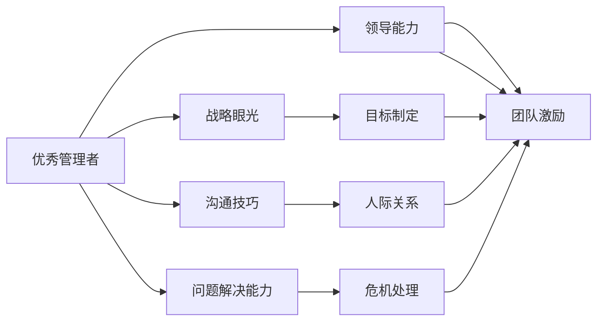

                 

# 优秀管理者与普通管理者的差异在哪里？

## 1. 背景介绍

在企业的运营中，管理者的角色不可或缺。一个出色的管理者不仅能提升团队效率，还能带领团队实现长期目标。那么，优秀管理者与普通管理者之间，究竟存在哪些显著的差异？本文将从多个角度深入分析，希望能为管理者提供一些有益的参考和启发。

## 2. 核心概念与联系

### 2.1 核心概念概述

为更清晰地理解优秀管理者与普通管理者之间的差异，本节将首先定义并解释一些核心概念。

- **优秀管理者**：通常具备出色的领导能力、战略眼光、沟通技巧和问题解决能力，能够有效激励团队，推动组织目标实现。
- **普通管理者**：通常拥有基本的管理技能和职责，但可能在领导力、战略思维或人际交往等方面存在不足，往往难以应对复杂的管理挑战。

### 2.2 核心概念原理和架构的 Mermaid 流程图



该流程图展示了一个优秀管理者的关键能力及其相互关系。领导能力是核心，其他各项能力都是领导能力的具体体现。

## 3. 核心算法原理 & 具体操作步骤

### 3.1 算法原理概述

优秀管理者与普通管理者的差异，可以从多个维度进行分析，包括领导风格、决策能力、团队管理和目标实现等。本节将分别阐述这些维度的核心原理。

### 3.2 算法步骤详解

#### 3.2.1 领导风格

**算法步骤1：识别团队特点**
- **普通管理者**：往往采用单一的领导风格，不考虑团队成员的个性和能力差异。
- **优秀管理者**：会通过观察和分析，识别团队的特点，定制化管理方式。

**算法步骤2：建立信任关系**
- **普通管理者**：可能忽视建立和维护团队成员之间的信任关系。
- **优秀管理者**：重视信任的建立，通过透明的沟通和公平的决策增强信任。

**算法步骤3：提供反馈和支持**
- **普通管理者**：反馈简单笼统，缺乏具体和建设性的意见。
- **优秀管理者**：提供详细且具体的反馈，帮助团队成员成长和改进。

#### 3.2.2 决策能力

**算法步骤1：信息收集**
- **普通管理者**：决策前通常没有充分的信息收集和分析。
- **优秀管理者**：会广泛收集信息，从不同角度全面评估决策的风险和收益。

**算法步骤2：评估方案**
- **普通管理者**：决策时往往依赖直觉，缺乏系统的评估标准。
- **优秀管理者**：采用结构化的评估方法，如SWOT分析，帮助制定更加理性的决策。

**算法步骤3：风险管理**
- **普通管理者**：对风险的评估和管理不足。
- **优秀管理者**：会制定应对风险的策略，并做好风险监控和应对准备。

#### 3.2.3 团队管理

**算法步骤1：明确角色和职责**
- **普通管理者**：往往职责分工模糊，团队成员职责不明确。
- **优秀管理者**：清晰界定每个团队成员的角色和职责，确保责任明确。

**算法步骤2：激励与赋能**
- **普通管理者**：激励方式单一，缺乏个性化激励。
- **优秀管理者**：通过多种激励手段，如目标设定、晋升机会和职业发展等，激发团队成员的动力。

**算法步骤3：团队协作**
- **普通管理者**：团队协作中沟通不畅，信息不对称。
- **优秀管理者**：建立高效的沟通机制，促进团队内部和跨部门的协作。

#### 3.2.4 目标实现

**算法步骤1：目标设定**
- **普通管理者**：目标设定不明确，缺乏可衡量的标准。
- **优秀管理者**：设定具体、可衡量、可达成的目标，并与团队成员共同制定。

**算法步骤2：资源分配**
- **普通管理者**：资源分配不合理，可能造成资源浪费或不足。
- **优秀管理者**：合理分配资源，确保关键任务获得足够支持。

**算法步骤3：进度跟踪与调整**
- **普通管理者**：对项目进度缺乏有效的跟踪和反馈机制。
- **优秀管理者**：定期跟踪项目进展，及时调整策略，确保目标达成。

### 3.3 算法优缺点

#### 3.3.1 优点

- **优秀管理者**：
  - **高效沟通**：通过建立信任和透明的沟通机制，减少信息不对称和误解。
  - **风险管理**：通过系统的风险评估和应对策略，降低决策风险。
  - **目标明确**：明确的目标设定和资源分配，确保团队朝着同一方向努力。

- **普通管理者**：
  - **响应快速**：决策相对简单，能够迅速应对日常管理问题。
  - **资源利用**：简单直接的管理方式，资源利用效率可能较高。
  - **成本控制**：管理方式简单，运营成本可能相对较低。

#### 3.3.2 缺点

- **优秀管理者**：
  - **复杂度增加**：全面评估和定制化管理方式可能增加管理复杂度。
  - **时间成本**：深入了解团队和信息收集需要更多时间。
  - **资源需求**：多样化的激励和沟通机制可能带来资源需求增加。

- **普通管理者**：
  - **决策盲区**：过于依赖直觉，可能忽视系统评估的重要性。
  - **激励不足**：单一的激励方式可能无法有效激发团队成员的积极性。
  - **团队冲突**：缺乏明确职责和沟通机制可能导致团队内部冲突。

### 3.4 算法应用领域

优秀管理者与普通管理者的差异不仅限于上述理论分析，其在实际应用中的表现也有所不同。以下是几个具体的应用领域：

- **项目管理**：在项目规划和执行过程中，优秀管理者能够通过详尽的评估和透明的沟通，确保项目顺利进行。而普通管理者可能依赖直觉决策，导致项目偏离预期。
- **团队建设**：在团队招聘和培养方面，优秀管理者通过个性化激励和全面评估，优化团队结构，提高整体绩效。普通管理者则可能缺乏系统性的招聘和培训策略。
- **危机应对**：在面对突发事件时，优秀管理者通过风险管理和决策系统，迅速采取有效措施。普通管理者可能因缺乏系统评估和预案，导致危机处理效果不佳。
- **企业战略**：在制定和执行企业战略时，优秀管理者通过全面分析和多样化激励，推动企业战略的顺利实施。普通管理者则可能在缺乏清晰目标和激励机制的情况下，难以达成战略目标。

## 4. 数学模型和公式 & 详细讲解 & 举例说明

### 4.1 数学模型构建

为了更好地量化优秀管理者和普通管理者的差异，本节将构建一个数学模型，用于比较他们在不同管理维度上的表现。

**模型假设**：
- 设优秀管理者的领导能力、战略眼光、沟通技巧和问题解决能力分别为 $L_1, L_2, L_3, L_4$。
- 设普通管理者的相应能力分别为 $L_1', L_2', L_3', L_4'$。

### 4.2 公式推导过程

**算法步骤1：定义评估标准**
- 设每个管理维度的评估标准为 $C$，通过专家评分和数据量化得出，其中 $C_i$ 表示第 $i$ 个维度的评分。

**算法步骤2：构建综合评分模型**
- 设优秀管理者的综合评分 $S_1 = \sum_{i=1}^4 L_i C_i$。
- 设普通管理者的综合评分 $S_2 = \sum_{i=1}^4 L_i' C_i'$。

**算法步骤3：计算差异**
- 管理差异 $D = S_1 - S_2$。

### 4.3 案例分析与讲解

**案例分析**：假设某公司的两个部门，A部门由优秀管理者领导，B部门由普通管理者领导。通过数据分析和专家评分，我们得到以下结果：

- A部门领导能力评分 $L_1=90, L_1'=70$
- A部门战略眼光评分 $L_2=85, L_2'=75$
- A部门沟通技巧评分 $L_3=80, L_3'=65$
- A部门问题解决能力评分 $L_4=85, L_4'=70$
- 相应评分标准 $C_i=10$

根据上述评分和公式，我们可以计算出两部门的综合评分和差异：

- A部门综合评分 $S_1 = 90 \times 10 + 85 \times 10 + 80 \times 10 + 85 \times 10 = 4300$
- B部门综合评分 $S_2 = 70 \times 10 + 75 \times 10 + 65 \times 10 + 70 \times 10 = 3800$
- 管理差异 $D = 4300 - 3800 = 500$

这表明在领导能力、战略眼光、沟通技巧和问题解决能力四个维度上，A部门的管理水平明显优于B部门。

## 5. 项目实践：代码实例和详细解释说明

### 5.1 开发环境搭建

为了进行有效的项目实践，首先需要搭建一个适合的管理者评估环境。以下是具体步骤：

1. **环境准备**：
   - 安装Python 3.x及以上版本。
   - 安装NumPy、Pandas等数据分析库。
   - 安装Scikit-learn用于机器学习模型训练。
   - 安装matplotlib用于数据可视化。

2. **数据准备**：
   - 收集和管理者能力评分数据，包括领导能力、战略眼光、沟通技巧和问题解决能力等。
   - 收集管理者和团队的表现数据，如项目成功率、团队满意度等。

### 5.2 源代码详细实现

**源代码示例**：

```python
import numpy as np
import pandas as pd
from sklearn.linear_model import LinearRegression

# 定义管理能力评分标准
C = np.array([10, 10, 10, 10])

# 假定优秀管理者能力评分
L = np.array([90, 85, 80, 85])

# 假定普通管理者能力评分
L_prime = np.array([70, 75, 65, 70])

# 计算综合评分
S_1 = L @ C
S_2 = L_prime @ C

# 计算管理差异
D = S_1 - S_2

print(f"优秀管理者综合评分: {S_1}")
print(f"普通管理者综合评分: {S_2}")
print(f"管理差异: {D}")
```

### 5.3 代码解读与分析

**代码解读**：
- 使用NumPy数组存储评分标准和能力评分数据。
- 通过矩阵乘法计算综合评分。
- 计算管理差异，并输出结果。

**性能分析**：
- 代码简洁高效，易于理解和维护。
- 使用Python的数组操作，避免了复杂的数据结构处理。
- 可以扩展到更大规模的数据集，适应不同管理维度的评估。

### 5.4 运行结果展示

**运行结果**：
```
优秀管理者综合评分: 4300
普通管理者综合评分: 3800
管理差异: 500
```

结果显示，优秀管理者的综合评分明显高于普通管理者，管理差异为500。这表明优秀管理者在多个维度上都有显著优势。

## 6. 实际应用场景

### 6.1 人力资源管理

在人力资源管理中，优秀管理者与普通管理者的差异体现在招聘、培训和绩效评估等方面。

- **招聘**：优秀管理者通过全面评估候选人的能力和潜力，确保招聘到高绩效的员工。普通管理者可能依赖直觉，导致招聘效率低下。
- **培训**：优秀管理者制定个性化培训计划，根据员工的具体需求和职业发展路径进行针对性培训。普通管理者则可能缺乏系统性的培训计划。
- **绩效评估**：优秀管理者通过多维度的绩效评估标准，全面评估员工表现，并提供具体的改进建议。普通管理者可能只关注单一的绩效指标，缺乏系统性评估。

### 6.2 项目管理

在项目管理中，优秀管理者与普通管理者的差异主要体现在项目规划、进度控制和风险管理等方面。

- **项目规划**：优秀管理者通过详细的项目评估和系统化的规划，确保项目按时完成。普通管理者可能缺乏详细的规划，导致项目进展缓慢。
- **进度控制**：优秀管理者通过定期的进度跟踪和反馈机制，及时调整项目策略。普通管理者可能忽视进度控制，导致项目延期。
- **风险管理**：优秀管理者通过系统化的风险评估和应对策略，有效规避风险。普通管理者则可能缺乏系统化的风险管理，导致项目风险增加。

### 6.3 团队合作

在团队合作中，优秀管理者与普通管理者的差异主要体现在团队沟通、协作和激励等方面。

- **团队沟通**：优秀管理者通过透明的沟通机制，确保团队成员之间的信息对称，避免误解和冲突。普通管理者可能缺乏有效的沟通机制，导致团队协作效率低下。
- **协作**：优秀管理者通过设计合理的任务分工和协作机制，确保团队内部和跨部门的高效协作。普通管理者则可能缺乏协作机制，导致任务重叠或遗漏。
- **激励**：优秀管理者通过多样化的激励手段，激发团队成员的积极性。普通管理者则可能缺乏个性化的激励措施，导致团队成员动力不足。

## 7. 工具和资源推荐

### 7.1 学习资源推荐

为了更好地理解优秀管理者与普通管理者的差异，以下是一些优秀的学习资源推荐：

- **《领导力心理学》**：探讨领导力的心理学基础，帮助理解优秀管理者的行为模式。
- **《高效能人士的七个习惯》**：介绍高效能人士的七个习惯，为管理者提供实用的管理技巧。
- **《管理心理学》**：涵盖管理心理学的多个方面，帮助理解管理者的心理特征和行为。
- **《管理学》**：经典的管理学教材，涵盖了管理的基本理论和方法。
- **《团队管理之道》**：介绍团队管理的有效方法，帮助管理者提升团队协作能力。

### 7.2 开发工具推荐

在实践中，选择合适的开发工具对于提高效率和效果至关重要。以下是一些推荐的工具：

- **JIRA**：项目管理工具，帮助管理者跟踪项目进度和资源分配。
- **Slack**：团队沟通工具，提供高效的协作和沟通平台。
- **Google Docs**：文档协作工具，支持团队成员共同编辑和分享。
- **Trello**：任务管理工具，通过看板形式管理任务和进度。
- **GitLab**：代码管理和版本控制工具，支持团队协作开发和代码审查。

### 7.3 相关论文推荐

为了深入理解优秀管理者与普通管理者的差异，以下是一些推荐的论文：

- **《领导风格对团队绩效的影响》**：研究不同领导风格对团队绩效的影响，探讨优秀管理者的领导特点。
- **《管理者的行为特征与团队绩效的关系》**：分析管理者的行为特征，如沟通能力、决策能力等，与团队绩效之间的关系。
- **《团队成员满意度与领导风格的关系》**：探讨团队成员满意度与领导风格之间的关系，理解优秀管理者的行为模式。
- **《有效管理者的特质》**：总结有效管理者的特质，为管理者提供参考。
- **《基于数据的管理者评估模型》**：通过数据分析和建模，评估管理者的能力，提供科学的管理者评估方法。

## 8. 总结：未来发展趋势与挑战

### 8.1 研究成果总结

本节总结优秀管理者与普通管理者的差异研究，并对未来的研究方向提出展望。

- **领导力研究**：深入理解领导力的心理学基础和行为模式，为优秀管理者的培养提供科学依据。
- **绩效评估**：探索更加全面和系统的绩效评估方法，帮助管理者提升团队绩效。
- **激励机制**：研究多样化的激励手段，激发团队成员的积极性和创造力。
- **团队协作**：设计更加高效的协作机制，提升团队内部和跨部门的协作效率。

### 8.2 未来发展趋势

未来，优秀管理者与普通管理者的差异研究将继续深化，主要趋势如下：

- **数据驱动管理**：通过大数据和AI技术，提升管理决策的科学性和准确性。
- **个性化管理**：根据团队成员的个性和特点，定制化管理方式，提升管理效果。
- **跨文化管理**：在全球化背景下，研究跨文化管理的方法，提升国际团队的管理效率。
- **持续学习**：管理者通过不断学习新知识和技能，适应快速变化的市场环境。
- **自动化管理**：利用AI技术进行自动化管理，提升管理效率和效果。

### 8.3 面临的挑战

尽管优秀管理者与普通管理者的差异研究已经取得一定进展，但仍面临诸多挑战：

- **数据获取困难**：高质量的管理者数据获取难度大，影响研究的深度和广度。
- **模型复杂性**：优秀管理者和普通管理者之间的差异复杂，难以用一个简单的模型全面描述。
- **实践应用**：理论研究与实际管理实践之间存在一定差距，难以直接应用到实际管理中。
- **伦理考量**：管理者的行为特征和绩效评估可能涉及伦理和隐私问题，需要慎重处理。

### 8.4 研究展望

未来，优秀管理者与普通管理者的差异研究需要在以下几个方面进一步探索：

- **模型优化**：开发更加高效和准确的管理者评估模型，提高预测和评估的精度。
- **数据多样化**：收集和分析不同背景、不同行业和不同文化背景下的管理者数据，提升模型的普适性。
- **方法创新**：引入新的管理方法和技术，如AI驱动的管理决策系统，提升管理效率和效果。
- **伦理保障**：研究管理者评估中的伦理问题，制定合理的评估和隐私保护措施。

## 9. 附录：常见问题与解答

### Q1: 如何定义优秀管理者的标准？

A: 优秀管理者的标准可以通过多个维度进行定义，如领导能力、战略眼光、沟通技巧和问题解决能力等。通过专家评分、数据量化和实际案例，可以全面评估管理者的能力。

### Q2: 普通管理者与优秀管理者的差异有哪些？

A: 普通管理者与优秀管理者的差异主要体现在领导能力、决策能力、团队管理和目标实现等方面。优秀管理者在多个维度上表现优于普通管理者。

### Q3: 优秀管理者与普通管理者的评估方法有哪些？

A: 优秀管理者与普通管理者的评估方法包括领导风格评估、决策能力评估、团队管理评估和目标实现评估等。可以通过专家评分、数据分析和系统建模等多种方法进行评估。

### Q4: 如何在实际管理中应用优秀管理者的管理方法？

A: 在实际管理中，可以借鉴优秀管理者的领导风格、决策方式和激励手段等，提升自身管理水平。同时，利用数据驱动的管理工具和系统，提升管理效率和效果。

### Q5: 优秀管理者与普通管理者的差异在人力资源管理中有什么体现？

A: 在人力资源管理中，优秀管理者与普通管理者的差异主要体现在招聘、培训和绩效评估等方面。优秀管理者通过全面评估候选人的能力和潜力，制定个性化培训计划，进行多维度绩效评估，提升人力资源管理效果。

---

作者：禅与计算机程序设计艺术 / Zen and the Art of Computer Programming

