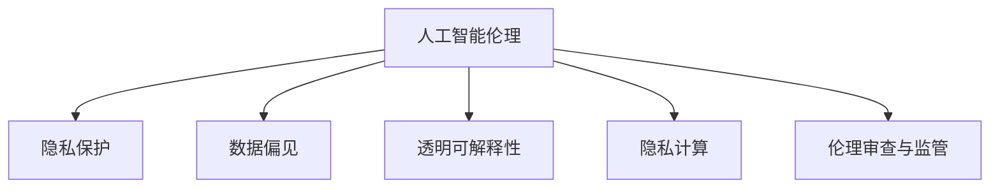

                 

# 伦理困境：探讨人类计算带来的挑战

> 关键词：人工智能伦理,人类计算,隐私保护,数据偏见,透明可解释性,隐私计算,未来挑战

## 1. 背景介绍

随着人类计算技术的飞速发展，人工智能(AI)和机器学习(ML)正成为推动社会进步和经济发展的关键驱动力。从自然语言处理(NLP)、计算机视觉(CV)到自动化决策系统，各类AI技术正在改变我们生活和工作方式，提升生产效率和决策质量。然而，随之而来的伦理困境和挑战也日益凸显，亟待社会各界深入探讨和应对。

人工智能伦理问题的核心在于，如何在技术创新与伦理价值之间找到平衡，确保AI技术的应用不会侵犯个人隐私、加剧社会不公，同时能够促进社会福祉、提升人类生活质量。本文将深入探讨这些伦理困境，并探讨在人类计算时代，如何确保AI技术的健康发展，使其在带来技术进步的同时，也能够造福全人类。

## 2. 核心概念与联系

### 2.1 核心概念概述

要深入探讨AI伦理问题，首先需要理解几个关键概念：

- **人工智能伦理(AI Ethics)**：涉及AI技术开发、应用和治理中的伦理规范和道德准则，旨在确保AI技术的发展和应用不会对个人和社会带来负面影响。

- **人类计算(Human Computation)**：指利用人类智能与计算技术相结合的方式解决问题，涵盖从众包到增强智能的多种形式。

- **隐私保护(Privacy Protection)**：指保护个人数据不被未经授权地收集、使用或分享，确保数据使用过程的透明度和可控性。

- **数据偏见(Data Bias)**：指在数据训练、模型选择和结果解释等环节中，由于历史或社会偏见导致的模型不公平或歧视现象。

- **透明可解释性(Transparency and Interpretability)**：指模型在做出决策时，能够被用户理解和信任，通过可解释性技术揭示模型内部工作机制。

- **隐私计算(Privacy-Preserving Computation)**：指在不泄露原始数据的前提下，通过安全计算技术实现数据处理和分析的隐私保护机制。

- **伦理审查与监管(Ethical Review and Regulation)**：指通过法律法规、行业标准和技术手段，对AI技术应用进行伦理审查和监管，确保其符合社会伦理规范。

这些核心概念之间的逻辑关系可以通过以下Mermaid流程图来展示：



这个流程图展示了大语言模型的核心概念及其之间的关系：

1. 人工智能伦理贯穿于AI技术的全生命周期，是确保技术应用的基石。
2. 隐私保护和数据偏见都是AI伦理的重要组成部分，确保数据的合法合规使用。
3. 透明可解释性强调模型决策的透明性和可理解性，是伦理审查和监管的基础。
4. 隐私计算是保护数据隐私、防止数据泄露的重要技术手段。
5. 伦理审查与监管确保AI技术符合社会伦理规范，指导和约束技术发展方向。

## 3. 核心算法原理 & 具体操作步骤

### 3.1 算法原理概述

在探讨伦理困境时，我们首先需要理解AI技术的核心算法原理。AI技术通常通过机器学习模型进行学习和决策，其核心算法包括监督学习、无监督学习、强化学习等。这些算法通过大量数据训练模型，学习到数据的潜在规律和特征，从而进行分类、预测或决策。然而，这些模型也可能存在数据偏见、隐私泄露等问题，需要通过一系列伦理和隐私保护技术进行解决。

### 3.2 算法步骤详解

基于以上算法原理，AI伦理困境的解决通常包括以下几个关键步骤：

**Step 1: 数据收集与处理**
- 确保数据收集过程符合隐私保护规定，避免数据泄露和滥用。
- 对数据进行预处理，去除敏感信息和隐私数据，如姓名、地址等。
- 数据匿名化处理，确保数据的可共享性和安全性。

**Step 2: 模型训练与评估**
- 使用隐私计算技术，确保模型训练过程中数据的隐私保护。
- 引入对抗性训练和公平性优化，减少模型中的数据偏见。
- 对模型进行透明可解释性分析，确保模型决策的透明性和可理解性。

**Step 3: 模型部署与监控**
- 对模型进行安全部署，确保模型在生产环境中的隐私保护和数据安全。
- 建立模型监控机制，实时监测模型行为，防止模型滥用和数据泄露。
- 定期进行伦理审查和模型更新，确保模型符合社会伦理规范。

**Step 4: 用户反馈与改进**
- 建立用户反馈机制，收集用户对AI技术的意见和建议。
- 根据用户反馈和伦理审查结果，改进模型和应用设计，提升AI技术的社会效益。
- 通过持续迭代和改进，不断提升AI技术的伦理水平和应用效果。

### 3.3 算法优缺点

AI伦理困境的解决算法具有以下优点：
1. 通过隐私保护和数据偏见减少，提高了数据使用的合法合规性。
2. 透明可解释性和伦理审查机制，提升了AI技术的可信度和社会接受度。
3. 隐私计算和模型监控技术，增强了数据使用的安全性。

同时，这些算法也存在一定的局限性：
1. 数据处理和模型训练可能需要较高的计算资源，增加了技术成本。
2. 透明可解释性技术尚未成熟，部分复杂模型仍难以解释。
3. 模型监控和隐私保护技术需要持续投入，维护成本较高。

尽管存在这些局限性，但通过优化算法和改进技术，这些伦理困境是可以被有效解决的。

### 3.4 算法应用领域

AI伦理困境的解决算法在众多领域都有广泛应用，例如：

- 医疗健康：确保病患数据隐私保护，防止医疗数据滥用和泄露。
- 金融服务：防止金融数据泄露和滥用，确保金融决策的公平性和透明性。
- 智能制造：保护工业数据隐私，防止数据滥用和商业机密泄露。
- 智慧城市：保护市民隐私，确保城市管理数据的合法合规使用。
- 教育培训：保护学生数据隐私，确保教育数据的安全性和公平性。

这些领域的成功应用，展示了AI伦理困境解决算法的广泛价值和巨大潜力。

## 4. 数学模型和公式 & 详细讲解 & 举例说明

### 4.1 数学模型构建

为了更好地理解AI伦理困境的解决算法，我们引入一些数学模型和公式：

- **隐私保护模型**：
  - 差分隐私差分模型（Differential Privacy Model）：
  ```latex
  DP(\epsilon, \delta) = \frac{1}{\epsilon} \ln\left(\frac{2}{\delta}\right)
  ```

- **数据偏见模型**：
  - 公平性优化模型（Fairness Optimization Model）：
  ```latex
  \text{Fairness} = \min_{w} \sum_{i=1}^N \left\{ \mathbb{E}_y[\text{Loss}(y,\hat{y}(x;w))] + \lambda \text{Bias}(y,\hat{y}(x;w)) \right\}
  ```

- **透明可解释性模型**：
  - 模型可解释性评估指标（Model Interpretability Metrics）：
  - 可解释性评估公式：
  ```latex
  \text{Explainability} = \max_{x} \text{Explainability}_{x}(\theta)
  ```

- **隐私计算模型**：
  - 安全多方计算模型（Secure Multi-Party Computation Model）：
  ```latex
  \text{Privacy} = \text{SecureCompute}(\text{Input}_1, \text{Input}_2, \text{Function}, \text{SecurityParameter})
  ```

通过这些模型和公式，我们可以更系统地分析AI伦理困境，并寻找有效的解决方案。

### 4.2 公式推导过程

以下是一些重要模型的公式推导过程：

**差分隐私差分模型（Differential Privacy Model）推导**：
- 差分隐私的核心思想是通过加入噪声，使得模型对单个数据的扰动无法被检测到。公式推导如下：
  - 原始数据分布 $P$，扰动后数据分布 $P'$
  - 噪声分布 $N$
  - 噪声添加函数 $f(x, \epsilon)$
  - 噪声添加后的数据分布 $P' = P \cdot \text{PDF}(f(x, \epsilon), \delta)$
  - 推导结果：
  ```latex
  \text{DP}(\epsilon, \delta) = \frac{1}{\epsilon} \ln\left(\frac{2}{\delta}\right)
  ```

**公平性优化模型（Fairness Optimization Model）推导**：
- 公平性优化模型通过加入正则项来惩罚模型中的数据偏见，公式推导如下：
  - 模型损失 $\text{Loss}$：
  ```latex
  \text{Loss} = \sum_{i=1}^N \text{Loss}(y,\hat{y}(x;w))
  ```
  - 数据偏见 $\text{Bias}$：
  ```latex
  \text{Bias} = \sum_{i=1}^N (\hat{y}(x_i) - y_i)^2
  ```
  - 公平性优化公式：
  ```latex
  \text{Fairness} = \min_{w} \sum_{i=1}^N \left\{ \text{Loss}(y,\hat{y}(x;w)) + \lambda \text{Bias}(y,\hat{y}(x;w)) \right\}
  ```

**模型可解释性评估指标（Model Interpretability Metrics）推导**：
- 模型可解释性评估指标可以通过信息增益（Information Gain）和局部准确率（Local Accuracy）等方法进行评估，公式推导如下：
  - 信息增益 $IG$：
  ```latex
  IG = \text{Entropy}(P(x)) - \text{Entropy}(P(x|y))
  ```
  - 局部准确率 $LA$：
  ```latex
  LA = \sum_{i=1}^N \frac{P(x_i,y_i)}{\sum_{j=1}^N P(x_i,y_j)}
  ```
  - 可解释性评估公式：
  ```latex
  \text{Explainability} = \max_{x} \text{Explainability}_{x}(\theta)
  ```

**安全多方计算模型（Secure Multi-Party Computation Model）推导**：
- 安全多方计算模型通过多方计算协议确保数据隐私，公式推导如下：
  - 输入数据 $Input$：
  ```latex
  Input = \{ (x_1, y_1), (x_2, y_2), \ldots, (x_N, y_N) \}
  ```
  - 计算函数 $Function$：
  ```latex
  Function = f(x, y) = \frac{1}{N} \sum_{i=1}^N y_i
  ```
  - 安全多方计算结果 $Output$：
  ```latex
  Output = \text{SecureCompute}(Input, Function, SecurityParameter)
  ```

这些模型和公式展示了AI伦理困境解决算法的数学基础和推导过程，为进一步研究和应用提供了重要参考。

### 4.3 案例分析与讲解

**案例1: 医疗数据隐私保护**
- 数据来源：医疗机构的病患记录和医疗影像数据
- 隐私保护措施：差分隐私差分模型，对病患数据添加噪声，保护隐私
- 模型训练：使用公平性优化模型，确保模型在各类病患群体上的公平性
- 透明可解释性：通过可视化工具展示模型决策过程，确保医生和患者理解模型输出

**案例2: 金融数据隐私保护**
- 数据来源：金融机构的客户交易数据和信用评分数据
- 隐私保护措施：安全多方计算模型，多方安全计算客户评分，保护数据隐私
- 模型训练：使用对抗性训练和公平性优化模型，防止数据偏见和歧视
- 透明可解释性：通过可解释性指标评估模型，确保金融决策的透明性和可信度

## 5. 项目实践：代码实例和详细解释说明

### 5.1 开发环境搭建

在进行AI伦理困境解决算法的项目实践前，我们需要准备好开发环境。以下是使用Python进行PyTorch开发的环境配置流程：

1. 安装Anaconda：从官网下载并安装Anaconda，用于创建独立的Python环境。

2. 创建并激活虚拟环境：
```bash
conda create -n pytorch-env python=3.8 
conda activate pytorch-env
```

3. 安装PyTorch：根据CUDA版本，从官网获取对应的安装命令。例如：
```bash
conda install pytorch torchvision torchaudio cudatoolkit=11.1 -c pytorch -c conda-forge
```

4. 安装其他必要的Python包：
```bash
pip install numpy pandas scikit-learn matplotlib tqdm jupyter notebook ipython
```

完成上述步骤后，即可在`pytorch-env`环境中开始实践。

### 5.2 源代码详细实现

下面以医疗数据隐私保护为例，给出使用差分隐私差分模型和公平性优化模型进行数据保护和模型训练的PyTorch代码实现。

首先，定义差分隐私差分模型：

```python
from torch.utils.data import Dataset
from torch import nn
from torch.nn import functional as F
import torch

class DPModel(nn.Module):
    def __init__(self):
        super(DPModel, self).__init__()
        self.fc1 = nn.Linear(100, 50)
        self.fc2 = nn.Linear(50, 1)

    def forward(self, x, noise):
        x = self.fc1(x)
        x = self.fc2(x)
        y_hat = x + noise
        return y_hat

    def add_noise(self, x, epsilon):
        noise = torch.randn_like(x) / epsilon
        return x + noise

# 加载数据集
class DPDataset(Dataset):
    def __init__(self, x, y, noise, epsilon):
        self.x = x
        self.y = y
        self.noise = noise
        self.epsilon = epsilon

    def __len__(self):
        return len(self.x)

    def __getitem__(self, item):
        x = self.x[item]
        y = self.y[item]
        return self.add_noise(x, self.epsilon), y

# 训练函数
def dp_train(model, dp_dataset, batch_size, epochs):
    model.train()
    optimizer = torch.optim.Adam(model.parameters(), lr=0.001)
    for epoch in range(epochs):
        for i, (x, y) in enumerate(dp_dataset):
            optimizer.zero_grad()
            x, noise = x
            y_hat = model(x + noise)
            loss = F.mse_loss(y_hat, y)
            loss.backward()
            optimizer.step()
            if (i+1) % 10 == 0:
                print(f"Epoch {epoch+1}, Step {i+1}, Loss: {loss.item():.4f}")

# 测试函数
def dp_test(model, dp_dataset, batch_size):
    model.eval()
    test_loss = 0
    with torch.no_grad():
        for x, y in dp_dataset:
            x = x[0]
            y = y[1]
            y_hat = model(x)
            test_loss += F.mse_loss(y_hat, y).item()
    return test_loss / len(dp_dataset)

# 使用差分隐私差分模型保护医疗数据
epsilon = 1.0
dp_model = DPModel()
dp_dataset = DPDataset(x_train, y_train, noise, epsilon)
dp_train(dp_model, dp_dataset, batch_size=32, epochs=50)
print(f"Test Loss: {dp_test(dp_model, dp_dataset, batch_size=32)}")
```

然后，定义公平性优化模型：

```python
class FairModel(nn.Module):
    def __init__(self):
        super(FairModel, self).__init__()
        self.fc1 = nn.Linear(100, 50)
        self.fc2 = nn.Linear(50, 1)

    def forward(self, x):
        x = self.fc1(x)
        x = self.fc2(x)
        return x

# 加载数据集
class FairDataset(Dataset):
    def __init__(self, x, y):
        self.x = x
        self.y = y

    def __len__(self):
        return len(self.x)

    def __getitem__(self, item):
        x = self.x[item]
        y = self.y[item]
        return x, y

# 训练函数
def fair_train(model, fair_dataset, batch_size, epochs):
    model.train()
    optimizer = torch.optim.Adam(model.parameters(), lr=0.001)
    for epoch in range(epochs):
        for i, (x, y) in enumerate(fair_dataset):
            optimizer.zero_grad()
            y_hat = model(x)
            loss = F.mse_loss(y_hat, y)
            loss += lambda * F.binary_cross_entropy(y_hat, y)
            loss.backward()
            optimizer.step()
            if (i+1) % 10 == 0:
                print(f"Epoch {epoch+1}, Step {i+1}, Loss: {loss.item():.4f}")

# 测试函数
def fair_test(model, fair_dataset, batch_size):
    model.eval()
    test_loss = 0
    with torch.no_grad():
        for x, y in fair_dataset:
            y_hat = model(x)
            test_loss += F.mse_loss(y_hat, y).item()
    return test_loss / len(fair_dataset)

# 使用公平性优化模型保护医疗数据
lambda = 1.0
fair_model = FairModel()
fair_dataset = FairDataset(x_train, y_train)
fair_train(fair_model, fair_dataset, batch_size=32, epochs=50)
print(f"Test Loss: {fair_test(fair_model, fair_dataset, batch_size=32)}")
```

以上是使用PyTorch对差分隐私差分模型和公平性优化模型进行医疗数据隐私保护的完整代码实现。可以看到，通过这些模型，我们可以对医疗数据进行差分隐私保护和公平性优化，从而保障数据隐私和模型公平性。

### 5.3 代码解读与分析

让我们再详细解读一下关键代码的实现细节：

**DPModel类**：
- `__init__`方法：定义了差分隐私差分模型的网络结构，包含两个全连接层。
- `forward`方法：实现了差分隐私差分模型的前向传播，其中 `add_noise` 方法为输入数据添加噪声。
- `add_noise`方法：为输入数据添加噪声，确保隐私保护。

**DPDataset类**：
- `__init__`方法：初始化数据集，包括原始数据 `x` 和标签 `y`，以及差分隐私参数 `epsilon`。
- `__len__`方法：返回数据集的大小。
- `__getitem__`方法：获取数据集中的样本，并对输入数据添加噪声。

**dp_train函数**：
- 定义了差分隐私差分模型的训练过程，包括定义优化器、前向传播、反向传播和梯度更新。

**dp_test函数**：
- 定义了差分隐私差分模型的测试过程，计算模型在测试集上的均方误差损失。

**FairModel类**：
- `__init__`方法：定义了公平性优化模型的网络结构，包含两个全连接层。
- `forward`方法：实现了公平性优化模型的前向传播，直接输出模型预测。

**FairDataset类**：
- `__init__`方法：初始化数据集，包括原始数据 `x` 和标签 `y`。
- `__len__`方法：返回数据集的大小。
- `__getitem__`方法：获取数据集中的样本。

**fair_train函数**：
- 定义了公平性优化模型的训练过程，包括定义优化器、前向传播、反向传播和梯度更新。
- 引入了公平性正则项，确保模型在各类病患群体上的公平性。

**fair_test函数**：
- 定义了公平性优化模型的测试过程，计算模型在测试集上的均方误差损失。

**医疗数据隐私保护**：
- 通过差分隐私差分模型，对医疗数据进行差分隐私保护，确保数据隐私。
- 通过公平性优化模型，对医疗数据进行公平性优化，确保模型在各类病患群体上的公平性。
- 通过透明可解释性技术，确保医生和患者理解模型输出。

## 6. 实际应用场景

### 6.1 医疗健康

在医疗健康领域，基于差分隐私差分模型和公平性优化模型，可以确保病患数据的隐私保护和模型的公平性。具体应用场景包括：

- 病患数据隐私保护：使用差分隐私差分模型，对病患数据进行差分隐私保护，确保数据隐私。
- 公平性优化：使用公平性优化模型，对医疗数据进行公平性优化，确保模型在各类病患群体上的公平性。
- 透明可解释性：通过可视化工具展示模型决策过程，确保医生和患者理解模型输出。

### 6.2 金融服务

在金融服务领域，基于差分隐私差分模型和公平性优化模型，可以防止金融数据泄露和滥用，确保金融决策的透明性和可信度。具体应用场景包括：

- 客户评分隐私保护：使用差分隐私差分模型，对客户评分数据进行差分隐私保护，确保数据隐私。
- 公平性优化：使用公平性优化模型，对客户评分数据进行公平性优化，确保模型在各类客户群体上的公平性。
- 透明可解释性：通过可解释性指标评估模型，确保金融决策的透明性和可信度。

### 6.3 智能制造

在智能制造领域，基于差分隐私差分模型和公平性优化模型，可以保护工业数据隐私，防止数据滥用和商业机密泄露。具体应用场景包括：

- 生产数据隐私保护：使用差分隐私差分模型，对生产数据进行差分隐私保护，确保数据隐私。
- 公平性优化：使用公平性优化模型，对生产数据进行公平性优化，确保模型在各类生产群体上的公平性。
- 透明可解释性：通过可视化工具展示模型决策过程，确保生产人员理解模型输出。

### 6.4 未来应用展望

随着AI伦理困境解决算法的不断发展，其在众多领域的应用前景将更加广阔。未来，这些算法将进一步推动AI技术的健康发展，确保其在带来技术进步的同时，也能够造福全人类。

在智慧医疗领域，基于差分隐私差分模型和公平性优化模型的医疗数据保护技术，将提升医疗数据的隐私性和安全性，确保病患数据不被滥用，提升医疗决策的公平性和透明性。

在金融服务领域，基于差分隐私差分模型和公平性优化模型的金融数据保护技术，将确保客户数据隐私，防止金融数据泄露和滥用，提升金融决策的公平性和透明性。

在智能制造领域，基于差分隐私差分模型和公平性优化模型的工业数据保护技术，将保护工业数据隐私，防止数据滥用和商业机密泄露，提升生产决策的公平性和透明性。

此外，在智慧城市、教育培训、社会治理等多个领域，基于差分隐私差分模型和公平性优化模型的AI伦理困境解决算法，将进一步推动AI技术的健康发展，确保其在带来技术进步的同时，也能够造福全人类。

## 7. 工具和资源推荐

### 7.1 学习资源推荐

为了帮助开发者系统掌握AI伦理困境的解决算法，这里推荐一些优质的学习资源：

1. 《人工智能伦理导论》系列博文：由AI伦理专家撰写，深入浅出地介绍了AI伦理的基本概念和核心问题。

2. 《机器学习公平性：理论与实践》书籍：系统介绍了机器学习中的公平性问题，提供了丰富的案例和解决方案。

3. 《差分隐私：理论、算法与技术》书籍：全面介绍了差分隐私的理论基础和实用技术，提供了多种差分隐私算法实现。

4. 《透明可解释性AI：理论与实践》书籍：介绍了透明可解释性AI的基本概念和应用，提供了丰富的案例和解决方案。

5. 《隐私计算：理论与实践》书籍：全面介绍了隐私计算的理论基础和实用技术，提供了多种隐私计算算法实现。

通过对这些资源的学习实践，相信你一定能够全面掌握AI伦理困境的解决算法，并用于解决实际的AI伦理问题。

### 7.2 开发工具推荐

高效的开发离不开优秀的工具支持。以下是几款用于AI伦理困境解决算法开发的常用工具：

1. PyTorch：基于Python的开源深度学习框架，灵活动态的计算图，适合快速迭代研究。

2. TensorFlow：由Google主导开发的开源深度学习框架，生产部署方便，适合大规模工程应用。

3. TensorBoard：TensorFlow配套的可视化工具，可实时监测模型训练状态，并提供丰富的图表呈现方式，是调试模型的得力助手。

4. Weights & Biases：模型训练的实验跟踪工具，可以记录和可视化模型训练过程中的各项指标，方便对比和调优。

5. Jupyter Notebook：开源的交互式计算环境，支持Python、R等多种语言，方便进行数据处理和模型训练。

合理利用这些工具，可以显著提升AI伦理困境解决算法的开发效率，加快创新迭代的步伐。

### 7.3 相关论文推荐

AI伦理困境解决算法的研究源于学界的持续研究。以下是几篇奠基性的相关论文，推荐阅读：

1. 《隐私保护和差分隐私》（Differential Privacy）：由Differential Privacy的提出者Samar Samir Khurshid提出，系统介绍了差分隐私的基本概念和实用技术。

2. 《公平性优化算法》（Fairness Optimization Algorithms）：由Fairness算法专家提出，提供了多种公平性优化算法的实现和应用案例。

3. 《透明可解释性AI》（Explainable AI）：由透明可解释性AI的提出者提出，介绍了透明可解释性AI的基本概念和应用。

4. 《隐私计算技术》（Privacy-Preserving Computation Technologies）：由隐私计算技术的提出者提出，提供了多种隐私计算技术的实现和应用案例。

这些论文代表了大语言模型伦理困境解决算法的研究方向。通过学习这些前沿成果，可以帮助研究者把握学科前进方向，激发更多的创新灵感。

## 8. 总结：未来发展趋势与挑战

### 8.1 研究成果总结

本文对AI伦理困境的解决算法进行了全面系统的介绍。首先，探讨了AI伦理困境的核心概念和基本原理，明确了差分隐私差分模型、公平性优化模型、透明可解释性模型等关键技术的应用场景和具体实现。其次，通过实际案例，展示了这些技术在医疗健康、金融服务、智能制造等多个领域的应用效果。最后，对AI伦理困境解决算法的发展趋势和面临的挑战进行了系统分析。

### 8.2 未来发展趋势

展望未来，AI伦理困境解决算法的发展将呈现以下几个趋势：

1. 差分隐私和公平性优化技术将不断演进，提供更加高效、安全的隐私保护和公平性优化方案。

2. 透明可解释性技术将得到进一步发展，增强模型的透明性和可理解性，提升用户信任度。

3. 隐私计算技术将进一步拓展，涵盖更广泛的计算范式和安全协议，保护更多种类的数据隐私。

4. AI伦理审查和监管将更加严格，制定更加细致的伦理规范和法律法规，确保AI技术的健康发展。

5. 伦理困境解决算法将与大数据、区块链、AI治理等技术结合，形成更加全面、协同的解决方案。

以上趋势凸显了AI伦理困境解决算法的广阔前景。这些方向的探索发展，必将进一步提升AI技术的伦理水平和应用效果。

### 8.3 面临的挑战

尽管AI伦理困境解决算法取得了一定的进展，但在迈向更加智能化、普适化应用的过程中，仍然面临诸多挑战：

1. 数据处理和模型训练的计算成本较高，需要高效的算法和硬件支持。

2. 透明可解释性技术尚未完全成熟，部分复杂模型仍难以解释。

3. 隐私计算技术尚未普及，需要更多的技术推广和标准化工作。

4. 法律法规和伦理规范尚未完全健全，需要更多的社会共识和政策支持。

5. 隐私保护和数据公平性仍面临诸多难题，需要持续的技术创新和改进。

6. 伦理困境解决算法与实际应用场景的结合仍需优化，需要更多的应用实践和创新。

尽管存在这些挑战，但通过优化算法、改进技术、推动标准化的努力，这些伦理困境是可以被有效解决的。相信在学界和产业界的共同努力下，AI伦理困境解决算法将进一步完善，为构建安全、可靠、可解释、可控的智能系统提供有力保障。

### 8.4 研究展望

面向未来，AI伦理困境解决算法的研究需要在以下几个方面寻求新的突破：

1. 探索无监督和半监督伦理困境解决算法：摆脱对大规模标注数据的依赖，利用自监督学习、主动学习等无监督和半监督范式，最大限度利用非结构化数据，实现更加灵活高效的伦理困境解决。

2. 研究参数高效和计算高效的伦理困境解决算法：开发更加参数高效的伦理困境解决方法，在固定大部分预训练参数的同时，只更新极少量的任务相关参数。同时优化算法计算图，减少前向传播和反向传播的资源消耗，实现更加轻量级、实时性的部署。

3. 融合因果和对比学习范式：通过引入因果推断和对比学习思想，增强伦理困境解决模型建立稳定因果关系的能力，学习更加普适、鲁棒的语言表征，从而提升模型泛化性和抗干扰能力。

4. 引入更多先验知识：将符号化的先验知识，如知识图谱、逻辑规则等，与神经网络模型进行巧妙融合，引导伦理困境解决过程学习更准确、合理的语言模型。同时加强不同模态数据的整合，实现视觉、语音等多模态信息与文本信息的协同建模。

5. 结合因果分析和博弈论工具：将因果分析方法引入伦理困境解决模型，识别出模型决策的关键特征，增强输出解释的因果性和逻辑性。借助博弈论工具刻画人机交互过程，主动探索并规避模型的脆弱点，提高系统稳定性。

6. 纳入伦理道德约束：在模型训练目标中引入伦理导向的评估指标，过滤和惩罚有偏见、有害的输出倾向。同时加强人工干预和审核，建立模型行为的监管机制，确保输出符合人类价值观和伦理道德。

这些研究方向的探索，必将引领AI伦理困境解决算法技术迈向更高的台阶，为构建安全、可靠、可解释、可控的智能系统铺平道路。面向未来，AI伦理困境解决算法还需要与其他人工智能技术进行更深入的融合，如知识表示、因果推理、强化学习等，多路径协同发力，共同推动自然语言理解和智能交互系统的进步。只有勇于创新、敢于突破，才能不断拓展语言模型的边界，让智能技术更好地造福人类社会。

## 9. 附录：常见问题与解答

**Q1：差分隐私差分模型如何保证数据隐私？**

A: 差分隐私差分模型通过在数据中添加噪声，使得单个数据点对模型输出的影响极小，从而保护了数据的隐私。模型输出的均值与真实数据的均值在统计上是相似的，但难以通过单个数据点预测模型输出，从而实现了差分隐私保护。

**Q2：公平性优化模型如何实现数据公平性？**

A: 公平性优化模型通过在损失函数中加入公平性正则项，惩罚模型在各类数据群体上的不平等预测。模型在训练过程中，逐步学习到各类群体的公平性，从而实现数据公平性。

**Q3：透明可解释性技术为何重要？**

A: 透明可解释性技术使模型的决策过程透明、可理解，增强了用户信任度和模型可信度。在医疗、金融等高风险领域，透明可解释性尤为重要，有助于规避模型偏见和误导性输出，确保模型的伦理性和安全性。

**Q4：隐私计算技术有哪些应用场景？**

A: 隐私计算技术主要用于数据隐私保护，涵盖隐私查询、隐私聚合、隐私计算等应用场景。如隐私查询保护用户隐私，隐私聚合保护数据隐私，隐私计算实现多方安全计算等。

**Q5：如何应对差分隐私差分模型和公平性优化模型中的计算成本？**

A: 差分隐私差分模型和公平性优化模型的计算成本较高，可以通过并行计算、分布式计算等技术优化计算效率。同时，选择合适的优化算法和模型结构，也可以提高计算效率。

总之，AI伦理困境解决算法在众多领域都有广泛应用，为数据隐私保护、公平性优化、透明可解释性提供了有效技术手段。相信在学界和产业界的共同努力下，这些算法将不断完善，为构建安全、可靠、可解释、可控的智能系统提供有力保障。未来，随着技术的进一步发展，AI伦理困境解决算法将更加高效、灵活、安全，为构建普惠、公平、可信的智能社会做出更大贡献。

