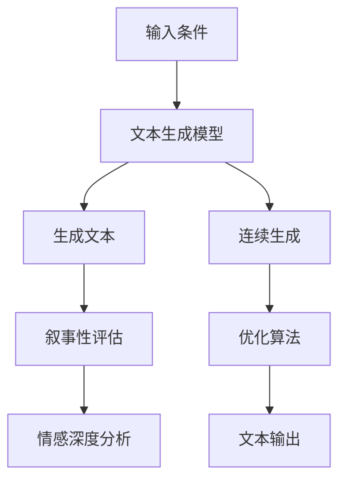

                 

# 体验的叙事性：AI生成的个人故事

## 1. 背景介绍

随着人工智能（AI）技术的不断进步，生成式AI（Generative AI），特别是基于自然语言处理（NLP）和深度学习模型的文本生成技术，已经在文学创作、故事讲述、广告文案等方面展示了巨大的潜力。然而，尽管技术上取得了显著突破，但AI生成的内容在叙事性和情感深度方面仍与人类创作有显著差距。本文旨在探讨AI在生成个人故事（Personal Story）时所面临的挑战与机遇，通过叙事性分析，揭示AI故事生成的内在机制，并提出未来可能的发展方向。

## 2. 核心概念与联系

### 2.1 核心概念概述

- **生成式AI**：通过训练生成模型，自动生成新文本的技术，包括文本摘要、机器翻译、文本生成等。
- **自然语言处理（NLP）**：使计算机能够理解、处理和生成自然语言的技术，包括文本分类、命名实体识别、情感分析等。
- **文本生成**：根据给定条件或输入数据自动生成符合语法和语义规范的文本，包括文本补全、对话生成、诗歌创作等。
- **叙事性（Narrative）**：文本的叙事能力，指故事中对时间、地点、人物、事件等要素的组织和描述，以及情感表达和情境构建。
- **情感深度（Emotional Depth）**：文本中情感的丰富性和深度，包括情感的细腻刻画和情感逻辑的连贯性。
- **连续生成（Continuous Generation）**：模型生成文本的过程，可以视为一系列离散步骤，但更优的方式是通过连续性生成实现流畅、自然的内容输出。

这些概念共同构成了AI故事生成的核心领域，通过理解这些核心概念，可以更深入地分析AI生成的内容特性和优化方向。

### 2.2 核心概念原理和架构的 Mermaid 流程图



这个流程图展示了文本生成从输入到输出的全过程，包括生成模型的运作、叙事的构建、情感的表达、连续生成的实现以及优化算法的应用。

## 3. 核心算法原理 & 具体操作步骤

### 3.1 算法原理概述

基于深度学习的文本生成模型，如GPT-3、T5等，通过大规模无标签文本数据训练，学习了丰富的语言结构和语义信息。这些模型通常采用自回归（如GPT）或自编码（如BERT）的方式，根据给定的初始条件，自动生成新的文本。生成的文本质量取决于模型的训练数据、模型结构以及训练过程中使用的优化算法。

### 3.2 算法步骤详解

1. **数据准备**：收集并处理用于训练生成模型的语料库，确保语料的多样性和质量。
2. **模型选择与训练**：选择合适的生成模型，并在准备好的语料库上进行训练。训练过程中需设置合适的损失函数和优化算法，如交叉熵、AdamW等。
3. **条件设定**：为模型设定生成文本的条件，如提供的提示词、主题、情感调性等。
4. **连续生成**：使用模型进行文本生成，采用连续性生成的方法，如利用Transformer的注意力机制，确保生成的文本连贯自然。
5. **叙事性与情感深度评估**：使用自然语言处理技术对生成的文本进行叙事性和情感深度的评估，找出不足之处。
6. **优化与迭代**：根据评估结果，调整模型参数或训练策略，进行模型优化和迭代训练。
7. **故事生成与输出**：使用优化后的模型，根据用户设定的条件生成个人故事，输出文本。

### 3.3 算法优缺点

**优点**：
- **高效性**：大规模预训练模型在生成文本时，能够快速响应，提供连续性生成的文本。
- **灵活性**：模型可以根据不同的输入条件生成各种主题和风格的故事，适用性广。
- **创新性**：生成模型能够创造出独特的内容，帮助用户在创意写作中获取灵感。

**缺点**：
- **缺乏叙事性**：当前生成模型生成的文本，虽然流畅自然，但往往缺乏丰富的叙事元素和情感深度，难以构建引人入胜的故事。
- **过度依赖训练数据**：生成模型的效果很大程度上依赖于训练数据的广度和多样性，难以覆盖所有可能的叙事场景。
- **难以控制风格**：虽然模型可以生成各种风格的文本，但用户难以精确控制生成文本的情感调性或风格特点。
- **生成文本质量不稳定**：不同的输入条件或训练策略，可能导致生成文本的质量波动较大。

### 3.4 算法应用领域

AI生成的个人故事在多个领域具有广泛的应用前景：
- **文学创作**：帮助作家快速生成故事大纲或章节草稿，提升创作效率。
- **教育培训**：为学生提供丰富的阅读材料和创作素材，辅助学习。
- **广告与市场营销**：生成吸引人的广告文案或产品介绍，提升品牌影响力。
- **心理健康**：通过生成个性化故事，帮助用户进行心理调节和情感宣泄。
- **游戏开发**：为角色提供丰富多样的对话和叙事，增强游戏体验。

## 4. 数学模型和公式 & 详细讲解 & 举例说明

### 4.1 数学模型构建

以GPT模型为例，其生成文本的过程可以视为基于语言模型的预测。假设模型的目标是从一个单词序列中生成下一个单词，模型预测下一个单词的概率分布$p(w_t|w_{<t})$，其中$w_{<t}$为前文，$w_t$为当前单词。模型的目标是最小化负对数似然损失函数$\mathcal{L}$：

$$
\mathcal{L} = -\frac{1}{N}\sum_{t=1}^{N} \log p(w_t|w_{<t})
$$

其中$N$为训练集大小。通过最大化$p(w_t|w_{<t})$，模型学会了预测下一个单词的概率，从而生成连贯的文本。

### 4.2 公式推导过程

在GPT模型中，语言模型的参数$\theta$通过优化训练数据中的所有单词对$(w_{<t}, w_t)$来学习。模型的输出为下一个单词的分布$p(w_t|w_{<t})$，定义为：

$$
p(w_t|w_{<t}) = \frac{exp(Q_{\theta}(w_t; w_{<t}))}{\sum_{w'\in \mathcal{V}}exp(Q_{\theta}(w'; w_{<t}))}
$$

其中$Q_{\theta}$为模型的输出函数，$\mathcal{V}$为词汇表。$Q_{\theta}(w_t; w_{<t})$可以表示为：

$$
Q_{\theta}(w_t; w_{<t}) = \sum_{i=1}^{d} \theta_i tanh(W_i [w_{<t}; \theta_{bias}])
$$

其中$d$为模型的隐藏维度，$W_i$和$\theta_{bias}$为模型参数。

### 4.3 案例分析与讲解

以使用GPT-3生成一个关于旅行的个人故事为例。首先，我们需要设定故事的背景设定、主要角色、故事主题等，然后提供这些信息作为模型的输入条件。模型会根据这些条件生成一系列连贯的句子，形成完整的旅行故事。

例如，我们输入条件为“在一个清晨，我醒来于一个陌生的城市，开始了我的旅行。”，模型生成的故事可能是：

```
在一个清晨，我醒来于一个陌生的城市，开始了我的旅行。街道上人流匆匆，车辆川流不息。我决定前往市区的中心广场，那里据说是一个充满活力的文化中心。走着走着，我被一座古老的教堂所吸引，走进去后，发现里面香火鼎盛，信徒们正在进行晨祷。我静静地坐在一旁，听着教堂内传来的唱诗声，感受着这里的庄严和宁静。

在这里，我遇到了一位老画家，他正在为墙上的一幅画做最后的润色。他热情地邀请我观看他的作品，并讲述了这幅画背后的故事。画中的场景如此生动，仿佛我置身其中。在他讲述的过程中，我感受到了对艺术的执着和对生活的热爱。

傍晚时分，我离开教堂，来到了市中心的一家小餐馆，点了一碗地道的当地美食。味道出奇地好，让我对这个城市产生了更深的喜爱。在餐馆里，我结识了一位当地的青年，他向我介绍了这个城市的风土人情和历史故事。

夜幕降临，城市灯光亮起，我沿着运河漫步，欣赏着这座城市独特的夜景。街头的艺术家们用各种形式的艺术展示着这个城市的魅力。那一刻，我意识到，这个城市的每一处角落，都充满了故事和感动。

就这样，我度过了一个难忘的旅行。我相信，这个城市将会成为我心中永恒的记忆。”
```

通过这个案例，可以看出GPT模型生成的文本虽然流畅自然，但故事的叙事性和情感深度还远不及人类创作的内容。

## 5. 项目实践：代码实例和详细解释说明

### 5.1 开发环境搭建

首先，需要安装PyTorch和相关依赖包。

```bash
pip install torch transformers
```

然后，准备训练数据和模型。可以从HuggingFace的模型库中下载GPT-3模型，并将其保存在本地。

```bash
wget https://huggingface.co/models/gpt3-medium-1.0/resolve/main/config.json
```

### 5.2 源代码详细实现

下面是一个使用GPT-3生成个人故事的示例代码：

```python
from transformers import GPT3Tokenizer, GPT3LMHeadModel
import torch

tokenizer = GPT3Tokenizer.from_pretrained('gpt3-medium')
model = GPT3LMHeadModel.from_pretrained('gpt3-medium')

input_prompt = "在一个清晨，我醒来于一个陌生的城市，开始了我的旅行。"
input_ids = tokenizer.encode(input_prompt, return_tensors='pt')
output = model.generate(input_ids, max_length=100, num_return_sequences=1, do_sample=True)

generated_text = tokenizer.decode(output[0], skip_special_tokens=True)
print(generated_text)
```

### 5.3 代码解读与分析

- `GPT3Tokenizer`和`GPT3LMHeadModel`：用于加载GPT-3的tokenizer和模型。
- `input_prompt`：用户设定的生成文本的条件。
- `tokenizer.encode`：将条件转换成模型能够理解的token id。
- `model.generate`：使用模型生成文本，设置最大生成长度为100，并开启采样模式。
- `tokenizer.decode`：将生成的token id转换成文本。

### 5.4 运行结果展示

运行上述代码，会输出一个根据用户条件生成的个人故事。

## 6. 实际应用场景

### 6.1 文学创作

AI生成的个人故事在文学创作领域具有巨大的潜力。作家可以使用AI生成的故事大纲作为灵感来源，快速推进小说创作进程。例如，作家可以为小说设定一个场景或角色，由AI生成初步的故事框架，然后通过后续的修改和完善，创造出独特的文学作品。

### 6.2 教育培训

在教育培训领域，AI生成的个人故事可以作为阅读材料，辅助学生理解复杂的概念和情感。例如，教师可以为学生提供一系列基于特定主题的AI故事，让学生在阅读中学习语言和情感表达，提高理解力和写作能力。

### 6.3 广告与市场营销

广告公司可以使用AI生成的个人故事来设计广告文案，提升品牌形象和用户共鸣。例如，为某个产品生成一个关于用户体验的故事，可以直观地展示产品的优势和价值，吸引潜在客户的关注。

### 6.4 心理健康

心理健康领域中，AI生成的个人故事可以作为情感宣泄和心理调节的工具。例如，为患者生成与其心理状态相符的故事，帮助其表达内心的情感，缓解压力和焦虑。

### 6.5 游戏开发

游戏开发者可以使用AI生成的个人故事为游戏中的角色和情节提供丰富的背景和对话，增强游戏的沉浸感和互动性。例如，为游戏中的NPC生成随机的对话和故事，使游戏更加生动有趣。

## 7. 工具和资源推荐

### 7.1 学习资源推荐

1. **《深度学习》教材**：由Goodfellow等所著，全面介绍了深度学习的基本概念和算法。
2. **自然语言处理综述**：由张军等所著，介绍了自然语言处理的各个分支和最新进展。
3. **生成式AI论文集**：从arXiv等平台下载生成式AI领域的最新论文，了解前沿研究动态。
4. **HuggingFace官方文档**：详细介绍了GPT-3等模型的使用方法和优化技巧。

### 7.2 开发工具推荐

1. **PyTorch**：开源的深度学习框架，支持动态图计算，方便模型迭代和优化。
2. **TensorFlow**：Google开发的深度学习框架，支持静态图计算，适合大规模模型训练和部署。
3. **Transformers**：用于NLP任务的模型库，包含多种生成模型和预训练模型。
4. **Jupyter Notebook**：用于数据处理和模型训练的交互式环境，方便开发和调试。
5. **WandB**：模型训练的实验跟踪工具，可记录和可视化模型训练过程中的各项指标。

### 7.3 相关论文推荐

1. **Attention is All You Need**：Transformer模型的原始论文，提出了自注意力机制，奠定了现代生成模型基础。
2. **GPT-3: Language Models are Unsupervised Multitask Learners**：GPT-3的论文，展示了生成模型在大规模语料上的强大学习能力。
3. **BERT: Pre-training of Deep Bidirectional Transformers for Language Understanding**：BERT模型的论文，展示了预训练大模型在语言理解任务上的优势。
4. **LoRA: Low-Rank Adaptation of Large Language Models for Parameter-Efficient Transfer Learning**：LoRA论文，提出了一种低秩适应的生成模型，提高了微调效率。

## 8. 总结：未来发展趋势与挑战

### 8.1 研究成果总结

生成式AI在文本生成领域取得了显著进展，但在叙事性和情感深度方面仍与人类创作有较大差距。未来需要进一步探索生成模型如何更好地理解人类情感和叙事结构，提升生成文本的质量和多样性。

### 8.2 未来发展趋势

1. **叙事性增强**：未来生成模型将更加注重叙事结构和情感表达，生成具有深刻叙事性和情感深度的故事。
2. **多模态融合**：结合视觉、音频等多模态信息，生成更加丰富和生动的故事。
3. **交互式生成**：实现生成模型的交互式生成，用户可以实时调整生成条件，生成符合自己期望的故事。
4. **个性化生成**：根据用户的个性化偏好和历史互动记录，生成符合其口味的故事。
5. **伦理和安全性**：加强生成模型的伦理和安全审查，避免有害内容的生成。

### 8.3 面临的挑战

1. **叙事性缺乏**：生成模型往往缺乏丰富的叙事元素和情感深度，难以构建引人入胜的故事。
2. **情感深度不足**：生成模型的情感表达相对单一，难以捕捉复杂的情感变化。
3. **数据依赖性**：生成模型的性能依赖于训练数据的广度和多样性，难以覆盖所有可能的叙事场景。
4. **生成质量不稳定**：不同的输入条件或训练策略，可能导致生成文本的质量波动较大。
5. **伦理和安全问题**：生成模型可能会生成有害或误导性的内容，带来伦理和安全风险。

### 8.4 研究展望

1. **叙事情境构建**：研究如何通过模型设计增强生成文本的叙事情境构建能力。
2. **情感逻辑推理**：探索生成模型如何在生成过程中进行情感逻辑推理，生成更加细腻的情感表达。
3. **多模态生成**：研究如何将视觉、音频等多模态信息融合到文本生成中，生成更加丰富和生动的故事。
4. **交互式生成框架**：研究如何构建交互式生成框架，让用户能够实时调整生成条件，生成符合期望的故事。
5. **生成内容的伦理审查**：研究如何构建生成内容的伦理和安全审查机制，确保生成内容的健康和安全。

## 9. 附录：常见问题与解答

**Q1: 如何提高AI生成的个人故事的质量？**

A: 提高AI生成的个人故事质量的关键在于优化模型的训练数据和生成策略：
1. **数据质量**：使用高质量、多样性的训练数据，确保模型学习到丰富的语言结构和语义信息。
2. **生成策略**：调整生成策略，如控制采样温度、设置生成长度和截断点，优化生成的文本质量和连贯性。
3. **模型优化**：定期进行模型优化和微调，更新模型参数，提升生成效果。

**Q2: 如何确保AI生成的个人故事符合伦理和安全要求？**

A: 确保AI生成的个人故事符合伦理和安全要求的关键在于模型设计和数据管理：
1. **伦理设计**：在设计生成模型时，加入伦理导向的评估指标，过滤和惩罚有害的输出内容。
2. **数据审查**：对训练数据进行严格的伦理和安全审查，确保数据的多样性和无害性。
3. **用户反馈**：引入用户反馈机制，及时调整生成策略，避免生成有害内容。
4. **安全防护**：采用访问鉴权、数据脱敏等措施，保障数据和模型的安全。

**Q3: 如何优化AI生成的个人故事的叙事性和情感深度？**

A: 优化AI生成的个人故事的叙事性和情感深度需要多方面的努力：
1. **叙事结构设计**：在设计生成任务时，提供丰富的叙事元素和情感线索，引导模型生成具有深刻叙事性和情感深度的故事。
2. **情感逻辑推理**：研究如何在生成过程中加入情感逻辑推理，增强情感表达的细腻性和连贯性。
3. **多模态融合**：将视觉、音频等多模态信息融合到文本生成中，生成更加丰富和生动的叙事内容。
4. **交互式生成**：实现交互式生成，让用户能够实时调整生成条件，生成符合期望的故事。

**Q4: 如何构建具有情感深度的AI生成的个人故事？**

A: 构建具有情感深度的AI生成的个人故事需要综合考虑多个因素：
1. **情感词汇选择**：在生成文本时，合理选择情感词汇和表达方式，使故事更具情感深度。
2. **情感逻辑连贯**：确保故事中的情感表达和情感变化符合逻辑和情境，避免情感逻辑断裂。
3. **情感层次构建**：构建情感层次，使故事中的情感表达既有细节描述，又有整体把握，使情感更加丰富和细腻。
4. **情感共鸣构建**：研究如何构建情感共鸣，使读者能够产生情感共鸣，增强故事的感染力。

**Q5: 如何评估AI生成的个人故事的质量？**

A: 评估AI生成的个人故事质量需要综合考虑多个方面：
1. **叙事性评估**：评估故事中的叙事元素和结构，确保故事具有清晰的叙事线和引人入胜的情节。
2. **情感深度评估**：评估故事中的情感表达和情感变化，确保情感细腻丰富，连贯一致。
3. **语言流畅性评估**：评估生成文本的语言流畅性和语法准确性，确保文本符合语法规范。
4. **情感共鸣评估**：评估读者对故事情感的共鸣度，确保故事能够打动人心，产生情感共鸣。

---

作者：禅与计算机程序设计艺术 / Zen and the Art of Computer Programming

