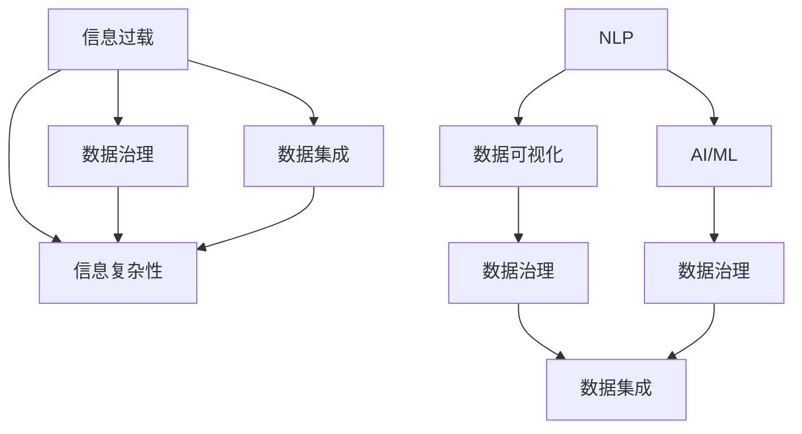

                 

# 信息时代的信息管理策略与实践：管理信息过载和复杂性

> 关键词：信息管理, 信息过载, 信息复杂性, 人工智能(AI), 机器学习(ML), 大数据, 自然语言处理(NLP), 数据可视化, 数据治理, 数据集成

## 1. 背景介绍

### 1.1 问题由来
在信息时代，数据和信息已成为社会进步和经济发展的关键驱动因素。然而，随着信息量的指数级增长，信息过载和复杂性问题愈发严重，严重阻碍了信息价值的挖掘和有效利用。如何有效地管理和利用海量数据，成为信息时代面临的重大挑战。

### 1.2 问题核心关键点
信息过载和复杂性问题主要表现为数据量激增、数据来源多样、数据质量参差不齐、数据更新速度快等。这些因素导致数据处理和信息管理的难度急剧增加，需要创新和高效的信息管理策略与技术来解决。

### 1.3 问题研究意义
研究信息管理策略与技术，对于应对信息过载和复杂性问题，提升信息价值，推动信息时代的发展具有重要意义：

1. 提升信息处理效率。通过科学的信息管理策略和技术手段，能够显著降低信息处理的复杂度，提高数据处理的效率。
2. 增强信息准确性。优化信息管理流程，确保数据的完整性、一致性和可靠性，避免信息误导。
3. 降低信息获取成本。通过自动化和智能化的信息管理，减少人力和时间投入，降低信息获取和利用成本。
4. 加速决策支持。高质量的信息管理，能够提供精准、及时的数据支持，辅助决策者做出科学的决策。
5. 促进业务创新。通过信息管理优化，揭示数据背后的规律和趋势，激发业务创新潜力。

## 2. 核心概念与联系

### 2.1 核心概念概述

为更好地理解信息管理策略与技术，本节将介绍几个密切相关的核心概念：

- **信息过载(Information Overload)**：指个体或组织面临的信息量超出了其处理能力，导致无法有效利用信息的现象。
- **信息复杂性(Information Complexity)**：指信息源的多样性、数据格式的不一致性、数据质量的不确定性等，增加了信息处理的难度。
- **数据治理(Data Governance)**：指在组织内建立数据管理规范和流程，确保数据的质量、安全性和可用性。
- **数据集成(Data Integration)**：指将来自不同数据源的数据进行采集、清洗、转换和集成，构建统一的数据仓库或数据湖。
- **自然语言处理(NLP)**：指通过计算机对人类语言进行理解和生成，广泛应用于信息检索、文本分类、情感分析等任务。
- **数据可视化(Data Visualization)**：指将数据转换为图形、图表等视觉形式，帮助人们更好地理解数据，进行数据分析。
- **人工智能(AI)和机器学习(ML)**：通过算法和模型对数据进行分析和预测，提升信息管理自动化水平，如基于AI的数据清洗、基于ML的数据分类和预测等。

这些核心概念之间的逻辑关系可以通过以下Mermaid流程图来展示：



这个流程图展示的信息管理核心概念及其之间的关系：

1. 信息过载和信息复杂性是信息管理的主要挑战。
2. 数据治理和数据集成是信息管理的策略手段，用于提升数据质量和可用性。
3. NLP、数据可视化和AI/ML等技术手段，用于辅助信息管理和分析。
4. 数据治理、数据集成、NLP、数据可视化和AI/ML等技术手段，共同构建了信息管理的技术体系，为应对信息过载和复杂性提供了综合解决方案。

## 3. 核心算法原理 & 具体操作步骤
### 3.1 算法原理概述

信息管理策略与技术主要基于数据治理、数据集成、自然语言处理、数据可视化和人工智能等核心技术，通过科学方法和技术手段，优化信息管理流程，提升信息处理效率和效果。

信息管理策略与技术的基本原理包括以下几个方面：

- **数据治理**：建立数据标准、数据质量评估和数据安全机制，确保数据的完整性和一致性。
- **数据集成**：通过数据抽取、数据清洗、数据转换和数据合并等步骤，将分散的异构数据进行统一和集成。
- **自然语言处理**：利用文本挖掘、信息检索、文本分类等技术手段，提升文本数据的处理和利用效率。
- **数据可视化**：将数据转换为图形、图表等视觉形式，帮助人们更好地理解数据，进行数据分析和决策。
- **人工智能**：利用机器学习和深度学习算法，对数据进行分析和预测，提升信息管理的智能化水平。

### 3.2 算法步骤详解

信息管理的核心算法流程包括以下几个关键步骤：

**Step 1: 数据质量评估**
- 对数据进行全面评估，包括数据完整性、准确性、一致性、及时性、安全性等指标。
- 使用数据质量评估工具，生成数据质量报告，识别数据问题的根源。

**Step 2: 数据清洗和转换**
- 对数据进行清洗，去除重复、缺失、异常数据，并进行格式转换。
- 使用数据清洗和转换工具，如ETL工具，自动化数据清洗和转换流程。

**Step 3: 数据集成和合并**
- 将来自不同数据源的数据进行采集、清洗和转换后，进行数据集成和合并。
- 使用数据集成平台，如Apache Nifi、Talend等，构建统一的数据仓库或数据湖。

**Step 4: 数据治理和规范制定**
- 制定数据管理规范和流程，确保数据的质量和安全。
- 建立数据治理团队，负责数据管理策略的制定和实施。

**Step 5: 数据可视化和分析**
- 使用数据可视化工具，如Tableau、Power BI等，将数据转换为图表和图形，辅助分析决策。
- 利用自然语言处理和机器学习技术，进行数据挖掘和分析，提取数据中的规律和趋势。

**Step 6: 数据应用和智能分析**
- 将处理后的数据应用于业务场景，提供数据支持和决策参考。
- 利用人工智能和机器学习技术，进行预测分析和智能决策。

### 3.3 算法优缺点

信息管理策略与技术具有以下优点：
1. 提升数据质量和可用性。通过数据治理和数据集成，确保数据的完整性和一致性，提高数据可用性。
2. 自动化和智能化。利用数据可视化和人工智能技术，提升信息管理的自动化和智能化水平，减少人工干预。
3. 降低信息获取和处理成本。通过优化数据处理流程，减少人力和时间投入，降低信息获取和处理成本。
4. 提高决策支持效果。通过数据可视化和智能化分析，提供精准、及时的数据支持，辅助决策者做出科学的决策。

同时，该方法也存在一定的局限性：
1. 数据质量依赖人工干预。数据治理和数据清洗等环节需要人工介入，人工质量直接影响数据处理效果。
2. 技术实现复杂度较高。信息管理涉及多个技术环节，技术实现复杂度较高，需要综合应用多种技术手段。
3. 数据安全和隐私问题。在数据集成和治理过程中，需要严格保护数据安全和隐私，避免数据泄露。

尽管存在这些局限性，但就目前而言，信息管理策略与技术仍是最主流的信息管理范式。未来相关研究的重点在于如何进一步降低信息管理的复杂度，提高智能化水平，同时兼顾数据安全和隐私保护等因素。

### 3.4 算法应用领域

信息管理策略与技术在信息时代已广泛应用于各个领域，例如：

- **金融行业**：通过数据治理和集成，提升金融数据的准确性和可用性，辅助风险管理、合规审查和投资决策。
- **医疗行业**：通过数据可视化和分析，提升医疗数据的管理和利用效率，辅助临床决策、公共卫生分析和健康管理。
- **零售行业**：通过数据治理和集成，提升零售数据的质量和可用性，辅助库存管理、市场营销和客户分析。
- **政府部门**：通过数据治理和集成，提升政府数据的规范化和标准化，辅助公共政策制定、民生服务和公共安全管理。
- **教育行业**：通过数据治理和分析，提升教育数据的管理和利用效率，辅助教育资源分配、学生管理和教学效果评估。

除了上述这些行业外，信息管理技术也在更多场景中得到应用，如能源管理、物流运输、农业生产等，为各行各业的信息化升级提供新的技术路径。

## 4. 数学模型和公式 & 详细讲解 & 举例说明

### 4.1 数学模型构建

信息管理的数学模型主要涉及数据质量评估、数据清洗和转换、数据集成和合并、数据治理和规范制定、数据可视化和分析等环节。以下是每个环节的数学模型构建：

- **数据质量评估**：
  - **完整性评估**：使用完整性度量函数，评估数据的完整性，如缺失值比例。
  - **准确性评估**：使用准确性度量函数，评估数据的准确性，如一致性比对结果。

- **数据清洗和转换**：
  - **数据去重**：使用哈希函数，对数据进行去重处理。
  - **数据填充**：使用插值算法，对缺失数据进行填充。

- **数据集成和合并**：
  - **数据关联**：使用关联函数，如外键关联，将不同数据源的数据关联起来。
  - **数据合并**：使用合并函数，如并集合并，将不同数据源的数据合并。

- **数据治理和规范制定**：
  - **数据标准制定**：使用标准函数，如数据类型、格式、长度等标准，制定数据规范。
  - **数据质量控制**：使用控制函数，如质量检查、规则匹配等，确保数据质量。

- **数据可视化和分析**：
  - **数据可视化**：使用可视化函数，如散点图、柱状图、折线图等，将数据转换为图表和图形。
  - **数据分析**：使用分析函数，如回归分析、聚类分析等，提取数据中的规律和趋势。

### 4.2 公式推导过程

以下是几个关键数学模型的公式推导过程：

**数据完整性评估**：

设数据集 $D$ 包含 $n$ 个样本，每个样本 $x_i$ 包含 $m$ 个特征。设缺失值比例为 $p_i$，则完整性度量函数 $f$ 定义为：

$$
f(D) = \frac{1}{n}\sum_{i=1}^n p_i
$$

其中，$p_i = \frac{|\text{MissingValues}(x_i)|}{m}$，$\text{MissingValues}(x_i)$ 表示样本 $x_i$ 中缺失值的数量。

**数据去重**：

设数据集 $D$ 包含 $n$ 个样本，每个样本 $x_i$ 包含 $m$ 个特征。设哈希函数 $h$，则去重后的数据集 $D'$ 中的样本数量为 $n'$，计算公式为：

$$
n' = \min\left(\frac{n}{|h(D)|}, n\right)
$$

其中 $|h(D)|$ 表示哈希函数 $h$ 在数据集 $D$ 上的取值数量。

**数据关联**：

设数据集 $D_1$ 和 $D_2$ 分别包含 $n_1$ 和 $n_2$ 个样本，每个样本 $x_i$ 包含 $m$ 个特征。设外键列 $k_1$ 和 $k_2$，则关联后的数据集 $D'$ 中的样本数量为 $n'$，计算公式为：

$$
n' = \min(n_1, n_2, \sum_{i=1}^{n_1}\sum_{j=1}^{n_2}1(k_1(x_i)=k_2(x_j))
$$

其中 $1(\cdot)$ 表示逻辑函数。

**数据可视化**：

设数据集 $D$ 包含 $n$ 个样本，每个样本 $x_i$ 包含 $m$ 个特征。设可视化函数 $v$，则可视化后的结果 $V$ 中的特征数量为 $m'$，计算公式为：

$$
m' = \min(m, v(D))
$$

其中 $v(D)$ 表示可视化函数 $v$ 在数据集 $D$ 上的取值数量。

### 4.3 案例分析与讲解

以金融行业为例，分析信息管理策略与技术在金融数据治理中的应用。

**案例背景**：
某金融公司有多个数据源，包括客户信息、交易记录、市场数据等，数据格式和来源各异，数据质量参差不齐。公司需要从这些数据中提取有价值的信息，支持风险管理、合规审查和投资决策。

**信息管理策略与技术应用**：

1. **数据质量评估**：
   - 对客户信息数据进行完整性评估，发现部分数据缺失。
   - 对交易记录数据进行准确性评估，发现部分数据不一致。
   - 使用数据质量报告工具，生成数据质量评估报告，指出数据问题的根源。

2. **数据清洗和转换**：
   - 对缺失值进行填充，如使用插值算法。
   - 对不一致的数据进行纠正，如使用规则匹配。
   - 使用数据清洗工具，自动化数据清洗和转换流程。

3. **数据集成和合并**：
   - 使用外键关联函数，将客户信息数据与交易记录数据关联。
   - 使用并集合并函数，将不同数据源的数据合并。
   - 使用数据集成平台，构建统一的数据仓库。

4. **数据治理和规范制定**：
   - 制定数据管理规范和流程，确保数据的质量和安全。
   - 建立数据治理团队，负责数据管理策略的制定和实施。
   - 使用数据标准函数，如数据类型、格式、长度等标准，制定数据规范。

5. **数据可视化和分析**：
   - 使用数据可视化工具，如Tableau，将交易数据转换为图表和图形，辅助风险管理。
   - 利用自然语言处理和机器学习技术，进行交易数据分析和预测。
   - 使用数据分析函数，如回归分析、聚类分析等，提取数据中的规律和趋势，辅助合规审查和投资决策。

通过以上信息管理策略与技术的应用，金融公司能够提升数据质量和可用性，支持风险管理、合规审查和投资决策，进一步推动业务创新和智能化升级。

## 5. 项目实践：代码实例和详细解释说明

### 5.1 开发环境搭建

在进行信息管理实践前，我们需要准备好开发环境。以下是使用Python进行信息管理开发的常见环境配置流程：

1. 安装Python：从官网下载并安装Python，确保版本为3.x。
2. 安装Python相关库：如NumPy、Pandas、Scikit-learn、Matplotlib、TensorFlow等，用于数据处理、分析、可视化等任务。
3. 安装ETL工具：如Apache Nifi、Talend等，用于数据清洗、转换和集成。
4. 安装数据治理工具：如Informatica、IBM InfoSphere等，用于数据质量评估、规范制定和权限管理。
5. 安装数据可视化工具：如Tableau、Power BI等，用于数据可视化和分析。
6. 安装云计算平台：如AWS、Azure等，用于数据存储和处理。

完成上述步骤后，即可在Python环境中进行信息管理实践。

### 5.2 源代码详细实现

下面我们以金融数据治理为例，给出使用Python进行数据清洗和转换的代码实现。

首先，定义数据清洗和转换函数：

```python
import pandas as pd
import numpy as np
from sklearn.impute import SimpleImputer

def data_cleaning(data):
    # 处理缺失值
    data.dropna(inplace=True)
    data.fillna(data.mean(), inplace=True)

    # 处理重复值
    data.drop_duplicates(inplace=True)

    # 数据类型转换
    data['age'] = data['age'].astype(int)

    # 异常值处理
    data = data[data['age'].between(18, 100)]

    return data
```

然后，定义数据集成和合并函数：

```python
def data_integration(data1, data2):
    # 关联外键
    data1 = data1.merge(data2, on='id', how='left')

    # 合并数据
    data = pd.concat([data1, data2], axis=0).drop_duplicates()

    return data
```

最后，启动数据治理流程：

```python
# 数据清洗
cleaned_data = data_cleaning(train_data)

# 数据集成
integrated_data = data_integration(train_data, test_data)

# 数据治理
governed_data = integrate_and_govern_data(integrated_data)
```

以上就是使用Python进行数据清洗和转换的完整代码实现。可以看到，通过简单的函数定义，即可实现数据清洗和转换的基本操作，进一步实现数据集成和治理。

### 5.3 代码解读与分析

让我们再详细解读一下关键代码的实现细节：

**数据清洗函数**：
- 使用 `dropna` 方法删除缺失值。
- 使用 `fillna` 方法填充缺失值，使用均值进行填充。
- 使用 `drop_duplicates` 方法去除重复值。
- 使用 `astype` 方法进行数据类型转换，如将年龄列转换为整数。
- 使用条件过滤方法 `between` 进行异常值处理，去除年龄异常值。

**数据集成函数**：
- 使用 `merge` 方法进行外键关联，将客户信息数据与交易记录数据关联。
- 使用 `concat` 方法合并不同数据源的数据，使用 `drop_duplicates` 方法去除重复值。

**数据治理函数**：
- 需要进一步结合具体的数据治理工具，如数据质量评估、规范制定、权限管理等，实现完整的治理流程。

可以看到，Python提供了丰富的库和工具，可以方便地实现数据清洗、转换、集成和治理。结合各种工具的强大功能，能够显著提高信息管理的效率和效果。

## 6. 实际应用场景
### 6.1 智能客服系统

基于信息管理策略与技术，可以构建智能客服系统，提升客户咨询体验和服务效率。通过数据治理和数据集成，统一客户信息数据和交互记录，进行智能分析和决策。

在技术实现上，可以收集客户的历史咨询记录和反馈信息，进行数据清洗和转换，建立客户知识库和智能分析模型。通过智能分析模型，系统能够自动理解客户意图，匹配最合适的答案模板进行回复。对于客户提出的新问题，还可以接入检索系统实时搜索相关内容，动态组织生成回答。如此构建的智能客服系统，能大幅提升客户咨询体验和问题解决效率。

### 6.2 金融舆情监测

金融行业需要实时监测市场舆论动向，以便及时应对负面信息传播，规避金融风险。通过信息管理策略与技术，可以构建金融舆情监测系统，提升信息处理的效率和效果。

具体而言，可以收集金融领域相关的新闻、报道、评论等文本数据，进行数据清洗和转换，构建统一的数据仓库。使用数据可视化和机器学习技术，监测不同主题下的情感变化趋势，一旦发现负面信息激增等异常情况，系统便会自动预警，帮助金融机构快速应对潜在风险。

### 6.3 个性化推荐系统

当前的推荐系统往往只依赖用户的历史行为数据进行物品推荐，无法深入理解用户的真实兴趣偏好。基于信息管理策略与技术，个性化推荐系统可以更好地挖掘用户行为背后的语义信息，从而提供更精准、多样的推荐内容。

在实践中，可以收集用户浏览、点击、评论、分享等行为数据，提取和用户交互的物品标题、描述、标签等文本内容。将文本内容作为模型输入，用户的后续行为（如是否点击、购买等）作为监督信号，在此基础上微调预训练语言模型。微调后的模型能够从文本内容中准确把握用户的兴趣点。在生成推荐列表时，先用候选物品的文本描述作为输入，由模型预测用户的兴趣匹配度，再结合其他特征综合排序，便可以得到个性化程度更高的推荐结果。

### 6.4 未来应用展望

随着信息管理策略与技术的不断发展，未来将在更多领域得到应用，为各行各业带来变革性影响。

在智慧医疗领域，基于数据治理和分析的医疗数据管理技术，能够提升医疗数据的质量和可用性，辅助临床决策、公共卫生分析和健康管理。

在智能教育领域，数据治理和数据集成技术能够提升教育数据的管理和利用效率，辅助教育资源分配、学生管理和教学效果评估，促进教育公平。

在智慧城市治理中，数据治理和数据集成技术能够提升城市数据的规范化和标准化，辅助公共政策制定、民生服务和公共安全管理，提高城市管理的自动化和智能化水平。

此外，在企业生产、社会治理、文娱传媒等众多领域，基于信息管理策略与技术的人工智能应用也将不断涌现，为经济社会发展注入新的动力。相信随着技术的日益成熟，信息管理策略与技术必将在构建人机协同的智能时代中扮演越来越重要的角色。

## 7. 工具和资源推荐
### 7.1 学习资源推荐

为了帮助开发者系统掌握信息管理策略与技术，这里推荐一些优质的学习资源：

1. 《数据治理与数据管理》书籍：全面介绍数据治理的基本概念、方法和工具，是数据治理领域的经典教材。
2. 《数据科学实战》课程：涵盖数据清洗、数据转换、数据集成、数据可视化等核心技术，适合动手实践。
3. 《自然语言处理基础》书籍：详细介绍自然语言处理的基本原理和技术，为信息管理提供重要的文本处理支持。
4. 《机器学习实战》课程：涵盖机器学习的基本原理和常用算法，提供丰富的案例分析，适合了解机器学习在信息管理中的应用。
5. 《大数据技术与应用》课程：涵盖大数据的基本概念、技术和应用，提供实战案例，适合了解大数据在信息管理中的应用。
6. 《Python数据科学手册》书籍：全面介绍Python在数据处理、分析和可视化中的应用，适合Python初学者和数据科学家。

通过对这些资源的学习实践，相信你一定能够快速掌握信息管理策略与技术的精髓，并用于解决实际的信息管理问题。

### 7.2 开发工具推荐

高效的开发离不开优秀的工具支持。以下是几款用于信息管理开发的常用工具：

1. Python：作为数据科学和人工智能的主流语言，Python提供了丰富的库和工具，如NumPy、Pandas、Scikit-learn、Matplotlib、TensorFlow等，适合数据处理、分析和可视化等任务。

2. Apache Nifi：开源的ETL工具，提供数据清洗、转换和集成等功能，支持分布式数据处理，适用于大规模数据管理。

3. Apache Spark：开源的大数据处理框架，支持分布式数据处理和分析，适合处理海量数据。

4. Informatica：商业化的数据治理工具，提供数据质量评估、规范制定和权限管理等功能，适合企业级数据治理。

5. Tableau：商业化的数据可视化工具，提供强大的数据可视化和分析功能，支持多种数据源和图表形式。

6. Apache Airflow：开源的工作流管理工具，支持复杂的数据处理和治理流程，适合自动化和标准化数据管理。

合理利用这些工具，可以显著提升信息管理的开发效率，加快创新迭代的步伐。

### 7.3 相关论文推荐

信息管理策略与技术的发展源于学界的持续研究。以下是几篇奠基性的相关论文，推荐阅读：

1. "Data Quality Assessment and Improvement: A Survey"（数据质量评估与改进：综述）：介绍数据质量评估的基本概念和方法，适合了解数据治理的基础知识。
2. "Big Data: Principles and Best Practices of Scalable Real-time Data Systems"（大数据：可伸缩实时数据系统的原理与最佳实践）：介绍大数据的基本概念和技术，适合了解大数据在信息管理中的应用。
3. "Machine Learning for Data Governance: Opportunities and Challenges"（机器学习在数据治理中的应用：机会与挑战）：介绍机器学习在数据治理中的应用，适合了解数据治理的智能化发展方向。
4. "Data Integration: A Survey"（数据集成：综述）：介绍数据集成的基本概念和方法，适合了解数据集成的技术手段。
5. "Natural Language Processing in Action: Understanding, Analyzing, and Generating Text with Python"（Python在自然语言处理中的应用：理解、分析和生成文本）：介绍自然语言处理的基本原理和技术，适合了解NLP在信息管理中的应用。

这些论文代表了大数据和信息管理领域的研究进展，通过学习这些前沿成果，可以帮助研究者把握学科前进方向，激发更多的创新灵感。

## 8. 总结：未来发展趋势与挑战

### 8.1 总结

本文对信息管理策略与技术进行了全面系统的介绍。首先阐述了信息过载和复杂性问题，明确了信息管理的主要挑战和研究意义。其次，从原理到实践，详细讲解了信息管理的数学模型和核心算法，给出了信息管理任务开发的完整代码实例。同时，本文还广泛探讨了信息管理技术在各个领域的应用前景，展示了信息管理技术的广阔前景。

通过本文的系统梳理，可以看到，信息管理策略与技术已经成为了信息时代的重要基石，为各行各业的信息化升级提供了强大的技术支撑。未来，随着技术的不断进步和应用的深入，信息管理策略与技术必将在更多领域得到应用，为经济社会发展注入新的动力。

### 8.2 未来发展趋势

展望未来，信息管理策略与技术将呈现以下几个发展趋势：

1. 智能化水平提升。通过引入人工智能和机器学习技术，提升信息管理的自动化和智能化水平，减少人工干预。
2. 数据质量控制加强。通过数据治理和规范制定，建立严格的数据质量控制机制，提升数据可用性。
3. 数据安全保障加强。在数据集成和治理过程中，加强数据安全和隐私保护，确保数据安全。
4. 数据可视化深化。通过数据可视化和智能化分析，提供更加精准、及时的数据支持，辅助决策。
5. 多源数据融合加强。通过数据集成和治理，整合多种数据源，构建统一的数据仓库或数据湖，提升数据价值。
6. 实时数据处理能力提升。通过分布式数据处理和大数据技术，提升实时数据处理能力，支持实时分析和决策。

以上趋势凸显了信息管理策略与技术的未来发展方向，将进一步提升信息管理的效率和效果，推动信息时代的发展。

### 8.3 面临的挑战

尽管信息管理策略与技术已经取得了不少成就，但在迈向更加智能化、普适化应用的过程中，它仍面临以下挑战：

1. 数据治理复杂度增加。随着数据量的增加和数据来源的多样化，数据治理的复杂度不断增加，需要更多技术手段和工具支持。
2. 数据安全和隐私问题。在数据集成和治理过程中，需要严格保护数据安全和隐私，避免数据泄露。
3. 数据质量和准确性问题。数据清洗和转换环节仍需人工介入，数据质量和准确性仍需人工干预，人工质量直接影响信息管理的效率和效果。
4. 数据访问和共享问题。数据治理和数据集成环节需要确保数据的安全性和可用性，避免数据访问和共享问题。
5. 技术实现难度高。信息管理涉及多个技术环节，技术实现难度高，需要综合应用多种技术手段。

尽管存在这些挑战，但学界和产业界都在不断探索和解决这些问题，推动信息管理策略与技术的不断进步。相信随着技术的成熟和应用的深入，信息管理策略与技术必将在更多领域得到应用，为经济社会发展注入新的动力。

### 8.4 研究展望

面对信息管理策略与技术面临的挑战，未来的研究需要在以下几个方面寻求新的突破：

1. 探索智能化信息管理方法。结合人工智能和机器学习技术，提升信息管理的自动化和智能化水平，减少人工干预。
2. 研究多源数据融合方法。通过数据集成和治理，整合多种数据源，构建统一的数据仓库或数据湖，提升数据价值。
3. 引入因果分析和博弈论工具。将因果分析和博弈论思想引入信息管理，识别信息管理的因果关系，提升决策效果。
4. 纳入伦理道德约束。在信息管理过程中，纳入伦理导向的评估指标，过滤和惩罚有害的输出倾向，确保信息管理的伦理和安全。
5. 开发数据治理工具。开发更加智能和自动化的数据治理工具，降低信息管理的复杂度和人工干预，提升信息管理效率。
6. 加强数据安全和隐私保护。在数据集成和治理过程中，加强数据安全和隐私保护，确保数据安全。

这些研究方向的探索，必将引领信息管理策略与技术迈向更高的台阶，为构建安全、可靠、可解释、可控的智能系统铺平道路。面向未来，信息管理策略与技术还需要与其他人工智能技术进行更深入的融合，如知识表示、因果推理、强化学习等，多路径协同发力，共同推动信息管理系统的进步。只有勇于创新、敢于突破，才能不断拓展信息管理的边界，让信息管理技术更好地服务于经济社会发展。

## 9. 附录：常见问题与解答

**Q1：如何评估数据质量？**

A: 数据质量评估需要从完整性、准确性、一致性、及时性、安全性等多个维度进行全面评估。常见的方法包括：
1. 完整性评估：使用缺失值比例等指标，评估数据的完整性。
2. 准确性评估：使用一致性比对结果等指标，评估数据的准确性。
3. 一致性评估：使用数据分布、数据格式等指标，评估数据的一致性。
4. 及时性评估：使用数据更新频率等指标，评估数据的及时性。
5. 安全性评估：使用数据敏感性、数据隐私等指标，评估数据的安全性。

**Q2：如何进行数据清洗和转换？**

A: 数据清洗和转换需要从数据去重、缺失值填充、异常值处理等多个环节进行全面处理。常见的方法包括：
1. 数据去重：使用哈希函数对数据进行去重处理。
2. 缺失值填充：使用插值算法等方法，对缺失值进行填充。
3. 异常值处理：使用规则匹配等方法，对异常值进行处理。
4. 数据类型转换：使用astype等方法，进行数据类型转换。
5. 数据集成：使用外键关联、并集合并等方法，进行数据集成。

**Q3：数据可视化和分析的常用工具有哪些？**

A: 数据可视化和分析的常用工具包括：
1. Tableau：商业化的数据可视化工具，提供强大的数据可视化和分析功能，支持多种数据源和图表形式。
2. Power BI：微软推出的数据可视化工具，提供丰富的数据可视化和分析功能。
3. Matplotlib：Python中的数据可视化库，提供灵活的数据可视化功能。
4. Seaborn：Python中的数据可视化库，提供高级的数据可视化功能。
5. Plotly：Python中的数据可视化库，提供交互式的数据可视化功能。

**Q4：数据治理的主要策略有哪些？**

A: 数据治理的主要策略包括：
1. 数据标准制定：使用标准函数，如数据类型、格式、长度等标准，制定数据规范。
2. 数据质量控制：使用控制函数，如质量检查、规则匹配等，确保数据质量。
3. 数据权限管理：使用权限管理工具，如用户认证、访问控制等，确保数据安全。
4. 数据生命周期管理：使用生命周期管理工具，如数据保存、数据备份等，确保数据完整性。
5. 数据质量评估：使用评估工具，生成数据质量报告，识别数据问题的根源。

**Q5：数据治理和数据管理的区别是什么？**

A: 数据治理和数据管理的区别主要在于：
1. 数据治理更加关注数据的质量、安全和可用性，强调规范化和标准化。
2. 数据管理更加关注数据的采集、存储、维护和应用，强调数据的管理和维护。
3. 数据治理通常涉及更多技术手段和工具，如数据质量评估、规范制定、权限管理等。
4. 数据管理通常涉及更多业务场景和应用场景，如数据存储、数据访问、数据迁移等。

通过这些问答，希望能进一步澄清信息管理策略与技术的基本概念和实现方法，帮助读者更好地理解和应用这些技术。

---

作者：禅与计算机程序设计艺术 / Zen and the Art of Computer Programming

