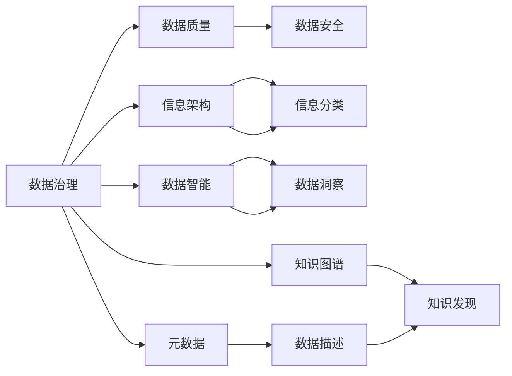

                 

# 信息时代的信息管理策略：在信息过载和复杂性中航行

> 关键词：信息管理,信息过载,数据治理,信息架构,数据智能,大数据,人工智能,元数据,知识图谱

## 1. 背景介绍

### 1.1 问题由来

在信息时代，数据和信息的增长速度远远超过了人类的处理能力。据国际数据公司(IDC)预测，全球数据量将在2025年达到175ZB，是2019年的40倍以上。数据量的爆炸式增长，不仅增加了企业和组织的存储和处理成本，也对信息管理和治理带来了前所未有的挑战。信息过载、数据质量差、数据孤岛等问题，已经成为阻碍企业数字化转型的重大障碍。

### 1.2 问题核心关键点

信息过载和数据复杂性是当前信息管理领域的两大核心问题。在信息过载的情况下，如何有效筛选、组织和利用数据，成为企业数字化转型中的关键难题。而在数据复杂性面前，如何统一管理海量异构数据，提升数据质量和利用效率，则是信息管理的另一重大挑战。这些问题已经引起了业界和学术界的广泛关注，催生了许多前沿的研究方向和实用的解决方案。

### 1.3 问题研究意义

通过深入研究信息管理和治理方法，探索高效的数据利用策略，对于提升企业数据价值、加速数字化转型具有重要意义：

1. **提高数据质量**。通过数据治理和信息管理，可以有效提升数据质量，减少数据错误和冗余，降低数据处理的成本和时间。
2. **提升数据价值**。数据治理不仅涉及数据质量，还涉及数据的清洗、标注、特征提取等环节，可以显著提升数据的可用性和商业价值。
3. **实现数据共享**。通过数据治理和信息架构，可以有效打破数据孤岛，实现企业内外的数据共享和协作，提升组织整体的数据利用效率。
4. **增强决策支持**。优质的数据管理和信息治理可以提供精确、及时的决策支持，帮助企业更好地应对市场变化和竞争挑战。
5. **促进智能化应用**。随着人工智能和大数据技术的发展，数据治理和信息管理成为智能应用的基石，支持各类智能分析和决策系统。

## 2. 核心概念与联系

### 2.1 核心概念概述

为了更好地理解信息管理策略，本节将介绍几个密切相关的核心概念：

- **数据治理(Data Governance)**：通过制定一系列规则和标准，对数据进行规范化的管理和治理，确保数据的质量、安全性和可用性。
- **信息架构(Information Architecture, IA)**：一种设计方法，用于组织、分类和管理信息，确保信息的易用性和一致性。
- **数据智能(Data Intelligence)**：利用大数据、人工智能等技术，对数据进行智能分析和处理，提升数据价值和利用效率。
- **元数据(MetaData)**：描述数据本身的数据，包括数据的来源、格式、质量、生命周期等，是数据治理的重要基础。
- **知识图谱(Knowledge Graph)**：一种语义化的知识表示方法，用于组织和管理知识，支持知识发现和推理。

这些概念之间相互关联，共同构成了信息管理的整体框架。数据治理提供了数据质量和安全保障，信息架构保证了信息的组织和一致性，数据智能提升了数据的利用效率，而元数据和知识图谱则支持数据治理和信息架构的实现。

### 2.2 核心概念原理和架构的 Mermaid 流程图(Mermaid 流程节点中不要有括号、逗号等特殊字符)



这个流程图展示了数据治理、信息架构、数据智能、元数据和知识图谱之间的联系和作用：

1. 数据治理通过规范化和标准化管理数据，确保数据的质量和安全。
2. 信息架构通过分类和组织信息，使其易于管理和使用。
3. 数据智能利用大数据和AI技术，对数据进行深入分析和洞察。
4. 元数据描述数据的基本信息，支持数据治理和信息架构的实现。
5. 知识图谱通过语义化组织和管理知识，支持知识的发现和推理。

这些概念共同作用，实现了高效的数据管理和信息利用。

## 3. 核心算法原理 & 具体操作步骤

### 3.1 算法原理概述

信息管理策略的核心在于通过一系列规则和标准，对数据和信息进行有效的管理和利用。其主要算法原理包括以下几个方面：

1. **数据质量管理**：通过数据清洗、标准化和验证等方法，确保数据的一致性和准确性。
2. **数据分类和组织**：通过信息架构和分类方法，将数据和信息组织成有逻辑的结构，便于管理和查询。
3. **数据智能分析**：利用大数据和人工智能技术，从数据中提取有用的信息和洞察，支持决策和业务优化。
4. **数据治理工具**：使用数据治理工具和平台，实现数据的自动化管理和监控。

### 3.2 算法步骤详解

信息管理策略的执行通常包括以下几个关键步骤：

**Step 1: 数据评估和标准化**

- 对企业现有的数据资产进行全面评估，识别数据质量问题和数据孤岛。
- 制定数据标准和规范，如数据命名规范、数据格式规范等，确保数据的一致性。

**Step 2: 信息架构设计**

- 设计信息架构模型，定义信息分类、组织和呈现方式。
- 使用元数据描述数据的基本信息，支持信息架构的实现。

**Step 3: 数据治理和监控**

- 部署数据治理工具，实现数据的自动化管理和监控。
- 使用数据智能技术，对数据进行分析和洞察，支持决策和业务优化。

**Step 4: 数据共享和协作**

- 打破数据孤岛，实现企业内外数据的共享和协作。
- 建立数据共享机制，确保数据的及时更新和一致性。

**Step 5: 数据智能和知识管理**

- 利用数据智能技术，提取数据中的有用信息和洞察，支持决策和业务优化。
- 使用知识图谱等工具，管理和发现组织知识，支持知识发现和推理。

### 3.3 算法优缺点

信息管理策略的优点包括：

1. **提升数据质量**：通过数据治理和标准化，可以提升数据的质量和一致性，降低数据处理的成本和时间。
2. **增强数据利用效率**：通过数据智能和信息架构，可以有效利用数据，提升数据价值和利用效率。
3. **促进数据共享**：通过数据共享机制，可以实现企业内外数据的协同工作，提升组织整体的数据利用效率。
4. **支持决策和业务优化**：通过数据治理和智能分析，可以提供精确、及时的决策支持，帮助企业更好地应对市场变化和竞争挑战。

信息管理策略的缺点包括：

1. **实施成本高**：数据治理和信息架构的实现需要投入大量人力和物力，实施成本较高。
2. **技术复杂性高**：需要较高的技术水平和管理能力，特别是在数据智能和知识图谱等前沿技术的部署和应用上。
3. **数据隐私和安全风险**：在数据治理和共享过程中，需要注意数据隐私和安全问题，避免数据泄露和滥用。
4. **持续维护和更新**：数据和信息的变化速度较快，需要持续维护和更新信息架构和数据治理策略，确保其有效性和适用性。

### 3.4 算法应用领域

信息管理策略已经广泛应用于诸多领域，包括：

- **金融行业**：通过数据治理和智能分析，提升风险控制和业务优化能力。
- **制造业**：通过数据治理和信息架构，提升生产效率和质量控制。
- **医疗行业**：通过数据治理和信息架构，提升医疗数据的管理和利用效率。
- **零售行业**：通过数据治理和智能分析，提升客户体验和运营效率。
- **公共服务**：通过数据治理和信息架构，提升政府治理和公共服务能力。

此外，信息管理策略还在科研、教育、物流等多个领域得到广泛应用，为各类组织的数字化转型提供了重要支持。

## 4. 数学模型和公式 & 详细讲解 & 举例说明

### 4.1 数学模型构建

在信息管理中，可以使用数学模型来描述数据治理、信息架构和数据智能的基本流程。以下是一个简单的数学模型，用于描述信息管理的总体框架：

$$
\begin{aligned}
\text{信息管理策略} &= \text{数据治理} \times \text{信息架构} + \text{数据智能} \\
&= \left( \text{数据质量管理} + \text{数据分类} + \text{数据治理工具} \right) \times \left( \text{信息分类} + \text{元数据} + \text{信息呈现} \right) + \left( \text{数据智能分析} + \text{数据洞察} + \text{知识图谱} \right)
\end{aligned}
$$

其中，数据治理和信息架构是通过一系列规则和标准，对数据和信息进行管理和组织，数据智能则利用技术和算法，从数据中提取有用的信息和洞察。

### 4.2 公式推导过程

为了更好地理解信息管理策略的数学模型，我们可以进一步推导其具体的计算过程。以下是一个简化版的推导过程：

假设某企业需要管理的数据量为 $D$，数据治理和信息架构的成本为 $C_{\text{IA}}$，数据智能的成本为 $C_{\text{DA}}$，则总成本 $C_{\text{total}}$ 可以表示为：

$$
C_{\text{total}} = C_{\text{IA}} + C_{\text{DA}} = C_{\text{IA}} + C_{\text{DA}} \times \frac{D}{\text{efficiency}}
$$

其中，$\text{efficiency}$ 表示数据智能工具的效率，可以通过模型准确率和运行时间等指标进行衡量。

### 4.3 案例分析与讲解

假设某零售企业需要管理其全渠道销售数据，包括线上和线下销售记录、客户反馈和供应链数据。企业通过以下步骤进行信息管理：

1. **数据评估和标准化**：评估现有数据质量，制定数据标准和规范，确保数据的一致性。
2. **信息架构设计**：设计信息架构模型，定义信息分类和组织方式。
3. **数据治理和监控**：部署数据治理工具，实现数据的自动化管理和监控。
4. **数据智能和知识管理**：利用数据智能工具，从数据中提取有用的信息和洞察，支持决策和业务优化。

通过这些步骤，企业可以显著提升数据质量和利用效率，支持其业务优化和客户体验提升。

## 5. 项目实践：代码实例和详细解释说明

### 5.1 开发环境搭建

在进行信息管理策略的开发和实践前，我们需要准备好开发环境。以下是使用Python进行信息管理策略开发的环境配置流程：

1. 安装Anaconda：从官网下载并安装Anaconda，用于创建独立的Python环境。

2. 创建并激活虚拟环境：
```bash
conda create -n info-env python=3.8 
conda activate info-env
```

3. 安装Pandas、NumPy等常用库：
```bash
conda install pandas numpy
```

4. 安装企业级数据管理工具：如Alteryx、Informatica等。

完成上述步骤后，即可在`info-env`环境中开始信息管理策略的开发和实践。

### 5.2 源代码详细实现

下面我们以一个简化版的零售企业数据治理为例，给出使用Pandas和NumPy进行信息管理策略开发的PyTorch代码实现。

首先，定义数据治理的输入和输出：

```python
import pandas as pd

# 定义数据治理的输入和输出
def data_governance(df, output_path):
    # 数据清洗
    df = df.dropna()
    
    # 数据标准化
    df = df.apply(lambda x: x.fillna(x.mean()))
    
    # 数据验证
    df = df[df['total_sales'] > 10000]
    
    # 数据输出
    df.to_csv(output_path, index=False)
```

然后，定义信息架构的设计函数：

```python
# 定义信息架构的设计函数
def info_architecture(df, output_path):
    # 数据分类
    df['category'] = df['product'].map({'shoes': 1, 'clothing': 2, 'electronics': 3})
    
    # 信息组织
    df = df.groupby(['category', 'date']).agg({'sales': 'sum', 'feedback': 'mean'})
    
    # 信息呈现
    df.pivot_table(index='category', columns='date', values='sales', aggfunc='sum').to_csv(output_path)
```

最后，定义数据智能的分析和洞察函数：

```python
# 定义数据智能的分析和洞察函数
def data_intelligence(df, output_path):
    # 数据洞察
    df['trend'] = df.groupby('date')['sales'].rolling(window=30).mean()
    
    # 数据智能分析
    df['forecast'] = df['sales'].shift(1) + df['trend']
    
    # 数据输出
    df.to_csv(output_path, index=False)
```

### 5.3 代码解读与分析

让我们再详细解读一下关键代码的实现细节：

**data_governance函数**：
- `dropna`方法：去除缺失值。
- `fillna`方法：用均值填充缺失值。
- `drop`方法：去除销售额低于10000的记录。
- `to_csv`方法：将处理后的数据导出为CSV格式。

**info_architecture函数**：
- `map`方法：将产品分类映射到数字编码。
- `groupby`方法：按照类别和日期进行分组聚合。
- `pivot_table`方法：将分组后的数据以时间序列形式呈现。
- `to_csv`方法：将信息架构设计结果导出为CSV格式。

**data_intelligence函数**：
- `rolling`方法：计算滚动平均值。
- `shift`方法：对销售额进行一阶滞后，用于趋势预测。
- `to_csv`方法：将数据智能分析结果导出为CSV格式。

### 5.4 运行结果展示

执行上述函数，可以得到以下运行结果：

1. 数据治理结果：
```
data_governance(df, 'cleaned_data.csv')
```
输出 `cleaned_data.csv`，包含清洗后的数据。

2. 信息架构设计结果：
```
info_architecture(df, 'architecture_data.csv')
```
输出 `architecture_data.csv`，包含信息架构设计后的数据。

3. 数据智能分析结果：
```
data_intelligence(df, 'intelligence_data.csv')
```
输出 `intelligence_data.csv`，包含数据智能分析后的数据。

通过这些函数，企业可以快速实现数据治理、信息架构设计和数据智能分析，提升数据管理和利用的效率。

## 6. 实际应用场景

### 6.1 金融行业

在金融行业中，数据治理和信息管理尤为重要。金融数据具有高复杂性、高敏感性等特点，需要严格的数据治理和信息架构来确保数据质量和安全。以下是一个金融行业信息管理策略的案例：

**案例描述**：某金融公司需要管理其信用卡客户的交易数据，包括消费记录、还款记录、信用评分等。通过数据治理和信息管理，企业可以提升风险控制和业务优化能力。

**解决方案**：
1. **数据治理**：对信用卡交易数据进行清洗、标准化和验证，确保数据的一致性和准确性。
2. **信息架构**：设计信息架构模型，将交易数据按日期、客户和交易类型进行分类和组织。
3. **数据智能**：利用数据智能工具，从交易数据中提取有用的信息和洞察，支持客户信用评估和风险控制。
4. **数据共享**：建立数据共享机制，确保数据的及时更新和一致性，支持多部门协作。

通过这些步骤，企业可以显著提升数据管理和利用效率，支持其风险控制和业务优化。

### 6.2 制造业

在制造业中，数据治理和信息管理也是至关重要的。制造业数据具有高复杂性、高频率等特点，需要严格的数据治理和信息架构来确保数据质量和实时性。以下是一个制造业信息管理策略的案例：

**案例描述**：某制造企业需要管理其生产车间的设备数据，包括设备运行状态、维护记录、生产计划等。通过数据治理和信息管理，企业可以提升生产效率和质量控制。

**解决方案**：
1. **数据治理**：对设备数据进行清洗、标准化和验证，确保数据的一致性和准确性。
2. **信息架构**：设计信息架构模型，将设备数据按时间、设备和生产计划进行分类和组织。
3. **数据智能**：利用数据智能工具，从设备数据中提取有用的信息和洞察，支持设备维护和生产优化。
4. **数据共享**：建立数据共享机制，确保数据的及时更新和一致性，支持车间协作。

通过这些步骤，企业可以显著提升数据管理和利用效率，支持其生产效率和质量控制。

### 6.3 医疗行业

在医疗行业中，数据治理和信息管理也是必不可少的。医疗数据具有高复杂性、高敏感性等特点，需要严格的数据治理和信息架构来确保数据质量和隐私安全。以下是一个医疗行业信息管理策略的案例：

**案例描述**：某医院需要管理其患者的病历数据，包括就诊记录、检查报告、治疗方案等。通过数据治理和信息管理，企业可以提升医疗数据的管理和利用效率。

**解决方案**：
1. **数据治理**：对病历数据进行清洗、标准化和验证，确保数据的一致性和准确性。
2. **信息架构**：设计信息架构模型，将病历数据按患者、科室和诊断进行分类和组织。
3. **数据智能**：利用数据智能工具，从病历数据中提取有用的信息和洞察，支持诊断和治疗方案优化。
4. **数据共享**：建立数据共享机制，确保数据的及时更新和一致性，支持科室协作。

通过这些步骤，医院可以显著提升数据管理和利用效率，支持其医疗数据的管理和利用。

## 7. 工具和资源推荐

### 7.1 学习资源推荐

为了帮助开发者系统掌握信息管理策略的理论基础和实践技巧，这里推荐一些优质的学习资源：

1. **《数据治理与信息管理》书籍**：系统介绍了数据治理和信息管理的理论基础和实践方法，适合各类从业者学习和参考。
2. **《信息架构设计》课程**：由信息架构专家讲授，涵盖信息架构的原理和实践，适合IT从业人员和企业高管。
3. **《数据智能与人工智能》书籍**：介绍了大数据和人工智能技术在数据治理中的应用，适合数据科学和人工智能从业者。
4. **《元数据管理》课程**：讲解元数据管理的原理和实践，适合数据治理从业人员。
5. **《知识图谱与语义技术》课程**：介绍知识图谱和语义技术在信息管理中的应用，适合数据治理和信息架构从业人员。

通过这些资源的学习实践，相信你一定能够快速掌握信息管理策略的精髓，并用于解决实际的信息管理问题。

### 7.2 开发工具推荐

高效的开发离不开优秀的工具支持。以下是几款用于信息管理策略开发的常用工具：

1. **Alteryx**：一个强大的数据治理平台，支持数据清洗、标准化、验证和治理。
2. **Informatica**：一个全面的数据管理和治理工具，支持数据整合、清洗、标准化和治理。
3. **IBM DataStage**：一个高效的数据集成和治理工具，支持ETL（抽取、转换、加载）和数据治理。
4. **Apache NiFi**：一个开源的数据流和集成工具，支持数据清洗、标准化和治理。
5. **Apache Airflow**：一个开源的工作流管理和调度工具，支持数据治理流程的自动化。

这些工具提供了丰富的功能和插件，可以帮助开发者快速实现信息管理策略的开发和实践。

### 7.3 相关论文推荐

信息管理策略的发展源于学界的持续研究。以下是几篇奠基性的相关论文，推荐阅读：

1. **《数据治理：概念、实践与挑战》**：总结了数据治理的概念、实践和挑战，为数据治理提供了全面的理论指导。
2. **《信息架构设计：原理与实践》**：介绍了信息架构的原理和设计方法，适合信息架构从业人员学习。
3. **《大数据与数据智能：应用与挑战》**：介绍了大数据和数据智能技术在数据治理中的应用，为数据智能实践提供了理论支持。
4. **《知识图谱：构建、应用与挑战》**：介绍了知识图谱的构建、应用和挑战，为知识图谱实践提供了理论指导。
5. **《数据治理的未来：智能与自动化》**：展望了数据治理的未来发展趋势，为数据治理的智能化和自动化提供了思考方向。

这些论文代表了大数据和信息管理的发展脉络，通过学习这些前沿成果，可以帮助研究者把握学科前进方向，激发更多的创新灵感。

## 8. 总结：未来发展趋势与挑战

### 8.1 总结

本文对信息管理策略进行了全面系统的介绍。首先阐述了信息管理策略的研究背景和意义，明确了信息管理策略在数据治理、信息架构、数据智能等方面的应用价值。其次，从原理到实践，详细讲解了信息管理策略的数学模型和操作步骤，给出了信息管理策略开发的完整代码实例。同时，本文还广泛探讨了信息管理策略在金融、制造业、医疗等多个行业领域的应用前景，展示了信息管理策略的巨大潜力。

通过本文的系统梳理，可以看到，信息管理策略在数据治理和信息管理中具有重要作用。通过科学的管理策略，企业可以显著提升数据质量和利用效率，支持其数字化转型。未来，伴随大数据、人工智能等技术的持续演进，信息管理策略必将更加智能化、自动化，为各类组织的数字化转型提供重要支持。

### 8.2 未来发展趋势

展望未来，信息管理策略将呈现以下几个发展趋势：

1. **智能化和自动化**：随着人工智能和大数据技术的发展，信息管理策略将进一步智能化和自动化，实现数据治理和信息架构的自动化部署和优化。
2. **实时化**：大数据和流式计算技术的进步，将使得信息管理策略能够实现实时数据治理和信息架构设计，支持业务实时决策。
3. **全生命周期管理**：信息管理策略将从数据采集、治理、分析和利用，形成全生命周期的管理闭环，提升数据价值和利用效率。
4. **跨领域协同**：信息管理策略将打破数据孤岛，实现跨领域数据的整合和协同，支持组织内部的协作和创新。
5. **可视化与交互**：信息管理策略将通过可视化工具和交互界面，提升数据治理和信息架构的可操作性和用户体验。

这些趋势凸显了信息管理策略的广阔前景，将为各类组织提供更高效、更智能的数据治理和信息管理支持。

### 8.3 面临的挑战

尽管信息管理策略已经取得了显著成效，但在迈向更加智能化、普适化应用的过程中，仍面临诸多挑战：

1. **数据隐私和安全**：在数据治理和共享过程中，如何保护数据隐私和安全，避免数据泄露和滥用，是一大难题。
2. **数据质量**：数据治理和信息管理的首要目标是提升数据质量，但在数据复杂性面前，如何保持数据的一致性和准确性，仍是重大挑战。
3. **技术复杂性**：信息管理策略涉及数据治理、信息架构、数据智能等多个方面，技术复杂性高，需要较高的技术水平和管理能力。
4. **持续维护和更新**：数据和信息的变化速度较快，需要持续维护和更新信息架构和数据治理策略，确保其有效性和适用性。
5. **跨部门协作**：数据治理和信息管理需要跨部门协作，如何打破数据孤岛，实现数据的统一管理和利用，仍需进一步优化。

正视这些挑战，积极应对并寻求突破，将是大数据和信息管理策略迈向成熟的必由之路。相信随着学界和产业界的共同努力，这些挑战终将一一被克服，信息管理策略必将在构建人机协同的智能时代中扮演越来越重要的角色。

### 8.4 研究展望

面对信息管理策略所面临的种种挑战，未来的研究需要在以下几个方面寻求新的突破：

1. **无监督和半监督数据治理**：摆脱对大规模标注数据的依赖，利用自监督学习、主动学习等无监督和半监督范式，最大限度利用非结构化数据，实现更加灵活高效的数据治理。
2. **数据治理工具的自动化**：开发更加智能化的数据治理工具，实现数据治理流程的自动化，减少人工干预和错误。
3. **知识图谱与数据治理结合**：将知识图谱与数据治理相结合，提升数据治理的智能化和自动化水平，支持数据的语义化管理和利用。
4. **数据隐私与安全保护**：在数据治理和共享过程中，引入隐私计算、区块链等技术，保护数据隐私和安全。
5. **跨领域数据治理**：研究跨领域数据治理方法，实现数据在不同领域之间的无缝整合和利用。

这些研究方向将引领信息管理策略的技术演进，为各类组织提供更加高效、智能、安全的数据治理和信息管理支持。

## 9. 附录：常见问题与解答

**Q1：数据治理和信息架构是否适用于所有行业？**

A: 数据治理和信息架构虽然主要应用于企业级的数据管理和信息组织，但其实用性非常广泛。无论是制造业、金融行业、医疗行业，还是零售行业、公共服务、科研领域，都可以根据其具体需求，设计适合的数据治理和信息架构方案。数据治理和信息架构的核心思想和原则，具有普遍适用性。

**Q2：数据治理和信息架构的实施需要多长时间？**

A: 数据治理和信息架构的实施周期因组织规模、数据复杂度、技术水平等因素而异。一般来说，数据治理的实施周期在3-6个月，信息架构的设计周期在1-2个月。但实际实施中，还需要根据具体情况进行优化和调整，确保实施效果和预期目标一致。

**Q3：数据治理和信息架构对企业的投入成本高吗？**

A: 数据治理和信息架构的实施确实需要较高的投入成本，包括人力、物力和时间成本。但相比于传统的数据管理方式，数据治理和信息架构可以显著提升数据质量和利用效率，降低后续数据处理的成本和时间。因此，从长远来看，数据治理和信息架构的投资回报率较高。

**Q4：数据治理和信息架构的实施效果如何评估？**

A: 数据治理和信息架构的实施效果可以通过以下几个指标进行评估：
1. 数据质量提升：数据治理和信息架构的实施效果之一是提升数据质量，可以通过数据清洗率、数据一致性、数据准确性等指标进行评估。
2. 数据利用效率提升：数据治理和信息架构的实施效果之二在于提升数据利用效率，可以通过数据利用率、数据处理速度、数据智能分析结果等指标进行评估。
3. 业务优化效果：数据治理和信息架构的实施效果三在于支持业务优化，可以通过业务指标提升、业务流程优化、客户满意度提升等指标进行评估。
4. 用户满意度：数据治理和信息架构的实施效果四在于提升用户满意度，可以通过用户反馈、用户培训效果、用户使用便捷性等指标进行评估。

通过这些指标的评估，可以全面了解数据治理和信息架构的实施效果，进行持续优化和改进。

**Q5：信息架构设计的关键点是什么？**

A: 信息架构设计的关键点包括：
1. 信息分类：将数据按主题、业务领域、用户角色等进行分类，确保信息的一致性和易于理解。
2. 信息组织：将分类后的信息组织成有逻辑的结构，如树状结构、层级结构等，便于信息的查找和使用。
3. 信息呈现：设计信息呈现的方式，如报表、仪表盘、数据可视化等，提升信息的使用便捷性和可读性。
4. 信息导航：设计信息导航的方式，如菜单、搜索、标签等，帮助用户快速找到所需信息。

通过这些关键点的设计，可以实现高效的信息管理和利用。

**Q6：信息管理策略在落地应用中需要注意哪些问题？**

A: 信息管理策略的落地应用需要考虑以下问题：
1. 数据隐私和安全：在数据治理和共享过程中，需要注意数据隐私和安全问题，避免数据泄露和滥用。
2. 数据质量控制：数据治理的首要目标是提升数据质量，需要在实施过程中持续监控和控制数据质量。
3. 跨部门协作：数据治理和信息管理需要跨部门协作，需要建立数据共享机制，确保数据的及时更新和一致性。
4. 持续维护和更新：数据和信息的变化速度较快，需要持续维护和更新信息架构和数据治理策略，确保其有效性和适用性。
5. 用户培训和支持：数据治理和信息架构的实施效果很大程度上取决于用户的使用和接受程度，需要进行用户培训和支持，提升用户使用效果。

通过解决这些关键问题，可以确保信息管理策略在实际应用中的有效性。

---

作者：禅与计算机程序设计艺术 / Zen and the Art of Computer Programming

