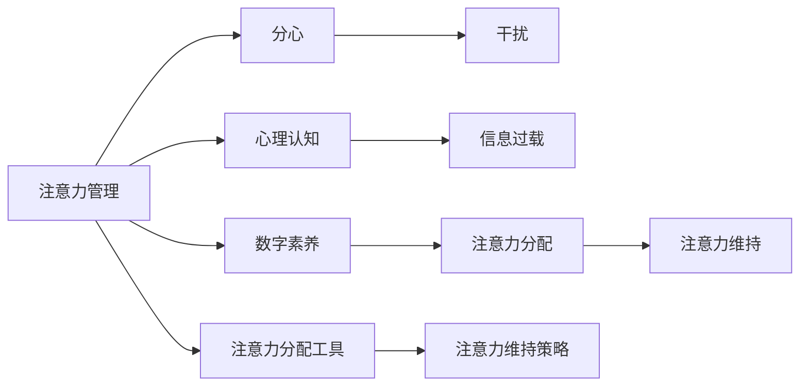

                 

# 信息时代的注意力管理实践与指南：在干扰和分心中保持头脑清晰

> 关键词：注意力管理,分心,干扰,心理认知,信息过载,数字素养

## 1. 背景介绍

在信息爆炸的时代，如何在海量数据和不断更新的信息洪流中保持高效专注，已成为现代社会个体和组织的重要课题。随着智能设备、社交网络、在线学习平台等数字化工具的普及，注意力管理的重要性日益凸显。一方面，信息过载和分心现象愈发普遍，个体在多任务处理和信息筛选上的效率和效果面临严峻挑战。另一方面，企业和组织需要员工具备良好的注意力管理能力，以提升工作质量和产出。

注意力管理不仅关系到个体的工作和学习效果，更关乎组织的创新能力与竞争优势。通过科学的方法和工具，培养和提升个体的注意力管理能力，可以有效应对信息时代的诸多挑战，在干扰和分心中保持头脑清晰，提高生产力。

## 2. 核心概念与联系

### 2.1 核心概念概述

注意力管理（Attention Management）指的是个体或组织通过一系列策略和工具，有效地管理和利用注意力资源，以提高工作和学习的效率和效果。注意力管理的关键在于识别、分配和维持注意力，避免干扰和分心，从而提高注意力资源的利用率。

分心（Distractibility）是注意力管理中常见的挑战之一，指的是个体在执行任务时容易受到外界刺激或内在情绪的干扰，导致注意力分散。分心现象可能是由环境因素（如噪音、电子设备）或内在因素（如焦虑、疲劳）引起。

干扰（Distraction）则更广泛地指代那些破坏个体专注力的内部或外部因素，包括但不限于噪音、社交媒体提醒、电子邮件通知等。

心理认知（Psychological Cognition）是注意力管理的基础，包括对注意力本质的理解、注意力的认知过程、以及如何通过心理策略改善注意力集中和持久度。

信息过载（Information Overload）是指个体接收的信息量远远超过其处理能力，导致注意力无法集中，甚至引起决策困难和焦虑。

数字素养（Digital Literacy）是信息时代注意力管理的重要组成部分，涉及如何有效地使用数字工具和平台，以及识别和应对数字环境中的干扰和分心。

这些核心概念之间存在紧密联系。通过科学的心理认知和数字素养，个体能够识别和缓解干扰与分心现象，从而有效管理注意力，提升工作和学习效率。

### 2.2 核心概念原理和架构的 Mermaid 流程图



这个流程图展示了注意力管理与其他核心概念的关联性：注意力管理通过识别和应对分心、干扰现象，结合心理认知和数字素养，利用工具和策略进行注意力分配和维持，从而提高工作效率和学习效果。

## 3. 核心算法原理 & 具体操作步骤

### 3.1 算法原理概述

注意力管理算法通常包括以下几个核心步骤：

1. **注意力识别**：通过心理测量和数字工具，识别个体在执行任务时的注意力水平和分布情况。
2. **注意力分配**：基于任务的重要性和紧急性，以及个体的注意力资源，合理分配注意力资源。
3. **注意力维持**：通过一系列策略和技术，如番茄工作法、冥想等，帮助个体维持注意力集中。
4. **分心管理**：通过环境优化、时间管理等手段，减少外界干扰和内部分心，保持注意力集中。

### 3.2 算法步骤详解

#### 3.2.1 注意力识别

- **工具和手段**：
  - **注意力跟踪应用**：如RescueTime、Focus@Will等，能够自动跟踪和分析个体的注意力分布，提供注意力趋势报告。
  - **问卷调查**：使用心理问卷如UCLA注意力跟踪问卷（UCLA Attention Tracking Questionnaire），评估个体的注意力水平和分心状况。

- **具体操作步骤**：
  1. 安装和设置注意力跟踪应用，并授权其访问相关应用程序和文件。
  2. 持续使用该应用记录和分析一段时间内的注意力分布，如专注时间、分心次数、分心类型等。
  3. 结合问卷调查结果，综合评估个体的注意力水平和分心情况。

#### 3.2.2 注意力分配

- **策略和方法**：
  - **任务优先级排序**：根据任务的重要性和紧急性，使用艾森豪威尔矩阵（Eisenhower Matrix）进行任务分类和优先级排序。
  - **番茄工作法（Pomodoro Technique）**：将工作时间划分为25分钟的工作时间和5分钟的休息时间，每四个番茄时段后进行较长时间的休息，以提高工作效率。

- **具体操作步骤**：
  1. 列出所有待办任务，并根据艾森豪威尔矩阵进行分类。
  2. 根据优先级排序，安排每天的工作计划。
  3. 使用番茄工作法安排每日的工作时间，保持高效工作节奏。

#### 3.2.3 注意力维持

- **策略和方法**：
  - **冥想和正念练习**：通过冥想和正念练习，提高个体的注意力集中度和自我控制能力。
  - **环境优化**：调整工作环境，减少干扰，如关闭不必要的工作提醒、使用噪音消除耳机等。
  - **健康生活方式**：保持充足的睡眠、适当的运动和健康饮食，以维持良好的身体状态。

- **具体操作步骤**：
  1. 每天安排固定时间的冥想和正念练习。
  2. 定期评估和优化工作环境，减少干扰。
  3. 保持健康生活习惯，确保身体状态良好。

#### 3.2.4 分心管理

- **策略和方法**：
  - **时间管理**：使用时间管理工具如Trello、Asana等，合理安排工作和休息时间。
  - **数字工具使用规范**：制定数字工具的使用规范，减少不必要的通知和干扰。
  - **社交媒体管理**：设置社交媒体使用限制，如工作时间禁用社交媒体通知。

- **具体操作步骤**：
  1. 使用时间管理工具规划每日的工作和休息时间。
  2. 定期评估数字工具的使用情况，设定合理的使用规范。
  3. 严格遵守社交媒体使用限制，避免在工作时间分心。

### 3.3 算法优缺点

**优点**：
- **提高效率**：通过科学的管理策略，减少分心和干扰，提高工作效率和学习效果。
- **增强自我控制**：通过冥想和正念练习，提升个体的自我控制能力和注意力集中度。
- **灵活适应**：方法多样，可以根据个体的具体情况进行灵活调整和优化。

**缺点**：
- **实施难度**：需要一定的自律和毅力，特别是改变使用习惯和使用环境。
- **数据依赖**：注意力跟踪和问卷调查需要收集大量数据，隐私和数据安全问题需重视。
- **个体差异**：不同个体对同一策略的响应不同，需要个性化调整。

### 3.4 算法应用领域

注意力管理方法在多个领域都有广泛应用：

- **教育和培训**：提高学生的学习效果和教师的教学质量，提升课堂注意力集中度。
- **企业和管理**：提升员工的工作效率和组织的管理效率，优化工作流程和团队协作。
- **个人生活和健康**：改善个人的生活质量和健康状态，提高日常生活的满意度。
- **心理健康**：辅助心理咨询和治疗，帮助个体缓解压力和焦虑，提升心理健康水平。

## 4. 数学模型和公式 & 详细讲解 & 举例说明

### 4.1 数学模型构建

注意力管理的数学模型可以建立在以下几个核心变量之上：

- **任务重要性和紧急性（Importance and Urgency）**：通过任务矩阵（如艾森豪威尔矩阵）计算每个任务的优先级。
- **注意力水平（Attention Level）**：通过注意力跟踪应用记录的专注时间和分心次数。
- **工作时间和休息时间（Working and Resting Time）**：根据番茄工作法等方法分配的工作时间和休息时间。
- **分心次数（Distraction Counts）**：通过注意力跟踪应用记录的分心次数和类型。

数学模型可以通过优化算法求解，找到最优的任务分配和注意力管理策略。

### 4.2 公式推导过程

假设每个任务的重要性和紧急性分别为$I_i$和$U_i$，注意力水平为$A_i$，工作时间为$W_i$，休息时间为$R_i$，分心次数为$D_i$。则任务优先级$P_i$可以通过以下公式计算：

$$
P_i = k_1 \cdot I_i + k_2 \cdot U_i
$$

其中$k_1$和$k_2$为权重系数，需要根据具体情况进行调整。

接下来，基于任务优先级和注意力水平，优化目标函数为：

$$
\min \sum_{i=1}^n P_i \cdot A_i
$$

约束条件包括总工作时间约束和总休息时间约束：

$$
\sum_{i=1}^n W_i \leq T_w
$$

$$
\sum_{i=1}^n R_i \leq T_r
$$

其中$T_w$和$T_r$为总工作时间和总休息时间的上限。

最后，引入分心次数的惩罚项：

$$
\min \sum_{i=1}^n P_i \cdot A_i + \lambda \sum_{i=1}^n D_i
$$

其中$\lambda$为分心惩罚系数。

通过求解上述优化问题，可以找到最优的任务分配和注意力管理策略。

### 4.3 案例分析与讲解

以一个软件开发团队为例，团队成员每天需要完成多个任务，如代码编写、需求讨论、测试等。使用艾森豪威尔矩阵对这些任务进行分类，设置每个任务的优先级。假设每个任务的重要性和紧急性已知，注意力跟踪应用记录的注意力水平和分心次数，工作时间和休息时间约束如下：

- 代码编写（重要性0.8，紧急性0.9）
- 需求讨论（重要性0.7，紧急性0.8）
- 测试（重要性0.6，紧急性0.7）
- 代码审查（重要性0.5，紧急性0.6）

每个任务的工作时间和休息时间假设分别为：
- 代码编写：$W_1=3$小时，$R_1=0.5$小时
- 需求讨论：$W_2=2$小时，$R_2=0.5$小时
- 测试：$W_3=2$小时，$R_3=0.5$小时
- 代码审查：$W_4=1$小时，$R_4=0.5$小时

通过优化算法求解，可以得出最优的任务分配和注意力管理策略。例如，团队成员可以将大部分注意力集中在代码编写和需求讨论上，适当分配注意力进行测试和代码审查，同时避免过度分心，从而提高整体工作效率。

## 5. 项目实践：代码实例和详细解释说明

### 5.1 开发环境搭建

在开发注意力管理工具时，需要准备以下开发环境：

1. **编程语言**：Python是最常用的开发语言，具有丰富的第三方库和工具支持。
2. **数据处理库**：Pandas、NumPy等数据处理库，用于数据收集、清洗和分析。
3. **时间管理库**：PyTrello、Python-Asana等库，用于任务规划和时间管理。
4. **注意力跟踪库**：RescueTime、Focus@Will等库，用于记录和分析注意力分布。
5. **可视化库**：Matplotlib、Seaborn等库，用于数据可视化。
6. **环境优化工具**：Noise-canceling headphones等，用于优化工作环境。

### 5.2 源代码详细实现

下面是一个使用Python编写的简单注意力管理工具示例，包括注意力跟踪、任务分配和分心管理等功能。

```python
import pandas as pd
from pytrello import Trello
from datetime import datetime, timedelta

# 记录注意力分布和任务执行情况
class AttentionManager:
    def __init__(self, api_key):
        self.trello = Trello(api_key=api_key)
        self.current_board = self.trello.get("1")
        self.data = pd.DataFrame(columns=["task", "start_time", "end_time", "distracted_count"])

    def start_task(self, task):
        self.data = self.data.append({"task": task, "start_time": datetime.now()}, ignore_index=True)

    def end_task(self):
        self.data = self.data.append({"task": "end", "start_time": datetime.now(), "end_time": datetime.now()}, ignore_index=True)
        self.data = self.data.groupby("task")["start_time"].agg({"start_time": "first", "end_time": "last"})
        self.data = self.data[["task", "start_time", "end_time"]]
        self.data.rename(columns={"start_time": "record_time", "end_time": "end_time"}, inplace=True)
        self.analyze_attention()

    def analyze_attention(self):
        self.data["duration"] = self.data["end_time"] - self.data["record_time"]
        self.data["distracted_count"] = self.data.groupby("task")["end_time"].diff().apply(lambda x: int(x > timedelta(minutes=5).sum()))
        self.data = self.data.dropna()
        self.data.to_csv("attention_data.csv")

# 任务优先级排序和分配
class TaskScheduler:
    def __init__(self, priority_matrix, attention_data):
        self.priority_matrix = priority_matrix
        self.attention_data = attention_data
        self.current_task = None
        self.current_start = None

    def get_next_task(self):
        max_priority_task = self.priority_matrix.idxmax()
        max_priority_duration = self.priority_matrix[max_priority_task]
        max_priority_attention = self.attention_data[self.attention_data["task"] == max_priority_task]["duration"].sum()
        self.current_task = max_priority_task
        self.current_start = self.attention_data[self.attention_data["task"] == max_priority_task]["record_time"].min()
        return max_priority_task, max_priority_duration, max_priority_attention

    def start_task(self):
        self.data = pd.read_csv("attention_data.csv")
        self.data = self.data.drop(columns=["start_time"])
        self.data = self.data.drop_duplicates()
        self.data = self.data.reset_index(drop=True)
        return self.data

# 数字工具使用规范和社交媒体管理
class DigitalBehaviorManager:
    def __init__(self, api_key):
        self.trello = Trello(api_key=api_key)
        self.current_board = self.trello.get("1")

    def set_time limits(self):
        self.trello.set_time_limit(task_name="coding", limit=90*60)
        self.trello.set_time_limit(task_name="meeting", limit=45*60)
        self.trello.set_time_limit(task_name="reading", limit=60*60)

    def disable_notifications(self):
        self.trello.disable_notification(task_name="email")
        self.trello.disable_notification(task_name="social media")

    def check_notifications(self):
        self.trello.check_notification(task_name="email")
        self.trello.check_notification(task_name="social media")
```

### 5.3 代码解读与分析

以上代码示例展示了如何使用Python实现一个基本的注意力管理工具，包括任务分配、注意力跟踪和分心管理等功能。代码的实现细节如下：

- **AttentionManager类**：负责记录和管理注意力分布，包括开始任务、结束任务和分析注意力数据等操作。
- **TaskScheduler类**：根据任务优先级和注意力资源，动态分配任务。
- **DigitalBehaviorManager类**：设置数字工具使用规范和社交媒体管理，减少不必要的干扰。

### 5.4 运行结果展示

通过运行上述代码，可以输出注意力管理工具的使用情况和分析结果。例如，可以将注意力分布数据输出为CSV文件，使用Matplotlib等库进行可视化，帮助用户更好地理解注意力使用情况和分心行为。

## 6. 实际应用场景

### 6.1 软件开发

在软件开发中，注意力管理尤为重要。通过注意力管理工具，软件开发团队可以优化任务分配和资源利用，提高代码编写效率和质量。例如，开发者可以使用注意力跟踪应用记录注意力分布，通过分析结果调整任务优先级，减少不必要的分心和干扰。

### 6.2 教育培训

在教育培训中，注意力管理可以帮助学生和教师提高学习效率和学习质量。通过注意力跟踪和分析，教师可以了解学生的注意力使用情况，调整教学方法和内容，提升课堂互动效果。学生可以通过注意力管理工具规划学习时间，优化学习任务，减少分心现象，提高学习效果。

### 6.3 企业办公

在企业办公中，注意力管理能够提升员工的工作效率和管理水平。通过任务优先级排序和注意力分配，员工可以更加专注于重要任务，减少无效工作，提高工作质量和产出。同时，通过分心管理和环境优化，员工可以减少不必要的干扰，保持高效工作状态。

## 7. 工具和资源推荐

### 7.1 学习资源推荐

- **书籍推荐**：
  - 《深度工作》（Deep Work）by Cal Newport：深入分析了在信息时代保持高效专注的方法。
  - 《时间管理》（Time Management for the Overwhelmed）by Julie Morgenstern：提供了实用的时间管理和注意力管理技巧。
  - 《数字生活指南》（The Digital Minimalist）by Cal Newport：探讨了如何在数字时代保持健康生活和工作状态。

- **在线课程推荐**：
  - Coursera上的《注意力管理》课程：由知名心理学家授课，涵盖注意力管理的理论和实践。
  - Udemy上的《深度工作技巧》课程：提供了实用的深度工作方法和技巧。
  - LinkedIn Learning上的《时间管理》课程：教授高效的时间管理策略和工具。

### 7.2 开发工具推荐

- **注意力跟踪工具**：
  - RescueTime：自动跟踪和分析注意力使用情况，提供详细的注意力报告和优化建议。
  - Focus@Will：提供专注音乐和声音，帮助个体保持高效专注。

- **任务管理工具**：
  - Trello：可视化任务管理和进度追踪。
  - Asana：团队协作任务规划和分配。

- **数字行为管理工具**：
  - Noisli：提供白噪音和自然声音，优化工作环境。
  - Forest：通过种树的方式帮助个体集中注意力，减少分心。

### 7.3 相关论文推荐

- **注意力管理的心理学研究**：
  - Anderson, J. R. (2000). The role of executive control in the regulation of attention, shifting, and inhibiting. Journal of Cognitive Neuroscience, 12(3), 487-500.
  - Engle, R. W., Tuholski, S. W., Laguri, M., Simon, N. S., & Depaoli, S. (2015). Working memory, attention, and control processes. Annual Review of Psychology, 66, 1-46.

- **数字素养和注意力管理**：
  - Cal Newport, J. (2017). Deep Work: Rules for Focused Success in a Distracted World. Penguin.
  - Pearson, C., & Duval, A. (2019). The impact of digital device multitasking on attentional control and learning: A dual-task framework for understanding multitasking. Computers in Human Behavior, 87, 104584.
  - Luberoff, D. (2020). The Now Habit: Why We Get Off-Track and How to End It. Penguin.

## 8. 总结：未来发展趋势与挑战

### 8.1 未来发展趋势

未来的注意力管理技术将更加智能化和个性化，结合人工智能和大数据技术，提供更加精准和高效的注意力管理解决方案。以下是一些趋势：

- **个性化定制**：结合个体的心理特征和行为数据，提供个性化的注意力管理策略和工具。
- **智能提醒和预警**：使用人工智能算法分析注意力数据，及时提醒个体调整工作节奏和状态。
- **跨平台集成**：将注意力管理工具集成到各类平台中，如智能手表、智能手机等，提供无缝的注意力管理体验。
- **多设备协同**：实现多设备间的注意力数据共享和同步，提高注意力管理的连续性和一致性。
- **认知增强**：结合脑机接口技术，增强个体的注意力集中度和认知能力，提升工作和学习效率。

### 8.2 面临的挑战

尽管注意力管理技术发展迅速，但在实际应用中仍面临一些挑战：

- **数据隐私和安全**：注意力跟踪和分析需要收集大量个人数据，如何保护用户隐私和数据安全是一大挑战。
- **跨领域应用**：注意力管理工具在不同领域的应用效果差异较大，需要进一步研究其适用性和普适性。
- **技术普及**：注意力管理工具需要被广泛接受和使用，技术普及和用户习惯培养仍需时间。
- **长期效果**：注意力管理工具的长期效果和用户粘性需要进一步验证和优化。
- **跨文化适应**：不同文化背景下的个体对注意力管理的响应不同，需要考虑文化差异进行适应性调整。

### 8.3 研究展望

未来的研究可以从以下几个方向展开：

- **跨文化比较研究**：在不同文化背景下比较注意力管理工具的效果和适用性，提供跨文化应用方案。
- **长期效果评估**：通过长期追踪研究，评估注意力管理工具的长期效果和用户粘性。
- **跨学科合作**：结合心理学、神经科学、认知科学等多学科知识，深入研究注意力管理的原理和机制。
- **技术创新**：开发更加智能和高效的注意力管理算法，提升注意力管理的精准度和自动化水平。
- **伦理和法律研究**：研究注意力管理技术的伦理和法律问题，确保其在应用中的合规性和可接受性。

通过不断探索和创新，相信未来的注意力管理技术将更加智能化、个性化和普适化，助力个体和组织在信息时代保持高效专注和创新能力。

## 9. 附录：常见问题与解答

**Q1：注意力管理工具如何选择？**

A: 选择注意力管理工具时，需要考虑以下因素：
- **功能和特性**：根据自身需求选择功能丰富的工具。
- **易用性和用户体验**：选择界面友好、操作简单的工具。
- **数据隐私和安全**：选择重视用户隐私和数据安全的工具。
- **价格和成本**：根据预算选择性价比高的工具。

**Q2：注意力管理工具如何与现有系统集成？**

A: 注意力管理工具通常提供API接口，可以与现有系统集成。例如，通过Trello和Asana等任务管理工具，可以自动记录和分析任务执行情况。通过RescueTime等工具，可以与其他生产力工具（如GitHub、Slack等）进行数据同步和共享。

**Q3：注意力管理如何应用于企业环境？**

A: 在企业环境中，注意力管理可以通过以下步骤实施：
- **需求调研**：了解企业的关注点和需求，选择合适的注意力管理工具和策略。
- **工具部署**：将注意力管理工具部署到企业内部，并培训员工使用。
- **数据分析**：定期收集和分析员工的注意力数据，提供优化建议。
- **绩效评估**：评估注意力管理工具的效果，根据反馈进行调整和优化。

通过系统化实施注意力管理，企业可以提高员工的工作效率和管理水平，提升整体生产力。

**Q4：注意力管理如何应用于个人生活？**

A: 在个人生活中，注意力管理可以通过以下步骤实施：
- **自我评估**：了解自己的注意力使用情况和习惯，找到分心和干扰的来源。
- **工具选择**：选择适合自己的注意力管理工具，如番茄工作法、冥想、Noise-canceling headphones等。
- **习惯养成**：建立良好的注意力管理习惯，如定时休息、避免多任务处理等。
- **持续优化**：不断优化注意力管理策略，根据自身情况进行调整。

通过持续努力和优化，个人可以提升注意力集中度和生活质量，减少分心和干扰，实现高效工作和生活。

**Q5：注意力管理如何应用于学习环境？**

A: 在教育和学习环境中，注意力管理可以通过以下步骤实施：
- **学习分析**：使用注意力跟踪工具，分析学生的注意力分布和学习效果。
- **个性化调整**：根据分析结果，调整教学方法和内容，提供个性化的学习建议。
- **任务分配**：通过任务优先级排序和分配，帮助学生优化学习时间和任务。
- **心理支持**：提供心理支持和辅导，帮助学生缓解学习压力和焦虑。

通过科学管理和优化，学习环境可以提高学生的学习效果和满意度，促进教育和培训质量的提升。

**Q6：注意力管理如何应用于医疗环境？**

A: 在医疗环境中，注意力管理可以通过以下步骤实施：
- **健康评估**：使用注意力跟踪工具，评估患者的注意力水平和分心情况。
- **环境优化**：优化医疗环境，减少外部干扰和内部分心。
- **任务分配**：根据患者的需求和情况，合理分配注意力资源。
- **心理支持**：提供心理支持和辅导，帮助患者缓解焦虑和压力。

通过科学管理和优化，医疗环境可以提高患者的就医体验和治疗效果，促进医疗服务的质量和效率。

**Q7：注意力管理如何应用于虚拟办公环境？**

A: 在虚拟办公环境中，注意力管理可以通过以下步骤实施：
- **环境优化**：优化虚拟办公环境，减少外部干扰和内部分心。
- **任务管理**：使用任务管理工具，合理分配和优先级排序任务。
- **数字行为管理**：设置数字工具使用规范，减少不必要的通知和干扰。
- **定期反馈**：定期收集员工和用户的反馈，不断优化注意力管理策略。

通过科学管理和优化，虚拟办公环境可以提高员工的工作效率和满意度，提升整体办公效率。

