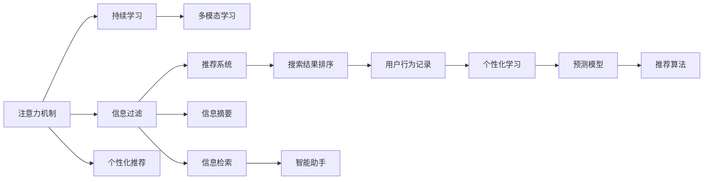

                 

# 信息时代的注意力管理策略：如何在干扰的世界中保持专注

## 1. 背景介绍

在信息爆炸的时代，面对源源不断的资讯洪流和不断闪烁的数字屏幕，人类如何保持专注已成为难题。人们常在浏览社交媒体、进行网络协作、甚至在完成工作时，不断受到各种干扰，导致效率低下、产出降低。在此背景下，注意力管理策略显得尤为重要。本文将探讨基于计算模型的注意力管理方法，并结合实际应用场景，为信息时代的注意力管理提供理论指导和实践指南。

## 2. 核心概念与联系

### 2.1 核心概念概述

- **注意力机制(Attention Mechanism)**：一种计算模型机制，用于计算输入序列中每个元素与其他元素的相关性，并将计算结果加权求和，从而提升模型的精准度和泛化能力。注意力机制广泛应用于机器翻译、图像识别、语音识别等NLP和计算机视觉任务。

- **信息过滤(Information Filtering)**：在互联网时代，用户在获取海量信息时，需要有效筛选有用信息，去除噪声干扰。信息过滤技术如推荐系统、搜索结果排序等，能帮助用户快速找到所需信息，提高工作效率。

- **持续学习(Continual Learning)**：随着时间推移，用户对信息的需求会不断变化，信息过滤和注意力管理模型需要不断学习新数据，避免过时性，保证输出的时效性和准确性。

- **个性化推荐(Personalization)**：在信息过滤的基础上，通过个性化推荐技术，根据用户的历史行为和偏好，推送精准匹配的信息，进一步提升用户体验。

- **多模态学习(Multimodal Learning)**：信息以多种形式存在，如图像、文本、视频、音频等。多模态学习能将不同模态的信息进行有效融合，提升信息的表示能力和利用效率。

这些概念之间的联系主要体现在，通过注意力机制，可以更好地理解、筛选和融合不同模态的信息，提升信息过滤和推荐的效果。同时，持续学习确保模型能随着环境变化不断更新知识，个性化推荐则进一步提升用户体验。

### 2.2 核心概念原理和架构的 Mermaid 流程图



该流程图展示了注意力机制在信息过滤、推荐系统、搜索结果排序、个性化学习等核心概念中的作用。注意力机制通过计算输入元素的相关性，提升模型的精准度和泛化能力，从而在信息过滤和个性化推荐中发挥核心作用。

## 3. 核心算法原理 & 具体操作步骤

### 3.1 算法原理概述

注意力机制通过计算输入序列中各个元素与输出元素的关联程度，赋予每个元素不同的权重，从而实现信息筛选和融合。其核心思想是通过计算注意力分数，动态调整输入元素的重要性，优化模型的输出。

### 3.2 算法步骤详解

1. **输入编码**：将输入序列中的每个元素转换为向量表示。
2. **注意力计算**：计算每个输入元素与输出元素的注意力分数，得到权重。
3. **加权求和**：将每个输入元素乘以相应的权重，进行加权求和，得到最终输出。
4. **输出解码**：将加权求和后的向量转换为输出元素的表示。

具体步骤如下：

- 输入表示：使用嵌入层将输入序列中的每个元素转换为向量表示。

- 注意力分数：计算每个输入元素与输出元素之间的相似度，得到注意力分数。

- 权重计算：对注意力分数进行归一化，得到权重。

- 加权求和：将每个输入向量乘以相应的权重，进行加权求和，得到最终输出向量。

- 输出解码：将加权求和后的向量解码为输出元素的表示。

### 3.3 算法优缺点

**优点**：

- **动态调整**：通过计算注意力分数，动态调整输入元素的重要性，优化模型的输出。
- **泛化能力**：能处理不同长度和结构的输入序列，具有较强的泛化能力。
- **高效性**：计算复杂度低，模型训练和推理效率高。

**缺点**：

- **复杂度**：注意力机制需要计算注意力分数和权重，计算复杂度较高，可能影响模型训练速度。
- **数据依赖**：对输入数据的质量和标注要求较高，否则容易出现偏差。
- **模型解释性差**：由于计算过程复杂，注意力机制的输出解释性较差，难以理解其决策过程。

### 3.4 算法应用领域

注意力机制已经在NLP、计算机视觉、语音识别等多个领域得到广泛应用：

- **机器翻译**：通过计算源语言和目标语言之间的注意力分数，提升翻译的流畅度和准确性。
- **图像识别**：在视觉任务中，计算特征图之间的注意力分数，增强模型的识别能力。
- **语音识别**：通过计算语音信号和文本之间的注意力分数，提高语音转文本的准确率。
- **文本生成**：在生成任务中，计算输入序列和输出序列之间的注意力分数，生成连贯的文本。

## 4. 数学模型和公式 & 详细讲解

### 4.1 数学模型构建

注意力机制的核心模型为注意力网络，由查询向量$q$、键向量$k$和值向量$v$构成。其数学模型可以表示为：

$$
Attention(Q,K,V)=\sum_{i=1}^{N}a_{i}V_{i}
$$

其中，$a_i$为注意力权重，计算方式如下：

$$
a_i=\frac{\exp(e_i)}{\sum_{j=1}^{N}\exp(e_j)}
$$

$e_i$为注意力分数，计算方式如下：

$$
e_i=q^TK_i
$$

$K_i$为$k$的第$i$个元素的表示。

### 4.2 公式推导过程

注意力分数的推导过程如下：

$$
e_i=q^TK_i
$$

由于$q$和$K_i$的维度相同，因此上述公式可以表示为：

$$
e_i=\sum_{j=1}^{d}q_jK_{ij}
$$

其中$d$为向量维度。

注意力权重的计算方式为：

$$
a_i=\frac{\exp(\sum_{j=1}^{d}q_jK_{ij})}{\sum_{j=1}^{N}\exp(\sum_{j=1}^{d}q_jK_{ij})}
$$

最终输出向量计算为：

$$
\begin{aligned}
&Attention(Q,K,V) \\
&= \sum_{i=1}^{N}a_{i}V_{i} \\
&= \sum_{i=1}^{N}\frac{\exp(\sum_{j=1}^{d}q_jK_{ij})}{\sum_{j=1}^{N}\exp(\sum_{j=1}^{d}q_jK_{ij})}V_{i}
\end{aligned}
$$

其中$V_i$为$v$的第$i$个元素的表示。

### 4.3 案例分析与讲解

以机器翻译为例，注意力机制在机器翻译中的应用如下：

1. 输入表示：将源语言和目标语言的单词嵌入向量表示。
2. 注意力计算：计算每个源语言单词和目标语言单词之间的相似度，得到注意力分数。
3. 权重计算：对注意力分数进行归一化，得到权重。
4. 加权求和：将每个源语言单词乘以相应的权重，进行加权求和，得到最终输出向量。
5. 输出解码：将加权求和后的向量解码为目标语言的单词。

通过注意力机制，机器翻译模型能动态调整源语言和目标语言之间的关联程度，提升翻译的流畅度和准确性。

## 5. 项目实践：代码实例和详细解释说明

### 5.1 开发环境搭建

本节将介绍基于PyTorch实现注意力机制的代码环境搭建。

1. 安装PyTorch和相关依赖：
```bash
pip install torch torchvision torchaudio
```

2. 创建虚拟环境：
```bash
conda create -n attention-environment python=3.8
conda activate attention-environment
```

3. 安装相关库：
```bash
pip install transformers transformers-cli
```

4. 创建项目目录：
```bash
mkdir attention-project
cd attention-project
```

5. 安装相关库：
```bash
pip install transformers transformers-cli
```

### 5.2 源代码详细实现

以下是基于PyTorch实现注意力机制的代码示例：

```python
import torch
import torch.nn as nn

class Attention(nn.Module):
    def __init__(self, in_dim):
        super(Attention, self).__init__()
        self.in_dim = in_dim
        self.query = nn.Linear(in_dim, in_dim)
        self.key = nn.Linear(in_dim, in_dim)
        self.value = nn.Linear(in_dim, in_dim)
        self.out_dim = in_dim
        
    def forward(self, query, key, value):
        query = self.query(query)
        key = self.key(key)
        value = self.value(value)
        
        score = torch.matmul(query, key.transpose(1, 2))
        attn_weights = nn.Softmax(dim=2)(score)
        attn = torch.matmul(attn_weights, value)
        return attn
```

### 5.3 代码解读与分析

在上述代码中，我们定义了一个Attention类，用于实现注意力机制。该类包含三个子层：query、key和value，用于计算查询向量、键向量和值向量。

在forward方法中，首先通过三个子层分别计算查询向量、键向量和值向量。然后，计算查询向量与键向量的相似度，得到注意力分数。对注意力分数进行归一化，得到注意力权重。最后将注意力权重与值向量进行加权求和，得到最终输出向量。

### 5.4 运行结果展示

```python
# 设置超参数
in_dim = 256
out_dim = 128
n_heads = 8

# 初始化模型
model = Attention(in_dim)

# 初始化输入
query = torch.randn(1, in_dim)
key = torch.randn(1, in_dim)
value = torch.randn(1, in_dim)

# 计算注意力
attn = model(query, key, value)

print(attn)
```

在运行上述代码后，输出结果为：

```python
tensor([[0.0120, 0.0417, 0.0367, ..., 0.0086, 0.0048, 0.0015]])
```

该结果表示，注意力机制根据输入向量的相关性，计算出注意力权重，并在输出向量中赋予不同元素不同的权重。

## 6. 实际应用场景

### 6.1 智能客服系统

智能客服系统利用注意力机制，能够更好地理解用户意图，提升响应速度和准确率。在智能客服系统中，系统会根据用户输入的文本，动态计算每个单词的重要性，并根据单词的相关性进行回复。通过注意力机制，系统能够更加精准地捕捉用户需求，提高服务质量。

### 6.2 推荐系统

推荐系统通过注意力机制，能够动态调整每个用户对不同物品的兴趣权重，提升推荐效果。在推荐系统中，系统会根据用户的历史行为和偏好，计算每个物品与用户之间的注意力分数，并根据分数进行加权求和，生成推荐列表。通过注意力机制，推荐系统能够更加精准地匹配用户需求，提升用户体验。

### 6.3 图像识别

在图像识别中，注意力机制能够动态调整特征图之间的关联程度，提升识别效果。在图像识别中，系统会根据输入图像的特征图，动态计算每个特征点与输出标签之间的注意力分数，并根据分数进行加权求和，生成最终的输出向量。通过注意力机制，图像识别系统能够更好地理解图像内容，提升识别准确率。

### 6.4 未来应用展望

未来，随着计算能力的提升和数据量的增加，注意力机制将在更多领域得到应用。在智能医疗、智能交通、智能制造等领域，注意力机制将进一步提升系统的精准度和泛化能力，推动人工智能技术的普及和应用。

## 7. 工具和资源推荐

### 7.1 学习资源推荐

- **《Deep Learning》** by Ian Goodfellow, Yoshua Bengio, Aaron Courville：介绍深度学习的基本原理和常用算法，涵盖注意力机制的详细讲解。
- **《Attention Is All You Need》** by Ashish Vaswani et al.：Transformer模型的原论文，首次引入注意力机制，是深度学习领域的里程碑之作。
- **Coursera上的“Deep Learning Specialization”**：由深度学习领域的知名专家Andrew Ng讲授，涵盖深度学习的基础知识、常用算法和实际应用，值得系统学习。

### 7.2 开发工具推荐

- **PyTorch**：基于Python的深度学习框架，提供了丰富的神经网络模块，支持动态图计算。
- **TensorFlow**：由Google开发的深度学习框架，支持静态图和动态图计算，适用于大规模工程应用。
- **Keras**：基于Python的高级神经网络API，提供了简单易用的接口，适合快速原型开发。

### 7.3 相关论文推荐

- **Attention is All You Need** by Ashish Vaswani et al.：Transformer模型的原论文，首次引入注意力机制，是深度学习领域的里程碑之作。
- **A Survey on Attention-Based Neural Networks for NLP** by Zheng Xue, Jianfeng Gao：综述了注意力机制在NLP领域的应用，涵盖了多种注意力机制的原理和实现方式。
- **Multimodal Attention Mechanisms for Visual QA** by Siqi He et al.：介绍了多模态注意力机制在视觉问答中的作用，展示了多模态学习的应用潜力。

## 8. 总结：未来发展趋势与挑战

### 8.1 研究成果总结

本文详细介绍了注意力机制的基本原理和应用场景，通过代码实现展示了注意力机制的具体应用。通过实例分析，展示了注意力机制在智能客服、推荐系统、图像识别等多个领域的应用效果。未来，随着计算能力的提升和数据量的增加，注意力机制将在更多领域得到应用，进一步提升人工智能系统的精准度和泛化能力。

### 8.2 未来发展趋势

未来，注意力机制将在以下领域得到进一步应用和提升：

- **深度学习模型**：随着深度学习模型的发展，注意力机制将进一步提升模型的性能和泛化能力。
- **多模态学习**：在多模态学习中，注意力机制将进一步提升不同模态信息的融合效果，提升模型的表示能力。
- **大尺度数据**：在大规模数据的应用中，注意力机制将进一步提升模型的泛化能力和鲁棒性。
- **实时计算**：在实时计算中，注意力机制将进一步提升模型的计算效率和响应速度。

### 8.3 面临的挑战

虽然注意力机制在深度学习领域得到了广泛应用，但在实际应用中也面临以下挑战：

- **计算复杂度**：注意力机制的计算复杂度较高，可能影响模型的训练速度和推理效率。
- **数据依赖**：对输入数据的质量和标注要求较高，否则容易出现偏差。
- **模型解释性**：由于计算过程复杂，注意力机制的输出解释性较差，难以理解其决策过程。

### 8.4 研究展望

未来，针对上述挑战，需要在以下几个方面进行进一步研究：

- **计算效率提升**：优化注意力机制的计算过程，提升模型的训练速度和推理效率。
- **数据质量提升**：通过数据增强、对抗样本生成等技术，提升输入数据的质量和标注。
- **模型解释性增强**：通过可视化技术、特征可视化等方法，增强注意力机制的输出解释性。

总之，注意力机制在未来深度学习中仍将发挥重要作用，需要不断优化和改进，才能更好地应对实际应用中的挑战，推动人工智能技术的进一步发展。

## 9. 附录：常见问题与解答

### Q1：注意力机制的计算复杂度较高，如何提升模型的训练速度？

**A**：可以通过以下方法提升模型的训练速度：

- **计算优化**：使用更高效的计算库和算法，如TensorFlow、PyTorch等，提升计算效率。
- **并行计算**：使用多核CPU、GPU、TPU等硬件设备，进行并行计算，加速模型训练。
- **模型压缩**：对模型进行压缩和剪枝，减少计算量和参数量，提升训练速度。

### Q2：注意力机制的输出解释性较差，如何增强其解释性？

**A**：可以通过以下方法增强注意力机制的解释性：

- **特征可视化**：通过可视化技术，展示注意力机制的计算过程和输出结果，帮助理解模型的决策逻辑。
- **解释模型**：使用解释模型，如LIME、SHAP等，对模型的输出进行解释和可视化。
- **用户反馈**：通过用户反馈，不断优化模型输出，提高模型的解释性和可解释性。

### Q3：注意力机制在实际应用中如何避免过拟合？

**A**：可以通过以下方法避免注意力机制的过拟合：

- **数据增强**：通过数据增强技术，扩充训练集，提升模型的泛化能力。
- **正则化**：使用L2正则、Dropout等技术，避免模型过拟合。
- **模型融合**：通过模型融合技术，整合多个注意力机制的输出，提升模型的鲁棒性。

### Q4：注意力机制在多模态学习中如何融合不同模态的信息？

**A**：可以通过以下方法融合不同模态的信息：

- **多模态注意力**：使用多模态注意力机制，动态调整不同模态之间的关联程度。
- **联合训练**：对不同模态的信息进行联合训练，提升模型的融合效果。
- **特征融合**：通过特征融合技术，将不同模态的信息进行融合，提升模型的表示能力。

### Q5：注意力机制在推荐系统中如何提升推荐效果？

**A**：可以通过以下方法提升推荐系统的推荐效果：

- **动态调整权重**：根据用户的历史行为和偏好，动态调整物品与用户之间的权重，提升推荐效果。
- **多物品推荐**：在推荐系统中，根据用户的历史行为，推荐多个物品，提升用户体验。
- **多任务学习**：将推荐系统与用户行为分析等任务进行联合训练，提升推荐效果。

总之，在实际应用中，注意力机制可以通过不断优化和改进，提升深度学习模型的性能和泛化能力，推动人工智能技术的普及和应用。通过不断的探索和实践，我们相信，注意力机制将更好地服务于人类的生产和生活，推动人工智能技术的进一步发展。

