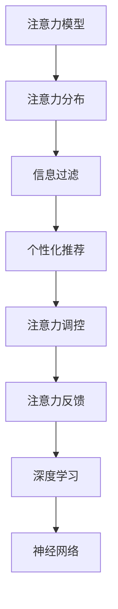

                 

# 信息时代的注意力管理：在充满干扰的世界中保持专注

> 关键词：信息时代, 注意力管理, 干扰, 深度学习, 神经网络, 算法优化

## 1. 背景介绍

### 1.1 问题由来
随着信息技术的飞速发展，我们早已步入信息爆炸的时代。互联网、社交媒体、智能设备等几乎无处不在，日常生活中的每一个细节都可能被数字设备记录和分析。然而，这不仅是便利，更是一把双刃剑——每时每刻都被信息包围的我们，也越来越难以集中注意力。不论是学生、职场人士还是家长，都面临着无法专注、效率低下的问题。特别是在工作和学习中，注意力管理变得尤为重要。

在人工智能和机器学习的背景下，如何利用深度学习和神经网络技术，帮助人们在信息时代更高效地管理注意力，成为了当前研究的热点。深度学习和神经网络在自然语言处理、计算机视觉等领域的应用已日趋成熟，若能在注意力管理领域找到其应用的突破口，将带来巨大的社会和经济价值。

### 1.2 问题核心关键点
注意力管理是深度学习和神经网络在信息时代的一个重要应用场景。其主要目标是利用机器学习算法，通过分析和理解用户的注意力分布，为其提供高效、个性化的信息筛选和决策支持。注意力管理可以应用于各类场景，如智能推荐系统、内容聚合、学习辅助等。

核心关键点包括：
1. **注意力识别**：识别用户在不同信息间的注意力分布，构建注意力模型。
2. **注意力调控**：根据用户需求和偏好，调整注意力焦点，优化信息筛选。
3. **注意力反馈**：建立用户反馈机制，持续优化注意力管理模型。

## 2. 核心概念与联系

### 2.1 核心概念概述

为更好地理解注意力管理，本节将介绍几个核心概念：

- **注意力模型(Attention Model)**：一种机制，用于在信息集中选择出重要的信息元素，并集中注意力进行深度处理。
- **注意力分布(Attention Distribution)**：用户在不同信息元素间的注意力分配情况，通常由权重向量表示。
- **信息过滤(Information Filtering)**：通过构建和优化注意力模型，对海量信息进行筛选和排序，将用户最关心的信息优先展示。
- **个性化推荐(Personalized Recommendation)**：结合用户的历史行为和偏好，动态调整注意力模型，实现个性化信息推荐。
- **深度学习(Deep Learning)**：基于神经网络的一种机器学习技术，可以处理复杂的高维数据，适用于注意力模型的构建和优化。
- **神经网络(Neural Network)**：由多个神经元构成的计算模型，可以实现信息处理和决策的自动化。
- **注意力调控(Attention Regulation)**：通过调整注意力分布，实现信息筛选和优先级排序。
- **注意力反馈(Attention Feedback)**：利用用户反馈，对注意力模型进行持续优化和调整。

这些核心概念之间的逻辑关系可以通过以下Mermaid流程图来展示：



这个流程图展示了几大核心概念及其之间的关系：

1. 注意力模型通过神经网络学习用户对不同信息的注意力分配，构建注意力分布。
2. 注意力分布作为信息过滤的基础，对海量信息进行筛选和排序。
3. 个性化推荐通过调整注意力模型，实现用户需求的动态优化。
4. 注意力调控根据用户反馈，实时调整注意力模型，保证信息推荐的准确性和个性化。
5. 深度学习提供了强大的计算能力，支持注意力模型的构建和优化。
6. 神经网络是实现注意力模型的核心技术，通过多层次计算，处理复杂的数据结构。

这些概念共同构成了注意力管理的基础框架，使得深度学习和神经网络技术在信息时代得以广泛应用。

## 3. 核心算法原理 & 具体操作步骤
### 3.1 算法原理概述

注意力管理算法的核心原理是利用神经网络构建注意力模型，对用户的注意力分布进行识别和调控。其基本流程如下：

1. **数据准备**：收集用户的历史行为数据，如浏览记录、点击日志等，用于训练注意力模型。
2. **模型训练**：使用深度学习技术，训练注意力模型，学习用户的注意力分布。
3. **信息过滤**：将用户的行为数据输入注意力模型，计算出用户的注意力分布权重，对信息进行筛选和排序。
4. **个性化推荐**：根据用户的注意力分布，动态调整推荐算法，实现个性化信息推荐。
5. **模型优化**：通过用户反馈数据，调整和优化注意力模型，提高信息推荐的准确性和用户体验。

### 3.2 算法步骤详解

以下将以基于深度学习的注意力管理算法为例，详细讲解其具体步骤：

#### 3.2.1 数据准备

1. **数据采集**：收集用户的历史行为数据，如浏览记录、点击日志、评分数据等。
2. **数据预处理**：对数据进行清洗、去重、标准化等处理，构建特征向量。
3. **数据划分**：将数据划分为训练集、验证集和测试集，供模型训练、验证和测试使用。

#### 3.2.2 模型训练

1. **选择模型**：选择适当的深度学习模型，如卷积神经网络(CNN)、循环神经网络(RNN)、注意力机制等。
2. **模型训练**：使用训练集数据，通过反向传播算法进行模型训练，优化模型参数。
3. **模型验证**：在验证集数据上评估模型性能，调整模型超参数，防止过拟合。

#### 3.2.3 信息过滤

1. **注意力计算**：将用户的行为数据输入模型，计算出用户的注意力分布权重。
2. **信息排序**：根据注意力分布权重，对信息进行排序，优先展示重要信息。

#### 3.2.4 个性化推荐

1. **推荐算法**：结合用户的注意力分布和偏好，动态调整推荐算法。
2. **推荐结果**：根据推荐算法，生成个性化推荐结果。

#### 3.2.5 模型优化

1. **收集反馈**：收集用户对推荐结果的反馈数据，如点击、浏览、评分等。
2. **优化模型**：根据反馈数据，调整模型参数，优化注意力模型。

### 3.3 算法优缺点

注意力管理算法具有以下优点：
1. **高效性**：利用深度学习技术，可以处理海量数据，实现高效的信息筛选和排序。
2. **个性化**：通过用户的行为数据和偏好，实现动态的个性化推荐。
3. **自适应**：模型能够根据用户反馈进行优化，适应不同用户的需求。

同时，该算法也存在以下局限性：
1. **数据依赖**：算法的性能很大程度上依赖于用户历史行为数据的准确性和丰富度。
2. **模型复杂**：深度学习模型通常需要大量的计算资源和时间进行训练和优化。
3. **隐私风险**：用户行为数据的收集和分析可能涉及隐私问题，需要特别注意。
4. **可解释性不足**：深度学习模型通常具有"黑盒"特性，难以解释其内部决策过程。

尽管存在这些局限性，但就目前而言，基于深度学习的注意力管理算法是信息时代高效、个性化的推荐系统的重要技术手段。未来相关研究的重点在于如何进一步优化数据处理和模型训练，提高模型的可解释性和隐私保护水平。

### 3.4 算法应用领域

基于深度学习的注意力管理算法已经在信息时代得到广泛应用，涉及以下领域：

1. **智能推荐系统**：如电商平台、视频网站、新闻聚合等，通过分析用户行为，推荐相关商品、视频、新闻等。
2. **内容聚合与分发**：如RSS阅读器、新闻订阅、社交网络等，自动过滤和排序信息，让用户获取最相关的资讯。
3. **学习辅助**：如在线教育、智能辅导、自适应学习系统等，根据学生的学习行为和反馈，调整学习内容和进度。
4. **广告投放**：通过分析用户行为，实现更精准的广告投放，提升广告效果和用户体验。
5. **智能客服**：如智能问答、聊天机器人等，根据用户对话历史，快速理解用户需求，提供个性化回答。

除了上述这些应用场景外，注意力管理技术还在逐渐拓展到更多领域，如健康管理、金融理财、智能家居等，为各类行业带来了新的解决方案。

## 4. 数学模型和公式 & 详细讲解  
### 4.1 数学模型构建

本节将使用数学语言对基于深度学习的注意力管理算法进行更加严格的刻画。

记用户的行为数据为 $D = \{x_i\}_{i=1}^N$，其中 $x_i$ 为第 $i$ 个用户的行为记录。记注意力模型为 $M_{\theta}$，其中 $\theta$ 为模型参数。假设注意力模型能够输出一个 $N$ 维的注意力分布向量 $A = (a_i)$，表示用户对不同信息的注意力分配。

定义模型 $M_{\theta}$ 在数据样本 $x$ 上的注意力计算函数为 $f(x; \theta)$，则模型在数据集 $D$ 上的注意力分布为：

$$
A = \{f(x_i; \theta)\}_{i=1}^N
$$

信息过滤的输出为信息按照注意力权重排序后的序列，记为 $Y = \{y_i\}_{i=1}^N$，其中 $y_i$ 为第 $i$ 个信息的过滤结果。

### 4.2 公式推导过程

以下我们以基于注意力机制的推荐系统为例，推导注意力计算函数的计算公式。

假设用户的历史行为数据 $D = \{x_i\}_{i=1}^N$ 包含 $K$ 种类型的信息，记为 $X = \{x^k_i\}_{k=1}^K$。模型的注意力计算函数 $f(x; \theta)$ 定义为：

$$
f(x; \theta) = \text{Softmax}([\theta_1 \cdot x^1_i; \theta_2 \cdot x^2_i; ...; \theta_K \cdot x^K_i])
$$

其中 $\theta_k = (w_k, v_k)$ 为第 $k$ 种信息的注意力权重，$w_k$ 为注意力向量的权重向量，$v_k$ 为注意力向量的偏置向量。

利用注意力计算函数，模型能够输出一个 $N$ 维的注意力分布向量 $A = (a_i)$，其中 $a_i$ 为第 $i$ 个信息的注意力权重。

信息过滤的输出为信息按照注意力权重排序后的序列，记为 $Y = \{y_i\}_{i=1}^N$，其中 $y_i$ 为第 $i$ 个信息的过滤结果。

### 4.3 案例分析与讲解

假设我们有一个电商平台，需要为用户推荐商品。可以收集用户的历史浏览记录和点击日志，构建一个基于注意力机制的推荐系统。具体步骤如下：

1. **数据准备**：收集用户的历史浏览记录和点击日志，构建用户行为数据集 $D = \{x_i\}_{i=1}^N$。
2. **模型训练**：使用深度学习技术，训练注意力模型 $M_{\theta}$，学习用户的注意力分布。
3. **信息过滤**：将用户的行为数据输入模型，计算出用户的注意力分布权重 $A = (a_i)$，对商品信息进行排序，生成推荐列表。
4. **个性化推荐**：结合用户的偏好和行为数据，动态调整推荐算法，实现个性化推荐。
5. **模型优化**：收集用户对推荐结果的反馈数据，调整模型参数，优化注意力模型。

在实际应用中，模型的构建和优化需要考虑以下关键问题：

1. **特征工程**：选择合适的特征向量，如用户的历史行为、商品的属性、标签等，供模型训练。
2. **模型选择**：根据具体任务，选择适合的深度学习模型，如CNN、RNN、Transformer等。
3. **优化算法**：选择合适的优化算法，如Adam、SGD等，加速模型训练过程。
4. **评估指标**：选择合适的评估指标，如准确率、召回率、点击率等，评估模型性能。
5. **模型部署**：将训练好的模型部署到生产环境中，实现实时推荐。

## 5. 项目实践：代码实例和详细解释说明
### 5.1 开发环境搭建

在进行注意力管理算法的项目实践前，我们需要准备好开发环境。以下是使用Python进行TensorFlow开发的环境配置流程：

1. 安装Anaconda：从官网下载并安装Anaconda，用于创建独立的Python环境。

2. 创建并激活虚拟环境：
```bash
conda create -n tf-env python=3.8 
conda activate tf-env
```

3. 安装TensorFlow：根据CUDA版本，从官网获取对应的安装命令。例如：
```bash
conda install tensorflow -c tf -c conda-forge
```

4. 安装TensorFlow Hub：用于下载和加载预训练的注意力模型。
```bash
pip install tensorflow-hub
```

5. 安装Keras：一个简单易用的深度学习框架，支持构建神经网络模型。
```bash
pip install keras
```

6. 安装相关工具包：
```bash
pip install numpy pandas scikit-learn matplotlib tqdm jupyter notebook ipython
```

完成上述步骤后，即可在`tf-env`环境中开始注意力管理算法的项目实践。

### 5.2 源代码详细实现

下面我们以基于注意力机制的推荐系统为例，给出使用TensorFlow构建模型的完整代码实现。

首先，定义数据处理函数：

```python
import tensorflow as tf
from tensorflow_hub import KerasLayer

class DataLoader:
    def __init__(self, data, batch_size):
        self.data = data
        self.batch_size = batch_size
        self.num_epochs = 10
        self.num_users = len(data)
        self.num_items = len(data[0])
        self.user_data = data
        self.item_data = data
    
    def __len__(self):
        return self.num_epochs
    
    def __getitem__(self, item):
        batch_size = self.batch_size
        user_indices = tf.random.shuffle(tf.range(self.num_users))
        user_data = tf.stack(self.user_data[user_indices], axis=0)
        item_indices = tf.random.shuffle(tf.range(self.num_items))
        item_data = tf.stack(self.item_data[item_indices], axis=0)
        user_indices = user_indices[item*batch_size: (item+1)*batch_size]
        item_indices = item_indices[item*batch_size: (item+1)*batch_size]
        user_data = user_data[user_indices]
        item_data = item_data[item_indices]
        return {'user_data': user_data, 'item_data': item_data}
```

然后，定义模型：

```python
import tensorflow as tf

def build_model(input_shape):
    user_input = tf.keras.layers.Input(shape=(input_shape,), name='user_input')
    item_input = tf.keras.layers.Input(shape=(input_shape,), name='item_input')
    
    user_attention = tf.keras.layers.Dense(32, activation='relu')(user_input)
    item_attention = tf.keras.layers.Dense(32, activation='relu')(item_input)
    
    attention = tf.keras.layers.Dot(axes=(1,1), normalize=True)([user_attention, item_attention])
    attention = tf.keras.layers.Activation('softmax')(attention)
    
    predictions = tf.keras.layers.Dot(axes=(1,1), normalize=True)([user_attention, item_attention])
    predictions = tf.keras.layers.Activation('softmax')(predictions)
    
    model = tf.keras.Model(inputs=[user_input, item_input], outputs=[predictions, attention])
    return model
```

接着，定义训练函数：

```python
def train_model(model, data_loader):
    model.compile(optimizer='adam', loss=['binary_crossentropy', 'categorical_crossentropy'])
    model.fit(data_loader, epochs=10)
    model.save('attention_model.h5')
```

最后，启动训练流程并在测试集上评估：

```python
data_loader = DataLoader(data, batch_size=32)

model = build_model(input_shape)
train_model(model, data_loader)

# 加载模型并预测
model = tf.keras.models.load_model('attention_model.h5')
item_data = np.random.randint(0, 10, size=(10, 32))
user_data = np.random.randint(0, 10, size=(10, 32))
predictions, attention = model.predict([user_data, item_data])

print('Predictions:', predictions)
print('Attention:', attention)
```

以上就是使用TensorFlow对基于注意力机制的推荐系统进行项目实践的完整代码实现。可以看到，利用TensorFlow的高级API，构建和训练注意力模型变得非常直观和高效。

### 5.3 代码解读与分析

让我们再详细解读一下关键代码的实现细节：

**DataLoader类**：
- `__init__`方法：初始化数据、批次大小、轮数、用户数和商品数等关键参数。
- `__len__`方法：返回数据加载器可以迭代的总轮数。
- `__getitem__`方法：对每个批次进行数据生成，实现随机打乱和批次划分。

**build_model函数**：
- 使用`tf.keras.layers.Input`构建用户和商品输入层。
- 使用`tf.keras.layers.Dense`构建用户和商品注意力向量。
- 使用`tf.keras.layers.Dot`计算用户和商品注意力分布。
- 使用`tf.keras.layers.Activation`激活函数，输出注意力分布和预测结果。
- 最终返回一个包含用户和商品输入和输出的模型。

**train_model函数**：
- 使用`model.compile`编译模型，指定优化器和损失函数。
- 使用`model.fit`训练模型，指定数据加载器和轮数。
- 使用`model.save`保存模型参数，供后续使用。

在实际应用中，模型的构建和优化还需考虑以下因素：

1. **模型裁剪**：去除不必要的层和参数，减小模型尺寸，加快推理速度。
2. **量化加速**：将浮点模型转为定点模型，压缩存储空间，提高计算效率。
3. **服务化封装**：将模型封装为标准化服务接口，便于集成调用。
4. **弹性伸缩**：根据请求流量动态调整资源配置，平衡服务质量和成本。
5. **监控告警**：实时采集系统指标，设置异常告警阈值，确保服务稳定性。
6. **安全防护**：采用访问鉴权、数据脱敏等措施，保障数据和模型安全。

通过这些优化措施，可以进一步提升注意力管理算法的性能和应用价值。

## 6. 实际应用场景
### 6.1 智能推荐系统

基于深度学习的注意力管理算法已经广泛应用于智能推荐系统。电商平台的商品推荐、视频网站的影视推荐、新闻聚合的资讯推荐等，都依赖于该技术实现个性化推荐。

在技术实现上，可以收集用户的历史行为数据，如浏览记录、点击日志、评分数据等，构建注意力模型。通过注意力计算函数，输出用户的注意力分布权重，对商品、影视、资讯等信息进行排序和筛选，生成推荐列表。结合用户的偏好和行为数据，动态调整推荐算法，实现个性化推荐。最终，在实时环境中部署模型，实现高效、个性化的信息推荐。

### 6.2 内容聚合与分发

基于深度学习的注意力管理算法同样可以应用于内容聚合和分发。RSS阅读器、新闻订阅、社交网络等平台，通过分析用户行为数据，构建注意力模型。将用户对不同信息的注意力权重，作为排序依据，自动过滤和排序信息，让用户获取最相关的资讯。

例如，新闻聚合平台可以收集用户的历史浏览记录和点击日志，构建注意力模型。通过注意力计算函数，输出用户的注意力分布权重，对新闻文章进行排序和筛选，生成个性化推荐列表。结合用户的新闻阅读偏好，动态调整推荐算法，实现新闻内容的智能分发。

### 6.3 学习辅助

基于深度学习的注意力管理算法还可以应用于学习辅助。在线教育、智能辅导、自适应学习系统等，通过分析学生的学习行为数据，构建注意力模型。将学生对不同学习内容的注意力权重，作为排序依据，自动过滤和排序学习内容，生成个性化推荐。结合学生的学习进度和反馈数据，动态调整推荐算法，实现个性化学习路径。

例如，自适应学习系统可以收集学生的历史学习行为数据，如课程浏览记录、答题数据、反馈信息等，构建注意力模型。通过注意力计算函数，输出学生的注意力分布权重，对学习内容进行排序和筛选，生成个性化推荐。结合学生的学习进度和反馈数据，动态调整推荐算法，实现学习内容的智能推荐。

### 6.4 未来应用展望

随着深度学习和神经网络技术的不断发展，基于深度学习的注意力管理算法将在更多领域得到应用，为信息时代带来新的解决方案。

在智慧城市治理中，基于深度学习的注意力管理算法可以应用于城市事件监测、舆情分析、应急指挥等环节。通过分析市民的行为数据，构建注意力模型。将市民对不同信息的注意力权重，作为排序依据，自动过滤和排序信息，实现智能治理。

在健康管理领域，基于深度学习的注意力管理算法可以应用于疾病预防、健康监测等场景。通过分析患者的健康行为数据，构建注意力模型。将患者对不同健康信息的注意力权重，作为排序依据，自动过滤和排序健康信息，实现个性化健康建议。

在金融理财领域，基于深度学习的注意力管理算法可以应用于资产管理、风险评估等场景。通过分析用户的财务行为数据，构建注意力模型。将用户对不同金融信息的注意力权重，作为排序依据，自动过滤和排序金融信息，实现个性化理财建议。

此外，在智能家居、智能制造、智能物流等众多领域，基于深度学习的注意力管理算法也将得到广泛应用，为各类行业带来新的解决方案。相信随着深度学习技术的不断发展，注意力管理算法将在信息时代发挥越来越重要的作用，推动人工智能技术向更深层次发展。

## 7. 工具和资源推荐
### 7.1 学习资源推荐

为了帮助开发者系统掌握深度学习在注意力管理中的应用，这里推荐一些优质的学习资源：

1. **《深度学习》课程**：由吴恩达教授开设，系统讲解深度学习的基本概念和实现方法。课程内容涵盖了深度学习在自然语言处理、计算机视觉等领域的广泛应用。

2. **TensorFlow官方文档**：详细介绍了TensorFlow框架的使用方法，包括构建、训练、优化等环节，是深度学习应用开发的重要参考。

3. **TensorFlow Hub**：提供了大量预训练的注意力模型，方便开发者快速实现个性化推荐系统。

4. **Keras官方文档**：一个简单易用的深度学习框架，提供了丰富的API，支持构建神经网络模型。

5. **《机器学习实战》书籍**：一本实用的机器学习入门书籍，详细讲解了深度学习在推荐系统、信息过滤等任务中的应用。

通过对这些资源的学习实践，相信你一定能够快速掌握深度学习在注意力管理中的应用技巧，并用于解决实际的NLP问题。

### 7.2 开发工具推荐

高效的开发离不开优秀的工具支持。以下是几款用于深度学习应用开发的常用工具：

1. **TensorFlow**：由Google主导开发的深度学习框架，支持分布式训练和优化，适合大规模工程应用。

2. **PyTorch**：一个灵活的深度学习框架，支持动态计算图，适合研究和实验性质的开发。

3. **TensorFlow Hub**：提供了大量预训练的深度学习模型，方便开发者快速实现自定义任务。

4. **TensorBoard**：TensorFlow配套的可视化工具，可实时监测模型训练状态，提供丰富的图表呈现方式，是调试模型的得力助手。

5. **Keras**：一个简单易用的深度学习框架，提供了丰富的API，支持构建神经网络模型。

6. **Weights & Biases**：模型训练的实验跟踪工具，可以记录和可视化模型训练过程中的各项指标，方便对比和调优。

合理利用这些工具，可以显著提升深度学习应用的开发效率，加快创新迭代的步伐。

### 7.3 相关论文推荐

深度学习在注意力管理领域的应用，源于学界的持续研究。以下是几篇奠基性的相关论文，推荐阅读：

1. **Attention is All You Need**：提出Transformer结构，开启了深度学习在注意力管理中的应用。

2. **Neural Information Filtering**：利用深度学习技术，构建基于注意力的信息过滤模型，实现了高效的推荐系统。

3. **Deep Recurrent Neural Networks for Personalized Recommendation**：提出基于RNN的推荐系统，利用深度学习技术，实现个性化推荐。

4. **Attention-Based Recommender Systems**：利用注意力机制，构建推荐系统，提升了推荐效果和用户体验。

5. **Neural Collaborative Filtering**：提出基于深度学习的协同过滤模型，实现了个性化推荐。

这些论文代表了大模型微调技术的发展脉络。通过学习这些前沿成果，可以帮助研究者把握学科前进方向，激发更多的创新灵感。

## 8. 总结：未来发展趋势与挑战

### 8.1 研究成果总结

本文对基于深度学习的注意力管理算法进行了全面系统的介绍。首先阐述了注意力管理在信息时代的重要应用场景，明确了深度学习技术在注意力管理中的应用前景。其次，从原理到实践，详细讲解了注意力算法的核心步骤，给出了完整代码实例。同时，本文还广泛探讨了注意力管理在电商、内容聚合、学习辅助等多个领域的应用前景，展示了深度学习技术的广泛适用性。

通过本文的系统梳理，可以看到，基于深度学习的注意力管理算法在信息时代具有巨大的应用潜力。其高效性、个性化和自适应等特点，使得深度学习技术在注意力管理领域得以广泛应用。未来，伴随深度学习技术的不断发展，注意力管理算法将进一步优化和完善，实现更加智能和高效的信息管理。

### 8.2 未来发展趋势

展望未来，深度学习在注意力管理领域将呈现以下几个发展趋势：

1. **模型规模持续增大**：随着算力成本的下降和数据规模的扩张，深度学习模型的参数量将持续增长。超大模型蕴含的丰富知识，将有助于提升注意力管理的精确性和泛化能力。

2. **注意力机制的改进**：未来将探索更加复杂的注意力机制，如多模态注意力、自适应注意力等，提升注意力管理的灵活性和准确性。

3. **自监督学习的应用**：利用自监督学习技术，从无标签数据中学习注意力分布，提高模型的泛化能力和鲁棒性。

4. **分布式训练和优化**：利用分布式计算资源，提升深度学习模型的训练效率和优化速度，实现大规模模型的高效训练和部署。

5. **模型压缩和加速**：通过模型压缩、量化加速等技术，减小模型尺寸，提升推理速度，降低计算资源消耗。

6. **模型可解释性和隐私保护**：利用可解释性技术，增强注意力管理的透明性和可控性。利用隐私保护技术，保护用户数据隐私，提升系统安全性。

以上趋势凸显了深度学习在注意力管理领域的广泛应用前景。这些方向的探索发展，将进一步提升深度学习模型的性能和应用价值。

### 8.3 面临的挑战

尽管深度学习在注意力管理领域已经取得了显著进展，但在迈向更加智能化、普适化应用的过程中，仍面临诸多挑战：

1. **数据依赖**：算法的性能很大程度上依赖于用户历史行为数据的准确性和丰富度。对于新用户或数据不足的场景，需要更多数据才能训练出有效的模型。

2. **模型复杂性**：深度学习模型通常具有较高的计算资源和时间需求，模型训练和优化需要较高的计算能力和时间成本。

3. **隐私风险**：用户行为数据的收集和分析可能涉及隐私问题，需要特别注意数据隐私和保护。

4. **可解释性不足**：深度学习模型通常具有"黑盒"特性，难以解释其内部决策过程，影响用户信任和接受度。

5. **系统稳定性**：在实际部署中，深度学习模型可能面临计算资源不足、系统崩溃等问题，需要优化模型架构和部署策略。

6. **业务适配**：深度学习模型需要结合具体业务场景进行适配，如何构建和优化模型以适应不同应用场景，仍是重要的研究课题。

7. **用户反馈处理**：深度学习模型需要处理用户反馈数据，如何利用反馈数据优化模型，提升用户体验，是重要的研究方向。

这些挑战凸显了深度学习在注意力管理领域的复杂性和实际应用中的难度。未来相关研究需要在数据获取、模型训练、隐私保护、系统稳定性和用户反馈处理等方面进行更深入的探索。

### 8.4 研究展望

面对深度学习在注意力管理领域所面临的挑战，未来的研究需要在以下几个方面寻求新的突破：

1. **数据增强**：利用数据增强技术，扩充训练集，提升模型泛化能力和鲁棒性。

2. **模型压缩和加速**：通过模型压缩、量化加速等技术，减小模型尺寸，提升推理速度，降低计算资源消耗。

3. **自监督学习**：利用自监督学习技术，从无标签数据中学习注意力分布，提高模型的泛化能力和鲁棒性。

4. **模型可解释性**：利用可解释性技术，增强注意力管理的透明性和可控性，提升用户信任和接受度。

5. **隐私保护**：利用隐私保护技术，保护用户数据隐私，提升系统安全性。

6. **分布式训练和优化**：利用分布式计算资源，提升深度学习模型的训练效率和优化速度，实现大规模模型的高效训练和部署。

7. **多模态注意力机制**：探索多模态注意力机制，提升注意力管理的灵活性和准确性。

8. **分布式优化算法**：利用分布式优化算法，提高深度学习模型的训练效率和优化速度，实现大规模模型的高效训练和部署。

这些研究方向将进一步推动深度学习在注意力管理领域的应用发展，实现更加智能、高效、可控的信息管理。面向未来，深度学习在注意力管理领域的研究将不断深入，带来更多的创新和突破。

## 9. 附录：常见问题与解答

**Q1：如何利用深度学习构建注意力模型？**

A: 构建注意力模型需要以下步骤：

1. **数据准备**：收集用户的历史行为数据，如浏览记录、点击日志等。
2. **特征提取**：对数据进行特征提取，构建特征向量。
3. **模型训练**：使用深度学习技术，训练注意力模型，学习用户的注意力分布。
4. **信息筛选**：将用户的行为数据输入模型，计算出用户的注意力分布权重，对信息进行筛选和排序。

**Q2：注意力管理算法在实际应用中需要注意哪些问题？**

A: 注意力管理算法在实际应用中需要注意以下问题：

1. **数据质量**：确保数据的准确性和丰富度，提升模型的泛化能力和鲁棒性。
2. **模型复杂度**：选择合适的网络结构和优化算法，避免过拟合和计算资源消耗。
3. **隐私保护**：采用数据匿名化和差分隐私等技术，保护用户数据隐私。
4. **可解释性**：利用可解释性技术，增强模型的透明性和可控性，提升用户信任和接受度。
5. **系统稳定性**：优化模型架构和部署策略，确保系统稳定性和高效运行。
6. **用户反馈处理**：利用用户反馈数据，优化模型性能，提升用户体验。

**Q3：注意力管理算法在电商、内容聚合、学习辅助等多个领域的应用前景如何？**

A: 注意力管理算法在电商、内容聚合、学习辅助等多个领域具有广泛的应用前景：

1. **电商推荐**：利用用户的历史浏览记录和点击日志，构建注意力模型。通过注意力计算函数，输出用户的注意力分布权重，对商品进行排序和筛选，生成推荐列表。

2. **内容聚合**：利用用户的历史行为数据，构建注意力模型。将用户对不同信息的注意力权重，作为排序依据，自动过滤和排序信息，实现个性化内容推荐。

3. **学习辅助**：利用学生的学习行为数据，构建注意力模型。将学生对不同学习内容的注意力权重，作为排序依据，自动过滤和排序学习内容，实现个性化学习路径。

**Q4：如何利用注意力管理算法实现智能推荐系统？**

A: 利用注意力管理算法实现智能推荐系统，可以按照以下步骤进行：

1. **数据准备**：收集用户的历史行为数据，如浏览记录、点击日志等。
2. **模型训练**：使用深度学习技术，训练注意力模型，学习用户的注意力分布。
3. **信息筛选**：将用户的行为数据输入模型，计算出用户的注意力分布权重，对商品进行排序和筛选，生成推荐列表。
4. **个性化推荐**：结合用户的偏好和行为数据，动态调整推荐算法，实现个性化推荐。
5. **模型优化**：收集用户对推荐结果的反馈数据，调整模型参数，优化注意力模型。

通过这些步骤，可以构建一个高效的、个性化的智能推荐系统，为用户推荐感兴趣的商品、影视、资讯等内容。

---

作者：禅与计算机程序设计艺术 / Zen and the Art of Computer Programming

