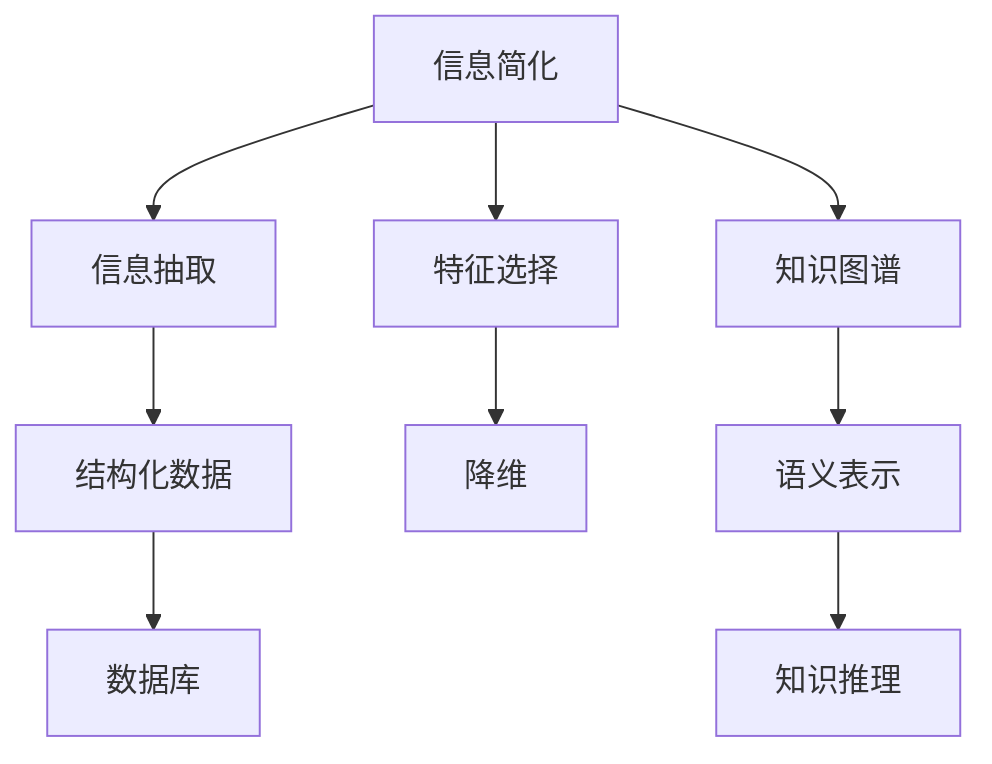

                 

# 信息简化的原则和实践：如何在混乱中建立秩序

## 1. 背景介绍

### 1.1 问题由来
随着信息技术的飞速发展，数据量呈爆炸式增长。信息过载成为现代社会的一大困扰，人们需要在海量信息中找到有价值的内容，解决实际问题。而信息的杂乱无章、冗余重复等问题，使得信息获取和处理变得更加复杂。在这种情况下，如何简化信息，建立清晰的秩序，成为了信息时代的一个关键议题。

### 1.2 问题核心关键点
信息简化，即在复杂的信息环境中，提取和组织有用信息，去除冗余和无关内容，使得信息更易于理解和处理。核心在于如何识别、提取、整合和呈现关键信息。

信息简化不仅仅是一个技术问题，更是一个涉及心理学、认知科学、人类工效学等多学科的复杂问题。当前，信息简化方法主要集中在数据清洗、特征选择、信息抽取、自然语言处理等方面。通过这些技术手段，可以高效地处理大量文本信息，提取重要内容。

### 1.3 问题研究意义
在信息时代，简化信息的能力对于提高工作效率、决策准确性和用户体验都至关重要。信息简化技术的应用，可以大幅提升信息检索、数据管理、知识图谱构建、内容推荐等领域的效果，加速各类系统的开发和优化。

## 2. 核心概念与联系

### 2.1 核心概念概述

为更好地理解信息简化技术，本节将介绍几个密切相关的核心概念：

- 信息简化(Information Simplification)：指通过一系列技术和方法，从复杂信息源中提取、组织关键内容，去除冗余和噪声，使信息更易于理解和使用的过程。
- 信息抽取(Information Extraction)：从非结构化数据中识别和提取特定信息片段，如实体、事件、关系等，并进行结构化处理。
- 特征选择(Feature Selection)：选择最相关的特征进行建模，去除不必要的冗余特征，提高模型的泛化能力和效率。
- 知识图谱(Knowledge Graph)：构建大规模知识网络，利用图结构表示实体、关系、属性等，便于信息检索和知识推理。
- 自然语言处理(Natural Language Processing, NLP)：使计算机能够理解、处理和生成人类语言，是信息简化技术的基础。

这些核心概念之间的逻辑关系可以通过以下Mermaid流程图来展示：



这个流程图展示了一系列信息简化技术及其之间的联系：

1. 信息简化通过从信息源中提取关键内容，去除冗余信息。
2. 信息抽取将非结构化文本转化为结构化数据，便于进一步处理。
3. 特征选择用于降维，去除无关特征，提高模型效率。
4. 知识图谱构建知识网络，便于信息检索和推理。
5. 结构化数据和语义表示通过数据库存储和管理，便于应用。
6. 知识推理使信息能够被更广泛地应用，辅助决策。

这些概念共同构成了信息简化的技术框架，使其能够从原始数据中提取有价值的信息，构建更高效、准确的信息处理系统。

## 3. 核心算法原理 & 具体操作步骤
### 3.1 算法原理概述

信息简化的核心算法主要集中在以下几个方面：

- 信息抽取：使用命名实体识别(NER)、关系抽取(RE)、事件抽取(EVE)等技术，从文本中识别和提取关键信息片段。
- 特征选择：应用统计学、机器学习等方法，选择最能区分目标的信息特征，去除冗余和无关特征。
- 知识图谱构建：使用图算法和数据融合技术，将多个数据源的知识实体和关系进行整合，构建大规模的知识图谱。
- 自然语言处理：利用语言模型、神经网络等技术，实现对自然语言的理解和生成，从而更好地提取和简化信息。

### 3.2 算法步骤详解

下面详细介绍信息简化的具体步骤：

**Step 1: 收集原始数据**
- 从各种数据源收集待简化的信息，包括文本、音频、视频等。
- 使用爬虫、API接口等手段获取数据，并进行初步清洗和处理。

**Step 2: 信息抽取**
- 使用自然语言处理技术，如命名实体识别、关系抽取、事件抽取等，从原始数据中抽取关键实体、关系和事件。
- 对于文本数据，可以使用NLTK、SpaCy、Stanford NER等工具进行信息抽取。
- 对于非文本数据，如音频、视频，可以使用语音识别、视频内容分析等技术进行信息抽取。

**Step 3: 特征选择**
- 对抽取的信息进行特征工程，选择最能区分目标的特征。
- 特征选择可以基于统计学方法（如卡方检验、互信息），也可以基于机器学习方法（如Lasso回归、特征选择算法）。
- 特征选择需结合具体任务和数据特点，进行细致的调参和优化。

**Step 4: 信息整合**
- 将抽取的信息进行结构化处理，构建知识图谱或数据表。
- 利用图算法进行知识推理，发现信息之间的潜在关系和规律。
- 对于大规模数据集，可以采用分布式算法进行信息整合。

**Step 5: 信息呈现**
- 将简化后的信息，通过可视化、报表等形式呈现给用户。
- 结合数据可视化工具（如Tableau、Power BI、D3.js等），构建动态、互动的信息展示界面。
- 信息呈现需考虑用户体验，提供直观、易用的交互方式。

**Step 6: 反馈和迭代**
- 收集用户反馈，评估信息简化的效果。
- 根据反馈结果，不断优化信息抽取、特征选择和整合算法。
- 持续迭代，提升信息简化的准确性和效率。

### 3.3 算法优缺点

信息简化技术的主要优点：
1. 提高信息处理效率。通过去除冗余和噪声，信息更加简洁明了，易于理解和处理。
2. 提升信息检索准确性。结构化的数据和知识图谱，便于信息检索和查询，加速信息获取。
3. 增强知识图谱的完整性。整合多源信息，构建更全面的知识网络，辅助决策和推理。
4. 改善用户体验。简化后的信息更直观易用，提升用户满意度。

同时，该方法也存在以下局限性：
1. 对数据质量要求高。数据源的准确性和完整性直接影响信息抽取和整合的准确性。
2. 算法复杂度较高。信息抽取和特征选择算法需进行调参和优化，增加系统复杂度。
3. 需要专业技能。信息简化涉及多学科知识，需具备相应的技术和方法论。
4. 计算资源需求大。大规模数据集的整合和计算，需要高性能计算设备和算法优化。

尽管存在这些局限性，但信息简化技术在信息处理和知识管理等领域具有重要应用价值，是大数据时代的关键技术之一。

### 3.4 算法应用领域

信息简化技术在多个领域都有广泛应用，包括但不限于：

- 新闻推荐系统：从海量新闻中抽取关键信息，提取新闻主题、情感倾向等特征，为用户推荐个性化新闻。
- 金融风控系统：从交易记录中抽取关键信息，识别异常交易行为，进行风险评估。
- 法律文书分析：从法律文件中抽取关键要素，提取合同条款、证据材料等关键信息，辅助律师和法官工作。
- 医疗健康系统：从病历记录中抽取关键信息，提取病患症状、诊断结果等，辅助医生诊断和治疗。
- 智能客服系统：从用户对话中抽取关键问题，识别用户意图，进行智能回复。

此外，信息简化技术还在舆情分析、社交媒体分析、智能问答等领域得到了广泛应用，为各类应用场景提供了高效的信息处理能力。

## 4. 数学模型和公式 & 详细讲解 & 举例说明
### 4.1 数学模型构建

信息简化的数学模型构建，主要涉及以下几个关键部分：

- 信息抽取模型：如BERT、GPT等预训练模型，用于识别文本中的实体、关系和事件。
- 特征选择模型：如Lasso回归、XGBoost等机器学习模型，用于选择最重要的特征。
- 知识图谱模型：如Neo4j图数据库，用于存储和管理知识图谱。
- 自然语言处理模型：如Transformer、BERT等，用于处理自然语言信息。

### 4.2 公式推导过程

以信息抽取为例，详细推导命名实体识别的过程。

假设文本 $T$ 包含多个实体 $E=\{e_1, e_2, \ldots, e_n\}$，其中 $e_i=(e_i^t,e_i^l)$ 表示实体 $e_i$ 的文本表示和实体标签。

定义实体识别模型 $M_{\theta}:\mathcal{X} \rightarrow \mathcal{Y}$，其中 $\mathcal{X}$ 为输入空间，$\mathcal{Y}$ 为输出空间，$\theta$ 为模型参数。假设 $M_{\theta}$ 在输入 $x$ 上的输出为 $\hat{y}=M_{\theta}(x) \in [0,1]$，表示实体 $e_i$ 在文本 $x$ 中的概率。

信息抽取的目标是最大化模型在 $E$ 上的预测准确率。定义准确率 $F_1=\frac{TP}{TP+FP+FN}$，其中 $TP$ 表示真正例，$FP$ 表示假正例，$FN$ 表示假反例。

则信息抽取的目标函数为：

$$
\mathcal{L}(\theta) = -\frac{1}{N}\sum_{i=1}^N \log \hat{y_i}
$$

其中 $N$ 为文本数量。

使用梯度下降算法，最小化损失函数 $\mathcal{L}(\theta)$，得到模型参数 $\theta$。

### 4.3 案例分析与讲解

以医疗领域为例，分析信息简化在病历记录中的应用。

假设我们有一份患者的病历记录，包含姓名、年龄、病史、实验室检查结果等信息。我们希望通过简化信息，快速获取患者的当前病情和诊疗方案。

1. 信息抽取：使用命名实体识别技术，抽取病历中的姓名、年龄、病史、实验室检查结果等关键实体。
2. 特征选择：使用Lasso回归等方法，选择与病情和诊疗方案相关的特征，如白细胞计数、血红蛋白、肌酐等指标。
3. 信息整合：将抽取的关键实体和选择的特征进行整合，构建知识图谱或数据表。
4. 信息呈现：通过可视化工具，将简化后的信息展示给医生，辅助医生诊断和治疗。

信息简化在此过程中，大幅提升了医生的信息处理效率，使得诊疗过程更加高效和准确。

## 5. 项目实践：代码实例和详细解释说明
### 5.1 开发环境搭建

在进行信息简化项目开发前，我们需要准备好开发环境。以下是使用Python进行PyTorch开发的环境配置流程：

1. 安装Anaconda：从官网下载并安装Anaconda，用于创建独立的Python环境。

2. 创建并激活虚拟环境：
```bash
conda create -n info-simplification python=3.8 
conda activate info-simplification
```

3. 安装PyTorch：根据CUDA版本，从官网获取对应的安装命令。例如：
```bash
conda install pytorch torchvision torchaudio cudatoolkit=11.1 -c pytorch -c conda-forge
```

4. 安装各类工具包：
```bash
pip install numpy pandas scikit-learn matplotlib tqdm jupyter notebook ipython
```

5. 安装PyTorch模型库：
```bash
pip install transformers
```

6. 安装自然语言处理工具包：
```bash
pip install nltk spacy stanfordnlp
```

完成上述步骤后，即可在`info-simplification`环境中开始信息简化项目开发。

### 5.2 源代码详细实现

下面以命名实体识别(NER)任务为例，给出使用Transformers库对BERT模型进行信息抽取的PyTorch代码实现。

首先，定义信息抽取任务的数据处理函数：

```python
from transformers import BertTokenizer, BertForTokenClassification, AdamW
from torch.utils.data import Dataset, DataLoader
import torch

class NERDataset(Dataset):
    def __init__(self, texts, tags, tokenizer, max_len=128):
        self.texts = texts
        self.tags = tags
        self.tokenizer = tokenizer
        self.max_len = max_len
        
    def __len__(self):
        return len(self.texts)
    
    def __getitem__(self, item):
        text = self.texts[item]
        tags = self.tags[item]
        
        encoding = self.tokenizer(text, return_tensors='pt', max_length=self.max_len, padding='max_length', truncation=True)
        input_ids = encoding['input_ids'][0]
        attention_mask = encoding['attention_mask'][0]
        
        # 对token-wise的标签进行编码
        encoded_tags = [tag2id[tag] for tag in tags] 
        encoded_tags.extend([tag2id['O']] * (self.max_len - len(encoded_tags)))
        labels = torch.tensor(encoded_tags, dtype=torch.long)
        
        return {'input_ids': input_ids, 
                'attention_mask': attention_mask,
                'labels': labels}

# 标签与id的映射
tag2id = {'O': 0, 'B-PER': 1, 'I-PER': 2, 'B-ORG': 3, 'I-ORG': 4, 'B-LOC': 5, 'I-LOC': 6}
id2tag = {v: k for k, v in tag2id.items()}

# 创建dataset
tokenizer = BertTokenizer.from_pretrained('bert-base-cased')

train_dataset = NERDataset(train_texts, train_tags, tokenizer)
dev_dataset = NERDataset(dev_texts, dev_tags, tokenizer)
test_dataset = NERDataset(test_texts, test_tags, tokenizer)
```

然后，定义模型和优化器：

```python
from transformers import BertForTokenClassification, AdamW

model = BertForTokenClassification.from_pretrained('bert-base-cased', num_labels=len(tag2id))

optimizer = AdamW(model.parameters(), lr=2e-5)
```

接着，定义训练和评估函数：

```python
from torch.utils.data import DataLoader
from tqdm import tqdm
from sklearn.metrics import classification_report

device = torch.device('cuda') if torch.cuda.is_available() else torch.device('cpu')
model.to(device)

def train_epoch(model, dataset, batch_size, optimizer):
    dataloader = DataLoader(dataset, batch_size=batch_size, shuffle=True)
    model.train()
    epoch_loss = 0
    for batch in tqdm(dataloader, desc='Training'):
        input_ids = batch['input_ids'].to(device)
        attention_mask = batch['attention_mask'].to(device)
        labels = batch['labels'].to(device)
        model.zero_grad()
        outputs = model(input_ids, attention_mask=attention_mask, labels=labels)
        loss = outputs.loss
        epoch_loss += loss.item()
        loss.backward()
        optimizer.step()
    return epoch_loss / len(dataloader)

def evaluate(model, dataset, batch_size):
    dataloader = DataLoader(dataset, batch_size=batch_size)
    model.eval()
    preds, labels = [], []
    with torch.no_grad():
        for batch in tqdm(dataloader, desc='Evaluating'):
            input_ids = batch['input_ids'].to(device)
            attention_mask = batch['attention_mask'].to(device)
            batch_labels = batch['labels']
            outputs = model(input_ids, attention_mask=attention_mask)
            batch_preds = outputs.logits.argmax(dim=2).to('cpu').tolist()
            batch_labels = batch_labels.to('cpu').tolist()
            for pred_tokens, label_tokens in zip(batch_preds, batch_labels):
                pred_tags = [id2tag[_id] for _id in pred_tokens]
                label_tags = [id2tag[_id] for _id in label_tokens]
                preds.append(pred_tags[:len(label_tags)])
                labels.append(label_tags)
                
    print(classification_report(labels, preds))
```

最后，启动训练流程并在测试集上评估：

```python
epochs = 5
batch_size = 16

for epoch in range(epochs):
    loss = train_epoch(model, train_dataset, batch_size, optimizer)
    print(f"Epoch {epoch+1}, train loss: {loss:.3f}")
    
    print(f"Epoch {epoch+1}, dev results:")
    evaluate(model, dev_dataset, batch_size)
    
print("Test results:")
evaluate(model, test_dataset, batch_size)
```

以上就是使用PyTorch对BERT进行命名实体识别任务的信息抽取完整代码实现。可以看到，得益于Transformers库的强大封装，我们可以用相对简洁的代码完成BERT模型的加载和信息抽取。

### 5.3 代码解读与分析

让我们再详细解读一下关键代码的实现细节：

**NERDataset类**：
- `__init__`方法：初始化文本、标签、分词器等关键组件。
- `__len__`方法：返回数据集的样本数量。
- `__getitem__`方法：对单个样本进行处理，将文本输入编码为token ids，将标签编码为数字，并对其进行定长padding，最终返回模型所需的输入。

**tag2id和id2tag字典**：
- 定义了标签与数字id之间的映射关系，用于将token-wise的预测结果解码回真实的标签。

**训练和评估函数**：
- 使用PyTorch的DataLoader对数据集进行批次化加载，供模型训练和推理使用。
- 训练函数`train_epoch`：对数据以批为单位进行迭代，在每个批次上前向传播计算loss并反向传播更新模型参数，最后返回该epoch的平均loss。
- 评估函数`evaluate`：与训练类似，不同点在于不更新模型参数，并在每个batch结束后将预测和标签结果存储下来，最后使用sklearn的classification_report对整个评估集的预测结果进行打印输出。

**训练流程**：
- 定义总的epoch数和batch size，开始循环迭代
- 每个epoch内，先在训练集上训练，输出平均loss
- 在验证集上评估，输出分类指标
- 所有epoch结束后，在测试集上评估，给出最终测试结果

可以看到，PyTorch配合Transformers库使得BERT的信息抽取代码实现变得简洁高效。开发者可以将更多精力放在数据处理、模型改进等高层逻辑上，而不必过多关注底层的实现细节。

当然，工业级的系统实现还需考虑更多因素，如模型的保存和部署、超参数的自动搜索、更灵活的任务适配层等。但核心的信息抽取范式基本与此类似。

## 6. 实际应用场景
### 6.1 智能客服系统

基于信息简化的智能客服系统，可以处理大量的客户咨询，自动理解用户意图，提供精准的智能回复。

在技术实现上，可以收集企业内部的历史客服对话记录，使用信息抽取技术抽取问题和最佳答复，然后利用特征选择和整合技术，选择最相关的回答模板，构建知识图谱。在新的客户咨询中，系统可以快速抽取问题，找到最匹配的回答，并自动进行回复。

### 6.2 金融舆情监测

金融舆情监测系统需要对海量网络信息进行实时分析，提取关键舆情信息。

在实际应用中，可以收集金融领域相关的新闻、报道、评论等文本数据，使用信息抽取技术抽取舆情信息。通过特征选择和知识图谱构建，去除无关信息，提取关键实体和事件关系，辅助金融决策。

### 6.3 个性化推荐系统

个性化推荐系统需要根据用户的历史行为和兴趣，推荐最符合用户需求的商品或服务。

在信息简化过程中，可以收集用户浏览、点击、购买等行为数据，使用信息抽取技术提取商品标题、描述、标签等关键信息，然后利用特征选择和整合技术，选择最相关的商品特征，构建推荐模型。系统可以根据用户的当前行为，自动抽取相关信息，选择最匹配的推荐结果。

### 6.4 未来应用展望

随着信息简化技术的不断进步，其在多个领域的应用前景将更为广阔。

在智慧医疗领域，信息简化技术可以用于病历记录的简化，提取关键症状和诊疗方案，辅助医生诊断和治疗。

在智能教育领域，信息简化技术可以用于课程内容的筛选和推荐，帮助学生更快地找到有用信息。

在智慧城市治理中，信息简化技术可以用于交通数据分析，提取关键交通流量信息，辅助城市管理。

此外，在企业生产、社会治理、文娱传媒等众多领域，信息简化技术都将发挥重要作用，推动各类系统的智能化升级。

## 7. 工具和资源推荐
### 7.1 学习资源推荐

为了帮助开发者系统掌握信息简化技术的理论基础和实践技巧，这里推荐一些优质的学习资源：

1. 《自然语言处理入门》系列博文：由大模型技术专家撰写，深入浅出地介绍了自然语言处理的基本概念和前沿技术。

2. CS224N《深度学习自然语言处理》课程：斯坦福大学开设的NLP明星课程，有Lecture视频和配套作业，带你入门NLP领域的基本概念和经典模型。

3. 《Natural Language Processing with Transformers》书籍：Transformers库的作者所著，全面介绍了如何使用Transformers库进行NLP任务开发，包括信息简化在内的诸多范式。

4. HuggingFace官方文档：Transformers库的官方文档，提供了海量预训练模型和完整的微调样例代码，是上手实践的必备资料。

5. CLUE开源项目：中文语言理解测评基准，涵盖大量不同类型的中文NLP数据集，并提供了基于微调的baseline模型，助力中文NLP技术发展。

通过对这些资源的学习实践，相信你一定能够快速掌握信息简化技术的精髓，并用于解决实际的NLP问题。
###  7.2 开发工具推荐

高效的开发离不开优秀的工具支持。以下是几款用于信息简化开发的常用工具：

1. PyTorch：基于Python的开源深度学习框架，灵活动态的计算图，适合快速迭代研究。大部分预训练语言模型都有PyTorch版本的实现。

2. TensorFlow：由Google主导开发的开源深度学习框架，生产部署方便，适合大规模工程应用。同样有丰富的预训练语言模型资源。

3. Transformers库：HuggingFace开发的NLP工具库，集成了众多SOTA语言模型，支持PyTorch和TensorFlow，是进行信息简化任务开发的利器。

4. Weights & Biases：模型训练的实验跟踪工具，可以记录和可视化模型训练过程中的各项指标，方便对比和调优。与主流深度学习框架无缝集成。

5. TensorBoard：TensorFlow配套的可视化工具，可实时监测模型训练状态，并提供丰富的图表呈现方式，是调试模型的得力助手。

6. Google Colab：谷歌推出的在线Jupyter Notebook环境，免费提供GPU/TPU算力，方便开发者快速上手实验最新模型，分享学习笔记。

合理利用这些工具，可以显著提升信息简化任务的开发效率，加快创新迭代的步伐。

### 7.3 相关论文推荐

信息简化技术的发展源于学界的持续研究。以下是几篇奠基性的相关论文，推荐阅读：

1. Extractive Text Summarization using Neural Networks：提出基于神经网络的摘要算法，通过抽取和合并文本片段生成简明摘要。

2. Seq2Seq: Sequence to Sequence Learning with Neural Networks：介绍序列到序列模型，用于生成式文本摘要。

3. Transformers in Natural Language Processing: A Tutorial：由Transformers库的作者撰写，介绍了Transformer结构及其在信息抽取和生成中的应用。

4. Efficient Text Summarization using Feature Selection: A Survey：对特征选择方法在文本摘要中的应用进行了综述，介绍了多种特征选择算法。

5. Knowledge Graphs in NLP: A Survey: Structure, Semantics and Applications：对知识图谱在NLP中的应用进行了综述，介绍了多种知识图谱构建和应用方法。

6. Using Structured Knowledge in NLP：介绍如何利用结构化知识提升NLP任务的效果，包括命名实体识别、关系抽取等。

这些论文代表了大语言模型信息简化技术的发展脉络。通过学习这些前沿成果，可以帮助研究者把握学科前进方向，激发更多的创新灵感。

## 8. 总结：未来发展趋势与挑战
### 8.1 总结

本文对信息简化的技术原理和应用方法进行了全面系统的介绍。首先阐述了信息简化的背景和意义，明确了其在信息处理和知识管理中的重要作用。其次，从原理到实践，详细讲解了信息简化的数学模型和核心步骤，给出了信息抽取任务的完整代码实现。同时，本文还广泛探讨了信息简化的应用场景和未来前景，展示了信息简化技术在多个领域的广阔应用前景。此外，本文精选了信息简化的各类学习资源，力求为读者提供全方位的技术指引。

通过本文的系统梳理，可以看到，信息简化技术在信息处理和知识管理等领域具有重要应用价值，是大数据时代的关键技术之一。

### 8.2 未来发展趋势

展望未来，信息简化技术将呈现以下几个发展趋势：

1. 自动化和智能化程度提升。未来的信息简化系统将具备更强的自动化和智能化能力，能够自动识别和提取关键信息，减少人工干预。

2. 多模态信息融合。未来的信息简化技术将融合语音、视觉、文本等多种信息源，构建更全面、丰富的信息处理系统。

3. 实时化处理。随着计算能力的提升，未来的信息简化系统将具备实时处理能力，能够快速响应新数据的变化。

4. 跨领域应用拓展。信息简化技术将拓展到更多领域，如医疗、金融、教育、智能制造等，为各行各业提供高效的信息处理能力。

5. 人机协同增强。未来的信息简化系统将与人工智能、机器人等技术结合，提供更智能、更可靠的信息处理服务。

6. 语义驱动的信息抽取。未来的信息抽取将更多关注语义理解，自动识别和抽取实体、事件、关系等关键信息，提升抽取准确性和效率。

以上趋势凸显了信息简化技术的广阔前景。这些方向的探索发展，必将进一步提升信息处理系统的智能化水平，为各行各业带来深刻的变革。

### 8.3 面临的挑战

尽管信息简化技术已经取得了显著进展，但在迈向更加智能化、普适化应用的过程中，它仍面临着诸多挑战：

1. 数据质量问题。信息抽取和特征选择依赖高质量的数据，数据源的不一致和噪声将直接影响处理结果。

2. 算法复杂度。信息简化涉及多学科知识，算法复杂度高，需进行详细调参和优化。

3. 跨领域适应性。信息简化技术在不同领域的应用需针对领域特点进行优化，通用性较差。

4. 模型鲁棒性。信息简化模型面对新数据时，泛化能力有待提升，模型鲁棒性有待增强。

5. 资源需求。大规模数据集的整合和计算，需要高性能计算设备和算法优化，计算资源需求大。

6. 安全性与隐私。信息简化过程中涉及敏感数据，需保证数据安全和隐私保护。

尽管存在这些挑战，但信息简化技术的发展前景广阔，未来仍有巨大的创新空间。通过不断探索和优化，相信信息简化技术将进一步提升信息处理系统的效率和效果，推动各行各业的数字化转型升级。

### 8.4 研究展望

面对信息简化技术所面临的挑战，未来的研究需要在以下几个方面寻求新的突破：

1. 自动化和智能化算法研究。开发更加自动化的信息抽取和特征选择算法，提升信息处理的效率和准确性。

2. 多模态信息融合研究。研究如何将语音、视觉、文本等多种信息源进行有效融合，构建更全面、准确的信息处理系统。

3. 实时化处理研究。研究如何实现信息简化系统的实时化处理，快速响应新数据的变化。

4. 跨领域应用研究。开发适应不同领域特点的信息简化方法，提升信息处理系统的跨领域适应性。

5. 模型鲁棒性研究。研究如何提高信息简化模型的鲁棒性，使其能够更好地适应新数据和变化。

6. 资源优化研究。研究如何优化信息简化系统的计算图，减少资源消耗，提高系统效率。

7. 安全性与隐私保护研究。研究如何保证信息简化过程中的数据安全和隐私保护，构建安全可靠的信息处理系统。

这些研究方向的探索，必将引领信息简化技术迈向更高的台阶，为各行各业提供更高效、更可靠的信息处理能力。面向未来，信息简化技术需要与其他人工智能技术进行更深入的融合，如知识表示、因果推理、强化学习等，多路径协同发力，共同推动自然语言理解和智能交互系统的进步。

## 9. 附录：常见问题与解答

**Q1：信息简化与信息检索有何区别？**

A: 信息简化和信息检索虽然都涉及信息处理，但目标不同。信息检索的目的是从大量文本中找到特定的信息片段，而信息简化的目标是提取关键信息，去除冗余和噪声，使得信息更加简洁明了。

**Q2：信息简化的关键步骤有哪些？**

A: 信息简化的关键步骤包括信息抽取、特征选择、信息整合和信息呈现。信息抽取用于识别和提取关键信息，特征选择用于选择最相关的信息，信息整合用于构建知识图谱或结构化数据，信息呈现用于将简化后的信息展示给用户。

**Q3：信息简化的效果如何评估？**

A: 信息简化的效果可以从多个维度进行评估，包括准确率、召回率、F1值等。可以通过手动标注数据和自动评估工具进行效果评估，同时收集用户反馈，进一步优化信息简化模型。

**Q4：信息简化的计算资源需求大，如何优化？**

A: 信息简化的计算资源需求主要来自于数据整合和模型训练，可以采用分布式算法和模型压缩等技术进行优化。分布式算法可以加速数据整合，模型压缩可以减少计算和存储开销。

**Q5：信息简化的应用场景有哪些？**

A: 信息简化技术在多个领域都有广泛应用，包括文本摘要、新闻推荐、金融舆情、医疗健康、智能客服等。通过简化信息，提高信息处理效率，提升系统效果和用户体验。

通过本文的系统梳理，可以看到，信息简化技术在信息处理和知识管理等领域具有重要应用价值，是大数据时代的关键技术之一。未来，随着信息简化技术的不断进步，其在更多领域的应用前景将更为广阔，为各行各业提供高效的信息处理能力。

