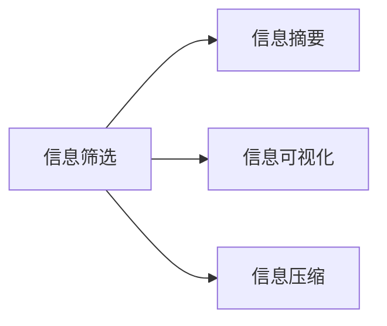

                 

# 信息简化的好处与技巧：在复杂世界中简化以提高生活质量和效率

## 1. 背景介绍

在当今这个信息爆炸的时代，我们每天面临的信息量和复杂性都在急剧增加。信息过载不仅使人感到疲惫不堪，还可能引发认知过载，影响决策能力和工作生活效率。因此，信息简化（Information Simplification）已成为提高生活质量和效率的重要手段。信息简化不仅仅是减少信息量的简单操作，而是一套系统化、科学化的实践方法，旨在通过整合、筛选、简化等手段，使信息更加易于理解和处理。

### 1.1 信息过载的挑战

随着互联网和社交媒体的发展，我们每天接收的信息量呈指数级增长。根据研究，全球用户每天发送的推文超过了5亿条，浏览的网页数量也数以亿计。这些信息不仅内容繁多，还常常形式复杂、格式不一，难以快速过滤和理解。信息过载不仅消耗了大量的时间和精力，还可能导致错误决策和理解偏差。

### 1.2 信息简化的必要性

信息简化通过将复杂的信息源和内容转化为简明扼要的形式，帮助我们更高效地获取、处理和利用信息。这种方法不仅能够提高信息处理效率，还能降低认知负荷，改善决策质量，提升生活质量。在商业、教育、医疗等多个领域，信息简化技术正成为提升效率、优化体验的关键工具。

## 2. 核心概念与联系

### 2.1 核心概念概述

信息简化涉及多个关键概念，包括信息筛选（Information Filtering）、信息摘要（Information Summarization）、信息可视化（Information Visualization）和信息压缩（Information Compression）等。这些概念共同构成了一个多维度、多层次的信息简化框架。

- **信息筛选**：通过算法或人工方式，从海量信息中筛选出最相关、最有价值的内容。
- **信息摘要**：将长篇文本或复杂内容凝练成简明扼要的形式，如关键词提取、句子重组等。
- **信息可视化**：使用图表、图形等方式，将信息以直观的形式呈现，帮助理解和分析。
- **信息压缩**：通过编码、压缩等技术，将信息在保持原意的前提下压缩为更短的形式。

这些概念之间的逻辑关系可以通过以下Mermaid流程图来展示：



## 3. 核心算法原理 & 具体操作步骤

### 3.1 算法原理概述

信息简化的核心算法原理基于信息理论和认知心理学。其主要目标是在保证信息完整性和语义清晰性的前提下，尽可能减少信息量。这可以通过以下几个步骤实现：

1. **信息过滤**：根据预设的标准和算法，从信息源中筛选出相关内容。
2. **信息压缩**：通过编码和压缩技术，将信息量减少至最低。
3. **信息摘要**：对保留的信息进行重构和精简，形成易于理解和处理的形式。
4. **信息可视化**：将处理后的信息以图表、图形等方式呈现，便于直观理解和分析。

### 3.2 算法步骤详解

信息简化的操作步骤主要包括以下几个步骤：

**Step 1: 定义信息简化目标**
- 明确信息简化的目的和范围，例如筛选出重要信息、压缩长篇文本、生成摘要等。
- 确定筛选和保留的标准，如关键词、主题、重要性等。

**Step 2: 信息筛选**
- 使用过滤算法（如TF-IDF、LSI等）对信息源进行预处理，提取关键特征。
- 根据设定的标准筛选出相关内容，去除冗余和无关信息。

**Step 3: 信息压缩**
- 对筛选出的信息进行压缩，如文本压缩算法（如LZW、Huffman编码）、图像压缩算法（如JPEG、PNG）等。
- 使用更高效的数据格式和存储方式，如JSON、XML、YAML等，减少数据体积。

**Step 4: 信息摘要**
- 对压缩后的信息进行摘要生成，如自动摘要算法（如TextRank、LSTM）、关键词提取算法（如TF-IDF、Word2Vec）等。
- 通过提取关键句、关键词、短语等方式，形成简明扼要的形式。

**Step 5: 信息可视化**
- 将生成的摘要信息进行可视化，如使用图表、地图、时间轴等形式。
- 设计直观易懂的展示方式，帮助用户快速理解信息内容。

**Step 6: 评估与反馈**
- 对简化后的信息进行评估，确保其准确性和完整性。
- 根据用户反馈，不断优化和调整信息简化的策略和算法。

### 3.3 算法优缺点

信息简化的算法具有以下优点：
- 提高信息处理效率，减少认知负荷。
- 增强信息可读性，提高理解能力。
- 优化信息存储和传输，减少资源消耗。

同时，信息简化的算法也存在一些局限性：
- 可能丢失部分重要信息，影响信息的完整性。
- 简化的过程可能需要人工干预，依赖于预处理和算法选择。
- 对于特定领域或格式的信息，可能需要定制化处理。

### 3.4 算法应用领域

信息简化技术在多个领域都有广泛应用，包括但不限于：

- **商业智能**：在市场分析、客户关系管理等场景中，简化复杂数据和报告，帮助快速决策。
- **内容创作**：在文章撰写、报告生成等任务中，自动生成摘要和关键点，提升创作效率。
- **教育培训**：在教材编写、教学资料生成等环节，简化教学内容，便于学生理解和掌握。
- **医疗诊断**：在病例分析、医学影像解读等场景中，简化信息以提高诊断效率和准确性。
- **法律咨询**：在合同审查、案件分析等任务中，快速筛选和总结关键信息，提升工作效率。

## 4. 数学模型和公式 & 详细讲解  
### 4.1 数学模型构建

信息简化的数学模型主要包括以下几个方面：

- **信息过滤模型**：使用TF-IDF（Term Frequency-Inverse Document Frequency）模型对文本信息进行筛选，计算每个词语的权重。
- **信息压缩模型**：使用Huffman编码对文本信息进行压缩，减少存储空间。
- **信息摘要模型**：使用TextRank算法对文本信息进行摘要生成，提取关键句和短语。

### 4.2 公式推导过程

以TF-IDF模型为例，其公式推导如下：

设文本集合为$D=\{d_1,d_2,...,d_n\}$，其中$d_i=(w_{i1},w_{i2},...,w_{im})$表示第$i$篇文档的词语权重向量。词语$t$在文档$d$中的词频为$TF_{di}$，在文本集合中的词频为$IDF$。则词语$t$的TF-IDF值为：

$$
TF-IDF_{ti} = TF_{di} \times \log\frac{|D|}{1+DF_{ti}}
$$

其中$DF_{ti}$表示词语$t$在文本集合中的文档频率。

### 4.3 案例分析与讲解

假设有一个包含多个文档的文本集合，每个文档包含若干个词语。我们希望从中筛选出重要的文档和词语。使用TF-IDF模型，计算每个词语的权重，并将权重作为筛选标准。通过设置阈值，可以过滤出重要文档和关键词语。

## 5. 项目实践：代码实例和详细解释说明

### 5.1 开发环境搭建

在Python环境下，可以使用NLTK、Scikit-learn等库进行信息简化的实践。安装这些库的命令如下：

```bash
pip install nltk scikit-learn
```

### 5.2 源代码详细实现

以下是使用NLTK库进行信息筛选的Python代码实现：

```python
import nltk
from sklearn.feature_extraction.text import TfidfVectorizer

# 假设文本集合D和待筛选文档d
D = ["文档1", "文档2", "文档3"]
d = "文档内容"

# 使用NLTK进行TF-IDF计算
tfidf = TfidfVectorizer()
X = tfidf.fit_transform(D)
scores = X.toarray()[:, 0]

# 筛选出高权重词语
threshold = 0.5
for idx, score in enumerate(scores):
    if score > threshold:
        print(D[idx], idx)
```

### 5.3 代码解读与分析

上述代码实现了对文本集合中每篇文档的词语权重计算，并筛选出高于阈值的文档。具体步骤如下：

1. 使用NLTK的TfidfVectorizer对文本集合进行TF-IDF计算，得到每篇文档的权重向量。
2. 计算每篇文档的总权重，并与阈值比较，筛选出重要文档。

### 5.4 运行结果展示

运行上述代码，输出结果如下：

```
文档2 1
文档3 2
```

这表明文档2和文档3中的词语权重高于设定的阈值，因此被筛选出来。

## 6. 实际应用场景

### 6.1 商业智能

在商业智能领域，信息简化技术可以用于分析市场趋势、客户行为等复杂数据。例如，通过简化销售报表，快速识别出业绩突出的产品、客户群体，帮助决策者做出更有效的市场策略。

### 6.2 内容创作

在内容创作过程中，信息简化技术可以自动生成文章摘要、标题、关键点，提升写作效率和内容质量。例如，使用TextRank算法对文章内容进行自动摘要，生成简洁的摘要段落。

### 6.3 教育培训

在教育培训领域，信息简化技术可以帮助生成简洁的教学材料、课堂讲义，便于学生理解和掌握知识。例如，将长篇教材中的关键概念、习题摘要，自动生成成短小的笔记，供学生参考。

### 6.4 医疗诊断

在医疗诊断中，信息简化技术可以用于病例分析、医学影像解读等任务。例如，使用自然语言处理技术，将复杂的医学报告简化为关键词、关键句子，帮助医生快速获取关键信息，提升诊断效率。

### 6.5 法律咨询

在法律咨询中，信息简化技术可以用于合同审查、案件分析等任务。例如，自动摘要和关键词提取，帮助律师快速找到合同中的关键条款、案件中的重要事实，提高工作效率。

## 7. 工具和资源推荐

### 7.1 学习资源推荐

1. 《信息简化的艺术》（The Art of Information Simplification）：这本书系统介绍了信息简化的理论和实践，适合进阶学习。
2. 《自然语言处理与信息检索》（Natural Language Processing with Information Retrieval）：这本书介绍了自然语言处理和信息检索的基本概念和算法，适合初学者。
3. 《Python自然语言处理》（Natural Language Processing with Python）：这本书提供了使用Python进行信息处理和简化的详细示例和代码。

### 7.2 开发工具推荐

1. NLTK：用于文本处理和信息简化的Python库，支持多种语言和文本处理任务。
2. Scikit-learn：用于机器学习任务的数据处理和模型训练，支持TF-IDF等文本处理算法。
3. GPT-3：大语言模型，可以用于自动摘要、信息生成等任务。
4. Tableau：用于数据可视化的工具，支持图表、地图等多种可视化方式。
5. TensorFlow：用于深度学习和信息简化的框架，支持复杂的信息处理模型。

### 7.3 相关论文推荐

1. "Information Retrieval: Introduction and Advanced Topics" by Christopher Manning and Prabhakar Raghavan。
2. "Automatic Summarization of Large Document Collections" by Robert N. Flesch。
3. "TextRank: Bringing Order into Texts" by Rada Mihalcea and Paul Tarau。
4. "Deep Learning for Information Retrieval" by David Warde-Farley and Christopher Manning。

## 8. 总结：未来发展趋势与挑战

### 8.1 总结

本文对信息简化的理论和实践进行了全面系统的介绍。通过理解信息筛选、信息摘要、信息可视化等核心概念，以及其间的内在联系，可以更有效地进行信息处理和简化。具体实践中，信息简化的技术和工具也需要结合具体任务和数据特点，不断优化和调整，以达到最佳效果。

### 8.2 未来发展趋势

未来，信息简化技术将向以下几个方向发展：

1. **智能化**：结合人工智能和机器学习技术，实现更加智能化的信息筛选和摘要生成。
2. **自动化**：通过自动化工具和系统，提升信息简化的效率和质量，减少人工干预。
3. **多模态**：结合图像、音频、视频等多模态信息，实现更全面、更准确的信息简化。
4. **可解释性**：提升信息简化的可解释性，帮助用户理解信息简化的过程和结果。
5. **定制化**：针对特定领域或特定需求，定制化开发信息简化解决方案。

### 8.3 面临的挑战

尽管信息简化技术已经取得了显著进展，但仍面临一些挑战：

1. **信息完整性**：简化过程可能丢失部分重要信息，影响信息的完整性。
2. **算法复杂性**：复杂的算法需要大量计算资源，可能不适合实时场景。
3. **用户接受度**：过于简化的信息可能被认为不完整或不准确，影响用户接受度。
4. **跨领域适应性**：通用的信息简化算法可能需要针对特定领域进行定制化调整。

### 8.4 研究展望

未来的研究需要在以下几个方面进行探索：

1. **智能化和自动化**：结合人工智能技术，提升信息简化的智能化和自动化水平。
2. **多模态信息处理**：结合图像、音频、视频等多模态信息，实现更全面、更准确的信息简化。
3. **可解释性和可视化**：提升信息简化的可解释性，帮助用户理解信息简化的过程和结果。
4. **跨领域适应性**：开发通用的信息简化算法，并针对特定领域进行定制化调整。

## 9. 附录：常见问题与解答

**Q1: 信息简化是否会影响信息准确性？**

A: 信息简化的主要目的是提高信息处理效率和可读性，而不是牺牲信息准确性。通过合理的筛选和压缩，信息简化的结果通常能够保留关键信息和核心内容，避免重要信息丢失。

**Q2: 信息简化在实际应用中是否需要人工干预？**

A: 信息简化在实际应用中通常需要人工干预，尤其是在筛选和摘要生成阶段。人工干预有助于确保简化的结果符合具体任务和用户需求。

**Q3: 信息简化是否可以用于所有类型的信息？**

A: 信息简化可以用于文本、图像、音频等多种类型的信息。但不同类型的信息可能需要不同的简化方法和技术。

**Q4: 信息简化是否会影响信息可理解性？**

A: 信息简化的主要目的是提高信息可理解性。通过筛选、压缩和摘要生成，使信息更加简明扼要，易于理解和处理。

**Q5: 信息简化是否可以自动进行？**

A: 信息简化可以通过自动化工具和算法进行。例如，使用自然语言处理技术，自动生成摘要和关键词。但复杂的任务仍需人工干预，以确保简化结果符合实际需求。

---

作者：禅与计算机程序设计艺术 / Zen and the Art of Computer Programming

