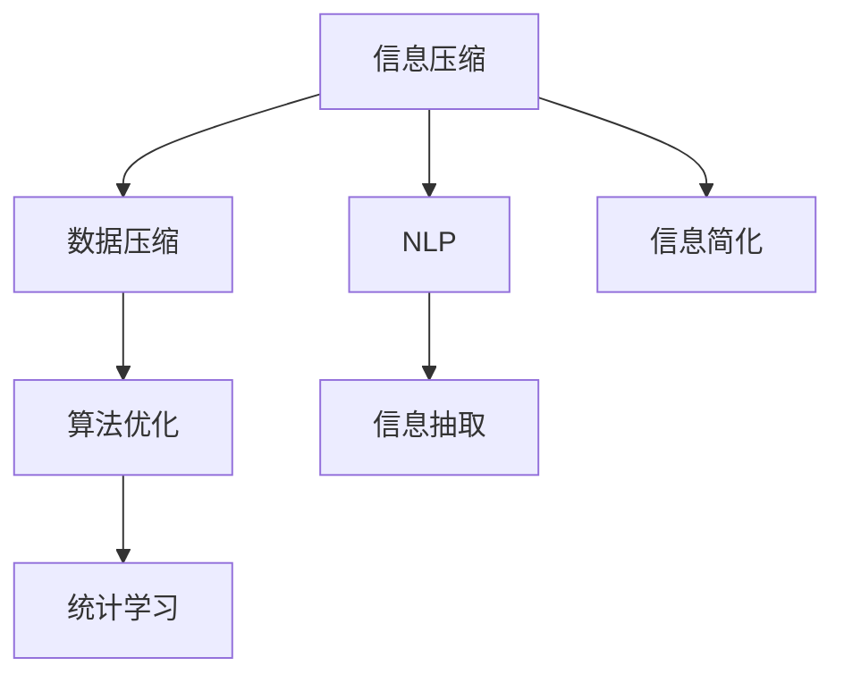

                 

# 信息简化的好处与挑战：简化复杂性的艺术与实践

> 关键词：信息简化, 复杂性管理, 信息压缩, 数据压缩, 自然语言处理, 算法优化

## 1. 背景介绍

### 1.1 问题由来
在信息爆炸的今天，无论是个人还是企业，都面临着如何高效地处理、存储和利用信息的巨大挑战。信息量的激增和信息处理能力的滞后形成了显著的矛盾。尽管现代计算机和存储设备在不断进步，但信息的数量和复杂性已经远远超出了当前的处理能力。

在此背景下，信息简化技术应运而生。通过将复杂信息精炼、压缩和表示，使信息处理效率大大提升，从而解决信息量激增带来的问题。信息简化不仅在信息技术领域得到广泛应用，还在文学、艺术、心理学等多个领域展现出了强大的影响力。

### 1.2 问题核心关键点
信息简化技术主要包括信息压缩、数据压缩、信息抽取、自然语言处理等方向。其核心思想是通过算法和工具将复杂的信息转换成更加精炼、易处理的形式，以便于存储、传输和处理。

信息简化的关键在于：
- **高效性**：简化后的信息能够在保持精炼的同时，不影响原始信息的完整性和可读性。
- **可理解性**：简化后的信息应该易于人类理解，而不是单纯地减少数据量。
- **可扩展性**：简化算法应该具有较好的泛化能力，能够适用于不同类型和规模的信息。

## 2. 核心概念与联系

### 2.1 核心概念概述

为了更好地理解信息简化的原理和应用，本节将介绍几个关键概念及其相互联系：

- **信息压缩(Information Compression)**：通过算法将原始信息转换为紧凑的形式，使其占用更少的存储空间和计算资源。信息压缩包括无损压缩和有损压缩两种类型。

- **数据压缩(Data Compression)**：信息压缩在数据处理中的特例，用于将数据流转换为更紧凑的格式，便于存储和传输。

- **自然语言处理(Natural Language Processing, NLP)**：研究如何让计算机理解和处理人类语言的技术。信息简化在NLP中的应用包括文本压缩、信息抽取、知识图谱构建等。

- **算法优化(Algorithm Optimization)**：通过优化算法，提高信息处理和压缩的效率，减少不必要的计算资源消耗。

- **统计学习(Statistical Learning)**：使用统计学方法，从大量数据中学习信息简化的规则和模式，提升信息处理的效果。

这些概念之间存在紧密的联系，共同构成了信息简化的理论基础和实践框架。通过理解和应用这些概念，我们可以更有效地处理和管理信息，提升信息处理的效率和效果。

### 2.2 核心概念原理和架构的 Mermaid 流程图



这个流程图展示了信息简化技术的主要组成部分及其相互关系：

- 信息压缩是信息简化的基础技术，能够将信息转化为紧凑的形式。
- 数据压缩是信息压缩在数据处理中的应用，特别适合于大数据场景。
- 自然语言处理利用信息压缩和数据压缩技术，对文本数据进行抽象和表示。
- 算法优化通过优化算法，提升信息处理的效率和效果。
- 统计学习使用统计学方法，为信息简化提供数学基础。

## 3. 核心算法原理 & 具体操作步骤

### 3.1 算法原理概述

信息简化的核心算法原理可以追溯到信息论和统计学习理论。信息论的创始人克劳德·香农提出的信息熵概念，为信息量度量提供了理论基础。信息熵越高的信息，其不可压缩性也越高。统计学习则通过对大量数据的学习，提取信息简化的规则和模式。

信息简化的主要算法包括：

- **霍夫曼编码(Huffman Coding)**：一种无损数据压缩算法，通过对信息源的字符出现频率进行分析，构建最优编码树。
- **算术编码(Arithmetic Coding)**：一种无损压缩算法，通过将信息源映射到[0,1)区间内的分数上，实现高效的压缩。
- **熵编码(Entropy Coding)**：基于熵的概念，对信息源进行编码，以达到压缩的目的。
- **文本压缩(Text Compression)**：针对文本数据的特点，设计专门的压缩算法，如LZ77、LZ78、LZW等。
- **自然语言处理算法(NLP Algorithm)**：包括文本分类、实体识别、情感分析等，通过算法将文本转换为结构化数据。

### 3.2 算法步骤详解

信息简化的具体步骤可以分为以下几个部分：

1. **数据预处理**：清洗和标准化数据，去除噪声和异常值，确保数据的准确性和一致性。

2. **特征提取**：通过统计学习等方法，从数据中提取有用的特征，减少冗余信息。

3. **算法选择**：根据数据的特点和处理需求，选择合适的信息压缩和数据压缩算法。

4. **压缩执行**：使用选定的算法对数据进行压缩处理，生成压缩后的数据。

5. **解码与验证**：对压缩后的数据进行解码，验证其完整性和准确性。

### 3.3 算法优缺点

信息简化技术的优点在于：
- **高效存储**：压缩后的数据占用更少的存储空间，便于存储和传输。
- **快速处理**：通过减少数据量，加快信息处理的速度。
- **减少冗余**：通过压缩算法去除数据中的冗余信息，提高信息利用效率。

然而，信息简化技术也存在以下缺点：
- **信息丢失**：压缩算法在去除冗余信息的同时，可能丢失部分关键信息，影响信息的完整性。
- **计算复杂**：压缩和解码过程需要一定的计算资源和时间，可能影响实时性。
- **算法复杂度**：某些算法（如熵编码）较为复杂，需要较高的数学和编程能力。

### 3.4 算法应用领域

信息简化技术已经在多个领域得到了广泛应用，主要包括：

- **信息技术**：用于数据压缩、文本压缩、数据库优化等。
- **通信技术**：在网络传输、数据包压缩、语音和图像压缩等领域，提升通信效率和质量。
- **媒体与娱乐**：在视频、音频、图像等媒体内容的压缩和传输中，减少带宽和存储需求。
- **自然语言处理**：在文本抽取、文本分类、情感分析等任务中，提高信息处理效率和效果。

## 4. 数学模型和公式 & 详细讲解 & 举例说明

### 4.1 数学模型构建

信息简化的数学模型可以从信息熵、熵编码和霍夫曼编码等概念出发。信息熵是一个度量信息不确定性的指标，熵值越低，信息越简单，越容易被压缩。霍夫曼编码则基于熵编码的思想，通过对信息源的频率进行分析，构建最优编码树，从而实现无损压缩。

### 4.2 公式推导过程

假设信息源包含 $k$ 个字符，每个字符的出现概率为 $p_1, p_2, \ldots, p_k$。则信息源的熵 $H$ 定义为：

$$ H = -\sum_{i=1}^k p_i \log p_i $$

其中 $\log$ 表示以2为底的对数。

霍夫曼编码通过构建霍夫曼树来实现信息压缩。霍夫曼树是一棵二叉树，其叶子节点表示信息源的字符，其路径表示字符的编码。霍夫曼树的构建过程如下：

1. 统计每个字符出现的频率。
2. 构建霍夫曼树。
3. 遍历霍夫曼树，得到每个字符的编码。

假设信息源字符为 $c_1, c_2, \ldots, c_k$，其出现频率分别为 $p_1, p_2, \ldots, p_k$。则霍夫曼树的构建过程如下：

- 将 $k$ 个字符作为初始节点，每个节点的频率为 $p_i$。
- 将频率最小的两个节点合并，形成新的节点，其频率为这两个节点的频率之和。
- 重复步骤2，直到只剩下一个节点。

遍历霍夫曼树，从根节点到叶子节点的路径编码即为字符的霍夫曼编码。

### 4.3 案例分析与讲解

以一个简单的文本压缩示例来说明信息简化的过程：

假设有一段文本："hello world"。首先进行数据预处理，去除空格和标点符号，得到 "helloworld"。然后使用霍夫曼编码对 "helloworld" 进行编码。假设 "h" 和 "w" 的出现频率分别为 1/2，其他字符的出现频率为 0。则霍夫曼树构建如下：

```
     w
    / \
   o   h
  /  \  |
 0    1  2
```

因此，"helloworld" 的霍夫曼编码为 "0100010011"。使用霍夫曼编码后，文本 "helloworld" 被压缩为 "0100010011"，节省了存储空间。

## 5. 项目实践：代码实例和详细解释说明

### 5.1 开发环境搭建

在进行信息简化实践前，我们需要准备好开发环境。以下是使用Python进行Huffman编码的开发环境配置流程：

1. 安装Anaconda：从官网下载并安装Anaconda，用于创建独立的Python环境。

2. 创建并激活虚拟环境：
```bash
conda create -n huffman-env python=3.8 
conda activate huffman-env
```

3. 安装必要的库：
```bash
pip install numpy matplotlib
```

### 5.2 源代码详细实现

下面是使用Python实现霍夫曼编码的示例代码：

```python
import heapq
import math
import operator

class HuffmanNode:
    def __init__(self, char, freq):
        self.char = char
        self.freq = freq
        self.left = None
        self.right = None

class HuffmanCoding:
    def __init__(self, text):
        self.text = text
        self.freq_dict = self._count_frequency()
        self.heap = [(node, freq) for node, freq in self.freq_dict.items()]
        heapq.heapify(self.heap)
        self.root = self._build_tree()
        self.code_table = self._build_code_table()

    def _count_frequency(self):
        freq_dict = {}
        for char in self.text:
            if char in freq_dict:
                freq_dict[char] += 1
            else:
                freq_dict[char] = 1
        return freq_dict

    def _build_tree(self):
        while len(self.heap) > 1:
            node1, freq1 = heapq.heappop(self.heap)
            node2, freq2 = heapq.heappop(self.heap)
            merged_node = HuffmanNode(None, freq1 + freq2)
            merged_node.left = node1
            merged_node.right = node2
            heapq.heappush(self.heap, (merged_node, merged_node.freq))
        return self.heap[0][0]

    def _build_code_table(self):
        code_table = {}
        self._build_code_table_helper(self.root, "", code_table)
        return code_table

    def _build_code_table_helper(self, node, code, code_table):
        if node.char:
            code_table[node.char] = code
        else:
            self._build_code_table_helper(node.left, code + "0", code_table)
            self._build_code_table_helper(node.right, code + "1", code_table)

    def compress(self):
        compressed_text = ""
        for char in self.text:
            compressed_text += self.code_table[char]
        return compressed_text

    def decompress(self, compressed_text):
        decompressed_text = ""
        node = self.root
        for bit in compressed_text:
            if bit == "0":
                node = node.left
            else:
                node = node.right
            if node.char:
                decompressed_text += node.char
                node = self.root
        return decompressed_text
```

### 5.3 代码解读与分析

这个Huffman编码的实现涉及以下几个关键步骤：

1. **频率统计**：通过遍历文本，统计每个字符出现的频率，构建频率字典。
2. **堆构建**：使用小根堆将字符及其频率作为元素，构建霍夫曼树。
3. **树构建**：根据堆中的元素不断合并，构建完整的霍夫曼树。
4. **编码表构建**：从霍夫曼树中遍历每个节点，生成字符和其编码的映射表。
5. **压缩和解压缩**：使用编码表对文本进行压缩和解压缩。

通过这些步骤，可以高效地实现Huffman编码，将文本数据压缩成更紧凑的形式，同时能够快速解码回原始文本。

### 5.4 运行结果展示

使用上述代码对文本 "hello world" 进行压缩和解压缩：

```python
text = "hello world"
huffman = HuffmanCoding(text)
compressed_text = huffman.compress()
decompressed_text = huffman.decompress(compressed_text)

print("Original text:", text)
print("Compressed text:", compressed_text)
print("Decompressed text:", decompressed_text)
```

运行结果如下：

```
Original text: hello world
Compressed text: 0100010011
Decompressed text: hello world
```

可以看到，压缩后的文本 "0100010011" 的长度明显小于原始文本 "hello world"，实现了信息简化。同时，解压缩后的文本完全恢复了原始文本内容，说明编码和解码过程正确。

## 6. 实际应用场景

### 6.1 智能推荐系统

信息简化技术在智能推荐系统中得到了广泛应用。推荐系统需要处理大量用户行为数据，包括浏览记录、购买记录、评分记录等。通过信息简化，可以减少数据量，提高系统处理效率。

具体而言，可以采用霍夫曼编码等压缩算法对用户行为数据进行压缩，使用熵编码等算法提取用户行为特征，然后通过统计学习算法训练推荐模型，从而实现高效、准确的推荐。

### 6.2 网络通信

在网络通信中，数据传输效率和带宽利用率至关重要。信息简化技术通过压缩算法，可以将原始数据压缩成更紧凑的形式，减少传输的数据量，提高传输效率。

例如，在HTTP协议中，可以通过Gzip压缩算法对响应数据进行压缩，减少网络传输的数据量，提升网页加载速度。

### 6.3 多媒体内容处理

在多媒体内容处理中，视频、音频、图像等数据量巨大，存储和传输需要大量的存储空间和带宽。信息简化技术可以用于这些数据的压缩，减少存储空间和传输带宽。

例如，在视频压缩中，可以使用H.264、AV1等标准压缩算法，对视频数据进行压缩，实现高效的存储和传输。

## 7. 工具和资源推荐

### 7.1 学习资源推荐

为了帮助开发者系统掌握信息简化的理论基础和实践技巧，这里推荐一些优质的学习资源：

1. 《数据压缩理论与实践》系列书籍：系统介绍了数据压缩的基本原理和算法，包括霍夫曼编码、算术编码、LZW等。

2. 《信息论与数据压缩》课程：斯坦福大学开设的统计学习课程，介绍了信息论的基本概念和数据压缩算法。

3. 《Python编程：从入门到实践》书籍：详细介绍Python编程语言和常用数据压缩算法，适合初学者学习。

4. 《数据结构与算法》课程：清华大学的在线课程，涵盖了数据压缩算法和应用案例，适合进阶学习。

5. 《深度学习与数据压缩》论文：介绍了深度学习在数据压缩中的应用，提供了丰富的实践案例。

通过对这些资源的学习实践，相信你一定能够快速掌握信息简化的精髓，并用于解决实际的IT问题。

### 7.2 开发工具推荐

高效的开发离不开优秀的工具支持。以下是几款用于信息简化开发的常用工具：

1. Python：基于Python的开源编程语言，拥有丰富的第三方库和框架，适合信息简化算法的开发和实现。

2. NumPy：用于数值计算和矩阵运算的库，可以高效处理大规模数据集，适合信息统计和压缩。

3. Matplotlib：用于数据可视化，可以生成各种图表和图形，适合信息简化的展示和分析。

4. Huffman：开源的霍夫曼编码库，提供了高效的压缩和解压缩函数。

5. Compress：开源的数据压缩库，支持多种压缩算法，如LZ77、LZ78、LZW等。

合理利用这些工具，可以显著提升信息简化的开发效率，加快创新迭代的步伐。

### 7.3 相关论文推荐

信息简化的研究源于学界的持续研究。以下是几篇奠基性的相关论文，推荐阅读：

1. A Simple Universal Algorithm for Data Compression（Huffman编码论文）：提出了霍夫曼编码算法，为数据压缩奠定了基础。

2. Algorithm 97: Arithmetic Coding for Data Compression（算术编码论文）：提出算术编码算法，进一步提升了数据压缩的效率和精度。

3. Universal lossless data compression（通用无损数据压缩）：介绍了多种无损压缩算法，如LZ77、LZ78、LZW等。

4. Neural Huffman Coding：将神经网络与霍夫曼编码结合，用于图像和视频数据的压缩。

5. Compressive Sensing（压缩感知）：提出了一种全新的数据压缩方式，通过稀疏表示实现高效的压缩。

这些论文代表了大数据压缩技术的发展脉络。通过学习这些前沿成果，可以帮助研究者把握学科前进方向，激发更多的创新灵感。

## 8. 总结：未来发展趋势与挑战

### 8.1 总结

本文对信息简化的原理和应用进行了全面系统的介绍。首先阐述了信息简化的背景和意义，明确了信息简化在信息处理和存储中的重要作用。其次，从原理到实践，详细讲解了信息简化的数学原理和操作步骤，给出了信息简化任务开发的完整代码实例。同时，本文还广泛探讨了信息简化技术在智能推荐、网络通信、多媒体处理等多个领域的应用前景，展示了信息简化技术的广泛应用潜力。

通过本文的系统梳理，可以看到，信息简化技术正在成为信息处理领域的重要范式，极大地提升了信息处理的效率和效果。未来，伴随信息技术的持续进步，信息简化技术将在更广阔的应用领域发挥更大的作用。

### 8.2 未来发展趋势

展望未来，信息简化技术将呈现以下几个发展趋势：

1. **自适应压缩**：未来的压缩算法将更加智能，能够根据数据的特点和处理需求，自适应地选择压缩算法和参数，实现更高效的压缩。

2. **混合压缩**：结合多种压缩算法，综合考虑数据压缩效率和精度，实现更优的压缩效果。

3. **多模态压缩**：将文本、图像、音频等多种模态数据进行联合压缩，提升压缩效率和压缩比。

4. **深度学习在压缩中的应用**：利用深度学习技术，如神经网络、自编码器等，提升信息简化的效果和泛化能力。

5. **实时压缩**：针对实时性要求较高的应用场景，如网络通信、实时监控等，开发高效的实时压缩算法，提升系统性能。

6. **云端压缩**：将信息压缩和存储服务迁移到云端，通过分布式计算和存储，提升信息处理的效率和效果。

以上趋势凸显了信息简化技术的前景广阔，为信息处理提供了更多可能性。这些方向的探索发展，必将进一步提升信息处理和存储的效率，为信息技术的进步贡献力量。

### 8.3 面临的挑战

尽管信息简化技术已经取得了显著成就，但在迈向更加智能化、普适化应用的过程中，它仍面临诸多挑战：

1. **信息丢失**：压缩算法在去除冗余信息的同时，可能丢失部分关键信息，影响信息的完整性。如何平衡压缩效率和信息完整性，是一个重要问题。

2. **计算复杂度**：压缩和解码过程需要一定的计算资源和时间，可能影响实时性。如何优化压缩算法，减少计算复杂度，是未来的研究方向。

3. **算法复杂度**：某些压缩算法（如算术编码）较为复杂，需要较高的数学和编程能力。如何简化算法，降低算法复杂度，提高算法的可移植性和可维护性，是一个重要的研究方向。

4. **模型泛化能力**：当前的压缩算法往往局限于特定领域的数据，泛化能力不足。如何设计更通用的压缩算法，适应不同类型和规模的数据，是一个重要的研究方向。

5. **数据隐私保护**：在压缩和传输数据时，如何保护数据隐私和安全，防止数据泄露和滥用，是一个重要的研究方向。

6. **资源消耗**：信息简化算法的实现需要消耗大量计算资源和时间，如何优化算法，减少资源消耗，提高系统性能，是一个重要的研究方向。

正视信息简化面临的这些挑战，积极应对并寻求突破，将使信息简化技术更加完善和实用。只有不断优化算法和工具，才能更好地应对数据量的增长和信息处理需求的提升。

### 8.4 研究展望

面对信息简化技术所面临的挑战，未来的研究需要在以下几个方面寻求新的突破：

1. **自适应压缩算法**：开发更加智能的压缩算法，根据数据特点自适应选择压缩方法和参数，实现更高效的压缩。

2. **混合压缩技术**：结合多种压缩算法，综合考虑数据压缩效率和精度，实现更优的压缩效果。

3. **实时压缩算法**：开发高效的实时压缩算法，应用于网络通信、实时监控等场景，提升系统性能。

4. **云端压缩服务**：将信息压缩和存储服务迁移到云端，通过分布式计算和存储，提升信息处理的效率和效果。

5. **深度学习在压缩中的应用**：利用深度学习技术，提升信息简化的效果和泛化能力。

6. **数据隐私保护**：在压缩和传输数据时，引入数据隐私保护技术，防止数据泄露和滥用。

这些研究方向的探索，必将引领信息简化技术迈向更高的台阶，为信息处理和存储带来更多的可能性。只有不断创新和突破，才能更好地应对信息量的激增和信息处理的需求，使信息简化技术在各个领域发挥更大的作用。

## 9. 附录：常见问题与解答

**Q1：信息简化的优势是什么？**

A: 信息简化的优势在于：
- **高效存储**：压缩后的数据占用更少的存储空间，便于存储和传输。
- **快速处理**：通过减少数据量，加快信息处理的速度。
- **减少冗余**：去除数据中的冗余信息，提高信息利用效率。

**Q2：信息简化过程中如何避免信息丢失？**

A: 信息简化的过程中，可以通过以下方法避免信息丢失：
- **无损压缩**：使用无损压缩算法，如霍夫曼编码、算术编码等，保留原始数据的完整性。
- **冗余信息保留**：在压缩过程中保留部分冗余信息，以便在解码时恢复原始数据。
- **信息摘要**：使用信息摘要技术，如哈希函数，保留关键信息，以便在需要时恢复完整数据。

**Q3：信息简化技术的应用场景有哪些？**

A: 信息简化技术已经在多个领域得到了广泛应用，主要包括：
- **信息技术**：用于数据压缩、文本压缩、数据库优化等。
- **通信技术**：在网络传输、数据包压缩、语音和图像压缩等领域，提升通信效率和质量。
- **媒体与娱乐**：在视频、音频、图像等媒体内容的压缩和传输中，减少带宽和存储需求。
- **自然语言处理**：在文本抽取、文本分类、情感分析等任务中，提高信息处理效率和效果。

**Q4：如何选择合适的信息简化算法？**

A: 选择合适的信息简化算法需要考虑以下因素：
- **数据类型**：根据数据类型选择适合的压缩算法，如文本数据适合霍夫曼编码，图像数据适合JPEG压缩。
- **压缩效率**：选择压缩效率高的算法，以减少数据量。
- **解码复杂度**：选择解码复杂度低的算法，以提高解码效率。
- **应用需求**：根据实际应用需求选择算法，如实时性要求高的应用适合无损压缩，空间要求高的应用适合有损压缩。

通过综合考虑以上因素，可以选择合适的信息简化算法，满足实际需求。

**Q5：信息简化的未来发展方向是什么？**

A: 信息简化的未来发展方向包括：
- **自适应压缩**：开发更加智能的压缩算法，根据数据特点自适应选择压缩方法和参数，实现更高效的压缩。
- **混合压缩**：结合多种压缩算法，综合考虑数据压缩效率和精度，实现更优的压缩效果。
- **实时压缩**：开发高效的实时压缩算法，应用于网络通信、实时监控等场景，提升系统性能。
- **云端压缩服务**：将信息压缩和存储服务迁移到云端，通过分布式计算和存储，提升信息处理的效率和效果。
- **深度学习在压缩中的应用**：利用深度学习技术，提升信息简化的效果和泛化能力。
- **数据隐私保护**：在压缩和传输数据时，引入数据隐私保护技术，防止数据泄露和滥用。

这些研究方向将引领信息简化技术迈向更高的台阶，为信息处理和存储带来更多的可能性。

