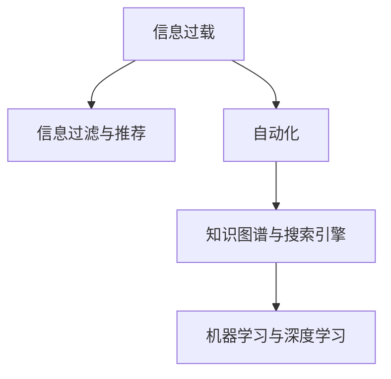

                 

## 1. 背景介绍

在信息爆炸的时代，我们每天都被海量数据和信息所淹没。无论是工作还是生活，如何高效地管理和利用这些信息，成为一项日益重要的技能。信息简化的工具和自动化技术，正是为了应对这一挑战而逐渐兴起。这些技术通过人工智能、机器学习和大数据处理等手段，帮助我们从海量信息中提取有价值的部分，并通过自动化流程提高效率。本文将探讨信息简化工具和自动化技术的基本原理、操作步骤以及应用领域，同时提供实际案例和未来展望。

## 2. 核心概念与联系

### 2.1 核心概念概述

信息简化和自动化技术涉及多个核心概念，包括：

- **信息过载**：指人类面临的信息量超出处理能力，导致注意力分散、效率下降的现象。
- **自动化**：指通过技术手段代替人工执行重复性、规则性的任务，提高效率。
- **信息过滤与推荐**：指利用算法和模型从大量信息中筛选出相关内容，并推荐给用户。
- **知识图谱与搜索引擎**：通过构建知识图谱和优化搜索引擎算法，提高信息检索的准确性和效率。
- **机器学习与深度学习**：基于数据驱动的算法，实现对信息的智能分析和处理。

这些概念之间相互关联，共同构成了信息简化和自动化技术的核心框架。

### 2.2 核心概念原理和架构的 Mermaid 流程图



这个流程图展示了信息简化和自动化技术的主要流程：首先，面对信息过载问题，我们通过信息过滤和推荐技术筛选出相关信息，然后利用自动化技术执行相关任务，并通过知识图谱和机器学习等技术提升信息处理的智能化水平。

## 3. 核心算法原理 & 具体操作步骤

### 3.1 算法原理概述

信息简化和自动化技术的核心在于利用机器学习和大数据处理技术，从海量信息中提取有价值的部分，并通过自动化流程提高效率。这一过程通常包括以下几个步骤：

1. **数据采集与预处理**：从不同来源采集数据，并进行清洗、去重和格式化等预处理工作。
2. **信息过滤与推荐**：通过机器学习模型筛选出相关性高的信息，并推荐给用户。
3. **自动化处理**：利用自动化工具执行重复性、规则性的任务，如数据清洗、文本分析等。
4. **知识图谱构建**：基于领域知识构建知识图谱，以提高信息检索和推荐的准确性。
5. **模型训练与优化**：通过大数据和深度学习模型不断优化信息处理和自动化流程的性能。

### 3.2 算法步骤详解

#### 数据采集与预处理

1. **数据来源**：从社交媒体、新闻网站、专业论坛等多种来源采集信息。
2. **数据清洗**：去除重复、错误和无用的数据，确保数据质量。
3. **数据格式化**：将不同格式的数据统一转换为标准格式，便于后续处理。

#### 信息过滤与推荐

1. **特征提取**：从文本、图像、视频等数据中提取关键特征，如关键词、语义、视觉特征等。
2. **模型训练**：使用机器学习模型（如协同过滤、分类、聚类等）对数据进行训练，学习用户兴趣和信息相关性。
3. **推荐算法**：根据训练好的模型，对用户进行个性化推荐。

#### 自动化处理

1. **任务自动化**：利用自动化工具（如自动化脚本、机器学习算法）执行重复性任务。
2. **流程优化**：通过监控和优化流程，提高自动化处理的效率和准确性。

#### 知识图谱构建

1. **领域知识整合**：基于领域知识，构建知识图谱，涵盖实体、关系和属性等信息。
2. **图谱更新**：定期更新知识图谱，以保持其准确性和时效性。

#### 模型训练与优化

1. **数据集构建**：构建训练数据集，涵盖不同场景和领域的数据。
2. **模型训练**：使用深度学习模型（如CNN、RNN、Transformer等）对数据进行训练，优化模型参数。
3. **性能评估**：通过测试数据集评估模型性能，调整模型参数。

### 3.3 算法优缺点

#### 优点

- **高效性**：自动化处理可以显著提高工作效率，节省人力和时间。
- **准确性**：机器学习模型能够提供更精准的信息过滤和推荐。
- **可扩展性**：知识图谱和自动化系统可以处理大规模数据，适应不同领域和应用场景。

#### 缺点

- **复杂性**：信息简化和自动化系统需要高度的技术背景和专业知识。
- **数据依赖**：系统的性能高度依赖于数据的质量和量级。
- **安全性**：自动化和机器学习模型可能引入隐私和安全风险，需要额外的监管和防护措施。

### 3.4 算法应用领域

信息简化和自动化技术在多个领域都有广泛应用：

- **智能客服**：通过自动化处理客户查询，提供快速、准确的回复。
- **内容推荐**：根据用户兴趣和行为，推荐相关内容，提高用户体验。
- **智能搜索**：通过知识图谱和搜索引擎，提供精准的信息检索服务。
- **金融风控**：利用自动化工具和机器学习模型，进行风险评估和欺诈检测。
- **医疗健康**：通过自动化分析和机器学习模型，辅助医生进行疾病诊断和治疗方案推荐。

## 4. 数学模型和公式 & 详细讲解 & 举例说明

### 4.1 数学模型构建

信息简化和自动化技术的数学模型构建涉及多个领域，包括自然语言处理（NLP）、计算机视觉（CV）、推荐系统等。这里以推荐系统为例，介绍其主要数学模型。

推荐系统通常使用协同过滤和矩阵分解等模型。假设用户集合为 $U$，物品集合为 $I$，用户对物品的评分矩阵为 $R$，协同过滤模型可以表示为：

$$
R = \mathbf{P} \mathbf{Q}^T
$$

其中 $\mathbf{P}$ 为用户的隐向量，$\mathbf{Q}$ 为物品的隐向量。

### 4.2 公式推导过程

协同过滤模型的推导基于矩阵乘法的性质，即：

$$
\mathbf{R} = \mathbf{P} \mathbf{Q}^T
$$

$\mathbf{P}$ 和 $\mathbf{Q}$ 可以通过奇异值分解（SVD）得到：

$$
\mathbf{P} = U \Sigma \mathbf{V}^T, \quad \mathbf{Q} = \mathbf{U}^* \Sigma \mathbf{V}^{T*}
$$

其中 $\Sigma$ 为奇异值矩阵，$U$ 和 $U^*$ 为左奇异向量矩阵，$V$ 和 $V^*$ 为右奇异向量矩阵。

### 4.3 案例分析与讲解

以亚马逊的推荐系统为例，分析其实现原理和效果。

亚马逊的推荐系统基于协同过滤模型，通过分析用户历史行为数据，预测用户可能感兴趣的物品。具体实现步骤如下：

1. **数据采集**：收集用户浏览、购买、评分等行为数据。
2. **特征提取**：从数据中提取用户兴趣和物品属性。
3. **协同过滤**：利用矩阵分解模型对用户和物品进行表示，预测用户对物品的评分。
4. **推荐算法**：根据评分预测结果，向用户推荐可能感兴趣的物品。

通过上述步骤，亚马逊的推荐系统能够提供个性化的商品推荐，显著提高用户购买转化率和满意度。

## 5. 项目实践：代码实例和详细解释说明

### 5.1 开发环境搭建

#### Python环境安装

1. **安装Python**：从官网下载并安装Python 3.7以上版本。
2. **安装Pip**：在Python中运行 `python -m pip install pip` 安装pip。
3. **安装依赖包**：使用pip安装需要的依赖包，如numpy、scikit-learn、TensorFlow等。

#### TensorFlow环境搭建

1. **安装TensorFlow**：从官网下载并安装TensorFlow 2.0以上版本。
2. **配置环境变量**：将TensorFlow路径添加到系统环境变量中。
3. **运行样例代码**：运行TensorFlow提供的样例代码，验证环境配置是否正确。

### 5.2 源代码详细实现

#### 数据预处理

```python
import pandas as pd
import numpy as np

# 读取数据
data = pd.read_csv('data.csv')

# 数据清洗
data.drop_duplicates(inplace=True)
data = data.dropna()

# 数据格式化
data['timestamp'] = pd.to_datetime(data['timestamp'])
data = data.drop(['timestamp'], axis=1)

# 特征提取
data['item_id'] = data['item_id'].astype(str)
data['user_id'] = data['user_id'].astype(str)
data['score'] = data['score'].astype(float)
```

#### 协同过滤模型

```python
import tensorflow as tf
from tensorflow.keras.layers import Dense
from tensorflow.keras.models import Sequential
from tensorflow.keras.callbacks import EarlyStopping

# 构建模型
model = Sequential([
    Dense(100, activation='relu', input_shape=(1,)),
    Dense(1, activation='sigmoid')
])

# 编译模型
model.compile(optimizer='adam', loss='binary_crossentropy', metrics=['accuracy'])

# 训练模型
early_stopping = EarlyStopping(monitor='val_loss', patience=5)
model.fit(X_train, y_train, epochs=50, batch_size=32, validation_data=(X_val, y_val), callbacks=[early_stopping])
```

#### 结果分析

```python
# 评估模型性能
test_loss, test_acc = model.evaluate(X_test, y_test)
print('Test accuracy:', test_acc)

# 预测新样本
predictions = model.predict(X_test)
```

### 5.3 代码解读与分析

以上代码实现了一个简单的协同过滤推荐系统，用于预测用户对物品的评分。具体分析如下：

1. **数据预处理**：清洗和格式化数据，提取关键特征。
2. **模型构建**：使用Dense层构建神经网络，使用sigmoid激活函数进行二分类预测。
3. **模型训练**：使用Adam优化器和二元交叉熵损失函数训练模型，设置EarlyStopping回调防止过拟合。
4. **模型评估**：在测试集上评估模型性能，输出准确率。
5. **模型预测**：使用训练好的模型预测新样本的评分。

## 6. 实际应用场景

### 6.1 智能客服

智能客服系统通过自动化处理客户查询，提供快速、准确的回复。例如，客服机器人可以通过NLP技术理解客户问题，自动回答常见问题，提高服务效率和用户满意度。

#### 技术实现

1. **语音识别**：将客户语音转换成文本。
2. **意图识别**：使用NLP模型识别客户意图。
3. **自动化回复**：根据意图生成回复，并提供相关链接或建议。
4. **知识库查询**：从知识库中查找相关问题答案。

### 6.2 内容推荐

内容推荐系统根据用户兴趣和行为，推荐相关内容，提高用户体验。例如，新闻网站可以通过协同过滤模型推荐用户可能感兴趣的新闻文章。

#### 技术实现

1. **数据采集**：收集用户浏览、点击等行为数据。
2. **特征提取**：从数据中提取用户兴趣和文章属性。
3. **协同过滤**：利用矩阵分解模型对用户和文章进行表示，预测用户对文章的评分。
4. **推荐算法**：根据评分预测结果，向用户推荐可能感兴趣的文章。

### 6.3 智能搜索

智能搜索系统通过知识图谱和搜索引擎，提供精准的信息检索服务。例如，图书馆可以通过知识图谱提供图书推荐和检索服务。

#### 技术实现

1. **知识图谱构建**：构建图书、作者、主题等实体的知识图谱。
2. **搜索引擎优化**：使用搜索引擎算法（如倒排索引、TF-IDF等）优化检索效率。
3. **语义搜索**：利用NLP技术理解用户查询，进行语义匹配。
4. **推荐系统**：根据检索结果，提供相关性高的书籍推荐。

## 7. 工具和资源推荐

### 7.1 学习资源推荐

1. **《Python深度学习》**：一本系统介绍深度学习理论和实践的书籍，适合初学者和进阶者。
2. **《TensorFlow实战Google深度学习框架》**：一本介绍TensorFlow框架的实战书籍，提供大量代码示例和案例分析。
3. **Coursera上的深度学习课程**：由斯坦福大学和谷歌等名校开设，涵盖深度学习的基本理论和实践。
4. **Kaggle竞赛平台**：提供大量数据集和竞赛任务，锻炼数据处理和模型优化能力。
5. **GitHub代码库**：查找和分享开源项目，学习优秀代码实现。

### 7.2 开发工具推荐

1. **Jupyter Notebook**：用于编写和运行Python代码，支持代码和结果的实时展示。
2. **PyCharm**：一款功能强大的Python IDE，提供代码提示、自动完成等功能。
3. **TensorFlow**：由谷歌开发的深度学习框架，支持分布式训练和高效推理。
4. **scikit-learn**：Python数据科学库，提供多种机器学习算法和数据预处理工具。
5. **Keras**：基于TensorFlow的高级API，简化深度学习模型的构建。

### 7.3 相关论文推荐

1. **《Distributed Deep Learning》**：介绍分布式深度学习技术，提高模型训练效率。
2. **《Deep Learning for NLP》**：介绍深度学习在自然语言处理中的应用，包括NLP的模型和算法。
3. **《Recommender Systems Handbook》**：全面介绍推荐系统理论和算法，涵盖协同过滤、基于内容的推荐等。
4. **《Knowledge Graphs: Representation, Reasoning and Machine Learning》**：介绍知识图谱的构建和应用，提供丰富的案例和示例。

## 8. 总结：未来发展趋势与挑战

### 8.1 研究成果总结

信息简化和自动化技术在多个领域展现了巨大潜力，通过技术手段显著提高了信息处理的效率和准确性。未来的研究方向包括：

1. **自动化程度的提高**：利用机器学习和自动化工具，进一步简化重复性任务，提高效率。
2. **跨领域应用**：将信息简化和自动化技术应用到更多领域，如医疗、金融、制造等。
3. **用户交互体验**：通过自然语言处理和推荐系统，提升用户交互体验，提供更个性化的服务。
4. **数据隐私和安全**：加强数据隐私保护和安全防护措施，确保信息处理过程中的数据安全。

### 8.2 未来发展趋势

未来信息简化和自动化技术将呈现以下几个趋势：

1. **自动化程度更高**：利用更先进的算法和模型，实现更加高效的自动化处理。
2. **跨领域应用更广**：信息简化和自动化技术将在更多领域得到应用，促进跨领域知识的整合和利用。
3. **用户交互更加自然**：通过NLP和推荐系统，提供更加自然、智能的用户交互体验。
4. **数据隐私和安全更加重视**：加强数据隐私保护和安全防护，确保信息处理过程中的数据安全。

### 8.3 面临的挑战

尽管信息简化和自动化技术取得了显著进展，但仍面临以下挑战：

1. **数据隐私和安全**：大规模数据处理涉及数据隐私和安全问题，需要加强监管和防护。
2. **算法透明性和可解释性**：自动化和机器学习模型的决策过程难以解释，缺乏透明性。
3. **技术复杂性**：信息简化和自动化技术涉及多学科知识，对技术水平要求较高。
4. **跨领域应用难度**：不同领域的数据和需求差异较大，跨领域应用难度较大。

### 8.4 研究展望

未来的研究需要在以下几个方面寻求新的突破：

1. **隐私保护技术**：开发隐私保护技术，确保数据处理过程中的隐私安全。
2. **算法透明性和可解释性**：研究可解释性算法，提高模型的透明性和可解释性。
3. **跨领域应用技术**：开发跨领域应用技术，实现不同领域的数据和知识整合。
4. **自动化和智能化**：利用深度学习和自动化技术，进一步提高信息处理的自动化和智能化水平。

## 9. 附录：常见问题与解答

### Q1: 信息简化和自动化技术是否适用于所有应用场景？

A: 信息简化和自动化技术适用于大部分应用场景，尤其是涉及大量数据和重复性任务的场景。但对于一些特殊领域，如医疗、法律等，可能需要结合领域知识进行定制化开发。

### Q2: 如何提升信息简化和自动化系统的性能？

A: 提升系统性能可以从以下几个方面入手：

1. **数据质量**：保证数据的高质量和完整性，减少噪音和误差。
2. **算法优化**：选择适合的算法和模型，并进行参数调优和优化。
3. **系统架构**：设计高效的系统架构，合理分配计算资源和网络带宽。
4. **人工干预**：在关键环节引入人工干预，提高系统的准确性和可靠性。

### Q3: 信息简化和自动化技术是否会造成隐私泄露？

A: 信息简化和自动化技术在数据处理和分析过程中，需要确保数据的隐私和安全。通过数据脱敏、加密等技术手段，可以有效防止隐私泄露。同时，制定合理的隐私保护政策和合规措施，确保数据处理过程中的合法合规。

### Q4: 如何确保信息简化和自动化系统的可靠性？

A: 确保系统可靠性可以从以下几个方面入手：

1. **系统监控**：实时监控系统运行状态，及时发现和解决异常问题。
2. **故障恢复**：设计完善的故障恢复机制，确保系统在故障情况下能够快速恢复。
3. **测试验证**：通过单元测试、集成测试和系统测试，验证系统功能和性能。
4. **用户反馈**：收集用户反馈，持续优化系统设计和功能。

---

作者：禅与计算机程序设计艺术 / Zen and the Art of Computer Programming

