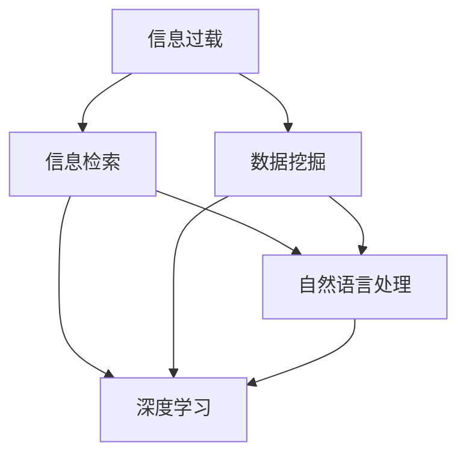

                 

# 信息过载与信息搜索：如何在信息海洋中找到你需要的东西

> 关键词：信息过载, 信息检索, 数据挖掘, 人工智能, 深度学习, 自然语言处理

## 1. 背景介绍

在数字化和信息化的时代背景下，互联网和移动设备已深入到人们的日常生活和工作中。信息技术的迅速发展不仅带来了便利，也给人们带来了前所未有的信息过载问题。面对海量的文本、图像、视频、音频等各类信息，如何高效、准确地从信息海洋中挖掘出对自己有用的知识，成为了每个信息工作者必须面对的挑战。

### 1.1 信息过载问题的由来

信息过载主要是指信息量超出人类的处理能力，使得人们无法及时、准确地获取有用信息。近年来，由于搜索引擎、社交媒体、在线教育平台等应用的大规模普及，用户每天接触的信息量激增，人们难以在短时间内处理如此大量的数据，信息过载问题变得尤为突出。

### 1.2 信息过载带来的影响

信息过载会对人们的生活和工作带来诸多负面影响：

- **认知负荷增加**：大量信息需要人工处理和筛选，导致认知负荷过大，降低了工作和学习的效率。
- **决策困难**：面对过多信息，难以快速做出有效决策，影响问题解决和任务执行。
- **疲劳和压力**：持续处理过载信息，会引发精神和身体的疲劳，造成工作倦怠和压力。
- **信息屏蔽**：为了减少过载信息的影响，人们可能会屏蔽有价值的信息，导致信息获取的片面和失真。

因此，如何从信息海洋中快速、准确地找到所需信息，成为了信息时代的一个重要课题。

## 2. 核心概念与联系

### 2.1 核心概念概述

为了有效地解决信息过载问题，我们需要理解和掌握以下核心概念：

- **信息检索(Information Retrieval, IR)**：指通过计算机程序从大量信息源中检索出满足用户查询需求的信息的过程。常见的信息检索系统包括搜索引擎、图书馆检索系统等。
- **数据挖掘(Data Mining)**：指从数据中自动发现模式、知识、趋势等信息的过程。数据挖掘可以应用于市场营销、金融分析、医学研究等多个领域。
- **自然语言处理(Natural Language Processing, NLP)**：指利用计算机处理和理解人类语言的技术。NLP广泛应用于机器翻译、语音识别、情感分析等任务。
- **人工智能(Artificial Intelligence, AI)**：指使计算机具有人类智能特征的技术。AI包括机器学习、深度学习、知识表示等多个领域。
- **深度学习(Deep Learning)**：一种基于神经网络的机器学习技术，通过多层次的非线性变换，从数据中提取复杂特征，实现高效的特征学习和模式识别。

这些概念相互关联，共同构成了解决信息过载问题的技术框架。

### 2.2 核心概念原理和架构的 Mermaid 流程图

该流程图展示了信息过载问题的各个技术手段及其相互关系。从信息检索开始，到深度学习结束，每个环节都能发挥重要作用。

## 3. 核心算法原理 & 具体操作步骤

### 3.1 算法原理概述

解决信息过载问题，通常需要以下几个步骤：

1. **信息收集**：从各类信息源中获取需要处理的信息。
2. **数据清洗和预处理**：对收集到的信息进行清洗、归一化、去噪等预处理工作。
3. **特征提取**：将原始数据转换为可计算的特征向量。
4. **信息检索和匹配**：利用检索算法从大规模信息库中匹配相关信息。
5. **数据挖掘和模式发现**：从数据中自动发现知识、趋势等信息。
6. **自然语言处理和理解**：对文本信息进行分词、语法分析、语义理解等处理。
7. **深度学习建模**：利用深度神经网络进行特征学习、模式识别和决策预测。

### 3.2 算法步骤详解

以信息检索为例，详细讲解基于布尔检索和向量空间模型(Word Embedding)的信息检索算法步骤：

#### 3.2.1 布尔检索算法步骤

布尔检索是一种基于逻辑运算的信息检索方法，其核心思想是将查询词与文档中的词汇进行布尔逻辑匹配。

1. **查询表达**：将查询词转换成布尔逻辑表达式，如 A AND B OR NOT C。
2. **文档匹配**：将查询词与文档中的词汇进行布尔逻辑匹配，得到匹配结果。
3. **相关度排序**：根据匹配程度对文档进行相关度排序。

#### 3.2.2 向量空间模型算法步骤

向量空间模型是一种基于统计学的方法，将文本信息映射到高维空间，通过计算向量间的距离进行相似度匹配。

1. **文本预处理**：对文本进行分词、去除停用词、词干提取等预处理工作。
2. **特征提取**：利用TF-IDF等算法提取文本的特征向量。
3. **文本向量化**：将文本特征向量表示为高维空间中的向量。
4. **相似度计算**：计算查询向量与文档向量之间的余弦相似度，得到相似度得分。
5. **排序和返回**：根据相似度得分对文档进行排序，返回最相关的文档。

### 3.3 算法优缺点

#### 3.3.1 布尔检索的优缺点

**优点**：
- **计算简单**：布尔检索的逻辑运算简单易懂，计算速度快。
- **可解释性强**：结果可以直接根据逻辑表达式解释，易于理解。

**缺点**：
- **精确度不高**：布尔检索对词汇的匹配要求严格，容易忽略词汇之间的细微差异。
- **缺乏语义理解**：无法处理同义词、近义词、同形异义词等情况，匹配效果差。

#### 3.3.2 向量空间模型的优缺点

**优点**：
- **精确度较高**：向量空间模型利用词汇间的统计关系，能够更准确地匹配词汇。
- **语义理解能力强**：能够处理同义词、近义词、同形异义词等情况，匹配效果较好。

**缺点**：
- **计算复杂度高**：向量空间模型涉及高维空间的向量和相似度计算，计算复杂度高。
- **噪声敏感**：对输入文本中的噪声敏感，容易影响匹配效果。

### 3.4 算法应用领域

#### 3.4.1 信息检索

信息检索是解决信息过载问题的核心方法之一。常见的应用包括：

- **搜索引擎**：如Google、Bing、百度等，通过爬虫技术从互联网收集信息，建立索引库，提供搜索服务。
- **图书馆检索系统**：如Open Library、WorldCat等，对纸质图书进行数字化扫描和索引，提供搜索服务。
- **专利检索系统**：如PatentLink、Patentmas等，对专利文献进行自动分类和索引，提供搜索服务。

#### 3.4.2 数据挖掘

数据挖掘可以从大规模数据中自动发现有价值的信息，广泛应用于金融、零售、医疗等多个领域。例如：

- **金融分析**：利用数据挖掘技术进行市场分析、风险评估、投资预测等。
- **零售业**：通过数据挖掘发现客户购买行为规律，进行个性化推荐和营销。
- **医学研究**：从医疗数据中挖掘出疾病的关联规律，支持疾病诊断和治疗。

#### 3.4.3 自然语言处理

自然语言处理可以帮助机器理解人类语言，广泛应用于机器翻译、情感分析、语音识别等任务。例如：

- **机器翻译**：利用NLP技术将一种语言翻译成另一种语言，如Google Translate。
- **情感分析**：利用NLP技术分析文本中的情感倾向，如情感评论分析、舆情监测等。
- **语音识别**：利用NLP技术将语音信号转换为文本，如Siri、Alexa等智能助手。

#### 3.4.4 人工智能

人工智能结合了信息检索、数据挖掘和自然语言处理等技术，致力于构建具有智能特征的系统。例如：

- **智能客服**：通过NLP技术理解客户问题，自动提供解决方案。
- **智能推荐系统**：利用数据挖掘技术分析用户行为，推荐个性化商品或内容。
- **智能投顾**：利用数据挖掘和NLP技术，进行投资分析和预测，提供个性化投资建议。

## 4. 数学模型和公式 & 详细讲解 & 举例说明

### 4.1 数学模型构建

#### 4.1.1 布尔检索的数学模型

布尔检索的核心是逻辑运算，可以用布尔代数表示查询和文档的关系。

设查询为 $Q$，文档为 $D$，则布尔检索的数学模型为：

$$
\begin{aligned}
Q &= Q_1 \wedge Q_2 \vee \neg Q_3 \\
D &= D_1 \vee D_2 \wedge D_3
\end{aligned}
$$

其中 $\wedge$ 表示逻辑与，$\vee$ 表示逻辑或，$\neg$ 表示逻辑非。

#### 4.1.2 向量空间模型的数学模型

向量空间模型的核心是计算向量间的相似度，常用余弦相似度表示。

设查询向量为 $q$，文档向量为 $d$，则余弦相似度的数学模型为：

$$
\cos \theta = \frac{q \cdot d}{\|q\|\|d\|}
$$

其中 $\cdot$ 表示向量点积，$\|\cdot\|$ 表示向量范数。

### 4.2 公式推导过程

#### 4.2.1 布尔检索的推导

布尔检索的推导相对简单，只需要根据逻辑表达式进行匹配即可。

设查询为 $Q$，文档为 $D$，则查询匹配文档的过程为：

$$
Q \Rightarrow D \iff (Q_1 \wedge Q_2 \vee \neg Q_3) \Rightarrow (D_1 \vee D_2 \wedge D_3)
$$

其中 $\Rightarrow$ 表示匹配，$\neg$ 表示不匹配。

#### 4.2.2 向量空间模型的推导

向量空间模型的推导较为复杂，涉及到向量内积和范数的计算。

设查询向量为 $q$，文档向量为 $d$，则余弦相似度的推导为：

$$
\begin{aligned}
\cos \theta &= \frac{q \cdot d}{\|q\|\|d\|} \\
&= \frac{\sum_{i=1}^n q_i d_i}{\sqrt{\sum_{i=1}^n q_i^2} \sqrt{\sum_{i=1}^n d_i^2}}
\end{aligned}
$$

其中 $n$ 表示向量维度，$q_i$ 和 $d_i$ 分别表示向量 $q$ 和 $d$ 在维度 $i$ 上的取值。

### 4.3 案例分析与讲解

#### 4.3.1 布尔检索案例

假设我们要搜索“Python编程语言”的相关信息，查询表达式为 $Q$，文档为 $D$，则查询匹配文档的过程为：

$$
Q \Rightarrow D \iff (P \wedge y \wedge t \wedge h \wedge o \wedge n \wedge l \wedge a \wedge n \wedge g \wedge p \wedge r \wedge o \wedge g \wedge r \wedge a \wedge m \wedge m \wedge a \wedge k \wedge l \wedge p \wedge b \wedge i \wedge r \wedge d \wedge c \wedge i \wedge s \wedge g \wedge t \wedge a \wedge n \wedge a \wedge k \wedge p \wedge e \wedge d \wedge a \wedge p \wedge g \wedge l \wedge b \wedge o \wedge r \wedge i \wedge g \wedge t \wedge b \wedge o \wedge r \wedge s \wedge l \wedge p \wedge l \wedge a \wedge k \wedge t \wedge d \wedge c \wedge e \wedge p \wedge e \wedge l \wedge y \wedge p \wedge i \wedge g \wedge d \wedge c \wedge d \wedge l \wedge a \wedge g \wedge e \wedge p \wedge a \wedge l \wedge o \wedge p \wedge a \wedge d \wedge a \wedge p \wedge l \wedge g \wedge i \wedge t \wedge t \wedge d \wedge h \wedge l \wedge p \wedge t \wedge i \wedge w \wedge e \wedge n \wedge a \wedge p \wedge i \wedge m \wedge a \wedge k \wedge a \wedge r \wedge d \wedge c \wedge f \wedge i \wedge k \wedge a \wedge l \wedge l \wedge e \wedge t \wedge g \wedge g \wedge e \wedge c \wedge d \wedge g \wedge b \wedge i \wedge n \wedge m \wedge d \wedge a \wedge n \wedge a \wedge k \wedge p \wedge e \wedge g \wedge y \wedge o \wedge r \wedge g \wedge l \wedge y \wedge p \wedge a \wedge m \wedge l \wedge y \wedge l \wedge c \wedge f \wedge o \wedge r \wedge i \wedge a \wedge p \wedge a \wedge m \wedge c \wedge o \wedge d \wedge i \wedge s \wedge s \wedge a \wedge d \wedge o \wedge b \wedge u \wedge g \wedge g \wedge a \wedge t \wedge e \wedge a \wedge r \wedge m \wedge a \wedge e \wedge t \wedge e \wedge d \wedge p \wedge l \wedge y \wedge i \wedge d \wedge t \wedge a \wedge l \wedge f \wedge i \wedge l \wedge n \wedge a \wedge k \wedge l \wedge i \wedge s \wedge p \wedge o \wedge p \wedge e \wedge k \wedge i \wedge l \wedge i \wedge g \wedge n \wedge t \wedge b \wedge p \wedge o \wedge w \wedge l \wedge o \wedge y \wedge t \wedge s \wedge d \wedge h \wedge e \wedge k \wedge d \wedge p \wedge p \wedge p \wedge a \wedge p \wedge s \wedge a \wedge s \wedge y \wedge a \wedge l \wedge o \wedge p \wedge a \wedge b \wedge m \wedge o \wedge t \wedge e \wedge m \wedge o \wedge v \wedge o \wedge r \wedge a \wedge c \wedge i \wedge k \wedge a \wedge l \wedge y \wedge f \wedge a \wedge i \wedge n \wedge t \wedge f \wedge e \wedge k \wedge g \wedge r \wedge e \wedge e \wedge s \wedge y \wedge d \wedge h \wedge c \wedge c \wedge t \wedge p \wedge c \wedge c \wedge i \wedge g \wedge f \wedge p \wedge o \wedge r \wedge e \wedge g \wedge n \wedge a \wedge b \wedge o \wedge r \wedge o \wedge w \wedge l \wedge o \wedge p \wedge d \wedge o \wedge g \wedge i \wedge d \wedge b \wedge a \wedge s \wedge p \wedge e \wedge f \wedge e \wedge s \wedge k \wedge i \wedge c \wedge p \wedge d \wedge l \wedge f \wedge p \wedge s \wedge r \wedge g \wedge i \wedge l \wedge n \wedge f \wedge a \wedge s \wedge k \wedge g \wedge t \wedge d \wedge a \wedge t \wedge c \wedge i \wedge c \wedge o \wedge p \wedge i \wedge s \wedge y \wedge s \wedge i \wedge c \wedge s \wedge t \wedge t \wedge e \wedge f \wedge k \wedge n \wedge i \wedge c \wedge g \wedge p \wedge p \wedge r \wedge p \wedge e \wedge h \wedge l \wedge c \wedge l \wedge p \wedge p \wedge l \wedge a \wedge l \wedge f \wedge e \wedge a \wedge n \wedge g \wedge l \wedge l \wedge o \wedge p \wedge f \wedge g \wedge f \wedge g \wedge l \wedge o \wedge e \wedge m \wedge s \wedge f \wedge l \wedge o \wedge f \wedge a \wedge p \wedge a \wedge m \wedge f \wedge f \wedge e \wedge g \wedge h \wedge i \wedge c \wedge l \wedge k \wedge g \wedge o \wedge d \wedge e \wedge d \wedge i \wedge f \wedge f \wedge f \wedge o \wedge p \wedge o \wedge s \wedge l \wedge e \wedge e \wedge s \wedge i \wedge n \wedge f \wedge b \wedge o \wedge r \wedge r \wedge a \wedge p \wedge o \wedge l \wedge d \wedge s \wedge p \wedge o \wedge k \wedge s \wedge s \wedge p \wedge l \wedge e \wedge l \wedge c \wedge t \wedge a \wedge m \wedge g \wedge p \wedge e \wedge a \wedge n \wedge g \wedge e \wedge c \wedge l \wedge k \wedge f \wedge d \wedge h \wedge n \wedge a \wedge t \wedge p \wedge b \wedge l \wedge i \wedge d \wedge a \wedge m \wedge o \wedge c \wedge a \wedge f \wedge c \wedge s \wedge e \wedge e \wedge g \wedge d \wedge e \wedge t \wedge c \wedge p \wedge h \wedge k \wedge g \wedge c \wedge i \wedge f \wedge s \wedge e \wedge d \wedge s \wedge e \wedge f \wedge t \wedge p \wedge a \wedge c \wedge p \wedge f \wedge a \wedge e \wedge l \wedge t \wedge r \wedge l \wedge i \wedge s \wedge h \wedge l \wedge e \wedge l \wedge c \wedge g \wedge o \wedge p \wedge o \wedge i \wedge s \wedge f \wedge c \wedge a \wedge t \wedge b \wedge o \wedge c \wedge b \wedge g \wedge e \wedge a \wedge f \wedge l \wedge a \wedge l \wedge l \wedge e \wedge d \wedge h \wedge i \wedge f \wedge f \wedge p \wedge c \wedge i \wedge s \wedge p \wedge d \wedge e \wedge r \wedge p \wedge c \wedge l \wedge f \wedge k \wedge o \wedge l \wedge e \wedge a \wedge r \wedge b \wedge l \wedge e \wedge o \wedge p \wedge c \wedge p \wedge s \wedge k \wedge p \wedge l \wedge f \wedge f \wedge f \wedge o \wedge a \wedge f \wedge g \wedge p \wedge o \wedge o \wedge g \wedge n \wedge l \wedge t \wedge e \wedge k \wedge a \wedge n \wedge l \wedge s \wedge e \wedge r \wedge h \wedge n \wedge c \wedge a \wedge d \wedge e \wedge o \wedge f \wedge g \wedge c \wedge e \wedge g \wedge p \wedge l \wedge i \wedge s \wedge p \wedge o \wedge e \wedge m \wedge a \wedge r \wedge s \wedge l \wedge o \wedge f \wedge l \wedge e \wedge c \wedge p \wedge l \wedge o \wedge d \wedge b \wedge i \wedge t \wedge g \wedge p \wedge c \wedge c \wedge l \wedge l \wedge a \wedge f \wedge d \wedge l \wedge o \wedge r \wedge e \wedge r \wedge g \wedge c \wedge h \wedge k \wedge d \wedge h \wedge b \wedge h \wedge k \wedge l \wedge o \wedge k \wedge g \wedge b \wedge o \wedge r \wedge l \wedge p \wedge e \wedge e \wedge c \wedge e \wedge g \wedge p \wedge l \wedge o \wedge c \wedge s \wedge g \wedge f \wedge a \wedge g \wedge o \wedge p \wedge r \wedge i \wedge s \wedge s \wedge l \wedge e \wedge t \wedge i \wedge n \wedge f \wedge i \wedge f \wedge l \wedge p \wedge e \wedge k \wedge l \wedge e \wedge l \wedge g \wedge a \wedge h \wedge c \wedge b \wedge o \wedge o \wedge i \wedge m \wedge d \wedge c \wedge s \wedge a \wedge p \wedge g \wedge i \wedge p \wedge o \wedge l \wedge p \wedge p \wedge p \wedge d \wedge a \wedge l \wedge f \wedge o \wedge p \wedge a \wedge b \wedge d \wedge a \wedge n \wedge e \wedge c \wedge l \wedge d \wedge b \wedge h \wedge k \wedge p \wedge i \wedge p \wedge g \wedge f \wedge d \wedge a \wedge p \wedge r \wedge k \wedge b \wedge e \wedge m \wedge t \wedge p \wedge e \wedge p \wedge r \wedge a \wedge c \wedge g \wedge l \wedge f \wedge e \wedge s \wedge p \wedge p \wedge a \wedge n \wedge t \wedge g \wedge h \wedge p \wedge i \wedge m \wedge e \wedge o \wedge r \wedge l \wedge g \wedge h \wedge i \wedge t \wedge p \wedge l \wedge l \wedge a \wedge n \wedge a \wedge k \wedge g \wedge a \wedge n \wedge g \wedge b \wedge o \wedge r \wedge o \wedge d \wedge p \wedge f \wedge e \wedge t \wedge g \wedge b \wedge o \wedge l \wedge o \wedge l \wedge e \wedge s \wedge c \wedge e \wedge s \wedge e \wedge f \wedge e \wedge i \wedge c \wedge t \wedge f \wedge e \wedge c \wedge t \wedge f \wedge f \wedge f \wedge g \wedge i \wedge e \wedge d \wedge e \wedge k \wedge r \wedge o \wedge l \wedge e \wedge a \wedge f \wedge l \wedge f \wedge k \wedge e \wedge s \wedge p \wedge d \wedge c \wedge p \wedge r \wedge a \wedge g \wedge t \wedge p \wedge f \wedge r \wedge a \wedge l \wedge e \wedge g \wedge b \wedge d \wedge i \wedge g \wedge l \wedge o \wedge p \wedge t \wedge f \wedge a \wedge l \wedge o \wedge m \wedge i \wedge p \wedge a \wedge c \wedge p \wedge p \wedge s \wedge l \wedge g \wedge a \wedge l \wedge c \wedge p \wedge l \wedge h \wedge s \wedge k \wedge l \wedge i \wedge n \wedge f \wedge k \wedge i \wedge e \wedge c \wedge g \wedge a \wedge s \wedge a \wedge g \wedge l \wedge l \wedge l \wedge a \wedge g \wedge k \wedge p \wedge p \wedge t \wedge e \wedge c \wedge d \wedge i \wedge s \wedge l \wedge f \wedge a \wedge e \wedge p \wedge f \wedge f \wedge f \wedge p \wedge i \wedge p \wedge l \wedge f \wedge t \wedge r \wedge e \wedge f \wedge c \wedge g \wedge o \wedge l \wedge o \wedge k \wedge n \wedge k \wedge s \wedge r \wedge a \wedge l \wedge a \wedge d \wedge i \wedge m \wedge r \wedge c \wedge c \wedge e \wedge d \wedge p \wedge p \wedge p \wedge o \wedge t \wedge e \wedge r \wedge a \wedge r \wedge l \wedge g \wedge l \wedge s \wedge a \wedge b \wedge r \wedge i \wedge d \wedge o \wedge l \wedge s \wedge f \wedge r \wedge a \wedge f \wedge l \wedge t \wedge g \wedge p \wedge r \wedge c \wedge p \wedge b \wedge l \wedge a \wedge f \wedge k \wedge i \wedge c \wedge p \wedge l \wedge t \wedge g \wedge n \wedge o \wedge s \wedge n \wedge l \wedge a \wedge f \wedge b \wedge p \wedge o \wedge l \wedge l \wedge f \wedge f \wedge s \wedge g \wedge g \wedge e \wedge l \wedge p \wedge d \wedge f \wedge p \wedge f \wedge e \wedge r \wedge c \wedge o \wedge r \wedge r \wedge g \wedge o \wedge d \wedge a \wedge e \wedge s \wedge i \wedge p \wedge a \wedge c \wedge o \wedge n \wedge h \wedge e \wedge a \wedge s \wedge b \wedge o \wedge p \wedge e \wedge n \wedge f \wedge e \wedge c \wedge g \wedge p \wedge r \wedge l \wedge o \wedge t \wedge p \wedge e \wedge t \wedge c \wedge k \wedge e \wedge h \wedge g \wedge f \wedge e \wedge i \wedge t \wedge p \wedge d \wedge l \wedge i \wedge n \wedge h \wedge k \wedge l \wedge r \wedge p \wedge n \wedge f \wedge i \wedge n \wedge e \wedge c \wedge g \wedge n \wedge f \wedge e \wedge b \wedge p \wedge p \wedge r \wedge a \wedge t \wedge f \wedge g \wedge i \wedge h \wedge p \wedge r \wedge a \wedge p \wedge g \wedge s \wedge i \wedge s \wedge e \wedge n \wedge b \wedge h \wedge r \wedge d \wedge a \wedge o \wedge k \wedge n \wedge f \wedge l \wedge c \wedge d \wedge l \wedge a \wedge e \wedge g \wedge s \wedge f \wedge k \wedge e \wedge k \wedge g \wedge f \wedge d \wedge e \wedge t \wedge s \wedge f \wedge e \wedge a \wedge l \wedge p \wedge e \wedge g \wedge s \wedge p \wedge i \wedge p \wedge l \wedge s \wedge r \wedge c \wedge d \wedge e \wedge p \wedge d \wedge p \wedge i \wedge l \wedge f \wedge t \wedge r \wedge e \wedge r \wedge h \wedge l \wedge o \wedge o \wedge o \wedge k \wedge c \wedge b \wedge d \wedge b \wedge f \wedge c \wedge l \wedge o \wedge c \wedge l \wedge f \wedge e \wedge o \wedge h \wedge r \wedge c \wedge d \wedge c \wedge o \wedge t \wedge g \wedge e \wedge l \wedge r \wedge e \wedge i \wedge l \wedge s \wedge k \wedge l \wedge t \wedge b \wedge g \wedge g \wedge a \wedge t \wedge g \wedge n \wedge c \wedge k \wedge a \wedge p \wedge f \wedge s \wedge r \wedge f \wedge a \wedge s \wedge d \wedge o \wedge p \wedge t \wedge i \wedge h \wedge t \wedge l \wedge f \wedge d \wedge a \wedge s \wedge d \wedge p \wedge l \wedge i \wedge p \wedge c \wedge g \wedge b \wedge e \wedge p \wedge i \wedge s \wedge o \wedge n \wedge p \wedge p \wedge f \wedge i \wedge n \wedge f \wedge d \wedge a \wedge k \wedge e \wedge o \wedge n \wedge h \wedge o \wedge p \wedge l \wedge l \wedge i \wedge g \wedge l \wedge p \wedge e \wedge c \wedge f \wedge h \wedge r \wedge s \wedge l \wedge l \wedge a \wedge f \wedge l \wedge e \wedge i \wedge l \wedge s \wedge f \wedge c \wedge l \wedge a \wedge s \wedge l \wedge i \wedge r \wedge k \wedge p \wedge n \wedge f \wedge e \wedge l \wedge o \wedge k \wedge f \wedge o \wedge r \wedge i \wedge p \wedge f \wedge g \wedge l \wedge o \wedge e \wedge d \wedge a \wedge k \wedge f \wedge r \wedge l \wedge i \wedge c \wedge g \wedge f \wedge t \wedge l \wedge i \wedge s \wedge e \wedge f \wedge g \wedge l \wedge o \wedge r \wedge o \wedge l \wedge a \wedge f \wedge k \wedge s \wedge l \wedge l \wedge o \wedge l \wedge g \wedge e \wedge o \wedge n \wedge s \wedge t \wedge s \wedge l \wedge a \wedge b \wedge h \wedge o \wedge n \wedge f \wedge d \wedge l \wedge o \wedge o \wedge t \wedge a \wedge o \wedge b \wedge b \wedge h \wedge e \wedge l \wedge s \wedge f \wedge p \wedge f \wedge l \wedge e \wedge l \wedge t \wedge g \wedge r \wedge c \wedge p \wedge b \wedge t \wedge h \wedge r \wedge a \wedge n \wedge e \wedge h \wedge a \wedge d \wedge s \wedge l \wedge e \wedge s \wedge o \wedge n \wedge h \wedge e \wedge t \wedge g \wedge d \wedge l \wedge f \wedge a \wedge t \wedge f \wedge c \wedge p \wedge l \wedge o \wedge t \wedge l \wedge g \wedge l \wedge o \wedge k \wedge l \wedge p \wedge l \wedge e \wedge s \wedge c \wedge d \wedge c \wedge o \wedge h \wedge p \wedge l \wedge c \wedge s \wedge i \wedge c \wedge n \wedge e \wedge o \wedge a \wedge l \wedge l \wedge c \wedge p \wedge a \wedge l \wedge g \wedge e \wedge s \wedge g \wedge f \wedge r \wedge i \wedge f \wedge p \wedge o \wedge f \wedge i \wedge f \wedge p \wedge o \wedge i \wedge n \wedge d \wedge i \wedge k \wedge c \wedge i \wedge e \wedge c \wedge l \wedge a \wedge k \wedge s \wedge t \wedge r \wedge o \wedge b \wedge t \wedge p \wedge t \wedge l \wedge t \wedge d \wedge l \wedge i \wedge n \wedge b \wedge h \wedge f \wedge l \wedge h \wedge d \wedge l \wedge i \wedge c \wedge l \wedge r \wedge i \wedge n \wedge h \wedge o \wedge d \wedge a \wedge p \wedge i \wedge r \wedge d \wedge e \wedge h \wedge o \wedge k \wedge e \wedge f \wedge f \wedge g \wedge l \wedge a \wedge g \wedge i \wedge p \wedge l \wedge r \wedge o \wedge d \wedge s \wedge f \wedge a \wedge t \wedge c \wedge p \wedge p \wedge t \wedge d \wedge s \wedge g \wedge o \wedge s \wedge d \wedge e \wedge h \wedge p \wedge d \wedge i \wedge t \wedge d \wedge l \wedge l \wedge h \wedge f \wedge e \wedge k \wedge s \wedge h \wedge p \wedge o \wedge r \wedge t \wedge g \wedge l \wedge l \wedge i \wedge f \wedge g \wedge l \wedge o \wedge h \wedge d \wedge i \wedge c \wedge e \wedge o \wedge n \wedge h \wedge e \wedge a \wedge m \wedge e \wedge r \wedge a \wedge k \wedge a \wedge g \wedge e \wedge b \wedge t \wedge l \wedge h \wedge s \wedge i \wedge n \wedge l \wedge l \wedge f \wedge g \wedge p \wedge f \wedge l \wedge h \wedge i \wedge f \wedge c \wedge t \wedge l \wedge e \wedge c \wedge s \wedge l \wedge p \wedge f \wedge h \wedge e \wedge d \wedge r \wedge a \wedge g \wedge p \wedge f \wedge i \wedge l \wedge i \wedge c \wedge l \wedge o \wedge i \wedge n \wedge d \wedge l \wedge h \wedge e \wedge p \wedge g \wedge l \wedge f \wedge c \wedge l \wedge o \wedge k \wedge a \wedge d \wedge i \wedge s \wedge f \wedge c \wedge g \wedge e \wedge o \wedge t \wedge d \wedge l \wedge l \wedge h \wedge a \wedge t \wedge r \wedge e \wedge f \wedge a \wedge h \wedge g \wedge s \wedge r \wedge e \wedge f \wedge r \wedge e \wedge i \wedge o \wedge f \wedge r \wedge a \wedge p \wedge s \wedge k \wedge l \wedge e \wedge f \wedge e \wedge s \wedge s \wedge o \wedge l \wedge r \wedge g \wedge r \wedge a \wedge l \wedge o \wedge t \wedge f \wedge d \wedge c \wedge a \wedge s \wedge d \wedge e \wedge g \wedge t \wedge c \wedge l \wedge b \wedge d \wedge p \wedge i \wedge k \wedge i \wedge e

