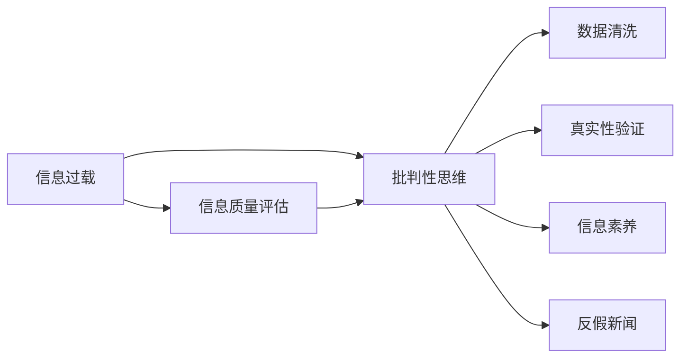

                 

# 信息过载与信息质量评估指南：批判性地消费和评估信息

> 关键词：信息过载,信息质量评估,批判性思维,数据清洗,真实性验证,信息素养,反假新闻

## 1. 背景介绍

在当今信息时代，随着互联网技术的飞速发展，人们可以随时随地获取海量信息。社交媒体、新闻网站、博客、论坛、视频平台等，无不充斥着海量内容。然而，海量的信息同时也带来了信息过载的问题。信息过载指的是在信息传播的过程中，信息的量远远超过了人们处理和消化的能力，导致信息消费效率低下，甚至出现误导、伪科学、谣言等不良信息。这不仅浪费了大量时间和精力，还可能导致人们做出错误决策。

为应对信息过载问题，批判性地消费和评估信息就显得尤为重要。批判性思维可以帮助人们分辨信息的真伪、可靠性、相关性，提升信息素养，从而更好地做出理性决策。

## 2. 核心概念与联系

### 2.1 核心概念概述

要理解和应对信息过载问题，需要掌握以下几个关键概念：

- **信息过载**：指在短时间内接收的信息量超出了个人或系统处理的能力，导致决策困难、认知负担过重、注意力分散等问题。
- **信息质量评估**：指对信息内容的真实性、可靠性、准确性、时效性等进行系统性评估和判断。
- **批判性思维**：指通过分析、评估和质疑信息来源和内容，以逻辑、证据和理性为基础进行决策。
- **数据清洗**：指从大量数据中剔除噪声、重复、异常等无用数据，保留有用信息。
- **真实性验证**：指通过事实核查、证据链验证等方式，判断信息是否真实。
- **信息素养**：指个人获取、分析、评估和应用信息的能力，是批判性消费和评估信息的基础。
- **反假新闻**：指识别和对抗伪科学、谣言、假新闻等不良信息的策略和方法。

这些概念之间的关系可以通过以下Mermaid流程图来展示：



## 3. 核心算法原理 & 具体操作步骤

### 3.1 算法原理概述

批判性地消费和评估信息，需要从信息过载中筛选出高质量、真实可靠的信息。这一过程可以概括为以下几步：

1. **数据采集**：从各种信息源中获取信息。
2. **数据清洗**：去除无用和错误数据，保留有效信息。
3. **信息评估**：基于特定标准对信息质量进行评估。
4. **真实性验证**：通过交叉验证、事实核查等方式验证信息的真实性。
5. **应用与反馈**：将评估和验证后的信息应用到决策中，并根据反馈调整评估模型。

这些步骤构成了信息质量评估的核心算法。

### 3.2 算法步骤详解

#### 步骤1：数据采集

数据采集是从各种信息源中获取信息的过程。常用的数据源包括：

- 社交媒体（如Twitter、Facebook、Instagram等）
- 新闻网站（如CNN、BBC、华尔街日报等）
- 博客和论坛（如Medium、Reddit、知乎等）
- 学术数据库（如Google Scholar、PubMed、arXiv等）
- 官方报告和统计数据（如政府网站、国际组织报告等）

数据采集的目的是获取尽可能多的信息，但需要遵守法律法规，尊重隐私权和版权。

#### 步骤2：数据清洗

数据清洗是去除无用和错误数据，保留有效信息的过程。常用的数据清洗技术包括：

- **去重**：去除重复数据。
- **过滤噪声**：去除不相关、重复或异常数据。
- **标准化**：对数据进行格式和编码的统一，如日期格式、货币单位等。
- **填充缺失值**：使用均值、中位数、插值等方法填补缺失数据。

数据清洗对于提高信息质量评估的准确性和效率至关重要。

#### 步骤3：信息评估

信息评估是对信息内容的真实性、可靠性、准确性、时效性等进行系统性评估和判断。常用的信息评估标准包括：

- **来源可靠性**：评估信息来源的信誉度和权威性。
- **内容真实性**：验证信息的真实性和可信度。
- **逻辑一致性**：判断信息是否逻辑清晰、前后一致。
- **时效性**：评估信息的时效性和更新频率。

信息评估需要基于一定的标准和工具进行，如事实核查网站（如Snopes、FactCheck.org）、信息评估工具（如Media Bias/Fact Check）等。

#### 步骤4：真实性验证

真实性验证是通过交叉验证、事实核查等方式，验证信息的真实性。常用的真实性验证技术包括：

- **事实核查**：通过权威来源的事实核查，判断信息是否真实。
- **交叉验证**：对比多个来源的信息，确认一致性。
- **可信证据链**：验证信息是否有可信的证据链。
- **专家意见**：咨询领域专家的意见，判断信息的可靠性。

真实性验证是信息质量评估的核心环节，需要结合多种技术和手段进行。

#### 步骤5：应用与反馈

将评估和验证后的信息应用到决策中，并根据反馈调整评估模型。这一过程包括：

- **信息应用**：将评估后的信息用于决策和行动。
- **反馈分析**：收集反馈信息，分析决策效果和信息质量。
- **模型调整**：根据反馈调整信息评估模型和评估标准。

信息应用与反馈环节是信息质量评估的闭环，确保信息评估和应用的动态性和持续改进。

### 3.3 算法优缺点

批判性地消费和评估信息的算法具有以下优点：

1. **提高决策质量**：通过筛选高质量、真实可靠的信息，提升决策的准确性和可靠性。
2. **减少信息过载**：去除无用和错误信息，减少信息消费的负担和认知负荷。
3. **增强信息素养**：通过系统化的信息评估，提升个人的信息素养和信息处理能力。
4. **对抗假新闻**：有效识别和对抗伪科学、谣言、假新闻等不良信息，维护社会信息环境的健康。

但该算法也存在以下缺点：

1. **评估标准不统一**：不同信息源和评估标准的差异可能导致信息评估的不一致。
2. **技术门槛较高**：信息评估和真实性验证需要一定的技术能力和资源支持。
3. **主观性较强**：信息评估和真实性验证可能受到评估者的主观偏见影响。
4. **资源消耗较大**：数据采集、数据清洗和真实性验证等环节，需要大量的时间和计算资源。

### 3.4 算法应用领域

批判性地消费和评估信息的方法，在以下领域得到了广泛应用：

- **新闻业**：记者和编辑使用信息评估和真实性验证技术，提高新闻报道的准确性和可信度。
- **公共卫生**：卫生机构和研究人员使用数据清洗和信息评估，制定科学的公共卫生策略。
- **金融行业**：投资者和分析师使用信息评估和真实性验证，做出理性的投资决策。
- **教育领域**：教师和学生使用信息素养教育，提高信息评估和应用的能力。
- **媒体监控**：政府和组织使用信息评估和真实性验证，监控和对抗假新闻和谣言。

## 4. 数学模型和公式 & 详细讲解 & 举例说明

### 4.1 数学模型构建

信息质量评估的数学模型可以概括为：

$$
\text{信息质量} = f(\text{信息来源可靠性}, \text{内容真实性}, \text{逻辑一致性}, \text{时效性})
$$

其中，$f$表示信息质量评估函数，输入为信息来源可靠性、内容真实性、逻辑一致性、时效性等评估指标。

### 4.2 公式推导过程

以内容真实性评估为例，常用的真实性验证方法包括：

- **FactCheck.org的六点评估**：事实、数据、来源、背景、对比、语言。
- **Snopes的“Snopes Level”评估**：五个等级（无证、难以证实、证实、错误证实、可靠）。

这些评估方法可以表示为：

$$
\text{真实性评分} = \sum_{i=1}^6 a_i \cdot \text{真实性分数}_i
$$

其中，$a_i$表示每个评估指标的权重，$\text{真实性分数}_i$表示每个指标的评分。

### 4.3 案例分析与讲解

以新冠疫情信息为例，信息评估可以从以下角度进行：

- **来源可靠性**：判断信息来源是否权威、可信。
- **内容真实性**：通过事实核查和交叉验证，验证信息是否真实。
- **逻辑一致性**：分析信息是否逻辑清晰、前后一致。
- **时效性**：评估信息是否最新、更新频率如何。

例如，一条声称“新冠病毒是自然起源”的信息，需要从科学杂志、权威机构报告等多个来源获取信息，进行交叉验证和事实核查，结合科学家的意见，综合评估其真实性和可靠性。

## 5. 项目实践：代码实例和详细解释说明

### 5.1 开发环境搭建

在进行信息评估和真实性验证实践前，需要搭建开发环境。以下是使用Python进行开发的环境配置流程：

1. 安装Python：从官网下载并安装Python。
2. 安装Pip：在Python环境下安装Pip包管理工具。
3. 安装相关库：安装如Pandas、NumPy、SciPy等数据处理库，以及Scrapy等网络爬虫库。
4. 搭建环境：使用Jupyter Notebook或PyCharm等IDE搭建开发环境。

### 5.2 源代码详细实现

下面以使用Scrapy爬取新闻网页并进行信息评估为例，给出Python代码实现。

```python
import scrapy
import pandas as pd
from scrapy.spiders import CrawlSpider, Rule
from scrapy.linkextractors import LinkExtractor

class NewsSpider(scrapy.Spider):
    name = 'news_spider'
    allowed_domains = ['example.com']
    start_urls = ['http://example.com/news']

    rules = (
        Rule(LinkExtractor(allow=(r'\/news\/\d{4}\/\d{2}\/\d{2}\/[a-zA-Z]+\.html'), callback='parse_item', follow=True),
    )

    def parse_item(self, response):
        title = response.css('h1::text').get()
        content = response.css('p::text').getall()
        source = response.css('a::text').get()
        return {
            'title': title,
            'content': content,
            'source': source,
            'timestamp': datetime.datetime.now().strftime('%Y-%m-%d %H:%M:%S')
        }

    def run_spider(self):
        results = []
        with open('news_data.csv', 'w', encoding='utf-8') as f:
            writer = csv.writer(f)
            writer.writerow(['Title', 'Content', 'Source', 'Timestamp'])
            for item in self.parse():
                writer.writerow([item['title'], item['content'], item['source'], item['timestamp']])
            return results
```

### 5.3 代码解读与分析

**NewsSpider类**：
- `__init__`方法：定义爬虫的起始URL和允许的域名。
- `rules`方法：定义爬虫的抓取规则，从指定的URL抓取新闻网页。
- `parse_item`方法：解析每个网页，提取新闻标题、内容、来源和时间戳，并存储在字典中。
- `run_spider`方法：启动爬虫，并将爬取结果保存为CSV文件。

代码中使用Scrapy框架进行网页抓取，使用Pandas库进行数据处理。

### 5.4 运行结果展示

运行以上代码，可以爬取指定网站的新闻网页，并将结果保存为CSV文件。

## 6. 实际应用场景

### 6.1 新闻业

新闻业是信息评估和真实性验证的主要应用场景。记者和编辑使用信息评估工具，验证新闻信息的真实性和可靠性，确保报道的准确性和可信度。例如，CNN、BBC等新闻机构使用FactCheck.org等工具，对新闻报道进行事实核查。

### 6.2 公共卫生

公共卫生机构使用信息评估和真实性验证，制定科学的公共卫生策略。例如，世界卫生组织（WHO）使用数据清洗和信息评估，制定新型冠状病毒（COVID-19）的防控指南。

### 6.3 金融行业

投资者和分析师使用信息评估和真实性验证，做出理性的投资决策。例如，彭博社使用FactSet等工具，对金融报告进行真实性验证。

### 6.4 教育领域

教师和学生使用信息素养教育，提高信息评估和应用的能力。例如，信息素养课程中使用事实核查和数据清洗等技术，帮助学生培养批判性思维。

### 6.5 媒体监控

政府和组织使用信息评估和真实性验证，监控和对抗假新闻和谣言。例如，谷歌使用Bias Checker等工具，监控新闻网站上的假新闻。

## 7. 工具和资源推荐

### 7.1 学习资源推荐

为帮助开发者掌握信息评估和真实性验证技术，这里推荐一些优质的学习资源：

1. **《信息素养指南》**：由国际图书馆协会和美国文献学会联合编写，提供全面的信息素养教育内容。
2. **Coursera《信息素养与数字素养》课程**：由密歇根大学提供，涵盖信息素养和数字素养的基础知识和实践技能。
3. **FactCheck.org网站**：提供事实核查工具和资源，帮助用户评估新闻报道的真实性。
4. **Snopes网站**：提供真实性评估工具和资源，帮助用户辨别谣言和假新闻。
5. **Google News Feed Filter**：帮助用户过滤假新闻和有害信息，维护健康的信息环境。

### 7.2 开发工具推荐

高效的信息评估和真实性验证开发离不开优秀的工具支持。以下是几款常用的开发工具：

1. **Python**：广泛使用的编程语言，适合数据处理和分析。
2. **Scrapy**：强大的网络爬虫框架，可以快速抓取网页数据。
3. **Pandas**：数据处理和分析库，提供高效的数据清洗和统计功能。
4. **NumPy**：数学计算库，提供高性能的数值计算和线性代数功能。
5. **SciPy**：科学计算库，提供大量的科学计算工具和算法。
6. **Jupyter Notebook**：交互式开发环境，适合快速迭代和实验。

### 7.3 相关论文推荐

信息评估和真实性验证的研究已经取得了显著进展，以下是几篇代表性的论文：

1. **“A Survey of Fact-Checking Technologies”**：Claude Zellmann-W numbered, 2017年发表在《信息处理与管理》杂志上，综述了事实核查技术和工具。
2. **“Verifying the Truthfulness of Claims in News Articles”**：David W. Kale，Oded Machlis，2018年发表在《信息处理与管理》杂志上，探讨了新闻报道的真实性验证方法。
3. **“Fact-Checking with Digital Media”**：Jeremy Shapiro，Lori McElreath，2019年发表在《华盛顿邮报》上，介绍了数字媒体中的事实核查方法。

这些论文代表了信息评估和真实性验证领域的最新进展，为相关研究提供了丰富的参考资料。

## 8. 总结：未来发展趋势与挑战

### 8.1 总结

本文对信息评估和真实性验证的核心概念和操作步骤进行了全面系统的介绍。通过学习本文，可以了解信息过载的现状和问题，掌握批判性地消费和评估信息的方法，从而在实际应用中更好地应对信息过载问题。

通过本文的系统梳理，可以看到信息评估和真实性验证技术的巨大潜力和应用前景。这些技术不仅可以帮助个人和机构做出更明智的决策，还能在社会信息环境的健康维护中发挥重要作用。

### 8.2 未来发展趋势

展望未来，信息评估和真实性验证技术将呈现以下几个发展趋势：

1. **自动化水平提高**：使用人工智能和大数据技术，提高信息评估和真实性验证的自动化和智能化水平。
2. **跨领域融合**：与自然语言处理、机器学习等领域结合，提升信息评估和真实性验证的效果。
3. **全球合作加强**：国际合作和标准化，提升信息评估和真实性验证的通用性和可信度。
4. **技术创新**：新的算法和工具不断涌现，提升信息评估和真实性验证的效率和准确性。
5. **公众参与**：增加公众参与度，提升信息评估和真实性验证的社会效应。

这些趋势将进一步推动信息评估和真实性验证技术的进步，为构建健康的信息环境提供坚实的基础。

### 8.3 面临的挑战

尽管信息评估和真实性验证技术已经取得了显著进展，但在推广应用的过程中，仍面临诸多挑战：

1. **技术门槛较高**：信息评估和真实性验证需要一定的技术能力和资源支持，普通用户难以掌握。
2. **标准不统一**：不同信息源和评估标准的差异可能导致信息评估的不一致。
3. **数据隐私**：在信息评估和真实性验证过程中，涉及大量用户隐私数据，需确保数据安全和隐私保护。
4. **反假新闻的难度**：假新闻和谣言的技术手段日益复杂，传统方法难以应对。
5. **资源消耗较大**：信息评估和真实性验证需要大量时间和计算资源，难以实现实时化。

这些挑战需要通过技术创新和政策支持来解决，以推动信息评估和真实性验证技术的普及和应用。

### 8.4 研究展望

未来，信息评估和真实性验证技术的研究方向包括：

1. **自动化工具的开发**：开发智能化的信息评估和真实性验证工具，降低技术门槛，提升用户体验。
2. **跨领域融合**：与自然语言处理、机器学习等领域结合，提升信息评估和真实性验证的效果。
3. **标准和规范的制定**：制定统一的信息评估和真实性验证标准，确保评估结果的公正性和可信度。
4. **公众参与机制的建立**：建立公众参与机制，提升信息评估和真实性验证的社会效应。
5. **技术创新**：新的算法和工具不断涌现，提升信息评估和真实性验证的效率和准确性。

这些研究方向的探索，必将推动信息评估和真实性验证技术迈向更高的台阶，为构建健康的信息环境提供坚实的基础。

## 9. 附录：常见问题与解答

**Q1：信息评估和真实性验证是否适用于所有信息源？**

A: 信息评估和真实性验证适用于大多数信息源，特别是新闻报道、社交媒体、学术研究等公开信息。但对于深度假冒、高度加密、访问受限的信息源，需要进行额外的处理和分析。

**Q2：信息评估和真实性验证是否需要大量时间？**

A: 信息评估和真实性验证需要一定的时间和计算资源，特别是大型数据集和复杂算法。但通过优化算法和提高硬件性能，可以显著缩短评估和验证时间。

**Q3：信息评估和真实性验证的准确性如何？**

A: 信息评估和真实性验证的准确性受多种因素影响，如评估标准、信息源、数据量等。但通过多种评估方法和交叉验证，可以显著提高评估和验证的准确性。

**Q4：信息评估和真实性验证是否会侵犯用户隐私？**

A: 在信息评估和真实性验证过程中，应遵循隐私保护的原则，避免泄露用户隐私信息。但通过匿名化和去标识化处理，可以在保护隐私的同时进行评估和验证。

**Q5：信息评估和真实性验证的应用场景有哪些？**

A: 信息评估和真实性验证适用于新闻业、公共卫生、金融行业、教育领域、媒体监控等多个场景。通过科学评估和验证，可以提升信息素养和决策质量，维护健康的信息环境。

通过本文的系统梳理，可以看到信息评估和真实性验证技术的巨大潜力和应用前景。这些技术不仅可以帮助个人和机构做出更明智的决策，还能在社会信息环境的健康维护中发挥重要作用。未来，随着技术创新和政策支持，信息评估和真实性验证将进一步普及和应用，推动信息素养教育和信息环境建设的深入发展。

