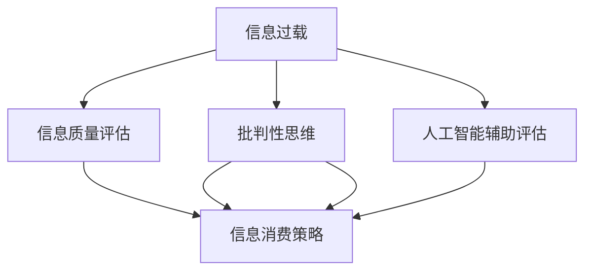

                 

# 信息过载与信息质量评估策略：批判性地评估和消费信息

> 关键词：信息过载,信息质量评估,批判性思维,信息消费策略,人工智能辅助评估

## 1. 背景介绍

### 1.1 问题由来

随着互联网和社交媒体的普及，信息量呈爆炸式增长。据统计，全球每天产生的数据量已经超过1.8亿TB，其中视频和图像数据占主流。这种大规模的信息爆发，不仅给搜索引擎和数据存储带来了巨大压力，也给信息消费者带来了新的挑战。

在这样的信息海洋中，如何准确、高效地获取和评估信息，成为现代信息消费者必须面对的问题。信息的泛滥不仅稀释了有用信息的浓度，还容易引发信息过载，导致用户注意力分散、认知负荷增加，甚至出现认知偏差和决策失误。

## 2. 核心概念与联系

### 2.1 核心概念概述

为更好地理解信息质量评估与信息过载应对方法，本节将介绍几个密切相关的核心概念：

- **信息过载(Information Overload)**：指在信息消费过程中，由于信息量过大，用户难以处理，从而引发注意力分散、认知负荷增加等问题。
- **信息质量评估(Information Quality Assessment)**：指通过科学方法对信息源的准确性、完整性、相关性、及时性等维度进行评价，帮助用户识别并筛选有用信息。
- **批判性思维(Critical Thinking)**：指通过系统、全面、客观的分析和思考，对信息进行独立判断和评估，以提升信息消费的准确性和效果。
- **信息消费策略(Information Consumption Strategy)**：指通过有效的策略和方法，优化信息获取和处理过程，降低信息过载，提升信息消费体验和效果。
- **人工智能辅助评估(AI-Assisted Assessment)**：指利用人工智能技术，如自然语言处理、机器学习等，自动化地辅助信息质量评估过程，提高评估的效率和准确性。

这些核心概念之间的逻辑关系可以通过以下Mermaid流程图来展示：



这个流程图展示了几类关键概念及其之间的关系：

1. 信息过载引发了对信息质量评估的需求。
2. 批判性思维和信息消费策略可以辅助提升信息质量评估的效果。
3. 人工智能辅助评估在自动化处理信息质量评估方面有广泛应用。
4. 信息质量评估、批判性思维、信息消费策略与人工智能辅助评估相结合，可以构建完整的评估体系。

## 3. 核心算法原理 & 具体操作步骤
### 3.1 算法原理概述

信息质量评估本质上是一个多维度的评价问题，涉及信息的可靠性、准确性、完整性、相关性、及时性等多个方面。评估方法可以通过人工主观打分、专家评审、统计分析等手段实现。

近年来，人工智能技术在信息质量评估中也得到了广泛应用，例如使用自然语言处理技术对文本进行情感分析、实体抽取等，使用机器学习技术对信息进行分类、聚类、关联分析等。这些方法通过自动化手段提升了评估的效率和准确性。

### 3.2 算法步骤详解

以下是信息质量评估的一般步骤：

**Step 1: 定义评估指标**
- 根据信息类型和应用场景，确定需要评估的指标维度，如信息的准确性、完整性、相关性、及时性等。
- 给每个指标设定量化标准，如准确率、完整率、相关度、时效性等。

**Step 2: 数据预处理**
- 对需要评估的信息进行数据清洗、去噪、归一化等预处理，确保数据质量。
- 将数据转化为可机器处理的格式，如向量表示、特征提取等。

**Step 3: 模型选择与训练**
- 根据评估需求选择合适的评估模型，如情感分析、实体抽取、文本分类等。
- 在标注好的数据集上进行模型训练，调整模型参数以获得更好的评估效果。

**Step 4: 评估与分析**
- 将待评估信息输入训练好的模型，得到各项指标的评估结果。
- 通过统计分析和可视化工具，对评估结果进行分析和解读。

**Step 5: 报告生成**
- 根据评估结果，生成详细的评估报告，提供信息可信度的客观依据。
- 提供可操作的建议和改进方案，指导后续信息处理和消费。

### 3.3 算法优缺点

信息质量评估的主要优点包括：

1. 系统性：通过科学方法和标准化指标，对信息进行全面评估，避免了主观偏差。
2. 高效性：自动化手段可以处理大规模信息，显著提高评估效率。
3. 客观性：评估结果基于数据和模型，具有较高的可信度。

主要缺点包括：

1. 高成本：高质量的标注数据和模型训练需要大量的人力和物力投入。
2. 数据依赖：评估效果依赖于数据质量，数据偏差会影响评估结果。
3. 复杂性：评估模型选择和参数调整需要专业知识，非专家难以实施。
4. 动态性：信息环境变化迅速，评估模型需要不断更新以保持有效性。

### 3.4 算法应用领域

信息质量评估方法广泛应用于多个领域，包括：

- **新闻媒体**：对新闻、评论、社论等文本信息进行情感分析、可靠性评估等。
- **科学研究**：对研究论文、数据集、实验结果等进行准确性、相关性、时效性评估。
- **金融市场**：对股市报告、财经新闻、研究报告等进行信息质量和可信度分析。
- **社交媒体**：对社交媒体用户生成内容进行情感、实体、关系分析，评估信息质量和可信度。
- **政府决策**：对政府报告、政策提案、官方声明等进行信息质量和可信度评估。

## 4. 数学模型和公式 & 详细讲解  
### 4.1 数学模型构建

信息质量评估的数学模型通常包括以下几个关键组成部分：

1. **数据预处理模型**：用于清洗、归一化、特征提取等，如PCA降维、TF-IDF特征提取等。
2. **评估指标计算模型**：用于计算各项指标，如准确率、完整率、相关度、时效性等。
3. **模型训练与选择**：用于选择和训练评估模型，如支持向量机(SVM)、深度学习模型等。
4. **结果分析与可视化**：用于对评估结果进行分析和可视化，如聚类分析、热力图等。

以下是一个简单的信息质量评估模型的框架：

$$
\text{Evaluation Score} = \alpha \times \text{Accuracy} + \beta \times \text{Completeness} + \gamma \times \text{Relevance} + \delta \times \text{Timeliness}
$$

其中 $\alpha, \beta, \gamma, \delta$ 分别为各项指标的权重，可以根据具体情况进行调整。

### 4.2 公式推导过程

以信息的相关性评估为例，假设我们需要对一段文本 $X$ 与另一个文本 $Y$ 的相关性进行评估，其相关性评分 $R(X, Y)$ 可以通过计算文本向量之间的余弦相似度来得到：

$$
R(X, Y) = \frac{\mathbf{x} \cdot \mathbf{y}}{\|\mathbf{x}\| \cdot \|\mathbf{y}\|}
$$

其中 $\mathbf{x}, \mathbf{y}$ 分别为 $X, Y$ 的词向量表示，$\cdot$ 表示向量点积，$\|\cdot\|$ 表示向量的模长。

类似地，信息的准确性、完整性、及时性等指标也可以通过相似的计算方法得到，如精确率、召回率、缺失率、延迟时间等。

### 4.3 案例分析与讲解

以新闻媒体信息评估为例，我们可采用情感分析、实体抽取、关键词提取等技术对新闻文章进行评估。

- **情感分析**：使用情感分析模型对新闻文本进行正面、负面和中性情感分析，从而评估信息的情感倾向。
- **实体抽取**：使用命名实体识别模型对新闻文本中的人名、地名、机构名等实体进行抽取，评估信息的完整性。
- **关键词提取**：使用文本挖掘技术从新闻文本中提取关键词，评估信息的相关性。

通过这些技术手段，可以对新闻文章进行全面评估，生成评估报告。例如，对于一篇关于某个事件的新闻文章，可以评估其情感倾向、相关实体、关键词等，并给出整体评分和详细解释。

## 5. 项目实践：代码实例和详细解释说明
### 5.1 开发环境搭建

在进行信息质量评估的实践前，我们需要准备好开发环境。以下是使用Python进行Natural Language Toolkit(NLTK)开发的环境配置流程：

1. 安装Anaconda：从官网下载并安装Anaconda，用于创建独立的Python环境。

2. 创建并激活虚拟环境：
```bash
conda create -n nltk-env python=3.8 
conda activate nltk-env
```

3. 安装Natural Language Toolkit(NLTK)：
```bash
conda install nltk==3.6
```

4. 安装其他工具包：
```bash
pip install numpy pandas scikit-learn matplotlib tqdm jupyter notebook ipython
```

完成上述步骤后，即可在`nltk-env`环境中开始信息质量评估的实践。

### 5.2 源代码详细实现

下面我们以情感分析为例，给出使用NLTK库对文本进行情感分析的Python代码实现。

首先，定义情感分析模型：

```python
import nltk
from nltk.sentiment import SentimentIntensityAnalyzer

sia = SentimentIntensityAnalyzer()
```

然后，定义情感分析函数：

```python
from nltk.sentiment import SentimentIntensityAnalyzer

def sentiment_analysis(text):
    sia = SentimentIntensityAnalyzer()
    sentiment = sia.polarity_scores(text)
    return sentiment
```

最后，调用情感分析函数并输出结果：

```python
text = "This product is excellent, I highly recommend it."
sentiment = sentiment_analysis(text)
print(sentiment)
```

以上就是使用NLTK对文本进行情感分析的完整代码实现。可以看到，NLTK提供了简单易用的情感分析模型，可以轻松地评估文本的情感倾向。

### 5.3 代码解读与分析

让我们再详细解读一下关键代码的实现细节：

**SentimentIntensityAnalyzer类**：
- 用于进行情感分析，封装了LingPipe库的情感分析算法，支持英文文本情感分析。
- `polarity_scores`方法：返回文本情感得分的四个维度：正面情感得分、负面情感得分、中性情感得分和情感强度得分。

**sentiment_analysis函数**：
- 定义一个情感分析函数，将输入文本作为参数，调用SentimentIntensityAnalyzer进行情感分析，并返回情感得分。
- 在实际应用中，可以根据情感得分评估信息的情感倾向，判断信息的相关性和可信度。

**情感分析示例代码**：
- 定义一段文本，调用sentiment_analysis函数进行情感分析。
- 情感分析结果包括正面、负面、中性情感得分以及情感强度得分，可以用于评估信息的情感倾向和情感强度。

可以看到，NLTK在情感分析方面提供了简单易用的接口和算法，极大地方便了信息质量评估的实现。

当然，在工业级的系统实现中，还需要考虑更多因素，如数据预处理、模型优化、用户界面等。但核心的情感分析过程基本与此类似。

## 6. 实际应用场景
### 6.1 智能推荐系统

信息质量评估技术可以应用于智能推荐系统，提升推荐结果的准确性和多样性。传统推荐系统往往依赖用户的显式评分数据，而基于信息的推荐系统可以引入信息质量评估，更全面地了解用户兴趣和偏好。

在技术实现上，可以对用户的历史行为数据和文本信息进行情感分析、实体抽取等，评估信息的情感倾向和相关性。基于评估结果，为每个用户构建兴趣模型，推荐符合用户兴趣和情感偏好的内容。例如，一个用户最近阅读了一篇负面新闻，可以推荐其感兴趣的其他负面新闻或相关的中性信息，以保持其对负面新闻的关注度。

### 6.2 内容审核系统

信息质量评估技术可以应用于内容审核系统，确保用户生成内容的质量和合规性。在信息审核过程中，可以通过实体抽取、关键词提取等技术，对用户生成内容进行质量评估，识别和屏蔽有害信息。

在技术实现上，可以对用户生成内容进行情感分析、实体抽取、关键词提取等，评估信息的情感倾向、相关性、实体类别等。对于含有违法、暴力、敏感内容的信息，可以自动标记并屏蔽。例如，一个用户发布了一条含有种族歧视的内容，系统可以自动识别并屏蔽该内容，维护社区的和谐氛围。

### 6.3 舆情监测系统

信息质量评估技术可以应用于舆情监测系统，及时发现和分析公众舆论动态。在舆情监测过程中，可以通过情感分析、实体抽取等技术，对海量社交媒体信息进行质量评估，发现公众情感倾向和热点话题。

在技术实现上，可以对社交媒体信息进行情感分析、实体抽取、关键词提取等，评估信息的情感倾向、相关性、实体类别等。对于某一时期内情绪激烈、热点话题，系统可以自动生成舆情报告，供决策者参考。例如，一个时期内公众对某事件情绪激烈，系统可以自动生成舆情报告，帮助政府部门及时了解公众情绪和意见，作出决策。

### 6.4 未来应用展望

随着信息质量评估技术的不断发展，将在更多领域得到应用，为信息消费提供全面的技术支持。

在智慧城市治理中，信息质量评估技术可以应用于公共信息管理、应急指挥等领域，提升政府公共服务的智能化水平。

在智慧教育领域，信息质量评估技术可以应用于在线学习内容评估、作业批改等领域，提升教学质量和学生学习效果。

在智慧医疗领域，信息质量评估技术可以应用于病历分析、医疗知识图谱构建等领域，提升医疗服务的精准性和可信度。

此外，在新闻媒体、金融市场、电子商务等众多领域，信息质量评估技术也将不断涌现，为信息消费提供新的解决方案。相信随着技术的日益成熟，信息质量评估技术将成为信息消费的重要支撑，推动信息产业的全面升级。

## 7. 工具和资源推荐
### 7.1 学习资源推荐

为了帮助开发者系统掌握信息质量评估的理论基础和实践技巧，这里推荐一些优质的学习资源：

1. **自然语言处理与信息检索**（《自然语言处理综论》）：斯坦福大学公开课，全面介绍了自然语言处理和信息检索的基本概念和经典算法，适合初学者学习。
2. **信息检索与文本挖掘**（《信息检索导论》）：信息检索领域的经典教材，详细讲解了信息检索和文本挖掘的基本原理和应用实例。
3. **自然语言处理与情感分析**（《情感分析与情绪计算》）：专门讲解情感分析和情绪计算的书籍，介绍了多种情感分析算法和技术。
4. **Python自然语言处理**（《Python自然语言处理》）：介绍Python在自然语言处理中的应用，涵盖文本预处理、情感分析、实体抽取等技术。
5. **情感计算与人工智能**（《情感计算》）：介绍了情感计算的基本概念和应用实例，包括情感分析、情感计算、情绪计算等。

通过对这些资源的学习实践，相信你一定能够快速掌握信息质量评估的精髓，并用于解决实际的信息消费问题。

### 7.2 开发工具推荐

高效的信息质量评估离不开优秀的工具支持。以下是几款用于信息质量评估开发的常用工具：

1. **Natural Language Toolkit(NLTK)**：用于处理自然语言数据的Python库，提供了丰富的自然语言处理工具和算法。
2. **TextBlob**：基于NLTK的文本处理库，提供了情感分析、文本分类、短语提取等功能。
3. **VADER**：一个情感分析工具包，专门用于处理社交媒体数据的情感分析。
4. **NLTK+SentimentIntensityAnalyzer**：结合NLTK和SentimentIntensityAnalyzer进行情感分析的库。
5. **scikit-learn**：用于数据处理、特征提取、模型训练的Python库，支持多种机器学习算法。

合理利用这些工具，可以显著提升信息质量评估的开发效率，加快创新迭代的步伐。

### 7.3 相关论文推荐

信息质量评估技术的发展得益于学界的持续研究。以下是几篇奠基性的相关论文，推荐阅读：

1. **情感分析与情感计算**（《情感分析》）：介绍了情感分析的基本概念和算法，展示了情感分析在实际应用中的广泛应用。
2. **文本分类与情感分析**（《文本分类》）：介绍了文本分类的基本原理和算法，结合情感分析进行信息评估。
3. **情感分析与情感计算**（《情感计算》）：专门研究情感计算的论文集，涵盖了情感分析、情感计算、情绪计算等方向。
4. **信息检索与文本挖掘**（《信息检索导论》）：介绍了信息检索和文本挖掘的基本原理和应用实例，适合理解信息评估的算法和技术。

这些论文代表了大规模信息质量评估技术的发展脉络。通过学习这些前沿成果，可以帮助研究者把握学科前进方向，激发更多的创新灵感。

## 8. 总结：未来发展趋势与挑战

### 8.1 总结

本文对信息质量评估的方法进行了全面系统的介绍。首先阐述了信息过载的问题由来，明确了信息质量评估在信息消费中的重要性。其次，从原理到实践，详细讲解了信息质量评估的数学模型和操作步骤，给出了信息质量评估任务开发的完整代码实现。同时，本文还广泛探讨了信息质量评估在智能推荐、内容审核、舆情监测等多个行业领域的应用前景，展示了信息质量评估技术的巨大潜力。此外，本文精选了信息质量评估的相关学习资源，力求为读者提供全方位的技术指引。

通过本文的系统梳理，可以看到，信息质量评估技术在信息消费中的重要性日益凸显，其应用范围和影响范围正在不断扩大。未来的研究需要在以下几个方面寻求新的突破：

### 8.2 未来发展趋势

展望未来，信息质量评估技术将呈现以下几个发展趋势：

1. **自动化程度提升**：随着机器学习算法的不断进步，信息质量评估将更多地依赖自动化手段，减少人工干预。
2. **多模态融合**：将文本、图像、音频等多模态数据进行融合，提升信息评估的全面性和准确性。
3. **实时评估**：实现对信息消费过程的实时评估，及时发现和处理有害信息，保障信息安全。
4. **跨领域应用**：将信息质量评估技术应用于更多领域，如社交媒体、医疗、金融等，提升信息消费体验和效果。
5. **个性化评估**：根据用户个性化需求，提供差异化的信息评估服务，提升用户体验。

这些趋势凸显了信息质量评估技术的广泛应用前景，为信息消费提供了全面的技术保障。

### 8.3 面临的挑战

尽管信息质量评估技术已经取得了显著进展，但在迈向更加智能化、普适化应用的过程中，它仍面临诸多挑战：

1. **数据质量问题**：信息质量评估的准确性高度依赖于数据质量，数据偏差和噪声将严重影响评估结果。
2. **模型复杂度**：多模态融合和实时评估需要更复杂的模型和算法，增加了模型设计和调优的难度。
3. **隐私保护**：信息质量评估过程中涉及大量用户隐私信息，如何保护用户隐私和数据安全，是一个重要挑战。
4. **算法透明性**：信息质量评估模型往往是"黑盒"系统，难以解释其内部工作机制和决策逻辑，增加了应用的风险。
5. **跨领域适应性**：信息质量评估技术在不同领域和任务上的适应性，还需要进一步提升和优化。

### 8.4 研究展望

未来的研究需要在以下几个方面寻求新的突破：

1. **提高数据质量**：通过数据清洗、去噪、归一化等预处理技术，提升数据质量，增强信息评估的准确性。
2. **简化模型设计**：开发更加轻量级、高效的评估模型，优化算法性能，提升模型实时性。
3. **加强隐私保护**：在评估过程中引入隐私保护技术，如差分隐私、联邦学习等，保障用户隐私和数据安全。
4. **增强算法透明性**：开发可解释性更高的评估模型，增加算法的透明性和可理解性，减少应用风险。
5. **拓展跨领域应用**：进一步拓展信息质量评估技术在不同领域和任务上的应用，提升其普适性和实用性。

这些研究方向的探索，将推动信息质量评估技术迈向更高的台阶，为信息消费提供更加全面、可靠、高效的技术支撑。只有勇于创新、敢于突破，才能不断拓展信息质量评估技术的边界，让信息消费更加智能和高效。

## 9. 附录：常见问题与解答

**Q1：信息质量评估是否适用于所有类型的信息？**

A: 信息质量评估适用于各类文本、图像、音频等多模态信息。但不同类型的信息评估指标可能有所不同，需要根据具体情况选择合适的评估方法。例如，文本信息的情感分析、实体抽取、关键词提取等，图像信息的视觉质量评估、内容理解等。

**Q2：如何选择信息质量评估的指标？**

A: 选择评估指标应根据信息类型和应用场景进行。一般来说，信息质量评估的指标包括准确性、完整性、相关性、及时性、安全性等。在具体应用中，需要根据信息的具体特点，选择合适的指标维度。例如，新闻信息主要评估相关性和时效性，医学信息主要评估准确性和安全性。

**Q3：如何进行多模态信息质量评估？**

A: 多模态信息质量评估需要融合文本、图像、音频等多种信息源，并综合其质量指标。具体方法包括：
1. 对文本信息进行情感分析、实体抽取、关键词提取等。
2. 对图像信息进行视觉质量评估、内容理解等。
3. 对音频信息进行语音情感分析、语义理解等。
4. 综合多种信息源的质量评估结果，生成全面的信息质量报告。

**Q4：信息质量评估是否需要标注数据？**

A: 信息质量评估通常需要标注数据进行训练和模型优化。标注数据的质量和数量对评估结果的准确性有重要影响。可以通过众包、专家评审等方式获取高质量的标注数据，提升评估效果。

**Q5：信息质量评估能否自动化？**

A: 信息质量评估可以实现部分自动化，但完全自动化需要高精度的评估模型和高质量的标注数据。在实际应用中，通常需要结合人工干预和自动化手段，提升评估效率和准确性。

总之，信息质量评估技术在信息消费中具有重要意义，通过系统性、全面性、客观性的评估方法，帮助用户筛选和评估信息，提升信息消费的准确性和效果。随着技术的不断进步，信息质量评估将变得更加智能和普适，为信息消费提供全面的技术保障。

