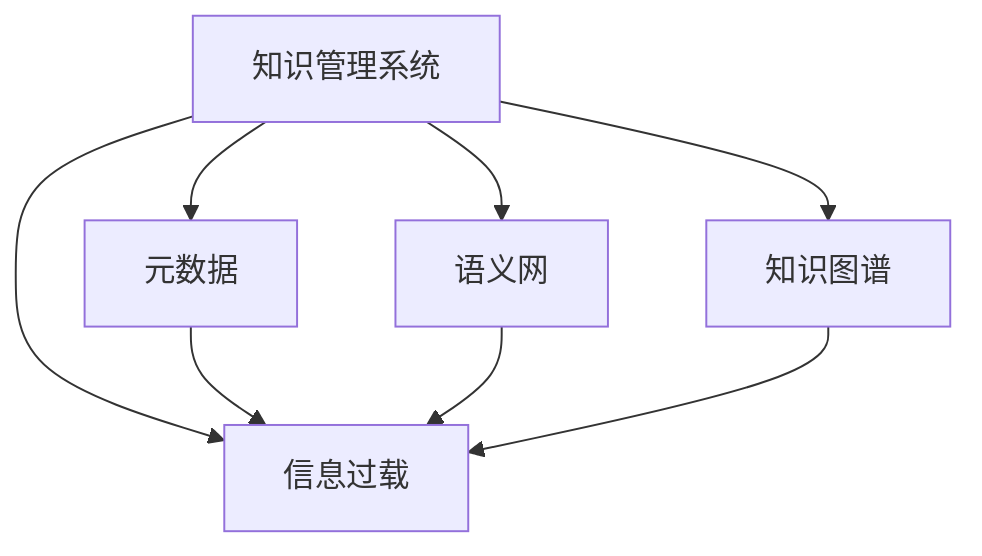

                 

## 1. 背景介绍

### 1.1 问题由来
信息过载（Information Overload）是当今数字化时代的一个重要现象。随着互联网的迅猛发展，人们每天都会接触到海量的信息，包括电子邮件、社交媒体、新闻、专业文章、视频、音频等。这些信息的数量之大、来源之广，超出了人类的处理能力。信息过载不仅耗费了人们宝贵的时间和精力，还可能导致注意力分散、决策困难等问题。

为了应对信息过载，知识管理系统（Knowledge Management System, KMS）应运而生。知识管理系统旨在帮助组织和个人更有效地收集、存储、检索、共享和利用知识，从而提高决策质量、优化工作流程、提升创新能力。本文将详细探讨信息过载的背景和现状，并介绍如何通过实施有效的知识管理系统来解决这一问题。

### 1.2 问题核心关键点
信息过载与知识管理系统实施的核心问题包括：

1. **信息源的多样性**：信息的来源丰富多样，包括内部文档、外部资源、社交媒体、在线平台等。如何整合和管理这些异构的信息源，是知识管理系统的关键挑战。

2. **信息量庞大**：每天产生的信息量巨大，如何在海量信息中找到有价值的内容，并进行有效存储和利用，是知识管理的核心任务。

3. **信息质量参差不齐**：信息的准确性、完整性、时效性各不相同，如何筛选和处理这些信息，以确保知识管理的质量，是一个重要问题。

4. **用户需求多样化**：不同用户有不同的信息需求，如何在知识管理系统中提供个性化、定制化的服务，满足不同用户的需求，是知识管理系统的应用目标。

5. **知识共享和协作**：知识管理系统不仅要实现知识的存储和检索，还要促进知识的共享和协作，提高组织的整体知识水平和创新能力。

通过实施知识管理系统，可以有效应对信息过载，提升信息处理效率，提高知识管理水平，为组织和个人提供更高效、更可靠的知识服务。

## 2. 核心概念与联系

### 2.1 核心概念概述
为了更好地理解知识管理系统，本节将介绍几个关键概念：

- **知识管理系统（KMS）**：利用信息技术手段，对知识进行系统化、结构化的管理和应用。KMS可以支持知识的创建、存储、检索、共享和应用，从而提升组织知识水平和创新能力。

- **信息过载（Information Overload）**：指信息量远远超出人类处理能力的现象，导致决策困难、注意力分散等问题。

- **元数据（Metadata）**：描述信息资源特征的数据，如作者、日期、关键词等。元数据对于信息的检索和组织至关重要。

- **语义网（Semantic Web）**：通过使用语义标注技术，使得信息更加易于理解和关联，从而提升信息检索的准确性和效率。

- **知识图谱（Knowledge Graph）**：通过结构化的方式，将信息组织成知识图谱，方便信息的存储、检索和关联。

这些核心概念之间的逻辑关系可以通过以下Mermaid流程图来展示：



这个流程图展示了知识管理系统与信息过载之间的关系，以及元数据、语义网和知识图谱如何帮助知识管理系统的构建和运作。

## 3. 核心算法原理 & 具体操作步骤
### 3.1 算法原理概述

知识管理系统的核心算法原理主要涉及信息检索和知识组织两个方面：

1. **信息检索**：通过构建索引和搜索算法，实现对信息的快速检索和定位。

2. **知识组织**：通过分类、标注、关联等技术，实现对知识的结构化和关联化。

### 3.2 算法步骤详解

知识管理系统的实施一般包括以下几个关键步骤：

**Step 1: 需求分析与规划**

- 收集组织内外的信息需求，明确知识管理系统的目标和功能。
- 分析现有信息系统的状况，评估现有系统的不足之处，规划新系统的架构和功能。

**Step 2: 元数据管理和元数据标准制定**

- 确定需要管理的元数据类型和标准，如作者、日期、关键词、分类等。
- 制定元数据的管理策略，确保元数据的准确性和一致性。

**Step 3: 知识库构建**

- 选择合适的知识库架构和工具，如文档管理系统、关系数据库、搜索引擎等。
- 根据元数据标准，将现有信息资源导入知识库，并进行结构化处理。

**Step 4: 知识检索与搜索**

- 构建索引和搜索算法，支持基于关键字、语义、分类等条件的快速检索。
- 优化搜索算法，提高检索速度和准确性。

**Step 5: 知识共享与协作**

- 实现知识的共享机制，如文档共享、讨论区、知识库等。
- 促进知识的协作，如团队协作工具、项目管理系统等。

**Step 6: 知识分析和报告**

- 通过分析知识库中的数据，生成报告和仪表板，支持决策支持。
- 定期评估知识管理系统的性能和效果，进行持续改进。

### 3.3 算法优缺点

知识管理系统在信息组织和检索方面具有以下优点：

1. **提升信息检索效率**：通过构建索引和搜索算法，实现了信息的快速定位和检索，减少了信息查找的时间成本。

2. **优化信息组织结构**：通过分类、标注、关联等技术，实现了知识的结构化和关联化，提高了信息的管理和利用效率。

3. **促进知识共享和协作**：通过知识库和协作工具，实现了知识的共享和协作，提升了组织的整体知识水平和创新能力。

4. **支持决策支持**：通过分析知识库中的数据，生成报告和仪表板，支持决策支持，提高了决策的科学性和准确性。

同时，知识管理系统也存在一定的局限性：

1. **依赖技术基础**：知识管理系统的实施需要依赖先进的技术平台和工具，对于一些技术基础薄弱的组织，可能需要较高的技术投入。

2. **数据整合困难**：现有的信息源格式各异，整合和处理这些异构信息源需要复杂的技术和大量的人力投入。

3. **用户接受度低**：部分用户对知识管理系统不熟悉，使用习惯和心理障碍可能会影响系统的推广和应用。

4. **知识质量依赖**：知识管理系统的效率和效果高度依赖于元数据的质量和准确性，元数据管理和维护的难度较大。

尽管存在这些局限性，但知识管理系统作为应对信息过载的重要手段，其优势和应用前景仍然不可忽视。未来相关研究的重点在于如何进一步降低技术门槛，提高系统的易用性和可扩展性，同时兼顾数据质量和技术安全等因素。

### 3.4 算法应用领域

知识管理系统在多个领域得到了广泛的应用，包括但不限于：

1. **企业知识管理**：通过知识管理系统，提升企业的知识水平和创新能力，支持企业的战略规划和决策支持。

2. **政府知识管理**：通过知识管理系统，提升政府的信息利用效率，支持政策制定和公共服务。

3. **医疗知识管理**：通过知识管理系统，支持医疗信息的共享和利用，提升医疗服务的质量和效率。

4. **教育知识管理**：通过知识管理系统，支持教育资源的共享和利用，提升教育质量和教学效果。

5. **科研知识管理**：通过知识管理系统，支持科研信息的共享和利用，促进科学研究和技术创新。

6. **金融知识管理**：通过知识管理系统，支持金融信息的共享和利用，支持金融决策和风险管理。

以上领域的应用展示了知识管理系统的广泛前景和重要价值。通过实施有效的知识管理系统，可以有效应对信息过载，提升信息处理效率，提高知识管理水平，为组织和个人提供更高效、更可靠的知识服务。

## 4. 数学模型和公式 & 详细讲解
### 4.1 数学模型构建

知识管理系统的数学模型主要涉及信息检索和知识组织两个方面：

- **信息检索模型**：通过构建倒排索引和向量空间模型，实现信息的快速检索和定位。
- **知识组织模型**：通过分类、标注、关联等技术，实现知识的结构化和关联化。

### 4.2 公式推导过程

以下我们将以向量空间模型为例，推导信息检索模型的基本公式。

假设我们有一个包含$n$个文档的文档集合，每个文档$d_i$包含$m$个特征项$t_1, t_2, ..., t_m$。我们将每个文档表示为一个$m$维的向量$\mathbf{v}_i$，其中$v_{ij}$表示文档$d_i$中特征项$t_j$的权重。

信息检索的目标是计算查询$q$与每个文档$d_i$的相似度，从而找到最相关的文档。我们可以使用余弦相似度来计算查询和文档之间的相似度，其公式如下：

$$
\text{similarity}(q, d_i) = \frac{\mathbf{q} \cdot \mathbf{v}_i}{||\mathbf{q}||_2 ||\mathbf{v}_i||_2}
$$

其中$\mathbf{q}$为查询向量，$\mathbf{v}_i$为文档向量，$||\mathbf{q}||_2$和$||\mathbf{v}_i||_2$分别为查询向量和文档向量的欧几里得范数。

通过计算每个文档与查询之间的相似度，可以按照相似度从高到低排序，选择最相关的文档进行展示和检索。

### 4.3 案例分析与讲解

假设我们有一个包含大量医学文献的文档集合，每个文档包含多个特征项，如“心脏病”、“高血压”、“糖尿病”等。我们将每个文档表示为一个向量，其中每个特征项的权重表示该特征项在文档中的重要性。

当用户查询“心脏病”时，我们可以将查询向量表示为包含1和0的向量，其中1表示该特征项在查询中存在，0表示不存在。

通过计算每个文档与查询之间的余弦相似度，可以找到最相关的医学文献，从而支持医生的决策和治疗方案制定。

## 5. 项目实践：代码实例和详细解释说明
### 5.1 开发环境搭建

在进行知识管理系统的项目实践前，我们需要准备好开发环境。以下是使用Python进行Elasticsearch开发的环境配置流程：

1. 安装Anaconda：从官网下载并安装Anaconda，用于创建独立的Python环境。

2. 创建并激活虚拟环境：
```bash
conda create -n elasticsearch-env python=3.8 
conda activate elasticsearch-env
```

3. 安装Elasticsearch：
```bash
pip install elasticsearch
```

4. 安装Flask：
```bash
pip install flask
```

5. 安装Elasticsearch-Py：
```bash
pip install elasticsearch-py
```

完成上述步骤后，即可在`elasticsearch-env`环境中开始项目实践。

### 5.2 源代码详细实现

下面我们以构建一个简单的知识管理系统为例，给出使用Elasticsearch和Flask的Python代码实现。

首先，定义Elasticsearch连接和索引：

```python
from elasticsearch import Elasticsearch
from flask import Flask, request, jsonify

app = Flask(__name__)

es = Elasticsearch([{'host': 'localhost', 'port': 9200}])
index_name = 'documents'

@app.route('/add_document', methods=['POST'])
def add_document():
    data = request.json
    id = data['id']
    body = data['body']
    es.index(index=index_name, id=id, body=body)
    return jsonify({'message': 'Document added successfully'}), 201

@app.route('/search_document', methods=['GET'])
def search_document():
    query = request.args.get('query')
    result = es.search(index=index_name, body={'query': {'match': {'body': query}}})
    return jsonify(result['hits']['hits'])
```

然后，定义知识管理系统的基本操作：

```python
@app.route('/get_document', methods=['GET'])
def get_document():
    id = request.args.get('id')
    doc = es.get(index=index_name, id=id)
    return jsonify(doc['_source'])

@app.route('/update_document', methods=['POST'])
def update_document():
    id = request.json['id']
    body = request.json['body']
    es.index(index=index_name, id=id, body=body)
    return jsonify({'message': 'Document updated successfully'}), 200

@app.route('/delete_document', methods=['DELETE'])
def delete_document():
    id = request.args.get('id')
    es.delete(index=index_name, id=id)
    return jsonify({'message': 'Document deleted successfully'}), 200
```

最后，启动Flask应用：

```python
if __name__ == '__main__':
    app.run(debug=True)
```

以上就是使用Python、Elasticsearch和Flask构建一个简单的知识管理系统的完整代码实现。可以看到，Elasticsearch提供了强大的搜索和索引功能，而Flask则方便地封装了RESTful API，使得知识管理系统的操作更加便捷和易于扩展。

### 5.3 代码解读与分析

让我们再详细解读一下关键代码的实现细节：

**Flask应用**：
- 定义了一个Flask应用，使用Elasticsearch和Flask提供RESTful API。
- 定义了添加、检索、更新、删除文档的API接口。

**Elasticsearch连接**：
- 定义了一个Elasticsearch连接，连接本地Elasticsearch服务。
- 定义了一个索引名称，用于存储文档数据。

**文档操作API**：
- `/add_document`：添加文档API，接收JSON格式的数据，将文档添加到Elasticsearch索引中。
- `/search_document`：搜索文档API，根据查询字符串在索引中查找文档，返回匹配结果。
- `/get_document`：获取文档API，根据文档ID获取文档详情。
- `/update_document`：更新文档API，根据文档ID更新文档内容。
- `/delete_document`：删除文档API，根据文档ID删除文档。

这些API接口可以方便地实现知识管理系统的基本操作，如文档的添加、检索、更新和删除。通过使用Elasticsearch和Flask，可以高效地构建知识管理系统的数据管理和检索功能。

## 6. 实际应用场景
### 6.1 企业知识管理

企业知识管理系统可以帮助企业更好地管理和利用其内部和外部的知识资源，提升企业知识水平和创新能力。通过知识管理系统，企业可以：

- **优化决策支持**：通过知识库中的数据和分析报告，支持企业的战略规划和决策制定。
- **提升协作效率**：通过知识共享和协作工具，支持团队的协同工作和知识传递。
- **加速知识创新**：通过知识库中的文档和资源，加速知识的整合和创新，促进产品和服务的发展。

### 6.2 政府知识管理

政府知识管理系统可以帮助政府更好地管理和利用其内部和外部的信息资源，提升政府的治理能力和服务水平。通过知识管理系统，政府可以：

- **支持政策制定**：通过知识库中的数据和分析报告，支持政策制定和公共服务的优化。
- **提升公共服务**：通过知识共享和协作工具，支持公共服务的协同工作和知识传递。
- **促进数据开放**：通过开放知识库中的数据和资源，促进数据开放和共享，提升社会治理的透明度和效率。

### 6.3 医疗知识管理

医疗知识管理系统可以帮助医疗机构更好地管理和利用其内部和外部的医学知识资源，提升医疗服务的质量和效率。通过知识管理系统，医疗机构可以：

- **支持临床决策**：通过知识库中的数据和分析报告，支持医生的诊断和治疗决策。
- **促进医疗创新**：通过知识库中的文档和资源，加速医学知识的整合和创新，促进新药物和治疗方法的开发。
- **支持远程医疗**：通过知识共享和协作工具，支持远程医疗的协同工作和知识传递。

### 6.4 教育知识管理

教育知识管理系统可以帮助教育机构更好地管理和利用其内部和外部的教育资源，提升教育质量和教学效果。通过知识管理系统，教育机构可以：

- **支持教学设计**：通过知识库中的数据和资源，支持教师的教学设计和课程开发。
- **促进学生学习**：通过知识共享和协作工具，支持学生的自主学习和知识传递。
- **加速教育创新**：通过知识库中的文档和资源，加速教育知识的整合和创新，促进教育改革和创新。

### 6.5 科研知识管理

科研知识管理系统可以帮助科研机构更好地管理和利用其内部和外部的科研资源，提升科研水平和创新能力。通过知识管理系统，科研机构可以：

- **支持研究设计**：通过知识库中的数据和资源，支持科研人员的研究设计和实验方案。
- **促进科研合作**：通过知识共享和协作工具，支持科研人员的合作研究和知识传递。
- **加速科研成果转化**：通过知识库中的文档和资源，加速科研成果的整合和创新，促进科研成果的转化和应用。

## 7. 工具和资源推荐
### 7.1 学习资源推荐

为了帮助开发者系统掌握知识管理系统的理论基础和实践技巧，这里推荐一些优质的学习资源：

1. **《信息检索与知识管理》课程**：由斯坦福大学开设的课程，介绍了信息检索和知识管理的理论基础和实际应用。

2. **《Elasticsearch官方文档》**：Elasticsearch官方文档，提供了详细的Elasticsearch API和操作指导，是学习和使用Elasticsearch的必备资源。

3. **《Flask官方文档》**：Flask官方文档，提供了详细的Flask框架的使用指南和示例代码，是学习和使用Flask的必备资源。

4. **《信息检索与知识管理的最佳实践》书籍**：介绍了信息检索和知识管理的最佳实践和案例分析，是系统学习信息管理知识的推荐书籍。

5. **《Elasticsearch最佳实践》书籍**：介绍了Elasticsearch的最佳实践和案例分析，是学习和使用Elasticsearch的重要参考资料。

通过这些资源的学习实践，相信你一定能够快速掌握知识管理系统的精髓，并用于解决实际的NLP问题。

### 7.2 开发工具推荐

高效的开发离不开优秀的工具支持。以下是几款用于知识管理系统开发的常用工具：

1. **Elasticsearch**：基于Lucene实现的开源搜索引擎，支持全文检索、分布式存储和处理，是构建知识管理系统的核心工具。

2. **Flask**：基于Python的开源Web框架，简单易用，支持RESTful API开发，是构建知识管理系统前端界面的首选工具。

3. **Elasticsearch-Py**：Elasticsearch的Python客户端库，提供了Elasticsearch API的Python接口，方便在Python中操作Elasticsearch。

4. **Jupyter Notebook**：基于Python的交互式开发环境，支持代码和文档的混合编写和展示，是数据分析和实验开发的好工具。

5. **Postman**：基于Web的API测试工具，支持HTTP请求的调试和自动化测试，是API接口开发和测试的好工具。

合理利用这些工具，可以显著提升知识管理系统的开发效率，加快创新迭代的步伐。

### 7.3 相关论文推荐

知识管理系统的研究和实践源于学界的持续研究。以下是几篇奠基性的相关论文，推荐阅读：

1. **《信息检索与知识管理综述》**：介绍了信息检索和知识管理的理论基础和实际应用，提供了系统的知识框架。

2. **《知识管理系统的设计与实现》**：介绍了知识管理系统的设计和实现方法，提供了实用的系统设计和开发指导。

3. **《Elasticsearch在大数据中的应用》**：介绍了Elasticsearch在大数据环境中的应用场景和实现方法，提供了实际应用案例和经验。

4. **《知识管理系统在企业中的应用》**：介绍了知识管理系统在企业中的应用案例和效果，提供了实际应用经验和教训。

5. **《知识图谱在信息检索中的应用》**：介绍了知识图谱在信息检索中的应用方法和效果，提供了系统的技术框架和实现指导。

这些论文代表了大语言模型微调技术的发展脉络。通过学习这些前沿成果，可以帮助研究者把握学科前进方向，激发更多的创新灵感。

## 8. 总结：未来发展趋势与挑战
### 8.1 总结

本文对信息过载与知识管理系统的实施进行了全面系统的介绍。首先阐述了信息过载的背景和现状，明确了知识管理系统的目标和功能。其次，从原理到实践，详细讲解了知识管理系统的数学模型和操作步骤，给出了知识管理系统开发的完整代码实例。同时，本文还广泛探讨了知识管理系统在企业、政府、医疗、教育、科研等多个领域的应用前景，展示了知识管理系统的广泛前景和重要价值。

通过本文的系统梳理，可以看到，知识管理系统作为应对信息过载的重要手段，其优势和应用前景仍然不可忽视。未来相关研究的重点在于如何进一步降低技术门槛，提高系统的易用性和可扩展性，同时兼顾数据质量和技术安全等因素。

### 8.2 未来发展趋势

展望未来，知识管理系统的发展将呈现以下几个趋势：

1. **智能化的知识管理**：通过引入人工智能技术，实现知识自动化的标注、分类和关联，提升知识管理的效率和质量。

2. **个性化知识推荐**：通过分析用户行为和偏好，实现个性化的知识推荐，提升知识管理的个性化和用户体验。

3. **多模态知识管理**：通过融合视觉、听觉、触觉等多模态信息，实现多模态的知识管理，提升知识管理的丰富性和全面性。

4. **联邦知识管理**：通过联邦学习等技术，实现跨组织的知识共享和协同管理，提升知识管理的协作水平。

5. **知识图谱的深度应用**：通过知识图谱的深度应用，实现知识的高效检索和应用，提升知识管理的精确性和智能化水平。

以上趋势凸显了知识管理系统的广阔前景和应用潜力。这些方向的探索发展，必将进一步提升知识管理的效率和质量，为组织和个人提供更高效、更可靠的知识服务。

### 8.3 面临的挑战

尽管知识管理系统已经取得了瞩目成就，但在迈向更加智能化、普适化应用的过程中，它仍面临着诸多挑战：

1. **数据质量问题**：知识管理系统的效果高度依赖于数据的质量和准确性，如何确保数据的真实性和完整性，是一个重要问题。

2. **技术门槛高**：知识管理系统的实施需要依赖先进的技术平台和工具，对于一些技术基础薄弱的组织，可能需要较高的技术投入。

3. **用户接受度低**：部分用户对知识管理系统不熟悉，使用习惯和心理障碍可能会影响系统的推广和应用。

4. **系统复杂度高**：知识管理系统涉及的技术领域众多，包括自然语言处理、信息检索、数据分析等，系统的复杂度高，开发和维护难度大。

尽管存在这些挑战，但知识管理系统作为应对信息过载的重要手段，其优势和应用前景仍然不可忽视。未来相关研究的重点在于如何进一步降低技术门槛，提高系统的易用性和可扩展性，同时兼顾数据质量和技术安全等因素。

### 8.4 未来突破

面对知识管理系统所面临的种种挑战，未来的研究需要在以下几个方面寻求新的突破：

1. **优化数据质量管理**：通过引入数据清洗、数据标注等技术，确保数据的真实性和完整性，提高知识管理的质量。

2. **降低技术门槛**：通过提供简单易用的工具和接口，降低知识管理系统的技术门槛，提升系统的易用性和可扩展性。

3. **加强用户培训**：通过培训和宣传，提升用户对知识管理系统的认识和接受度，促进系统的推广和应用。

4. **优化系统架构**：通过优化系统架构和设计，降低系统的复杂度和维护难度，提高系统的稳定性和可靠性。

5. **引入人工智能技术**：通过引入人工智能技术，实现知识自动化的标注、分类和关联，提升知识管理的效率和质量。

6. **实现多模态知识管理**：通过融合视觉、听觉、触觉等多模态信息，实现多模态的知识管理，提升知识管理的丰富性和全面性。

这些研究方向的探索，必将引领知识管理系统迈向更高的台阶，为构建安全、可靠、可解释、可控的知识管理平台铺平道路。面向未来，知识管理系统还需要与其他人工智能技术进行更深入的融合，如知识表示、因果推理、强化学习等，多路径协同发力，共同推动知识管理的进步。

## 9. 附录：常见问题与解答

**Q1：知识管理系统的核心功能是什么？**

A: 知识管理系统的核心功能包括：

1. **知识收集和存储**：通过各种渠道收集和存储组织的知识资源，确保知识资源的完整性和可访问性。

2. **知识检索和查询**：提供搜索和查询接口，方便用户快速定位和检索知识资源。

3. **知识分类和标注**：通过分类和标注技术，对知识资源进行结构化处理，提升知识管理的效率和质量。

4. **知识共享和协作**：提供协作工具和机制，促进知识资源的共享和利用，支持团队的协同工作和知识传递。

5. **知识分析和报告**：通过分析知识库中的数据，生成报告和仪表板，支持决策支持和业务优化。

6. **知识迁移和同步**：支持知识的迁移和同步，确保知识在不同系统间的兼容性和可转移性。

**Q2：如何选择适合的知识管理系统？**

A: 选择适合的知识管理系统需要考虑以下几个方面：

1. **业务需求**：根据组织的业务需求，选择适合的知识管理功能。

2. **数据来源和格式**：根据知识来源和格式，选择适合的知识管理工具和接口。

3. **技术架构**：根据技术架构和系统复杂度，选择适合的技术平台和工具。

4. **用户接受度**：根据用户接受度和使用习惯，选择适合的用户界面和操作方式。

5. **可扩展性**：根据系统扩展和升级需求，选择适合的可扩展性和灵活性。

6. **成本效益**：根据成本和效益，选择适合的供应商和实施方式。

通过全面考虑这些因素，可以选择合适的知识管理系统，满足组织的知识管理需求。

**Q3：如何提高知识管理系统的数据质量？**

A: 提高知识管理系统的数据质量需要从以下几个方面入手：

1. **数据清洗**：通过数据清洗技术，去除重复、错误和不完整的数据，提升数据质量。

2. **数据标注**：通过数据标注技术，为数据添加元数据和标签，提升数据的管理和利用效率。

3. **数据验证**：通过数据验证技术，确保数据的真实性和准确性，提升数据的质量和可信度。

4. **数据整合**：通过数据整合技术，将异构的数据源整合到一个统一的知识库中，提升数据的完整性和一致性。

5. **数据质量监控**：通过数据质量监控技术，实时监控和评估数据质量，及时发现和解决数据问题。

通过这些措施，可以有效提高知识管理系统的数据质量，提升知识管理的效率和效果。

**Q4：知识管理系统的数据管理策略有哪些？**

A: 知识管理系统的数据管理策略包括：

1. **元数据管理**：通过元数据管理技术，为数据添加描述信息和标签，方便数据的检索和利用。

2. **数据分类和标注**：通过分类和标注技术，对数据进行结构化处理，提升数据的组织和管理效率。

3. **数据版本控制**：通过版本控制技术，确保数据的追溯和变更记录，防止数据丢失和篡改。

4. **数据权限管理**：通过权限管理技术，控制数据的访问和使用权限，确保数据的安全性和保密性。

5. **数据备份和恢复**：通过备份和恢复技术，确保数据的备份和灾难恢复，保障数据的安全性和可靠性。

6. **数据集成和共享**：通过数据集成和共享技术，实现跨系统、跨组织的数据共享和协同管理。

通过这些策略，可以有效提升知识管理系统的数据管理水平，保障数据的完整性、准确性和安全性。

**Q5：如何实现知识管理系统的个性化推荐？**

A: 实现知识管理系统的个性化推荐需要以下几个步骤：

1. **用户行为分析**：通过分析用户的行为和偏好，获取用户的兴趣和需求。

2. **数据标注和特征提取**：为知识资源添加标注和特征，方便机器学习模型的训练和推理。

3. **推荐模型训练**：通过训练推荐模型，实现对知识资源的推荐排序，生成个性化推荐结果。

4. **推荐结果展示**：通过推荐结果展示界面，向用户展示个性化的知识推荐，支持用户的选择和反馈。

5. **推荐系统优化**：通过持续优化推荐算法和模型，提高推荐效果和用户体验。

通过这些步骤，可以有效实现知识管理系统的个性化推荐，提升知识管理的用户体验和效率。

---

作者：禅与计算机程序设计艺术 / Zen and the Art of Computer Programming

