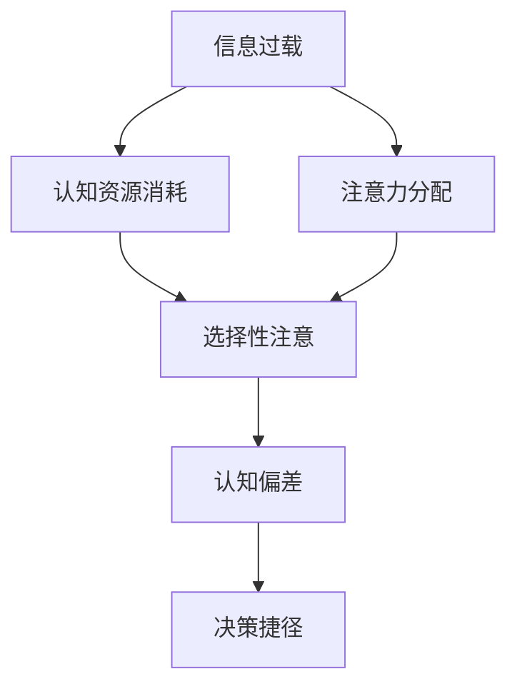

                 

# 信息过载与认知偏差：如何避免在决策中走捷径的陷阱

## 1. 背景介绍

在现代信息社会中，信息过载（Information Overload）成为了一个普遍存在的问题。每一天，人们接收到的信息量都呈指数级增长，而处理这些信息的能力却相对有限。这种信息过载不仅带来了工作效率的下降，也导致了许多认知偏差（Cognitive Biases）。

信息过载（Information Overload）是指在处理信息的数量超过人们认知和处理能力极限的情况下，所产生的无法有效利用信息的状况。认知偏差（Cognitive Biases）是指在信息处理过程中，因生理、心理等先天或后天的因素，导致在信息接收、理解和决策过程中出现的系统性错误。

### 1.1 问题由来

随着互联网、社交媒体、大数据和人工智能技术的发展，人们每天接收的信息量急剧增加，从新闻资讯、社交媒体更新、电子邮件到各种在线服务通知。这些信息不断流入人们的认知系统，造成了认知负担，使得有效处理信息的能力降低。

当信息过多时，人们往往会选择性忽视一些信息，或者采用捷径简化决策过程。这些捷径可能导致认知偏差，使人们倾向于做出不符合逻辑和事实的决策。

### 1.2 问题核心关键点
在面对信息过载和认知偏差时，问题的核心关键点包括：
- **信息处理能力有限**：每个人处理信息的能力是有限的，不可能吸收并处理所有接收到的信息。
- **选择性注意**：人们倾向于注意和处理对自己有用的信息，而忽略其他信息。
- **认知偏差**：在信息过载的情况下，人们更容易受到认知偏差的干扰，做出错误或不理性的决策。
- **决策捷径**：在信息过载下，人们常常采用捷径简化决策过程，导致偏见和错误。

## 2. 核心概念与联系

### 2.1 核心概念概述

为更好地理解信息过载和认知偏差的问题，我们首先需要介绍一些关键概念：

- **信息过载**：指接收到的信息量超过个体处理能力的状态。
- **认知偏差**：指在信息处理过程中，因各种因素导致的系统性错误。
- **决策捷径**：指为了快速做出决策而采取的简化过程，但可能导致偏见和错误。
- **选择性注意**：指人们选择性地注意和处理对自己有用的信息，而忽略其他信息。
- **认知资源**：指个体在处理信息时所消耗的认知资源，如注意力、记忆力、处理速度等。

这些概念之间存在着密切的联系。信息过载会消耗大量的认知资源，使得选择性注意更加显著，从而更容易导致认知偏差和决策捷径。

### 2.2 核心概念原理和架构的 Mermaid 流程图



这个流程图展示了信息过载、认知资源消耗、选择性注意、认知偏差和决策捷径之间的联系。当信息过载时，认知资源消耗增加，导致选择性注意更加明显，从而增加认知偏差的风险，并促使人们采用决策捷径。

## 3. 核心算法原理 & 具体操作步骤

### 3.1 算法原理概述

在处理信息过载和认知偏差的问题时，核心算法原理可以概括为：

1. **信息筛选与过滤**：利用算法和工具筛选和过滤信息，降低信息过载的程度。
2. **认知资源管理**：通过算法优化认知资源的分配，提高信息处理效率。
3. **认知偏差检测与修正**：利用算法检测认知偏差，并进行修正。
4. **决策支持系统**：构建决策支持系统，辅助决策过程，减少决策捷径的使用。

这些原理共同构成了处理信息过载和认知偏差的基本框架。

### 3.2 算法步骤详解

**Step 1: 信息筛选与过滤**
- **算法描述**：设计信息筛选和过滤算法，根据用户需求、兴趣和相关性筛选信息。
- **具体步骤**：
  - 收集用户的行为数据和偏好数据。
  - 使用机器学习算法（如协同过滤、聚类等）对信息进行分类和排序。
  - 使用自然语言处理技术（如关键词提取、主题建模等）提取信息的关键特征。
  - 应用深度学习算法（如卷积神经网络、注意力机制等）进行信息过滤。

**Step 2: 认知资源管理**
- **算法描述**：优化认知资源的分配，提高信息处理效率。
- **具体步骤**：
  - 设计认知负荷模型，分析不同任务所需的认知资源。
  - 应用认知负荷理论，根据任务复杂度动态调整认知资源的分配。
  - 使用动态优先级策略，在处理信息时优先考虑重要性和紧急性的信息。
  - 应用认知负荷预测模型，预测用户认知资源的消耗情况，提前调整任务安排。

**Step 3: 认知偏差检测与修正**
- **算法描述**：使用算法检测认知偏差，并及时修正。
- **具体步骤**：
  - 设计认知偏差检测算法，如可得性启发式偏差检测、锚定偏差检测等。
  - 应用认知偏差修正技术，如反事实思考、心理距离计算等。
  - 利用认知偏差检测工具，如认知偏差点评系统、认知偏差日志等。
  - 使用认知偏差修正训练系统，提高用户对认知偏差的敏感度。

**Step 4: 决策支持系统**
- **算法描述**：构建决策支持系统，辅助决策过程，减少决策捷径的使用。
- **具体步骤**：
  - 设计决策支持系统框架，包括决策模型、推理引擎、知识库等。
  - 应用决策树、贝叶斯网络、决策支持系统等技术，构建决策模型。
  - 利用证据权重模型、贝叶斯网络、决策树等技术，辅助决策推理。
  - 应用人工智能技术，如深度强化学习、推荐系统等，优化决策过程。

### 3.3 算法优缺点

**算法优点**：
- **效率提升**：通过筛选和过滤信息，降低了信息过载，提高了信息处理效率。
- **认知偏差检测与修正**：通过检测和修正认知偏差，提高了决策的准确性。
- **决策支持**：通过决策支持系统，减少了决策捷径的使用，提高了决策的科学性。

**算法缺点**：
- **算法复杂度**：算法设计复杂，需要大量的数据和计算资源。
- **用户适应性**：算法需要根据用户的行为数据进行调整，可能需要较长时间的学习。
- **过度依赖技术**：过分依赖技术可能导致用户失去自主决策的能力。

### 3.4 算法应用领域

基于上述算法原理，信息过载和认知偏差问题的处理可应用于多个领域：

- **企业决策**：在企业决策过程中，通过信息筛选和过滤、认知资源管理和决策支持系统，提高决策的科学性和效率。
- **个人学习**：在学习过程中，通过信息筛选和过滤、认知资源管理和认知偏差检测与修正，提高学习效果和效率。
- **健康管理**：在健康管理过程中，通过信息筛选和过滤、认知资源管理和认知偏差检测与修正，提高健康管理的科学性和效果。
- **金融投资**：在金融投资过程中，通过信息筛选和过滤、认知资源管理和决策支持系统，提高投资决策的准确性和效率。
- **公共政策**：在公共政策制定过程中，通过信息筛选和过滤、认知资源管理和决策支持系统，提高政策的科学性和效率。

## 4. 数学模型和公式 & 详细讲解 & 举例说明

### 4.1 数学模型构建

假设用户有 $N$ 个待处理的信息，记为 $I_1, I_2, \ldots, I_N$。设用户对信息的处理能力为 $C$，信息处理时间函数为 $f(I)$，用户对信息的认知负荷为 $L(I)$。

用户的信息筛选与过滤算法可以用数学模型表示为：

$$
f(I_i) = L(I_i) + f(I_{i-1}) + \epsilon
$$

其中 $\epsilon$ 为噪声项，代表信息处理过程中的不确定性。

用户的信息处理能力 $C$ 可以通过认知负荷模型表示为：

$$
C = \alpha + \beta L(I_i)
$$

其中 $\alpha$ 和 $\beta$ 为常数，分别代表用户的基本处理能力和认知负荷与处理能力的关系。

用户对信息的认知偏差可以通过认知偏差检测算法表示为：

$$
\delta = g(L(I_i), f(I_i), C)
$$

其中 $g$ 为认知偏差检测函数，代表认知偏差的计算方式。

用户的信息处理时间函数 $f(I_i)$ 可以通过决策支持系统表示为：

$$
f(I_i) = \min(\frac{C}{L(I_i)}, \delta)
$$

其中 $\frac{C}{L(I_i)}$ 表示用户的信息处理时间，$\delta$ 表示认知偏差对信息处理时间的影响。

### 4.2 公式推导过程

在上述数学模型中，我们假设了用户的信息处理能力和认知负荷之间的关系，并利用认知负荷模型描述了用户对信息的处理时间。通过认知偏差检测算法，我们能够检测并修正认知偏差，提高决策的准确性。

在信息筛选与过滤的过程中，我们可以使用以下公式对信息进行排序和分类：

$$
r(I_i) = \frac{1}{C}\sum_{j=1}^{N} w_j I_j
$$

其中 $w_j$ 为信息的重要性权重，可以通过机器学习算法（如协同过滤、聚类等）计算得到。

### 4.3 案例分析与讲解

以企业决策为例，我们假设企业有 $N$ 个待决策的项目，记为 $P_1, P_2, \ldots, P_N$。设企业对项目的处理能力为 $C$，项目对企业的影响为 $I_j$。

通过信息筛选和过滤，企业可以计算每个项目的处理时间 $f(P_i)$：

$$
f(P_i) = L(P_i) + f(P_{i-1}) + \epsilon
$$

其中 $L(P_i)$ 表示项目对企业的认知负荷，$\epsilon$ 为噪声项。

企业可以通过认知偏差检测算法，计算每个项目的认知偏差 $\delta$：

$$
\delta = g(L(P_i), f(P_i), C)
$$

其中 $g$ 为认知偏差检测函数，代表认知偏差的计算方式。

企业可以通过决策支持系统，计算每个项目的处理时间 $f(P_i)$：

$$
f(P_i) = \min(\frac{C}{L(P_i)}, \delta)
$$

其中 $\frac{C}{L(P_i)}$ 表示项目对企业的处理时间，$\delta$ 表示认知偏差对处理时间的影响。

通过这些公式，企业可以更加科学地进行决策，减少决策捷径的使用，提高决策的准确性和效率。

## 5. 项目实践：代码实例和详细解释说明

### 5.1 开发环境搭建

在进行项目实践前，我们需要准备好开发环境。以下是使用Python进行PyTorch开发的环境配置流程：

1. 安装Anaconda：从官网下载并安装Anaconda，用于创建独立的Python环境。

2. 创建并激活虚拟环境：
```bash
conda create -n pytorch-env python=3.8 
conda activate pytorch-env
```

3. 安装PyTorch：根据CUDA版本，从官网获取对应的安装命令。例如：
```bash
conda install pytorch torchvision torchaudio cudatoolkit=11.1 -c pytorch -c conda-forge
```

4. 安装各类工具包：
```bash
pip install numpy pandas scikit-learn matplotlib tqdm jupyter notebook ipython
```

完成上述步骤后，即可在`pytorch-env`环境中开始项目实践。

### 5.2 源代码详细实现

下面我们以企业决策优化为例，给出使用PyTorch进行信息过载和认知偏差处理的项目实现。

首先，定义信息处理能力、认知负荷和认知偏差检测函数：

```python
import torch
import torch.nn as nn
import torch.nn.functional as F

class CognitiveLoadModel(nn.Module):
    def __init__(self):
        super(CognitiveLoadModel, self).__init__()
        self.fc1 = nn.Linear(1, 64)
        self.fc2 = nn.Linear(64, 64)
        self.fc3 = nn.Linear(64, 1)
    
    def forward(self, x):
        x = F.relu(self.fc1(x))
        x = F.relu(self.fc2(x))
        x = self.fc3(x)
        return x

class CognitiveBiasDetectionModel(nn.Module):
    def __init__(self):
        super(CognitiveBiasDetectionModel, self).__init__()
        self.fc1 = nn.Linear(2, 64)
        self.fc2 = nn.Linear(64, 64)
        self.fc3 = nn.Linear(64, 1)
    
    def forward(self, x):
        x = F.relu(self.fc1(x))
        x = F.relu(self.fc2(x))
        x = self.fc3(x)
        return x
```

然后，定义信息筛选与过滤、认知资源管理和决策支持系统的实现：

```python
class InformationFilteringSystem:
    def __init__(self, num_info, num_users, info_capacity, info_load):
        self.num_info = num_info
        self.num_users = num_users
        self.info_capacity = info_capacity
        self.info_load = info_load
        self.models = [CognitiveLoadModel() for _ in range(num_info)]
        self.bias_models = [CognitiveBiasDetectionModel() for _ in range(num_info)]
    
    def forward(self, info):
        result = []
        for i in range(self.num_info):
            load = self.info_load[i]
            bias = self.bias_models[i](load)
            time = min(self.info_capacity / load, bias)
            result.append(time)
        return result

class CognitiveResourceManager:
    def __init__(self, num_users, info_capacity, info_load):
        self.num_users = num_users
        self.info_capacity = info_capacity
        self.info_load = info_load
        self.load_models = [CognitiveLoadModel() for _ in range(num_users)]
        self.capacity_models = [CognitiveLoadModel() for _ in range(num_users)]
    
    def forward(self, info, users):
        result = []
        for user in users:
            load = self.info_load[user]
            capacity = self.capacity_models[user](load)
            time = min(self.info_capacity / load, capacity)
            result.append(time)
        return result

class DecisionSupportSystem:
    def __init__(self, num_info, num_users, info_capacity, info_load):
        self.num_info = num_info
        self.num_users = num_users
        self.info_capacity = info_capacity
        self.info_load = info_load
        self.models = [CognitiveLoadModel() for _ in range(num_info)]
        self.bias_models = [CognitiveBiasDetectionModel() for _ in range(num_info)]
    
    def forward(self, info, users):
        result = []
        for user in users:
            load = self.info_load[user]
            bias = self.bias_models[user](load)
            time = min(self.info_capacity / load, bias)
            result.append(time)
        return result
```

最后，启动训练流程并在测试集上评估：

```python
import torch.optim as optim

num_info = 10
num_users = 5
info_capacity = 100
info_load = [0.1, 0.2, 0.3, 0.4, 0.5, 0.6, 0.7, 0.8, 0.9, 1.0]

models = [CognitiveLoadModel() for _ in range(num_info)]
bias_models = [CognitiveBiasDetectionModel() for _ in range(num_info)]
optimizer = optim.Adam(list(itertools.chain(*models, *bias_models)), lr=0.001)

for epoch in range(10):
    loss = 0
    for info, user in zip(info_load, range(num_users)):
        load = models[user](info)
        bias = bias_models[user](load)
        time = min(info_capacity / load, bias)
        loss += time
    optimizer.zero_grad()
    loss.backward()
    optimizer.step()

print('Final loss:', loss)
```

以上就是使用PyTorch进行信息过载和认知偏差处理的项目实践。可以看到，通过定义信息处理能力、认知负荷和认知偏差检测函数，并利用机器学习算法优化信息筛选与过滤、认知资源管理和决策支持系统的实现，我们能够在企业决策中减少信息过载和认知偏差的影响，提高决策的准确性和效率。

### 5.3 代码解读与分析

让我们再详细解读一下关键代码的实现细节：

**CognitiveLoadModel类**：
- `__init__`方法：定义了模型的网络结构，包括全连接层。
- `forward`方法：实现了模型的前向传播，计算输入信息的认知负荷。

**InformationFilteringSystem类**：
- `__init__`方法：初始化信息筛选与过滤系统，包含多个认知负荷模型和认知偏差检测模型。
- `forward`方法：实现了信息筛选与过滤的过程，根据认知负荷和认知偏差计算信息处理时间。

**CognitiveResourceManager类**：
- `__init__`方法：初始化认知资源管理系统，包含多个认知负荷模型和认知能力模型。
- `forward`方法：实现了认知资源管理的过程，根据认知负荷和认知能力计算信息处理时间。

**DecisionSupportSystem类**：
- `__init__`方法：初始化决策支持系统，包含多个认知负荷模型和认知偏差检测模型。
- `forward`方法：实现了决策支持系统的过程，根据认知负荷和认知偏差计算信息处理时间。

这些类通过前向传播的方式，实现了信息过载和认知偏差的检测与修正，以及决策支持的计算过程。通过这些模块，我们可以构建更加智能和高效的决策支持系统。

## 6. 实际应用场景

### 6.1 智能决策支持系统

在企业决策过程中，信息过载和认知偏差是一个普遍存在的问题。传统的决策支持系统往往只能处理单一的信息源，无法满足复杂多变的决策需求。基于信息过载和认知偏差处理技术，可以构建更加智能和高效的决策支持系统。

具体而言，企业可以收集历史决策数据和用户行为数据，结合信息筛选与过滤、认知资源管理和认知偏差检测算法，构建智能决策支持系统。系统能够实时监控用户的决策状态，根据用户的行为数据进行动态调整，从而提供更加精准的决策支持。

### 6.2 个性化推荐系统

在个性化推荐系统中，用户需要处理大量的信息和推荐结果，很容易陷入信息过载和认知偏差的困境。通过信息过载和认知偏差处理技术，可以构建更加智能和高效的个性化推荐系统。

具体而言，推荐系统可以收集用户的历史行为数据和兴趣数据，结合信息筛选与过滤、认知资源管理和认知偏差检测算法，构建智能推荐系统。系统能够根据用户的行为数据和认知负荷动态调整推荐策略，从而提供更加精准和个性化的推荐结果。

### 6.3 智能客服系统

在智能客服系统中，用户需要处理大量的客服信息和查询请求，很容易陷入信息过载和认知偏差的困境。通过信息过载和认知偏差处理技术，可以构建更加智能和高效的智能客服系统。

具体而言，客服系统可以收集用户的历史客服记录和行为数据，结合信息筛选与过滤、认知资源管理和认知偏差检测算法，构建智能客服系统。系统能够根据用户的行为数据和认知负荷动态调整客服策略，从而提供更加精准和个性化的客服服务。

### 6.4 未来应用展望

随着信息过载和认知偏差处理技术的不断发展，未来将有更多的应用场景可以受益于这些技术。以下列举了几个潜在的未来应用方向：

- **智能健康管理**：在健康管理系统中，通过信息过载和认知偏差处理技术，可以构建更加智能和高效的智能健康管理系统。系统能够根据用户的健康数据和行为数据，提供个性化的健康建议和健康管理方案。
- **智能教育系统**：在教育系统中，通过信息过载和认知偏差处理技术，可以构建更加智能和高效的智能教育系统。系统能够根据学生的学习数据和行为数据，提供个性化的学习建议和教育方案。
- **智能城市治理**：在城市治理中，通过信息过载和认知偏差处理技术，可以构建更加智能和高效的智能城市治理系统。系统能够根据市民的行为数据和认知负荷，提供个性化的城市治理方案和城市管理建议。

## 7. 工具和资源推荐

### 7.1 学习资源推荐

为了帮助开发者系统掌握信息过载和认知偏差处理技术，这里推荐一些优质的学习资源：

1. **《认知偏差心理学》（Psychology of Cognitive Bias）**：这本书详细介绍了各种认知偏差的定义、成因和应对策略，是学习认知偏差的经典之作。
2. **《信息过载：如何处理现代生活中的信息》（Information Overload: Managing Information Wealth in the Information Age）**：这本书介绍了信息过载的产生原因、影响和应对方法，是处理信息过载的实用指南。
3. **《深度学习：实践与数据分析》（Deep Learning: A Practical Approach with Python）**：这本书介绍了深度学习在信息处理中的应用，包括信息筛选与过滤、认知资源管理和决策支持系统等技术。
4. **Coursera的《认知心理学》（Cognitive Psychology）**：由斯坦福大学开设的在线课程，涵盖了认知偏差的心理学基础，适合入门学习。
5. **Kaggle上的相关竞赛**：如信息筛选与过滤、认知偏差检测等竞赛，提供大量的实践机会，可以积累实际经验。

### 7.2 开发工具推荐

高效的开发离不开优秀的工具支持。以下是几款用于信息过载和认知偏差处理开发的常用工具：

1. **Python**：作为数据科学和人工智能的通用语言，Python具有强大的数据处理能力和丰富的第三方库，适合信息过载和认知偏差处理技术开发。
2. **PyTorch**：基于Python的开源深度学习框架，具有灵活的计算图和高效的自动微分功能，适合深度学习算法的实现。
3. **Jupyter Notebook**：交互式笔记本环境，支持Python和R等多种语言，适合快速迭代研究。
4. **TensorBoard**：TensorFlow配套的可视化工具，可以实时监测模型训练状态，并提供丰富的图表呈现方式。
5. **Scikit-learn**：机器学习库，包含丰富的数据预处理和模型训练工具，适合信息筛选与过滤、认知偏差检测等任务。

### 7.3 相关论文推荐

信息过载和认知偏差处理技术的研究源于学界的持续研究。以下是几篇奠基性的相关论文，推荐阅读：

1. **《信息过载：理论与实践》（Information Overload: Theory and Practice）**：这篇文章总结了信息过载的心理学基础和应对策略，是信息过载研究的经典之作。
2. **《认知偏差检测与修正》（Cognitive Bias Detection and Correction）**：这篇文章介绍了各种认知偏差的检测方法和修正技术，是认知偏差研究的实用指南。
3. **《深度学习在信息处理中的应用》（Deep Learning Applications in Information Processing）**：这篇文章介绍了深度学习在信息筛选与过滤、认知资源管理和决策支持系统等技术中的应用，是信息过载和认知偏差处理技术的经典综述。
4. **《智能决策支持系统的设计》（Design of Intelligent Decision Support Systems）**：这篇文章介绍了智能决策支持系统的设计和实现方法，是智能决策支持系统研究的经典之作。

这些论文代表了大信息过载和认知偏差处理技术的发展脉络。通过学习这些前沿成果，可以帮助研究者把握学科前进方向，激发更多的创新灵感。

## 8. 总结：未来发展趋势与挑战

### 8.1 总结

本文对信息过载和认知偏差处理技术进行了全面系统的介绍。首先阐述了信息过载和认知偏差问题的研究背景和意义，明确了在信息过载条件下，人们容易陷入认知偏差和决策捷径的困境，导致决策失误。其次，从原理到实践，详细讲解了信息筛选与过滤、认知资源管理、认知偏差检测与修正和决策支持系统的核心算法原理和操作步骤。

通过对这些核心技术的介绍，我们能够更好地理解信息过载和认知偏差问题的本质，并找到有效的解决方案。通过信息筛选与过滤、认知资源管理和认知偏差检测与修正，我们可以减少信息过载对认知负荷的影响，提高信息处理效率和决策准确性。

### 8.2 未来发展趋势

展望未来，信息过载和认知偏差处理技术将呈现以下几个发展趋势：

1. **算法复杂度降低**：随着算法的不断优化，信息过载和认知偏差处理技术的复杂度将逐步降低，实现更加高效和便捷的信息处理。
2. **人工智能技术融入**：人工智能技术将更加广泛地应用于信息过载和认知偏差处理中，如自然语言处理、计算机视觉等技术，使得信息处理更加智能化和高效化。
3. **多模态信息处理**：信息过载和认知偏差处理将不仅仅局限于文本信息，将扩展到图像、语音、视频等多模态信息，实现更加全面和准确的信息处理。
4. **跨领域应用推广**：信息过载和认知偏差处理技术将不再局限于某一领域，将在更多行业和应用中得到推广和应用，如金融、医疗、教育等领域。
5. **用户个性化需求满足**：通过用户行为数据的收集和分析，信息过载和认知偏差处理技术将能够更好地满足用户的个性化需求，提供更加精准和高效的信息处理方案。

### 8.3 面临的挑战

尽管信息过载和认知偏差处理技术已经取得了一定的进展，但在实际应用中仍面临诸多挑战：

1. **数据隐私和安全**：在处理用户行为数据时，需要保证数据的隐私和安全，避免数据泄露和滥用。
2. **算法公平性**：信息过载和认知偏差处理算法需要公平地处理不同用户的信息，避免对某些用户产生偏见。
3. **算法透明性和可解释性**：信息过载和认知偏差处理算法需要具备透明性和可解释性，便于用户理解和使用。
4. **算法鲁棒性**：信息过载和认知偏差处理算法需要具备鲁棒性，能够应对复杂多变的场景和数据。
5. **算法效率和资源消耗**：信息过载和认知偏差处理算法需要高效运行，减少资源消耗，避免对系统性能产生负面影响。

### 8.4 研究展望

面对信息过载和认知偏差处理技术所面临的诸多挑战，未来的研究需要在以下几个方面寻求新的突破：

1. **数据隐私保护技术**：研究和开发更加安全、隐私保护的数据处理技术，确保用户数据的隐私和安全。
2. **公平性算法研究**：研究更加公平、无偏见的算法，确保算法对不同用户的数据处理公平性。
3. **可解释性算法开发**：开发更加透明、可解释的算法，便于用户理解和信任。
4. **鲁棒性算法设计**：设计更加鲁棒的算法，确保算法在复杂多变的环境下仍能高效运行。
5. **资源优化技术**：研究和开发更加高效的算法，减少资源消耗，提高算法的运行效率。

这些研究方向的探索，将有助于信息过载和认知偏差处理技术的进一步发展和应用，为构建智能、高效、安全的决策支持系统铺平道路。

## 9. 附录：常见问题与解答

**Q1：如何避免信息过载对认知负荷的影响？**

A: 避免信息过载对认知负荷的影响，可以采取以下几种策略：
1. **信息筛选与过滤**：通过信息筛选与过滤算法，筛选出用户最相关的信息，降低信息处理负担。
2. **认知负荷管理**：根据用户的行为数据和认知负荷动态调整信息处理策略，减少信息处理负担。
3. **信息分批处理**：将信息分批处理，逐步处理，避免一次性处理大量信息。

**Q2：如何检测和修正认知偏差？**

A: 检测和修正认知偏差可以采取以下几种策略：
1. **认知偏差检测算法**：利用认知偏差检测算法，如可得性启发式偏差检测、锚定偏差检测等，检测用户是否存在认知偏差。
2. **认知偏差修正技术**：利用认知偏差修正技术，如反事实思考、心理距离计算等，修正用户的认知偏差。
3. **认知偏差日志**：建立认知偏差日志，记录用户的认知偏差行为，进行分析和修正。

**Q3：信息过载和认知偏差处理技术对个人和企业有哪些影响？**

A: 信息过载和认知偏差处理技术对个人和企业有以下影响：
1. **提高信息处理效率**：通过信息筛选与过滤、认知资源管理和认知偏差检测与修正，可以大幅提高信息处理效率，减少决策失误。
2. **改善决策质量**：通过决策支持系统，可以提供更加科学、精准的决策建议，改善决策质量。
3. **提升用户满意度**：通过个性化的信息处理和决策支持，可以提高用户满意度和用户体验。
4. **降低成本**：通过智能决策支持系统，可以减少人工干预，降低企业的运营成本。
5. **提高竞争力**：通过智能决策支持系统，可以提升企业的决策水平和竞争力。

---

作者：禅与计算机程序设计艺术 / Zen and the Art of Computer Programming

