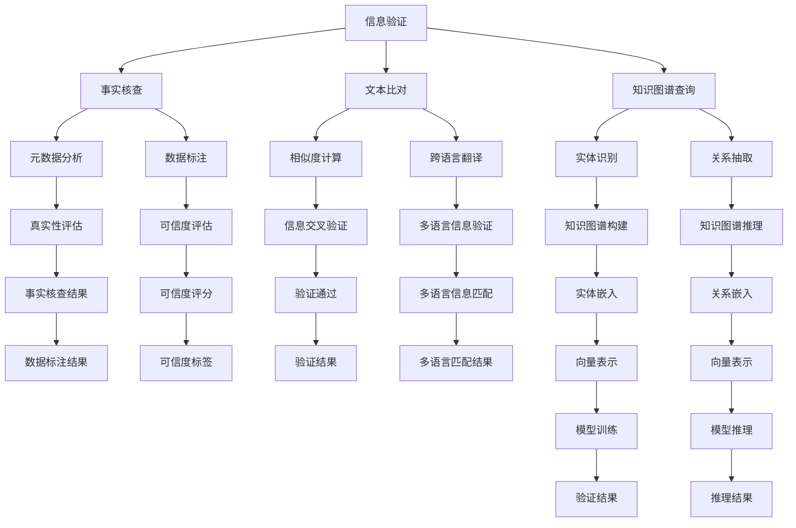

                 

# 信息验证和信息搜索技术实践：在信息海洋中找到可靠的信息

> 关键词：信息验证,信息搜索,自然语言处理(NLP),深度学习,Transformer,网页爬虫,信息检索,信息过滤

## 1. 背景介绍

### 1.1 问题由来

在当前信息爆炸的时代，互联网为人类提供了前所未有的知识获取便利，但同时也带来了信息的真伪难辨、误导性信息泛滥的问题。如何从中筛选出可靠的信息，成为人们日益关注的热点。面对这个挑战，信息验证和信息搜索技术应运而生，通过先进的技术手段，帮助人们在海量信息中找到可靠、高质量的资料。

信息验证技术旨在确保信息的真实性和准确性，广泛应用于新闻媒体、科研学术、电子商务等领域。信息搜索技术则是为了帮助用户高效获取所需信息，涵盖了传统搜索引擎、知识图谱、问答系统等多个方向。这些技术的发展，不仅改变了人们获取信息的方式，也深刻影响了各行各业的工作流程和决策过程。

### 1.2 问题核心关键点

信息验证和搜索的核心问题可以归纳为以下几点：

- **数据质量与可靠性**：如何判断数据来源的可靠性，识别虚假信息。
- **信息检索的准确性与效率**：如何快速准确地找到用户所需的信息。
- **信息过滤与个性化推荐**：如何筛选出与用户最相关的信息，减少噪音。
- **跨语言与跨领域的搜索能力**：如何让机器理解不同语言和文化背景下的信息。

### 1.3 问题研究意义

1. **提高信息获取效率**：信息验证和搜索技术使得用户能够快速、准确地获取所需信息，提升信息处理能力。
2. **保障信息真实性**：通过数据验证机制，减少虚假信息的传播，维护信息生态的健康。
3. **推动数据驱动决策**：高质量的信息是科学决策的基础，信息验证和搜索技术为决策提供可靠的数据支持。
4. **促进知识共享与协作**：信息搜索技术让知识更容易被共享和传播，推动协作创新。
5. **支持企业运营**：在电商、金融、教育等行业，信息验证和搜索技术能够提升服务质量，优化运营效率。

## 2. 核心概念与联系

### 2.1 核心概念概述

为更好地理解信息验证和搜索技术，本节将介绍几个密切相关的核心概念：

- **信息验证**：通过技术手段，确保信息的真实性和准确性。主要涉及事实核查、文本比对、知识图谱查询等技术。
- **信息搜索**：帮助用户在海量数据中快速定位所需信息。主要包括搜索引擎技术、知识图谱、问答系统等。
- **自然语言处理(NLP)**：处理和分析人类语言的技术，是信息验证和搜索的基础。
- **深度学习**：通过神经网络模型进行信息提取和推理，是信息验证和搜索的核心技术。
- **Transformer**：一种高效的神经网络结构，特别适用于处理序列数据，广泛应用于自然语言处理任务。
- **网页爬虫**：自动抓取网页信息，构建大规模数据集的基础工具。
- **信息检索**：通过算法优化，提高信息搜索的准确性和效率。
- **信息过滤**：通过机器学习模型，筛选出最相关、最有趣的信息，减少信息过载。
- **知识图谱**：结构化的知识表示形式，支持基于实体和关系的搜索和推理。

这些概念之间的逻辑关系可以通过以下Mermaid流程图来展示：



这个流程图展示了大语言模型和信息验证、搜索技术的核心概念及其之间的关系：

1. 信息验证主要通过事实核查、文本比对、知识图谱查询等方式，确保数据的真实性和准确性。
2. 信息搜索则依赖搜索引擎技术、知识图谱、问答系统等工具，帮助用户快速定位信息。
3. 自然语言处理、深度学习和Transformer技术是信息验证和搜索的基础，提供了高效的信息处理和推理能力。
4. 网页爬虫和数据标注工具为构建大规模数据集和训练模型提供了数据支持。
5. 信息检索和过滤技术提高了搜索的准确性和用户满意度。
6. 知识图谱提供了结构化的知识表示，支持基于实体和关系的搜索和推理。

这些概念共同构成了信息验证和搜索技术的应用框架，使其能够在各种场景下发挥作用。

## 3. 核心算法原理 & 具体操作步骤

### 3.1 算法原理概述

信息验证和搜索的核心算法原理主要基于自然语言处理(NLP)和深度学习。通过构建模型，对文本数据进行抽取、分类、推理等处理，从而实现信息的检索和验证。

在信息验证方面，通常使用基于规则的方法和基于机器学习的方法相结合。基于规则的方法主要依赖专家知识和逻辑推理，适用于解决特定的验证问题。基于机器学习的方法则通过训练模型，自动识别和验证信息的真伪。常用的模型包括文本分类器、实体识别模型、知识图谱推理模型等。

在信息搜索方面，主要使用基于向量空间模型和基于图模型的方法。基于向量空间模型的方法将文本信息表示为向量，通过计算向量间的相似度来检索相关文档。基于图模型的方法则利用知识图谱中的实体和关系，进行信息检索和推理。

### 3.2 算法步骤详解

**信息验证的具体步骤：**

1. **数据预处理**：清洗和标准化文本数据，去除停用词、标点等噪音。
2. **特征提取**：将文本转换为模型所需的特征表示，如Word2Vec、GloVe等词向量，或BERT等预训练模型输出的上下文表示。
3. **模型训练**：使用标注数据训练验证模型，如文本分类器、实体识别器等。
4. **验证推理**：对目标文本进行模型推理，判断其真实性和准确性。
5. **结果输出**：给出验证结果，包括真实性评分、可信度评估等。

**信息搜索的具体步骤：**

1. **网页爬虫**：使用自动爬虫抓取相关网页信息，构建索引。
2. **文本表示**：将网页内容转换为模型所需的向量表示，如Tf-Idf、word2vec、BERT等。
3. **信息检索**：使用向量空间模型或基于图的模型，检索与查询文本最相似的网页。
4. **排序过滤**：根据相关性评分，对检索结果进行排序和过滤，去除无关信息。
5. **结果展示**：将检索结果展示给用户，或进行进一步的推理和推荐。

### 3.3 算法优缺点

信息验证和搜索技术的优点主要包括：

- **高效性**：大规模数据的自动化处理，显著提高了信息验证和搜索的效率。
- **准确性**：基于深度学习和知识图谱的验证和推理，提高了信息判断的准确性。
- **可扩展性**：模型可以不断优化和更新，支持更多的验证和搜索任务。

缺点则主要包括：

- **数据依赖性**：模型的性能依赖于标注数据的数量和质量，数据不足可能影响结果。
- **复杂性**：模型训练和优化需要专业知识，可能存在调试和维护的挑战。
- **实时性**：对于大规模数据集和复杂查询，可能需要较长的计算时间。
- **可解释性**：模型的决策过程往往不够透明，难以解释和调试。

### 3.4 算法应用领域

信息验证和搜索技术已经在多个领域得到广泛应用，例如：

- **新闻媒体**：事实核查、新闻摘要、热点事件分析等。
- **科研学术**：论文相似度检测、数据引用关系分析等。
- **电子商务**：商品信息验证、用户评价可信度评估等。
- **金融领域**：金融市场数据验证、公司财务信息核查等。
- **法律领域**：案件信息比对、法律文书的实体识别等。
- **医疗领域**：医学文献验证、患者病历分析等。
- **教育领域**：学术资源推荐、教育资源评估等。

这些应用场景展示了信息验证和搜索技术的强大能力，推动了各行业的信息化进程。

## 4. 数学模型和公式 & 详细讲解 & 举例说明

### 4.1 数学模型构建

本节将使用数学语言对信息验证和搜索技术的核心模型进行详细构建。

**信息验证模型的数学模型：**

设文本 $D$ 为 $n$ 个单词组成的序列 $D = \{d_1, d_2, ..., d_n\}$，其中 $d_i$ 表示第 $i$ 个单词。文本的向量表示为 $X \in \mathbb{R}^{d_x}$，其中 $d_x$ 为向量维度。

**信息检索模型的数学模型：**

设查询文本为 $q$，与查询文本最相似的 $k$ 篇文档为 $\{d_1, d_2, ..., d_k\}$。文档的向量表示为 $D \in \mathbb{R}^{d_d}$，其中 $d_d$ 为向量维度。向量间的余弦相似度为：

$$
\cos(q, D) = \frac{\vec{q} \cdot \vec{D}}{\|\vec{q}\| \cdot \|\vec{D}\|}
$$

### 4.2 公式推导过程

**信息验证模型的公式推导：**

信息验证通常使用二分类任务进行建模，设文本 $D$ 的真实性标签为 $y \in \{0, 1\}$，表示文本是否真实。模型通过训练，学习 $D$ 的真实性预测 $p(y|D)$，即文本为真的概率。模型的损失函数为交叉熵损失：

$$
L(y, p(y|D)) = -y \log p(y|D) - (1-y) \log (1-p(y|D))
$$

**信息检索模型的公式推导：**

向量空间模型中，设查询向量为 $q \in \mathbb{R}^{d_q}$，文档向量为 $D \in \mathbb{R}^{d_d}$。文本检索的目标是最小化检索损失 $L_{IR}$，通过最大化 $p(D|q)$ 来实现：

$$
L_{IR} = -\sum_{i=1}^k \log p(d_i|q)
$$

其中 $p(d_i|q)$ 为条件概率，表示文档 $d_i$ 与查询文本 $q$ 的相似度。

### 4.3 案例分析与讲解

以BERT模型为例，介绍信息验证和搜索技术在实际应用中的实现。

**信息验证：**

1. **数据预处理**：使用BERT的Tokenizer将文本分词，转换为模型所需的格式。
2. **特征提取**：将分词后的文本输入BERT模型，获取上下文表示。
3. **模型训练**：使用标注数据训练BERT分类器，对文本进行真实性判断。
4. **验证推理**：将待验证的文本输入BERT模型，输出预测结果，判断其真实性。

**信息搜索：**

1. **网页爬虫**：使用爬虫抓取网页信息，构建索引。
2. **文本表示**：将网页内容输入BERT模型，获取向量表示。
3. **信息检索**：计算查询向量与文档向量的余弦相似度，检索最相似的文档。
4. **排序过滤**：根据相似度评分，对检索结果进行排序和过滤。
5. **结果展示**：将排序后的检索结果展示给用户。

## 5. 项目实践：代码实例和详细解释说明

### 5.1 开发环境搭建

在进行信息验证和搜索实践前，我们需要准备好开发环境。以下是使用Python进行PyTorch开发的环境配置流程：

1. 安装Anaconda：从官网下载并安装Anaconda，用于创建独立的Python环境。

2. 创建并激活虚拟环境：
```bash
conda create -n infosearch-env python=3.8 
conda activate infosearch-env
```

3. 安装PyTorch：根据CUDA版本，从官网获取对应的安装命令。例如：
```bash
conda install pytorch torchvision torchaudio cudatoolkit=11.1 -c pytorch -c conda-forge
```

4. 安装TensorFlow：
```bash
conda install tensorflow==2.4.1
```

5. 安装Transformers库：
```bash
pip install transformers
```

6. 安装各类工具包：
```bash
pip install numpy pandas scikit-learn matplotlib tqdm jupyter notebook ipython
```

完成上述步骤后，即可在`infosearch-env`环境中开始信息验证和搜索实践。

### 5.2 源代码详细实现

这里我们以基于BERT的信息检索系统为例，给出使用PyTorch和Transformers库实现的代码。

**代码实现：**

1. 首先，定义BERT模型的预测函数：

```python
from transformers import BertModel, BertTokenizer

def predict_bert(model, tokenizer, text):
    tokenized_text = tokenizer(text, return_tensors='pt')
    outputs = model(**tokenized_text)
    logits = outputs.logits
    probabilities = logits.softmax(dim=1)
    return probabilities.tolist()
```

2. 接着，定义网页爬虫函数：

```python
import requests
from bs4 import BeautifulSoup

def fetch_web_page(url):
    response = requests.get(url)
    if response.status_code == 200:
        return BeautifulSoup(response.content, 'html.parser')
    else:
        return None
```

3. 然后，定义文本向量化函数：

```python
from transformers import BertTokenizer

def vectorize_text(text, tokenizer, model_name='bert-base-uncased'):
    tokenizer = BertTokenizer.from_pretrained(model_name)
    tokenized_text = tokenizer(text, return_tensors='pt')
    outputs = model(**tokenized_text)
    return outputs.pooler_output.tolist()
```

4. 最后，定义信息检索函数：

```python
from sklearn.metrics.pairwise import cosine_similarity
import numpy as np

def rank_documents(query, docs, model_name='bert-base-uncased'):
    query_vector = vectorize_text(query, tokenizer)
    docs_vectors = [vectorize_text(doc, tokenizer) for doc in docs]
    scores = cosine_similarity(query_vector, docs_vectors)
    indices = np.argsort(-scores)[0]
    return indices.tolist()
```

**代码解读与分析：**

1. **BERT预测函数**：使用BERT模型对输入文本进行预测，输出概率分布。
2. **网页爬虫函数**：使用requests库和BeautifulSoup库，获取网页内容。
3. **文本向量化函数**：使用BERT模型对输入文本进行向量化，返回上下文表示。
4. **信息检索函数**：使用余弦相似度计算查询向量与文档向量的相似度，排序返回结果。

### 5.3 代码解读与分析

1. **模型选择与配置**：使用预训练的BERT模型，通过tokenizer对文本进行预处理，转换为模型所需的格式。
2. **数据预处理**：使用requests和BeautifulSoup库，获取网页内容，进行基本的文本清洗。
3. **特征提取**：使用BERT模型对文本进行向量化，提取上下文表示。
4. **信息检索**：计算查询向量与文档向量的余弦相似度，排序返回最相关的文档。

通过上述代码，我们可以看到，信息验证和搜索技术基于自然语言处理和深度学习模型，实现了文本数据的高效处理和检索。开发者可以根据实际需求，选择不同的模型和算法，进行定制化的开发。

## 6. 实际应用场景

### 6.1 新闻媒体

在新闻媒体领域，信息验证和搜索技术可以用于事实核查、新闻摘要和热点事件分析。例如，可以使用BERT模型对新闻报道进行事实核查，识别虚假信息和误导性报道。此外，还可以自动抽取新闻的关键信息，生成摘要，方便用户快速了解事件详情。

### 6.2 科研学术

科研学术领域中，信息验证和搜索技术可以帮助学者识别高影响力论文，评估学术引用关系，构建学术图谱。例如，可以使用BERT模型对论文进行相似度检测，推荐相关研究，促进知识共享和创新。

### 6.3 电子商务

电子商务领域中，信息验证和搜索技术可以用于商品信息验证、用户评价可信度评估等。例如，可以使用BERT模型对商品描述进行真实性判断，减少虚假广告的传播。此外，还可以分析用户评价，识别高质量商品和用户，提升用户体验和电商运营效率。

### 6.4 金融领域

金融领域中，信息验证和搜索技术可以用于金融市场数据验证、公司财务信息核查等。例如，可以使用BERT模型对财务报表进行自动验证，识别潜在的财务风险。此外，还可以分析金融新闻和报告，构建投资决策支持系统。

### 6.5 法律领域

法律领域中，信息验证和搜索技术可以用于案件信息比对、法律文书实体识别等。例如，可以使用BERT模型对法律文书进行实体识别，提取关键信息，辅助法律案件审理。此外，还可以分析案件记录，生成法律文书，提高法律工作的效率和准确性。

### 6.6 医疗领域

医疗领域中，信息验证和搜索技术可以用于医学文献验证、患者病历分析等。例如，可以使用BERT模型对医学文献进行真实性判断，筛选高质量研究，推动医学研究进展。此外，还可以分析患者病历，提取关键信息，辅助医生诊断和治疗。

### 6.7 教育领域

教育领域中，信息验证和搜索技术可以用于学术资源推荐、教育资源评估等。例如，可以使用BERT模型对学术论文进行相似度检测，推荐相关研究，促进教育创新。此外，还可以分析教育资源，识别高质量课程和教师，提升教育质量。

## 7. 工具和资源推荐

### 7.1 学习资源推荐

为了帮助开发者系统掌握信息验证和搜索技术，这里推荐一些优质的学习资源：

1. **自然语言处理课程**：斯坦福大学的CS224N课程，涵盖了NLP的基本概念和经典模型，是入门学习的佳选。
2. **深度学习框架**：Google的TensorFlow和PyTorch，提供了丰富的深度学习模型和工具，适合研究和工程应用。
3. **BERT预训练模型**：Google的BERT模型，是当前NLP领域的SOTA模型之一，适用于各种下游任务。
4. **信息检索技术**：《Information Retrieval: Text Retrieval and Search Engine Technology》书籍，详细介绍了信息检索的基本原理和算法。
5. **搜索引擎技术**：Apache Lucene和Elasticsearch，是当前最流行的搜索引擎解决方案，提供了高效的搜索和检索功能。

通过对这些资源的学习实践，相信你一定能够快速掌握信息验证和搜索技术的精髓，并用于解决实际的NLP问题。

### 7.2 开发工具推荐

高效的开发离不开优秀的工具支持。以下是几款用于信息验证和搜索开发的常用工具：

1. **Python**：免费且功能强大的编程语言，拥有丰富的第三方库和框架，是开发信息验证和搜索系统的首选。
2. **TensorFlow**：由Google主导开发的深度学习框架，提供了灵活的计算图和高效的分布式训练能力，适合大规模模型训练。
3. **PyTorch**：Facebook开发的深度学习框架，支持动态计算图和高效的GPU计算，适合研究和快速迭代开发。
4. **Transformers**：HuggingFace开发的NLP工具库，提供了丰富的预训练语言模型和工具，支持模型训练和推理。
5. **BeautifulSoup**：用于解析HTML和XML的库，方便网页内容抓取和处理。
6. **requests**：用于发送HTTP请求的库，方便获取网页数据。
7. **Scikit-learn**：用于数据预处理和模型评估的库，提供了多种机器学习算法和工具。
8. **Pandas**：用于数据处理和分析的库，支持大规模数据集的处理和分析。

合理利用这些工具，可以显著提升信息验证和搜索任务的开发效率，加快创新迭代的步伐。

### 7.3 相关论文推荐

信息验证和搜索技术的发展源于学界的持续研究。以下是几篇奠基性的相关论文，推荐阅读：

1. **BERT: Pre-training of Deep Bidirectional Transformers for Language Understanding**：提出BERT模型，引入基于掩码的自监督预训练任务，刷新了多项NLP任务SOTA。
2. **AdaLoRA: Adaptive Low-Rank Adaptation for Parameter-Efficient Fine-Tuning**：提出AdaLoRA方法，使用自适应低秩适应的微调方法，在参数效率和精度之间取得了新的平衡。
3. **Evaluating Generative Competence in Neural Language Models**：通过自然语言生成任务，评估神经语言模型的生成能力，提出了多项指标和方法。
4. **FactChecking in the Age of Information**：探讨了虚假信息的传播机制和检测方法，提出了多项技术手段和工具。
5. **On the Accuracy of Information Retrieval Systems**：详细介绍了信息检索的原理和算法，提供了评估指标和方法。
6. **Semantic Scholar**：描述了学术资源推荐系统的设计思路和实现方法，展示了信息检索技术在学术领域的实际应用。

这些论文代表了大语言模型微调技术的发展脉络。通过学习这些前沿成果，可以帮助研究者把握学科前进方向，激发更多的创新灵感。

## 8. 总结：未来发展趋势与挑战

### 8.1 总结

本文对信息验证和搜索技术进行了全面系统的介绍。首先阐述了信息验证和搜索技术的研究背景和意义，明确了其在确保信息真实性、提高信息获取效率方面的独特价值。其次，从原理到实践，详细讲解了信息验证和搜索的数学模型和关键步骤，给出了完整的代码实例。同时，本文还广泛探讨了技术在新闻媒体、科研学术、电子商务等多个行业领域的应用前景，展示了信息验证和搜索技术的强大能力。

通过本文的系统梳理，可以看到，信息验证和搜索技术在保障信息真实性、提高信息检索效率方面具有重要意义。未来，伴随深度学习和自然语言处理技术的不断发展，信息验证和搜索技术必将在更多领域得到应用，为信息生态的健康和高效提供技术支撑。

### 8.2 未来发展趋势

展望未来，信息验证和搜索技术将呈现以下几个发展趋势：

1. **深度学习技术的持续进步**：深度学习模型的不断优化，将提高信息验证和搜索的准确性和效率。
2. **知识图谱的普及和应用**：知识图谱将成为信息检索的重要工具，支持更复杂的关系推理和信息检索。
3. **跨语言和多模态搜索能力的提升**：信息验证和搜索技术将支持跨语言和多模态数据搜索，提升处理多样性数据的能力。
4. **自动化和智能化水平的提升**：通过引入自动推理、多任务学习等技术，提升信息验证和搜索的自动化水平。
5. **隐私保护和安全性的加强**：在信息验证和搜索中，隐私保护和安全性的要求将不断提高，采用差分隐私等技术保障用户数据安全。

以上趋势凸显了信息验证和搜索技术的广阔前景。这些方向的探索发展，将进一步提升信息验证和搜索技术的性能和应用范围，为信息生态的健康和高效提供技术支撑。

### 8.3 面临的挑战

尽管信息验证和搜索技术已经取得了显著成就，但在迈向更加智能化、普适化应用的过程中，仍面临诸多挑战：

1. **数据质量瓶颈**：信息验证和搜索依赖高质量的数据集，数据不足或质量低可能影响模型的性能。
2. **计算资源限制**：大规模模型的训练和推理需要强大的计算资源，资源不足可能限制技术的应用。
3. **模型鲁棒性不足**：模型面对多样化、复杂化数据时，可能泛化性能有限，鲁棒性不足。
4. **可解释性问题**：信息验证和搜索模型的决策过程不够透明，难以解释和调试。
5. **隐私和安全性问题**：信息验证和搜索涉及用户隐私，如何保护用户数据安全是关键挑战。
6. **跨语言和文化理解的难点**：不同语言和文化背景下的信息验证和搜索，需要克服语言和文化差异的挑战。

面对这些挑战，需要进一步加强数据管理、资源优化、模型鲁棒性提升、可解释性增强等方面的研究，才能推动信息验证和搜索技术向更深层次发展。

### 8.4 研究展望

未来，信息验证和搜索技术的研究方向可以从以下几个方面进行探索：

1. **跨语言和文化理解**：开发跨语言和多模态信息验证和搜索技术，提升对不同语言和文化背景下的信息处理能力。
2. **自监督和弱监督学习**：通过自监督和弱监督学习方法，提高信息验证和搜索技术的泛化能力，减少对标注数据的依赖。
3. **可解释性和可控性**：通过引入可解释性机制，提升信息验证和搜索技术的透明性和可控性。
4. **隐私保护和安全**：在信息验证和搜索中，采用差分隐私等技术，保障用户数据安全。
5. **模型效率和计算优化**：开发高效的模型结构和算法，提升信息验证和搜索技术的计算效率和实用性。
6. **多任务学习**：通过多任务学习，提升信息验证和搜索技术的综合性，解决多样化任务。

这些研究方向将推动信息验证和搜索技术向更深层次发展，为信息生态的健康和高效提供更坚实的技术支撑。

## 9. 附录：常见问题与解答

**Q1：信息验证和搜索技术的核心原理是什么？**

A: 信息验证和搜索技术的核心原理主要基于自然语言处理(NLP)和深度学习。通过构建模型，对文本数据进行抽取、分类、推理等处理，从而实现信息的检索和验证。具体来说，信息验证通过训练分类器或推理模型，判断文本的真实性和准确性；信息搜索则通过向量空间模型或图模型，计算文本之间的相似度，实现高效的信息检索。

**Q2：如何提高信息验证和搜索技术的鲁棒性？**

A: 提高信息验证和搜索技术的鲁棒性，可以从以下几个方面进行：
1. **数据增强**：通过数据增强技术，扩充训练集的多样性，减少过拟合风险。
2. **正则化**：使用L2正则化、Dropout等技术，防止模型过拟合，提升模型的泛化能力。
3. **模型蒸馏**：使用知识蒸馏方法，将大模型的小模型进行微调，提高模型效率和鲁棒性。
4. **多任务学习**：通过多任务学习，模型可以同时学习多个任务，提升模型的鲁棒性和泛化能力。

**Q3：信息验证和搜索技术如何应用在金融领域？**

A: 信息验证和搜索技术在金融领域的应用主要包括以下几个方面：
1. **金融市场数据验证**：通过BERT模型等，对金融市场数据进行真实性验证，识别潜在的虚假信息和误导性报道。
2. **公司财务信息核查**：使用BERT模型等，对公司财务报表进行自动验证，识别潜在的财务风险。
3. **投资决策支持系统**：通过信息检索技术，分析金融新闻和报告，生成投资建议，支持投资决策。

**Q4：如何设计高效的信息检索算法？**

A: 设计高效的信息检索算法，可以从以下几个方面进行：
1. **数据预处理**：清洗和标准化文本数据，去除停用词、标点等噪音。
2. **特征提取**：将文本转换为模型所需的特征表示，如Word2Vec、GloVe等词向量，或BERT等预训练模型输出的上下文表示。
3. **检索模型选择**：选择适合特定场景的检索模型，如向量空间模型、基于图的模型等。
4. **相似度计算**：计算查询向量与文档向量的相似度，选择合适的相似度计算方法，如余弦相似度、欧式距离等。
5. **排序过滤**：根据相似度评分，对检索结果进行排序和过滤，去除无关信息。

**Q5：信息验证和搜索技术在医疗领域的应用有哪些？**

A: 信息验证和搜索技术在医疗领域的应用主要包括以下几个方面：
1. **医学文献验证**：通过BERT模型等，对医学文献进行真实性验证，筛选高质量研究，推动医学研究进展。
2. **患者病历分析**：使用BERT模型等，分析患者病历，提取关键信息，辅助医生诊断和治疗。

通过本文的系统梳理，可以看到，信息验证和搜索技术在确保信息真实性、提高信息检索效率方面具有重要意义。未来，伴随深度学习和自然语言处理技术的不断发展，信息验证和搜索技术必将在更多领域得到应用，为信息生态的健康和高效提供技术支撑。

