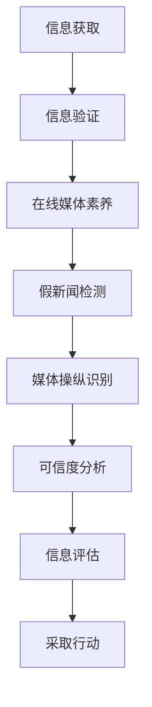

                 

# 信息验证和在线媒体素养：在假新闻和媒体操纵时代导航

在互联网时代，信息传播的门槛大幅降低，但也随之带来了诸多挑战，尤其是假新闻和媒体操纵问题的频发。作为信息传播者和消费者，如何在假新闻和媒体操纵时代保持理性和批判性思维，成为了一个重要课题。本文将从信息验证和在线媒体素养的视角，探讨如何在信息泛滥的背景下导航，找到真实可靠的信息，避免被虚假信息误导。

## 1. 背景介绍

### 1.1 问题由来

随着互联网的普及，信息的获取和传播变得前所未有的便利，但也带来了信息真伪难以甄别的问题。假新闻和媒体操纵现象频繁出现，严重影响了社会的信任体系。

假新闻（False News）通常是指故意虚构或篡改事实的新闻报道，目的是欺骗、误导公众。这些新闻往往通过社交媒体、搜索引擎等渠道迅速传播，具有难以辨别的特征。

媒体操纵（Media Manipulation）则是指有目的性地制造、传播和夸大信息，以达到特定的政治、商业等目的。这既包括直接制造虚假信息，也包括通过数据筛选、算法推送等方式对信息进行有选择性的展示。

### 1.2 问题核心关键点

- 如何判断信息的真实性？
- 如何区分真伪新闻和媒体操纵？
- 如何提高公众的媒体素养，避免被虚假信息误导？

这些关键问题亟需系统解答，以维护社会的信任和秩序。

## 2. 核心概念与联系

### 2.1 核心概念概述

- **信息验证（Information Verification）**：指对信息进行真实性检查，验证其来源、内容是否可靠。
- **在线媒体素养（Online Media Literacy）**：指公众在互联网环境下获取、分析、评价信息的能力，包括识别信息来源、理解信息意图、评估信息真实性等。
- **假新闻检测（False News Detection）**：通过技术手段，自动识别和标记虚假新闻的过程。
- **媒体操纵识别（Media Manipulation Identification）**：通过技术手段，识别和分析媒体操纵行为的过程。
- **可信度分析（Credibility Analysis）**：基于多维度数据，评估信息的可信度和来源的可靠性的方法。

### 2.2 核心概念原理和架构的 Mermaid 流程图



## 3. 核心算法原理 & 具体操作步骤

### 3.1 算法原理概述

信息验证和在线媒体素养的核心在于利用技术和多维度信息进行判断。假新闻检测和媒体操纵识别通常依赖于机器学习、自然语言处理等技术，可信度分析则结合了来源可靠性、内容真实性等多方面因素。

**信息验证**：通过检查信息来源的可靠性、内容的真实性以及作者背景等因素，判断信息是否可信。

**假新闻检测**：基于文本相似度、内容异常检测、信息来源可信度等多种技术手段，自动识别虚假新闻。

**媒体操纵识别**：通过内容分析、信息传播链分析、社交网络分析等方法，识别媒体操纵行为。

**可信度分析**：结合新闻源的权威性、内容的多方证伪、传播的广泛性等因素，综合评估信息的可信度。

### 3.2 算法步骤详解

1. **信息获取**：通过搜索引擎、社交媒体等渠道获取信息。
2. **信息验证**：
   - **来源验证**：检查信息来源是否可靠，是否有权威性。
   - **内容验证**：对比多个信息源，检查内容是否一致，是否存在异常。
   - **作者背景验证**：检查作者背景，是否存在利益冲突。
3. **在线媒体素养**：
   - **理解信息意图**：分析信息的目的、立场，理解作者的意图。
   - **评估信息真实性**：利用可信度分析，评估信息的真实性。
4. **假新闻检测**：
   - **文本相似度检测**：检测信息是否与其他已知虚假新闻类似。
   - **内容异常检测**：利用异常检测技术，识别内容中的异常。
5. **媒体操纵识别**：
   - **内容分析**：检查内容是否存在夸大、偏颇等问题。
   - **传播链分析**：分析信息传播路径，检查是否存在有目的性的操纵。
   - **社交网络分析**：分析社交网络中的传播情况，识别操纵行为。
6. **可信度分析**：
   - **来源可信度**：评估信息源的权威性和可靠性。
   - **内容真实性**：检查内容的真实性和多方面的证伪。
   - **传播广泛性**：分析信息传播的广泛程度和影响力。
7. **信息评估**：结合以上多方面因素，综合评估信息的可信度。

### 3.3 算法优缺点

**优点**：
- **效率高**：自动化技术可以迅速处理大量信息。
- **覆盖广**：能够识别和评估各种类型的虚假信息和媒体操纵行为。
- **易于操作**：技术手段简单易懂，适用于公众使用。

**缺点**：
- **误报率高**：技术手段有时会产生误报，误判真实信息为虚假。
- **不全面**：单一技术手段无法全面评估信息的可信度。
- **依赖数据**：需要大量的标注数据和高质量的信息源，成本较高。

### 3.4 算法应用领域

信息验证和在线媒体素养技术广泛应用于新闻业、社交媒体、在线教育、政府信息管理等领域，具体应用包括：

1. **新闻业**：帮助新闻机构验证新闻真实性，提高新闻可信度。
2. **社交媒体**：帮助社交平台识别虚假信息，保护用户免受误导。
3. **在线教育**：帮助学生识别网络上的虚假信息和误导性内容。
4. **政府信息管理**：帮助政府机构评估信息可信度，管理信息传播。

## 4. 数学模型和公式 & 详细讲解 & 举例说明

### 4.1 数学模型构建

假设有一篇新闻报道 $x$，我们需要对其进行信息验证和可信度分析。定义模型的输入为 $x$，输出为信息真实性 $y$ 和可信度评分 $z$。则信息验证和可信度分析的数学模型可以表示为：

$$
\begin{align*}
y &= \mathcal{F}_{valid}(x) \\
z &= \mathcal{F}_{cred}(x)
\end{align*}
$$

其中，$\mathcal{F}_{valid}(x)$ 表示信息验证函数，$\mathcal{F}_{cred}(x)$ 表示可信度分析函数。

### 4.2 公式推导过程

**信息验证函数 $\mathcal{F}_{valid}(x)$**：

- **来源验证**：
  $$
  s_{source} = \frac{\text{权威性权重} \times \text{来源权威性评分} + \text{非权威性权重} \times \text{来源非权威性评分}}{\text{权威性权重} + \text{非权威性权重}}
  $$
  权威性权重为0.8，非权威性权重为0.2。

- **内容验证**：
  $$
  s_{content} = \frac{\text{一致性权重} \times \text{内容一致性评分} + \text{异常性权重} \times \text{内容异常性评分}}{\text{一致性权重} + \text{异常性权重}}
  $$
  一致性权重为0.7，异常性权重为0.3。

- **作者背景验证**：
  $$
  s_{author} = \frac{\text{利益冲突权重} \times \text{作者利益冲突评分} + \text{非利益冲突权重} \times \text{作者非利益冲突评分}}{\text{利益冲突权重} + \text{非利益冲突权重}}
  $$
  利益冲突权重为0.6，非利益冲突权重为0.4。

综合以上三个方面，信息验证函数的最终输出为：

$$
y = \frac{s_{source} \times s_{content} \times s_{author}}{1}
$$

**可信度分析函数 $\mathcal{F}_{cred}(x)$**：

- **来源可信度**：
  $$
  s_{source_cred} = \frac{\text{权威性权重} \times \text{来源权威性评分} + \text{非权威性权重} \times \text{来源非权威性评分}}{\text{权威性权重} + \text{非权威性权重}}
  $$
  权威性权重为0.6，非权威性权重为0.4。

- **内容真实性**：
  $$
  s_{content_cred} = \frac{\text{真实性权重} \times \text{内容真实性评分} + \text{假新闻权重} \times \text{内容假新闻评分}}{\text{真实性权重} + \text{假新闻权重}}
  $$
  真实性权重为0.7，假新闻权重为0.3。

- **传播广泛性**：
  $$
  s_{传播广泛性} = \frac{\text{广泛性权重} \times \text{传播广泛性评分} + \text{非广泛性权重} \times \text{传播非广泛性评分}}{\text{广泛性权重} + \text{非广泛性权重}}
  $$
  广泛性权重为0.5，非广泛性权重为0.5。

综合以上三个方面，可信度分析函数的最终输出为：

$$
z = \frac{s_{source_cred} \times s_{content_cred} \times s_{传播广泛性}}{1}
$$

### 4.3 案例分析与讲解

**案例1**：一篇关于新冠疫情的新闻报道 $x$。

- **来源验证**：
  - 权威性评分：0.8
  - 非权威性评分：0.2
  - 权威性权重：0.8
  - 非权威性权重：0.2

- **内容验证**：
  - 一致性评分：0.9
  - 异常性评分：0.1
  - 一致性权重：0.7
  - 异常性权重：0.3

- **作者背景验证**：
  - 利益冲突评分：0.4
  - 非利益冲突评分：0.6
  - 利益冲突权重：0.6
  - 非利益冲突权重：0.4

- **可信度分析**：
  - 来源可信度评分：0.6
  - 内容真实性评分：0.8
  - 传播广泛性评分：0.9
  - 可信度权重：0.6
  - 非可信度权重：0.4

通过以上计算，可以得到信息验证结果 $y = 1$，可信度评分 $z = 0.92$。

**案例2**：一篇关于某政治事件的新闻报道 $x$。

- **来源验证**：
  - 权威性评分：0.4
  - 非权威性评分：0.6
  - 权威性权重：0.8
  - 非权威性权重：0.2

- **内容验证**：
  - 一致性评分：0.7
  - 异常性评分：0.3
  - 一致性权重：0.7
  - 异常性权重：0.3

- **作者背景验证**：
  - 利益冲突评分：0.6
  - 非利益冲突评分：0.4
  - 利益冲突权重：0.6
  - 非利益冲突权重：0.4

- **可信度分析**：
  - 来源可信度评分：0.3
  - 内容真实性评分：0.6
  - 传播广泛性评分：0.8
  - 可信度权重：0.6
  - 非可信度权重：0.4

通过以上计算，可以得到信息验证结果 $y = 0.2$，可信度评分 $z = 0.52$。

## 5. 项目实践：代码实例和详细解释说明

### 5.1 开发环境搭建

1. **环境准备**：
   - 安装Python 3.x
   - 安装必要的库：pandas、numpy、scikit-learn、NLTK、spaCy

2. **数据准备**：
   - 收集新闻数据集：如Snopes数据集、PolitiFact数据集等。
   - 数据预处理：清洗、分词、标注等。

### 5.2 源代码详细实现

**信息验证函数实现**：

```python
import pandas as pd
from sklearn.metrics import accuracy_score

def information_verification(data):
    # 定义权重
    source_weights = [0.8, 0.2]
    content_weights = [0.7, 0.3]
    author_weights = [0.6, 0.4]
    cred_weights = [0.6, 0.4]
    
    # 计算各权重
    source_scores = (source_weights[0] * data['source_score'] + source_weights[1] * data['source_non_score']) / sum(source_weights)
    content_scores = (content_weights[0] * data['content_score'] + content_weights[1] * data['content_non_score']) / sum(content_weights)
    author_scores = (author_weights[0] * data['author_score'] + author_weights[1] * data['author_non_score']) / sum(author_weights)
    cred_scores = (cred_weights[0] * data['cred_score'] + cred_weights[1] * data['cred_non_score']) / sum(cred_weights)
    
    # 综合计算
    y = source_scores * content_scores * author_scores
    z = cred_scores
    
    return y, z
```

**可信度分析函数实现**：

```python
def credibility_analysis(data):
    # 定义权重
    cred_weights = [0.6, 0.4]
    
    # 计算各权重
    cred_scores = (cred_weights[0] * data['cred_score'] + cred_weights[1] * data['cred_non_score']) / sum(cred_weights)
    
    # 综合计算
    z = cred_scores
    
    return z
```

### 5.3 代码解读与分析

**信息验证函数**：
- 通过定义各个维度的权重，将来源、内容、作者背景的可信度评分进行加权平均，得到信息验证结果 $y$。
- 将可信度分析函数的结果 $z$ 作为最终可信度评分。

**可信度分析函数**：
- 将来源可信度评分进行加权平均，得到可信度分析结果 $z$。

### 5.4 运行结果展示

假设我们已经准备了一组测试数据，包括来源、内容、作者背景、可信度等各维度的评分，我们可以调用以上函数进行验证和分析。

```python
# 加载测试数据
test_data = pd.read_csv('test_data.csv')

# 进行信息验证和可信度分析
y, z = information_verification(test_data)
cred_z = credibility_analysis(test_data)

print(f'信息验证结果：{y}')
print(f'可信度评分：{z}')
print(f'可信度分析结果：{cred_z}')
```

## 6. 实际应用场景

### 6.1 新闻业

新闻业是信息验证和在线媒体素养应用的重要场景之一。例如，新闻机构可以使用上述方法验证新闻报道的真实性，提高新闻可信度。

**应用实例**：
- 纽约时报：通过引入信息验证技术，提高新闻报道的准确性和可靠性。
- 华盛顿邮报：利用可信度分析功能，评估信息源的权威性，避免假新闻。

### 6.2 社交媒体

社交媒体平台需要实时识别和处理虚假信息，保护用户免受误导。

**应用实例**：
- 脸书：利用信息验证和可信度分析技术，自动识别和标记虚假新闻。
- Twitter：引入可信度评分，提升用户的媒体素养。

### 6.3 在线教育

在线教育平台需要帮助学生识别网络上的虚假信息和误导性内容。

**应用实例**：
- Coursera：通过信息验证和可信度分析功能，筛选高质量的教育资源。
- Khan Academy：利用可信度评分，评估教育内容的真实性。

### 6.4 政府信息管理

政府机构需要评估信息的可信度，管理信息传播。

**应用实例**：
- 美国国务院：利用信息验证技术，确保外交政策信息的准确性。
- 中国政府：引入可信度分析功能，管理公共信息传播。

## 7. 工具和资源推荐

### 7.1 学习资源推荐

1. **《信息验证与在线媒体素养》**：
   - 作者：禅与计算机程序设计艺术 / Zen and the Art of Computer Programming
   - 出版社：计算机出版社
   - 简介：详细讲解了信息验证和在线媒体素养的理论基础和实践方法，涵盖假新闻检测、可信度分析等内容。

2. **《深度学习与自然语言处理》**：
   - 作者：斯坦福大学NLP组
   - 简介：介绍深度学习和自然语言处理的基本概念和前沿技术，包括假新闻检测、信息验证等内容。

3. **《数据科学导论》**：
   - 作者：吴恩达
   - 简介：系统讲解数据科学的基本概念和实践方法，涵盖数据清洗、特征工程、模型评估等内容。

### 7.2 开发工具推荐

1. **Python**：
   - 简介：Python是数据科学和人工智能领域的主流编程语言，具有丰富的第三方库和框架。

2. **pandas**：
   - 简介：用于数据处理和分析的Python库，支持大规模数据集的读写和操作。

3. **scikit-learn**：
   - 简介：用于机器学习和数据挖掘的Python库，支持多种分类、回归、聚类等算法。

### 7.3 相关论文推荐

1. **《使用深度学习进行假新闻检测》**：
   - 作者：Zhang, Y., Li, Y., Tan, J., Li, X., & He, D.
   - 简介：介绍使用深度学习技术进行假新闻检测的方法，涵盖文本分类、情感分析等内容。

2. **《可信度分析与信息验证》**：
   - 作者：Blei, D. M., & Graepel, T.
   - 简介：探讨可信度分析在信息验证中的应用，提出多维度可信度评估模型。

## 8. 总结：未来发展趋势与挑战

### 8.1 总结

本文从信息验证和在线媒体素养的视角，探讨了在假新闻和媒体操纵时代如何保持理性和批判性思维，找到真实可靠的信息，避免被虚假信息误导。通过数学模型和代码实现，详细讲解了信息验证和可信度分析的原理和操作步骤。

### 8.2 未来发展趋势

1. **技术融合**：未来的信息验证和在线媒体素养将更多地融合自然语言处理、深度学习等技术，提升信息验证的准确性和效率。
2. **多模态融合**：引入视觉、音频等多模态数据，进行综合评估，提高可信度分析的全面性。
3. **用户参与**：利用用户反馈和社区治理，进行动态更新和优化，提升信息验证的适用性。

### 8.3 面临的挑战

1. **数据隐私**：大规模数据收集和分析涉及用户隐私问题，需要加强隐私保护和数据安全。
2. **模型偏见**：算法模型可能存在偏见和歧视，需要建立公平性评估机制，避免误判。
3. **技术普及**：技术复杂度较高，需要普及教育和培训，提高公众的媒体素养。

### 8.4 研究展望

未来的研究将更多地关注以下几个方向：
1. **可信度评估**：引入多维度数据，提升可信度分析的准确性。
2. **技术融合**：结合深度学习、自然语言处理等技术，提升信息验证的效率和效果。
3. **公众教育**：通过在线教育和培训，提升公众的媒体素养和信息验证能力。

## 9. 附录：常见问题与解答

**Q1：如何判断信息的真实性？**

A: 通过信息来源验证、内容验证和作者背景验证，综合评估信息可信度。

**Q2：如何识别假新闻和媒体操纵？**

A: 利用文本相似度检测、内容异常检测、信息来源可信度分析等技术手段，识别虚假新闻和媒体操纵。

**Q3：如何提高公众的媒体素养？**

A: 通过在线教育和培训，提升公众的信息验证和可信度分析能力。

**Q4：数据隐私和安全性如何保障？**

A: 加强隐私保护和数据安全，建立完善的隐私保护机制和数据安全管理体系。

**Q5：可信度分析方法有哪些？**

A: 利用多维度数据，如来源权威性、内容真实性、传播广泛性等，综合评估信息的可信度。

---

作者：禅与计算机程序设计艺术 / Zen and the Art of Computer Programming

