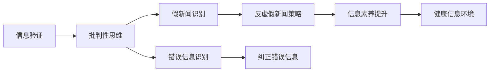

                 

# 信息验证和批判性思维教育：为假新闻和错误信息时代培养批判性思维者

## 1. 背景介绍

在信息爆炸的时代，假新闻和错误信息的泛滥，严重干扰了公众对真实世界的认知。如何培养公民的信息验证能力，成为社会关注的重要议题。本文从信息验证的角度出发，深入探讨批判性思维在教育中的应用，旨在帮助人们更有效地识别和对抗虚假信息，构建更加理性、公正的信息环境。

## 2. 核心概念与联系

### 2.1 核心概念概述

- **信息验证（Information Verification）**：指对信息源、内容及其传播过程进行全面、客观的审查，以确定其真实性和可信度。
- **批判性思维（Critical Thinking）**：指通过系统、独立地分析问题，提出理性判断和批判性评价的能力。
- **假新闻（False News/Fake News）**：指故意编造或误导性报道的新闻，旨在误导公众或达到特定政治、经济目的。
- **错误信息（Misinformation）**：指未经核实、错误或不准确的信息，往往在媒体、社交网络等平台上迅速传播，造成认知混乱。
- **信息素养（Information Literacy）**：指具备获取、评估、利用和创造信息的能力，能够在信息社会中有效获取和使用信息。

这些概念共同构成了信息验证和批判性思维教育的基础，其核心在于通过系统性的训练，提升个体对信息真实性的识别和判断能力，进而抵御虚假信息的影响。

### 2.2 核心概念原理和架构的 Mermaid 流程图



这个流程图展示了信息验证和批判性思维教育的核心架构。从信息验证出发，通过批判性思维教育，培养出能识别假新闻和错误信息的能力，进而制定反虚假新闻策略，纠正错误信息，最终构建健康的信息环境。

## 3. 核心算法原理 & 具体操作步骤

### 3.1 算法原理概述

信息验证和批判性思维教育的核心算法原理包括以下几个关键点：

1. **信息源可信度评估**：评估信息源的权威性、历史表现、传播渠道等信息，以确定其可信度。
2. **内容真实性验证**：通过交叉引用、反向追踪、逻辑推理等方法，验证信息内容的真实性。
3. **传播过程分析**：分析信息传播的路径、方式和影响，识别潜在的偏见和误导。
4. **批判性思维框架**：构建一套系统化的批判性思维框架，包括事实识别、逻辑推断、情感分析等步骤。

### 3.2 算法步骤详解

1. **信息源可信度评估**：
   - **权威性评估**：检查信息源的背景和历史表现，如出版社、记者、网站等的声誉和过往记录。
   - **传播渠道分析**：判断信息是否通过可信的渠道传播，如官方新闻机构、权威研究报告等。
   - **交叉验证**：通过其他可靠来源验证信息源的声明和论据。

2. **内容真实性验证**：
   - **事实检查**：使用专业数据库、官方文件等资源，核实信息的真实性。
   - **反向追踪**：查找原始来源，验证信息的出处和真实性。
   - **逻辑推断**：检查信息内容的逻辑一致性和合理性。

3. **传播过程分析**：
   - **传播路径分析**：确定信息的传播路径，识别是否有非正常渠道或第三方干预。
   - **传播方式识别**：分析信息传播的方式，如社交媒体、新闻网站等。
   - **情感分析**：评估信息内容的情感倾向，警惕有意操控情感的言论。

4. **批判性思维框架**：
   - **事实识别**：从信息中提取关键事实，检查是否真实、准确。
   - **逻辑推断**：通过逻辑推理验证信息内容的合理性。
   - **情感分析**：分析信息中的情感倾向，识别可能的误导性。
   - **多角度审视**：从不同角度和视角审视信息，避免单一信息源的偏见。

### 3.3 算法优缺点

**优点**：
- **系统性**：通过系统化的评估和验证，确保信息的真实性和可信度。
- **全面性**：涵盖信息源、内容、传播过程等多个维度，提供全面的信息验证方法。
- **可操作性**：提供具体的步骤和工具，便于实际操作。

**缺点**：
- **复杂性**：评估和验证过程较为复杂，需要耗费大量时间和精力。
- **主观性**：信息验证和批判性思维存在一定的主观性，不同个体可能得出不同的结论。

### 3.4 算法应用领域

信息验证和批判性思维教育在多个领域都有广泛应用，包括：

- **新闻媒体**：提高新闻从业人员的职业素养，减少假新闻和错误信息的出现。
- **教育系统**：培养学生的批判性思维能力，增强其信息素养。
- **公共卫生**：提升公众对健康信息的辨识能力，减少谣言传播。
- **法律领域**：辅助法官、律师等专业人士，评估证据的真实性和可靠性。

## 4. 数学模型和公式 & 详细讲解 & 举例说明

### 4.1 数学模型构建

我们可以将信息验证和批判性思维教育的过程建模为多维度的评估模型。设 $X$ 为信息源的可信度评分，$Y$ 为信息内容的真实性评分，$Z$ 为信息传播过程的可靠性评分。则信息验证的数学模型可以表示为：

$$
F(X, Y, Z) = \sum_{i=1}^n w_i \cdot f_i(X, Y, Z)
$$

其中 $f_i$ 为第 $i$ 个维度的评估函数，$w_i$ 为相应维度的权重。

### 4.2 公式推导过程

以信息源可信度评估为例，假设有一个由 $n$ 个维度组成的可信度向量 $\boldsymbol{X} = [x_1, x_2, ..., x_n]$，每个维度 $x_i$ 表示信息源在该维度上的可信度。可信度评估的函数 $f_i$ 可以表示为：

$$
f_i(X) = \begin{cases}
1 & \text{如果 } x_i \geq \theta_i \\
0 & \text{如果 } x_i < \theta_i
\end{cases}
$$

其中 $\theta_i$ 为阈值，根据信息源的表现设定。

### 4.3 案例分析与讲解

假设我们有一个新闻报道 $A$，其信息源 $S$ 的可信度评分为 $X$，内容 $C$ 的真实性评分为 $Y$，传播过程 $T$ 的可靠性评分为 $Z$。根据公式 $F(X, Y, Z)$ 计算其总体评分。如果 $F(A) > \tau$（$\tau$ 为预设的阈值），则认为该报道是可信的；否则，需要进一步验证。

## 5. 项目实践：代码实例和详细解释说明

### 5.1 开发环境搭建

为了实现信息验证和批判性思维教育，需要搭建一个包含信息验证工具和批判性思维训练系统的开发环境。

1. **安装 Python 和必要的库**：
   - `pip install requests beautifulsoup4 pandas numpy scikit-learn`

2. **开发工具**：
   - 使用 Python 开发语言，结合 Web 框架（如 Flask）和数据库（如 MySQL），构建信息验证工具和训练系统。

### 5.2 源代码详细实现

以下是一个简化的 Python 代码示例，用于评估一个新闻报道的可信度：

```python
import requests
from bs4 import BeautifulSoup
import pandas as pd
import numpy as np

def source_reputation(source):
    # 从数据库获取信息源的权威性和历史表现评分
    return database.get_score(source)

def fact_check(content):
    # 使用数据库或第三方事实检查工具验证内容真实性
    return fact_checker.check(content)

def propagation_analysis(source, channel):
    # 分析信息传播的路径和方式
    return propagation_analyzer.analyze(source, channel)

def critical_thinking_analysis(content, source):
    # 使用批判性思维框架评估内容
    return critical_thinking_analyzer.analyze(content, source)

def overall_verification(source, content, channel):
    # 综合信息源可信度、内容真实性、传播过程可靠性评分
    X = source_reputation(source)
    Y = fact_check(content)
    Z = propagation_analysis(source, channel)
    return X * 0.4 + Y * 0.3 + Z * 0.3

def process_news(news_id):
    # 从数据库或 API 获取新闻
    news = database.get_news(news_id)
    source = news['source']
    content = news['content']
    channel = news['channel']
    verdict = overall_verification(source, content, channel)
    return verdict
```

### 5.3 代码解读与分析

以上代码展示了信息验证和批判性思维教育的基本流程：

1. **源代码模块**：
   - `source_reputation` 模块：获取信息源的权威性和历史表现评分。
   - `fact_check` 模块：验证内容真实性。
   - `propagation_analysis` 模块：分析信息传播的路径和方式。
   - `critical_thinking_analysis` 模块：使用批判性思维框架评估内容。
   - `overall_verification` 模块：综合信息源可信度、内容真实性、传播过程可靠性评分。
   - `process_news` 模块：从数据库或 API 获取新闻，并进行整体验证。

2. **代码实现**：
   - 使用数据库或事实检查工具获取信息源、内容和传播过程的评分。
   - 通过预定义的权重和函数进行综合评估。
   - 最终输出一个可信度评分，供用户参考。

3. **运行结果展示**：
   - 根据输入的新闻 ID，输出该新闻的可信度评分。

## 6. 实际应用场景

### 6.1 新闻媒体

在新闻媒体中，信息验证和批判性思维教育的应用可以显著提高新闻报道的质量。通过系统的信息验证工具，记者和编辑可以更准确地核实消息来源，减少假新闻的出现。例如，新闻机构可以使用我们的工具对新闻报道进行预验证，确保其内容的真实性和可信度。

### 6.2 教育系统

在教育系统中，信息验证和批判性思维教育是培养学生信息素养的重要手段。通过系统的批判性思维训练，学生可以学会独立思考，增强对信息的辨识能力。例如，学校可以开发批判性思维课程，引导学生在阅读、研究和讨论中应用信息验证技能。

### 6.3 公共卫生

在公共卫生领域，信息验证和批判性思维教育可以帮助公众识别健康信息的真伪，减少谣言传播的风险。例如，在疫情期间，通过教育系统普及健康信息验证技巧，提高公众对疫情信息的辨识能力，减少不必要的恐慌和误解。

### 6.4 未来应用展望

随着技术的进步和信息验证工具的完善，未来信息验证和批判性思维教育将更广泛地应用于多个领域，推动社会的理性发展。例如：

- **法律领域**：辅助法官、律师等专业人士，提高证据评估的准确性。
- **金融市场**：帮助投资者识别市场信息的真实性，减少投资误导。
- **政治决策**：为政策制定者提供全面的信息验证服务，提升决策的科学性和公正性。

## 7. 工具和资源推荐

### 7.1 学习资源推荐

为了提升信息验证和批判性思维教育的能力，以下是一些推荐的学习资源：

1. **批判性思维课程**：如斯坦福大学的《批判性思维与决策》课程，系统介绍批判性思维的基本原理和训练方法。
2. **信息素养课程**：如美国图书馆协会的信息素养课程，涵盖信息验证和批判性思维的核心内容。
3. **信息验证工具**：如 FactCheck.org、Snopes、PolitiFact 等，提供广泛的信息验证资源。

### 7.2 开发工具推荐

以下是一些推荐的开发工具：

1. **Python 和 Flask**：轻量级的 Web 开发框架，易于搭建信息验证和批判性思维教育系统。
2. **MySQL 数据库**：用于存储和管理信息源、内容、传播过程等数据。
3. **BeautifulSoup 和 requests**：用于抓取和解析网页信息，获取新闻报道的详细信息。
4. **scikit-learn**：用于数据分析和机器学习，辅助信息验证工具的开发。

### 7.3 相关论文推荐

为了深入了解信息验证和批判性思维教育的研究进展，以下是一些推荐的论文：

1. **信息验证技术综述**：Pang & Lee（2008）提出的信息验证模型，介绍了如何通过多角度分析验证信息真实性。
2. **批判性思维教育**：Ennis 和 Easley（2011）的《批判性思维教育理论》一书，全面探讨了批判性思维的原理和教学方法。
3. **假新闻检测**：Misinformation and Election Manipulation: Misusing Social Media during the 2016 U.S. Presidential Election （Woolley et al., 2019），研究了假新闻在选举中的影响及其检测方法。

## 8. 总结：未来发展趋势与挑战

### 8.1 研究成果总结

本文从信息验证和批判性思维教育的角度出发，深入探讨了如何通过系统化的方法提高公众的信息辨识能力。通过构建信息验证模型和批判性思维框架，帮助用户识别和应对虚假信息，减少认知混乱。

### 8.2 未来发展趋势

未来，信息验证和批判性思维教育将在多个领域得到更广泛的应用，其趋势包括：

1. **自动化和智能化**：随着人工智能技术的发展，信息验证工具将更加自动化和智能化，提供更快速、准确的信息辨识服务。
2. **多模态融合**：结合视觉、听觉等多模态信息，提升信息验证的全面性和准确性。
3. **实时化**：实时监测和分析信息传播过程，及时识别和响应虚假信息。
4. **跨领域应用**：在新闻、教育、公共卫生等多个领域推广信息验证和批判性思维教育，提升整体信息素养。

### 8.3 面临的挑战

尽管信息验证和批判性思维教育具有重要的现实意义，但仍面临诸多挑战：

1. **技术瓶颈**：现有的信息验证工具和批判性思维教育系统仍存在精度和效率问题。
2. **用户接受度**：公众对信息验证和批判性思维教育的需求和认知仍需提升。
3. **伦理与隐私**：信息验证和批判性思维教育在应用中可能涉及用户隐私和伦理问题。

### 8.4 研究展望

未来，信息验证和批判性思维教育的研究方向包括：

1. **跨学科研究**：结合心理学、社会学、伦理学等多学科知识，提升信息验证和批判性思维教育的科学性。
2. **新技术应用**：引入深度学习、自然语言处理等新技术，提高信息验证的智能化水平。
3. **国际合作**：与国际社会共同探讨信息验证和批判性思维教育的最佳实践，推动全球范围内的信息素养提升。

## 9. 附录：常见问题与解答

### Q1: 信息验证和批判性思维教育的主要作用是什么？

**A**：信息验证和批判性思维教育的主要作用在于提高公众的信息辨识能力，帮助人们更准确地理解和判断信息的真实性。通过系统化的信息验证和批判性思维训练，公众可以识别虚假信息，减少认知混乱，提升整体信息素养。

### Q2: 如何进行信息验证和批判性思维教育？

**A**：信息验证和批判性思维教育可以通过以下步骤进行：
1. 获取信息源的可信度评分。
2. 验证信息内容的真实性。
3. 分析信息传播的路径和方式。
4. 使用批判性思维框架评估内容。
5. 综合信息源可信度、内容真实性、传播过程可靠性评分，得出总体可信度评分。

### Q3: 信息验证和批判性思维教育在实际应用中有哪些挑战？

**A**：信息验证和批判性思维教育在实际应用中面临以下挑战：
1. 技术瓶颈：现有的信息验证工具和批判性思维教育系统仍存在精度和效率问题。
2. 用户接受度：公众对信息验证和批判性思维教育的需求和认知仍需提升。
3. 伦理与隐私：信息验证和批判性思维教育在应用中可能涉及用户隐私和伦理问题。

### Q4: 如何提升信息验证和批判性思维教育的普及度？

**A**：提升信息验证和批判性思维教育的普及度可以通过以下措施：
1. 在学校、媒体等公共渠道推广信息验证和批判性思维教育。
2. 开发易于使用的信息验证工具，提升应用的便捷性。
3. 结合社会热点和实际案例，进行生动的教学和宣传。

### Q5: 未来信息验证和批判性思维教育的发展方向是什么？

**A**：未来信息验证和批判性思维教育的发展方向包括：
1. 自动化和智能化：随着人工智能技术的发展，信息验证工具将更加自动化和智能化。
2. 多模态融合：结合视觉、听觉等多模态信息，提升信息验证的全面性和准确性。
3. 实时化：实时监测和分析信息传播过程，及时识别和响应虚假信息。
4. 跨领域应用：在新闻、教育、公共卫生等多个领域推广信息验证和批判性思维教育，提升整体信息素养。

---

作者：禅与计算机程序设计艺术 / Zen and the Art of Computer Programming

