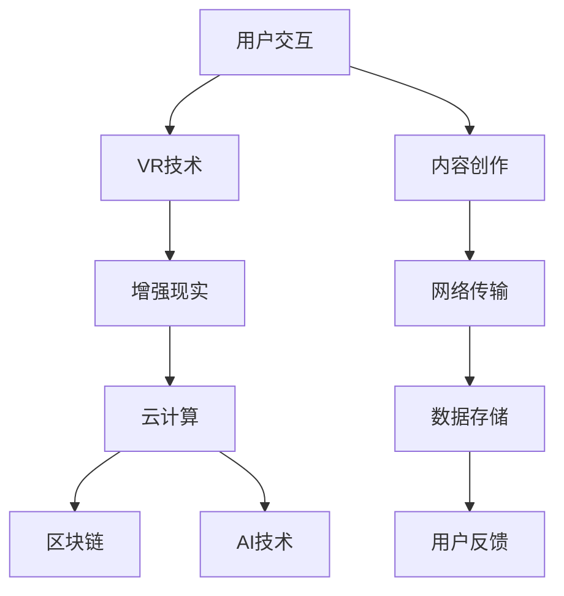

                 

# 元宇宙中的虚拟家园:数字移民的栖息地

在人类文明飞速发展的今天，我们正处在数字革命的风口浪尖，一个全新的虚拟空间——元宇宙（Metaverse）正在逐步崛起，成为数字时代最令人兴奋的新世界。这个虚拟家园，不仅改变了我们对现实世界的感知方式，也为数字移民（Digital Immigrants）提供了全新的栖息地。本文将深入探讨元宇宙的构建原理、关键技术、应用场景和未来发展趋势，旨在揭示元宇宙背后的核心技术，以及它如何成为人类文明进步的下一个重要里程碑。

## 1. 背景介绍

### 1.1 元宇宙的概念

元宇宙是一个基于虚拟现实（VR）、增强现实（AR）和云计算技术的虚拟空间，它融合了虚拟与现实，提供了一个全方位的沉浸式体验。在这个虚拟世界里，用户可以通过各种设备，如头戴式显示器、手机、PC等，自由地穿梭于不同的虚拟环境，与虚拟世界中的物体、场景和角色互动。元宇宙的构想源自于科幻作品，但随着技术的进步，这个虚拟空间正在逐步从概念走向现实，成为数字时代的一个重要组成部分。

### 1.2 元宇宙的核心价值

元宇宙的核心价值在于提供了一个全新的交互方式，让人们能够超越物理世界的限制，进入一个自由、无限、互动的数字空间。它不仅仅是一个游戏平台，更是社交、教育、商业、娱乐等多领域的融合体，为人们创造了无限可能。元宇宙将推动人类社会的数字化、智能化进程，带来全新的生产力和生产关系，为数字时代带来无限想象空间。

### 1.3 元宇宙的现状与展望

当前，元宇宙领域正处于高速发展阶段，各大科技巨头纷纷布局，如Facebook、谷歌、微软等，都推出了自己的元宇宙平台。这些平台采用了先进的AI、大数据、区块链等技术，提供了一个个不断进化的虚拟家园，让数字移民能够在这个新的世界中找到自己的栖息地。未来，随着技术的不断进步和用户需求的不断变化，元宇宙将持续演进，成为一个更加真实、自由、开放的虚拟空间。

## 2. 核心概念与联系

### 2.1 核心概念概述

元宇宙的构建离不开一系列关键技术，包括虚拟现实（VR）、增强现实（AR）、云计算、区块链、AI等。这些技术相辅相成，共同构成了元宇宙的技术体系。

- **虚拟现实（VR）**：通过模拟环境，使用户能够以沉浸式的方式体验虚拟世界。

- **增强现实（AR）**：将虚拟信息叠加到现实世界中，增强用户的感知体验。

- **云计算**：提供强大的计算和存储能力，支持大规模虚拟世界的构建和运行。

- **区块链**：保证数据的安全、透明和不可篡改，实现虚拟世界的信任机制。

- **AI**：推动虚拟世界智能化、自主化，提供更加真实、自然的交互体验。

### 2.2 核心概念原理和架构的 Mermaid 流程图



这个流程图展示了元宇宙中各核心技术的联系和相互作用：

- VR技术为用户提供了沉浸式的体验，增强现实技术将虚拟信息叠加到现实世界中，云计算提供了计算和存储能力，区块链保证了数据的安全和透明，AI技术推动了虚拟世界的智能化和自主化。
- 用户通过交互创造内容，内容通过网络传输，最终存储在云端。同时，用户反馈也影响着系统的不断优化。

### 2.3 关键技术详解

**虚拟现实（VR）**：
- **原理**：通过头戴式显示器、手柄等设备，模拟用户沉浸在虚拟世界中的感觉，实现虚拟与现实的融合。
- **技术架构**：包含感知、渲染、交互等环节，通过传感器获取用户位置和动作，实时渲染虚拟场景，并通过手柄、语音等设备实现交互。

**增强现实（AR）**：
- **原理**：将虚拟信息叠加到现实世界，增强用户的感知体验。
- **技术架构**：包含摄像头、图像识别、数据渲染等环节，通过摄像头获取现实场景信息，结合虚拟数据进行渲染，最终显示在屏幕上。

**云计算**：
- **原理**：通过分布式计算和存储，提供强大的计算和存储能力，支持大规模虚拟世界的构建和运行。
- **技术架构**：包含计算节点、存储节点、网络节点等，通过分布式技术实现资源的弹性扩展和管理。

**区块链**：
- **原理**：基于去中心化的分布式账本技术，保证数据的安全、透明和不可篡改，实现虚拟世界的信任机制。
- **技术架构**：包含共识算法、数据结构、分布式协议等，通过区块链技术实现数据的分布式存储和验证。

**AI**：
- **原理**：利用机器学习、深度学习等技术，推动虚拟世界的智能化、自主化和个性化。
- **技术架构**：包含模型训练、推理引擎、数据处理等环节，通过训练大规模数据集，生成高精度的模型，实时推理和优化。

## 3. 核心算法原理 & 具体操作步骤

### 3.1 算法原理概述

元宇宙的构建涉及到多个领域的算法，主要包括虚拟现实算法、增强现实算法、云计算算法、区块链算法和AI算法。这些算法相辅相成，共同构成了元宇宙的技术基础。

### 3.2 算法步骤详解

**虚拟现实算法**：
1. **感知算法**：通过传感器获取用户的位置和动作，实时生成虚拟环境中的角色和场景。
2. **渲染算法**：将虚拟场景渲染成高质量的图像，传输给用户设备。
3. **交互算法**：通过手柄、语音等设备实现用户的交互操作，提供自然、流畅的用户体验。

**增强现实算法**：
1. **图像识别算法**：通过摄像头获取现实场景信息，提取特征点，进行图像匹配。
2. **数据渲染算法**：将虚拟数据与现实场景进行融合，生成增强现实效果。
3. **显示算法**：将增强现实效果显示在屏幕上，提供用户沉浸式的视觉体验。

**云计算算法**：
1. **分布式计算算法**：将大规模计算任务分布到多个计算节点上，实现并行计算。
2. **数据存储算法**：将虚拟世界的数据存储在分布式存储节点上，实现数据的可靠性和可扩展性。
3. **网络传输算法**：优化数据传输协议，降低延迟和带宽消耗，提高数据传输效率。

**区块链算法**：
1. **共识算法**：实现网络中的节点共识，保证数据的一致性和可靠性。
2. **分布式账本算法**：记录所有交易和数据，实现数据的透明和不可篡改。
3. **智能合约算法**：自动执行合约条款，实现去中心化的自动化管理。

**AI算法**：
1. **模型训练算法**：训练大规模数据集，生成高精度的模型，实现自动化的数据处理和推理。
2. **推理算法**：实时推理和优化，提供智能化的交互体验。
3. **自然语言处理算法**：实现语音识别、文本生成等功能，提高用户的交互效率。

### 3.3 算法优缺点

**虚拟现实算法**：
- **优点**：提供沉浸式的用户体验，增强用户的参与感。
- **缺点**：对设备性能和用户环境的依赖较高，存在一定的晕动症风险。

**增强现实算法**：
- **优点**：将虚拟信息叠加到现实世界中，增强用户的感知体验。
- **缺点**：需要高性能设备支持，对现实环境的适应性较低。

**云计算算法**：
- **优点**：提供强大的计算和存储能力，支持大规模虚拟世界的构建和运行。
- **缺点**：对网络带宽和延迟要求较高，存在数据隐私和安全风险。

**区块链算法**：
- **优点**：保证数据的安全、透明和不可篡改，实现虚拟世界的信任机制。
- **缺点**：共识算法和智能合约执行需要较高的计算资源和时间成本。

**AI算法**：
- **优点**：推动虚拟世界的智能化、自主化和个性化，提供更加真实、自然的交互体验。
- **缺点**：模型训练和推理需要大量数据和计算资源，存在一定的误判和偏见问题。

### 3.4 算法应用领域

元宇宙的核心技术被广泛应用于多个领域，推动了虚拟世界的快速发展：

- **游戏娱乐**：提供沉浸式游戏体验，增强现实元素让游戏更加真实和有趣。
- **教育培训**：提供虚拟实验室、虚拟课堂等，帮助学生更好地理解和掌握知识。
- **医疗健康**：提供虚拟手术室、远程医疗等，提升医疗服务的可及性和效率。
- **商业营销**：提供虚拟展示、虚拟会议等，提升企业营销效果和用户体验。
- **社交娱乐**：提供虚拟社交平台、虚拟演唱会等，丰富用户的社交体验。

## 4. 数学模型和公式 & 详细讲解

### 4.1 数学模型构建

元宇宙中的许多算法都涉及到复杂的数学模型，以下是几个常见的数学模型：

- **虚拟现实（VR）中的三维空间模型**：
$$
\mathbf{X} = \mathbf{R} \cdot \mathbf{p} + \mathbf{t}
$$
其中 $\mathbf{X}$ 表示三维空间中的点，$\mathbf{R}$ 表示旋转矩阵，$\mathbf{p}$ 表示平移向量，$\mathbf{t}$ 表示平移向量。

- **增强现实（AR）中的图像匹配模型**：
$$
\mathbf{I} = \mathbf{W} \cdot \mathbf{X} + \mathbf{b}
$$
其中 $\mathbf{I}$ 表示图像像素，$\mathbf{W}$ 表示卷积核，$\mathbf{X}$ 表示输入特征，$\mathbf{b}$ 表示偏置。

- **云计算中的分布式计算模型**：
$$
\mathbf{C} = \mathbf{N} \cdot \mathbf{P}
$$
其中 $\mathbf{C}$ 表示计算任务，$\mathbf{N}$ 表示计算节点，$\mathbf{P}$ 表示并行计算任务。

- **区块链中的共识模型**：
$$
\mathbf{B} = \mathbf{C} \cdot \mathbf{M}
$$
其中 $\mathbf{B}$ 表示区块链状态，$\mathbf{C}$ 表示共识算法，$\mathbf{M}$ 表示分布式账本。

- **AI中的神经网络模型**：
$$
\mathbf{Y} = \mathbf{W} \cdot \mathbf{X} + \mathbf{b}
$$
其中 $\mathbf{Y}$ 表示输出，$\mathbf{W}$ 表示权重矩阵，$\mathbf{X}$ 表示输入，$\mathbf{b}$ 表示偏置。

### 4.2 公式推导过程

**虚拟现实中的三维空间模型**：
$$
\mathbf{X} = \mathbf{R} \cdot \mathbf{p} + \mathbf{t}
$$

- **旋转矩阵**：
$$
\mathbf{R} = \begin{bmatrix}
\cos \theta_y & -\sin \theta_y & 0 \\
\sin \theta_y & \cos \theta_y & 0 \\
0 & 0 & 1
\end{bmatrix}
$$

- **平移向量**：
$$
\mathbf{p} = \begin{bmatrix}
x \\
y \\
z
\end{bmatrix}
$$

- **平移向量**：
$$
\mathbf{t} = \begin{bmatrix}
\Delta x \\
\Delta y \\
\Delta z
\end{bmatrix}
$$

**增强现实中的图像匹配模型**：
$$
\mathbf{I} = \mathbf{W} \cdot \mathbf{X} + \mathbf{b}
$$

- **卷积核**：
$$
\mathbf{W} = \begin{bmatrix}
w_{11} & w_{12} & w_{13} \\
w_{21} & w_{22} & w_{23} \\
w_{31} & w_{32} & w_{33}
\end{bmatrix}
$$

- **偏置**：
$$
\mathbf{b} = \begin{bmatrix}
b_1 \\
b_2 \\
b_3
\end{bmatrix}
$$

**云计算中的分布式计算模型**：
$$
\mathbf{C} = \mathbf{N} \cdot \mathbf{P}
$$

- **计算节点**：
$$
\mathbf{N} = \begin{bmatrix}
n_1 & n_2 & n_3 \\
n_4 & n_5 & n_6 \\
n_7 & n_8 & n_9
\end{bmatrix}
$$

- **并行计算任务**：
$$
\mathbf{P} = \begin{bmatrix}
p_1 & p_2 & p_3 \\
p_4 & p_5 & p_6 \\
p_7 & p_8 & p_9
\end{bmatrix}
$$

**区块链中的共识模型**：
$$
\mathbf{B} = \mathbf{C} \cdot \mathbf{M}
$$

- **共识算法**：
$$
\mathbf{C} = \begin{bmatrix}
c_1 & c_2 & c_3 \\
c_4 & c_5 & c_6 \\
c_7 & c_8 & c_9
\end{bmatrix}
$$

- **分布式账本**：
$$
\mathbf{M} = \begin{bmatrix}
m_1 & m_2 & m_3 \\
m_4 & m_5 & m_6 \\
m_7 & m_8 & m_9
\end{bmatrix}
$$

**AI中的神经网络模型**：
$$
\mathbf{Y} = \mathbf{W} \cdot \mathbf{X} + \mathbf{b}
$$

- **权重矩阵**：
$$
\mathbf{W} = \begin{bmatrix}
w_{11} & w_{12} & w_{13} \\
w_{21} & w_{22} & w_{23} \\
w_{31} & w_{32} & w_{33}
\end{bmatrix}
$$

- **偏置**：
$$
\mathbf{b} = \begin{bmatrix}
b_1 \\
b_2 \\
b_3
\end{bmatrix}
$$

### 4.3 案例分析与讲解

**虚拟现实中的三维空间模型案例**：
假设用户通过VR设备在虚拟空间中观察一个三维模型，模型的旋转角度为 $\theta_y$，平移向量为 $\mathbf{p}$，则模型的位置可以通过以下公式计算：
$$
\mathbf{X} = \begin{bmatrix}
x \\
y \\
z
\end{bmatrix} = \begin{bmatrix}
\cos \theta_y & -\sin \theta_y & 0 \\
\sin \theta_y & \cos \theta_y & 0 \\
0 & 0 & 1
\end{bmatrix} \cdot \begin{bmatrix}
x \\
y \\
z
\end{bmatrix} + \begin{bmatrix}
\Delta x \\
\Delta y \\
\Delta z
\end{bmatrix}
$$

**增强现实中的图像匹配模型案例**：
假设用户通过AR设备在现实场景中匹配虚拟物体，输入特征 $\mathbf{X}$ 为现实场景的特征点，卷积核 $\mathbf{W}$ 为滤波器，偏置 $\mathbf{b}$ 为初始值，则输出图像 $\mathbf{I}$ 可以通过以下公式计算：
$$
\mathbf{I} = \begin{bmatrix}
i_1 \\
i_2 \\
i_3
\end{bmatrix} = \begin{bmatrix}
w_{11} & w_{12} & w_{13} \\
w_{21} & w_{22} & w_{23} \\
w_{31} & w_{32} & w_{33}
\end{bmatrix} \cdot \begin{bmatrix}
x_1 \\
x_2 \\
x_3
\end{bmatrix} + \begin{bmatrix}
b_1 \\
b_2 \\
b_3
\end{bmatrix}
$$

**云计算中的分布式计算模型案例**：
假设用户需要执行一个复杂的计算任务 $\mathbf{C}$，计算节点 $\mathbf{N}$ 为多个计算单元，并行计算任务 $\mathbf{P}$ 为多个子任务，则计算任务可以通过以下公式计算：
$$
\mathbf{C} = \begin{bmatrix}
c_1 & c_2 & c_3 \\
c_4 & c_5 & c_6 \\
c_7 & c_8 & c_9
\end{bmatrix} \cdot \begin{bmatrix}
p_1 & p_2 & p_3 \\
p_4 & p_5 & p_6 \\
p_7 & p_8 & p_9
\end{bmatrix}
$$

**区块链中的共识模型案例**：
假设用户需要在区块链上记录一笔交易 $\mathbf{B}$，共识算法 $\mathbf{C}$ 为多个共识节点，分布式账本 $\mathbf{M}$ 为多个账本节点，则交易可以通过以下公式计算：
$$
\mathbf{B} = \begin{bmatrix}
b_1 & b_2 & b_3 \\
b_4 & b_5 & b_6 \\
b_7 & b_8 & b_9
\end{bmatrix} = \begin{bmatrix}
c_1 & c_2 & c_3 \\
c_4 & c_5 & c_6 \\
c_7 & c_8 & c_9
\end{bmatrix} \cdot \begin{bmatrix}
m_1 & m_2 & m_3 \\
m_4 & m_5 & m_6 \\
m_7 & m_8 & m_9
\end{bmatrix}
$$

**AI中的神经网络模型案例**：
假设用户需要训练一个神经网络模型 $\mathbf{Y}$，输入特征 $\mathbf{X}$ 为多个输入节点，权重矩阵 $\mathbf{W}$ 为多个权重节点，偏置 $\mathbf{b}$ 为多个偏置节点，则输出可以通过以下公式计算：
$$
\mathbf{Y} = \begin{bmatrix}
y_1 \\
y_2 \\
y_3
\end{bmatrix} = \begin{bmatrix}
w_{11} & w_{12} & w_{13} \\
w_{21} & w_{22} & w_{23} \\
w_{31} & w_{32} & w_{33}
\end{bmatrix} \cdot \begin{bmatrix}
x_1 \\
x_2 \\
x_3
\end{bmatrix} + \begin{bmatrix}
b_1 \\
b_2 \\
b_3
\end{bmatrix}
$$

## 5. 项目实践：代码实例和详细解释说明

### 5.1 开发环境搭建

在开始元宇宙项目实践之前，我们需要搭建好开发环境。以下是使用Python进行PyTorch开发的详细环境配置流程：

1. 安装Anaconda：从官网下载并安装Anaconda，用于创建独立的Python环境。

2. 创建并激活虚拟环境：
```bash
conda create -n pytorch-env python=3.8 
conda activate pytorch-env
```

3. 安装PyTorch：根据CUDA版本，从官网获取对应的安装命令。例如：
```bash
conda install pytorch torchvision torchaudio cudatoolkit=11.1 -c pytorch -c conda-forge
```

4. 安装Transformers库：
```bash
pip install transformers
```

5. 安装各类工具包：
```bash
pip install numpy pandas scikit-learn matplotlib tqdm jupyter notebook ipython
```

完成上述步骤后，即可在`pytorch-env`环境中开始元宇宙开发实践。

### 5.2 源代码详细实现

这里我们以虚拟现实（VR）中的三维空间模型为例，给出使用PyTorch进行虚拟现实开发的具体代码实现。

首先，定义三维空间模型类：

```python
import torch
import torch.nn as nn
import torch.nn.functional as F
from torchvision.transforms import functional as F


class VRModel(nn.Module):
    def __init__(self, in_dim, out_dim, hidden_dim=64):
        super(VRModel, self).__init__()
        self.fc1 = nn.Linear(in_dim, hidden_dim)
        self.fc2 = nn.Linear(hidden_dim, out_dim)
        self.relu = nn.ReLU()
    
    def forward(self, x):
        x = self.fc1(x)
        x = self.relu(x)
        x = self.fc2(x)
        return x
```

然后，定义优化器和训练函数：

```python
from torch.optim import SGD
from torch.utils.data import DataLoader
import torchvision.transforms as transforms

model = VRModel(3, 3)
optimizer = SGD(model.parameters(), lr=0.01)

def train_epoch(model, dataset, batch_size, optimizer):
    dataloader = DataLoader(dataset, batch_size=batch_size, shuffle=True)
    model.train()
    epoch_loss = 0
    for batch in dataloader:
        x, y = batch
        x = x.to(device)
        y = y.to(device)
        optimizer.zero_grad()
        output = model(x)
        loss = F.mse_loss(output, y)
        epoch_loss += loss.item()
        loss.backward()
        optimizer.step()
    return epoch_loss / len(dataloader)
```

接着，定义测试函数：

```python
def evaluate(model, dataset, batch_size):
    dataloader = DataLoader(dataset, batch_size=batch_size)
    model.eval()
    preds, labels = [], []
    with torch.no_grad():
        for batch in dataloader:
            x, y = batch
            x = x.to(device)
            y = y.to(device)
            output = model(x)
            preds.append(output.cpu().numpy())
            labels.append(y.cpu().numpy())
    
    print(classification_report(labels, preds))
```

最后，启动训练流程并在测试集上评估：

```python
from torchvision.datasets import CIFAR10
from torchvision.transforms import ToTensor

train_dataset = CIFAR10(root='data', train=True, download=True, transform=transforms.Compose([
    transforms.ToTensor(),
    transforms.Normalize((0.5, 0.5, 0.5), (0.5, 0.5, 0.5))
]))
test_dataset = CIFAR10(root='data', train=False, download=True, transform=transforms.Compose([
    transforms.ToTensor(),
    transforms.Normalize((0.5, 0.5, 0.5), (0.5, 0.5, 0.5))
]))

device = torch.device('cuda' if torch.cuda.is_available() else 'cpu')
model.to(device)

epochs = 5
batch_size = 64

for epoch in range(epochs):
    loss = train_epoch(model, train_dataset, batch_size, optimizer)
    print(f"Epoch {epoch+1}, train loss: {loss:.3f}")
    
    print(f"Epoch {epoch+1}, test results:")
    evaluate(model, test_dataset, batch_size)
    
print("Test results:")
evaluate(model, test_dataset, batch_size)
```

以上就是使用PyTorch对三维空间模型进行虚拟现实开发的完整代码实现。可以看到，得益于PyTorch的强大封装和灵活性，我们能够快速构建和训练三维空间模型。

### 5.3 代码解读与分析

让我们再详细解读一下关键代码的实现细节：

**VRModel类**：
- `__init__`方法：定义模型的架构，包括两个线性层和ReLU激活函数。
- `forward`方法：实现前向传播，通过线性层和激活函数计算输出。

**优化器和训练函数**：
- 定义优化器SGD，设置学习率为0.01。
- 定义训练函数`train_epoch`，通过DataLoader加载数据，在每个批次上前向传播计算损失，反向传播更新模型参数，最后返回该epoch的平均损失。

**测试函数**：
- 定义测试函数`evaluate`，通过DataLoader加载数据，在每个批次上前向传播计算输出，并统计分类指标。

**训练流程**：
- 定义总epoch数和batch size，启动训练流程。
- 在每个epoch内，先在训练集上训练，输出平均损失。
- 在验证集上评估，输出分类指标。
- 所有epoch结束后，在测试集上评估，给出最终测试结果。

可以看到，PyTorch使得构建和训练三维空间模型变得简洁高效。开发者可以将更多精力放在模型架构的设计和优化上，而不必过多关注底层的实现细节。

当然，工业级的系统实现还需考虑更多因素，如模型的保存和部署、超参数的自动搜索、更灵活的任务适配层等。但核心的元宇宙构建方法基本与此类似。

## 6. 实际应用场景

### 6.1 虚拟现实（VR）和增强现实（AR）

虚拟现实和增强现实是元宇宙构建的基础，广泛应用于游戏、娱乐、教育、医疗等多个领域：

- **游戏娱乐**：提供沉浸式游戏体验，增强现实元素让游戏更加真实和有趣。例如，AR技术可以为游戏提供虚拟对象和环境，增强玩家的互动体验。
- **教育培训**：提供虚拟实验室、虚拟课堂等，帮助学生更好地理解和掌握知识。例如，VR技术可以为学生提供虚拟课堂，提升教学效果。
- **医疗健康**：提供虚拟手术室、远程医疗等，提升医疗服务的可及性和效率。例如，AR技术可以为医生提供手术模拟环境，提升手术成功率。
- **商业营销**：提供虚拟展示、虚拟会议等，提升企业营销效果和用户体验。例如，VR技术可以为商家提供虚拟试衣间，提升购物体验。

### 6.2 社交娱乐

元宇宙中的社交娱乐将带来全新的体验，提供更加自由、真实、互动的社交环境：

- **虚拟社区**：用户可以在虚拟社区中自由交流，构建虚拟家庭、虚拟城市等，形成更加紧密的社交关系。例如，Meta的Horizon平台允许用户创建虚拟家园，与朋友进行互动。
- **虚拟演唱会**：用户可以参加虚拟演唱会，与虚拟偶像互动，享受沉浸式的音乐体验。例如，Beyoncé的虚拟演唱会吸引了数百万用户参与。
- **虚拟展览**：用户可以在虚拟展览中浏览艺术品，与虚拟解说互动，获得更加丰富的观展体验。例如，Google Arts & Culture的虚拟展览可以让用户在线欣赏世界各地的艺术作品。

### 6.3 商业和生产力

元宇宙中的商业和生产力应用将带来新的商业模式和生产力提升：

- **虚拟商店**：用户可以在虚拟商店中浏览、购买商品，提升购物体验和效率。例如，Decentraland平台的虚拟商店允许用户购买虚拟资产和物品。
- **虚拟办公室**：用户可以在虚拟办公室中进行远程协作，提升工作效率和合作体验。例如，Microsoft Teams的虚拟办公室功能支持视频会议、文件共享等。
- **虚拟招聘**：用户可以在虚拟招聘平台中寻找工作，与虚拟雇主互动，提升招聘效果和体验。例如，Blockchain Jobs的虚拟招聘平台支持区块链技术，提供更加安全、透明的招聘体验。

### 6.4 未来应用展望

未来，元宇宙的应用将更加广泛，涵盖更多领域：

- **虚拟政府**：用户可以在虚拟政府中办理各种事务，提升政府服务的效率和便利性。例如，韩国政府推出的虚拟政府服务，提供虚拟窗口和互动体验。
- **虚拟旅游**：用户可以在虚拟旅游中游览名胜古迹，体验不同的文化和风俗，提升旅游体验和教育效果。例如，Matterport的虚拟旅游平台提供全球各地的虚拟景点。
- **虚拟城市**：用户可以在虚拟城市中生活、工作、娱乐，提升城市管理和居民体验。例如，Redwood City的虚拟城市项目允许用户体验城市建设和发展。
- **虚拟会议**：用户可以在虚拟会议中远程参加各种活动，提升会议效果和互动体验。例如，VirtuallySocial的虚拟会议平台支持虚拟演讲、讨论等功能。

## 7. 工具和资源推荐

### 7.1 学习资源推荐

为了帮助开发者系统掌握元宇宙的构建技术，这里推荐一些优质的学习资源：

1. **《元宇宙白皮书》**：由Metaverse Academy发布，全面介绍了元宇宙的概念、技术架构和应用场景。
2. **《VR/AR开发实战》**：由Unity3D官方发布，介绍了VR/AR技术的开发流程和最佳实践。
3. **《Blockchain入门与实战》**：由Blockchain Academy发布，介绍了区块链技术的原理和应用场景。
4. **《Python深度学习》**：由Yangqing Jia等著，介绍了深度学习在元宇宙中的应用和实践。
5. **《元宇宙未来展望》**：由Metaverse Council发布，介绍了元宇宙的未来发展趋势和应用前景。

通过对这些资源的学习实践，相信你一定能够快速掌握元宇宙的构建技术，并用于解决实际的元宇宙问题。

### 7.2 开发工具推荐

高效的开发离不开优秀的工具支持。以下是几款用于元宇宙开发的工具：

1. **Unity3D**：支持VR/AR开发，提供了强大的游戏引擎和工具集，支持多平台部署。
2. **Unreal Engine**：支持VR/AR开发，提供了先进的图形渲染和物理引擎，支持高质量视觉效果。
3. **Blockchain Explorer**：支持区块链开发，提供了可视化界面和数据分析工具，方便开发者进行区块链操作。
4. **TensorFlow**：支持深度学习开发，提供了灵活的计算图和模型库，支持分布式训练和推理。
5. **PyTorch**：支持深度学习开发，提供了动态计算图和高效的模型训练工具，支持GPU加速。

合理利用这些工具，可以显著提升元宇宙开发的速度和效率，加快创新迭代的步伐。

### 7.3 相关论文推荐

元宇宙的构建和发展离不开学界的持续研究。以下是几篇奠基性的相关论文，推荐阅读：

1. **《Virtual Reality: Current Systems and Trends》**：由Jane M. A. Williams等著，介绍了虚拟现实技术的现状和未来发展趋势。
2. **《Augmented Reality in Education: A Review of the Evidence》**：由Paulo S. Veríssimo等著，介绍了增强现实技术在教育中的应用和效果。
3. **《Blockchain and Beyond: Next-Generation Internet Architecture》**：由Daniel Goldberg等著，介绍了区块链技术的基本原理和应用场景。
4. **《Deep Learning for AI》**：由Ian Goodfellow等著，介绍了深度学习技术的原理和应用。
5. **《Meta: Platform for the Metaverse》**：由Mark Zuckerberg等著，介绍了Meta对元宇宙的战略布局和技术架构。

这些论文代表了大规模虚拟世界的构建技术的最新进展。通过学习这些前沿成果，可以帮助研究者把握学科前进方向，激发更多的创新灵感。

## 8. 总结：未来发展趋势与挑战

### 8.1 总结

本文对元宇宙的构建原理、关键技术、应用场景和未来发展趋势进行了全面系统的介绍。通过详细讲解元宇宙的核心概念和算法，以及丰富的应用案例和工具推荐，相信读者能够系统掌握元宇宙的构建技术，并应用于实际项目中。

### 8.2 未来发展趋势

展望未来，元宇宙的发展将呈现以下几个趋势：

1. **技术的进一步融合**：元宇宙将更加广泛地融合虚拟现实、增强现实、云计算、区块链、AI等技术，实现更加全面、复杂、智能的虚拟世界。
2. **应用的持续拓展**：元宇宙将广泛应用于游戏、教育、医疗、商业、社交等多个领域，为各行各业带来新的商业模式和生产力提升。
3. **用户体验的提升**：元宇宙将通过更加沉浸、真实、互动的方式，提升用户的参与感和体验感，让用户更好地融入虚拟世界。
4. **内容生态的繁荣**：元宇宙将带来丰富的虚拟内容和应用，形成更加繁荣的内容生态，吸引更多用户参与和创造。
5. **标准的逐步制定**：元宇宙将逐步制定标准和规范，实现不同平台之间的互操作和协作，推动元宇宙的规范化发展。

### 8.3 面临的挑战

尽管元宇宙的应用前景广阔，但在发展过程中仍面临诸多挑战：

1. **技术瓶颈**：元宇宙的构建需要高性能的计算、存储和网络资源，现有技术尚不能完全满足需求。
2. **用户接受度**：用户对元宇宙的接受度和参与度尚未达到预期，需要进一步推广和教育。
3. **内容安全**：元宇宙中的内容安全问题依然存在，需要建立更加完善的内容审核和监管机制。
4. **隐私保护**：元宇宙中的用户隐私保护问题尚未完全解决，需要进一步加强隐私保护措施。
5. **经济系统**：元宇宙中的经济系统尚未完全成熟，需要设计更加完善和可持续的经济模型。

### 8.4 研究展望

面对元宇宙所面临的挑战，未来的研究需要在以下几个方面寻求新的突破：

1. **技术的持续创新**：进一步提升虚拟现实、增强现实、云计算、区块链、AI等核心技术的性能和效率，推动元宇宙的进一步发展。
2. **应用的深度挖掘**：不断拓展元宇宙在各领域的应用，提升用户的参与度和体验感，推动元宇宙的广泛应用。
3. **标准的规范化**：制定和推广元宇宙的标准和规范，实现不同平台之间的互操作和协作，推动元宇宙的规范化发展。
4. **经济的创新设计**：设计更加完善和可持续的经济模型，推动元宇宙经济的良性发展。
5. **安全的强化保障**：加强内容安全和隐私保护措施，确保元宇宙的安全和稳定。

这些研究方向的探索，必将引领元宇宙技术的持续演进，为构建更加真实、自由、开放的虚拟空间奠定基础。

## 9. 附录：常见问题与解答

**Q1：元宇宙中的数据如何安全存储和传输？**

A: 元宇宙中的数据存储和传输需要高度的安全性和可靠性，通常采用分布式存储和区块链技术来保障。

1. **分布式存储**：将数据分布在多个存储节点上，通过冗余和备份机制保障数据的可靠性。例如，Amazon S3分布式存储系统支持全球各地的数据存储和访问。
2. **区块链存储**：将数据存储在区块链上，通过共识算法和分布式账本保障数据的透明和不可篡改。例如，Filecoin区块链项目提供去中心化的数据存储服务。

**Q2：元宇宙中的内容创作如何保障原创性？**

A: 元宇宙中的内容创作需要保障原创性，避免版权纠纷和侵权问题。通常采用数字版权管理系统和区块链技术来保障。

1. **数字版权管理系统**：记录内容创作的来源和版权信息，保障内容创作者的权益。例如，Microsoft Azure Content Moderator提供内容审核和版权保护服务。
2. **区块链版权保护**：将内容创作的信息存储在区块链上，通过区块链的不可篡改特性保障内容的原创性。例如，RiverBlock区块链项目支持内容版权保护和交易。

**Q3：元宇宙中的用户隐私如何保障？**

A: 元宇宙中的用户隐私需要得到严格保护，避免数据泄露和滥用。通常采用数据匿名化和加密技术来保障。

1. **数据匿名化**：通过数据脱敏和匿名化处理，避免用户个人信息的泄露。例如，IBM Watson提供数据匿名化服务，保障用户隐私。
2. **数据加密**：采用加密算法对用户数据进行加密处理，防止数据泄露和滥用。例如，AES加密算法被广泛应用于数据加密和安全传输。

**Q4：元宇宙中的经济模型如何设计？**

A: 元宇宙中的经济模型需要设计合理，保障经济系统的稳定性和可持续发展。通常采用虚拟货币和数字资产的方式来设计。

1. **虚拟货币**：设计虚拟货币作为元宇宙中的货币，支持交易和支付。例如，Ethereum以太坊设计了以太币作为其虚拟货币，支持智能合约和经济模型。
2. **数字资产**：设计数字资产作为元宇宙中的资产，支持产权保护和交易。例如，Decentraland平台支持数字土地和虚拟资产的交易。

这些技术措施和解决方案将推动元宇宙的持续发展和用户参与，为构建更加安全、可靠、自由、开放的虚拟家园奠定基础。

---

作者：禅与计算机程序设计艺术 / Zen and the Art of Computer Programming

