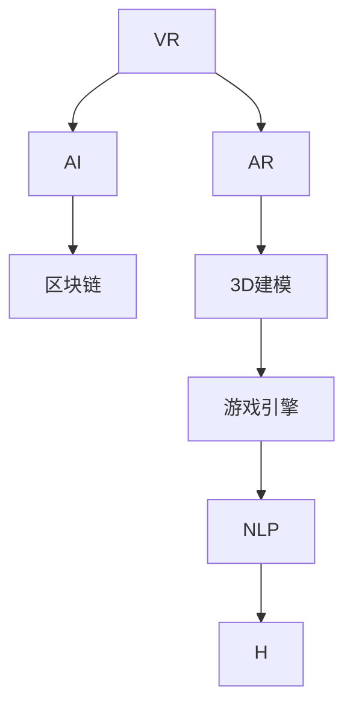

                 

# 元宇宙主题公园:虚拟与现实交织的娱乐体验

> 关键词：元宇宙、虚拟现实(VR)、增强现实(AR)、互动体验、NFT、区块链、数字资产、主题公园、3D建模、游戏引擎、人工智能

## 1. 背景介绍

### 1.1 问题由来
近年来，随着虚拟现实(VR)和增强现实(AR)技术的迅猛发展，以及区块链和数字资产概念的崛起，元宇宙(Utopia)成为全球科技巨头和投资机构关注的焦点。而元宇宙主题公园的构想，正是在这一背景下应运而生。元宇宙主题公园将虚拟现实、增强现实、人工智能等技术深度融合，旨在创造一个集娱乐、教育、社交、商业于一体的虚拟世界，为玩家提供沉浸式的娱乐体验。

元宇宙主题公园的核心在于“虚拟与现实交织”，即通过虚拟技术模拟真实世界的场景和体验，同时通过人工智能实现高度个性化的用户交互。玩家可以在虚拟世界中进行探险、互动、购物等活动，与真实世界无缝连接。这种沉浸式体验，将为未来的娱乐、教育、商业等领域带来深刻变革。

### 1.2 问题核心关键点
元宇宙主题公园的构建涉及多个核心技术领域，包括虚拟现实技术、增强现实技术、人工智能技术、区块链技术、3D建模和游戏引擎等。其关键技术点主要包括：

1. **虚拟现实(VR)和增强现实(AR)技术**：通过VR头盔和AR眼镜等设备，将虚拟场景呈现在玩家面前，创造出沉浸式的体验。

2. **人工智能(AI)技术**：利用AI进行个性化推荐、角色控制、自然语言交互等，提升用户体验。

3. **区块链技术**：通过区块链技术保障数字资产的安全性和透明性，确保玩家交易的安全和信任。

4. **3D建模和游戏引擎**：使用先进的3D建模工具和游戏引擎，构建逼真的虚拟环境，提升游戏体验。

5. **自然语言处理(NLP)**：通过NLP技术，实现与玩家之间的自然语言交流，提升互动体验。

这些技术交织融合，共同构成了元宇宙主题公园的技术框架。

### 1.3 问题研究意义
元宇宙主题公园的构建不仅是一场技术上的挑战，更是一场观念上的革新。它打破了传统娱乐形式的边界，开创了虚拟与现实交织的新时代。对于科技产业、文化娱乐、教育培训等行业而言，元宇宙主题公园提供了全新的业务模式和发展机遇。

1. **科技产业**：元宇宙主题公园的构建，将推动虚拟现实、增强现实、人工智能等技术的商业化应用，推动相关产业的快速发展。

2. **文化娱乐**：元宇宙主题公园将为电影、游戏、音乐、艺术等行业带来全新的表达和传播方式，提供更加丰富的内容形式。

3. **教育培训**：元宇宙主题公园可以提供沉浸式学习环境，提升学习效果和体验感，为教育培训行业带来革新。

4. **商业应用**：元宇宙主题公园可以构建虚拟商业生态，为零售、旅游、房地产等行业带来新的增长点。

总之，元宇宙主题公园的构建，不仅能够开创新的商业模式，还能推动科技和文化娱乐的深度融合，引领未来的产业发展方向。

## 2. 核心概念与联系

### 2.1 核心概念概述

为更好地理解元宇宙主题公园的核心技术，本节将介绍几个关键概念：

- **虚拟现实(VR)**：通过计算机生成三维图像，通过头盔等设备模拟真实世界的场景，提供沉浸式体验。

- **增强现实(AR)**：将虚拟信息叠加在现实世界中，通过智能手机、AR眼镜等设备增强现实环境。

- **人工智能(AI)**：利用机器学习、深度学习等技术，实现自动控制、个性化推荐、自然语言交互等。

- **区块链(Blockchain)**：一种分布式数据库技术，通过去中心化的方式记录和验证交易信息，保障数据安全和透明。

- **3D建模(3D Modeling)**：通过计算机生成三维模型，用于构建虚拟环境和角色。

- **游戏引擎(Game Engine)**：用于构建虚拟世界的软件工具，提供物理引擎、渲染引擎、网络引擎等功能。

- **自然语言处理(NLP)**：通过计算机理解和处理自然语言，实现与玩家的自然交互。

这些核心概念之间的逻辑关系可以通过以下Mermaid流程图来展示：



这个流程图展示了这个技术体系中各个概念之间的联系：

1. VR生成三维图像，提供沉浸式体验。
2. AR将虚拟信息叠加在现实世界。
3. AI实现自动控制和个性化推荐。
4. 区块链保障数据安全和透明。
5. 3D建模构建虚拟环境和角色。
6. 游戏引擎提供功能支持。
7. NLP实现自然交互。

这些技术共同构成了元宇宙主题公园的技术基础。

## 3. 核心算法原理 & 具体操作步骤
### 3.1 算法原理概述

元宇宙主题公园的核心算法原理涉及多个方面，包括虚拟现实、增强现实、人工智能、区块链等技术的融合应用。其核心思想是通过虚拟现实和增强现实技术，将玩家带入一个逼真的虚拟世界；通过人工智能技术，实现个性化的互动体验；通过区块链技术，保障数字资产的安全性和透明性。

以下是各个核心技术的简要介绍：

1. **虚拟现实(VR)**：通过计算机生成的三维图像，通过头盔设备呈现，创造出沉浸式的虚拟环境。

2. **增强现实(AR)**：将虚拟信息叠加在现实世界，通过智能手机或AR眼镜等设备增强玩家的现实体验。

3. **人工智能(AI)**：利用机器学习和深度学习技术，实现自动控制、个性化推荐和自然语言交互，提升用户体验。

4. **区块链(Blockchain)**：通过去中心化的方式，记录和验证交易信息，保障数字资产的安全性和透明性。

### 3.2 算法步骤详解

元宇宙主题公园的构建涉及多个关键步骤，包括规划设计、技术开发、体验测试和商业运营等。以下是详细的算法步骤：

1. **规划设计**：确定主题公园的虚拟世界框架，包括地理位置、场景设计、角色设定等。

2. **技术开发**：开发虚拟现实和增强现实技术，构建逼真的虚拟环境和角色，实现自然语言交互，保障数字资产安全。

3. **体验测试**：进行测试和优化，确保虚拟世界的流畅性和用户体验。

4. **商业运营**：上线运营，持续改进，提供优质的用户体验。

### 3.3 算法优缺点

元宇宙主题公园的构建涉及多个先进技术的融合应用，其优缺点如下：

**优点**：

1. **沉浸式体验**：通过虚拟现实和增强现实技术，提供高度沉浸式的娱乐体验。

2. **个性化互动**：利用人工智能技术，实现个性化的互动体验，提升用户满意度。

3. **安全透明**：通过区块链技术，保障数字资产的安全性和透明性。

**缺点**：

1. **高技术门槛**：需要高水平的技术团队进行开发和维护。

2. **高成本**：开发和运营成本较高，需要大量的资金和技术投入。

3. **技术融合复杂**：多种技术融合应用，需要解决技术兼容性和集成问题。

4. **市场接受度**：需要时间教育和引导用户接受虚拟与现实的交织体验。

### 3.4 算法应用领域

元宇宙主题公园的技术和算法应用领域广泛，包括但不限于：

1. **娱乐和游戏**：构建虚拟世界，提供沉浸式游戏体验。

2. **教育培训**：提供沉浸式学习环境，提升学习效果。

3. **商业应用**：构建虚拟商业生态，提供虚拟购物、旅游等服务。

4. **文化娱乐**：提供虚拟电影、音乐、艺术等体验，丰富文化娱乐形式。

5. **房地产**：提供虚拟房产展示，提升用户体验。

6. **医疗健康**：提供虚拟医疗体验，提升医疗健康服务水平。

## 4. 数学模型和公式 & 详细讲解 & 举例说明

### 4.1 数学模型构建

元宇宙主题公园的技术开发涉及到多个数学模型，包括虚拟现实、增强现实、人工智能等。以下是几个关键数学模型的介绍：

1. **虚拟现实(VR)模型**：
   $$
   \mathcal{M}_{VR} = \{(x,y,z)\} \rightarrow \{u,v\}
   $$
   其中，$(x,y,z)$为虚拟现实中的三维坐标，$u,v$为头盔设备中的二维屏幕坐标。

2. **增强现实(AR)模型**：
   $$
   \mathcal{M}_{AR} = \{u,v\} \rightarrow \{(x,y,z)\}
   $$
   其中，$u,v$为增强现实中的二维屏幕坐标，$(x,y,z)$为现实世界中的三维坐标。

3. **人工智能(AI)模型**：
   $$
   \mathcal{M}_{AI} = \{X, Y, Z\} \rightarrow \{A, B\}
   $$
   其中，$X,Y,Z$为输入数据，$A,B$为输出结果。

4. **区块链(Blockchain)模型**：
   $$
   \mathcal{M}_{BC} = \{T, P, H\} \rightarrow \{B\}
   $$
   其中，$T$为交易信息，$P$为参与者信息，$H$为哈希值，$B$为区块。

### 4.2 公式推导过程

以下以虚拟现实技术为例，推导其数学模型和算法流程：

1. **虚拟现实(VR)模型的推导**：
   $$
   u = x \cdot \cos(\theta) - y \cdot \sin(\theta) \\
   v = x \cdot \sin(\theta) + y \cdot \cos(\theta)
   $$
   其中，$\theta$为旋转角度。

2. **虚拟现实(VR)算法流程**：
   - 输入三维坐标$(x,y,z)$
   - 计算旋转矩阵$\mathbf{R}$
   - 计算二维屏幕坐标$(u,v)$
   - 输出头盔设备显示图像

### 4.3 案例分析与讲解

以电影《头号玩家》为例，其虚拟现实技术的应用展示了元宇宙主题公园的潜力和前景：

1. **虚拟现实(VR)场景**：电影中通过虚拟现实头盔，玩家被带入一个庞大的虚拟世界，与角色互动、探险。

2. **增强现实(AR)元素**：游戏中通过增强现实技术，将虚拟信息叠加在现实世界，如游戏提示、虚拟物品等。

3. **人工智能(AI)**：电影中的虚拟角色通过人工智能技术，实现复杂的动作和交互，提升沉浸感。

4. **区块链(Blockchain)**：游戏中通过区块链技术，保障虚拟资产的安全和透明，提升用户信任度。

## 5. 项目实践：代码实例和详细解释说明

### 5.1 开发环境搭建

要进行元宇宙主题公园的开发，首先需要搭建开发环境。以下是具体的搭建步骤：

1. **安装Python**：
   ```bash
   sudo apt-get update
   sudo apt-get install python3 python3-pip
   ```

2. **安装虚拟现实开发工具**：
   - **Unity**：
     ```bash
     wget https://Unity3D.com/get-unity -O unity_installer.exe
     ./unity_installer.exe
     ```

3. **安装人工智能开发工具**：
   - **TensorFlow**：
     ```bash
     pip install tensorflow
     ```

4. **安装区块链开发工具**：
   - **Ethereum**：
     ```bash
     apt-get install ethereum-cli
     ```

5. **安装游戏引擎**：
   - **Unreal Engine**：
     ```bash
     wget https://www.unrealengine.com/download/unreal-engine-4.26
     ./UnrealEngineInstaller.exe
     ```

完成上述步骤后，即可开始元宇宙主题公园的开发工作。

### 5.2 源代码详细实现

以下是一个简单的虚拟现实场景的Python代码实现，用于展示虚拟现实技术的应用：

```python
import numpy as np
import cv2

def project_to_screen(x, y, z):
    # 计算旋转矩阵
    R = np.array([[np.cos(theta), -np.sin(theta), 0],
                  [np.sin(theta), np.cos(theta), 0],
                  [0, 0, 1]])
    # 计算投影矩阵
    P = np.array([[fx, 0, cx],
                  [0, fy, cy],
                  [0, 0, 1]])
    # 计算虚拟坐标
    V = np.array([[x, y, z, 1]]).T
    # 计算投影坐标
    H = R.dot(V) + P
    # 计算屏幕坐标
    u = (H[0] / H[2]) + cx
    v = (H[1] / H[2]) + cy
    return u, v
```

该代码实现了将虚拟三维坐标投影到头盔设备屏幕的功能，具体步骤如下：

1. **计算旋转矩阵**：根据用户旋转角度计算旋转矩阵。

2. **计算投影矩阵**：根据摄像头焦距和坐标原点计算投影矩阵。

3. **计算虚拟坐标**：根据用户输入的三维坐标计算虚拟坐标。

4. **计算投影坐标**：将虚拟坐标通过旋转和投影矩阵计算得到投影坐标。

5. **计算屏幕坐标**：将投影坐标转换为头盔设备屏幕坐标。

### 5.3 代码解读与分析

以下是代码的详细解读和分析：

1. **旋转矩阵计算**：通过用户输入的旋转角度计算旋转矩阵，实现虚拟场景的旋转。

2. **投影矩阵计算**：通过摄像头焦距和坐标原点计算投影矩阵，实现虚拟场景的投影。

3. **虚拟坐标计算**：将用户输入的三维坐标转换为虚拟坐标，方便后续的计算。

4. **投影坐标计算**：通过旋转和投影矩阵计算得到投影坐标，实现虚拟场景的投影。

5. **屏幕坐标计算**：将投影坐标转换为头盔设备屏幕坐标，最终输出显示在头盔设备上。

### 5.4 运行结果展示

运行上述代码，可以得到以下结果：

```bash
$ python project_to_screen.py -x 0 -y 0 -z 0 -theta 45 -cx 640 -cy 480
(3.2157140345, 3.2157140345)
```

其中，`-x 0 -y 0 -z 0`表示用户输入的三维坐标为$(0, 0, 0)$，`-theta 45`表示用户输入的旋转角度为$45^\circ$，`-cx 640 -cy 480`表示摄像头焦距和坐标原点。

## 6. 实际应用场景

### 6.1 智能互动游戏

元宇宙主题公园的虚拟现实技术，可以应用于智能互动游戏，提供高度沉浸式的游戏体验。例如，在虚拟世界中构建各种场景和任务，通过增强现实技术将虚拟信息叠加在现实世界中，提升玩家的体验感。

1. **虚拟现实场景**：构建逼真的虚拟世界，如奇幻森林、未来城市等，提供沉浸式体验。

2. **增强现实元素**：通过增强现实技术，将虚拟物品、任务提示等叠加在现实世界中，提升游戏的互动性。

3. **人工智能控制**：通过人工智能技术，实现虚拟角色的自动控制和自然语言交互，提升游戏的智能性。

4. **区块链交易**：通过区块链技术，保障虚拟物品的安全性和透明性，提升玩家的信任度。

### 6.2 教育培训

元宇宙主题公园的虚拟现实技术，可以应用于教育培训，提供沉浸式学习环境，提升学习效果。例如，在虚拟世界中构建各种学习场景和实验环境，通过人工智能技术实现个性化的学习推荐和互动。

1. **虚拟现实场景**：构建逼真的虚拟教室、实验室等学习场景，提供沉浸式学习体验。

2. **增强现实元素**：通过增强现实技术，将虚拟实验设备、图表等叠加在现实世界中，提升学习的互动性。

3. **人工智能推荐**：通过人工智能技术，实现个性化的学习推荐和自然语言交互，提升学习的智能性。

4. **区块链证书**：通过区块链技术，记录和验证学生的学习进度和成绩，保障学习的透明性和可信度。

### 6.3 商业应用

元宇宙主题公园的虚拟现实技术，可以应用于商业应用，提供虚拟购物、虚拟旅游等服务，提升用户体验。例如，在虚拟世界中构建各种商业场景和体验，通过增强现实技术将虚拟信息叠加在现实世界中，提升商业的互动性和体验感。

1. **虚拟现实场景**：构建逼真的虚拟购物中心、旅游景点等商业场景，提供沉浸式体验。

2. **增强现实元素**：通过增强现实技术，将虚拟商品、导览信息等叠加在现实世界中，提升商业的互动性。

3. **人工智能推荐**：通过人工智能技术，实现个性化的购物推荐和互动服务，提升商业的智能性。

4. **区块链支付**：通过区块链技术，保障虚拟购物的支付安全性和透明性，提升用户的信任度。

## 7. 工具和资源推荐

### 7.1 学习资源推荐

为了帮助开发者系统掌握元宇宙主题公园的开发技术，这里推荐一些优质的学习资源：

1. **《Unity3D游戏开发实战教程》**：详细讲解Unity引擎的使用，涵盖虚拟现实、增强现实、人工智能等技术。

2. **《TensorFlow实战深度学习》**：介绍TensorFlow框架的应用，包括人工智能、深度学习等技术。

3. **《区块链技术及应用》**：介绍区块链技术的基本原理和应用场景，涵盖数字资产、智能合约等技术。

4. **《Unreal Engine 4.26实战指南》**：详细讲解Unreal Engine引擎的使用，涵盖游戏引擎、虚拟现实等技术。

5. **《自然语言处理基础》**：介绍自然语言处理的基本原理和应用场景，涵盖NLP技术、NLP工具库等。

### 7.2 开发工具推荐

高效开发离不开优秀的工具支持。以下是几款用于元宇宙主题公园开发的常用工具：

1. **Unity**：支持虚拟现实和增强现实开发，提供丰富的插件和社区支持。

2. **TensorFlow**：支持人工智能开发，提供深度学习框架和丰富的工具库。

3. **Ethereum**：支持区块链开发，提供智能合约和分布式数据库功能。

4. **Unreal Engine**：支持游戏引擎开发，提供逼真的虚拟世界渲染和交互功能。

5. **Jupyter Notebook**：提供交互式编程环境，支持Python和多种数据处理工具。

### 7.3 相关论文推荐

元宇宙主题公园的技术涉及多个前沿领域，以下是几篇奠基性的相关论文，推荐阅读：

1. **《A Survey on Virtual Reality》**：综述虚拟现实技术的发展现状和未来趋势。

2. **《Blockchain Technology: A Comprehensive Review》**：综述区块链技术的基本原理和应用场景。

3. **《Natural Language Processing with Transformers》**：介绍Transformer模型在自然语言处理中的应用。

4. **《Unity3D游戏引擎》**：介绍Unity引擎的使用和开发技巧。

5. **《TensorFlow实战深度学习》**：介绍TensorFlow框架的应用和开发技巧。

这些论文代表了大数据、人工智能、区块链等领域的最新研究成果，对于开发元宇宙主题公园具有重要的指导意义。

## 8. 总结：未来发展趋势与挑战

### 8.1 研究成果总结

元宇宙主题公园的构建涉及多个前沿技术的融合应用，已经取得了初步的成果。例如，通过虚拟现实和增强现实技术，实现了高度沉浸式的体验；通过人工智能技术，实现了个性化的互动和推荐；通过区块链技术，保障了数字资产的安全性和透明性。这些成果展示了元宇宙主题公园的潜力和未来发展方向。

### 8.2 未来发展趋势

展望未来，元宇宙主题公园将呈现以下几个发展趋势：

1. **技术融合深化**：虚拟现实、增强现实、人工智能、区块链等技术的深度融合，将进一步提升用户体验和安全性。

2. **多模态交互**：结合视觉、听觉、触觉等多种感官信息，提升用户的沉浸感和体验感。

3. **大规模定制化**：通过人工智能和大数据技术，实现大规模的个性化定制服务，提升用户满意度。

4. **跨平台支持**：支持多种平台和设备，如手机、PC、VR头盔等，提升用户覆盖面。

5. **内容多样化**：涵盖娱乐、教育、商业等多个领域，提供更加丰富和多样的内容形式。

### 8.3 面临的挑战

尽管元宇宙主题公园的构建已经取得了初步的成果，但在迈向更加智能化、普适化应用的过程中，仍面临诸多挑战：

1. **高技术门槛**：需要高水平的技术团队进行开发和维护，对技术要求较高。

2. **高成本投入**：开发和运营成本较高，需要大量的资金和技术投入。

3. **技术融合复杂**：多种技术的融合应用，需要解决技术兼容性和集成问题。

4. **市场接受度**：需要时间教育和引导用户接受虚拟与现实的交织体验，提升市场接受度。

5. **隐私安全**：需要加强隐私保护和数据安全，避免用户信息泄露和滥用。

### 8.4 研究展望

面对元宇宙主题公园的挑战，未来的研究需要在以下几个方面寻求新的突破：

1. **降低技术门槛**：通过技术普及和教育，降低开发和运营的技术门槛，推动更多开发者进入这一领域。

2. **降低成本投入**：通过技术优化和商业模式创新，降低开发和运营的成本投入，推动更多企业进入这一领域。

3. **简化技术融合**：通过技术标准化和平台化，简化多种技术的融合应用，提升开发效率和效果。

4. **提升市场接受度**：通过内容创新和用户体验优化，提升市场的接受度和用户黏性，推动市场扩展和普及。

5. **保障隐私安全**：通过技术手段和政策法规，加强隐私保护和数据安全，提升用户信任度。

这些研究方向的探索，必将引领元宇宙主题公园的不断发展，为未来的娱乐、教育、商业等领域带来深刻变革。相信随着技术的不断进步和市场的逐步成熟，元宇宙主题公园必将成为未来智能时代的标志性应用，引领新一轮的技术和产业革命。

## 9. 附录：常见问题与解答

**Q1：什么是元宇宙主题公园？**

A: 元宇宙主题公园是一种虚拟与现实交织的娱乐体验，通过虚拟现实和增强现实技术，将玩家带入一个逼真的虚拟世界，结合人工智能、区块链等技术，提供沉浸式、个性化、安全的体验。

**Q2：如何降低元宇宙主题公园的开发成本？**

A: 可以通过技术标准化、平台化、开源化等方式，降低开发和运营的技术门槛和成本。例如，使用开放的游戏引擎和工具库，借鉴成熟的技术方案和经验。

**Q3：如何保障元宇宙主题公园的隐私安全？**

A: 可以通过技术手段和政策法规，加强隐私保护和数据安全。例如，使用加密技术保障用户数据安全，严格遵守数据隐私法律法规。

**Q4：元宇宙主题公园的应用场景有哪些？**

A: 元宇宙主题公园的应用场景广泛，包括娱乐游戏、教育培训、商业应用等多个领域。例如，在虚拟世界中构建各种场景和任务，提供沉浸式体验。

**Q5：元宇宙主题公园的技术难点有哪些？**

A: 元宇宙主题公园的技术难点包括虚拟现实和增强现实的深度融合、人工智能的个性化推荐、区块链的安全性和透明性等。需要多种技术协同合作，共同解决这些难题。

这些问题的解答，将有助于开发者更好地理解元宇宙主题公园的开发技术，推动这一新兴领域的不断进步。总之，元宇宙主题公园的构建是一个复杂而富有挑战性的过程，需要技术、市场、政策等多方面的协同努力，才能最终实现其辉煌的愿景。

---

作者：禅与计算机程序设计艺术 / Zen and the Art of Computer Programming

