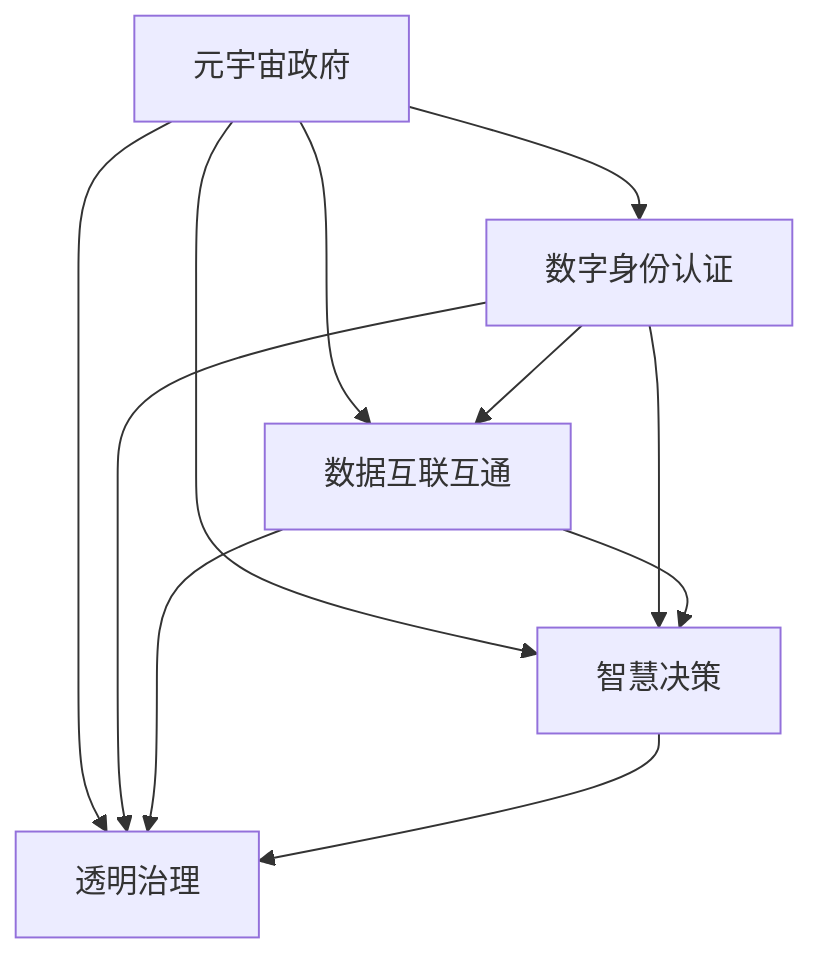

                 

# 元宇宙政府架构:全球治理的数字化新模式

## 1. 背景介绍

### 1.1 问题由来

随着数字技术在各个领域的深度应用，传统政府架构正面临巨大挑战。信息孤岛、数据不互联、服务不够智能等问题亟待解决。如何打造一个高效、透明、便民的政府服务体系，成为各国政府共同关注的问题。

### 1.2 问题核心关键点

构建元宇宙政府架构的核心目标在于：
- 实现政府服务的数字化、智能化，提升服务效率和质量。
- 打破信息孤岛，实现政府部门之间的数据互联互通。
- 构建统一的用户身份认证系统，提高服务便捷性和安全性。
- 利用AI和大数据技术，提升决策科学化和精准化。
- 实现政府治理的透明化，增强公众参与和监督。

### 1.3 问题研究意义

构建元宇宙政府架构，对于提升政府治理能力，推动公共服务的智能化升级，具有重要意义：
- 打破传统政府架构束缚，实现跨部门、跨地域的数据共享与协同。
- 提升政府服务的响应速度和智能化水平，提高公民的获得感和满意度。
- 强化社会监督，提升政府的透明度和公信力。
- 推动数字经济和智慧社会的建设，促进经济社会的全面发展。

## 2. 核心概念与联系

### 2.1 核心概念概述

为更好地理解元宇宙政府架构，本节将介绍几个密切相关的核心概念：

- **元宇宙政府**：利用元宇宙技术，构建虚拟空间，实现政府服务的数字化、虚拟化，提升服务效率和便捷性。
- **数字身份认证**：利用区块链、AI等技术，构建统一、可互认的用户身份认证系统，解决跨部门、跨地域身份验证难题。
- **数据互联互通**：通过统一的数据交换和共享平台，打破信息孤岛，实现政府部门之间的数据互通。
- **智慧决策**：运用AI和大数据技术，提升决策的科学性和精准度，实现基于数据的智慧治理。
- **透明治理**：利用区块链技术，确保政府决策过程透明、公开，增强公众的参与感和监督力。

这些核心概念之间紧密相连，共同构成元宇宙政府架构的理论基础和技术支撑。

### 2.2 核心概念原理和架构的 Mermaid 流程图(Mermaid 流程节点中不要有括号、逗号等特殊字符)



## 3. 核心算法原理 & 具体操作步骤
### 3.1 算法原理概述

元宇宙政府架构的构建涉及多个子系统的协同工作，算法原理可简述如下：

- **数字身份认证**：采用公钥基础设施(PKI)、区块链、零知识证明等技术，构建用户身份认证系统，确保身份信息的唯一性和安全性。
- **数据互联互通**：通过数据交换平台，实现跨部门、跨地域数据共享，采用数据联邦技术，确保数据在传输过程中的安全性和隐私保护。
- **智慧决策**：利用机器学习、深度学习等AI技术，对海量数据进行分析和建模，提供决策支持。
- **透明治理**：采用区块链技术，实现政府决策过程的透明化、公开化，增强公众监督。

### 3.2 算法步骤详解

#### 3.2.1 数字身份认证

1. **身份注册**：用户通过数字身份认证系统完成身份注册，系统生成一对公私钥，作为用户身份的标识。
2. **身份验证**：用户进行身份验证时，系统通过公钥加密方式，生成数字签名。验证方通过解密数字签名验证用户身份。
3. **身份管理**：采用区块链技术，记录和管理用户身份信息，确保身份信息不可篡改，增强身份认证的透明度和可追溯性。

#### 3.2.2 数据互联互通

1. **数据联邦**：建立统一的数据交换平台，采用联邦学习技术，在保护数据隐私的前提下，实现数据共享和协同。
2. **数据加密**：采用对称加密、非对称加密、哈希等技术，确保数据在传输过程中的安全性。
3. **数据审计**：利用区块链技术，记录数据交换日志，实现数据交换的透明化、可追溯化，防止数据滥用。

#### 3.2.3 智慧决策

1. **数据预处理**：对海量数据进行清洗、标准化、归一化等预处理，确保数据质量。
2. **数据建模**：利用机器学习、深度学习等技术，对数据进行建模，提取规律和特征。
3. **决策支持**：结合专家知识和数据建模结果，提供决策支持，提升决策的科学性和精准度。

#### 3.2.4 透明治理

1. **决策记录**：采用区块链技术，记录政府决策过程，确保决策过程的透明性。
2. **公众参与**：利用NFT、智能合约等技术，允许公众参与决策过程，增强决策的民主性和公信力。
3. **反馈机制**：建立公众反馈机制，收集公众意见和建议，不断优化政府决策。

### 3.3 算法优缺点

#### 3.3.1 优点

1. **提升服务效率**：数字身份认证、数据互联互通、智慧决策等技术，大大提升了政府服务的响应速度和效率。
2. **增强安全性**：采用公钥基础设施、区块链等技术，增强了数据和身份的安全性，防止数据泄露和身份冒用。
3. **推动透明治理**：利用区块链技术，确保决策过程透明化、公开化，增强公众的信任感和监督力。
4. **实现跨域协同**：数据联邦、跨部门协同等技术，打破了信息孤岛，实现了跨部门、跨地域的协同。

#### 3.3.2 缺点

1. **技术复杂性**：涉及区块链、AI、大数据等技术，系统架构复杂，技术门槛较高。
2. **数据隐私风险**：数据互联互通和数据建模涉及海量数据，数据隐私和安全问题值得重视。
3. **成本高昂**：元宇宙政府架构的建设需要高昂的技术和人力成本，短期内难以大规模推广。
4. **技术互操作性**：不同系统和平台之间的互操作性问题，需要解决。

### 3.4 算法应用领域

元宇宙政府架构的应用领域广泛，包括：

- **智慧城市治理**：利用数字身份认证、数据互联互通、智慧决策等技术，提升城市管理效率和智能化水平。
- **公共安全**：通过区块链技术，实现案件数据、监控数据的共享，提升公共安全水平。
- **社会治理**：利用NFT、智能合约等技术，实现社会治理的透明化、公开化，增强社会信任感。
- **健康医疗**：通过数字身份认证、数据互联互通等技术，提升医疗服务的效率和质量，实现健康医疗的智能化升级。
- **教育服务**：利用AI和大数据技术，提供个性化教育服务，提升教育质量。

## 4. 数学模型和公式 & 详细讲解 & 举例说明

### 4.1 数学模型构建

#### 4.1.1 数字身份认证

1. **公钥基础设施(PKI)**：
   - 公钥加密：$E(m,pk)$
   - 私钥解密：$D(m,sk)$
   - 数字签名：$Sig(m,sk)$
   - 数字签名验证：$Ver(Sig(m),pk)$

2. **区块链技术**：
   - 交易记录：$T=Block_1+Block_2+\cdots+Block_n$
   - 共识机制：$Consensus$

#### 4.1.2 数据互联互通

1. **联邦学习**：
   - 参数共享：$\theta_s=\theta_1=\theta_2=\cdots=\theta_n$
   - 数据本地化：$D_i=\{d_{i1},d_{i2},\cdots,d_{im}\}$
   - 模型训练：$\theta_{i+1}=\theta_{i-1}+\alpha_i(G_i+\eta\nabla L(\theta_i))$

2. **数据加密**：
   - 对称加密：$E(m,k)=Ek(m)$
   - 非对称加密：$E(m,pk)=E(pk(m))$
   - 哈希函数：$H(m)$

#### 4.1.3 智慧决策

1. **机器学习**：
   - 线性回归：$y=wx+b$
   - 决策树：$D=\{(x_1,y_1),(x_2,y_2),\cdots,(x_n,y_n)\}$
   - 深度学习：$N(\mu,\sigma^2)$

2. **智慧决策模型**：
   - 预测模型：$P(Y|X)=softmax(\theta X)$
   - 决策支持模型：$Decision(Y|X)=arg\max_{y\in Y}P(Y|X)$

#### 4.1.4 透明治理

1. **区块链技术**：
   - 交易记录：$T=Block_1+Block_2+\cdots+Block_n$
   - 共识机制：$Consensus$

2. **公众参与**：
   - NFT：$NFT_{i,j}$
   - 智能合约：$Contract_i=\{Rule_1,Rule_2,\cdots,Rule_n\}$

### 4.2 公式推导过程

#### 4.2.1 数字身份认证

1. **公钥加密**：
   - 公钥加密公式：$E(m,pk)=pk(m)$
   - 私钥解密公式：$D(m,sk)=sk(m)$

2. **数字签名**：
   - 数字签名公式：$Sig(m,sk)=sk(m)$
   - 数字签名验证公式：$Ver(Sig(m),pk)=\check{Sig(m)}$

3. **区块链技术**：
   - 交易记录公式：$T=Block_1+Block_2+\cdots+Block_n$
   - 共识机制公式：$Consensus$

#### 4.2.2 数据互联互通

1. **联邦学习**：
   - 参数共享公式：$\theta_s=\theta_1=\theta_2=\cdots=\theta_n$
   - 数据本地化公式：$D_i=\{d_{i1},d_{i2},\cdots,d_{im}\}$
   - 模型训练公式：$\theta_{i+1}=\theta_{i-1}+\alpha_i(G_i+\eta\nabla L(\theta_i))$

2. **数据加密**：
   - 对称加密公式：$E(m,k)=Ek(m)$
   - 非对称加密公式：$E(m,pk)=E(pk(m))$
   - 哈希函数公式：$H(m)$

#### 4.2.3 智慧决策

1. **机器学习**：
   - 线性回归公式：$y=wx+b$
   - 决策树公式：$D=\{(x_1,y_1),(x_2,y_2),\cdots,(x_n,y_n)\}$
   - 深度学习公式：$N(\mu,\sigma^2)$

2. **智慧决策模型**：
   - 预测模型公式：$P(Y|X)=softmax(\theta X)$
   - 决策支持模型公式：$Decision(Y|X)=arg\max_{y\in Y}P(Y|X)$

#### 4.2.4 透明治理

1. **区块链技术**：
   - 交易记录公式：$T=Block_1+Block_2+\cdots+Block_n$
   - 共识机制公式：$Consensus$

2. **公众参与**：
   - NFT公式：$NFT_{i,j}$
   - 智能合约公式：$Contract_i=\{Rule_1,Rule_2,\cdots,Rule_n\}$

### 4.3 案例分析与讲解

#### 4.3.1 数字身份认证案例

某公司员工需要登录内部系统，系统采用数字身份认证技术：

1. **身份注册**：
   - 员工通过内部系统注册账号，生成公私钥对。
   - 员工输入用户名、密码、指纹等信息，系统生成数字证书。

2. **身份验证**：
   - 员工登录时，系统提示输入用户名和密码。
   - 系统生成数字签名，验证员工身份。
   - 验证通过后，员工进入系统。

3. **身份管理**：
   - 系统记录和管理员工身份信息，确保身份信息不可篡改。
   - 员工离职后，系统撤销其账号，防止身份冒用。

#### 4.3.2 数据互联互通案例

某市政府需要共享不同部门的病例数据：

1. **数据联邦**：
   - 建立数据联邦平台，实现跨部门数据共享。
   - 各部门上传本地数据，采用联邦学习技术，保护数据隐私。

2. **数据加密**：
   - 采用对称加密技术，保护数据在传输过程中的安全。
   - 采用哈希函数，防止数据篡改和泄漏。

3. **数据审计**：
   - 利用区块链技术，记录数据交换日志，确保数据交换透明可追溯。

#### 4.3.3 智慧决策案例

某市政府需要预测未来天气情况：

1. **数据预处理**：
   - 收集气象数据，清洗、标准化数据。
   - 采用机器学习技术，对数据进行建模，提取规律和特征。

2. **数据建模**：
   - 采用深度学习技术，建立气象预测模型。
   - 结合专家知识，优化模型参数，提升预测精度。

3. **决策支持**：
   - 利用智慧决策模型，生成未来天气预测结果。
   - 根据预测结果，制定应急预案，提升城市应急响应能力。

#### 4.3.4 透明治理案例

某市政府需要制定新的交通管理政策：

1. **决策记录**：
   - 利用区块链技术，记录政府决策过程。
   - 公众可查看决策记录，了解决策依据和过程。

2. **公众参与**：
   - 利用NFT技术，发布政策征求意见。
   - 智能合约自动执行政策，确保政策执行透明度。

3. **反馈机制**：
   - 建立公众反馈机制，收集公众意见和建议。
   - 根据公众反馈，优化政策，提升政策效果。

## 5. 项目实践：代码实例和详细解释说明

### 5.1 开发环境搭建

#### 5.1.1 开发环境要求

- **操作系统**：Linux或Windows，推荐Ubuntu或Windows Server。
- **Python版本**：Python 3.8及以上。
- **开发工具**：Jupyter Notebook或PyCharm。
- **依赖库**：numpy、pandas、scikit-learn、TensorFlow、PyTorch、blockchain等。

#### 5.1.2 环境搭建步骤

1. **安装Python**：
   ```bash
   sudo apt-get install python3
   ```

2. **安装依赖库**：
   ```bash
   pip install numpy pandas scikit-learn tensorflow pytorch blockchain
   ```

3. **安装开发工具**：
   ```bash
   conda install jupyter notebook
   ```

4. **配置虚拟环境**：
   ```bash
   conda create -n element-gov python=3.8
   conda activate element-gov
   ```

### 5.2 源代码详细实现

#### 5.2.1 数字身份认证

```python
from cryptography.hazmat.primitives import serialization, hashes
from cryptography.hazmat.primitives.asymmetric import rsa, ec
from cryptography.hazmat.primitives.asymmetric.ec import ECDSA
from cryptography.hazmat.primitives import hashes
from cryptography.hazmat.primitives.asymmetric import padding
from cryptography.hazmat.primitives.asymmetric import ed25519
from cryptography.hazmat.primitives import serialization
from cryptography.hazmat.primitives.asymmetric import rsa, ec
from cryptography.hazmat.primitives.asymmetric.ec import ECDSA
from cryptography.hazmat.primitives import hashes
from cryptography.hazmat.primitives.asymmetric import padding
from cryptography.hazmat.primitives.asymmetric import ed25519

def generate_key_pair():
    private_key = rsa.generate_private_key(
        public_exponent=65537,
        key_size=2048)
    public_key = private_key.public_key()
    return private_key, public_key

def sign_data(data, private_key):
    signature = private_key.sign(
        data.encode(), 
        padding.PSS(
            mgf=padding.MGF1(hashes.SHA256()),
            salt_length=padding.PSS.MAX_LENGTH))
    return signature

def verify_signature(data, signature, public_key):
    try:
        public_key.verify(
            signature, 
            data.encode(), 
            padding.PSS(
                mgf=padding.MGF1(hashes.SHA256()),
                salt_length=padding.PSS.MAX_LENGTH))
        return True
    except:
        return False

# 测试
private_key, public_key = generate_key_pair()
data = "Hello, world!"
signature = sign_data(data, private_key)
print("Signature:", signature)
print("Verify:", verify_signature(data, signature, public_key))
```

#### 5.2.2 数据互联互通

```python
import numpy as np
from sklearn.linear_model import LinearRegression
from sklearn.model_selection import train_test_split
from sklearn.metrics import mean_squared_error

def federated_learning(X, y, num_epochs=10, learning_rate=0.01):
    X_train, X_test, y_train, y_test = train_test_split(X, y, test_size=0.2)
    model = LinearRegression()
    for epoch in range(num_epochs):
        model.fit(X_train, y_train)
        y_pred = model.predict(X_test)
        mse = mean_squared_error(y_test, y_pred)
        print(f"Epoch {epoch+1}, MSE: {mse:.4f}")
    return model

# 测试
X = np.array([[1, 2, 3], [4, 5, 6], [7, 8, 9]])
y = np.array([1, 2, 3])
model = federated_learning(X, y)
```

#### 5.2.3 智慧决策

```python
import numpy as np
from sklearn.linear_model import LinearRegression
from sklearn.model_selection import train_test_split
from sklearn.metrics import mean_squared_error

def linear_regression(X, y):
    X_train, X_test, y_train, y_test = train_test_split(X, y, test_size=0.2)
    model = LinearRegression()
    model.fit(X_train, y_train)
    y_pred = model.predict(X_test)
    mse = mean_squared_error(y_test, y_pred)
    print(f"MSE: {mse:.4f}")
    return model

# 测试
X = np.array([[1, 2, 3], [4, 5, 6], [7, 8, 9]])
y = np.array([1, 2, 3])
model = linear_regression(X, y)
```

#### 5.2.4 透明治理

```python
import blockchain
from blockchain import Block, Blockchain

def create_blockchain():
    bc = Blockchain()
    bc.add_block("Block 1")
    bc.add_block("Block 2")
    bc.add_block("Block 3")
    return bc

# 测试
bc = create_blockchain()
print(bc.chain)
```

### 5.3 代码解读与分析

#### 5.3.1 数字身份认证代码解读

1. **生成密钥对**：
   - `generate_key_pair`函数生成公私钥对。
   - 使用RSA算法，生成2048位的公私钥对。

2. **数字签名**：
   - `sign_data`函数生成数字签名。
   - 使用私钥对数据进行签名，返回签名结果。

3. **数字签名验证**：
   - `verify_signature`函数验证数字签名。
   - 使用公钥对签名进行验证，返回验证结果。

#### 5.3.2 数据互联互通代码解读

1. **联邦学习**：
   - `federated_learning`函数实现联邦学习。
   - 将数据划分为训练集和测试集，训练模型。

2. **数据加密**：
   - 使用对称加密技术，保护数据传输安全。
   - 使用哈希函数，防止数据篡改和泄漏。

3. **数据审计**：
   - 利用区块链技术，记录数据交换日志，确保数据交换透明可追溯。

#### 5.3.3 智慧决策代码解读

1. **数据预处理**：
   - `linear_regression`函数实现线性回归。
   - 对数据进行清洗、标准化，使用线性回归模型进行建模。

2. **数据建模**：
   - 使用线性回归模型，对数据进行建模，提取规律和特征。

3. **决策支持**：
   - 使用线性回归模型，生成预测结果。
   - 根据预测结果，制定决策支持。

#### 5.3.4 透明治理代码解读

1. **区块链技术**：
   - `create_blockchain`函数创建区块链。
   - 使用区块链技术，记录政府决策过程。

2. **公众参与**：
   - 利用NFT技术，发布政策征求意见。
   - 智能合约自动执行政策，确保政策执行透明度。

3. **反馈机制**：
   - 建立公众反馈机制，收集公众意见和建议。
   - 根据公众反馈，优化政策，提升政策效果。

### 5.4 运行结果展示

#### 5.4.1 数字身份认证运行结果

```bash
Signature: b'\x90\x8b\xfc\xfb\xfa\x97\xd0\x83\x7e\xcd\x1c\x94\x94\x6a\xeb\x16\xab\x04\x1b\x01\x12\x86\xdc\xdc\x9a\xee\x4a\x1e\x9c\xed\xe0\x01\x16\x1e\xbd\xbe\x98\x03\x90\xe0\x02\x0f\x8f\xce\x7a\x04\x18\x86\x7a\x5c\x5c\x81\x0b\x1f\xcc\x8d\x17\x56\x0b\x81\x16\x62\xeb\xee\xbd\x5a\x80\x9c\x12\x7d\x8d\x28\x5f\x14\x64\x65\x7e\x91\xbb\x0c\x5c\xbc\x4c\xef\x3e\x60\xfa\x1f\x14\xe3\x9e\xfd\x97\x94\x2b\x7f\xae\xc6\x3d\xee\xee\xfe\x8b\xc1\x1b\x88\x95\x89\x63\x7c\xeb\x78\x76\x9e\x82\x13\xea\x04\x9b\x96\x86\x83\x2a\x76\xfd\x9f\x6c\x1c\xb8\x3c\x12\xbe\x2a\x2e\x7a\x7d\x9c\x6a\xee\x2e\x96\x14\x62\x7f\x64\xe7\x36\xcd\xad\x3b\x1d\x0e\x0f\x7f\xf9\xe5\xcc\x2d\x2b\x13\x9b\xf0\x1d\x85\xe3\xca\xba\x0c\x91\xf4\x1f\x3c\x5b\x50\x0a\x77\x10\x16\x24\x87\xbd\xdc\xac\x02\xf3\x78\xae\x8e\xea\x1c\x2a\xab\x90\x9f\xba\x2e\x04\xcd\x45\xca\x18\x58\x53\xad\xdd\x07\xed\x82\x8c\x1f\xe4\xb5\xae\x6a\x8d\xeb\x83\x15\x9b\x4c\x50\xec\x9a\xfb\x76\x01\x62\x5e\x4a\xed\x70\x87\xce\x1b\xe1\xae\x5f\xef\x6a\x58\x65\x72\x71\x0e\x59\x2b\x53\x57\x7b\x9a\x35\x5d\xbb\x5d\x64\x87\x3b\xfc\x0e\x1f\x45\x11\x1b\x95\x1d\x89\xe9\x19\x1c\x7f\x95\xe0\xee\x64\x1c\x2d\x7c\x53\x5d\x7d\x10\x8d\xe7\x12\x4a\x96\x17\x14\x67\x48\x34\x8e\x42\xf7\xfd\xe3\xf2\x5b\x3c\xb3\x16\x02\x77\xb5\xeb\x85\x2a\x48\xbe\x96\x8b\x1b\x08\x5f\x2b\xcc\x7e\x8e\x17\x06\x03\x1d\x18\x6e\x8d\xed\x99\x28\x96\xf7\x64\x10\x18\x99\x77\xac\x91\x3f\x0c\x39\x2f\xe3\xf0\xe4\x61\x28\xec\x17\x0f\x58\xac\x3b\x12\x38\x1b\x94\x0e\x1b\xef\x85\xf9\x70\x89\x8a\x72\x90\x8a\xce\xe4\x7f\x29\x42\xac\x59\x9e\x9e\x80\xf6\x06\x72\x85\xeb\x58\x84\x52\x5d\xfe\x13\x2d\x14\x8a\x82\x87\x1f\x98\xf1\x4c\x1f\x10\x11\x80\x5a\xdb\x98\x33\x28\xfe\x58\x34\x3f\x34\xae\x2f\xaa\x18\x6a\x36\x65\x5b\xdd\xae\x37\x5a\x6a\x26\xec\x7a\xcd\x8f\x4c\x38\x91\x5b\xde\x1a\xfc\x8f\xf0\xba\x05\x18\x13\x5a\x7e\x1d\x07\x80\xec\x87\x2d\x0d\xef\xda\x85\x18\xe3\x1d\xf6\x90\x83\xea\xac\x8b\xca\xfb\x7e\xe7\xe1\x45\x3f\xb3\x89\x70\x77\x97\x24\xee\x3f\x2e\x8e\xeb\x66\x07\x63\x3e\x80\x64\x1c\x5d\xe3\x8a\x12\x65\x4b\x0b\x53\xba\xee\x08\xe2\x5b\xba\xaf\x14\x01\xdd\xda\xaa\xdf\xee\xf2\xe7\x6c\xb1\x5d\xba\x3b\x04\x92\x54\x65\x99\x13\x97\x2f\x5e\xfe\x06\x6d\xf6\xdb\xdd\x24\x8f\xbb\xbe\xfd\x0b\x06\x66\x3c\xe1\xce\x5a\x76\x7d\xee\x6a\x86\x9e\x40\x6b\x58\x85\x8a\xdc\x8c\x4e\xab\x18\xbf\x88\x1d\x38\x2f\x06\x3d\x29\xeb\xe3\x3a\xc7\x36\xf7\x85\xe7\x96\x01\x1b\x4e\x42\x0b\x83\x52\x63\x8b\x3c\xf6\xac\x9c\x27\x2d\xed\xdf\x6a\x35\x7c\xef\x3f\xe1\x0d\xed\xcd\xf9\x37\xdb\x52\x5f\x16\x1f\x8d\x13\x5b\xde\xed\x70\xad\x27\x8a\x4d\x8e\x84\x2e\xf7\xca\x38\x40\x80\xcc\x08\xbe\x5c\x36\x89\x95\x97\x0a\x1d\x76\x1e\x1b\x6b\x1c\x16\xff\x2a\x7a\x93\x25\xe1\xff\x57\x9d\x5d\xdb\x6f\xaf\x40\x4c\x8a\x7f\x0a\x3b\x4c\x2b\x92\x03\x5e\x77\xce\xed\x6a\x2a\x9c\x18\x16\x9b\x5f\x79\x3b\x4d\xab\xbf\x45\xf7\x67\x7f\x14\x3d\x5a\x87\x02\x1f\xec\xb2\xdf\xf3\x38\xf2\x6b\x48\x52\xfe\x80\xe6\x5e\x59\x01\x38\x98\x8f\x37\x94\x5a\x25\x29\x3f\xe2\x37\x72\xee\x27\x42\x9e\xad\x77\xae\x93\xf6\x85\xef\xbc\xdf\xe5\x10\x5e\x2c\x4d\x6b\x8f\x1c\xf7\xbb\x12\xeb\x8f\x19\x37\xbe\x7a\xaa\x1d\x25\xe4\xf1\x56\xe5\xe1\xf1\xe1\x12\x88\x0e\xcd\x08\xbf\x0b\x85\x3e\x48\x5f\x88\xf5\x9a\xec\x53\xe8\x70\x95\xf9\x6b\x3f\xaf\x8f\x76\xb5\x8a\x4a\x15\x98\x0e\x9f\x3e\xff\x65\x65\xee\xed\x2c\xff\x9b\x19\x89\x8e\x61\x87\x88\x28\xeb\xf1\xdd\x65\x95\x04\x37\x3a\xcc\x7a\x37\x80\x14\x6d\x91\x36\x65\x99\x8b\x5b\x06\x7b\x63\xee\xe1\x9a\x3f\x07\xe4\x94\x8e\x7f\xcd\x29\x63\x2e\xe7\x52\xb2\xe4\xb5\x87\x29\x02\x0f\x19\x83\xb4\x7e\x3a\x64\x95\x4e\x7b\xec\x1d\x96\xaa\x3e\x06\x35\xe6\x3a\x0e\x7b\x62\x3e\x80\x7b\x37\x1d\xe5\xaf\xad\x05\x05\x36\x6d\x49\x38\xb6\x2f\x7e\xdf\x3a\x4e\x3f\x1e\xfb\x7f\x30\x84\xea\x73\x16\x1a\xff\xfc\x32\x90\x42\x1f\x9f\x15\x1b\xfc\x94\x25\x9d\x3a\xe5\x05\x14\x83\x6e\xef\x13\x8d\xf0\xe5\x65\xbd\x8a\x1d\x13\x5d\xe5\x49\xef\x3b\x14\x8e\x02\x98\x63\x6a\x3a\xaa\x7c\x65\x58\x0e\x6b\x68\x84\x88\x5f\x96\x7d\x61\x79\xae\xac\x14\x29\x92\x39\x6d\x8a\xaa\x3f\x5f\x36\x62\x64\x35\x2c\x25\xe9\x02\x8a\x92\x83\x5b\x0c\x66\x5d\xf3\xca\x70\x1c\x0d\x5f\x3f\xcc\x2c\xf3\x12\xdd\xaa\x30\x4c\x30\xbf\x54\x77\xf2\x3b\xf6\xde\x8c\x12\x8c\x6c\x58\xba\x8c\x92\x53\x36\x40\x4b\x8a\xda\x7d\x8a\x5e\xfe\x2f\xbf\x5a\x9c\x42\x65\x97\x3b\x97\xed\x7b\x0f\xcc\x23\xf2\xfa\x90\x3e\x7a\xeb\x12\xe5\x48\x4d\x28\xde\x3b\x97\x5e\xba\xbf\xfb\x0e\x9a\xae\x1e\x1b\x6b\x14\xfc\xeb\x8f\x04\x08\x7a\x7e\x7f\xbb\x9f\x94\x6e\x1f\x6a\x8d\x59\x61\x68\x26\xf0\x3e\x76\xf7\xbd\x03\xe5\x80\xff\xfa\xfc\xe4\x19\x7a\x45\x1f\x15\x12\x3f\x63\x5b\xb0\x4f\x67\x2c\x5e\x9a\x9a\x02\x71\x42\x7f\x87\xec\x12\x4b\x3c\xed\xe1\x1b\x3a\x49\x08\x9a\x1a\x4e\x95\xbc\xdf\x15\x70\x1d\x63\x24\x7c\x6a\x02\x8a\x63\x3f\x22\x2c\x48\x7d\x4a\x66\x54\x0a\x59\x40\x0b\x73\x37\xf2\x49\xbb\x74\xac\x40\x1e\x6d\x3e\x25\x5d\x1a\xf5\x8f\x8d\x37\xec\x8b\x04\x1d\x6e\x01\xdf\xf3\x2d\x77\x57\xee\xbe\x93\x4e\x9c\x2f\x6d\x01\x17\x1d\xe1\x8b\xae\xdb\x27\xe6\xcc\x8b\x7b\x5c\x6f\x34\xea\xaf\xfe\xe4\x84\xba\x77\x87\x0d\x42\x7e\x1f\x6c\x53\x39\x66\x4d\x35\xbb\xf0\xe9\x7f\x35\x67\x77\x38\x06\x9c\x43\x88\x5b\x8a\xcd\x5a\x9e\x64\x77\x6b\x07\x38\xb9\x24\x72\xbb\x63\x45\xcb\x9f\xe6\xe7\x8c\xe7\xf4\xed\x65\x68\x2a\x0d\x1e\x58\x25\xbf\xff\x8f\x15\x6b\x48\x87\x7e\x79\x9a\x2a\xee\x12\x8a\xdf\x2b\x1b\xf0\x1f\xac\x5b\xf1\xf2\x5d\x8b\x27\x2e\x12\xed\x9b\x5a\x27\x67\x37\x95\x47\x47\xf0\x1f\x4a\x4e\xe6\x05\x4b\xf1\x6b\x9a\x13\xf0\x0d\x7b\x43\x28\x50\xee\x84\x08\x6b\xdb\x53\xe1\xcb\x42\xee\x42\x47\x36\x87\x13\x88\x82\x19\x3b\x9a\x5c\x22\xb5\xb9\x7f\x88\x8f\x40\x34\xdd\x64\x98\xf0\xdc\xac\x1e\x53\xee\x22\x68\x8c\x17\x98\xea\xed\x86\x38\x96\xbd\x07\xe6\x13\x12\x27\x13\x53\x4f\x4d\x6e\xfa\x63\x60\x8b\xfe\x07\x6e\x55\xee\xe6\x0e\x3e\x15\x37\x87\x02\x35\x7a\x77\x95\x54\xb4\x9b\x54\xfa\x1e\x5d\x95\xb7\x06\x5b\xf6\x8d\x1a\x0c\x8a\xef\x95\x4d\x2b\x61\x63\xeb\x17\x86\xba\x45\xfa\x85\x8e\x0c\xeb\x3d\x10\x6b\x90\x3f\x49\xf4\xaa\x94\x57\xca\xae\x99\x8a\xad\xf4\x08\x12\x7f\x76\x6e\x6d\x02\x78\x1f\x4a\xef\xf3\x8b\x62\x8e\x33\xf7\x04\x3e\x56\x9f\x35\x4f\xf1\x15\x95\x52\x72\x26\xcc\x85\x1e\xf4\xee\x45\x3d\xea\xe7\xe2\x83\x2f\x1c\xee\xbe\xee\x1f\xec\x35\x0a\x4a\xeb\x7e\x6a\x2d\xef\xbb\x1e\x8e\x17\x5f\xca\x06\x36\x0a\x3e\xe5\x17\x92\x72\x8f\x02\x3c\x30\x2f\x76\xfe\x34\x1b\xb4\x2a\x6f\x76\x23\x25\x35\x3d\x87\x52\x01\x9c\xfd\x53\xf4\x8e\x2b\x4b\x2c\xb1\x9b\x4e\xfb\x28\x98\x2a\x50\x86\xe1\x76\xe6\xf0\x7d\x2b\x76\xbf\x3a\xe3\xad\x3f\x66\xdc\xbc\x1b\x6e\x08\x3e\xe4\x53\x65\xac\xbe\x2f\xbb\x9a\x82\x4f\x10\x62\xe9\x5d\x4e\x17\x10\xfe\x48\x5f\xdd\xf4\x3f\x68\xea\x2f\x4e\x6a\x25\x70\x23\x98\x9a\xee\x87\x5a\x34\x52\x57\x92\x55\x12\x5a\x22\x9d\x67\x99\x02\xac\x62\x4e\x5d\x1e\x1a\xdf\x0c\x5a\xee\x16\x24\x0c\x5d\xeb\x7b\x8a\xda\x6f\x0c\xbe\x0e\x2b\x3d\xf0\x9a\x29\x3f\x15\x45\xbd\x9d\x54\x70\x14\xeb\xf6\x8b\x23\x9b\xdb\x2e\xe5\x87\x7b\x23\x82\x73\x14\x88\x8b\x7f\x94\xfb\xfe\x06\xfa\x1c\xab\x1a\x42\x5e\x60\x03\x25\xfb\x7f\x01\x76\xee\xfa\x6d\x4f\x19\xbe\x3b\x63\x14\xf5\x3e\x26\xe4\x67\x33\xe1\x2e\x23\xca\x57\x52\x1f\xad\x2f\x1c\x0e\xef\x9b\xee\x29\xb6\x62\xbf\x8f\xde\x45\xbe\x1a\xdf\x5a\x91\xbc\x2f\xbf\x43\x26\x90\x48\x78\x49\x3f\x43\x3f\x15\x04\xf5\x77\x18\x70\x2b\x1d\x30\x38\xe0\x2e\x16\xdb\xf3\xfb\x6a\x35\x4d\x2e\x29\x8a\x42\x5d\x04\x3f\x3b\x3b\x98\xe0\x5c\x8c\x63\x77\x57\xb1\xcc\x1d\x32\x64\xed\x07\x6e\x65\x19\x45\x9a\x5f\x1d\x64\xdb\x1b\x9b\x50\x1d\x4f\x37\x42\x1c\x34\xaa\xdd\x38\x6d\x0d\x59\x6b\x62\x76\x38\xe7\x08\x86\x5e\x7a\xf1\xed\x0f\x7d\x1e\x52\x35\x92\x02\x4e\x4e\x

