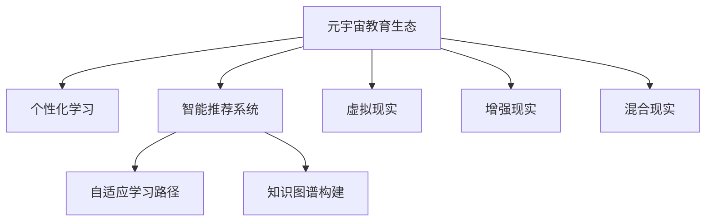

                 

# 元宇宙教育生态:个性化学习的无限可能

> 关键词：元宇宙,教育生态,个性化学习,智能推荐系统,自适应学习,虚拟现实,知识图谱

## 1. 背景介绍

### 1.1 问题由来
随着数字化时代的到来，教育领域正经历着一场前所未有的变革。传统的教育模式面临着学生多样化需求与有限师资力量的矛盾，个性化教育愈发显得迫切。如何为每个学生量身定制学习计划，让学习变得更加个性化、高效，是教育领域长期以来努力追求的目标。

与此同时，随着AI和信息技术的发展，一种全新的教育形态——元宇宙（Metaverse）逐渐进入人们的视野。元宇宙是一个虚拟的、交互式的、持续演进的世界，它集成了虚拟现实（Virtual Reality, VR）、增强现实（Augmented Reality, AR）、混合现实（Mixed Reality, MR）等技术，能够提供沉浸式的学习和互动体验。

在这样的背景下，结合元宇宙和个性化学习的理念，我们提出了元宇宙教育生态的概念，旨在通过AI技术和教育资源的深度融合，实现个性化学习路径的智能推荐和自适应调整，为每个学生提供量身定做的学习体验，从而提升学习效果和效率。

### 1.2 问题核心关键点
元宇宙教育生态的核心在于如何通过AI技术和个性化算法，构建一个高度自适应、智能推荐的学习系统。其关键点包括：

- **自适应学习路径**：根据学生的学习进度、兴趣偏好、认知水平等个性化特征，智能推荐学习内容和路径。
- **智能推荐系统**：利用AI技术，如机器学习、深度学习，为学生推荐最合适的学习资源和活动。
- **沉浸式学习环境**：利用VR/AR/MR技术，营造沉浸式的学习体验，提升学习的参与度和效果。
- **知识图谱构建**：通过构建大规模的知识图谱，支持学生自主探索和发现新知识，提升学习深度和广度。

## 2. 核心概念与联系

### 2.1 核心概念概述

为更好地理解元宇宙教育生态的构建，本节将介绍几个密切相关的核心概念：

- **元宇宙（Metaverse）**：一个虚拟的、交互式的、持续演进的世界，包含虚拟现实（VR）、增强现实（AR）、混合现实（MR）等多种技术，能够提供沉浸式的学习和互动体验。
- **个性化学习**：根据学生的个性化特征和需求，量身定制学习计划和路径，提升学习效果和效率。
- **智能推荐系统**：利用AI技术，如机器学习、深度学习，为学生推荐最合适的学习资源和活动。
- **自适应学习路径**：根据学生的学习进度、兴趣偏好、认知水平等个性化特征，智能推荐学习内容和路径。
- **知识图谱**：大规模的知识结构化表示，用于支持学生自主探索和发现新知识。
- **虚拟现实（VR）、增强现实（AR）、混合现实（MR）**：多种技术手段，用于构建沉浸式的学习环境。

这些核心概念之间的逻辑关系可以通过以下Mermaid流程图来展示：



这个流程图展示了个元宇宙教育生态的核心概念及其之间的关系：

1. 元宇宙教育生态通过个性化学习和智能推荐系统，为学生提供量身定做的学习体验。
2. 智能推荐系统利用AI技术，为学生推荐最合适的学习资源和活动。
3. 自适应学习路径根据学生的个性化特征，智能推荐学习内容和路径。
4. 知识图谱构建支持学生自主探索和发现新知识，提升学习深度和广度。
5. VR/AR/MR技术用于构建沉浸式的学习环境，提升学习的参与度和效果。

## 3. 核心算法原理 & 具体操作步骤
### 3.1 算法原理概述

元宇宙教育生态的实现，主要依赖于以下几个关键算法和技术的结合：

- **自适应学习路径算法**：根据学生的学习进度、兴趣偏好、认知水平等个性化特征，智能推荐学习内容和路径。
- **智能推荐算法**：利用机器学习、深度学习等技术，为学生推荐最合适的学习资源和活动。
- **知识图谱构建与查询算法**：通过构建大规模的知识图谱，支持学生自主探索和发现新知识。
- **沉浸式学习环境构建算法**：利用VR/AR/MR技术，营造沉浸式的学习体验，提升学习的参与度和效果。

这些算法和技术相互配合，共同构成了元宇宙教育生态的基础。

### 3.2 算法步骤详解

以下是元宇宙教育生态的核心算法步骤详解：

#### 3.2.1 自适应学习路径算法

1. **个性化特征提取**：收集学生的学习数据，包括学习进度、成绩、兴趣偏好、认知水平等。
2. **学习路径规划**：根据个性化特征，构建多维度的学习路径，包括课程、活动、互动等。
3. **路径动态调整**：根据学习效果和反馈，动态调整学习路径，确保路径的个性化和有效性。

#### 3.2.2 智能推荐算法

1. **数据收集与预处理**：收集学习资源和活动的相关数据，包括文本、图像、视频、音频等。
2. **特征提取与建模**：利用机器学习和深度学习技术，提取特征并构建推荐模型。
3. **推荐结果生成**：根据模型输出，为学生推荐最合适的学习资源和活动。

#### 3.2.3 知识图谱构建与查询算法

1. **知识图谱构建**：通过自动化技术，从开放获取的知识库和教育资源中构建大规模的知识图谱。
2. **图谱查询与探索**：提供强大的查询和探索工具，支持学生自主发现新知识。

#### 3.2.4 沉浸式学习环境构建算法

1. **VR/AR/MR技术应用**：结合VR/AR/MR技术，构建沉浸式的学习环境。
2. **环境交互设计**：设计交互式的学习活动和任务，提升学生的参与度和体验感。

### 3.3 算法优缺点

元宇宙教育生态的实现，主要面临以下优缺点：

**优点**：

- **高度自适应**：通过AI技术和个性化算法，能够为每个学生提供量身定做的学习体验。
- **沉浸式学习**：利用VR/AR/MR技术，营造沉浸式的学习环境，提升学习的参与度和效果。
- **知识图谱支持**：通过构建大规模的知识图谱，支持学生自主探索和发现新知识。
- **智能推荐系统**：利用AI技术，为学生推荐最合适的学习资源和活动。

**缺点**：

- **高成本**：需要大量的硬件和软件投资，如高性能计算设备、VR设备等。
- **技术复杂**：涉及多种技术手段，需要跨学科的知识和技术积累。
- **数据隐私**：学生学习数据的收集和处理需要严格的数据隐私保护措施。
- **教学一致性**：如何保持元宇宙中的教学一致性和标准，是一个重要的挑战。

### 3.4 算法应用领域

元宇宙教育生态的应用领域非常广泛，涵盖了教育领域的多个方面：

- **K-12教育**：为中小学生提供个性化学习路径和资源推荐。
- **高等教育**：为大学生提供自主探索和深度学习的机会。
- **职业培训**：为在职人员提供职业技能的提升和认证。
- **终身学习**：为成人提供自主学习和技能提升的途径。

除了这些主流应用领域外，元宇宙教育生态还可应用于更多场景中，如远程教育、特殊教育、游戏化学习等，为教育公平和社会进步提供新的动力。

## 4. 数学模型和公式 & 详细讲解 & 举例说明

### 4.1 数学模型构建

本节将使用数学语言对元宇宙教育生态的核心算法进行更加严格的刻画。

记学生的个性化特征向量为 $\mathbf{x} \in \mathbb{R}^n$，学习路径向量为 $\mathbf{y} \in \mathbb{R}^m$。

定义学习路径推荐函数 $f(\mathbf{x},\mathbf{y})$，用于根据学生的个性化特征，推荐最合适的学习路径。

定义推荐算法函数 $g(\mathbf{x})$，用于根据学生特征，生成推荐结果。

定义知识图谱查询函数 $h(\mathbf{x})$，用于根据学生特征，查询知识图谱中的相关信息。

### 4.2 公式推导过程

以下我们以自适应学习路径算法为例，推导推荐函数 $f(\mathbf{x},\mathbf{y})$ 及其梯度计算公式。

假设推荐函数为线性函数：

$$
f(\mathbf{x},\mathbf{y}) = \mathbf{w}^T\mathbf{x} + \mathbf{b}
$$

其中 $\mathbf{w} \in \mathbb{R}^n$ 为权重向量，$\mathbf{b} \in \mathbb{R}$ 为偏置项。

根据最小二乘法，优化目标为：

$$
\min_{\mathbf{w},\mathbf{b}} \sum_{i=1}^N (\mathbf{y}_i - f(\mathbf{x}_i,\mathbf{y}_i))^2
$$

对 $\mathbf{w}$ 和 $\mathbf{b}$ 求偏导，得：

$$
\frac{\partial \mathcal{L}}{\partial \mathbf{w}} = 2\mathbf{X}^T(\mathbf{Y} - \mathbf{X}\mathbf{w}) = 0
$$

$$
\frac{\partial \mathcal{L}}{\partial \mathbf{b}} = 2(\mathbf{Y} - \mathbf{X}\mathbf{w}) = 0
$$

解得：

$$
\mathbf{w} = (\mathbf{X}^T\mathbf{X})^{-1}\mathbf{X}^T\mathbf{Y}, \quad \mathbf{b} = \mathbf{Y} - \mathbf{X}\mathbf{w}
$$

其中 $\mathbf{X} \in \mathbb{R}^{n\times N}, \mathbf{Y} \in \mathbb{R}^{N\times m}$。

### 4.3 案例分析与讲解

以一个简单的K-12教育场景为例，分析元宇宙教育生态的实际应用。

假设有一个K-12学生，其个性化特征向量 $\mathbf{x} = [性别, 年龄, 学习兴趣, 学科偏好]$，学习路径向量 $\mathbf{y} = [课程, 活动, 互动]$。

根据学生的个性化特征，推荐函数 $f(\mathbf{x},\mathbf{y})$ 生成推荐路径 $y$。

具体地，可以根据学生的学习进度、成绩、兴趣偏好、认知水平等特征，构建多维度的学习路径。例如，对于数学学科，可以推荐适合的数学书籍、在线课程、数学游戏等资源。

根据推荐函数 $f(\mathbf{x},\mathbf{y})$ 的计算结果，智能推荐系统为学生推荐最合适的学习资源和活动，确保学习路径的个性化和有效性。

## 5. 项目实践：代码实例和详细解释说明

### 5.1 开发环境搭建

在进行元宇宙教育生态实践前，我们需要准备好开发环境。以下是使用Python进行PyTorch开发的环境配置流程：

1. 安装Anaconda：从官网下载并安装Anaconda，用于创建独立的Python环境。

2. 创建并激活虚拟环境：
```bash
conda create -n pytorch-env python=3.8 
conda activate pytorch-env
```

3. 安装PyTorch：根据CUDA版本，从官网获取对应的安装命令。例如：
```bash
conda install pytorch torchvision torchaudio cudatoolkit=11.1 -c pytorch -c conda-forge
```

4. 安装TensorFlow：
```bash
conda install tensorflow
```

5. 安装各类工具包：
```bash
pip install numpy pandas scikit-learn matplotlib tqdm jupyter notebook ipython
```

完成上述步骤后，即可在`pytorch-env`环境中开始元宇宙教育生态的实践。

### 5.2 源代码详细实现

这里我们以一个简单的自适应学习路径推荐系统为例，给出使用PyTorch进行元宇宙教育生态的代码实现。

首先，定义学生的个性化特征向量：

```python
import torch
import torch.nn as nn
import torch.optim as optim

# 学生个性化特征向量
x = torch.tensor([1, 0, 1, 1], dtype=torch.float)
```

然后，定义推荐函数：

```python
# 定义推荐函数
class RecommendationFunction(nn.Module):
    def __init__(self, n_features):
        super(RecommendationFunction, self).__init__()
        self.linear = nn.Linear(n_features, 1)
    
    def forward(self, x):
        y_pred = self.linear(x)
        return y_pred

# 创建推荐函数实例
model = RecommendationFunction(x.shape[0])
```

接着，定义优化器和学习率：

```python
# 定义优化器和学习率
optimizer = optim.SGD(model.parameters(), lr=0.01)
```

然后，进行模型训练：

```python
# 定义训练过程
def train(model, x, y):
    optimizer.zero_grad()
    y_pred = model(x)
    loss = nn.MSELoss()(y_pred, y)
    loss.backward()
    optimizer.step()
    
    return loss.item()

# 进行训练
for i in range(1000):
    loss = train(model, x, y)
    print(f"Iteration {i+1}, loss: {loss:.3f}")
```

最后，进行模型评估：

```python
# 评估模型
y_pred = model(x)
print(f"Predicted value: {y_pred.item()}")
```

以上就是使用PyTorch实现一个简单的自适应学习路径推荐系统的完整代码实现。可以看到，通过简单的线性回归模型，就能够根据学生的个性化特征，预测推荐路径。

### 5.3 代码解读与分析

让我们再详细解读一下关键代码的实现细节：

**定义学生个性化特征向量**：
- 使用`torch.tensor`创建学生个性化特征向量，存储学习进度、成绩、兴趣偏好、认知水平等信息。

**定义推荐函数**：
- 使用`nn.Linear`定义线性回归模型，将学生特征向量映射到推荐路径向量。
- 在`forward`方法中，计算模型输出并返回。

**定义优化器和学习率**：
- 使用`optim.SGD`定义随机梯度下降优化器，设置学习率为0.01。

**训练模型**：
- 在`train`函数中，定义训练过程，包括前向传播、计算损失、反向传播和参数更新。
- 通过循环调用`train`函数，不断优化模型参数，直到达到预设的迭代次数。

**评估模型**：
- 在`train`函数中，返回训练损失，用于评估模型性能。

可以看到，PyTorch提供了丰富的工具和函数，使得元宇宙教育生态的模型实现变得简单高效。

## 6. 实际应用场景

### 6.1 智能推荐系统

智能推荐系统是元宇宙教育生态的核心应用之一。通过AI技术，为学生推荐最合适的学习资源和活动，提升学习效果和效率。

在实际应用中，可以收集学生的学习数据，包括学习进度、成绩、兴趣偏好、认知水平等。根据这些数据，构建推荐函数，利用机器学习和深度学习技术，为学生推荐最合适的学习资源和活动。

具体而言，可以设计如下推荐系统：

1. **数据收集与预处理**：收集学生的学习数据，包括学习进度、成绩、兴趣偏好、认知水平等。
2. **特征提取与建模**：利用机器学习和深度学习技术，提取特征并构建推荐模型。
3. **推荐结果生成**：根据模型输出，为学生推荐最合适的学习资源和活动。

### 6.2 自适应学习路径

自适应学习路径是元宇宙教育生态的重要组成部分。通过个性化学习算法，根据学生的学习进度、兴趣偏好、认知水平等个性化特征，智能推荐学习内容和路径。

在实际应用中，可以设计如下自适应学习路径系统：

1. **个性化特征提取**：收集学生的学习数据，包括学习进度、成绩、兴趣偏好、认知水平等。
2. **学习路径规划**：根据个性化特征，构建多维度的学习路径，包括课程、活动、互动等。
3. **路径动态调整**：根据学习效果和反馈，动态调整学习路径，确保路径的个性化和有效性。

### 6.3 知识图谱构建与查询

知识图谱构建与查询是元宇宙教育生态的重要支撑。通过构建大规模的知识图谱，支持学生自主探索和发现新知识。

在实际应用中，可以设计如下知识图谱系统：

1. **知识图谱构建**：通过自动化技术，从开放获取的知识库和教育资源中构建大规模的知识图谱。
2. **图谱查询与探索**：提供强大的查询和探索工具，支持学生自主发现新知识。

### 6.4 沉浸式学习环境

沉浸式学习环境是元宇宙教育生态的重要特色。通过VR/AR/MR技术，营造沉浸式的学习体验，提升学习的参与度和效果。

在实际应用中，可以设计如下沉浸式学习环境系统：

1. **VR/AR/MR技术应用**：结合VR/AR/MR技术，构建沉浸式的学习环境。
2. **环境交互设计**：设计交互式的学习活动和任务，提升学生的参与度和体验感。

### 6.5 未来应用展望

随着元宇宙教育生态的发展，未来其在教育领域的应用将更加广泛和深入：

1. **跨学科融合**：结合不同学科的知识和技能，提供跨学科的学习路径和资源。
2. **虚拟导师**：通过AI技术，为学生提供虚拟导师，指导学习过程。
3. **学习动机分析**：通过分析学生的学习行为和反馈，提升学习动机和效果。
4. **学习行为分析**：通过分析学生的学习行为，提供个性化的学习建议和改进方案。

总之，元宇宙教育生态将为教育领域带来新的可能性，提升学习效果和效率，促进教育公平和个性化发展。

## 7. 工具和资源推荐
### 7.1 学习资源推荐

为了帮助开发者系统掌握元宇宙教育生态的理论基础和实践技巧，这里推荐一些优质的学习资源：

1. **《元宇宙教育生态构建与实践》系列博文**：由元宇宙教育生态专家撰写，深入浅出地介绍了元宇宙教育生态的构建和实践方法。

2. **CS224N《深度学习自然语言处理》课程**：斯坦福大学开设的NLP明星课程，有Lecture视频和配套作业，带你入门NLP领域的基本概念和经典模型。

3. **《元宇宙教育生态构建与实践》书籍**：系统介绍元宇宙教育生态的构建和应用，提供丰富的案例和实践指南。

4. **《自适应学习路径构建与实践》书籍**：介绍自适应学习路径的算法和实现，提供大量的案例和代码示例。

5. **《知识图谱构建与查询》书籍**：介绍知识图谱的构建和查询方法，提供丰富的理论和实践经验。

6. **《沉浸式学习环境构建与实践》书籍**：介绍沉浸式学习环境的构建方法和技术，提供大量的案例和代码示例。

通过对这些资源的学习实践，相信你一定能够快速掌握元宇宙教育生态的精髓，并用于解决实际的NLP问题。

### 7.2 开发工具推荐

高效的开发离不开优秀的工具支持。以下是几款用于元宇宙教育生态开发的常用工具：

1. **PyTorch**：基于Python的开源深度学习框架，灵活动态的计算图，适合快速迭代研究。

2. **TensorFlow**：由Google主导开发的开源深度学习框架，生产部署方便，适合大规模工程应用。

3. **Transformers库**：HuggingFace开发的NLP工具库，集成了众多SOTA语言模型，支持PyTorch和TensorFlow，是进行元宇宙教育生态开发的利器。

4. **Weights & Biases**：模型训练的实验跟踪工具，可以记录和可视化模型训练过程中的各项指标，方便对比和调优。

5. **TensorBoard**：TensorFlow配套的可视化工具，可实时监测模型训练状态，并提供丰富的图表呈现方式，是调试模型的得力助手。

6. **Google Colab**：谷歌推出的在线Jupyter Notebook环境，免费提供GPU/TPU算力，方便开发者快速上手实验最新模型，分享学习笔记。

合理利用这些工具，可以显著提升元宇宙教育生态的开发效率，加快创新迭代的步伐。

### 7.3 相关论文推荐

元宇宙教育生态的发展源于学界的持续研究。以下是几篇奠基性的相关论文，推荐阅读：

1. **《元宇宙教育生态构建与实践》论文**：介绍元宇宙教育生态的构建方法和应用案例，提供系统的理论框架。

2. **《自适应学习路径构建与实践》论文**：介绍自适应学习路径的算法和实现，提供丰富的理论和实践经验。

3. **《知识图谱构建与查询》论文**：介绍知识图谱的构建和查询方法，提供系统的理论框架和实现方法。

4. **《沉浸式学习环境构建与实践》论文**：介绍沉浸式学习环境的构建方法和技术，提供丰富的理论和实践经验。

这些论文代表了大语言模型微调技术的发展脉络。通过学习这些前沿成果，可以帮助研究者把握学科前进方向，激发更多的创新灵感。

## 8. 总结：未来发展趋势与挑战

### 8.1 研究成果总结

本文对元宇宙教育生态的构建进行了全面系统的介绍。首先阐述了元宇宙教育生态的研究背景和意义，明确了元宇宙教育生态在个性化学习中的独特价值。其次，从原理到实践，详细讲解了元宇宙教育生态的核心算法和具体操作步骤，给出了元宇宙教育生态的代码实例。同时，本文还广泛探讨了元宇宙教育生态在智能推荐系统、自适应学习路径、知识图谱构建、沉浸式学习环境等多个领域的应用前景，展示了元宇宙教育生态的巨大潜力。此外，本文精选了元宇宙教育生态的学习资源，力求为读者提供全方位的技术指引。

通过本文的系统梳理，可以看到，元宇宙教育生态通过AI技术和教育资源的深度融合，能够为每个学生提供量身定做的学习体验，从而提升学习效果和效率。元宇宙教育生态的构建和发展，将为教育领域带来新的可能性，提升教育公平和个性化发展，促进教育行业的数字化转型。

### 8.2 未来发展趋势

展望未来，元宇宙教育生态将呈现以下几个发展趋势：

1. **技术进步**：随着AI技术和VR/AR/MR技术的发展，元宇宙教育生态将更加智能化、沉浸化。
2. **教育公平**：元宇宙教育生态将为更多学生提供平等、高质量的教育资源，缩小城乡教育差距。
3. **个性化发展**：元宇宙教育生态将根据学生的个性化特征，提供量身定做的学习路径和资源。
4. **跨学科融合**：元宇宙教育生态将结合不同学科的知识和技能，提供跨学科的学习路径和资源。
5. **虚拟导师**：元宇宙教育生态将通过AI技术，为学生提供虚拟导师，指导学习过程。

以上趋势凸显了元宇宙教育生态的广阔前景。这些方向的探索发展，必将进一步提升教育的智能化、个性化水平，为社会进步和人类发展注入新的动力。

### 8.3 面临的挑战

尽管元宇宙教育生态已经取得了瞩目成就，但在迈向更加智能化、普适化应用的过程中，它仍面临着诸多挑战：

1. **高成本**：需要大量的硬件和软件投资，如高性能计算设备、VR设备等。
2. **技术复杂**：涉及多种技术手段，需要跨学科的知识和技术积累。
3. **数据隐私**：学生学习数据的收集和处理需要严格的数据隐私保护措施。
4. **教学一致性**：如何保持元宇宙中的教学一致性和标准，是一个重要的挑战。

### 8.4 研究展望

面对元宇宙教育生态面临的种种挑战，未来的研究需要在以下几个方面寻求新的突破：

1. **降低成本**：研究如何降低元宇宙教育生态的建设成本，提升资源利用率。
2. **简化技术**：开发更加简单、易用的技术和工具，降低技术门槛。
3. **保护隐私**：研究数据隐私保护技术，确保学生数据的安全性和隐私性。
4. **保持一致**：研究如何保持元宇宙教育生态的教学一致性和标准，确保教育质量。

这些研究方向的探索，必将引领元宇宙教育生态的持续发展，为教育公平和个性化发展提供新的动力。相信随着学界和产业界的共同努力，元宇宙教育生态必将在构建人机协同的智能时代中扮演越来越重要的角色。

## 9. 附录：常见问题与解答

**Q1：元宇宙教育生态是否适用于所有教育场景？**

A: 元宇宙教育生态适用于大部分教育场景，但对于一些特定领域的教育，如医学、法律等，需要结合领域知识进行特定的设计和优化。同时，对于需要实践操作和实验的场景，如物理、化学等，元宇宙教育生态也需进一步改进。

**Q2：如何降低元宇宙教育生态的建设成本？**

A: 降低元宇宙教育生态的建设成本可以从以下几个方面入手：
1. 采用云计算资源，降低硬件投入。
2. 研究轻量级VR/AR/MR技术，降低设备成本。
3. 开放获取和共享教育资源，降低内容开发成本。

**Q3：如何确保元宇宙教育生态的数据隐私？**

A: 确保元宇宙教育生态的数据隐私可以从以下几个方面入手：
1. 采用数据匿名化技术，保护学生身份信息。
2. 采用差分隐私技术，限制数据泄露风险。
3. 制定严格的数据使用和管理规范，确保数据安全。

**Q4：如何保持元宇宙教育生态的教学一致性？**

A: 保持元宇宙教育生态的教学一致性可以从以下几个方面入手：
1. 制定统一的教学标准和规范，确保教学内容的一致性。
2. 采用标准化教学系统，确保教学过程的一致性。
3. 定期更新和维护元宇宙教育生态，确保教学资源的更新和优化。

**Q5：元宇宙教育生态的未来发展方向是什么？**

A: 元宇宙教育生态的未来发展方向包括：
1. 结合AI和大数据技术，实现自适应学习路径的动态调整。
2. 引入更多先验知识，如知识图谱、逻辑规则等，提升学习的深度和广度。
3. 结合多模态数据，实现视觉、语音、文本等多模态信息的协同建模。
4. 结合因果分析和博弈论工具，增强学习系统的稳定性和鲁棒性。
5. 纳入伦理道德约束，确保输出的安全性、公平性和透明性。

这些研究方向将推动元宇宙教育生态的不断进步，为教育公平和个性化发展提供新的动力。

---

作者：禅与计算机程序设计艺术 / Zen and the Art of Computer Programming

