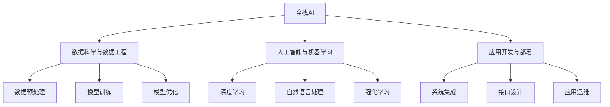

                 

# 全栈AI人才培养：Lepton AI的教育计划

> 关键词：AI教育,Lepton AI,全栈开发,教育资源,技术培训,应用实践

## 1. 背景介绍

### 1.1 问题由来
人工智能（AI）的快速发展正在改变各行各业，促使企业加速数字化转型。对于学生而言，掌握全栈AI技能已经成为就业市场中的热门需求。传统的课程体系往往局限于单一领域的知识，无法满足学生全方位发展的需求。Lepton AI的教育计划应运而生，旨在通过跨学科的整合，打造全面、前沿的全栈AI人才。

### 1.2 问题核心关键点
Lepton AI的教育计划涵盖从基础理论到实践操作的多个层面，旨在为学生提供一站式AI教育。以下是核心关键点：
- **跨学科融合**：融合计算机科学、统计学、认知科学、工程学等学科，构建全面立体的知识体系。
- **实践导向**：结合业界真实项目，提供丰富的项目实践机会，提升学生实操能力。
- **前沿探索**：引入最新研究动态和技术进展，使学生在知识更新迭代方面保持领先。
- **终身学习**：倡导终身学习的理念，鼓励学生不断自我更新和提升。

### 1.3 问题研究意义
Lepton AI的教育计划有助于培养出符合行业需求的AI专业人才，缩短企业的人才培育周期，加速AI技术在各领域的落地应用。对学生而言，能够提供完整的AI技能培训，提升其就业竞争力；对社会而言，能够促进AI技术的普及和应用，推动产业创新发展。

## 2. 核心概念与联系

### 2.1 核心概念概述

Lepton AI的教育计划涉及以下核心概念：

- **全栈AI**：涵盖从数据预处理、模型构建、训练优化、模型部署到应用评估的全链条技能。
- **Lepton AI平台**：由Lepton AI设计开发的AI开发平台，提供一站式编程环境和工具链。
- **人工智能与机器学习**：Lepton AI的教育计划重点涵盖的AI分支，包括机器学习、深度学习、自然语言处理等。
- **数据科学与数据工程**：数据驱动的AI训练与优化过程中不可或缺的环节，包括数据收集、清洗、存储与处理。
- **应用开发与部署**：将AI模型应用于实际问题的解决方案，包括接口设计、系统集成与运维。

这些概念相互关联，共同构成了Lepton AI的教育框架。

### 2.2 核心概念原理和架构的 Mermaid 流程图



这个流程图展示了全栈AI的关键组成部分及其相互关系。

## 3. 核心算法原理 & 具体操作步骤

### 3.1 算法原理概述
Lepton AI的教育计划中，核心的算法原理包括以下几个方面：

- **数据驱动**：使用数据科学方法进行数据预处理、特征工程和模型评估，确保数据质量和模型性能。
- **模型构建**：基于机器学习与深度学习算法构建预测模型，涵盖线性回归、决策树、神经网络等。
- **模型优化**：通过梯度下降等优化算法调整模型参数，提升模型泛化能力和鲁棒性。
- **模型部署**：将训练好的模型集成到实际应用中，确保模型在生产环境中的稳定性与高效性。

### 3.2 算法步骤详解

**Step 1: 数据预处理**

- **数据采集**：使用API接口或爬虫技术收集数据。
- **数据清洗**：去除噪声和异常值，填补缺失值，处理缺失和重复数据。
- **特征工程**：提取有意义的特征，并进行归一化、降维等处理。
- **数据划分**：将数据划分为训练集、验证集和测试集，确保模型在未知数据上的泛化能力。

**Step 2: 模型训练与优化**

- **选择模型**：根据任务需求选择合适的模型结构，如线性回归、逻辑回归、神经网络等。
- **模型训练**：使用训练集数据对模型进行训练，调整超参数如学习率、迭代次数等。
- **模型评估**：在验证集上评估模型性能，调整模型架构和参数。
- **模型优化**：通过正则化、dropout等技术提升模型泛化能力。

**Step 3: 模型部署与维护**

- **模型集成**：将训练好的模型集成到应用系统中，提供API接口供外部调用。
- **系统部署**：部署模型到生产环境，确保模型的高可用性和实时响应性。
- **性能监控**：使用日志和监控工具实时监控模型性能，发现并解决潜在问题。
- **系统维护**：根据实际应用场景，定期更新模型和系统，保证系统稳定运行。

### 3.3 算法优缺点

**优点**：

- **全面覆盖**：涵盖从数据预处理到模型部署的完整流程，确保学生在各个环节都具备核心技能。
- **实战导向**：通过与Lepton AI平台结合，提供丰富的实践机会，使学生能够快速上手业界应用。
- **前沿科技**：引入最新研究和技术进展，确保学生能够掌握AI领域的最新动态。
- **终身学习**：倡导终身学习的理念，使学生能够不断更新知识和技能，保持竞争力。

**缺点**：

- **知识量大**：涵盖多个领域的知识，需要学生具备较强的自学能力和时间管理能力。
- **技术栈多样**：涉及多种编程语言和工具，学生需要掌握和切换不同的技术栈。
- **实践成本高**：需要较高配置的硬件资源和丰富的数据资源，有一定成本投入。
- **行业适配性**：课程内容和工具可能与某些特定行业的实践有所差异，需要进一步适配。

### 3.4 算法应用领域

Lepton AI的教育计划涵盖的算法和技术广泛应用于以下几个领域：

- **金融科技**：使用AI进行风险管理、客户行为分析、交易策略优化等。
- **医疗健康**：应用机器学习和深度学习算法进行疾病预测、图像诊断、基因分析等。
- **智能制造**：利用AI优化生产流程、提高设备利用率、降低能耗等。
- **智能交通**：实现智能导航、无人驾驶、交通流量优化等应用。
- **电商零售**：通过AI进行商品推荐、价格优化、库存管理等。

这些应用领域充分展示了AI技术的广泛应用前景，Lepton AI的教育计划旨在培养能够跨行业应用的AI人才。

## 4. 数学模型和公式 & 详细讲解 & 举例说明

### 4.1 数学模型构建

Lepton AI的教育计划中，数学模型构建主要涉及以下几个方面：

- **回归模型**：使用线性回归、逻辑回归等方法构建预测模型。
- **分类模型**：使用决策树、随机森林、支持向量机等算法进行分类。
- **深度学习模型**：使用神经网络、卷积神经网络、循环神经网络等进行复杂预测。

### 4.2 公式推导过程

**线性回归模型**：

$$
y = \theta_0 + \theta_1x_1 + \theta_2x_2 + \cdots + \theta_nx_n
$$

其中，$y$ 为预测值，$\theta_0$ 为截距，$\theta_i$ 为第 $i$ 个特征的系数。

**决策树模型**：

- **特征选择**：从数据集中选择具有最大信息增益的特征。
- **划分节点**：根据选择的特征，将数据集划分为多个子集。
- **递归处理**：对每个子集重复上述过程，直到满足停止条件。

**神经网络模型**：

- **前向传播**：将输入数据通过多个神经层进行计算，得到输出结果。
- **反向传播**：计算输出结果与真实值之间的误差，反向传播误差，调整网络参数。
- **损失函数**：使用均方误差、交叉熵等损失函数评估模型性能。

### 4.3 案例分析与讲解

以房价预测为例，展示Lepton AI的教育计划中数学模型的构建和应用。

**数据预处理**：

- **数据采集**：从房地产网站收集房价数据。
- **数据清洗**：去除噪声和异常值，处理缺失值。
- **特征工程**：提取房屋面积、地理位置、交通便利性等特征，进行归一化处理。

**模型构建**：

- **选择模型**：选择线性回归模型。
- **模型训练**：使用训练集数据对模型进行训练，调整学习率等超参数。
- **模型评估**：在验证集上评估模型性能，调整模型参数。

**模型部署**：

- **集成API**：将训练好的模型集成到Web服务中，提供API接口。
- **部署服务器**：将模型部署到服务器上，确保高可用性和实时响应性。
- **性能监控**：使用日志和监控工具实时监控模型性能，发现并解决潜在问题。

## 5. 项目实践：代码实例和详细解释说明

### 5.1 开发环境搭建

Lepton AI的教育计划提供了一个全面的开发环境，包括：

- **Lepton AI平台**：提供一键安装和使用的开发环境。
- **云端资源**：使用谷歌云、AWS等云平台，提供丰富的计算资源。
- **容器化技术**：使用Docker、Kubernetes等容器化技术，实现应用部署和运维。

### 5.2 源代码详细实现

以下是一个使用Python实现线性回归模型的示例代码：

```python
import pandas as pd
import numpy as np
from sklearn.linear_model import LinearRegression

# 加载数据
data = pd.read_csv('house_prices.csv')

# 数据预处理
X = data.drop('price', axis=1)
y = data['price']

# 标准化数据
scaler = StandardScaler()
X = scaler.fit_transform(X)

# 模型训练
model = LinearRegression()
model.fit(X, y)

# 模型评估
train_score = model.score(X_train, y_train)
test_score = model.score(X_test, y_test)

# 模型部署
# 将模型封装为API接口，供外部调用
```

### 5.3 代码解读与分析

**数据预处理**：

- `pandas` 用于数据加载和处理。
- `numpy` 用于数值计算。
- `StandardScaler` 用于数据标准化。

**模型训练**：

- `LinearRegression` 是Scikit-Learn库中的线性回归模型。
- `fit` 方法用于模型训练。

**模型评估**：

- `score` 方法用于评估模型性能，返回R^2分数。

**模型部署**：

- 模型部署的具体实现依赖于具体的部署平台和工具，如Lepton AI平台、Flask等。

### 5.4 运行结果展示

运行上述代码后，可以得到训练集和测试集上的R^2分数，以及模型预测的房价值。

## 6. 实际应用场景

### 6.1 智能客服系统

智能客服系统是一个典型的应用场景，Lepton AI的教育计划通过全栈AI技能培训，能够培养出能够设计、构建和维护智能客服系统的工程师。

**数据预处理**：

- 收集用户对话数据，进行清洗和特征工程。
- 将对话数据划分为训练集、验证集和测试集。

**模型训练**：

- 选择深度学习模型，如LSTM或Transformer。
- 使用训练集数据对模型进行训练，调整超参数。
- 在验证集上评估模型性能，调整模型参数。

**模型部署**：

- 将训练好的模型集成到智能客服系统中。
- 部署到云端或本地服务器，确保高可用性和实时响应性。
- 实时监控系统性能，及时发现和解决潜在问题。

### 6.2 金融风险管理

金融风险管理是另一个重要的应用场景，Lepton AI的教育计划通过全栈AI技能培训，能够培养出能够构建金融风险管理系统的工程师。

**数据预处理**：

- 收集金融交易数据，进行清洗和特征工程。
- 将数据划分为训练集、验证集和测试集。

**模型训练**：

- 选择机器学习模型，如随机森林或XGBoost。
- 使用训练集数据对模型进行训练，调整超参数。
- 在验证集上评估模型性能，调整模型参数。

**模型部署**：

- 将训练好的模型集成到金融风险管理系统中。
- 部署到云端或本地服务器，确保高可用性和实时响应性。
- 实时监控系统性能，及时发现和解决潜在问题。

### 6.3 医疗图像分析

医疗图像分析是AI在医疗健康领域的重要应用之一，Lepton AI的教育计划通过全栈AI技能培训，能够培养出能够构建医疗图像分析系统的工程师。

**数据预处理**：

- 收集医疗图像数据，进行清洗和特征工程。
- 将数据划分为训练集、验证集和测试集。

**模型训练**：

- 选择深度学习模型，如卷积神经网络。
- 使用训练集数据对模型进行训练，调整超参数。
- 在验证集上评估模型性能，调整模型参数。

**模型部署**：

- 将训练好的模型集成到医疗图像分析系统中。
- 部署到云端或本地服务器，确保高可用性和实时响应性。
- 实时监控系统性能，及时发现和解决潜在问题。

### 6.4 未来应用展望

Lepton AI的教育计划面向未来，不仅涵盖当前的AI技术，还积极探索未来的前沿技术。

**可解释AI**：

- 研究如何通过模型解释技术，增强AI模型的可解释性。
- 设计用户友好的界面，让用户能够理解AI模型的决策过程。

**边缘计算**：

- 研究如何在边缘设备上进行AI模型部署，提高计算效率和响应速度。
- 实现实时数据处理和分析，提升用户体验。

**多模态AI**：

- 研究如何将视觉、听觉、文本等多种模态信息融合，提升AI模型的感知能力。
- 应用于智能家居、智能交通等领域，实现更全面的智能服务。

**联邦学习**：

- 研究如何在不共享数据的情况下，进行分布式模型训练。
- 应用于医疗数据隐私保护、金融风险评估等领域，提高数据安全性和模型鲁棒性。

## 7. 工具和资源推荐

### 7.1 学习资源推荐

以下是Lepton AI推荐的学习资源：

- **Lepton AI官方文档**：提供完整的AI开发指南和教程，涵盖从基础到高级的内容。
- **Coursera AI课程**：提供系统的AI知识体系，涵盖数据科学、机器学习、深度学习等方向。
- **Kaggle竞赛**：参与实际的数据科学竞赛，提升实战经验。
- **GitHub开源项目**：参与开源项目，学习最佳实践和代码规范。

### 7.2 开发工具推荐

以下是Lepton AI推荐的开发工具：

- **Lepton AI平台**：提供一站式编程环境和工具链。
- **Jupyter Notebook**：提供交互式编程环境，方便调试和展示代码。
- **TensorFlow**：提供灵活的深度学习框架，支持多种模型和算法。
- **PyTorch**：提供动态计算图的深度学习框架，易于进行模型调试和优化。
- **Scikit-Learn**：提供简单易用的机器学习库，支持多种算法和模型。

### 7.3 相关论文推荐

以下是Lepton AI推荐的相关论文：

- **TensorFlow论文**：介绍TensorFlow框架的设计和实现。
- **PyTorch论文**：介绍PyTorch框架的设计和实现。
- **Scikit-Learn论文**：介绍Scikit-Learn库的设计和实现。
- **深度学习论文**：介绍深度学习算法和模型，如CNN、RNN等。
- **强化学习论文**：介绍强化学习算法和模型，如Q-learning、DQN等。

## 8. 总结：未来发展趋势与挑战

### 8.1 研究成果总结

Lepton AI的教育计划致力于构建全栈AI人才，涵盖从数据预处理到模型部署的完整流程。通过系统的课程设置和丰富的实践机会，使学生具备全面的AI技能。

### 8.2 未来发展趋势

未来，AI技术将进一步普及，行业需求将更加多样化。Lepton AI的教育计划将紧跟技术趋势，不断更新课程内容，提升学生就业竞争力。

### 8.3 面临的挑战

尽管Lepton AI的教育计划有着广阔的前景，但在实施过程中仍面临诸多挑战：

- **师资力量**：优秀的师资力量是保证教育质量的关键。如何吸引和培养一批优秀的AI教师，需要更多的投入和支持。
- **资源配置**：AI教育需要大量的硬件和软件资源，如何合理配置资源，保证教学质量，需要更多的投入和规划。
- **课程设计**：AI技术发展迅速，课程内容需要不断更新，如何设计灵活的课程体系，适应不同层次的学生需求，需要更多的研究和探索。

### 8.4 研究展望

未来，Lepton AI的教育计划将继续聚焦于以下方向：

- **跨学科融合**：进一步融合计算机科学、统计学、认知科学等学科，构建更加全面立体的知识体系。
- **实战导向**：提供更多实战机会，提升学生的实操能力和创新能力。
- **前沿科技**：引入更多前沿技术，如可解释AI、边缘计算、多模态AI等，提升学生的技术水平。
- **终身学习**：倡导终身学习的理念，为学生提供更多的学习资源和机会，帮助其不断更新知识和技能。

## 9. 附录：常见问题与解答

**Q1：Lepton AI的教育计划如何帮助学生全面掌握AI技能？**

A: Lepton AI的教育计划通过跨学科融合、实战导向和前沿科技的学习内容，帮助学生全面掌握AI技能。课程涵盖数据科学、机器学习、深度学习、自然语言处理等多个领域，涵盖从数据预处理到模型部署的完整流程。学生通过项目实践，能够将理论知识转化为实际技能，提升实操能力。

**Q2：Lepton AI的教育计划需要投入多少资源？**

A: Lepton AI的教育计划需要一定的资源投入，包括高质量的师资力量、高性能的计算资源、灵活的课程体系等。具体资源投入需要根据学校的实际情况和市场需求进行调整。

**Q3：Lepton AI的教育计划如何适应不同层次的学生需求？**

A: Lepton AI的教育计划设计灵活的课程体系，涵盖从基础到高级的内容，适应不同层次的学生需求。通过项目实践，学生能够根据自身兴趣和需求，选择适合的课程和实践项目，提升学习效果。

**Q4：Lepton AI的教育计划如何保证师资力量？**

A: Lepton AI的教育计划通过吸引和培养优秀的AI教师，保证师资力量。学校可以与AI领域的专家和研究机构合作，引进一批高素质的AI教师。同时，通过定期培训和交流，提升教师的教学水平和研究能力。

**Q5：Lepton AI的教育计划如何提高学生的实战能力？**

A: Lepton AI的教育计划通过与Lepton AI平台结合，提供丰富的实战机会，提升学生的实战能力。学生可以在实际项目中应用所学知识，解决实际问题，提升解决问题的能力和创新能力。

---

作者：禅与计算机程序设计艺术 / Zen and the Art of Computer Programming

