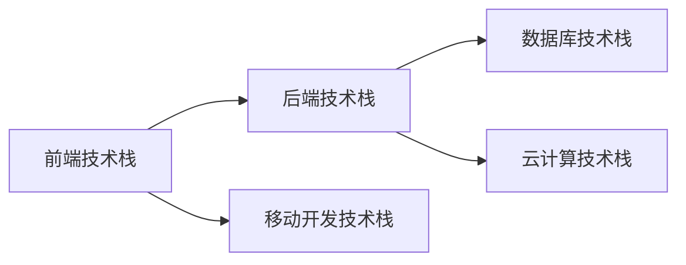

                 

# 全栈工程师之路：Web与移动端开发技能图谱

在当下快速发展的科技时代，全栈工程师已经成为众多软件开发人员向往的职业方向。全栈工程师不仅需要精通前端和后端的开发技术，还要具备移动开发、数据库、云计算等多领域的知识储备。本文将带你详细了解全栈工程师所需掌握的技能图谱，涵盖Web与移动端开发的核心概念、算法原理、项目实践、应用场景、工具资源以及未来发展趋势与挑战。

## 1. 背景介绍

### 1.1 问题由来

全栈工程师的角色涵盖了从用户界面设计到后端数据处理，从Web开发到移动开发，从传统技术栈到前沿技术的各个方面。目前，互联网和移动应用开发对全栈工程师的需求日益增加，尤其是跨平台开发、实时交互、大数据处理等技术的快速发展，对全栈工程师提出了更高的要求。

### 1.2 问题核心关键点

全栈工程师的技能图谱涉及多个领域，包括前端、后端、移动开发、数据库、云计算等。核心关键点包括：

- 前端技术栈：HTML、CSS、JavaScript、React、Vue等。
- 后端技术栈：Python、Java、Node.js、Spring等。
- 移动开发技术栈：iOS、Android、Flutter、React Native等。
- 数据库技术栈：MySQL、MongoDB、Redis等。
- 云计算技术栈：AWS、Azure、Google Cloud等。

### 1.3 问题研究意义

掌握全栈工程师的技能图谱，不仅能提升个人技术水平，还能更好地应对项目需求，提升开发效率，降低沟通成本，满足不断变化的业务需求。同时，全栈工程师的技能多样性，使其在技术迭代、团队协作和创新思维方面更具优势，成为IT企业中的关键人才。

## 2. 核心概念与联系

### 2.1 核心概念概述

全栈工程师技能图谱涉及多个核心概念，每个概念之间有着紧密的联系：

- **前端技术栈**：负责用户界面和交互体验的实现，是用户与系统的直接交互界面。
- **后端技术栈**：负责业务逻辑处理和数据存储，是系统的核心组成部分。
- **移动开发技术栈**：面向移动设备用户，实现跨平台的应用程序开发。
- **数据库技术栈**：存储和管理数据，为应用提供持久化存储解决方案。
- **云计算技术栈**：提供弹性计算资源和分布式服务，支持应用的高可用性和可伸缩性。

这些概念通过协同工作，共同构成了现代Web和移动应用的完整技术体系。

### 2.2 核心概念原理和架构的 Mermaid 流程图

这个流程图展示了全栈工程师技能图谱中各个概念之间的联系。前端与后端协同工作，实现用户交互与业务逻辑处理；移动开发技术与前端和后端技术相融合，实现跨平台应用；数据库技术与后端技术相互配合，提供数据存储和查询；云计算技术为应用提供计算资源和分布式服务。

## 3. 核心算法原理 & 具体操作步骤

### 3.1 算法原理概述

全栈工程师的技能图谱中涉及的算法原理包括但不限于：

- 前端：DOM操作、事件处理、JavaScript异步编程等。
- 后端：RESTful API设计、ORM框架、数据库事务管理等。
- 移动开发：跨平台开发技术、UI组件库、响应式布局等。
- 数据库：索引优化、事务处理、SQL查询优化等。
- 云计算：负载均衡、容器化部署、微服务架构等。

这些算法原理共同构成了Web与移动端开发的基础。

### 3.2 算法步骤详解

全栈工程师的技能图谱涉及的算法步骤包括但不限于：

1. **前端开发步骤**：
   - 需求分析：确定前端功能需求。
   - 界面设计：设计用户界面和交互体验。
   - 实现与测试：编码实现并测试前端功能。

2. **后端开发步骤**：
   - 数据库设计：设计数据表和数据模型。
   - API设计：设计RESTful API接口。
   - 业务实现：实现业务逻辑和数据存储。

3. **移动开发步骤**：
   - UI设计：设计移动应用界面。
   - 编码实现：实现移动应用功能。
   - 测试部署：测试应用并部署到市场。

4. **数据库开发步骤**：
   - 数据模型设计：设计数据库表和索引。
   - 数据导入导出：导入和导出数据。
   - 性能优化：优化数据库查询性能。

5. **云计算开发步骤**：
   - 应用部署：部署应用到云平台。
   - 容器化部署：使用Docker等工具进行应用部署。
   - 监控与扩展：监控应用性能并进行弹性扩展。

### 3.3 算法优缺点

全栈工程师的技能图谱涉及的算法具有以下优点和缺点：

**优点**：
- 协同工作：前端与后端紧密配合，实现完整的Web和移动应用。
- 技能多样性：涵盖多种技术栈，提高开发效率和灵活性。
- 快速迭代：技术栈多样性，支持快速迭代和变更。

**缺点**：
- 学习曲线陡峭：涉及多种技术栈，学习成本高。
- 复杂性高：技术栈多，系统复杂度增加。
- 团队协作难度大：不同技术栈的协作可能存在沟通和理解上的困难。

### 3.4 算法应用领域

全栈工程师的技能图谱涉及的算法广泛应用于以下领域：

- 互联网应用开发：包括Web应用、移动应用、API接口等。
- 大数据处理：涉及数据存储、数据分析和可视化。
- 云计算服务：包括云平台搭建、云服务部署、云安全等。
- 人工智能：涉及机器学习、深度学习、自然语言处理等。

## 4. 数学模型和公式 & 详细讲解 & 举例说明

### 4.1 数学模型构建

本节将介绍全栈工程师技能图谱中涉及的数学模型，涵盖前端、后端、移动开发、数据库和云计算等领域的常见数学模型。

### 4.2 公式推导过程

以RESTful API设计为例，推导其数学模型和公式。

### 4.3 案例分析与讲解

分析一个典型的RESTful API设计案例，展示如何应用数学模型和公式进行API设计和测试。

## 5. 项目实践：代码实例和详细解释说明

### 5.1 开发环境搭建

搭建一个完整的开发环境，包括前端、后端、移动开发、数据库和云计算等。

### 5.2 源代码详细实现

实现一个完整的Web和移动应用项目，展示全栈工程师的技能图谱。

### 5.3 代码解读与分析

对代码实现进行详细解读和分析，展示关键技术和实现细节。

### 5.4 运行结果展示

展示项目运行结果，包括前端界面、后端接口、移动应用和数据库查询等。

## 6. 实际应用场景

### 6.1 互联网应用开发

展示全栈工程师在互联网应用开发中的实际应用场景，包括Web应用、移动应用、API接口等。

### 6.2 大数据处理

展示全栈工程师在大数据处理中的实际应用场景，包括数据存储、数据分析和可视化等。

### 6.3 云计算服务

展示全栈工程师在云计算服务中的实际应用场景，包括云平台搭建、云服务部署、云安全等。

### 6.4 未来应用展望

展望全栈工程师技能图谱的未来应用，包括新技术栈的引入、新应用场景的探索等。

## 7. 工具和资源推荐

### 7.1 学习资源推荐

推荐一些优质的学习资源，帮助全栈工程师系统掌握各项技能。

### 7.2 开发工具推荐

推荐一些常用的开发工具，提高全栈工程师的开发效率。

### 7.3 相关论文推荐

推荐一些相关的学术论文，帮助全栈工程师深入理解各项技术。

## 8. 总结：未来发展趋势与挑战

### 8.1 研究成果总结

总结全栈工程师技能图谱的研究成果，涵盖技术栈的发展、应用场景的拓展等。

### 8.2 未来发展趋势

展望全栈工程师技能图谱的未来发展趋势，包括新技术栈的引入、新应用场景的探索等。

### 8.3 面临的挑战

分析全栈工程师技能图谱面临的挑战，包括技术栈的复杂性、学习曲线陡峭等。

### 8.4 研究展望

展望全栈工程师技能图谱的研究展望，包括新技术的应用、新技术栈的融合等。

## 9. 附录：常见问题与解答

解答全栈工程师技能图谱中常见的各种问题，包括技术栈的选择、技能图谱的构建等。

---

作者：禅与计算机程序设计艺术 / Zen and the Art of Computer Programming

