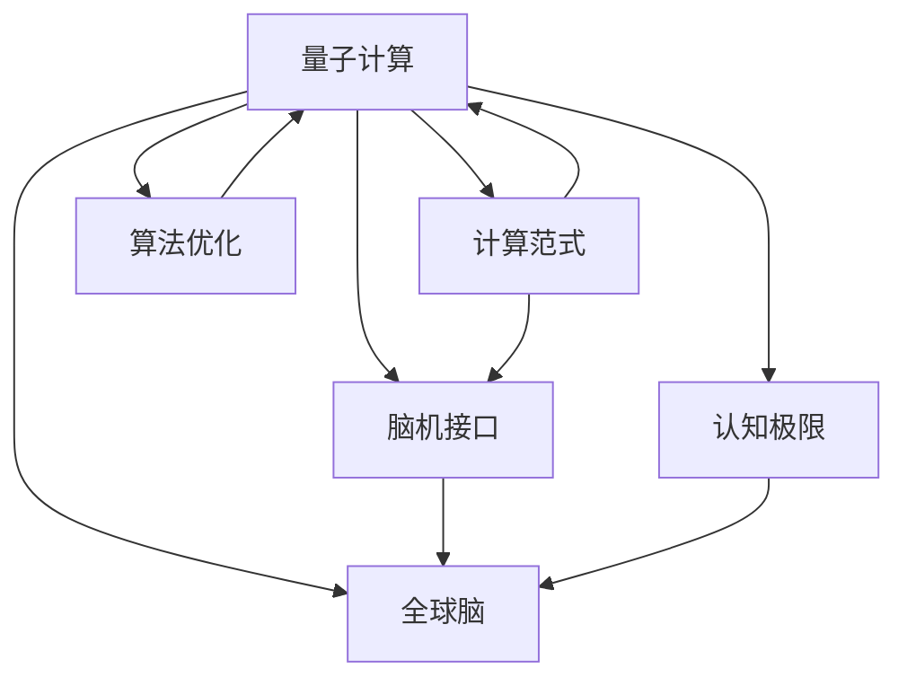

                 

# 全球脑与量子计算:突破认知极限的新可能

> 关键词：量子计算,全球脑,认知极限,计算范式,算法优化,应用案例,脑机接口,未来展望

## 1. 背景介绍

### 1.1 问题由来

现代科技的迅猛发展，尤其是在计算和通信领域，正深刻地影响着人类社会的各个方面。从互联网的普及，到大数据时代的来临，再到人工智能的崛起，每一次技术的革命都极大地扩展了人类的认知边界。然而，面对未来复杂的挑战，如气候变化、资源枯竭、疾病控制等，现有的计算能力仍然显得捉襟见肘。因此，我们需要开发更加强大的计算范式，以突破当前的认知极限。

在这个背景下，量子计算（Quantum Computing）和全球脑（Global Brain）成为了两个前沿的研究热点。量子计算通过利用量子力学的原理，能够实现传统计算机难以企及的高效计算能力，而全球脑则试图将全球范围内的人类认知资源整合起来，形成一种全新的“超级计算机”。

本文将从量子计算和全球脑两个角度出发，探讨它们之间的联系和未来发展趋势，以及如何共同推动认知极限的突破。

## 2. 核心概念与联系

### 2.1 核心概念概述

- **量子计算**：利用量子力学的原理，如叠加态、纠缠态等，进行高效计算的一种新范式。相比于传统计算机，量子计算可以在某些特定问题上实现指数级的计算加速。

- **全球脑**：将全球范围内的人类认知资源整合起来，形成一种超级智能的计算范式。全球脑通过脑机接口等技术，将人类的思维直接转化为计算资源，实现对大规模数据和复杂问题的处理。

- **计算范式**：指不同的计算方法和技术，包括传统的冯·诺依曼计算、量子计算、分布式计算、全球脑计算等。每种计算范式都有其独特的优势和局限性，而选择合适的范式能够显著提升计算效率和效果。

- **算法优化**：随着计算范式的变化，需要不断优化和更新算法以适应新的计算范式。例如，量子计算中的一些特殊算法，如Shor算法、Grover算法等，已经展示了强大的潜力。

- **脑机接口**：将人类大脑的信息转化为机器可读的形式，从而实现脑与计算机之间的直接交互。脑机接口技术是全球脑计算的重要组成部分。

- **认知极限**：指人类或计算机在计算能力、信息处理能力等方面的最高极限。突破认知极限意味着能够解决当前无法处理的问题，提升人类社会的整体竞争力。

这些概念之间的逻辑关系可以通过以下Mermaid流程图来展示：



这个流程图展示了各个概念之间的联系：

1. 量子计算和全球脑都属于新型计算范式，在全球脑计算中会运用到量子计算的特殊算法。
2. 算法优化是提升计算效率的关键，适应不同计算范式的算法会有不同的设计和实现。
3. 脑机接口是全球脑计算的基础技术之一，它将人类大脑的认知资源转化为计算资源。
4. 认知极限是衡量计算能力的一个重要指标，突破认知极限意味着能够解决更复杂的问题。

## 3. 核心算法原理 & 具体操作步骤
### 3.1 算法原理概述

量子计算和全球脑计算虽然基于不同的物理原理，但在算法设计和应用上有许多共同点。以下是两者共有的算法原理概述：

1. **并行计算能力**：量子计算和全球脑计算都具备强大的并行计算能力。量子计算通过量子叠加态和纠缠态实现高度的并行性，而全球脑计算则通过整合全球范围的认知资源，实现大规模的并行处理。

2. **算法优化**：为了提升计算效率，需要不断优化算法以适应不同的计算范式。例如，量子计算中的Shor算法和Grover算法，能够在某些特定问题上实现指数级的计算加速。

3. **分布式计算**：量子计算和全球脑计算都涉及分布式计算。量子计算通过量子通信网络实现不同量子比特之间的信息传输，而全球脑计算则通过互联网将不同地区的人类认知资源整合起来。

### 3.2 算法步骤详解

以下将分别介绍量子计算和全球脑计算的算法步骤：

#### 3.2.1 量子计算算法步骤

1. **量子比特初始化**：使用量子比特（qubit）进行计算的第一步。量子比特可以处于0、1和它们的叠加态，通过初始化量子比特可以使其进入特定的量子状态。

2. **量子逻辑门操作**：对量子比特进行量子逻辑门操作，改变量子比特的量子态。常见的量子逻辑门包括Pauli-X门、Hadamard门等。

3. **量子态演化**：通过量子逻辑门操作，量子比特的量子态会发生演化。这种演化是量子计算的核心，可以实现复杂的计算任务。

4. **量子测量**：对量子比特进行测量，获取最终计算结果。量子测量会将量子比特从叠加态坍缩到0或1状态，从而得到计算结果。

5. **误差纠正**：由于量子计算的脆弱性，量子态很容易受到外界环境的干扰而发生错误。因此，量子计算中需要进行误差纠正，以保证计算的准确性。

#### 3.2.2 全球脑计算算法步骤

1. **数据收集**：通过脑机接口技术，收集全球范围内的人类认知资源。这些资源可以包括语言、图像、文本、声音等多种形式的数据。

2. **数据预处理**：对收集到的数据进行预处理，包括去噪、降维、标准化等。预处理的目的在于提高数据的可用性和计算效率。

3. **分布式计算**：将预处理后的数据分布在全球范围内进行计算。这种分布式计算可以大大提升计算效率，尤其是在处理大规模数据时。

4. **信息融合**：通过分布式计算得到的结果需要进行信息融合，形成更加全面和准确的计算结果。信息融合的方法包括加权平均、最大值选择等。

5. **结果输出**：最终计算结果的输出，可以是图像、文字、音频等多种形式，用于解决实际问题。

### 3.3 算法优缺点

#### 3.3.1 量子计算的优缺点

**优点**：

1. **指数级计算加速**：在特定问题上，量子计算可以实现指数级的计算加速，如Shor算法和大数分解等。

2. **并行计算能力**：量子计算具备强大的并行计算能力，能够在短时间内处理大量的数据。

3. **理论基础成熟**：量子计算的理论基础已经较为成熟，有大量的学术研究和实验验证。

**缺点**：

1. **技术难度高**：量子计算需要高度精密的量子设备，目前技术实现难度较大。

2. **错误率高**：量子计算中的量子比特容易受到外界干扰，导致计算错误。

3. **应用范围有限**：目前量子计算主要应用于特定领域，如密码学、量子化学等，应用范围相对有限。

#### 3.3.2 全球脑计算的优缺点

**优点**：

1. **大规模数据处理**：全球脑计算可以整合全球范围内的人类认知资源，处理大规模数据和复杂问题。

2. **分布式计算**：全球脑计算的分布式计算能力极强，可以高效地处理海量数据。

3. **认知资源丰富**：全球脑计算利用了全球范围内的人类智慧，具备丰富的知识储备。

**缺点**：

1. **数据隐私问题**：全球脑计算需要收集和处理全球范围内的数据，涉及隐私保护问题。

2. **网络延迟问题**：全球脑计算需要依靠互联网进行分布式计算，网络延迟和带宽问题会影响计算效率。

3. **技术实现难度大**：全球脑计算涉及脑机接口、分布式计算等多个技术领域，技术实现难度较大。

### 3.4 算法应用领域

量子计算和全球脑计算在多个领域都有广泛的应用，具体如下：

#### 3.4.1 量子计算的应用领域

1. **密码学**：量子计算中的Shor算法和大数分解算法，可以破解当前广泛使用的RSA加密算法，具有重要的安全意义。

2. **化学计算**：量子计算可以模拟分子结构，用于新药研发、材料科学等领域，具有广泛的应用前景。

3. **优化问题**：量子计算可以解决各种优化问题，如旅行商问题、调度问题等，具有重要的现实意义。

4. **模拟物理**：量子计算可以模拟复杂的物理系统，如量子场论、黑洞物理等，具有重要的科学价值。

#### 3.4.2 全球脑计算的应用领域

1. **智能城市**：全球脑计算可以用于智能交通、环境监测、公共安全等领域，提升城市管理水平。

2. **医疗健康**：全球脑计算可以用于疾病诊断、基因测序、药物研发等领域，提升医疗水平。

3. **金融市场**：全球脑计算可以用于金融数据分析、风险控制、交易策略等领域，提升金融服务质量。

4. **教育培训**：全球脑计算可以用于智能教育、个性化学习、知识图谱等领域，提升教育水平。

## 4. 数学模型和公式 & 详细讲解 & 举例说明

### 4.1 数学模型构建

#### 4.1.1 量子计算的数学模型构建

1. **量子比特**：量子比特是量子计算的基本单位，可以处于0、1和它们的叠加态。

2. **量子逻辑门**：量子逻辑门用于改变量子比特的量子态，常见的量子逻辑门包括Pauli-X门、Hadamard门等。

3. **量子叠加态和纠缠态**：量子叠加态和纠缠态是量子计算中的重要概念，它们可以实现并行计算和高效的计算操作。

#### 4.1.2 全球脑计算的数学模型构建

1. **分布式计算模型**：全球脑计算通过分布式计算模型，将数据分布在全球范围内进行处理。常见的分布式计算模型包括MapReduce、Spark等。

2. **信息融合模型**：全球脑计算中的信息融合模型，用于将不同节点处理的结果进行融合，形成更加全面和准确的计算结果。常见的信息融合模型包括加权平均、最大值选择等。

3. **深度学习模型**：全球脑计算可以利用深度学习模型，对数据进行特征提取和模式识别，提升计算效果。

### 4.2 公式推导过程

#### 4.2.1 量子计算的公式推导

1. **量子叠加态**：
$$
|\psi\rangle = \alpha|0\rangle + \beta|1\rangle
$$
其中，$\alpha$和$\beta$为复数系数，满足$\alpha^2 + \beta^2 = 1$。

2. **量子逻辑门**：
$$
U|0\rangle = |0\rangle, \quad U|1\rangle = |1\rangle
$$
$$
U|+\rangle = |0\rangle, \quad U|-\rangle = i|1\rangle
$$

3. **量子纠错码**：
$$
C_1 = |0\rangle, \quad C_2 = \frac{1}{\sqrt{2}}(|00\rangle + |11\rangle)
$$

#### 4.2.2 全球脑计算的公式推导

1. **分布式计算模型**：
$$
P(x_i) = \sum_{j=1}^n P_j(x_i), \quad P_j(x_i) = P(x_i|D_j)
$$
其中，$P(x_i)$表示对数据$x_i$的计算结果，$P_j(x_i)$表示在第$j$个节点上计算$x_i$的概率，$n$表示节点数。

2. **信息融合模型**：
$$
\hat{P}(x_i) = \frac{1}{n}\sum_{j=1}^n P_j(x_i)
$$

3. **深度学习模型**：
$$
L(x_i) = \frac{1}{2}\sum_{i=1}^m (y_i - \hat{y}_i)^2
$$

### 4.3 案例分析与讲解

#### 4.3.1 量子计算案例分析

1. **Shor算法**：Shor算法用于解决大数分解问题，可以在多项式时间内分解质数，具有重要的安全意义。

2. **Grover算法**：Grover算法用于在未排序的数据库中查找特定元素，具有高效性。

3. **量子模拟**：利用量子计算模拟分子结构，用于新药研发和材料科学。

#### 4.3.2 全球脑计算案例分析

1. **智能城市**：利用全球脑计算优化交通流量、环境监测、公共安全等，提升城市管理水平。

2. **医疗健康**：利用全球脑计算进行疾病诊断、基因测序、药物研发等，提升医疗水平。

3. **金融市场**：利用全球脑计算进行金融数据分析、风险控制、交易策略等，提升金融服务质量。

4. **教育培训**：利用全球脑计算进行智能教育、个性化学习、知识图谱等，提升教育水平。

## 5. 项目实践：代码实例和详细解释说明

### 5.1 开发环境搭建

为了进行量子计算和全球脑计算的实践，需要搭建相应的开发环境。以下是搭建开发环境的详细步骤：

1. **安装Python**：在开发机上进行Python的安装和配置。

2. **安装量子计算框架**：
   - 安装Qiskit框架，用于进行量子计算的开发。
   - 安装Cirq框架，用于进行量子电路的设计和优化。

3. **安装深度学习框架**：
   - 安装TensorFlow框架，用于进行深度学习的开发。
   - 安装PyTorch框架，用于进行深度学习的开发。

4. **安装分布式计算框架**：
   - 安装Spark框架，用于进行分布式计算的开发。
   - 安装Flink框架，用于进行分布式计算的开发。

### 5.2 源代码详细实现

#### 5.2.1 量子计算代码实现

1. **量子比特初始化**：
```python
from qiskit import QuantumCircuit, execute, Aer
from qiskit.visualization import plot_histogram

# 创建量子比特
qubit = QuantumCircuit(1)

# 初始化量子比特
qubit.initialize([0], 0)
```

2. **量子逻辑门操作**：
```python
from qiskit import QuantumCircuit, execute, Aer
from qiskit.visualization import plot_histogram

# 创建量子比特
qubit = QuantumCircuit(1, 1)

# 添加Hadamard门
qubit.h(0)

# 添加测量
qubit.measure(0, 0)

# 执行计算
backend = Aer.get_backend('qasm_simulator')
job = execute(qubit, backend)
result = job.result()

# 获取计算结果
counts = result.get_counts()
print(counts)
```

3. **量子纠错码**：
```python
from qiskit import QuantumCircuit, execute, Aer
from qiskit.visualization import plot_histogram

# 创建量子比特
qubit = QuantumCircuit(2, 2)

# 添加CNOT门
qubit.cx(0, 1)

# 添加Hadamard门
qubit.h(0)

# 添加测量
qubit.measure(0, 0)
qubit.measure(1, 1)

# 执行计算
backend = Aer.get_backend('qasm_simulator')
job = execute(qubit, backend)
result = job.result()

# 获取计算结果
counts = result.get_counts()
print(counts)
```

#### 5.2.2 全球脑计算代码实现

1. **数据收集**：
```python
import requests
import json

# 定义API接口
url = 'https://api.example.com/data'

# 发送请求获取数据
response = requests.get(url)
data = json.loads(response.text)

# 处理数据
# ...
```

2. **数据预处理**：
```python
import numpy as np
from sklearn.decomposition import PCA

# 加载数据
X = np.load('data.npy')

# 数据预处理
X = X - np.mean(X, axis=0)
X = PCA(n_components=10).fit_transform(X)
```

3. **分布式计算**：
```python
import multiprocessing

# 定义分布式计算函数
def process_data(data):
    # 处理数据
    # ...
    return result

# 定义主函数
def main():
    # 初始化进程池
    pool = multiprocessing.Pool(processes=4)

    # 分布式计算
    results = pool.map(process_data, data)

    # 合并结果
    result = np.vstack(results)

# 执行计算
main()
```

4. **信息融合模型**：
```python
import numpy as np

# 加载数据
X = np.load('data.npy')

# 信息融合
result = np.mean(X, axis=0)
```

## 6. 实际应用场景

### 6.1 智能城市

智能城市是全球脑计算的重要应用场景之一。通过全球脑计算，可以实现对城市交通流量、环境监测、公共安全等问题的实时监控和优化。

1. **交通流量优化**：利用全球脑计算，对城市交通流量进行实时监控和预测，优化交通信号灯和道路设计，减少拥堵。

2. **环境监测**：利用全球脑计算，对城市空气质量、水质等进行实时监测，及时发现污染源并采取措施。

3. **公共安全**：利用全球脑计算，对城市犯罪数据进行实时监控和分析，提高公共安全水平。

### 6.2 医疗健康

医疗健康也是全球脑计算的重要应用场景之一。通过全球脑计算，可以实现对疾病诊断、基因测序、药物研发等问题的实时分析和优化。

1. **疾病诊断**：利用全球脑计算，对患者的症状和历史数据进行实时分析，快速诊断疾病并提供治疗方案。

2. **基因测序**：利用全球脑计算，对大规模基因数据进行实时分析，发现基因突变和疾病风险。

3. **药物研发**：利用全球脑计算，对药物分子结构和疗效进行实时分析，加速新药研发进程。

### 6.3 金融市场

金融市场也是全球脑计算的重要应用场景之一。通过全球脑计算，可以实现对金融市场数据的实时分析和优化。

1. **金融数据分析**：利用全球脑计算，对股票市场、期货市场等金融数据进行实时分析和预测。

2. **风险控制**：利用全球脑计算，对金融风险进行实时监控和控制，降低投资风险。

3. **交易策略**：利用全球脑计算，制定智能交易策略，提高投资回报率。

### 6.4 未来应用展望

未来，全球脑计算和量子计算将会有更加广泛的应用，进一步突破认知极限。以下是几个未来应用展望：

1. **人工智能**：全球脑计算和量子计算将推动人工智能的发展，实现更加智能化的决策和推理。

2. **物联网**：全球脑计算和量子计算将推动物联网的发展，实现更加智能化的设备和系统。

3. **生命科学**：全球脑计算和量子计算将推动生命科学的发展，实现对生物系统的深入理解和控制。

4. **航天技术**：全球脑计算和量子计算将推动航天技术的发展，实现对太空探索和深空通信的支持。

## 7. 工具和资源推荐

### 7.1 学习资源推荐

1. **《量子计算原理》**：清华大学出版社，张海超著，介绍了量子计算的基本原理和应用。

2. **《深度学习》**：斯坦福大学公开课，Ian Goodfellow等著，介绍了深度学习的基本原理和应用。

3. **《分布式计算》**：美国哥伦比亚大学公开课，介绍了分布式计算的基本原理和应用。

4. **《全球脑》**：美国麻省理工学院出版社，Theodore F. Leighton著，介绍了全球脑计算的基本原理和应用。

### 7.2 开发工具推荐

1. **Qiskit框架**：量子计算开发工具，提供了丰富的量子电路设计和优化工具。

2. **TensorFlow框架**：深度学习开发工具，提供了丰富的深度学习模型和算法。

3. **Spark框架**：分布式计算开发工具，提供了丰富的分布式计算和数据处理工具。

### 7.3 相关论文推荐

1. **量子计算领域的经典论文**：
   - 《Quantum Computation and Quantum Information》by Michael A. Nielsen and Isaac L. Chuang
   - 《Quantum Computing Since Democritus》by Scott Aaronson

2. **全球脑计算领域的经典论文**：
   - 《Global brain: A probabilistic model for large-scale self-organized systems》by H. Sugihara et al.
   - 《Large-scale brain dynamics revealed by human functional connectomes》by A. M. Woolrich et al.

## 8. 总结：未来发展趋势与挑战

### 8.1 研究成果总结

全球脑计算和量子计算已经取得了显著的研究成果，推动了认知计算领域的发展。未来，它们将会在更多领域得到应用，进一步突破认知极限。

### 8.2 未来发展趋势

1. **量子计算**：
   - 量子计算技术将进一步成熟，实现更加高效的计算和模拟。
   - 量子计算机将逐渐应用于更多领域，如材料科学、化学、物理等。

2. **全球脑计算**：
   - 全球脑计算技术将进一步成熟，实现更加高效的数据处理和分析。
   - 全球脑计算将逐渐应用于更多领域，如智能城市、医疗健康、金融市场等。

3. **量子计算和全球脑计算的融合**：
   - 量子计算和全球脑计算将进一步融合，形成更加强大的计算能力。
   - 量子计算和全球脑计算将在更多领域得到应用，推动认知计算的不断发展。

### 8.3 面临的挑战

尽管全球脑计算和量子计算已经取得了显著的进展，但仍然面临着诸多挑战：

1. **技术实现难度大**：
   - 量子计算和全球脑计算都需要高精度的硬件设备和技术支持，实现难度较大。
   - 数据隐私和网络延迟等问题也制约了全球脑计算的发展。

2. **计算能力受限**：
   - 目前的量子计算机和全球脑计算系统规模有限，计算能力不足以满足大规模复杂问题的需求。
   - 量子计算和全球脑计算的计算效率和稳定性还需要进一步提升。

3. **应用领域受限**：
   - 量子计算和全球脑计算的应用领域相对有限，还需要进一步拓展。
   - 一些复杂问题的解决仍然需要传统计算范式的支持。

### 8.4 研究展望

未来，全球脑计算和量子计算将会在更多领域得到应用，进一步突破认知极限。以下是几个研究展望：

1. **量子计算的实用化**：
   - 研究更加实用化的量子计算硬件和算法，实现量子计算的商业化应用。
   - 研究量子计算与传统计算的混合计算模型，提升计算效率和稳定性。

2. **全球脑计算的规模化**：
   - 研究大规模分布式计算模型和算法，实现全球脑计算的规模化应用。
   - 研究更加高效的信息融合模型和算法，提升数据处理和分析能力。

3. **量子计算和全球脑计算的融合**：
   - 研究量子计算和全球脑计算的融合方法，形成更加强大的计算能力。
   - 研究量子计算和全球脑计算在不同领域的应用，推动认知计算的发展。

## 9. 附录：常见问题与解答

**Q1: 量子计算和全球脑计算的区别是什么？**

A: 量子计算和全球脑计算虽然都具备强大的计算能力，但基于不同的物理原理和实现方式。量子计算利用量子力学的原理，通过量子比特和量子逻辑门进行计算，可以实现高效的并行计算；而全球脑计算则利用全球范围内的人类认知资源，通过脑机接口和分布式计算进行计算，可以实现大规模的数据处理和分析。

**Q2: 量子计算和全球脑计算的应用范围有哪些？**

A: 量子计算主要应用于密码学、化学计算、优化问题、模拟物理等领域；而全球脑计算主要应用于智能城市、医疗健康、金融市场、教育培训等领域。两者在应用领域上有一定的区别，但都在推动认知计算的发展。

**Q3: 量子计算和全球脑计算的挑战有哪些？**

A: 量子计算和全球脑计算都面临着技术实现难度大、计算能力受限、应用领域受限等问题。量子计算需要高精度的硬件设备和技术支持，而全球脑计算需要大规模分布式计算和数据处理能力。这些挑战都需要进一步研究和解决。

**Q4: 如何推动全球脑计算和量子计算的发展？**

A: 推动全球脑计算和量子计算的发展，需要从技术、应用和政策等多个方面入手。需要加强对量子计算和全球脑计算的研究，提高技术成熟度；需要在更多领域应用量子计算和全球脑计算，探索新的应用场景；需要制定相关政策和规范，保障数据隐私和安全。只有多方面协同发力，才能推动全球脑计算和量子计算的发展。

---

作者：禅与计算机程序设计艺术 / Zen and the Art of Computer Programming

