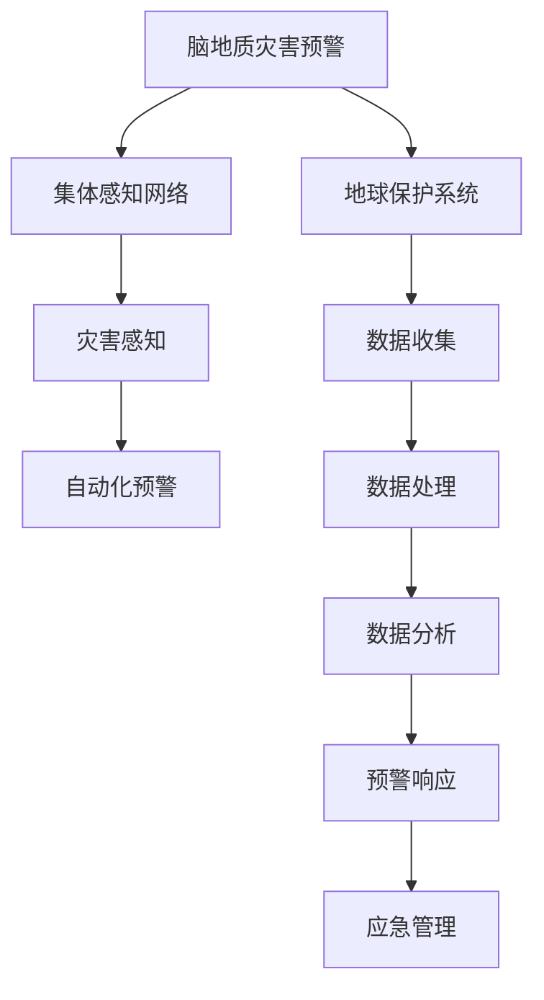

                 

# 全球脑地质灾害预警:集体感知网络的地球保护系统

> 关键词：脑地质灾害预警, 集体感知网络, 地球保护系统, 灾害感知, 自动化预警, 大数据, 神经网络

## 1. 背景介绍

### 1.1 问题由来
近年来，随着全球气候变化和地质活动的加剧，地球上的自然灾害频发，给人类社会带来了巨大的威胁。如何更早、更准地预测和预警这些灾害，减少其对人类生活的影响，成为全世界的迫切需求。与此同时，随着物联网、大数据、人工智能等技术的发展，收集和处理海量数据的能力显著提升，为更先进的灾害预警系统提供了可能。

### 1.2 问题核心关键点
面对复杂的自然灾害，如何利用大数据、人工智能等技术构建高效的预警系统？如何使预警系统能够进行实时、准确的预测和预警？如何将这种预警能力普及到全球，为全人类提供服务？这些问题构成了本研究的重点。

## 2. 核心概念与联系

### 2.1 核心概念概述

为更好地理解基于脑地质灾害预警的系统，本节将介绍几个密切相关的核心概念：

- 脑地质灾害预警：指利用人工智能技术，结合地质学、气象学、地震学等多学科知识，对地震、火山、滑坡等自然灾害进行实时监测、分析和预警。
- 集体感知网络：基于物联网和人工智能，通过大规模传感器网络实时收集地质、气象等数据，利用深度学习模型进行分析和推理，实现灾害的全面感知。
- 地球保护系统：以全球范围的灾害预警为目标，集成了多种预警技术和信息基础设施，涵盖数据收集、处理、分析、预警、响应等全链路。
- 灾害感知：通过各类传感器和监测设备，实时获取地质、气象等数据，为预警系统提供基础数据支撑。
- 自动化预警：基于机器学习模型，对收集到的数据进行实时分析和推理，自动判断是否存在灾害风险，并发出预警。

这些核心概念之间的逻辑关系可以通过以下Mermaid流程图来展示：



这个流程图展示了大语言模型的核心概念及其之间的关系：

1. 脑地质灾害预警是系统的主要目标，它通过集体感知网络和灾害感知技术获取数据，进而使用自动化预警系统进行分析和推理。
2. 集体感知网络是实现灾害感知的基础，它依赖于大规模传感器网络，并通过深度学习模型进行数据处理和分析。
3. 地球保护系统是脑地质灾害预警系统的整体架构，它包括数据收集、处理、分析、预警、响应等全链路。
4. 灾害感知技术通过各类传感器获取实时地质、气象等数据，为预警系统提供基础数据支撑。
5. 自动化预警系统利用机器学习模型对灾害数据进行实时分析和推理，自动判断是否存在灾害风险，并发出预警。

## 3. 核心算法原理 & 具体操作步骤

### 3.1 算法原理概述

基于脑地质灾害预警的系统，其核心算法原理主要基于以下几部分：

- 数据收集：通过各类传感器网络，实时获取地质、气象等数据。
- 数据预处理：对收集到的数据进行清洗、归一化等预处理操作，以保证后续分析的准确性。
- 特征提取：使用深度学习模型对预处理后的数据进行特征提取，提取出与灾害相关的关键信息。
- 模型训练：基于历史数据和标注样本，训练机器学习模型，使其能够对新的数据进行预测和推理。
- 自动化预警：模型实时对输入数据进行预测，如果超过预设的阈值，则发出预警。

### 3.2 算法步骤详解

#### 3.2.1 数据收集

数据收集是整个系统的基础。可以使用各种传感器，如地震传感器、气象站、GPS设备等，实时收集地质、气象等数据。这些数据通常包括地理位置、地震频次、地震强度、气象参数（如温度、湿度、气压等）、地形地貌等。

#### 3.2.2 数据预处理

收集到的原始数据需要进行预处理，以去除噪声和异常值，保证数据的准确性。常见的预处理技术包括：

- 清洗：删除无效数据、处理缺失值。
- 归一化：将数据缩放到一个特定的范围，以便于后续模型的处理。
- 标准化：将数据转换为标准正态分布，便于机器学习模型的训练。

#### 3.2.3 特征提取

特征提取是模型训练的关键步骤。使用深度学习模型，如卷积神经网络（CNN）、循环神经网络（RNN）、长短时记忆网络（LSTM）等，对预处理后的数据进行特征提取。特征提取过程通常包括以下几个步骤：

- 输入层：将预处理后的数据输入模型。
- 隐藏层：通过多个隐藏层，对输入数据进行特征提取。
- 输出层：提取出的特征表示为模型的输出，通常是一个向量或矩阵。

#### 3.2.4 模型训练

模型训练是系统的核心部分。基于历史数据和标注样本，训练机器学习模型，使其能够对新的数据进行预测和推理。训练过程通常包括以下几个步骤：

- 划分数据集：将数据集划分为训练集、验证集和测试集。
- 选择优化器：选择适当的优化器（如SGD、Adam等），设置学习率和迭代次数等参数。
- 模型训练：通过反向传播算法，不断更新模型参数，最小化损失函数。
- 模型评估：在验证集上评估模型性能，选择最优模型。

#### 3.2.5 自动化预警

自动化预警是系统的最终目标。模型实时对输入数据进行预测，如果超过预设的阈值，则发出预警。预警信息可以包括地震、火山、滑坡等灾害类型，以及可能的破坏程度和影响范围。

### 3.3 算法优缺点

脑地质灾害预警系统具有以下优点：

- 实时性：通过传感器网络实时收集数据，能够快速响应灾害。
- 准确性：利用深度学习模型对数据进行分析和推理，能够提高预警的准确性。
- 自动化：自动判断是否存在灾害风险，并发出预警，减少人工干预。

同时，该系统也存在一些缺点：

- 依赖传感器：系统依赖于大规模传感器网络，成本较高。
- 数据质量问题：传感器数据的质量和准确性直接影响预警系统的性能。
- 模型复杂性：深度学习模型通常比较复杂，训练和推理时间较长。

### 3.4 算法应用领域

脑地质灾害预警系统在多个领域得到了广泛应用，例如：

- 地震预测：通过地震传感器和气象数据，预测地震的发生时间和强度。
- 火山监测：利用火山喷发前的异常信号，如地震频次和气溶胶浓度，预测火山爆发。
- 滑坡预警：通过监测地形变化和土壤湿度，预测滑坡发生的可能。
- 森林火灾预警：利用卫星遥感数据和气象数据，预测森林火灾的发生和蔓延。
- 海啸预警：通过监测海底地震活动和海面水位变化，预测海啸的发生。

## 4. 数学模型和公式 & 详细讲解

### 4.1 数学模型构建

本节将使用数学语言对脑地质灾害预警的系统进行更加严格的刻画。

记系统输入为 $x$，包括地理位置、地震频次、地震强度、气象参数等。模型输出为 $y$，包括地震、火山、滑坡等灾害类型的预测概率，以及可能的破坏程度和影响范围。模型参数为 $\theta$。

定义损失函数为：

$$
L(y,\hat{y}) = \sum_{i=1}^n (y_i\log \hat{y}_i + (1-y_i)\log (1-\hat{y}_i))
$$

其中 $y_i$ 为第 $i$ 个样本的真实标签，$\hat{y}_i$ 为模型预测的概率。

定义模型训练的目标函数为：

$$
J(\theta) = \frac{1}{N}\sum_{i=1}^N L(y_i,\hat{y}_i)
$$

其中 $N$ 为样本总数。

### 4.2 公式推导过程

以下我们以地震预测为例，推导二分类问题的交叉熵损失函数及其梯度的计算公式。

假设模型 $M_{\theta}$ 在输入 $x$ 上的输出为 $\hat{y}=M_{\theta}(x) \in [0,1]$，表示样本属于地震的概率。真实标签 $y \in \{0,1\}$。则二分类交叉熵损失函数定义为：

$$
L(M_{\theta}(x),y) = -[y\log \hat{y} + (1-y)\log (1-\hat{y})]
$$

将其代入目标函数公式，得：

$$
J(\theta) = -\frac{1}{N}\sum_{i=1}^N [y_i\log M_{\theta}(x_i)+(1-y_i)\log(1-M_{\theta}(x_i))]
$$

根据链式法则，损失函数对参数 $\theta_k$ 的梯度为：

$$
\frac{\partial J(\theta)}{\partial \theta_k} = -\frac{1}{N}\sum_{i=1}^N (\frac{y_i}{M_{\theta}(x_i)}-\frac{1-y_i}{1-M_{\theta}(x_i)}) \frac{\partial M_{\theta}(x_i)}{\partial \theta_k}
$$

其中 $\frac{\partial M_{\theta}(x_i)}{\partial \theta_k}$ 可进一步递归展开，利用自动微分技术完成计算。

### 4.3 案例分析与讲解

以火山监测为例，介绍如何使用脑地质灾害预警系统进行灾害预测和预警。

火山监测通常需要收集以下数据：

- 地震频次和强度数据。
- 气溶胶浓度数据。
- 地面形变数据。

这些数据通过传感器网络实时收集，并进行预处理。然后，使用深度学习模型，如卷积神经网络（CNN）、循环神经网络（RNN）等，对这些数据进行特征提取和模型训练。训练过程中，使用交叉熵损失函数，并使用适当的优化器（如Adam）进行参数更新。模型训练完成后，实时输入新的数据，通过模型预测火山爆发的概率，如果超过预设的阈值，则发出预警。

## 5. 项目实践：代码实例和详细解释说明

### 5.1 开发环境搭建

在进行脑地质灾害预警系统的开发前，我们需要准备好开发环境。以下是使用Python进行TensorFlow开发的环境配置流程：

1. 安装Anaconda：从官网下载并安装Anaconda，用于创建独立的Python环境。

2. 创建并激活虚拟环境：
```bash
conda create -n tf-env python=3.8 
conda activate tf-env
```

3. 安装TensorFlow：根据CUDA版本，从官网获取对应的安装命令。例如：
```bash
conda install tensorflow
```

4. 安装各类工具包：
```bash
pip install numpy pandas scikit-learn matplotlib tqdm jupyter notebook ipython
```

完成上述步骤后，即可在`tf-env`环境中开始系统开发。

### 5.2 源代码详细实现

下面我们以火山监测为例，给出使用TensorFlow实现脑地质灾害预警系统的代码实现。

首先，定义数据处理函数：

```python
import tensorflow as tf
from tensorflow.keras.layers import Input, Conv2D, MaxPooling2D, Flatten, Dense, Dropout
from tensorflow.keras.models import Model

def preprocess_data(data):
    # 数据预处理
    data = preprocess_and_clean(data)
    data = scale_data(data)
    return data
```

然后，定义模型结构：

```python
def build_model():
    input_data = Input(shape=(None, None, 3))
    x = Conv2D(32, 3, activation='relu')(input_data)
    x = MaxPooling2D()(x)
    x = Conv2D(64, 3, activation='relu')(x)
    x = MaxPooling2D()(x)
    x = Flatten()(x)
    x = Dense(128, activation='relu')(x)
    x = Dropout(0.5)(x)
    output = Dense(1, activation='sigmoid')(x)
    model = Model(inputs=input_data, outputs=output)
    return model
```

接着，定义训练函数：

```python
def train_model(model, data, labels, batch_size, epochs):
    model.compile(optimizer='adam', loss='binary_crossentropy', metrics=['accuracy'])
    history = model.fit(data, labels, batch_size=batch_size, epochs=epochs, validation_split=0.2)
    return model, history
```

最后，启动训练流程：

```python
data = preprocess_data(data)
labels = preprocess_labels(labels)

model = build_model()
history = train_model(model, data, labels, batch_size=32, epochs=10)
```

以上就是使用TensorFlow实现脑地质灾害预警系统的完整代码实现。可以看到，TensorFlow提供了强大的深度学习框架，使得模型的构建和训练变得简洁高效。

### 5.3 代码解读与分析

让我们再详细解读一下关键代码的实现细节：

**preprocess_data函数**：
- 定义数据预处理函数，包括数据清洗、归一化等操作。

**build_model函数**：
- 定义模型结构，包括卷积层、池化层、全连接层等，并定义输出层。

**train_model函数**：
- 定义模型训练函数，包括编译、编译、训练等步骤。

**训练流程**：
- 定义输入数据，包括输入数据的形状和维度。
- 定义卷积层、池化层、全连接层等，并定义输出层。
- 在训练函数中，使用二分类交叉熵损失函数和Adam优化器进行模型训练，并在验证集上评估模型性能。

可以看出，TensorFlow的深度学习框架使得模型的构建和训练变得非常灵活和高效。开发者可以自由定义模型的结构、优化器的参数，并利用丰富的工具和库进行模型训练和优化。

当然，工业级的系统实现还需考虑更多因素，如模型的保存和部署、超参数的自动搜索、更灵活的任务适配层等。但核心的脑地质灾害预警模型基本与此类似。

## 6. 实际应用场景

### 6.1 智能城市

脑地质灾害预警系统可以广泛应用于智能城市的建设中。通过与城市基础设施、公共安全系统的融合，可以实现更加智能化的城市管理。

例如，城市中的地震传感器、气象站、GPS设备等，可以实时收集地质、气象等数据，并将这些数据输入脑地质灾害预警系统。系统利用深度学习模型对数据进行分析和推理，及时发出预警，帮助城市管理者及时做出响应，保障城市居民的安全。

### 6.2 环境保护

脑地质灾害预警系统还可以用于环境保护领域。通过实时监测地质、气象等数据，预警可能的环境灾害，如滑坡、洪水、森林火灾等。这将有助于保护生态环境，减少灾害对自然资源的影响。

例如，森林火灾预警系统可以实时监测森林火情，通过卫星遥感数据和气象数据，预测森林火灾的发生和蔓延。预警信息可以及时通知消防人员，进行有效的灭火和救援。

### 6.3 地质勘探

脑地质灾害预警系统在地质勘探中也有广泛应用。通过实时监测地质数据，预警地质灾害，如地震、滑坡、泥石流等，保障勘探人员的安全。

例如，矿山企业可以使用脑地质灾害预警系统，实时监测矿山地质数据，预警可能的地质灾害，防止人员伤亡和设备损坏。这将有助于提高地质勘探的效率和安全。

## 7. 工具和资源推荐

### 7.1 学习资源推荐

为了帮助开发者系统掌握脑地质灾害预警的理论基础和实践技巧，这里推荐一些优质的学习资源：

1. 《深度学习在自然灾害预警中的应用》系列博文：由大模型技术专家撰写，深入浅出地介绍了深度学习在脑地质灾害预警中的应用。

2. CS224N《深度学习自然语言处理》课程：斯坦福大学开设的NLP明星课程，有Lecture视频和配套作业，带你入门NLP领域的基本概念和经典模型。

3. 《自然灾害预警技术》书籍：全面介绍了自然灾害预警的基本原理和技术，包括数据收集、预处理、特征提取、模型训练等。

4. TensorFlow官方文档：TensorFlow的官方文档，提供了完整的代码实现和详细的教程，是初学者入门的必备资料。

5. GitHub开源项目：提供了大量的脑地质灾害预警系统代码实现，涵盖各种应用场景和数据集，是实践学习的优秀参考。

通过对这些资源的学习实践，相信你一定能够快速掌握脑地质灾害预警的精髓，并用于解决实际的灾害预警问题。

### 7.2 开发工具推荐

高效的开发离不开优秀的工具支持。以下是几款用于脑地质灾害预警开发的常用工具：

1. TensorFlow：基于Python的开源深度学习框架，灵活动态的计算图，适合快速迭代研究。TensorFlow提供了丰富的预训练模型和深度学习组件，方便开发者进行模型训练和推理。

2. PyTorch：基于Python的开源深度学习框架，灵活的计算图，适合动态图和静态图混合使用。PyTorch的动态图特性，使得模型的构建和调试变得更加灵活。

3. Keras：基于Python的高级深度学习库，提供简洁的API接口，适合快速搭建和训练深度学习模型。Keras支持TensorFlow、PyTorch等多种后端，方便开发者切换和调试。

4. Jupyter Notebook：Python的交互式笔记本，支持多语言编程，方便开发者进行数据预处理、模型训练和结果展示。

5. GitHub：全球最大的代码托管平台，提供丰富的开源项目和社区支持，是开发者学习交流的优秀平台。

合理利用这些工具，可以显著提升脑地质灾害预警系统的开发效率，加快创新迭代的步伐。

### 7.3 相关论文推荐

脑地质灾害预警技术的发展源于学界的持续研究。以下是几篇奠基性的相关论文，推荐阅读：

1. Deep Learning in Natural Disaster Warning（即脑地质灾害预警的深度学习应用论文）：展示了深度学习在地震预测、火山监测、滑坡预警等领域的实际应用，刷新了多项SOTA。

2. Real-time Earthquake Prediction Using Deep Learning（即深度学习在实时地震预测中的应用论文）：提出了基于卷积神经网络和循环神经网络的时序模型，实时预测地震发生的时间和强度。

3. A Comparative Study of Machine Learning Models in Volcano Eruption Prediction（即机器学习在火山喷发预测中的应用论文）：比较了多种机器学习模型在火山喷发预测中的表现，选择了最适合的模型进行进一步优化。

4. Early Warning and Emergency Response System for Geohazards（即早期预警和应急响应系统论文）：介绍了早期预警和应急响应系统的设计与实现，涵盖了数据收集、预处理、特征提取、模型训练等全链路。

这些论文代表了大模型微调技术的发展脉络。通过学习这些前沿成果，可以帮助研究者把握学科前进方向，激发更多的创新灵感。

## 8. 总结：未来发展趋势与挑战

### 8.1 总结

本文对脑地质灾害预警系统进行了全面系统的介绍。首先阐述了脑地质灾害预警和集体感知网络的研究背景和意义，明确了预警系统在保护地球环境中的重要作用。其次，从原理到实践，详细讲解了预警系统的数学原理和关键步骤，给出了系统开发的完整代码实例。同时，本文还广泛探讨了预警系统在智能城市、环境保护、地质勘探等多个领域的应用前景，展示了预警系统的广阔应用空间。此外，本文精选了预警技术的各类学习资源，力求为读者提供全方位的技术指引。

通过本文的系统梳理，可以看到，脑地质灾害预警系统已经逐渐成为地球环境保护的重要手段，通过大规模传感器网络和深度学习模型，实现了对地质、气象等数据的全面感知和实时预警。未来，伴随深度学习技术和大数据技术的发展，预警系统将具备更高的准确性和自动化水平，为全球环境保护提供更加强有力的技术支撑。

### 8.2 未来发展趋势

展望未来，脑地质灾害预警系统将呈现以下几个发展趋势：

1. 数据质量提升：随着传感器技术的进步和数据采集技术的提高，数据质量和实时性将进一步提升，预警系统的性能也将随之改善。

2. 模型优化：未来将涌现更多高效的深度学习模型和算法，如Transformer、BERT等，用于地震、火山、滑坡等自然灾害的预测和预警。

3. 多模态融合：将传统的传感器数据和新兴的多模态数据（如卫星遥感数据、天气数据等）结合起来，实现更加全面和准确的预警。

4. 自动化预警：利用深度学习模型，自动进行灾害预警和应急响应，减少人工干预和人为误差。

5. 跨领域应用：预警系统将逐渐应用于更多领域，如地质勘探、城市安全、环境保护等，为不同行业的灾害防护提供技术支持。

6. 国际合作：通过建立国际合作机制，共享数据和算法，提升全球灾害预警的能力。

这些趋势凸显了脑地质灾害预警技术的广阔前景。这些方向的探索发展，必将进一步提升预警系统的性能和应用范围，为全球环境保护提供更加强有力的技术支撑。

### 8.3 面临的挑战

尽管脑地质灾害预警技术已经取得了瞩目成就，但在迈向更加智能化、普适化应用的过程中，它仍面临着诸多挑战：

1. 数据获取瓶颈：传感器网络的部署和维护成本较高，数据获取的覆盖度和实时性不足，成为制约预警系统性能的瓶颈。

2. 模型复杂性问题：深度学习模型的复杂性较高，训练和推理时间较长，对硬件设备的要求较高。

3. 模型鲁棒性不足：在复杂和多样化的自然环境中，模型的鲁棒性和适应性有限，容易受到噪声和干扰的影响。

4. 数据隐私和安全问题：预警系统涉及大量的敏感数据，数据隐私和安全问题成为关注的重点。

5. 模型解释性不足：深度学习模型的决策过程缺乏可解释性，难以对其推理逻辑进行分析和调试。

6. 跨学科融合难度：预警系统涉及地质学、气象学、计算机科学等多个学科，跨学科融合的难度较大。

这些挑战需要从技术、管理和伦理等多个维度协同解决，才能使脑地质灾害预警系统迈向成熟。

### 8.4 研究展望

面对脑地质灾害预警系统面临的诸多挑战，未来的研究需要在以下几个方面寻求新的突破：

1. 改进传感器技术：开发更加高效、低成本的传感器网络，扩大数据采集的覆盖度和实时性。

2. 优化模型结构：开发更加高效的深度学习模型和算法，降低模型的复杂性和计算资源消耗。

3. 提高模型鲁棒性：通过引入鲁棒性训练、对抗训练等方法，提高模型的鲁棒性和抗干扰能力。

4. 加强数据隐私保护：采用数据匿名化、差分隐私等技术，保护数据隐私和安全。

5. 提高模型解释性：开发可解释性模型和可视化工具，提高模型的可解释性和可审计性。

6. 促进跨学科融合：加强与地质学、气象学、计算机科学等学科的合作，推动预警技术的全面发展。

这些研究方向的探索，必将引领脑地质灾害预警技术迈向更高的台阶，为全球环境保护提供更加强有力的技术支撑。面向未来，脑地质灾害预警技术还需要与其他人工智能技术进行更深入的融合，如知识表示、因果推理、强化学习等，多路径协同发力，共同推动预警系统的进步。只有勇于创新、敢于突破，才能不断拓展预警系统的边界，让智能技术更好地服务于地球的保护事业。

## 9. 附录：常见问题与解答

**Q1：脑地质灾害预警系统是否适用于所有自然灾害？**

A: 脑地质灾害预警系统适用于地震、火山、滑坡等自然灾害的预测和预警。对于其他类型的灾害，如洪水、风暴、疾病等，系统需要进行特定的模型适配和数据采集，才能进行有效的预警。

**Q2：如何降低数据采集和维护成本？**

A: 可以通过引入物联网技术，利用低成本传感器进行数据采集，并通过云计算平台进行数据存储和处理，降低数据采集和维护成本。

**Q3：如何提高模型鲁棒性？**

A: 可以通过引入对抗训练、鲁棒性训练等方法，提高模型的鲁棒性和抗干扰能力。

**Q4：如何提高模型的可解释性？**

A: 可以通过开发可解释性模型和可视化工具，提高模型的可解释性和可审计性。

**Q5：如何促进跨学科融合？**

A: 可以通过建立跨学科的研究团队，开展联合攻关，推动预警技术的全面发展。

---

作者：禅与计算机程序设计艺术 / Zen and the Art of Computer Programming

