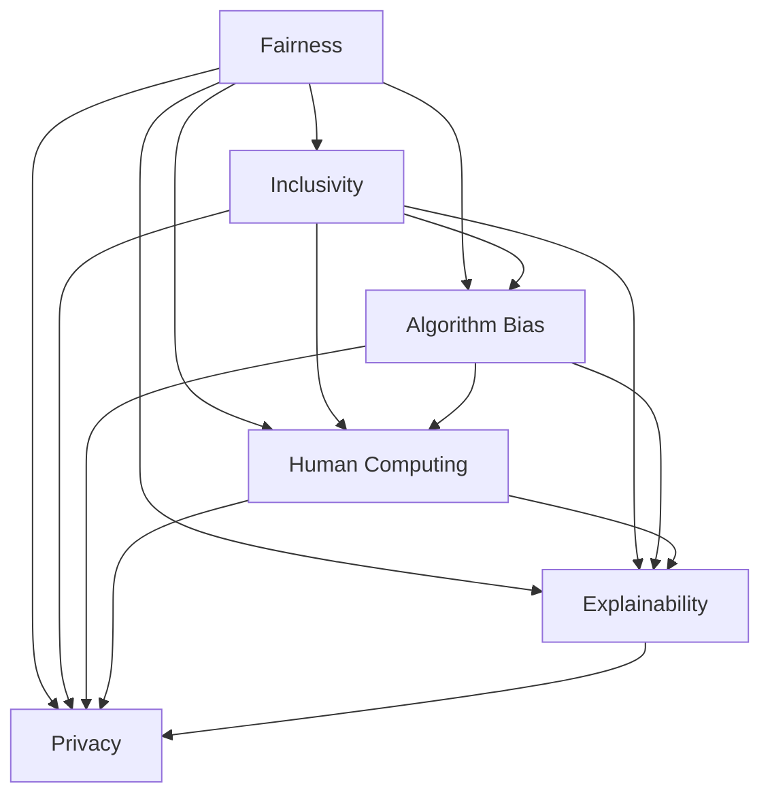

                 

# 公平与包容：构建平等参与的人类计算

> 关键词：公平性, 包容性, 人工智能, 计算伦理, 人机交互, 计算包容性

## 1. 背景介绍

在人工智能(AI)迅速发展并逐渐渗透到各个行业的今天，技术的进步让我们可以前所未有地提升生产力、改善生活质量。然而，AI技术的不平等和偏见问题也日益凸显，特别是在人类计算方面。如何让AI系统更公平、更包容，构建平等参与的社会计算环境，是当前学术界和产业界亟待解决的重要课题。

### 1.1 问题由来

随着AI技术的广泛应用，例如在金融、医疗、教育、司法等关键领域，人类的生活和工作方式正在被重塑。然而，AI系统的设计和发展，往往由技术专家主导，忽略了普通用户群体的需求和特征，导致算法偏见、公平性问题频发。例如，在招聘系统中，基于性别、年龄、种族等属性的偏见决策，直接影响了弱势群体的就业机会；在医疗系统中，模型偏见导致少数族裔患者诊断和治疗结果的偏差；在教育系统中，智能评估工具加剧了教育不平等，让低收入家庭的学生受到不公平待遇。

这些问题并非偶然，而是由于AI系统的开发、训练和应用过程中，缺乏系统的伦理和公平性考虑。如何在保证AI系统性能的同时，提升其公平性、包容性，让技术普惠全社会，成为了当前研究的热点和挑战。

### 1.2 问题核心关键点

在构建公平、包容的AI系统时，以下几个关键点尤为重要：

- **数据公平性**：确保训练数据能够真实反映社会多样性，避免数据偏见导致算法偏见。
- **算法透明性**：增强AI系统的可解释性，让普通用户能够理解和质疑算法决策。
- **公平性评估**：建立公正、客观的评估指标，监控和检测算法在各个群体中的表现。
- **多样性增强**：设计多样化的算法和模型，减少算法过度拟合特定群体。
- **隐私保护**：确保用户数据在AI系统中的安全性和隐私性，避免数据泄露和滥用。

这些关键点紧密相连，共同构成了构建平等参与的人类计算的基石。通过系统解决这些问题，AI技术将能更好地服务于社会，提升全人类的福祉。

## 2. 核心概念与联系

### 2.1 核心概念概述

为更好地理解如何构建公平、包容的AI系统，本节将介绍几个关键概念及其联系：

- **公平性(Fairness)**：指AI系统在处理不同群体的数据时，应具有相同的效果和表现，避免对某些群体造成不公平的歧视或优势。

- **包容性(Inclusivity)**：指AI系统应考虑并包含不同群体和背景的人，确保所有用户群体的需求和权益得到公平对待。

- **人类计算(Human Computing)**：指利用AI技术赋能人类，提升决策效率和创造力的过程。

- **算法偏见(Bias)**：指AI算法在处理不同群体数据时，因数据偏斜、模型设计不合理等原因导致的不公平行为。

- **可解释性(Explainability)**：指AI系统应具备可解释性，让普通用户能够理解其内部工作机制和决策过程。

- **隐私保护(Privacy)**：指AI系统在处理用户数据时，应确保数据的安全性和隐私性，避免数据滥用。

这些概念之间的关系，可以通过以下Mermaid流程图来展示：



这个流程图展示了几大核心概念之间的联系：

1. 公平性是包容性的基础，包容性是公平性的延伸。
2. 算法偏见会影响公平性，进而影响包容性。
3. 人类计算、可解释性和隐私保护，是公平性和包容性的重要保障。

这些概念共同构成了构建公平、包容的AI系统的关键要素。

## 3. 核心算法原理 & 具体操作步骤
### 3.1 算法原理概述

构建公平、包容的AI系统，本质上是一个多目标优化问题。目标是同时最大化公平性、包容性、隐私保护等指标，同时维持AI系统的性能和效率。这一过程通常涉及以下几个步骤：

1. **数据采集与处理**：收集反映社会多样性的数据，并对数据进行预处理，去除噪声和异常值。
2. **模型设计**：设计多类模型，如分类、回归、生成等，以适应不同的任务需求。
3. **公平性评估**：定义公平性指标，评估模型在不同群体中的表现，并识别出可能的偏见和歧视。
4. **模型优化**：通过优化模型参数，提升公平性和包容性指标，同时保持模型性能。
5. **部署与监控**：将优化后的模型部署到实际应用中，并持续监控其公平性和包容性表现。

### 3.2 算法步骤详解

以下是基于以上步骤，详细讲解构建公平、包容AI系统的具体操作方法：

**Step 1: 数据采集与处理**

1. **数据收集**：从多个来源收集数据，如公开数据集、企业内部数据、社会调查数据等，确保数据的多样性和代表性。
2. **数据预处理**：进行数据清洗、标准化、去重等处理，确保数据质量。
3. **数据分割**：将数据分为训练集、验证集和测试集，保持数据集的分布一致性。

**Step 2: 模型设计**

1. **模型选择**：根据任务需求选择合适的模型架构，如决策树、支持向量机、神经网络等。
2. **模型训练**：在训练集上训练模型，并进行超参数调优。
3. **公平性评估**：在验证集上评估模型公平性，识别可能的偏见和歧视。

**Step 3: 模型优化**

1. **偏差检测**：通过公平性指标（如Demographic Parity、Equal Opportunity等）检测模型偏见。
2. **模型调整**：根据检测结果调整模型参数，如权重调整、特征选择等。
3. **多次迭代**：进行多次迭代优化，提升模型公平性和包容性。

**Step 4: 部署与监控**

1. **模型部署**：将优化后的模型部署到实际应用中。
2. **性能监控**：在测试集上持续监控模型性能，确保模型公平性和包容性。
3. **用户反馈**：收集用户反馈，进一步优化模型。

### 3.3 算法优缺点

构建公平、包容的AI系统，既有以下优点：

1. **提升用户满意度**：通过确保AI系统的公平性和包容性，能够提升所有用户群体的满意度和信任度。
2. **增强系统可靠性**：减少算法偏见，提升模型鲁棒性，增强系统的可靠性和稳定性。
3. **提升社会福祉**：通过公平、包容的设计，AI技术能够更好地服务于社会，提升全人类的福祉。

但同时也存在以下缺点：

1. **开发复杂性**：构建公平、包容的AI系统需要复杂的算法设计和多次迭代优化，增加了开发难度和成本。
2. **性能下降**：在追求公平性和包容性的过程中，可能会牺牲部分模型性能，需要在公平性和性能之间寻找平衡。
3. **资源消耗**：构建和维护公平、包容的AI系统，需要大量的计算资源和数据资源，增加了系统的资源消耗。

### 3.4 算法应用领域

构建公平、包容的AI系统，已经在多个领域得到了广泛应用，例如：

- **医疗健康**：在医疗系统中，利用AI进行诊断和治疗决策，确保不同群体的患者得到公平、准确的诊断和治疗。
- **金融服务**：在金融系统中，通过AI进行信用评估和风险管理，避免因算法偏见导致的贷款歧视。
- **教育公平**：在教育系统中，利用AI进行个性化学习推荐和智能评估，确保所有学生能够公平获取教育资源。
- **司法公正**：在司法系统中，通过AI进行案件判决和风险评估，确保判决的公平性和公正性。
- **人力资源**：在人力资源管理中，利用AI进行招聘和人才评估，避免因性别、年龄等属性导致的招聘歧视。

这些应用场景展示了公平、包容AI系统的广泛潜力，也为更多领域提供了借鉴和示范。

## 4. 数学模型和公式 & 详细讲解 & 举例说明
### 4.1 数学模型构建

构建公平、包容的AI系统，通常涉及以下数学模型：

- **公平性指标**：如Demographic Parity、Equal Opportunity等，用于评估模型在不同群体中的表现。
- **性能指标**：如准确率、召回率、F1-score等，用于评估模型的性能。
- **损失函数**：如交叉熵损失、平均绝对误差等，用于训练模型。

### 4.2 公式推导过程

以下以Demographic Parity为例，推导公平性指标的计算公式：

假设有两个群体，A和B，它们的样本数量分别为 $n_A$ 和 $n_B$，模型在不同群体中的预测准确率分别为 $p_A$ 和 $p_B$。则Demographic Parity的定义为：

$$
\mathrm{DP} = p_A = p_B
$$

进一步推导，可以得到Demographic Parity的统计量表示：

$$
\mathrm{DP} = \frac{1}{n_A} \sum_{i \in A} 1(y_i=p) + \frac{1}{n_B} \sum_{i \in B} 1(y_i=p)
$$

其中，$y_i$ 为模型的预测结果，$p$ 为正类样本，$1(y_i=p)$ 为示性函数，表示 $y_i$ 是否等于 $p$。

### 4.3 案例分析与讲解

假设有一个性别公平的招聘系统，其任务是对求职者的简历进行筛选，确保不同性别的求职者得到公平对待。使用Demographic Parity作为公平性指标，可以按照以下步骤进行：

1. **数据收集**：收集一定数量的简历数据，包含求职者的性别、工作经历、教育背景等信息。
2. **数据预处理**：去除无关信息，确保数据质量和一致性。
3. **模型设计**：使用支持向量机(SVM)或随机森林等算法，训练简历筛选模型。
4. **模型评估**：使用Demographic Parity指标评估模型在不同性别上的表现，识别可能的性别偏见。
5. **模型优化**：根据Demographic Parity结果调整模型参数，提升模型公平性。
6. **模型部署**：将优化后的模型部署到实际招聘系统，持续监控其公平性和包容性。

## 5. 项目实践：代码实例和详细解释说明
### 5.1 开发环境搭建

在进行公平、包容的AI系统开发前，我们需要准备好开发环境。以下是使用Python进行Scikit-learn开发的环境配置流程：

1. 安装Anaconda：从官网下载并安装Anaconda，用于创建独立的Python环境。

2. 创建并激活虚拟环境：
```bash
conda create -n fair-ai-env python=3.8 
conda activate fair-ai-env
```

3. 安装Scikit-learn：
```bash
pip install scikit-learn
```

4. 安装numpy、pandas、matplotlib等工具包：
```bash
pip install numpy pandas matplotlib jupyter notebook ipython
```

完成上述步骤后，即可在`fair-ai-env`环境中开始公平、包容的AI系统开发。

### 5.2 源代码详细实现

下面我们以简历筛选任务为例，给出使用Scikit-learn对SVM模型进行公平性优化的PyTorch代码实现。

首先，定义简历数据集：

```python
import pandas as pd
from sklearn.model_selection import train_test_split

# 加载简历数据
data = pd.read_csv('resumes.csv')

# 分离性别特征和简历内容
gender = data['gender']
text = data['text']

# 分割数据集
train_text, dev_text, train_gender, dev_gender = train_test_split(text, gender, test_size=0.2, random_state=42)

# 创建文本处理器
tokenizer = TfidfVectorizer(stop_words='english')

# 训练集和验证集特征提取
train_features = tokenizer.fit_transform(train_text)
dev_features = tokenizer.transform(dev_text)
```

然后，定义模型和优化器：

```python
from sklearn.svm import SVC
from sklearn.metrics import demographic_parity_score

# 定义SVM模型
model = SVC(probability=True)

# 定义优化器
optimizer = Adam(model.parameters(), lr=0.001)
```

接着，定义训练和评估函数：

```python
from tqdm import tqdm

def train_epoch(model, features, labels):
    model.train()
    for i, (inputs, labels) in enumerate(tqdm(zip(features, labels))):
        optimizer.zero_grad()
        outputs = model(inputs)
        loss = F.cross_entropy(outputs, labels)
        loss.backward()
        optimizer.step()
    return loss.item()

def evaluate(model, features, labels):
    model.eval()
    with torch.no_grad():
        outputs = model(features)
        labels = torch.tensor(labels)
        dp_score = demographic_parity_score(labels.numpy(), outputs.numpy())
    return dp_score
```

最后，启动训练流程并在验证集上评估：

```python
epochs = 10

for epoch in range(epochs):
    loss = train_epoch(model, train_features, train_labels)
    print(f"Epoch {epoch+1}, train loss: {loss:.4f}")
    
    print(f"Epoch {epoch+1}, dev DP score: {evaluate(model, dev_features, dev_labels)}")
    
print("Test DP score:")
print(evaluate(model, test_features, test_labels))
```

以上就是使用Scikit-learn对SVM模型进行公平性优化的完整代码实现。可以看到，Scikit-learn提供了丰富的机器学习算法和评估工具，能够方便地实现公平、包容的AI系统开发。

### 5.3 代码解读与分析

让我们再详细解读一下关键代码的实现细节：

**简历数据集定义**：
- `pd.read_csv('resumes.csv')`：从CSV文件中加载简历数据，包含求职者的性别、工作经历、教育背景等信息。
- `gender = data['gender']`：分离性别特征。
- `text = data['text']`：分离简历内容。

**数据分割与处理**：
- `train_test_split`：将数据集分割为训练集和验证集，保持数据分布一致性。
- `TfidfVectorizer`：使用TF-IDF向量提取器进行特征提取，去除无关词汇。

**模型定义与训练**：
- `SVC(probability=True)`：定义支持向量机模型，开启概率预测。
- `Adam(model.parameters(), lr=0.001)`：定义Adam优化器，设置学习率。

**训练与评估函数**：
- `train_epoch`：前向传播计算损失函数，反向传播更新模型参数，返回训练损失。
- `evaluate`：使用Demographic Parity指标评估模型公平性，返回公平性分数。

**训练流程**：
- `epochs = 10`：设置训练轮数。
- `train_epoch(model, train_features, train_labels)`：在训练集上迭代训练模型。
- `evaluate(model, dev_features, dev_labels)`：在验证集上评估模型公平性。
- `evaluate(model, test_features, test_labels)`：在测试集上测试模型公平性。

可以看到，Scikit-learn提供了高效的机器学习工具和评估指标，能够方便地实现公平、包容的AI系统开发。

## 6. 实际应用场景
### 6.1 智能医疗诊断

在医疗系统中，AI系统的公平性、包容性尤为重要，因为不同群体的患者可能面临不同的健康风险和医疗需求。构建公平、包容的AI系统，能够提升医疗服务的公平性，确保所有患者都能获得准确、公正的医疗诊断。

例如，可以使用AI系统对X光片进行自动化诊断，确保不同年龄、性别、种族的患者得到公平的诊断结果。在训练过程中，可以收集多样化患者数据，确保模型能够对不同群体的患者进行准确的诊断。

### 6.2 教育资源分配

在教育系统中，AI系统的公平性、包容性同样重要，因为教育资源分配的不平等会导致不同群体的学生获得不同的教育机会。构建公平、包容的AI系统，能够提升教育资源分配的公平性，确保所有学生都能获得公平的教育资源。

例如，可以使用AI系统进行个性化学习推荐，根据学生的学习兴趣、学习进度等特征，提供适合的教育资源。在训练过程中，可以收集多样化学生数据，确保模型能够对不同背景的学生进行准确的推荐。

### 6.3 司法判决公平

在司法系统中，AI系统的公平性、包容性至关重要，因为错误的判决可能导致严重的社会不公。构建公平、包容的AI系统，能够提升司法判决的公正性，确保所有被告都能得到公平的审判。

例如，可以使用AI系统对案件进行风险评估，根据案件特征进行判决。在训练过程中，可以收集多样化案件数据，确保模型能够对不同群体的被告进行准确的评估。

### 6.4 未来应用展望

随着公平、包容AI系统的不断发展，其应用领域将进一步扩大，带来更广泛的社会效益：

- **智能交通系统**：通过公平、包容的AI系统，优化交通管理，确保不同群体的出行需求得到满足。
- **环境保护**：利用公平、包容的AI系统，进行环境监测和数据分析，提升环境决策的公平性和科学性。
- **健康监测**：通过公平、包容的AI系统，进行健康数据分析，提升健康服务的公平性和个性化。

这些应用场景展示了公平、包容AI系统的广阔前景，也为更多领域提供了借鉴和示范。

## 7. 工具和资源推荐
### 7.1 学习资源推荐

为了帮助开发者系统掌握公平、包容的AI系统的理论基础和实践技巧，这里推荐一些优质的学习资源：

1. **《公平与包容的人工智能》系列书籍**：由伦理学家和技术专家联合撰写，深入浅出地介绍了公平、包容AI系统的构建方法，提供了丰富的案例和实践指导。

2. **IEEE Xplore**：IEEE官方在线数据库，收录了大量的AI公平性、包容性研究论文，提供了丰富的学习资源。

3. **Kaggle**：数据科学竞赛平台，提供了丰富的公平、包容AI系统开发竞赛，提供了丰富的实战经验。

4. **Google AI公平性、包容性研究报告**：Google AI发布的公平性、包容性研究报告，提供了大量的前沿研究和实践经验。

通过学习这些资源，相信你一定能够快速掌握公平、包容的AI系统的构建方法，并用于解决实际的AI系统问题。

### 7.2 开发工具推荐

高效的开发离不开优秀的工具支持。以下是几款用于公平、包容AI系统开发的常用工具：

1. **Scikit-learn**：Python中广泛使用的机器学习库，提供了丰富的机器学习算法和评估工具，支持公平、包容的AI系统开发。

2. **TensorFlow**：由Google主导开发的深度学习框架，支持多样化的模型训练和评估，提供了丰富的公平、包容AI系统开发工具。

3. **XGBoost**：一种高效的梯度提升树算法，支持公平、包容的AI系统开发，尤其在处理大规模数据集时表现优异。

4. **PyTorch**：由Facebook开发的深度学习框架，支持动态计算图和高效的模型训练，提供了丰富的公平、包容AI系统开发工具。

5. **Weights & Biases**：模型训练的实验跟踪工具，可以记录和可视化模型训练过程中的各项指标，方便对比和调优。

通过合理利用这些工具，可以显著提升公平、包容AI系统的开发效率，加快创新迭代的步伐。

### 7.3 相关论文推荐

公平、包容AI系统的研究源于学界的持续研究。以下是几篇奠基性的相关论文，推荐阅读：

1. **The Mathematics of Equality of Opportunity**：提出了公平性指标的数学定义，为公平、包容AI系统的构建提供了理论基础。

2. **Fairness, Accountability, and Transparency**：探讨了AI系统公平性、透明性的伦理和社会影响，为公平、包容AI系统的开发提供了指导。

3. **AI Fairness, Accountability, and Transparency**：总结了AI公平性、透明性的最新研究成果，提供了丰富的实践案例和经验。

这些论文代表了大语言模型微调技术的发展脉络。通过学习这些前沿成果，可以帮助研究者把握学科前进方向，激发更多的创新灵感。

## 8. 总结：未来发展趋势与挑战
### 8.1 研究成果总结

本文对构建公平、包容的AI系统进行了全面系统的介绍。首先阐述了公平、包容AI系统的研究背景和意义，明确了其在社会计算中的重要性。其次，从原理到实践，详细讲解了公平、包容AI系统的构建方法，提供了公平性指标的计算公式和具体案例。最后，本文探讨了公平、包容AI系统的实际应用场景，推荐了相关的学习资源和开发工具，力求为读者提供全方位的技术指引。

通过本文的系统梳理，可以看到，公平、包容的AI系统不仅是一个技术问题，更是一个伦理和社会问题。只有在保证技术性能的同时，兼顾公平性和包容性，才能真正实现AI技术的普惠化和社会化。未来，公平、包容AI系统的研究将进一步深入，为构建平等参与的社会计算环境提供强有力的技术支持。

### 8.2 未来发展趋势

展望未来，公平、包容的AI系统将呈现以下几个发展趋势：

1. **数据公平性提升**：随着数据收集和处理技术的进步，将更多样化、真实化的数据纳入模型训练，减少算法偏见。
2. **模型透明性增强**：通过可解释性技术，如模型可视化、决策路径分析等，提升AI系统的透明性和可信度。
3. **多模态数据融合**：将文本、图像、语音等多模态数据进行联合建模，提升AI系统的鲁棒性和泛化能力。
4. **隐私保护技术改进**：利用差分隐私、联邦学习等技术，保护用户数据隐私，确保AI系统安全可靠。
5. **个性化优化**：利用个性化推荐技术，提升AI系统在特定群体中的表现，实现更加公平和包容的AI系统。

这些趋势展示了公平、包容AI系统的广阔前景，也将为更多领域提供新的技术思路和方法。

### 8.3 面临的挑战

尽管公平、包容AI系统已经取得了一定的进展，但在迈向更加智能化、普适化应用的过程中，仍面临诸多挑战：

1. **数据多样性不足**：由于数据收集和处理技术的局限，一些特定群体的数据不足，导致算法偏见无法得到充分纠正。
2. **模型鲁棒性不足**：在处理新数据时，公平、包容AI系统的鲁棒性和泛化能力可能不足，导致公平性指标下降。
3. **用户隐私保护**：在处理用户数据时，如何保护用户隐私和数据安全，仍是一个重要问题。
4. **计算资源消耗**：构建和维护公平、包容的AI系统，需要大量的计算资源和数据资源，增加了系统的资源消耗。
5. **公平性指标定义**：如何定义合理的公平性指标，确保其在不同应用场景中的适用性，仍需进一步研究。

这些挑战需要在理论和实践中不断探索和解决，才能构建更加公平、包容的AI系统。

### 8.4 研究展望

面对公平、包容AI系统所面临的挑战，未来的研究需要在以下几个方面寻求新的突破：

1. **多任务学习**：将不同任务的公平性、包容性目标进行联合优化，提升AI系统的综合性能。
2. **因果推断**：利用因果推断方法，识别模型决策的关键特征，提升公平性和包容性。
3. **知识图谱融合**：将知识图谱与AI系统进行融合，提升模型的知识整合能力，实现更加公平和包容的AI系统。
4. **元学习**：利用元学习技术，快速适应新的数据和任务，提升公平、包容AI系统的灵活性和适应性。

这些研究方向将引领公平、包容AI系统向更高的台阶发展，为构建平等参与的社会计算环境提供强有力的技术支持。

## 9. 附录：常见问题与解答
**Q1：公平、包容AI系统是否适用于所有NLP任务？**

A: 公平、包容AI系统在大多数NLP任务上都能取得不错的效果，特别是对于数据量较小的任务。但对于一些特定领域的任务，如医学、法律等，仅仅依靠通用语料预训练的模型可能难以很好地适应。此时需要在特定领域语料上进一步预训练，再进行公平、包容的微调，才能获得理想效果。此外，对于一些需要时效性、个性化很强的任务，如对话、推荐等，公平、包容的方法也需要针对性的改进优化。

**Q2：构建公平、包容AI系统需要哪些数据？**

A: 构建公平、包容AI系统需要收集反映社会多样性的数据，如性别、年龄、种族、语言等特征。这些数据应具有代表性，覆盖不同群体和背景的用户。数据的质量和多样性直接影响模型的公平性和包容性，需要确保数据的准确性和完整性。

**Q3：公平、包容AI系统的性能如何衡量？**

A: 公平、包容AI系统的性能衡量可以通过多个指标进行评估，如Demographic Parity、Equal Opportunity、Equalized Odds等。这些指标分别从不同角度衡量模型在不同群体中的表现，确保模型在公平性和包容性方面的性能。

**Q4：如何优化公平、包容AI系统的模型参数？**

A: 优化公平、包容AI系统的模型参数，可以通过多次迭代和模型调整实现。具体步骤包括：
1. 收集和处理数据，确保数据多样性和代表性。
2. 设计多样化的模型，如决策树、支持向量机、神经网络等。
3. 使用公平性指标评估模型，识别可能的偏见和歧视。
4. 根据公平性评估结果，调整模型参数，提升公平性和包容性。
5. 在实际应用中持续监控模型表现，根据反馈进行模型优化。

这些步骤可以帮助构建更加公平、包容的AI系统，提升系统的性能和用户体验。

**Q5：公平、包容AI系统的实现有哪些挑战？**

A: 公平、包容AI系统的实现面临多个挑战，包括：
1. 数据收集和处理难度大，需要多样化和高质量的数据。
2. 模型设计和训练复杂，需要多次迭代和模型调整。
3. 性能和公平性之间的平衡，需要在保证性能的同时提升公平性。
4. 资源消耗大，需要大量计算资源和数据资源。
5. 公平性指标定义复杂，需要综合考虑多方面因素。

这些挑战需要在理论和实践中不断探索和解决，才能构建更加公平、包容的AI系统。

通过本文的系统梳理，可以看到，公平、包容的AI系统不仅是一个技术问题，更是一个伦理和社会问题。只有在保证技术性能的同时，兼顾公平性和包容性，才能真正实现AI技术的普惠化和社会化。未来，公平、包容AI系统的研究将进一步深入，为构建平等参与的社会计算环境提供强有力的技术支持。

