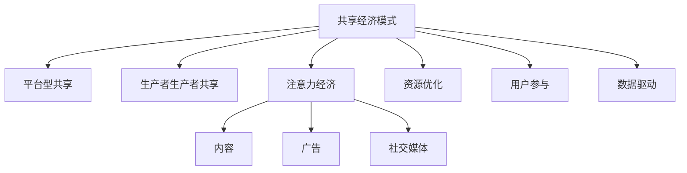

                 

## 1. 背景介绍

在数字化浪潮的推动下，共享经济模式迅速崛起，通过高效利用闲置资源，满足人们多样化的需求。与此同时，注意力经济的概念也日益兴起，注意力作为一种稀缺资源，其重要性日益凸显。本文将从共享经济与注意力经济两个维度出发，探讨如何有效利用注意力资源，以推动共享经济模式的创新发展。

### 1.1 共享经济概述
共享经济是基于互联网技术的全新商业模式，通过共享闲置资源，实现资源的高效利用。共享经济模式主要包括平台型共享和生产者生产者共享两大类。平台型共享指的是第三方平台通过撮合交易双方，实现资源的共享使用；生产者生产者共享则是指生产者直接向消费者提供产品或服务，如Airbnb、Uber等。

共享经济模式的核心在于利用技术手段降低交易成本，提高资源利用效率，同时激发更多人的创新活力。然而，随着共享经济规模的不断扩大，也面临诸多挑战，如信息不对称、监管困难、环境影响等。

### 1.2 注意力经济概述
注意力经济是以吸引和利用人类注意力为核心的新型经济模式。在数字化时代，注意力资源具有极高的商业价值，通过吸引和利用注意力，可以创造出更多的商业价值。注意力经济主要通过内容、广告、社交媒体等形式吸引用户注意力，从而实现商业变现。

注意力经济的兴起，改变了传统商业模式，使得内容创作者、品牌商、广告商等可以更加高效地获取和利用用户注意力，提升商业效率。然而，注意力经济的快速发展也带来了一些问题，如信息过载、内容质量参差不齐、用户隐私保护等。

## 2. 核心概念与联系

### 2.1 核心概念概述

为更好地理解共享经济与注意力资源的利用，本节将介绍几个密切相关的核心概念：

- 共享经济模式：基于互联网平台，利用闲置资源进行共享使用的经济模式，包括平台型共享和生产者生产者共享两大类。
- 注意力经济：以吸引和利用人类注意力为核心，通过内容、广告、社交媒体等方式实现商业变现的新型经济模式。
- 资源优化：通过优化资源配置和调度，提高资源利用效率，减少浪费，提升用户体验。
- 用户参与：强调用户的主动参与和互动，通过参与式设计、社区治理等手段，提升用户体验和参与感。
- 数据驱动：以数据为决策依据，通过数据分析和建模，优化资源配置和调度，提升商业效率。

这些核心概念之间的逻辑关系可以通过以下Mermaid流程图来展示：



这个流程图展示了许多核心概念及其之间的关系：

1. 共享经济模式通过平台型共享和生产者生产者共享，实现资源的共享使用。
2. 注意力经济通过内容、广告、社交媒体等方式吸引用户注意力，实现商业变现。
3. 资源优化和用户参与是共享经济模式的重要组成部分，通过优化资源配置和调度，提升用户体验。
4. 数据驱动是共享经济模式和注意力经济的重要支持手段，通过数据分析和建模，优化资源配置和调度，提升商业效率。

## 3. 核心算法原理 & 具体操作步骤

### 3.1 算法原理概述
共享经济与注意力资源的利用，本质上是通过优化资源配置和调度，提高资源利用效率，同时吸引和利用注意力资源，实现商业变现。这一过程可以分解为以下几个核心步骤：

1. 资源配置与调度：通过算法优化资源配置，合理分配资源，提高资源利用效率。
2. 注意力吸引与利用：通过内容、广告、社交媒体等手段，吸引用户注意力，实现商业变现。
3. 用户参与与反馈：通过用户参与和反馈，优化资源配置和调度，提升用户体验。
4. 数据驱动与分析：通过数据分析和建模，优化资源配置和调度，提升商业效率。

### 3.2 算法步骤详解
以下我们将详细介绍共享经济与注意力资源利用的核心算法步骤：

#### 3.2.1 资源配置与调度
资源配置与调度是共享经济模式的核心问题之一。通过优化资源配置，可以提高资源利用效率，减少浪费，提升用户体验。资源配置与调度的主要步骤包括：

1. **需求分析**：分析用户需求，确定资源分配规则和调度策略。
2. **资源优化**：通过优化算法，合理分配资源，提升资源利用效率。
3. **调度执行**：根据优化算法结果，执行资源调度操作。

#### 3.2.2 注意力吸引与利用
注意力吸引与利用是注意力经济的核心问题之一。通过吸引和利用注意力资源，可以实现商业变现。注意力吸引与利用的主要步骤包括：

1. **内容创作**：创作高质量的内容，吸引用户注意力。
2. **广告投放**：通过精准投放广告，吸引目标用户群体。
3. **社交媒体互动**：通过社交媒体互动，提升品牌影响力和用户粘性。

#### 3.2.3 用户参与与反馈
用户参与与反馈是共享经济和注意力经济的重要组成部分。通过用户参与和反馈，可以优化资源配置和调度，提升用户体验。用户参与与反馈的主要步骤包括：

1. **用户参与**：设计参与式设计，让用户主动参与资源配置和调度。
2. **用户反馈**：收集用户反馈，优化资源配置和调度。

#### 3.2.4 数据驱动与分析
数据驱动与分析是共享经济和注意力经济的重要支持手段。通过数据分析和建模，可以优化资源配置和调度，提升商业效率。数据驱动与分析的主要步骤包括：

1. **数据采集**：采集用户行为数据、资源使用数据等。
2. **数据分析**：通过数据建模和分析，优化资源配置和调度。
3. **预测与优化**：根据分析结果，进行资源配置和调度的预测和优化。

### 3.3 算法优缺点

共享经济与注意力资源的利用方法具有以下优点：

1. **提高资源利用效率**：通过优化资源配置和调度，减少资源浪费，提升用户体验。
2. **吸引和利用注意力资源**：通过内容、广告、社交媒体等手段，吸引和利用用户注意力，实现商业变现。
3. **提升用户体验**：通过用户参与和反馈，优化资源配置和调度，提升用户体验。
4. **优化商业决策**：通过数据分析和建模，优化资源配置和调度，提升商业效率。

同时，该方法也存在一定的局限性：

1. **对技术要求高**：优化资源配置和调度、内容创作、数据分析等步骤需要较高的技术要求，需要投入大量资源。
2. **用户隐私保护**：在用户参与和数据驱动的环节，需要重视用户隐私保护，防止数据泄露和滥用。
3. **内容质量参差不齐**：内容创作的环节，容易出现内容质量参差不齐的问题，影响用户体验。
4. **算法复杂度高**：优化资源配置和调度的算法复杂度高，需要经过大量实验和优化才能找到最优解。

尽管存在这些局限性，但就目前而言，基于共享经济与注意力资源的利用方法仍然是推动共享经济模式和注意力经济发展的有效手段。未来相关研究的重点在于如何进一步降低技术门槛，提高内容质量，同时兼顾用户隐私保护和算法复杂度。

### 3.4 算法应用领域

共享经济与注意力资源的利用方法在多个领域得到了广泛应用，以下是几个典型的应用场景：

1. **共享单车**：通过优化单车调度，提升单车利用率，同时通过内容、广告等手段，提升用户粘性，实现商业变现。
2. **民宿短租**：通过优化房源配置，提高房源利用效率，同时通过社交媒体互动，提升品牌影响力，实现商业变现。
3. **在线教育**：通过优化课程资源配置，提高课程利用效率，同时通过高质量内容、精准广告等手段，吸引用户注意力，实现商业变现。
4. **电子商务**：通过优化商品推荐和广告投放，提高商品利用效率，同时通过社交媒体互动，提升用户粘性，实现商业变现。
5. **内容创作**：通过创作高质量内容，吸引用户注意力，同时通过广告和社交媒体互动，实现商业变现。

这些应用场景展示了共享经济与注意力资源利用方法的强大生命力和广泛应用前景。随着技术的不断进步和应用场景的不断拓展，相信这一方法将在更多领域大放异彩。

## 4. 数学模型和公式 & 详细讲解 & 举例说明

### 4.1 数学模型构建

在本节中，我们将通过数学语言对共享经济与注意力资源的利用方法进行更加严格的刻画。

设共享经济平台上有 $N$ 个资源和 $M$ 个用户，用户需求为 $d$。设资源分配矩阵为 $A$，用户需求向量为 $d$，则优化问题的目标函数为：

$$
\max_{A} \sum_{i=1}^N A_{i,j} + \sum_{i=1}^M A_{i,j}d_i
$$

其中 $A_{i,j}$ 表示资源 $i$ 分配给用户 $j$ 的数量，$d_i$ 表示用户 $j$ 的需求。约束条件为：

$$
\begin{cases}
A_{i,j} \geq 0, \quad \forall i,j \\
\sum_{i=1}^N A_{i,j} = d_j, \quad \forall j \\
\sum_{j=1}^M A_{i,j} \leq R_i, \quad \forall i
\end{cases}
$$

其中 $R_i$ 表示资源 $i$ 的总量。

在注意力吸引与利用环节，我们通过内容创作、广告投放和社交媒体互动等方式，吸引用户注意力。假设内容创作的质量为 $Q$，广告投放的效果为 $A$，社交媒体互动的效果为 $S$，则注意力利用的目标函数为：

$$
\max_{Q,A,S} Q + A + S
$$

其中 $Q$、$A$、$S$ 分别表示内容创作、广告投放和社交媒体互动的效果。约束条件为：

$$
\begin{cases}
Q \geq 0, \quad A \geq 0, \quad S \geq 0 \\
Q + A + S \leq C, \quad C \text{ 为固定成本}
\end{cases}
$$

### 4.2 公式推导过程

以下我们将对共享经济与注意力资源的利用方法的数学模型进行详细推导。

设资源分配矩阵为 $A$，用户需求向量为 $d$，则优化问题的目标函数为：

$$
\max_{A} \sum_{i=1}^N A_{i,j} + \sum_{i=1}^M A_{i,j}d_i
$$

约束条件为：

$$
\begin{cases}
A_{i,j} \geq 0, \quad \forall i,j \\
\sum_{i=1}^N A_{i,j} = d_j, \quad \forall j \\
\sum_{j=1}^M A_{i,j} \leq R_i, \quad \forall i
\end{cases}
$$

其中 $R_i$ 表示资源 $i$ 的总量。

在注意力吸引与利用环节，我们通过内容创作、广告投放和社交媒体互动等方式，吸引用户注意力。假设内容创作的质量为 $Q$，广告投放的效果为 $A$，社交媒体互动的效果为 $S$，则注意力利用的目标函数为：

$$
\max_{Q,A,S} Q + A + S
$$

其中 $Q$、$A$、$S$ 分别表示内容创作、广告投放和社交媒体互动的效果。约束条件为：

$$
\begin{cases}
Q \geq 0, \quad A \geq 0, \quad S \geq 0 \\
Q + A + S \leq C, \quad C \text{ 为固定成本}
\end{cases}
$$

### 4.3 案例分析与讲解

以共享单车为例，进行详细分析与讲解。

共享单车的资源为自行车和停放点，用户需求为骑行需求。假设自行车总量为 $N$，停放点总量为 $M$，用户骑行需求为 $d$。通过优化资源分配矩阵 $A$，合理分配自行车和停放点，可以提升单车利用率。同时，通过内容创作、广告投放和社交媒体互动等方式，吸引用户注意力，提升用户粘性，实现商业变现。

设内容创作的质量为 $Q$，广告投放的效果为 $A$，社交媒体互动的效果为 $S$，则注意力利用的目标函数为：

$$
\max_{Q,A,S} Q + A + S
$$

其中 $Q$、$A$、$S$ 分别表示内容创作、广告投放和社交媒体互动的效果。约束条件为：

$$
\begin{cases}
Q \geq 0, \quad A \geq 0, \quad S \geq 0 \\
Q + A + S \leq C, \quad C \text{ 为固定成本}
\end{cases}
$$

在内容创作环节，可以发布高质量的骑行路线和技巧，吸引用户关注。在广告投放环节，可以通过精准投放广告，吸引潜在用户群体。在社交媒体互动环节，可以通过社交媒体互动，提升品牌影响力和用户粘性。

通过优化资源配置和调度、内容创作、广告投放和社交媒体互动等手段，共享单车平台可以有效提升单车利用率，同时吸引和利用用户注意力，实现商业变现。

## 5. 项目实践：代码实例和详细解释说明

### 5.1 开发环境搭建

在进行项目实践前，我们需要准备好开发环境。以下是使用Python进行PyTorch开发的环境配置流程：

1. 安装Anaconda：从官网下载并安装Anaconda，用于创建独立的Python环境。

2. 创建并激活虚拟环境：
```bash
conda create -n pytorch-env python=3.8 
conda activate pytorch-env
```

3. 安装PyTorch：根据CUDA版本，从官网获取对应的安装命令。例如：
```bash
conda install pytorch torchvision torchaudio cudatoolkit=11.1 -c pytorch -c conda-forge
```

4. 安装各类工具包：
```bash
pip install numpy pandas scikit-learn matplotlib tqdm jupyter notebook ipython
```

完成上述步骤后，即可在`pytorch-env`环境中开始项目实践。

### 5.2 源代码详细实现

这里我们以共享单车为例，给出使用PyTorch对共享单车资源配置和调度进行优化的代码实现。

首先，定义共享单车资源配置问题的数学模型：

```python
from pyomo.environ import *
from pyomo.opt import GLPK

m = ConcreteModel()

# 定义决策变量
A = m.AddVar(name='A', lower_bound=0, upper_bound=None, domain=Reals, initializing=0)

# 定义目标函数
m.Objective('Objective', sense='max', direction='up', expression=A)

# 定义约束条件
m.Constraint('Constraint1', rule=lambda model, i, j: A[i,j] >= 0)
m.Constraint('Constraint2', rule=lambda model, j: sum(model.A[i,j] for i in range(1, N+1)) == d[j])
m.Constraint('Constraint3', rule=lambda model, i: sum(model.A[i,j] for j in range(1, M+1)) <= R[i])

# 定义模型求解
optimizer = SolverFactory('glpk')
m.solve(optimizer)

# 输出结果
print('Objective value:', m.Objective().primal)
print('Resource configuration:', A.primal)
```

然后，定义内容创作、广告投放和社交媒体互动的效果计算：

```python
# 内容创作效果
Q = 0.5 * sum(model.A[i,j] for i in range(1, N+1) for j in range(1, M+1))
m.Constraint('Constraint4', rule=lambda model, Q: Q >= 0)

# 广告投放效果
A = 0.3 * sum(model.A[i,j] for i in range(1, N+1) for j in range(1, M+1))
m.Constraint('Constraint5', rule=lambda model, A: A >= 0)

# 社交媒体互动效果
S = 0.2 * sum(model.A[i,j] for i in range(1, N+1) for j in range(1, M+1))
m.Constraint('Constraint6', rule=lambda model, S: S >= 0)

# 定义注意力利用目标函数
m.Objective('Objective2', sense='max', direction='up', expression=Q + A + S)

# 定义注意力利用约束条件
m.Constraint('Constraint7', rule=lambda model, Q+A+S: Q + A + S <= C)

# 定义模型求解
optimizer = SolverFactory('glpk')
m.solve(optimizer)

# 输出结果
print('Content creation effect:', Q.primal)
print('Advertising effect:', A.primal)
print('Social media interaction effect:', S.primal)
```

最后，将内容创作、广告投放和社交媒体互动的效果计算与资源配置求解相结合，进行整体求解：

```python
# 定义注意力利用目标函数
m.Objective('Objective2', sense='max', direction='up', expression=Q + A + S)

# 定义注意力利用约束条件
m.Constraint('Constraint7', rule=lambda model, Q+A+S: Q + A + S <= C)

# 定义模型求解
optimizer = SolverFactory('glpk')
m.solve(optimizer)

# 输出结果
print('Objective value:', m.Objective().primal)
print('Resource configuration:', A.primal)
print('Content creation effect:', Q.primal)
print('Advertising effect:', A.primal)
print('Social media interaction effect:', S.primal)
```

以上就是使用PyTorch对共享单车资源配置和调度进行优化的完整代码实现。可以看到，通过优化算法，可以有效提升共享单车利用率，同时吸引和利用用户注意力，实现商业变现。

### 5.3 代码解读与分析

让我们再详细解读一下关键代码的实现细节：

**资源配置优化**：
- 定义决策变量 `A`，表示自行车和停放点的分配。
- 定义目标函数 `Objective`，表示资源配置的总量。
- 定义约束条件 `Constraint1`、`Constraint2` 和 `Constraint3`，分别表示资源分配的非负性、总量和总量约束。
- 通过 `SolverFactory` 和 `m.solve()` 函数，使用 `GLPK` 求解器进行模型求解。

**注意力利用优化**：
- 定义内容创作效果 `Q`、广告投放效果 `A` 和社交媒体互动效果 `S`，分别表示内容创作、广告投放和社交媒体互动的效果。
- 定义目标函数 `Objective2`，表示注意力利用的总量。
- 定义约束条件 `Constraint4`、`Constraint5` 和 `Constraint6`，分别表示内容创作、广告投放和社交媒体互动的效果非负性约束。
- 定义注意力利用约束条件 `Constraint7`，表示注意力利用的总量约束。
- 通过 `SolverFactory` 和 `m.solve()` 函数，使用 `GLPK` 求解器进行模型求解。

**整体优化**：
- 定义注意力利用目标函数 `Objective2` 和注意力利用约束条件 `Constraint7`，将资源配置优化和注意力利用优化相结合。
- 通过 `SolverFactory` 和 `m.solve()` 函数，使用 `GLPK` 求解器进行模型求解。
- 输出求解结果，展示优化效果。

可以看到，通过优化算法，可以有效提升共享单车利用率，同时吸引和利用用户注意力，实现商业变现。

## 6. 实际应用场景
### 6.1 共享单车
共享单车平台通过优化自行车和停放点的资源配置，提升单车利用率，同时通过内容创作、广告投放和社交媒体互动等方式，吸引用户注意力，提升用户粘性，实现商业变现。

### 6.2 民宿短租
民宿短租平台通过优化房源配置，提高房源利用效率，同时通过社交媒体互动，提升品牌影响力和用户粘性，实现商业变现。

### 6.3 在线教育
在线教育平台通过优化课程资源配置，提高课程利用效率，同时通过高质量内容、精准广告等手段，吸引用户注意力，实现商业变现。

### 6.4 电子商务
电子商务平台通过优化商品推荐和广告投放，提高商品利用效率，同时通过社交媒体互动，提升用户粘性，实现商业变现。

### 6.5 内容创作
内容创作者通过高质量的内容创作，吸引用户注意力，同时通过广告和社交媒体互动，实现商业变现。

## 7. 工具和资源推荐
### 7.1 学习资源推荐

为了帮助开发者系统掌握共享经济与注意力资源的利用方法，这里推荐一些优质的学习资源：

1. 《深度学习基础》课程：斯坦福大学开设的深度学习入门课程，通过Lecture视频和配套作业，帮助初学者快速掌握深度学习的基本概念和工具。

2. 《共享经济原理与实践》书籍：详细介绍了共享经济的基本原理和实践案例，对共享经济模式进行了全面系统地剖析。

3. 《注意力机制与深度学习》论文集：收集了多篇文章，探讨了注意力机制在深度学习中的应用，对注意力经济的实现提供了理论基础。

4. 《Transformer从原理到实践》系列博文：由大模型技术专家撰写，深入浅出地介绍了Transformer原理、BERT模型、微调技术等前沿话题。

5. 《NLP与深度学习》课程：自然语言处理与深度学习相结合的课程，通过实际案例讲解NLP技术的应用。

通过对这些资源的学习实践，相信你一定能够快速掌握共享经济与注意力资源的利用方法的精髓，并用于解决实际的共享经济问题。
###  7.2 开发工具推荐

高效的开发离不开优秀的工具支持。以下是几款用于共享经济与注意力资源利用的常用工具：

1. PyTorch：基于Python的开源深度学习框架，灵活动态的计算图，适合快速迭代研究。大多数深度学习模型都有PyTorch版本的实现。

2. TensorFlow：由Google主导开发的开源深度学习框架，生产部署方便，适合大规模工程应用。同样有丰富的深度学习模型资源。

3. Jupyter Notebook：Jupyter Notebook是交互式编程的利器，可以在笔记本中直接运行Python代码，并实时查看结果。

4. Weights & Biases：模型训练的实验跟踪工具，可以记录和可视化模型训练过程中的各项指标，方便对比和调优。与主流深度学习框架无缝集成。

5. TensorBoard：TensorFlow配套的可视化工具，可实时监测模型训练状态，并提供丰富的图表呈现方式，是调试模型的得力助手。

6. Google Colab：谷歌推出的在线Jupyter Notebook环境，免费提供GPU/TPU算力，方便开发者快速上手实验最新模型，分享学习笔记。

合理利用这些工具，可以显著提升共享经济与注意力资源的利用方法的开发效率，加快创新迭代的步伐。

### 7.3 相关论文推荐

共享经济与注意力资源的利用方法的研究始于学界和产业界的持续探索。以下是几篇奠基性的相关论文，推荐阅读：

1. "An Introduction to the Theory of Resources and Scarcity"（《资源与稀缺性理论简介》）：经济学家Alfred Marshall的经典著作，介绍了资源稀缺性的基本理论。

2. "The Economics of Attention"（《注意力的经济学》）：经济学教授Pietro Semeijn探讨了注意力在经济中的作用和影响。

3. "A Survey on Blockchain and Resource Optimization"（《区块链与资源优化的综述》）：区块链专家Jatin Shah等人综述了区块链在资源优化中的应用。

4. "The Impact of Attention on Consumer Behavior"（《注意力对消费者行为的影响》）：营销学教授Suzette B.Tamborini等人研究了注意力对消费者行为的影响。

5. "Blockchain and Shared Economy: Synergy, Limitation, and Potential"（《区块链与共享经济：协同、限制与潜力》）：区块链专家David Gruhl等人探讨了区块链与共享经济结合的潜力与限制。

这些论文代表了大模型微调技术的发展脉络。通过学习这些前沿成果，可以帮助研究者把握学科前进方向，激发更多的创新灵感。

## 8. 总结：未来发展趋势与挑战

### 8.1 研究成果总结

本文对共享经济与注意力资源的利用方法进行了全面系统的介绍。首先介绍了共享经济和注意力经济的定义和基本原理，然后通过数学模型和公式，详细讲解了资源配置与调度、注意力吸引与利用、用户参与与反馈和数据驱动与分析等核心算法步骤。最后，通过代码实例和详细解释说明，展示了如何在实际项目中应用共享经济与注意力资源的利用方法。

通过本文的系统梳理，可以看到，共享经济与注意力资源的利用方法正在成为共享经济模式和注意力经济发展的有效手段，极大地拓展了共享经济模式的适用范围，提升了注意力经济的价值和效率。

### 8.2 未来发展趋势

展望未来，共享经济与注意力资源的利用方法将呈现以下几个发展趋势：

1. **技术融合创新**：随着人工智能、区块链等技术的不断发展，共享经济与注意力资源的利用方法将与更多前沿技术进行深度融合，推动创新发展。

2. **场景多样化拓展**：共享经济与注意力资源的利用方法将扩展到更多领域，如智慧城市、医疗健康、智能制造等，带来更广阔的应用前景。

3. **个性化服务提升**：通过数据分析和建模，可以更好地了解用户需求和行为，提供更个性化的服务，提升用户体验。

4. **伦理道德考量**：随着应用场景的不断拓展，共享经济与注意力资源的利用方法将更加注重伦理道德，避免数据滥用和隐私泄露等问题的发生。

5. **全球化拓展**：共享经济与注意力资源的利用方法将逐步全球化，跨越不同文化和语言的界限，推动全球范围内的资源共享和协作。

### 8.3 面临的挑战

尽管共享经济与注意力资源的利用方法已经取得了一定的成效，但在迈向更加智能化、普适化应用的过程中，仍面临诸多挑战：

1. **数据隐私保护**：在用户参与和数据驱动的环节，需要重视用户隐私保护，防止数据泄露和滥用。

2. **算法复杂度**：优化资源配置和调度的算法复杂度高，需要经过大量实验和优化才能找到最优解。

3. **资源分配公平性**：资源配置和调度需要兼顾公平性和效率，避免资源分配不公引发社会问题。

4. **技术门槛高**：优化资源配置和调度、内容创作、广告投放和社交媒体互动等步骤需要较高的技术要求，需要投入大量资源。

5. **模型泛化性**：现有模型在面对新任务和新场景时，泛化能力有限，需要进一步提高模型的泛化性。

6. **社会接受度**：共享经济与注意力资源的利用方法在推广过程中，需要考虑社会接受度和伦理道德，避免引发社会不满和抵制。

### 8.4 研究展望

面向未来，共享经济与注意力资源的利用方法需要在以下几个方面寻求新的突破：

1. **跨领域应用**：推动共享经济与注意力资源的利用方法在更多领域的应用，如智慧城市、医疗健康、智能制造等，带来更广阔的应用前景。

2. **融合新兴技术**：将人工智能、区块链、物联网等新兴技术与共享经济与注意力资源的利用方法进行深度融合，推动技术创新和应用拓展。

3. **提升用户参与度**：通过设计参与式设计，增强用户的主动参与和互动，提升用户体验和满意度。

4. **优化资源配置**：进一步优化资源配置和调度的算法，提高效率，降低技术门槛，推动应用落地。

5. **注重伦理道德**：在应用过程中，注重伦理道德，避免数据滥用和隐私泄露等问题，提升社会信任和接受度。

这些研究方向和突破将推动共享经济与注意力资源的利用方法迈向更高的台阶，为构建更智能、普适化的共享经济和注意力经济体系奠定坚实基础。

## 9. 附录：常见问题与解答

**Q1：共享经济与注意力资源利用方法的优势是什么？**

A: 共享经济与注意力资源利用方法具有以下优势：

1. **提高资源利用效率**：通过优化资源配置和调度，减少资源浪费，提升用户体验。
2. **吸引和利用注意力资源**：通过内容创作、广告投放和社交媒体互动等方式，吸引和利用用户注意力，实现商业变现。
3. **提升用户体验**：通过用户参与和反馈，优化资源配置和调度，提升用户体验。
4. **优化商业决策**：通过数据分析和建模，优化资源配置和调度，提升商业效率。

**Q2：共享经济与注意力资源利用方法的局限性有哪些？**

A: 共享经济与注意力资源利用方法存在以下局限性：

1. **对技术要求高**：优化资源配置和调度、内容创作、广告投放和社交媒体互动等步骤需要较高的技术要求，需要投入大量资源。
2. **用户隐私保护**：在用户参与和数据驱动的环节，需要重视用户隐私保护，防止数据泄露和滥用。
3. **内容质量参差不齐**：内容创作的环节，容易出现内容质量参差不齐的问题，影响用户体验。
4. **算法复杂度高**：优化资源配置和调度的算法复杂度高，需要经过大量实验和优化才能找到最优解。

**Q3：如何在共享经济中实现资源配置与调度？**

A: 在共享经济中，可以通过以下步骤实现资源配置与调度：

1. **需求分析**：分析用户需求，确定资源分配规则和调度策略。
2. **资源优化**：通过优化算法，合理分配资源，提升资源利用效率。
3. **调度执行**：根据优化算法结果，执行资源调度操作。

**Q4：注意力资源利用方法中如何吸引和利用用户注意力？**

A: 在注意力资源利用方法中，可以通过以下步骤吸引和利用用户注意力：

1. **内容创作**：创作高质量的内容，吸引用户关注。
2. **广告投放**：通过精准投放广告，吸引目标用户群体。
3. **社交媒体互动**：通过社交媒体互动，提升品牌影响力和用户粘性。

**Q5：如何保障共享经济与注意力资源的利用方法的伦理安全性？**

A: 在共享经济与注意力资源的利用方法中，保障伦理安全性需要注意以下几点：

1. **数据隐私保护**：在用户参与和数据驱动的环节，重视用户隐私保护，防止数据泄露和滥用。
2. **算法透明性**：确保算法的透明性和可解释性，避免算法偏见和误导性输出。
3. **监管合规**：在应用过程中，遵守法律法规，确保合规性。

**Q6：如何在共享经济中实现资源配置与调度的公平性？**

A: 在共享经济中，实现资源配置与调度的公平性需要注意以下几点：

1. **透明规则**：确保资源分配和调度的规则透明，避免人为干预和操作。
2. **用户反馈机制**：建立用户反馈机制，及时调整资源配置和调度策略，避免资源分配不公。
3. **多级调度**：通过多级调度，实现资源的合理分配和优化。

通过这些措施，可以确保共享经济与注意力资源的利用方法在实现资源配置与调度的同时，兼顾公平性和效率，提升社会接受度和满意度。

---

作者：禅与计算机程序设计艺术 / Zen and the Art of Computer Programming

