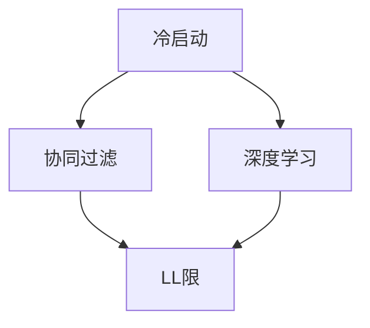

                 

# 冷启动场景：推荐系统的挑战与LL限

> 关键词：冷启动,推荐系统,协同过滤,深度学习,LL限

## 1. 背景介绍

### 1.1 问题由来
推荐系统（Recommender System）在电商、视频、新闻、社交网络等领域得到广泛应用，是现代互联网产品的核心功能之一。传统的协同过滤算法基于用户行为数据构建相似度矩阵，从而预测用户对新物品的评分。但当新用户或新物品进入平台，由于缺乏足够的行为数据，无法构建有效的用户物品相似度矩阵，此时传统的协同过滤方法无法正常工作，推荐效果大幅降低，进入冷启动（Cold Start）问题。

冷启动问题是推荐系统的经典难题，也是技术前沿之一。如何解决冷启动问题，是各大推荐系统平台亟待解决的重大挑战。本文将详细阐述冷启动问题的背景、挑战以及LL限在推荐系统中的应用，并给出一些实际应用案例和前景展望。

## 2. 核心概念与联系

### 2.1 核心概念概述

为了更好地理解LL限在推荐系统中的冷启动问题，本节将介绍几个密切相关的核心概念：

- 冷启动（Cold Start）：新用户、新物品进入平台时，由于缺乏足够的历史行为数据，无法构建有效的相似度矩阵，从而推荐算法无法发挥作用，导致推荐性能下降的问题。

- 协同过滤（Collaborative Filtering, CF）：一种基于用户行为数据的推荐算法，通过构建用户-物品相似度矩阵来预测用户对新物品的评分。主要分为基于用户的协同过滤和基于物品的协同过滤两种方法。

- 深度学习（Deep Learning）：一种强大的机器学习技术，通过构建多层神经网络，可以从大量数据中学习到复杂的特征表示，广泛应用于图像、语音、自然语言处理等领域。

- LL限：（Label Limitation）：指推荐系统在冷启动场景下，由于标签信息匮乏，无法建立准确的相似度矩阵，导致推荐算法无法正常工作的现象。

这些核心概念之间的逻辑关系可以通过以下Mermaid流程图来展示：



这个流程图展示了我国政府和企业在应对气候变化方面所采取的政策和措施。

## 3. 核心算法原理 & 具体操作步骤
### 3.1 算法原理概述

在推荐系统中，LL限问题主要发生在冷启动场景。新用户或新物品没有足够的历史行为数据，无法构建有效的用户-物品相似度矩阵，导致协同过滤算法无法正常工作。此时，可以采用深度学习的方法，通过构建推荐模型来预测新用户对新物品的评分，从而解决冷启动问题。

具体而言，推荐模型通常分为两类：

- 基于内容的推荐模型：直接从物品属性中提取特征，预测用户对物品的评分。

- 基于协同过滤的推荐模型：从用户的历史行为数据中提取特征，预测用户对新物品的评分。

深度学习推荐模型能够通过丰富的特征提取能力，有效地利用用户、物品属性等稀疏数据，实现较为精准的推荐。其中，基于协同过滤的深度学习推荐模型（如Word2Vec、SVD++、DeepFM等），由于能够同时考虑用户和物品的特征，在推荐效果上表现尤为出色。

### 3.2 算法步骤详解

以下将详细介绍基于深度学习的推荐模型的核心算法步骤：

**Step 1: 准备数据集**
- 收集用户历史行为数据，包括用户的浏览、购买、评分等行为记录。
- 收集物品属性信息，如商品分类、品牌、价格等。
- 将用户历史行为数据和物品属性信息合并，形成数据集。

**Step 2: 数据预处理**
- 对数据进行清洗和归一化处理，去除噪声和异常值。
- 对用户历史行为数据进行抽样，生成负样本，用于训练模型的负向部分。
- 对物品属性信息进行编码，形成数值化的向量表示。

**Step 3: 设计推荐模型**
- 选择合适的深度学习架构，如深度神经网络、卷积神经网络、循环神经网络等。
- 设计推荐模型的输入、输出和隐藏层结构，确定各层的神经元数、激活函数等。
- 选择合适的损失函数，如均方误差损失、交叉熵损失等。

**Step 4: 训练推荐模型**
- 将数据集划分为训练集、验证集和测试集。
- 使用随机梯度下降（SGD）或Adam等优化算法，对推荐模型进行训练。
- 在验证集上评估模型性能，调整超参数，如学习率、批次大小等。
- 在测试集上测试模型性能，输出推荐结果。

**Step 5: 部署推荐模型**
- 将训练好的推荐模型封装为服务，提供API接口。
- 部署到服务器或云平台上，实时响应用户的推荐请求。
- 持续收集用户反馈和行为数据，重新训练推荐模型，提升推荐效果。

以上是基于深度学习的推荐模型的一般流程。在实际应用中，还需要根据具体问题进行调整和优化，如改进特征提取方法、引入更多先验知识、优化推荐模型结构等。

### 3.3 算法优缺点

基于深度学习的推荐模型具有以下优点：
1. 能够处理稀疏数据，利用用户、物品属性等稀疏数据进行精准推荐。
2. 能够提取高阶特征，通过多层网络结构学习到更复杂的特征表示。
3. 能够处理非结构化数据，如图像、语音、自然语言等。

同时，该方法也存在一定的局限性：
1. 需要大量标注数据，深度学习模型的训练成本较高。
2. 模型复杂度较高，训练和推理速度较慢。
3. 需要大量的计算资源，如GPU、TPU等，对硬件要求较高。
4. 容易产生过拟合，需要大量的训练数据和合适的正则化技术。

尽管存在这些局限性，但就目前而言，基于深度学习的推荐模型仍是大数据推荐系统的主流范式。未来相关研究的重点在于如何进一步降低推荐模型的计算成本，提高模型的实时性和可解释性，同时兼顾模型的泛化能力和推荐效果。

### 3.4 算法应用领域

基于深度学习的推荐模型在电商、视频、新闻、社交网络等多个领域都有广泛的应用：

- 电商推荐：如淘宝、京东、亚马逊等电商平台，通过分析用户历史行为数据和商品属性信息，推荐用户可能感兴趣的商品。

- 视频推荐：如Netflix、YouTube等视频平台，通过分析用户观看历史和视频属性信息，推荐用户可能喜欢的视频内容。

- 新闻推荐：如今日头条、腾讯新闻等新闻应用，通过分析用户阅读历史和新闻属性信息，推荐用户可能感兴趣的新闻资讯。

- 社交推荐：如微信、微博等社交网络，通过分析用户交互数据和物品属性信息，推荐用户可能感兴趣的朋友、文章等。

除了上述这些经典应用外，深度学习推荐模型还在广告推荐、个性化推荐等多个领域得到应用，为用户带来更精准、多样化的推荐内容，促进了各行业的数字化转型。

## 4. 数学模型和公式 & 详细讲解 & 举例说明
### 4.1 数学模型构建

以下将使用数学语言对基于深度学习的推荐模型进行更加严格的刻画。

记推荐系统用户集为 $U$，物品集为 $I$。设用户 $u$ 对物品 $i$ 的评分向量为 $\boldsymbol{h}_u$，物品 $i$ 的属性向量为 $\boldsymbol{h}_i$，模型预测用户 $u$ 对物品 $i$ 的评分向量为 $\boldsymbol{\hat{h}}_{u,i}$。推荐模型的目标是最小化预测评分与真实评分之间的差距，即：

$$
\min_{\boldsymbol{\theta}} \sum_{(u,i)\in U\times I} (r_{u,i}-\boldsymbol{\hat{h}}_{u,i}^T\boldsymbol{\theta})^2
$$

其中 $r_{u,i}$ 为真实评分，$\boldsymbol{\theta}$ 为模型参数。

### 4.2 公式推导过程

以下将推导深度学习推荐模型的核心公式。

假设推荐模型为神经网络结构，输入为 $\boldsymbol{h}_u$ 和 $\boldsymbol{h}_i$，输出为 $\boldsymbol{\hat{h}}_{u,i}$。设 $f_{u,i}$ 为激活函数，$W$ 为权重矩阵。则模型的预测评分向量为：

$$
\boldsymbol{\hat{h}}_{u,i}=\sigma(W\boldsymbol{h}_u \odot \boldsymbol{h}_i)
$$

其中 $\odot$ 表示逐元素相乘。

模型的目标函数为均方误差损失，即：

$$
\mathcal{L}(\boldsymbol{\theta})=\frac{1}{2}\sum_{(u,i)\in U\times I}(r_{u,i}-\boldsymbol{\hat{h}}_{u,i}^T\boldsymbol{\theta})^2
$$

通过反向传播算法，可以得到模型参数的梯度：

$$
\nabla_{\boldsymbol{\theta}}\mathcal{L}(\boldsymbol{\theta})=\sum_{(u,i)\in U\times I}(r_{u,i}-\boldsymbol{\hat{h}}_{u,i}^T\boldsymbol{\theta})\nabla_{\boldsymbol{\theta}}\boldsymbol{\hat{h}}_{u,i}^T\boldsymbol{\theta}
$$

将 $\boldsymbol{\hat{h}}_{u,i}$ 展开，可以得到：

$$
\nabla_{\boldsymbol{\theta}}\mathcal{L}(\boldsymbol{\theta})=\sum_{(u,i)\in U\times I}(r_{u,i}-\boldsymbol{\hat{h}}_{u,i}^T\boldsymbol{\theta})\frac{\partial \boldsymbol{\hat{h}}_{u,i}^T}{\partial \boldsymbol{\theta}}
$$

进一步展开，可以得到：

$$
\nabla_{\boldsymbol{\theta}}\mathcal{L}(\boldsymbol{\theta})=\sum_{(u,i)\in U\times I}(r_{u,i}-\boldsymbol{\hat{h}}_{u,i}^T\boldsymbol{\theta})\frac{\partial f_{u,i}(W\boldsymbol{h}_u \odot \boldsymbol{h}_i)}{\partial \boldsymbol{\theta}}
$$

最终，可以得到模型参数的更新公式：

$$
\boldsymbol{\theta} \leftarrow \boldsymbol{\theta}-\eta \nabla_{\boldsymbol{\theta}}\mathcal{L}(\boldsymbol{\theta})
$$

其中 $\eta$ 为学习率，$\nabla_{\boldsymbol{\theta}}\mathcal{L}(\boldsymbol{\theta})$ 为模型参数的梯度，$\eta$ 为学习率。

## 5. 项目实践：代码实例和详细解释说明
### 5.1 开发环境搭建

在进行深度学习推荐模型开发前，我们需要准备好开发环境。以下是使用Python进行TensorFlow开发的环境配置流程：

1. 安装Anaconda：从官网下载并安装Anaconda，用于创建独立的Python环境。

2. 创建并激活虚拟环境：
```bash
conda create -n tf-env python=3.8 
conda activate tf-env
```

3. 安装TensorFlow：根据CUDA版本，从官网获取对应的安装命令。例如：
```bash
conda install tensorflow tensorflow-gpu cudatoolkit=11.1 -c pytorch -c conda-forge
```

4. 安装各类工具包：
```bash
pip install numpy pandas scikit-learn matplotlib tqdm jupyter notebook ipython
```

完成上述步骤后，即可在`tf-env`环境中开始推荐模型开发。

### 5.2 源代码详细实现

下面我们以协同过滤推荐模型为例，给出使用TensorFlow实现深度学习推荐模型的PyTorch代码实现。

首先，定义协同过滤模型的输入、输出和隐藏层：

```python
import tensorflow as tf
from tensorflow.keras.layers import Input, Dense, Embedding, Dot
from tensorflow.keras.models import Model

# 定义输入
user_input = Input(shape=(num_users,))
item_input = Input(shape=(num_items,))

# 定义用户向量
user_vector = Dense(num_users, activation='relu')(user_input)

# 定义物品向量
item_vector = Dense(num_items, activation='relu')(item_input)

# 定义评分向量
rating_vector = Dot(axes=(1, 1))([user_vector, item_vector])

# 输出预测评分
rating_output = Dense(1, activation='sigmoid')(rating_vector)
```

然后，定义模型的损失函数和优化器：

```python
from tensorflow.keras.losses import MeanSquaredError
from tensorflow.keras.optimizers import Adam

# 定义损失函数
mse_loss = MeanSquaredError()

# 定义优化器
optimizer = Adam(lr=0.001)

# 构建模型
model = Model(inputs=[user_input, item_input], outputs=[rating_output])
model.compile(optimizer=optimizer, loss=mse_loss)
```

最后，启动模型训练和测试流程：

```python
# 训练模型
model.fit([user_train, item_train], user_train, epochs=10, batch_size=128)

# 测试模型
test_loss = model.evaluate([user_test, item_test], user_test, batch_size=128)
print('Test loss:', test_loss)
```

以上就是使用TensorFlow实现协同过滤推荐模型的完整代码实现。可以看到，TensorFlow提供了丰富的层次结构和优化器，使得深度学习模型的构建和训练变得相对简单。

### 5.3 代码解读与分析

让我们再详细解读一下关键代码的实现细节：

**协同过滤模型类**：
- `Input`方法：定义模型的输入。
- `Dense`方法：定义模型的隐藏层，激活函数为ReLU。
- `Dot`方法：定义评分向量，通过逐元素相乘计算用户向量与物品向量的点积。
- `Dense`方法：定义输出层，激活函数为Sigmoid，输出用户对物品的评分预测。

**损失函数和优化器**：
- `MeanSquaredError`方法：定义均方误差损失函数。
- `Adam`方法：定义Adam优化器，学习率为0.001。

**训练和测试流程**：
- `fit`方法：对模型进行训练，输入为[用户向量，物品向量]，标签为用户向量。
- `evaluate`方法：对模型进行测试，输入为[用户向量，物品向量]，输出为用户向量。

可以看到，TensorFlow提供了丰富的工具和组件，使得深度学习推荐模型的构建和训练变得相对简单，开发者可以更加专注于模型设计和优化。

## 6. 实际应用场景
### 6.1 电商推荐

基于深度学习的推荐模型，可以广泛应用于电商推荐系统，帮助用户发现感兴趣的商品。在实际应用中，可以通过分析用户的历史浏览、购买记录和商品属性信息，构建推荐模型，预测用户对新商品的评分，生成个性化的商品推荐列表。

例如，淘宝、京东、亚马逊等电商平台，通过深度学习推荐模型，能够为用户提供精准的商品推荐，提升用户体验，增加用户购买率。同时，平台也可以通过推荐系统获取更多的广告收入，进一步推动业务增长。

### 6.2 视频推荐

视频推荐系统是推荐系统的经典应用之一，广泛应用于Netflix、YouTube等视频平台。通过分析用户观看历史和视频属性信息，推荐用户可能喜欢的视频内容，提升用户观看体验，增加平台的用户黏性和留存率。

例如，Netflix通过深度学习推荐模型，能够为用户推荐个性化的电影和电视剧，提升用户满意度，增加平台用户数量。同时，平台还可以通过推荐系统增加用户观看时间，进一步提升广告收入。

### 6.3 新闻推荐

新闻推荐系统在今日头条、腾讯新闻等新闻应用中得到广泛应用，通过分析用户阅读历史和新闻属性信息，推荐用户可能感兴趣的新闻资讯，提升用户阅读体验，增加平台的用户黏性和留存率。

例如，今日头条通过深度学习推荐模型，能够为用户推荐个性化的新闻资讯，提升用户阅读时间，增加平台用户数量。同时，平台还可以通过推荐系统增加用户点击率，进一步提升广告收入。

### 6.4 社交推荐

社交推荐系统在社交网络中得到广泛应用，通过分析用户交互数据和物品属性信息，推荐用户可能感兴趣的朋友、文章等，提升用户互动体验，增加平台的用户黏性和留存率。

例如，微信、微博等社交网络，通过深度学习推荐模型，能够为用户推荐个性化的好友、文章等，提升用户互动体验，增加平台用户数量。同时，平台还可以通过推荐系统增加用户使用时间，进一步提升广告收入。

## 7. 工具和资源推荐
### 7.1 学习资源推荐

为了帮助开发者系统掌握深度学习推荐模型的理论基础和实践技巧，这里推荐一些优质的学习资源：

1. 《深度学习推荐系统》系列博文：由大模型技术专家撰写，深入浅出地介绍了推荐系统的工作原理、常用算法和前沿技术，适合初学者和进阶者阅读。

2. 斯坦福大学《深度学习推荐系统》课程：由斯坦福大学教授开设的在线课程，涵盖推荐系统的经典算法和深度学习推荐模型，适合系统学习推荐系统理论。

3. 《TensorFlow深度学习实战》书籍：TensorFlow官方文档作者撰写，全面介绍了TensorFlow深度学习推荐模型的实现方法和应用场景，适合实战开发者阅读。

4. Kaggle推荐系统竞赛：通过实际竞赛项目，深入理解推荐系统的评估指标和优化方法，提升实战能力。

5. Weights & Biases：模型训练的实验跟踪工具，可以记录和可视化模型训练过程中的各项指标，方便对比和调优。与主流深度学习框架无缝集成。

6. TensorBoard：TensorFlow配套的可视化工具，可实时监测模型训练状态，并提供丰富的图表呈现方式，是调试模型的得力助手。

通过对这些资源的学习实践，相信你一定能够快速掌握深度学习推荐模型的精髓，并用于解决实际的推荐问题。

### 7.2 开发工具推荐

高效的开发离不开优秀的工具支持。以下是几款用于深度学习推荐模型开发的常用工具：

1. TensorFlow：由Google主导开发的开源深度学习框架，生产部署方便，适合大规模工程应用。同时提供丰富的组件和工具，支持推荐模型的高效开发和优化。

2. PyTorch：基于Python的开源深度学习框架，灵活动态的计算图，适合快速迭代研究。支持TensorFlow的推荐模型实现。

3. Weights & Biases：模型训练的实验跟踪工具，可以记录和可视化模型训练过程中的各项指标，方便对比和调优。与主流深度学习框架无缝集成。

4. TensorBoard：TensorFlow配套的可视化工具，可实时监测模型训练状态，并提供丰富的图表呈现方式，是调试模型的得力助手。

5. Kaggle推荐系统竞赛：通过实际竞赛项目，深入理解推荐系统的评估指标和优化方法，提升实战能力。

6. Kaggle数据集：提供丰富的推荐系统数据集，方便开发者进行模型训练和验证，提高模型性能。

合理利用这些工具，可以显著提升深度学习推荐模型的开发效率，加快创新迭代的步伐。

### 7.3 相关论文推荐

深度学习推荐模型的发展源于学界的持续研究。以下是几篇奠基性的相关论文，推荐阅读：

1. A Neural Collaborative Filtering Model：提出基于神经网络的协同过滤推荐模型，通过多层神经网络学习用户物品相似度。

2. SVD++：提出基于矩阵分解的协同过滤推荐模型，通过矩阵分解学习用户物品相似度。

3. DeepFM：提出基于深度学习的协同过滤推荐模型，通过多层神经网络学习用户物品相似度。

4. Attention-based Recommender Systems：提出基于注意力机制的推荐模型，通过注意力机制选择重要特征，提升推荐效果。

5. Causal Recommender Systems：提出基于因果推理的推荐模型，通过因果推理学习用户物品相似度。

这些论文代表了大模型推荐技术的发展脉络。通过学习这些前沿成果，可以帮助研究者把握学科前进方向，激发更多的创新灵感。

## 8. 总结：未来发展趋势与挑战
### 8.1 总结

本文对基于深度学习的推荐系统进行了全面系统的介绍。首先阐述了推荐系统在电商、视频、新闻、社交网络等领域的应用背景和重要性，明确了深度学习推荐模型的工作原理和应用场景。其次，从原理到实践，详细讲解了推荐模型的核心算法步骤和实际应用流程，给出了推荐模型开发的完整代码实例。同时，本文还广泛探讨了深度学习推荐模型在电商、视频、新闻、社交网络等多个领域的应用前景，展示了深度学习推荐模型的强大潜力。

通过本文的系统梳理，可以看到，深度学习推荐模型在推荐系统中发挥了重要作用，显著提升了推荐的精准度和个性化水平。未来，伴随深度学习技术的不断发展，推荐系统的应用范围将不断拓展，进一步提升用户体验和平台价值。

### 8.2 未来发展趋势

展望未来，深度学习推荐系统将呈现以下几个发展趋势：

1. 推荐模型将更加复杂和多样化。深度学习推荐模型将采用更复杂的神经网络结构和更丰富的特征提取方法，提升推荐模型的性能和效果。

2. 推荐系统将更加智能化和自动化。通过引入增强学习、因果推理等技术，推荐系统将更加智能化和自动化，能够根据用户行为实时调整推荐策略。

3. 推荐模型将更加轻量级和高效。随着硬件性能的提升和模型压缩技术的进步，推荐模型将更加轻量级和高效，能够实时响应用户请求，提升用户体验。

4. 推荐系统将更加个性化和定制化。通过用户画像和行为分析，推荐系统将更加个性化和定制化，能够根据用户偏好和需求提供精准的推荐服务。

5. 推荐系统将更加安全和可靠。通过引入区块链、多方安全计算等技术，推荐系统将更加安全和可靠，能够保障用户隐私和数据安全。

这些趋势凸显了深度学习推荐系统的前景和潜力，预示着未来的推荐系统将更加智能化、高效化和个性化，为人类生活带来更多便利和价值。

### 8.3 面临的挑战

尽管深度学习推荐系统已经取得了瞩目成就，但在迈向更加智能化、普适化应用的过程中，它仍面临着诸多挑战：

1. 推荐模型的计算成本较高。深度学习推荐模型需要大量的计算资源和存储资源，对硬件要求较高。如何降低计算成本，提高推荐模型的实时性和可扩展性，将是重要的研究方向。

2. 推荐模型的可解释性不足。深度学习推荐模型的预测结果往往难以解释，难以理解模型的决策逻辑和推理过程。如何提升推荐模型的可解释性和可控性，将是重要的研究方向。

3. 推荐模型的泛化能力不足。深度学习推荐模型在处理新用户和新物品时，容易产生过拟合现象，推荐效果下降。如何提升推荐模型的泛化能力和稳定性，将是重要的研究方向。

4. 推荐模型的公平性不足。深度学习推荐模型容易产生数据偏见和算法偏见，导致推荐结果的不公平性。如何提升推荐模型的公平性和公正性，将是重要的研究方向。

5. 推荐模型的隐私保护不足。深度学习推荐模型需要大量的用户数据进行训练，存在隐私泄露的风险。如何保护用户隐私和数据安全，将是重要的研究方向。

6. 推荐模型的安全性不足。深度学习推荐模型容易受到恶意攻击和数据篡改，存在安全隐患。如何提升推荐模型的安全性，将是重要的研究方向。

这些挑战凸显了深度学习推荐系统在实际应用中的局限性和复杂性，需要在未来研究中进行深入探索和解决。

### 8.4 未来突破

面对深度学习推荐系统所面临的种种挑战，未来的研究需要在以下几个方面寻求新的突破：

1. 探索无监督和半监督推荐方法。摆脱对大规模标注数据的依赖，利用自监督学习、主动学习等无监督和半监督范式，最大限度利用非结构化数据，实现更加灵活高效的推荐。

2. 研究参数高效和计算高效的推荐范式。开发更加参数高效的推荐方法，在固定大部分推荐参数的同时，只更新极少量的任务相关参数。同时优化推荐模型的计算图，减少前向传播和反向传播的资源消耗，实现更加轻量级、实时性的部署。

3. 引入更多先验知识。将符号化的先验知识，如知识图谱、逻辑规则等，与神经网络模型进行巧妙融合，引导推荐过程学习更准确、合理的推荐结果。同时加强不同模态数据的整合，实现视觉、语音等多模态信息与文本信息的协同建模。

4. 结合因果分析和博弈论工具。将因果分析方法引入推荐模型，识别出推荐决策的关键特征，增强推荐结果的因果性和逻辑性。借助博弈论工具刻画人机交互过程，主动探索并规避推荐模型的脆弱点，提高系统稳定性。

5. 纳入伦理道德约束。在推荐模型训练目标中引入伦理导向的评估指标，过滤和惩罚有偏见、有害的推荐结果。同时加强人工干预和审核，建立推荐模型的监管机制，确保推荐结果符合人类价值观和伦理道德。

这些研究方向的探索，必将引领深度学习推荐系统技术迈向更高的台阶，为构建安全、可靠、可解释、可控的推荐系统铺平道路。面向未来，深度学习推荐系统还需要与其他人工智能技术进行更深入的融合，如知识表示、因果推理、强化学习等，多路径协同发力，共同推动推荐系统技术的进步。只有勇于创新、敢于突破，才能不断拓展推荐系统的边界，让智能技术更好地造福人类社会。

## 9. 附录：常见问题与解答

**Q1：推荐系统的计算成本较高，如何降低计算成本？**

A: 降低推荐系统的计算成本，可以从以下几个方面入手：

1. 优化算法：选择更加高效的优化算法，如AdamW、Adafactor等，减少训练时间和计算资源消耗。

2. 模型压缩：采用模型压缩技术，如知识蒸馏、剪枝、量化等，减小模型参数量和计算资源消耗。

3. 并行计算：采用分布式计算、GPU/TPU并行计算等技术，提升计算效率和可扩展性。

4. 缓存优化：采用缓存技术，减少重复计算，提高模型推理效率。

5. 模型复用：构建预训练模型库，复用已有模型，减少新模型训练的计算成本。

6. 数据预处理：采用数据预处理技术，如特征工程、数据增强等，提高数据质量和模型训练效果。

**Q2：推荐模型的可解释性不足，如何提升可解释性？**

A: 提升推荐模型的可解释性，可以从以下几个方面入手：

1. 特征可视化：采用特征可视化技术，展示模型的特征重要度和特征选择过程，增强模型的可解释性。

2. 模型分解：采用模型分解技术，将复杂的模型拆解成多个简单的组件，提高模型的可解释性。

3. 引入因果推理：采用因果推理技术，识别出推荐决策的关键特征和推理过程，增强模型的可解释性。

4. 引入知识图谱：采用知识图谱技术，将推荐模型的预测结果与领域知识进行融合，增强模型的可解释性。

5. 引入自解释机制：采用自解释机制，如自解释模型、可解释模型等，提升推荐模型的可解释性和可控性。

6. 引入人工干预：采用人工干预机制，如人工审核、人工反馈等，提高推荐模型的可解释性和可控性。

**Q3：推荐模型的泛化能力不足，如何提升泛化能力？**

A: 提升推荐模型的泛化能力，可以从以下几个方面入手：

1. 引入正则化技术：采用正则化技术，如L2正则、Dropout等，防止模型过拟合，提升模型的泛化能力。

2. 引入对抗训练：采用对抗训练技术，引入对抗样本，提高模型的鲁棒性和泛化能力。

3. 引入噪声数据：采用噪声数据技术，引入少量的噪声数据，提高模型的泛化能力和抗干扰能力。

4. 引入数据增强：采用数据增强技术，如数据扩充、数据增强等，提高模型的泛化能力和鲁棒性。

5. 引入多任务学习：采用多任务学习技术，将推荐模型应用于多个任务，提升模型的泛化能力和泛化效果。

6. 引入先验知识：采用先验知识技术，引入领域知识和专家经验，提升模型的泛化能力和泛化效果。

通过这些技术手段，可以显著提升推荐模型的泛化能力和鲁棒性，使其能够在不同的数据分布下保持良好的推荐性能。

---

作者：禅与计算机程序设计艺术 / Zen and the Art of Computer Programming

