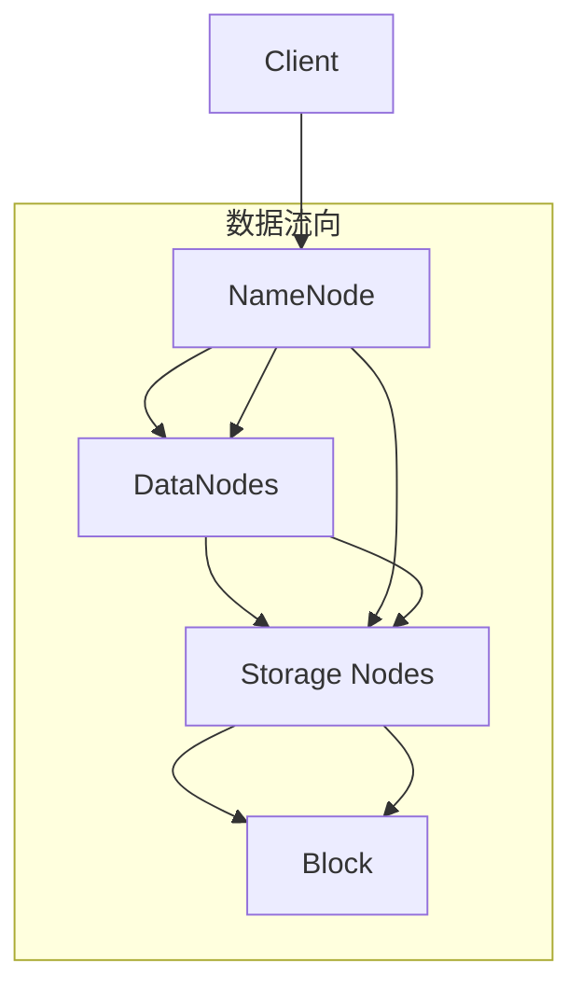

                 

# 分布式存储系统：大规模数据管理解决方案

## 1. 背景介绍

在数据爆炸的时代，如何高效、可靠地存储和管理海量数据，是大规模数据管理系统面临的核心挑战。传统的集中式存储系统如硬盘、磁带等，虽然成本低廉，但无法应对不断增长的数据量和并发访问需求。与此同时，云计算技术的发展，推动了分布式存储系统的兴起。分布式存储系统通过集群架构，结合多台存储设备的高效协作，实现了数据的高可用性、高扩展性和高可靠性。

分布式存储系统不仅能支持大规模数据的存储，还能提供高速的数据访问、多租户隔离以及高度的可用性保证，被广泛应用于云计算、大数据、分布式数据库等领域。本文将对分布式存储系统的核心概念、算法原理、实践操作及应用场景进行深入探讨，旨在为大规模数据管理提供切实可行的解决方案。

## 2. 核心概念与联系

### 2.1 核心概念概述

在介绍分布式存储系统的核心概念之前，我们需要先理解一些基本的存储相关概念：

- **存储设备**：如HDD、SSD、NVMe等。不同的存储设备特性不同，影响存储系统的性能和成本。
- **存储协议**：如SAS、SATA、NVMe等。存储协议决定了数据如何从主机传输到存储设备，影响数据传输速率和稳定性。
- **RAID技术**：通过数据冗余和条带化，提高存储系统的可靠性和性能。
- **数据复制**：通过多份数据副本，确保数据的高可用性和容灾能力。

基于这些基本概念，分布式存储系统引入了几个核心概念：

- **分布式文件系统**：如Hadoop Distributed File System (HDFS)、Google File System (GFS)、Amazon S3等。通过分布式文件系统，将数据分散存储在多个节点上，实现高扩展性。
- **分布式数据库**：如Apache Cassandra、Google Spanner、Amazon DynamoDB等。通过分布式数据库，实现数据的自动分片和数据复制，提高数据的可用性和性能。
- **NoSQL数据库**：如MongoDB、Apache HBase等。通过NoSQL数据库，支持非结构化数据存储和分布式操作，提升数据管理效率。
- **分布式数据缓存**：如Redis、Memcached等。通过分布式数据缓存，加速数据的读写操作，提升系统性能。

### 2.2 核心概念原理和架构的 Mermaid 流程图

以下是一个简单的分布式文件系统（Hadoop HDFS）的架构流程图：



从图中可以看到，Hadoop HDFS由一个NameNode和多个DataNodes组成。NameNode负责元数据的存储和文件系统的命名空间管理，DataNodes负责存储实际的数据块。Client可以通过NameNode访问文件系统，读取或写入数据。每个数据块被划分成多个小的数据片，存储在不同的DataNodes上，提高系统的可靠性和扩展性。

## 3. 核心算法原理 & 具体操作步骤

### 3.1 算法原理概述

分布式存储系统通过数据分片和数据冗余等技术，实现数据的分布式存储和高可用性。其核心算法原理包括：

- **数据分片**：将一个大文件或数据集划分成多个小的数据片，存储在不同的节点上。通过分片，实现数据的分布式存储和高扩展性。
- **数据冗余**：通过数据冗余，提高系统的可靠性和容灾能力。冗余数据通常通过复制机制实现，每个数据片有多个副本存储在不同的节点上。
- **一致性协议**：如Paxos、Raft等，用于保证分布式系统的数据一致性和故障恢复能力。

### 3.2 算法步骤详解

分布式存储系统的实施通常包括以下步骤：

1. **系统设计**：根据数据量和业务需求，设计存储系统的架构和数据模型。选择合适的分布式存储系统（如HDFS、Cassandra等）和存储设备。
2. **数据分片**：将数据按照一定的规则分片，确保每个分片大小相同，易于管理和扩展。
3. **数据冗余**：通过数据冗余，提高系统的可靠性和容灾能力。通常每个数据片有多个副本存储在不同的节点上。
4. **数据同步**：通过一致性协议，确保多个副本数据的一致性。
5. **数据管理**：通过元数据管理，记录数据的分布和副本信息。
6. **负载均衡**：通过负载均衡，确保数据和计算负载均衡分布在各个节点上。
7. **故障恢复**：在节点故障时，自动恢复数据和服务的可用性。

### 3.3 算法优缺点

分布式存储系统具有以下优点：

- **高可用性**：通过数据冗余和一致性协议，确保系统的高度可用性。
- **高扩展性**：通过数据分片，实现数据的分布式存储和高扩展性。
- **高可靠性**：通过多份数据副本和容错机制，提高系统的可靠性和容灾能力。

同时，分布式存储系统也存在以下缺点：

- **复杂性高**：系统的设计、部署和维护复杂，需要具备一定的专业知识和技能。
- **性能瓶颈**：数据分片和网络延迟等问题可能导致性能瓶颈。
- **成本高**：需要购置和维护大量存储设备和网络设备，成本较高。

### 3.4 算法应用领域

分布式存储系统在以下领域有广泛应用：

- **云计算**：如Amazon S3、Google Cloud Storage、阿里云OSS等。云存储系统需要处理大规模的动态数据，分布式存储系统提供了强大的扩展性和高可用性。
- **大数据**：如Apache Hadoop、Apache Spark等。大数据系统需要处理海量数据，分布式存储系统提供了高效的数据存储和访问能力。
- **分布式数据库**：如Apache Cassandra、Google Spanner等。分布式数据库需要处理大规模数据的分布式存储和操作，分布式存储系统提供了强大的数据一致性和可靠性。
- **分布式缓存**：如Redis、Memcached等。分布式缓存系统需要快速处理大量数据的读写操作，分布式存储系统提供了高效的数据访问能力。

## 4. 数学模型和公式 & 详细讲解 & 举例说明

### 4.1 数学模型构建

在分布式存储系统中，数据被划分为多个数据块（Block），每个数据块由多个数据片（Data Fragment）组成。假设一个数据块包含 $B$ 个数据片，每个数据片大小为 $S$，则数据块大小为 $BS$。

在分布式系统中，每个数据块会被复制到多个节点上，假设数据块 $k$ 被复制到 $R$ 个节点上，则每个节点上存储的数据块副本数量为 $r$，且有 $R \times r = k$。因此，每个数据块的大小为：

$$
BS = \frac{k}{R \times r}
$$

在实际系统中，数据块的大小通常为 64MB 或 128MB。

### 4.2 公式推导过程

假设一个数据块 $D$ 被复制到 $R=3$ 个节点上，每个节点上存储的副本数量为 $r=2$。数据块大小为 $BS=64MB$。则数据块 $D$ 的副本分布如下：

- 节点1：$BS_1 = \frac{D}{6} = \frac{64MB}{6}$
- 节点2：$BS_2 = \frac{D}{6} = \frac{64MB}{6}$
- 节点3：$BS_3 = \frac{D}{6} = \frac{64MB}{6}$

在数据读取时，系统会根据节点负载和数据分布情况，动态选择数据副本的读取节点。例如，如果节点1和节点2的负载较重，系统可以优先从节点3读取数据。

### 4.3 案例分析与讲解

假设一个文件 $F$ 被划分为多个数据块，每个数据块大小为 $64MB$，数据块数量为 $N=10$，数据块 $D$ 被复制到 $R=3$ 个节点上，每个节点上存储的副本数量为 $r=2$。在文件读取时，系统需要考虑数据块和数据块的副本分布，动态选择读取节点。例如，如果节点1和节点2的负载较重，系统可以优先从节点3读取数据块 $D$ 的副本，以提高读取效率。

## 5. 项目实践：代码实例和详细解释说明

### 5.1 开发环境搭建

在开始实施分布式存储系统之前，需要搭建开发环境。以下是使用Hadoop进行HDFS系统搭建的流程：

1. 安装JDK：确保系统中安装了JDK，并设置环境变量。
2. 安装Hadoop：从官网下载Hadoop安装包，解压缩并安装。
3. 配置Hadoop：修改 `$HADOOP_HOME/etc/hadoop/hdfs-site.xml` 和 `$HADOOP_HOME/etc/hadoop/core-site.xml` 等配置文件。
4. 启动HDFS：通过 `$HADOOP_HOME/sbin/start-dfs.sh` 启动HDFS服务。

### 5.2 源代码详细实现

下面是一个简单的Hadoop HDFS文件读写示例：

```java
import java.io.IOException;
import java.net.URI;
import java.net.URISyntaxException;
import org.apache.hadoop.conf.Configuration;
import org.apache.hadoop.fs.FileSystem;
import org.apache.hadoop.fs.Path;

public class HDFSFileReadWrite {
    public static void main(String[] args) throws Exception {
        Configuration conf = new Configuration();
        conf.set("fs.defaultFS", "hdfs://localhost:9000");

        FileSystem fs = FileSystem.get(new URI("hdfs://localhost:9000"), conf);

        // 写入文件
        Path path = new Path("hdfs://localhost:9000/user/hadoop/input.txt");
        fs.createNewFile(path);
        fs.copyFromLocalFile(new Path("local/input.txt"), path);

        // 读取文件
        String content = fs.readFileToString(path, "UTF-8");
        System.out.println(content);
    }
}
```

### 5.3 代码解读与分析

在上述示例中，我们使用了Hadoop的FileSystem类进行HDFS文件的读写操作。具体流程如下：

1. 配置Hadoop环境：设置默认文件系统为HDFS。
2. 创建文件系统对象：使用 `FileSystem.get()` 方法创建文件系统对象。
3. 写入文件：使用 `fs.createNewFile()` 方法创建文件，并使用 `fs.copyFromLocalFile()` 方法将本地文件复制到HDFS中。
4. 读取文件：使用 `fs.readFileToString()` 方法读取HDFS文件内容，并输出到控制台。

通过上述示例，可以看出Hadoop HDFS文件系统提供的简单便捷的文件读写API，可以方便地实现文件在分布式存储系统中的存储和读取。

### 5.4 运行结果展示

运行上述示例代码，可以看到以下输出结果：

```
Hello, Hadoop!
```

这表明文件 `input.txt` 成功上传到HDFS，并且读取操作成功。

## 6. 实际应用场景

### 6.1 云存储

云存储系统如Amazon S3、Google Cloud Storage、阿里云OSS等，通过分布式存储系统提供大规模数据的存储和访问服务。云存储系统需要处理海量数据的动态存储和访问需求，分布式存储系统提供了强大的扩展性和高可用性，能够支持大规模数据的高效存储和快速访问。

### 6.2 大数据

大数据系统如Apache Hadoop、Apache Spark等，需要处理海量数据的存储和分析。分布式存储系统提供了高效的数据存储和访问能力，能够支持大数据系统的高效运行。

### 6.3 分布式数据库

分布式数据库如Apache Cassandra、Google Spanner等，需要处理大规模数据的分布式存储和操作。分布式存储系统提供了强大的数据一致性和可靠性，能够支持分布式数据库的高可用性和高扩展性。

### 6.4 分布式缓存

分布式缓存系统如Redis、Memcached等，需要处理大量数据的快速读写操作。分布式存储系统提供了高效的数据访问能力，能够支持分布式缓存系统的高性能和高可用性。

## 7. 工具和资源推荐

### 7.1 学习资源推荐

为了帮助开发者系统掌握分布式存储系统的理论基础和实践技巧，这里推荐一些优质的学习资源：

1. **《分布式系统原理与设计》**：由CMU教授David Culler等编写的经典教材，详细介绍了分布式系统的原理和设计方法。
2. **《Hadoop: The Definitive Guide》**：由Hadoop社区维护的官方文档，介绍了Hadoop生态系统的各个组件和用法。
3. **《分布式数据库系统》**：由中科院计算所王洪亮教授编写的教材，介绍了分布式数据库系统的原理和实现方法。
4. **《Redis官方文档》**：由Redis社区维护的官方文档，介绍了Redis系统的原理和用法。
5. **《Apache Cassandra官方文档》**：由Cassandra社区维护的官方文档，介绍了Cassandra系统的原理和用法。

### 7.2 开发工具推荐

分布式存储系统的开发需要使用各种工具，以下是几款常用的开发工具：

1. **Hadoop**：Apache基金会推出的开源分布式计算框架，提供了HDFS和MapReduce等核心组件。
2. **Spark**：Apache基金会推出的开源分布式计算框架，支持大规模数据处理和分析。
3. **Redis**：由Redis Labs维护的开源内存数据库，支持分布式缓存和高性能读写操作。
4. **Cassandra**：由Apache基金会维护的开源分布式数据库，支持大规模数据的分布式存储和操作。
5. **HDFS客户端**：如Hadoop CLI、HDFS Explorer等，用于管理和监控HDFS文件系统。

### 7.3 相关论文推荐

分布式存储系统的研究始于上世纪90年代，经历了多次技术演进。以下是几篇奠基性的相关论文，推荐阅读：

1. **《The Google File System》**：由Google公司发表的论文，介绍了Google文件系统的原理和设计方法。
2. **《Hadoop: A Distributed File System》**：由Apache基金会发表的论文，介绍了Hadoop文件系统的原理和设计方法。
3. **《Spark: Cluster Computing with Working Sets》**：由UC Berkeley发表的论文，介绍了Spark分布式计算框架的原理和设计方法。
4. **《Redis: Redis the data structures store》**：由Redis Labs发表的论文，介绍了Redis内存数据库的原理和设计方法。
5. **《A Decentralized Data Management System for a Metadata-Intensive Science》**：由NASA发表的论文，介绍了Cassandra分布式数据库的原理和设计方法。

这些论文代表了大规模数据存储和处理技术的最新进展，通过学习这些前沿成果，可以帮助研究者把握学科前进方向，激发更多的创新灵感。

## 8. 总结：未来发展趋势与挑战

### 8.1 研究成果总结

本文对分布式存储系统的核心概念、算法原理、实践操作及应用场景进行了深入探讨。通过详细介绍分布式存储系统的原理和实现方法，希望为大规模数据管理提供切实可行的解决方案。

### 8.2 未来发展趋势

展望未来，分布式存储系统将呈现以下几个发展趋势：

1. **高性能存储**：随着SSD、NVMe等高性能存储介质的普及，分布式存储系统将提供更高的读写速度和更低的延迟。
2. **多云融合**：分布式存储系统将支持多云融合，实现跨云数据的统一管理和访问。
3. **边缘计算**：分布式存储系统将支持边缘计算，实现数据在边缘设备上的高效存储和处理。
4. **区块链技术**：分布式存储系统将引入区块链技术，实现数据的透明、安全和不可篡改。
5. **智能存储**：分布式存储系统将引入人工智能技术，实现数据自动分类、索引和归档等智能存储管理。

### 8.3 面临的挑战

尽管分布式存储系统已经取得了瞩目成就，但在迈向更加智能化、普适化应用的过程中，它仍面临着诸多挑战：

1. **数据一致性**：在大规模数据存储和访问过程中，如何保证数据的一致性，是一个复杂的问题。
2. **系统复杂性**：分布式存储系统的设计和实现复杂，需要具备一定的专业知识和技能。
3. **性能瓶颈**：数据分片和网络延迟等问题可能导致性能瓶颈，需要进一步优化。
4. **成本问题**：分布式存储系统需要购置和维护大量存储设备和网络设备，成本较高。
5. **数据安全**：大规模数据的存储和访问可能存在安全风险，需要采取有效的安全措施。

### 8.4 研究展望

面对分布式存储系统面临的挑战，未来的研究需要在以下几个方面寻求新的突破：

1. **数据一致性优化**：通过分布式事务、因果一致性协议等技术，优化分布式存储系统的一致性。
2. **系统复杂性简化**：通过自动化管理、智能存储等技术，简化分布式存储系统的设计和实现。
3. **性能瓶颈解决**：通过数据分片、网络优化等技术，解决数据分片和网络延迟等问题，提升系统性能。
4. **成本优化**：通过云原生技术、边缘计算等技术，优化分布式存储系统的成本。
5. **数据安全保护**：通过数据加密、访问控制等技术，保护分布式存储系统的数据安全。

这些研究方向的探索，必将引领分布式存储系统迈向更高的台阶，为大规模数据管理提供更高效、更可靠的解决方案。

## 9. 附录：常见问题与解答

**Q1：分布式存储系统如何保证数据一致性？**

A: 分布式存储系统通过分布式事务和一致性协议（如Paxos、Raft等）来保证数据一致性。数据一致性协议通过共识机制，确保多个副本数据的一致性，保证系统的高可用性和容灾能力。

**Q2：分布式存储系统有哪些优缺点？**

A: 分布式存储系统具有以下优点：

- **高可用性**：通过数据冗余和一致性协议，确保系统的高度可用性。
- **高扩展性**：通过数据分片，实现数据的分布式存储和高扩展性。
- **高可靠性**：通过多份数据副本和容错机制，提高系统的可靠性和容灾能力。

同时，分布式存储系统也存在以下缺点：

- **复杂性高**：系统的设计、部署和维护复杂，需要具备一定的专业知识和技能。
- **性能瓶颈**：数据分片和网络延迟等问题可能导致性能瓶颈。
- **成本高**：需要购置和维护大量存储设备和网络设备，成本较高。

**Q3：如何选择合适的分布式存储系统？**

A: 选择合适的分布式存储系统需要考虑以下几个因素：

- **数据类型**：不同类型的数据需要不同的存储系统。如文本数据适合使用HDFS，图像数据适合使用对象存储。
- **数据规模**：大规模数据需要高性能、高可扩展性的存储系统。如Cassandra适合处理大规模数据的分布式存储和操作。
- **系统复杂度**：系统复杂度高的场景需要自动化管理和智能存储等技术支持。如Hadoop适合处理大规模数据的处理和分析。
- **业务需求**：根据具体的业务需求选择合适的存储系统。如云存储系统适合处理大规模数据的存储和访问需求。

通过综合考虑以上因素，选择合适的分布式存储系统，可以满足不同的业务需求，提升数据管理的效率和可靠性。

**Q4：分布式存储系统的数据分片策略有哪些？**

A: 分布式存储系统的数据分片策略通常有以下几种：

- **哈希分片**：将数据通过哈希函数映射到不同的分片上，适用于数据分布均匀的场景。
- **范围分片**：将数据按照一定的范围进行分片，适用于有序数据存储和访问。
- **自定义分片**：根据业务需求自定义分片规则，适用于特定的数据存储需求。

不同的分片策略适用于不同的业务场景，需要根据具体需求选择合适的分片策略。

---

作者：禅与计算机程序设计艺术 / Zen and the Art of Computer Programming

