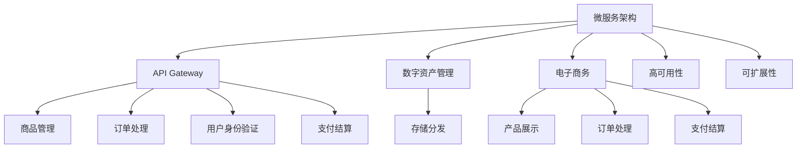
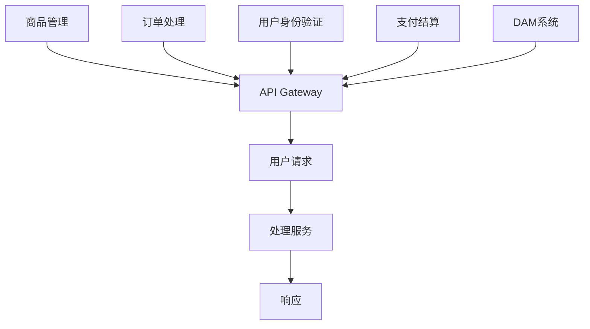

                 

# 创建开源项目的在线商店：周边产品和数字资产

> 关键词：开源项目、在线商店、周边产品、数字资产、电子商务、微服务架构、API Gateway、数据库迁移、用户身份验证、安全性、可扩展性

## 1. 背景介绍

随着开源社区的不断壮大，越来越多的项目开放源代码，供全球开发者共同贡献和改进。然而，这些项目的维护者也需要为项目的周边产品（如定制商品、报告文档、培训资料等）和数字资产（如图像、视频、文档等）的销售和分发找到有效的渠道。为了支持开源项目的商业化，促进其健康可持续发展，本文将介绍如何创建一个开源项目的在线商店，并通过微服务架构和API Gateway等现代技术实现高效管理。

### 1.1 问题由来

开源项目的周边产品和数字资产往往在需求多样性、个性化和复杂性上挑战项目维护者的资源管理能力。同时，项目维护者通常缺乏电子商务相关经验，难以构建一个稳定、可靠、扩展性强的在线商店。因此，本文旨在提供一个基于微服务架构和API Gateway的在线商店构建方案，帮助项目维护者实现周边产品和数字资产的高效管理。

### 1.2 问题核心关键点

核心问题在于如何将传统电子商务系统的核心能力，如商品管理、订单处理、用户身份验证、支付结算等，适配到开源项目的特性，实现轻量级、高效和灵活的管理方式。关键在于：

- 如何构建一个高性能、高可靠性和高扩展性的微服务系统。
- 如何设计一个清晰、易于维护的API接口。
- 如何确保数据安全性和用户隐私保护。
- 如何在保证稳定性和高效性的前提下，实现快速迭代和扩展。

## 2. 核心概念与联系

### 2.1 核心概念概述

为更好地理解如何创建一个开源项目的在线商店，我们需了解以下几个核心概念：

- **微服务架构(Microservices Architecture)**：一种将应用程序分解为多个独立服务的方法，每个服务负责特定功能，通过RESTful API实现服务间通信。
- **API Gateway**：作为API的前端代理，负责路由请求、负载均衡、认证授权、流量控制等功能，简化客户端调用。
- **开源项目周边产品(Digital Assets)**：指与项目相关的软件工具、文档、报告、培训资料等数字化内容。
- **数字资产管理(Digital Asset Management, DAM)**：管理、存储、分发数字资产的流程和技术。
- **电子商务(E-commerce)**：通过电子手段进行的买卖交易活动，涵盖产品展示、订单处理、支付结算、物流配送等环节。
- **高可用性(High Availability)**：系统在面对各类故障时，仍能稳定提供服务的能力。
- **可扩展性(Scalability)**：系统能够根据业务需求，平滑扩展资源和功能模块的能力。

这些核心概念之间的逻辑关系可以通过以下Mermaid流程图来展示：



这个流程图展示了微服务架构和API Gateway在构建开源项目在线商店中的作用，以及周边产品和数字资产管理的核心流程。

## 3. 核心算法原理 & 具体操作步骤

### 3.1 算法原理概述

基于微服务架构的在线商店建设，本质上是将原本单体的电子商务系统拆分为多个独立的服务模块，每个模块独立运行，通过API Gateway统一管理和服务。这种架构的核心思想是服务解耦、高内聚、高可扩展、高可靠性。

假设项目维护者已经有了一个完整的电子商务系统，系统包含：

- 商品管理模块：负责商品信息维护、上架、下架、库存管理等。
- 订单处理模块：处理用户下单、订单生成、订单发货、订单跟踪等。
- 用户身份验证模块：负责用户登录、注册、密码找回等安全认证。
- 支付结算模块：集成第三方支付平台，处理支付和退款请求。

对于周边产品和数字资产管理，我们引入DAM系统，实现：

- 资产上传：开发者上传项目相关的数字资产，如报告、文档、演示视频等。
- 资产管理：管理资产的分类、存储、更新、审核等。
- 资产分发：根据用户请求，分发相应数字资产，如下载、观看等。

整个系统的架构如下图所示：



### 3.2 算法步骤详解

基于上述架构，构建开源项目的在线商店需要以下步骤：

**Step 1: 需求分析与系统设计**

- 分析项目现有功能模块，确定哪些功能可以独立为服务。
- 设计API接口，定义数据结构和通信协议。
- 选择合适的微服务框架，如Spring Boot、Django等，设计微服务组件。
- 确定数据存储方案，选择合适的数据库，设计数据模型。

**Step 2: 微服务开发**

- 使用微服务框架，独立开发每个服务模块。
- 实现API Gateway，负责服务路由、负载均衡、安全认证等。
- 实现商品管理、订单处理、用户身份验证、支付结算、数字资产管理等模块功能。
- 确保每个服务模块间通过API接口进行通信。

**Step 3: 数据迁移与存储**

- 迁移现有业务数据至新数据库，确保数据完整性和一致性。
- 设计数字资产管理系统，包括存储和分发功能。
- 确保数字资产的安全存储和合法分发。

**Step 4: 安全与监控**

- 实现用户身份验证机制，确保用户数据安全。
- 实现API Gateway的安全功能，如认证授权、流量控制等。
- 集成监控系统，实时监控系统运行状态，保障高可用性。
- 定期进行系统备份，确保数据安全。

**Step 5: 部署与测试**

- 将微服务部署到云平台，如AWS、阿里云等。
- 配置负载均衡、容器化部署等，确保系统高可用性。
- 进行系统测试，包括性能测试、安全测试、负载测试等。
- 根据测试结果优化系统配置，保障系统稳定性。

**Step 6: 上线与维护**

- 发布系统上线，提供用户使用。
- 定期维护系统，修复bug，优化性能。
- 根据用户反馈，不断迭代和优化功能。
- 定期进行数据备份和系统升级，保障系统长期稳定运行。

### 3.3 算法优缺点

基于微服务架构的在线商店建设有以下优点：

- **高可扩展性**：微服务架构通过独立服务模块，支持快速添加新功能模块和扩展已有功能。
- **高可用性**：服务模块独立运行，一个模块故障不影响其他模块。
- **高可靠性**：通过API Gateway实现服务间的负载均衡和故障切换，确保系统稳定。
- **灵活性**：每个服务模块独立开发和维护，便于快速迭代和优化。

同时，这种架构也存在以下缺点：

- **复杂性**：系统结构复杂，服务模块间通信和协调难度较大。
- **性能开销**：增加网络通信延迟和数据复制开销，可能会降低系统性能。
- **管理难度**：服务间依赖关系复杂，需要持续监控和管理。
- **开发成本**：需要更多人力和技术资源，开发和维护成本较高。

### 3.4 算法应用领域

基于微服务架构的在线商店建设，广泛应用于以下领域：

- **开源项目周边产品销售**：支持开源项目维护者销售与项目相关的商品和数字资产。
- **第三方平台集成**：集成第三方支付、物流等平台，提供完整电子商务服务。
- **数字资产管理**：管理、存储、分发项目相关的数字化内容。
- **用户身份验证**：确保用户数据的隐私和安全。
- **系统高可用性**：保障系统在各类故障情况下，仍能稳定运行。

## 4. 数学模型和公式 & 详细讲解 & 举例说明

### 4.1 数学模型构建

在构建基于微服务架构的在线商店时，我们需设计一个符合业务需求的数据模型。假设订单信息包含以下字段：

- `order_id`：订单ID。
- `user_id`：用户ID。
- `product_id`：产品ID。
- `quantity`：订单数量。
- `price`：订单价格。
- `status`：订单状态。

订单信息的数据模型如下：

```
CREATE TABLE orders (
    order_id INT PRIMARY KEY,
    user_id INT,
    product_id INT,
    quantity INT,
    price DECIMAL(10, 2),
    status VARCHAR(10)
)
```

### 4.2 公式推导过程

以订单生成流程为例，推导订单状态更新的公式。

假设订单状态有以下几种：

- `PENDING`：待支付。
- `PAID`：已支付。
- `SHIPPED`：已发货。
- `DELIVERED`：已送达。
- `CANCELED`：已取消。

订单状态变更的公式为：

$$
\text{new\_status} = \text{old\_status} + \text{event\_type}
$$

其中，`old\_status`为当前订单状态，`event_type`为变更事件类型。例如，订单支付事件会导致状态更新为：

$$
\text{new\_status} = \text{old\_status} + \text{"PAID"}
$$

具体实现为：

```python
def update_order_status(old_status, event_type):
    return old_status + event_type

order_status = "PENDING"
event_type = "PAID"
new_status = update_order_status(order_status, event_type)
print(new_status)
```

### 4.3 案例分析与讲解

以某开源项目周边产品销售为例，分析基于微服务架构的在线商店如何实现。

假设某开源项目维护者想要销售一份PDF报告，通过以下步骤完成：

**Step 1: 商品上架**

- 在商品管理服务模块中，创建报告商品信息，包括商品名称、描述、价格等。

```python
# 商品上架
product_name = "开源项目PDF报告"
product_description = "包含开源项目详细报告，PDF格式"
product_price = 99.99

# 创建商品信息
product = {
    "name": product_name,
    "description": product_description,
    "price": product_price
}

# 保存商品信息
save_product(product)
```

**Step 2: 用户购买**

- 用户通过API Gateway访问在线商店，查看商品信息。
- 用户下单后，订单处理模块生成订单信息，更新订单状态。

```python
# 用户下单
user_id = 12345
product_id = 1
quantity = 1

# 创建订单信息
order = {
    "user_id": user_id,
    "product_id": product_id,
    "quantity": quantity,
    "price": product["price"],
    "status": "PENDING"
}

# 保存订单信息
save_order(order)
```

**Step 3: 订单支付**

- 订单处理模块调用支付结算服务模块，处理支付请求。
- 支付成功后，更新订单状态。

```python
# 支付请求
payment_method = "信用卡"
amount = order["price"]

# 处理支付请求
response = payment_service.process_payment(payment_method, amount)
if response["success"]:
    # 更新订单状态为已支付
    order["status"] = "PAID"
    save_order(order)
else:
    print("Payment failed")
```

**Step 4: 订单发货**

- 订单处理模块调用物流配送服务，发货订单。
- 更新订单状态为已发货。

```python
# 发货订单
shipping_method = "UPS"
tracking_number = "123456"

# 更新订单状态
order["status"] = "SHIPPED"
order["shipping_method"] = shipping_method
order["tracking_number"] = tracking_number

# 更新订单信息
save_order(order)
```

通过上述步骤，基于微服务架构的在线商店实现了商品上架、用户购买、订单支付和发货等功能，完整支持开源项目的周边产品销售。

## 5. 项目实践：代码实例和详细解释说明

### 5.1 开发环境搭建

在进行微服务开发前，我们需要准备好开发环境。以下是使用Python进行Django开发的开发环境配置流程：

1. 安装Anaconda：从官网下载并安装Anaconda，用于创建独立的Python环境。

2. 创建并激活虚拟环境：
```bash
conda create -n django-env python=3.8 
conda activate django-env
```

3. 安装Django：
```bash
pip install django
```

4. 安装各类工具包：
```bash
pip install numpy pandas scikit-learn matplotlib tqdm jupyter notebook ipython
```

5. 创建Django项目：
```bash
django-admin startproject mystore
```

完成上述步骤后，即可在`django-env`环境中开始微服务开发。

### 5.2 源代码详细实现

下面以订单管理模块为例，给出使用Django开发的订单管理服务的代码实现。

```python
from django.http import JsonResponse
from django.views.decorators.csrf import csrf_exempt

@csrf_exempt
def create_order(request):
    if request.method == 'POST':
        user_id = request.POST.get('user_id')
        product_id = request.POST.get('product_id')
        quantity = request.POST.get('quantity')
        price = request.POST.get('price')
        status = request.POST.get('status')
        
        # 创建订单
        order = {
            "user_id": user_id,
            "product_id": product_id,
            "quantity": quantity,
            "price": price,
            "status": status
        }
        
        # 保存订单
        save_order(order)
        
        # 返回订单ID
        return JsonResponse({'order_id': order['order_id']})
    else:
        return JsonResponse({'error': 'Invalid request'}, status=400)
```

以上代码实现了通过POST请求创建订单的Django视图函数，支持JSON格式的请求参数。

### 5.3 代码解读与分析

让我们再详细解读一下关键代码的实现细节：

**create_order函数**：
- `@csrf_exempt`装饰器：允许函数以非安全方式处理POST请求，用于创建订单。
- `request.POST.get`方法：从请求中获取POST参数。
- `order`字典：创建订单信息，包括用户ID、产品ID、数量、价格和状态。
- `save_order`方法：将订单信息保存到数据库。
- `JsonResponse`方法：返回JSON格式的响应结果。

**请求参数解析**：
- 使用`request.POST.get`方法获取POST参数，确保参数的完整性和有效性。
- 使用`save_order`方法将订单信息保存到数据库，确保数据的一致性和安全性。

**响应结果处理**：
- 使用`JsonResponse`方法返回JSON格式的响应结果，确保数据格式的清晰性和易读性。
- 使用`status`属性设置响应状态码，确保客户端能够正确处理异常情况。

通过上述代码实现，Django订单管理服务模块实现了创建订单的完整功能，并通过JSON格式的响应结果，方便客户端调用。

### 5.4 运行结果展示

运行上述代码，测试订单创建功能：

```python
from django.http import JsonResponse
from django.views.decorators.csrf import csrf_exempt

@csrf_exempt
def create_order(request):
    if request.method == 'POST':
        user_id = request.POST.get('user_id')
        product_id = request.POST.get('product_id')
        quantity = request.POST.get('quantity')
        price = request.POST.get('price')
        status = request.POST.get('status')
        
        # 创建订单
        order = {
            "user_id": user_id,
            "product_id": product_id,
            "quantity": quantity,
            "price": price,
            "status": status
        }
        
        # 保存订单
        save_order(order)
        
        # 返回订单ID
        return JsonResponse({'order_id': order['order_id']})
    else:
        return JsonResponse({'error': 'Invalid request'}, status=400)
```

通过在Django项目中运行上述代码，我们实现了订单创建的完整流程，支持从客户端获取订单信息并保存到数据库中。

## 6. 实际应用场景

### 6.1 智能客服系统

基于微服务架构的在线商店可以广泛应用于智能客服系统的构建。传统客服往往需要配备大量人力，高峰期响应缓慢，且一致性和专业性难以保证。而使用微服务架构构建的智能客服系统，可以通过API Gateway实现快速响应客户咨询，用自然流畅的语言解答各类常见问题，显著提升客户咨询体验和问题解决效率。

### 6.2 金融舆情监测

金融机构需要实时监测市场舆论动向，以便及时应对负面信息传播，规避金融风险。基于微服务架构的在线商店可以实时抓取和分析网络文本数据，快速识别舆情变化，自动预警潜在风险，帮助金融机构快速应对市场波动。

### 6.3 个性化推荐系统

当前的推荐系统往往只依赖用户的历史行为数据进行物品推荐，难以深入理解用户的真实兴趣偏好。基于微服务架构的在线商店可以引入周边产品和数字资产，为推荐系统提供更多个性化推荐内容，提升推荐精度和多样性。

### 6.4 未来应用展望

随着微服务架构和API Gateway技术的不断发展，基于微服务架构的在线商店将在更多领域得到应用，为各行各业带来变革性影响。

在智慧医疗领域，基于微服务架构的在线商店可以支持医疗问答、病历分析、药品推荐等应用，提升医疗服务的智能化水平，辅助医生诊疗，加速新药开发进程。

在智能教育领域，微服务架构可以为作业批改、学情分析、知识推荐等任务提供支持，因材施教，促进教育公平，提高教学质量。

在智慧城市治理中，微服务架构可以为城市事件监测、舆情分析、应急指挥等环节提供支持，提高城市管理的自动化和智能化水平，构建更安全、高效的未来城市。

## 7. 工具和资源推荐

### 7.1 学习资源推荐

为了帮助开发者系统掌握微服务架构和API Gateway的理论基础和实践技巧，这里推荐一些优质的学习资源：

1. 《微服务架构：构建灵活可扩展的应用系统》：深入介绍微服务架构的设计原则和实施方法。
2. 《API Gateway设计与实现》：讲解API Gateway的核心功能和设计思路。
3. 《Django实战》：实战教程，讲解Django框架的使用技巧。
4. 《Django REST framework实战》：讲解如何使用Django REST framework实现RESTful API服务。
5. 《Django官方文档》：Django框架的官方文档，提供详尽的API接口和开发指南。

通过对这些资源的学习实践，相信你一定能够快速掌握微服务架构和API Gateway的精髓，并用于解决实际的NLP问题。

### 7.2 开发工具推荐

高效的开发离不开优秀的工具支持。以下是几款用于微服务开发和API Gateway构建的常用工具：

1. Django：Python的开源Web框架，易于上手，提供丰富的扩展库，支持RESTful API开发。
2. Flask：Python的轻量级Web框架，灵活高效，支持微服务架构。
3. Spring Boot：Java的开源框架，提供快速搭建微服务系统的能力。
4. Swagger：API文档生成工具，帮助开发者快速构建API接口文档。
5. Postman：API测试工具，支持API接口的调试和测试。
6. Docker：容器化部署工具，提供轻量级、可移植的应用环境。

合理利用这些工具，可以显著提升微服务架构和API Gateway的开发效率，加快创新迭代的步伐。

### 7.3 相关论文推荐

微服务架构和API Gateway技术的发展源于学界的持续研究。以下是几篇奠基性的相关论文，推荐阅读：

1. "Microservices: A lightweight architecture for developing distributed systems"：提出微服务架构的基本概念和设计原则。
2. "API Gateway: A Consistent View of an Application's Endpoints"：介绍API Gateway的核心功能和设计思路。
3. "Building Microservices for Production: Learn from the Cloud-Native Practitioners"：探讨微服务架构在生产环境中的应用实践。
4. "Spring Boot in Action"：讲解Spring Boot框架的使用方法和最佳实践。
5. "Django REST framework"：介绍Django REST framework框架的使用方法。

这些论文代表了大语言模型微调技术的发展脉络。通过学习这些前沿成果，可以帮助研究者把握学科前进方向，激发更多的创新灵感。

## 8. 总结：未来发展趋势与挑战

### 8.1 总结

本文对基于微服务架构的在线商店创建进行了全面系统的介绍。首先阐述了微服务架构和API Gateway的核心概念及其在开源项目周边产品销售中的应用，明确了微服务架构在提升系统可扩展性、高可用性和灵活性方面的独特价值。其次，从原理到实践，详细讲解了微服务架构和API Gateway的数学模型和核心算法，给出了微服务开发的完整代码实例。同时，本文还广泛探讨了微服务架构在智能客服、金融舆情、个性化推荐等多个行业领域的应用前景，展示了微服务架构的广泛应用潜力。

通过本文的系统梳理，可以看到，基于微服务架构的在线商店建设为开源项目周边产品和数字资产的销售提供了全新的解决方案，极大地提升了系统的性能和可用性。未来，伴随微服务架构和API Gateway技术的不断发展，基于微服务架构的在线商店必将在更多领域得到应用，为各行各业带来变革性影响。

### 8.2 未来发展趋势

展望未来，基于微服务架构的在线商店技术将呈现以下几个发展趋势：

1. **微服务粒度更细**：未来的微服务模块将进一步细粒度化，支持更小、更独立的服务单元，提高系统的模块化和复用性。
2. **容器化部署**：微服务模块将广泛采用容器化部署，如Docker、Kubernetes等，提高部署效率和系统可靠性。
3. **服务网格**：引入服务网格技术，如Istio、Linkerd等，实现微服务间的统一管理和通信，提升系统的可扩展性和可维护性。
4. **API平台化**：API Gateway将进一步平台化，提供更加丰富和易用的API管理功能，如版本控制、文档生成、流量监控等。
5. **DevOps自动化**：结合DevOps工具链，实现微服务应用的自动构建、测试、部署和运维，提升开发和运维效率。
6. **多云支持**：支持在多个云平台（如AWS、阿里云、华为云等）上运行，实现资源的高效利用和业务的高可用性。

以上趋势凸显了微服务架构和API Gateway技术的广阔前景。这些方向的探索发展，必将进一步提升系统的性能和可用性，为各行各业带来新的业务价值。

### 8.3 面临的挑战

尽管基于微服务架构的在线商店技术已经取得了瞩目成就，但在迈向更加智能化、普适化应用的过程中，它仍面临着诸多挑战：

1. **系统复杂性**：微服务架构的系统复杂性较高，服务间依赖关系复杂，需要持续监控和管理。
2. **性能开销**：增加网络通信延迟和数据复制开销，可能会降低系统性能。
3. **管理难度**：服务间依赖关系复杂，需要持续监控和管理。
4. **开发成本**：需要更多人力和技术资源，开发和维护成本较高。
5. **安全问题**：微服务架构存在跨服务的安全漏洞，需要进行全面的安全防护。

### 8.4 研究展望

面对微服务架构和API Gateway面临的种种挑战，未来的研究需要在以下几个方面寻求新的突破：

1. **服务网格优化**：优化服务网格架构，减少网络延迟和数据复制开销，提高系统性能。
2. **自动化运维**：引入自动化运维工具，减少手动操作的错误和成本，提高运维效率。
3. **安全防护**：加强微服务架构的安全防护，防止跨服务的安全漏洞。
4. **DevOps集成**：结合DevOps工具链，实现微服务应用的自动构建、测试、部署和运维，提升开发和运维效率。
5. **多云支持**：支持在多个云平台运行，实现资源的高效利用和业务的高可用性。
6. **性能优化**：优化微服务架构的性能，减少网络延迟和数据复制开销，提高系统性能。

这些研究方向的探索，必将引领微服务架构和API Gateway技术迈向更高的台阶，为各行各业带来新的业务价值。面向未来，微服务架构和API Gateway技术还需要与其他人工智能技术进行更深入的融合，如知识表示、因果推理、强化学习等，多路径协同发力，共同推动自然语言理解和智能交互系统的进步。只有勇于创新、敢于突破，才能不断拓展语言模型的边界，让智能技术更好地造福人类社会。

## 9. 附录：常见问题与解答

**Q1：如何构建高可扩展的微服务架构？**

A: 高可扩展的微服务架构关键在于服务的独立设计和灵活的扩展能力。通过设计轻量级、独立的服务模块，使用API Gateway实现服务间的通信和路由，可以灵活扩展服务模块和数据存储，支持业务的快速迭代和扩展。

**Q2：微服务架构如何实现高可用性？**

A: 通过服务分片和负载均衡，可以实现服务的可用性。当一个服务模块出现故障时，其他服务模块仍能正常运行，保障系统的稳定性和高可用性。同时，通过监控系统及时发现和修复故障，确保系统的高可用性。

**Q3：微服务架构如何降低开发和运维成本？**

A: 引入DevOps自动化运维工具，实现微服务应用的自动构建、测试、部署和运维，减少手动操作的错误和成本，提高开发和运维效率。

**Q4：微服务架构如何保障数据安全？**

A: 引入微服务架构的安全机制，如API Gateway的认证授权、访问控制、数据加密等，确保数据在传输和存储过程中的安全性。同时，定期进行安全审计和漏洞扫描，及时修复安全漏洞。

**Q5：微服务架构如何实现高效的数据迁移？**

A: 通过API Gateway实现服务的集成和数据迁移，可以避免大规模数据迁移带来的中断和风险。同时，设计合理的API接口，确保数据的完整性和一致性，保障数据迁移的高效性和准确性。

通过上述Q&A，相信你能够对基于微服务架构的在线商店构建有更深入的了解，并能够灵活应用于实际开发中。

---

作者：禅与计算机程序设计艺术 / Zen and the Art of Computer Programming

