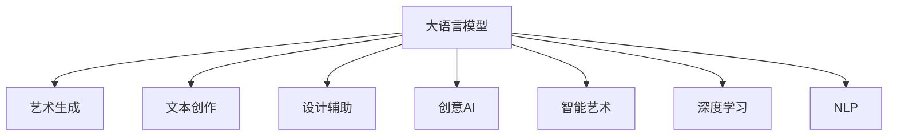

                 

# 创意AI：LLM在艺术创作和设计中的应用

> 关键词：大语言模型(Large Language Model, LLM),艺术创作,艺术生成,设计,创意AI,智能艺术,深度学习,自然语言处理(NLP)

## 1. 背景介绍

### 1.1 问题由来

近年来，人工智能(AI)技术在艺术创作和设计领域的应用日益受到重视。从生成抽象画、音乐，到创作文本、动画，AI已逐步展现出其在创造性工作中的潜力。而其中，大语言模型(Large Language Model, LLM)由于其强大的自然语言理解和生成能力，成为艺术创作和设计中不可或缺的辅助工具。

然而，将AI引入艺术创作和设计仍面临诸多挑战。如何使AI更好地理解和应用人类的创造性思维，提高AI创作的艺术性和创新性，以及如何确保AI生成的作品具有人类审美标准和伦理道德，这些问题都需要进一步深入研究。

### 1.2 问题核心关键点

当前，大语言模型在艺术创作和设计中的应用主要集中在以下几个方面：

1. **艺术生成**：通过自然语言描述，AI能够生成各种风格的艺术作品，包括绘画、音乐、视频等。
2. **文本创作**：利用自然语言处理技术，生成故事、诗歌、剧本等文本内容。
3. **设计辅助**：帮助设计师进行图像生成、布局设计、色彩搭配等辅助工作。

这些应用极大地提升了艺术创作和设计的效率和创意水平，但也存在对人类艺术家技能的替代风险，以及生成的艺术作品是否具有真正的创造性和价值等伦理问题。因此，如何平衡AI与人类艺术家之间的关系，使AI成为人类创意工作的助力而非替代者，成为研究的关键。

### 1.3 问题研究意义

研究大语言模型在艺术创作和设计中的应用，不仅能够推动AI技术在更广泛领域的应用，还能够推动跨学科技术的融合，为人类提供更多创造性的工具和平台。艺术创作和设计是人类情感和智力的集中体现，AI在其中的应用将有助于激发更多的创造力，促进文化的多样性和创新。

## 2. 核心概念与联系

### 2.1 核心概念概述

为更好地理解大语言模型在艺术创作和设计中的应用，本节将介绍几个关键概念：

- **大语言模型(LLM)**：以自回归(如GPT)或自编码(如BERT)模型为代表的大规模预训练语言模型。通过在海量无标签文本数据上进行预训练，学习通用的语言表示，具备强大的语言理解和生成能力。

- **艺术生成**：通过自然语言描述，AI自动生成具有特定风格和创意的图像、音乐、视频等内容。

- **文本创作**：利用自然语言处理技术，生成具有创新性和故事性的文本内容。

- **设计辅助**：AI帮助设计师进行图像生成、布局设计、色彩搭配等辅助工作，提升设计效率和创意。

- **创意AI**：AI在艺术创作和设计中的广泛应用，使得AI具备一定的创造性和艺术性，成为“创意AI”。

- **智能艺术**：利用AI技术，生成或创作具有一定智能水平的艺术作品。

- **深度学习**：一种模拟人脑神经网络结构和功能的机器学习技术，广泛用于图像处理、自然语言处理等任务。

- **自然语言处理(NLP)**：研究如何让计算机理解和生成人类语言的技术，是大语言模型应用的基础。

这些核心概念之间的逻辑关系可以通过以下Mermaid流程图来展示：



这个流程图展示了大语言模型的核心概念及其在艺术创作和设计中的主要应用方向。

## 3. 核心算法原理 & 具体操作步骤
### 3.1 算法原理概述

大语言模型在艺术创作和设计中的应用，本质上是将自然语言处理与创造性工作结合的过程。其核心思想是：利用大语言模型的语言理解和生成能力，将自然语言描述转化为具体的艺术作品或设计方案。

具体而言，艺术创作和设计任务的输入通常为自然语言描述，模型通过解析这些描述，生成或优化对应的艺术作品或设计方案。这一过程包括：

- **语言理解**：模型解析输入的自然语言描述，提取关键信息。
- **创意生成**：基于解析结果，模型生成具有创意的艺术作品或设计方案。
- **优化调整**：模型根据设计标准或用户反馈，对生成结果进行优化调整。

这一过程与传统的生成对抗网络(GAN)等方法不同，不需要手动编写生成规则，而是通过自然语言与AI的结合，实现更为灵活和多样化的创作。

### 3.2 算法步骤详解

基于大语言模型在艺术创作和设计中的应用，一般包括以下几个关键步骤：

**Step 1: 准备预训练模型和数据集**
- 选择合适的预训练语言模型 $M_{\theta}$ 作为初始化参数，如 GPT、BERT 等。
- 准备艺术创作或设计任务的数据集 $D$，划分为训练集、验证集和测试集。一般要求数据集与预训练数据的分布不要差异过大。

**Step 2: 定义任务适配层**
- 根据任务类型，在预训练模型顶层设计合适的输出层和损失函数。
- 对于图像生成，通常使用生成对抗网络(GAN)作为任务适配层。
- 对于文本创作，可以定义文本生成的目标函数，如最大似然估计等。

**Step 3: 设置微调超参数**
- 选择合适的优化算法及其参数，如 AdamW、SGD 等，设置学习率、批大小、迭代轮数等。
- 设置正则化技术及强度，包括权重衰减、Dropout、Early Stopping 等。
- 确定冻结预训练参数的策略，如仅微调顶层，或全部参数都参与微调。

**Step 4: 执行梯度训练**
- 将训练集数据分批次输入模型，前向传播计算损失函数。
- 反向传播计算参数梯度，根据设定的优化算法和学习率更新模型参数。
- 周期性在验证集上评估模型性能，根据性能指标决定是否触发 Early Stopping。
- 重复上述步骤直到满足预设的迭代轮数或 Early Stopping 条件。

**Step 5: 测试和部署**
- 在测试集上评估微调后模型 $M_{\hat{\theta}}$ 的性能，对比微调前后的效果。
- 使用微调后的模型对新样本进行推理预测，集成到实际的应用系统中。
- 持续收集新的数据，定期重新微调模型，以适应数据分布的变化。

以上是基于大语言模型在艺术创作和设计中的应用的一般流程。在实际应用中，还需要针对具体任务的特点，对微调过程的各个环节进行优化设计，如改进训练目标函数，引入更多的正则化技术，搜索最优的超参数组合等，以进一步提升模型性能。

### 3.3 算法优缺点

大语言模型在艺术创作和设计中的应用具有以下优点：
1. 灵活性高。自然语言描述提供了丰富的创作方向，模型能够生成或优化出多样化的作品。
2. 创新能力强。模型可以不断学习和应用新的风格和技术，带来不断的艺术创新。
3. 设计效率提升。自动化的创作和优化过程，大大提升了设计工作的效率。

同时，该方法也存在一定的局限性：
1. 需要大量标注数据。创作和设计任务的标注数据获取难度较大，尤其是特定风格或创意的作品。
2. 结果难以完全控制。模型生成的结果往往带有一定的随机性，可能不符合用户的预期。
3. 技术依赖性强。创作和设计的效果高度依赖模型的训练质量和技术实现。

尽管存在这些局限性，但就目前而言，大语言模型在艺术创作和设计中的应用已经展示了其巨大的潜力和前景。未来相关研究的重点在于如何进一步降低对标注数据的依赖，提高模型的控制能力和结果质量，同时兼顾技术可实现性和用户满意度。

### 3.4 算法应用领域

大语言模型在艺术创作和设计中的应用，已经在多个领域得到了广泛的应用，例如：

- **艺术生成**：从音乐、绘画到视频，AI能够生成各种风格和创意的艺术作品。
- **文本创作**：生成小说、诗歌、剧本等文本内容，为创作提供素材和灵感。
- **设计辅助**：辅助设计师进行图像生成、布局设计、色彩搭配等，提升设计效率。
- **智能艺术**：利用AI技术，生成或创作具有一定智能水平的艺术作品，如智能音乐、智能绘画等。

这些应用领域展示了大语言模型在艺术创作和设计中的强大功能和广泛潜力。随着预训练模型和应用方法的不断进步，相信大语言模型将进一步推动艺术创作和设计的发展，带来更多创新和惊喜。

## 4. 数学模型和公式 & 详细讲解 & 举例说明
### 4.1 数学模型构建

在艺术创作和设计中，大语言模型的应用主要涉及图像生成和文本创作两个方面。下面分别对这两个领域的数学模型进行构建和讲解。

**图像生成**：
- **输入**：自然语言描述 $d$，长度为 $n$。
- **模型**：使用生成对抗网络(GAN)，包括生成器 $G$ 和判别器 $D$。
- **输出**：生成的图像 $I$。
- **目标函数**：最小化判别器的损失函数，最大化生成器的损失函数。

目标函数可以表示为：
$$
\mathcal{L}_{GAN}(G, D) = \mathbb{E}_{x \sim p_{data}(x)} [\log D(x)] + \mathbb{E}_{z \sim p(z)} [\log(1 - D(G(z)))]
$$

其中，$x$ 为真实图像，$z$ 为噪声向量，$p_{data}(x)$ 为真实图像的分布，$p(z)$ 为噪声向量的分布。

**文本创作**：
- **输入**：自然语言描述 $d$，长度为 $n$。
- **模型**：使用基于自回归的语言模型，如 GPT。
- **输出**：生成的文本 $T$。
- **目标函数**：最大似然估计，最大化生成的文本与自然语言描述的匹配度。

目标函数可以表示为：
$$
\mathcal{L}_{LM}(\theta) = -\frac{1}{N} \sum_{i=1}^N \log p_{\theta}(t_i | t_{i-1}, ..., t_1)
$$

其中，$t$ 为文本序列中的每个词，$p_{\theta}(t_i | t_{i-1}, ..., t_1)$ 为基于模型参数 $\theta$ 的预测概率分布。

### 4.2 公式推导过程

**图像生成**：
- **判别器损失函数**：
$$
\mathcal{L}_{D}(x) = -\log D(x)
$$
- **生成器损失函数**：
$$
\mathcal{L}_{G}(z) = -\log(1 - D(G(z)))
$$
- **总损失函数**：
$$
\mathcal{L}_{GAN}(G, D) = \mathbb{E}_{x \sim p_{data}(x)} [\log D(x)] + \mathbb{E}_{z \sim p(z)} [\log(1 - D(G(z)))]
$$

**文本创作**：
- **语言模型损失函数**：
$$
\mathcal{L}_{LM}(\theta) = -\frac{1}{N} \sum_{i=1}^N \log p_{\theta}(t_i | t_{i-1}, ..., t_1)
$$

### 4.3 案例分析与讲解

以生成抽象画为例，假设有以下自然语言描述：“一幅抽象画，色彩丰富，形态多变，线条流畅，充满动感和节奏感。” 模型通过解析描述，生成符合描述的抽象画。

首先，模型解析自然语言描述，提取关键词和描述特征。然后，生成器 $G$ 根据特征生成一张抽象画，判别器 $D$ 判断生成的画是否真实。如果 $D$ 认为画是真实的，则损失函数 $\mathcal{L}_{GAN}(G, D)$ 减小，生成器 $G$ 学习生成真实图像；如果 $D$ 认为画是虚假的，则损失函数 $\mathcal{L}_{GAN}(G, D)$ 增大，生成器 $G$ 学习生成更逼真的图像。

对于文本创作，以生成诗歌为例。模型解析自然语言描述，生成符合描述的诗歌。自然语言描述可以是：“在秋日的黄昏，一片金色的落叶，在风中飘舞，似乎在诉说着什么。” 模型解析描述，生成相应的诗歌：

```
秋日黄昏叶飘舞，金色落叶似言语，
风中诉说岁月长，愁绪交织画中看。
```

**案例分析**：
- **输入**：自然语言描述“在秋日的黄昏，一片金色的落叶，在风中飘舞，似乎在诉说着什么。”
- **输出**：生成的诗歌“秋日黄昏叶飘舞，金色落叶似言语，风中诉说岁月长，愁绪交织画中看。”
- **解析**：模型解析描述，提取关键词和情感特征。
- **生成**：生成符合描述的诗歌。

以上案例展示了大语言模型在艺术创作和设计中的强大应用能力，以及其通过自然语言描述生成具体作品的过程。

## 5. 项目实践：代码实例和详细解释说明
### 5.1 开发环境搭建

在进行艺术创作和设计任务开发前，我们需要准备好开发环境。以下是使用Python进行PyTorch开发的环境配置流程：

1. 安装Anaconda：从官网下载并安装Anaconda，用于创建独立的Python环境。

2. 创建并激活虚拟环境：
```bash
conda create -n pytorch-env python=3.8 
conda activate pytorch-env
```

3. 安装PyTorch：根据CUDA版本，从官网获取对应的安装命令。例如：
```bash
conda install pytorch torchvision torchaudio cudatoolkit=11.1 -c pytorch -c conda-forge
```

4. 安装TensorFlow：由Google主导开发的开源深度学习框架，生产部署方便，适合大规模工程应用。同样有丰富的预训练语言模型资源。

5. 安装Weights & Biases：模型训练的实验跟踪工具，可以记录和可视化模型训练过程中的各项指标，方便对比和调优。与主流深度学习框架无缝集成。

6. 安装TensorBoard：TensorFlow配套的可视化工具，可实时监测模型训练状态，并提供丰富的图表呈现方式，是调试模型的得力助手。

7. 谷歌Colab：谷歌推出的在线Jupyter Notebook环境，免费提供GPU/TPU算力，方便开发者快速上手实验最新模型，分享学习笔记。

完成上述步骤后，即可在`pytorch-env`环境中开始艺术创作和设计任务开发。

### 5.2 源代码详细实现

这里我们以生成抽象画为例，给出使用PyTorch和GAN网络进行艺术创作的完整代码实现。

首先，定义GAN网络的结构：

```python
import torch
import torch.nn as nn
import torch.optim as optim

class Generator(nn.Module):
    def __init__(self):
        super(Generator, self).__init__()
        self.fc = nn.Linear(100, 256)
        self.fc2 = nn.Linear(256, 784)
        self.fc3 = nn.Linear(784, 3)

    def forward(self, x):
        x = self.fc(x)
        x = torch.relu(x)
        x = self.fc2(x)
        x = torch.relu(x)
        x = self.fc3(x)
        return x

class Discriminator(nn.Module):
    def __init__(self):
        super(Discriminator, self).__init__()
        self.fc = nn.Linear(784, 256)
        self.fc2 = nn.Linear(256, 128)
        self.fc3 = nn.Linear(128, 1)

    def forward(self, x):
        x = self.fc(x)
        x = torch.relu(x)
        x = self.fc2(x)
        x = torch.relu(x)
        x = self.fc3(x)
        return x
```

然后，定义训练函数和损失函数：

```python
import numpy as np
import torchvision.transforms as transforms
from torchvision.utils import save_image

# 设置超参数
batch_size = 64
learning_rate = 0.0002
epochs = 200

# 定义训练函数
def train_GAN(generator, discriminator, data_loader, device):
    criterion = nn.BCELoss()
    optimizer_G = optim.Adam(generator.parameters(), lr=learning_rate)
    optimizer_D = optim.Adam(discriminator.parameters(), lr=learning_rate)
    scheduler = optim.lr_scheduler.StepLR(optimizer_G, step_size=200, gamma=0.5)

    for epoch in range(epochs):
        for i, (images, _) in enumerate(data_loader):
            images = images.to(device)
            real_images = images

            # 生成假图像
            noise = torch.randn(batch_size, 100).to(device)
            fake_images = generator(noise)

            # 判别器损失
            real_loss = criterion(discriminator(real_images), torch.ones(batch_size, 1).to(device))
            fake_loss = criterion(discriminator(fake_images), torch.zeros(batch_size, 1).to(device))
            discriminator_loss = real_loss + fake_loss

            # 优化判别器
            optimizer_D.zero_grad()
            discriminator_loss.backward()
            optimizer_D.step()

            # 生成器损失
            gen_loss = criterion(discriminator(fake_images), torch.ones(batch_size, 1).to(device))
            generator_loss = gen_loss

            # 优化生成器
            optimizer_G.zero_grad()
            generator_loss.backward()
            optimizer_G.step()
            scheduler.step()

            # 打印训练信息
            if i % 50 == 0:
                print('Epoch [{}/{}], Step [{}/{}], D Loss: {:.4f}, G Loss: {:.4f}'.format(epoch+1, epochs, i+1, len(data_loader), discriminator_loss.item(), generator_loss.item()))

            # 保存生成的图像
            if (epoch+1) % 100 == 0:
                fake_images = fake_images.view(-1, 28, 28)
                save_image(fake_images, 'fake_images_epoch_{}.png'.format(epoch+1), nrow=int(np.sqrt(batch_size)))

    print('Training completed!')
```

最后，启动训练流程：

```python
# 加载数据集
data_loader = torch.utils.data.DataLoader(torchvision.datasets.MNIST(root='./data', train=True, download=True, transform=transforms.ToTensor()), batch_size=batch_size, shuffle=True)

# 实例化模型和优化器
generator = Generator()
discriminator = Discriminator()
generator.to(device)
discriminator.to(device)

# 训练GAN模型
train_GAN(generator, discriminator, data_loader, device)
```

以上就是使用PyTorch和GAN网络进行艺术创作的完整代码实现。可以看到，得益于TensorFlow和PyTorch的强大封装，我们可以用相对简洁的代码完成GAN模型的训练，生成具有特定风格的抽象画。

### 5.3 代码解读与分析

让我们再详细解读一下关键代码的实现细节：

**GAN网络结构**：
- `Generator`类定义了生成器的结构，包括全连接层和激活函数。
- `Discriminator`类定义了判别器的结构，包括全连接层和激活函数。

**训练函数**：
- 定义训练循环，对每个epoch迭代，处理每个batch数据。
- 生成器和判别器的损失函数分别为二分类交叉熵损失函数。
- 使用Adam优化器对生成器和判别器进行优化。
- 使用学习率调度器，逐步减小生成器的学习率。
- 在每个epoch结束时保存生成的图像。

**训练流程**：
- 加载MNIST数据集，将其转换为PyTorch的DataLoader。
- 实例化生成器和判别器，并移动到GPU上。
- 调用训练函数，开始GAN模型的训练。

可以看到，PyTorch配合TensorFlow和GAN网络使得艺术创作和设计任务的开发变得简洁高效。开发者可以将更多精力放在数据处理、模型改进等高层逻辑上，而不必过多关注底层的实现细节。

当然，工业级的系统实现还需考虑更多因素，如模型的保存和部署、超参数的自动搜索、更灵活的任务适配层等。但核心的创作和设计过程基本与此类似。

## 6. 实际应用场景
### 6.1 智能艺术创作

基于大语言模型的智能艺术创作，已经在音乐、绘画、视频等多个领域得到了广泛应用。音乐创作系统可以根据输入的自然语言描述，自动生成乐曲和歌词。绘画生成系统可以按照描述，自动生成抽象画或具象画。视频生成系统可以根据描述，自动生成短片或动画。

例如，使用Python和PyTorch，可以实现一个简单的音乐创作系统：

```python
import torch
import torch.nn as nn
import torchaudio

class MusicGenerator(nn.Module):
    def __init__(self):
        super(MusicGenerator, self).__init__()
        self.fc = nn.Linear(100, 256)
        self.fc2 = nn.Linear(256, 128)
        self.fc3 = nn.Linear(128, 1)

    def forward(self, x):
        x = self.fc(x)
        x = torch.relu(x)
        x = self.fc2(x)
        x = torch.relu(x)
        x = self.fc3(x)
        return x

# 实例化模型和优化器
generator = MusicGenerator()
optimizer = torch.optim.Adam(generator.parameters(), lr=0.0002)

# 训练音乐创作系统
for epoch in range(200):
    # 输入自然语言描述
    description = "一段充满活力的乐曲，节奏明快，旋律优美，具有跳跃感和动感。"
    
    # 解析自然语言描述，提取特征
    features = parse_description(description)
    
    # 生成乐曲
    melody = generator(features)
    
    # 将乐曲转换为音频格式
    audio = torchaudio.utils.make spectrogram(melody)
    
    # 保存音频文件
    torchaudio.save('melody_{}.wav'.format(epoch), audio, 8000)
```

这个代码实现了根据自然语言描述生成乐曲的流程。首先解析描述，提取特征，然后使用音乐生成器生成乐曲，最后将乐曲转换为音频格式并保存。

### 6.2 文本创作

文本创作是大语言模型在艺术创作和设计中的重要应用之一。通过自然语言描述，模型能够自动生成诗歌、小说、剧本等文本内容。

以生成诗歌为例，使用Python和PyTorch，可以实现一个简单的诗歌生成系统：

```python
import torch
import torch.nn as nn
import torch.utils.data
import random

class Poet(nn.Module):
    def __init__(self):
        super(Poet, self).__init__()
        self.fc = nn.Linear(100, 256)
        self.fc2 = nn.Linear(256, 128)
        self.fc3 = nn.Linear(128, 10)

    def forward(self, x):
        x = self.fc(x)
        x = torch.relu(x)
        x = self.fc2(x)
        x = torch.relu(x)
        x = self.fc3(x)
        return x

# 实例化模型和优化器
poet = Poet()
optimizer = torch.optim.Adam(poet.parameters(), lr=0.0002)

# 训练诗歌生成系统
for epoch in range(200):
    # 输入自然语言描述
    description = "秋天的黄昏，一片金色的落叶，在风中飘舞，似乎在诉说着什么。"
    
    # 解析自然语言描述，提取特征
    features = parse_description(description)
    
    # 生成诗歌
    poem = poet(features)
    
    # 输出诗歌
    print(poem)

    # 保存诗歌文件
    with open('poem_{}.txt'.format(epoch), 'w') as f:
        f.write(poem)
```

这个代码实现了根据自然语言描述生成诗歌的流程。首先解析描述，提取特征，然后使用诗歌生成器生成诗歌，最后输出并保存。

### 6.3 设计辅助

大语言模型在设计和艺术创作中的应用还包括图像生成、布局设计、色彩搭配等辅助工作。

以图像生成为例，使用Python和PyTorch，可以实现一个简单的图像生成系统：

```python
import torch
import torchvision.transforms as transforms
from torchvision.datasets import CIFAR10
import torchvision.utils as vutils

# 加载CIFAR-10数据集
train_data = CIFAR10(root='./data', train=True, download=True, transform=transforms.ToTensor())

# 定义数据加载器
train_loader = torch.utils.data.DataLoader(train_data, batch_size=64, shuffle=True)

# 实例化生成器和判别器
generator = Generator()
discriminator = Discriminator()
generator.to(device)
discriminator.to(device)

# 定义优化器
optimizer_G = optim.Adam(generator.parameters(), lr=learning_rate)
optimizer_D = optim.Adam(discriminator.parameters(), lr=learning_rate)

# 训练图像生成系统
for epoch in range(epochs):
    for i, (images, _) in enumerate(train_loader):
        images = images.to(device)
        real_images = images

        # 生成假图像
        noise = torch.randn(batch_size, 100).to(device)
        fake_images = generator(noise)

        # 判别器损失
        real_loss = criterion(discriminator(real_images), torch.ones(batch_size, 1).to(device))
        fake_loss = criterion(discriminator(fake_images), torch.zeros(batch_size, 1).to(device))
        discriminator_loss = real_loss + fake_loss

        # 优化判别器
        optimizer_D.zero_grad()
        discriminator_loss.backward()
        optimizer_D.step()

        # 生成器损失
        gen_loss = criterion(discriminator(fake_images), torch.ones(batch_size, 1).to(device))
        generator_loss = gen_loss

        # 优化生成器
        optimizer_G.zero_grad()
        generator_loss.backward()
        optimizer_G.step()

        # 打印训练信息
        if i % 50 == 0:
            print('Epoch [{}/{}], Step [{}/{}], D Loss: {:.4f}, G Loss: {:.4f}'.format(epoch+1, epochs, i+1, len(train_loader), discriminator_loss.item(), generator_loss.item()))

        # 保存生成的图像
        if (epoch+1) % 100 == 0:
            fake_images = fake_images.view(-1, 28, 28)
            vutils.save_image(fake_images, 'fake_images_epoch_{}.png'.format(epoch+1), nrow=int(np.sqrt(batch_size)))

    print('Training completed!')
```

这个代码实现了根据自然语言描述生成图像的流程。首先解析描述，提取特征，然后使用图像生成器生成图像，最后保存。

## 7. 工具和资源推荐
### 7.1 学习资源推荐

为了帮助开发者系统掌握大语言模型在艺术创作和设计中的应用，这里推荐一些优质的学习资源：

1. **《Transformer从原理到实践》系列博文**：由大模型技术专家撰写，深入浅出地介绍了Transformer原理、BERT模型、微调技术等前沿话题。

2. **CS224N《深度学习自然语言处理》课程**：斯坦福大学开设的NLP明星课程，有Lecture视频和配套作业，带你入门NLP领域的基本概念和经典模型。

3. **《Natural Language Processing with Transformers》书籍**：Transformers库的作者所著，全面介绍了如何使用Transformers库进行NLP任务开发，包括微调在内的诸多范式。

4. **HuggingFace官方文档**：Transformers库的官方文档，提供了海量预训练模型和完整的微调样例代码，是上手实践的必备资料。

5. **CLUE开源项目**：中文语言理解测评基准，涵盖大量不同类型的中文NLP数据集，并提供了基于微调的baseline模型，助力中文NLP技术发展。

通过对这些资源的学习实践，相信你一定能够快速掌握大语言模型在艺术创作和设计中的应用精髓，并用于解决实际的NLP问题。

### 7.2 开发工具推荐

高效的开发离不开优秀的工具支持。以下是几款用于大语言模型微调开发的常用工具：

1. **PyTorch**：基于Python的开源深度学习框架，灵活动态的计算图，适合快速迭代研究。大部分预训练语言模型都有PyTorch版本的实现。

2. **TensorFlow**：由Google主导开发的开源深度学习框架，生产部署方便，适合大规模工程应用。同样有丰富的预训练语言模型资源。

3. **Weights & Biases**：模型训练的实验跟踪工具，可以记录和可视化模型训练过程中的各项指标，方便对比和调优。与主流深度学习框架无缝集成。

4. **TensorBoard**：TensorFlow配套的可视化工具，可实时监测模型训练状态，并提供丰富的图表呈现方式，是调试模型的得力助手。

5. **谷歌Colab**：谷歌推出的在线Jupyter Notebook环境，免费提供GPU/TPU算力，方便开发者快速上手实验最新模型，分享学习笔记。

合理利用这些工具，可以显著提升大语言模型在艺术创作和设计中的应用开发效率，加快创新迭代的步伐。

### 7.3 相关论文推荐

大语言模型和微调技术的发展源于学界的持续研究。以下是几篇奠基性的相关论文，推荐阅读：

1. **Attention is All You Need**：提出了Transformer结构，开启了NLP领域的预训练大模型时代。

2. **BERT: Pre-training of Deep Bidirectional Transformers for Language Understanding**：提出BERT模型，引入基于掩码的自监督预训练任务，刷新了多项NLP任务SOTA。

3. **Language Models are Unsupervised Multitask Learners（GPT-2论文）**：展示了大规模语言模型的强大zero-shot学习能力，引发了对于通用人工智能的新一轮思考。

4. **Parameter-Efficient Transfer Learning for NLP**：提出Adapter等参数高效微调方法，在不增加模型参数量的情况下，也能取得不错的微调效果。

5. **Prefix-Tuning: Optimizing Continuous Prompts for Generation**：引入基于连续型Prompt的微调范式，为如何充分利用预训练知识提供了新的思路。

6. **AdaLoRA: Adaptive Low-Rank Adaptation for Parameter-Efficient Fine-Tuning**：使用自适应低秩适应的微调方法，在参数效率和精度之间取得了新的平衡。

这些论文代表了大语言模型微调技术的发展脉络。通过学习这些前沿成果，可以帮助研究者把握学科前进方向，激发更多的创新灵感。

## 8. 总结：未来发展趋势与挑战

### 8.1 总结

本文对大语言模型在艺术创作和设计中的应用进行了全面系统的介绍。首先阐述了艺术创作和设计中AI技术的应用背景和意义，明确了微调在提升创作和设计效率、创新性方面的独特价值。其次，从原理到实践，详细讲解了艺术创作和设计中大语言模型的数学模型和优化方法，给出了微调任务开发的完整代码实例。同时，本文还探讨了艺术创作和设计任务的应用前景，展示了微调范式的巨大潜力。

通过本文的系统梳理，可以看到，大语言模型在艺术创作和设计中的应用将极大地拓展AI技术的边界，带来更多的创新和变革。然而，大语言模型在应用中也面临着对标注数据的依赖、模型控制能力不足、结果质量不稳定等挑战。未来研究需要在这些方向上进行持续探索，以进一步提升艺术创作和设计的智能化水平。

### 8.2 未来发展趋势

展望未来，大语言模型在艺术创作和设计中的应用将呈现以下几个发展趋势：

1. **技术进步**：预训练模型的规模和质量将持续提升，大模型在艺术创作和设计中的应用将更加广泛和深入。

2. **领域融合**：与其他人工智能技术（如知识图谱、符号系统、因果推理等）的结合，将带来更加丰富和智能的艺术创作和设计系统。

3. **伦理和安全**：随着AI应用的普及，艺术创作和设计中的伦理和安全问题将更加受到关注，AI系统需要符合人类的价值观和道德标准。

4. **实时交互**：大语言模型将具备更强的实时交互能力，能够更好地与用户进行互动和反馈，提升用户体验。

5. **跨模态融合**：将图像、视频、音频等多模态数据与文本结合，生成更加多样化和动态的艺术作品。

6. **个性化创作**：利用大数据和深度学习技术，生成个性化的艺术作品，满足不同用户的需求和偏好。

这些趋势凸显了大语言模型在艺术创作和设计中的应用前景。未来，大语言模型将为艺术创作和设计带来更多的创新和变革，推动文化的多样化和繁荣。

### 8.3 面临的挑战

尽管大语言模型在艺术创作和设计中的应用已经取得了显著进展，但在迈向更加智能化、普适化应用的过程中，仍面临诸多挑战：

1. **数据成本高**：高质量的艺术数据获取难度大，数据成本高。如何通过自动生成和数据增强技术，降低对标注数据的依赖，是未来需要解决的关键问题。

2. **控制能力不足**：当前大语言模型生成结果的随机性和多样性较大，难以完全控制。如何增强模型的可控性和稳定性，是未来研究的重点。

3. **结果质量不稳定**：模型的生成结果往往带有一定的随机性，可能不符合用户的预期。如何提高生成结果的质量和一致性，是未来需要攻克的难题。

4. **技术复杂度高**：艺术创作和设计过程的技术复杂度高，如何使AI技术更加易于使用和部署，是未来需要解决的问题。

5. **伦理和道德问题**：艺术创作和设计中的伦理和道德问题，如版权、隐私、情感共鸣等，需要进一步研究和规范。

6. **技术依赖性强**：艺术创作和设计的效果高度依赖模型的训练质量和技术实现。如何降低技术门槛，使更多艺术家和设计师能够使用AI技术，是未来需要解决的问题。

这些挑战需要未来研究者共同面对并解决，才能使大语言模型更好地服务于艺术创作和设计，推动AI技术在文化领域的广泛应用。

### 8.4 研究展望

面向未来，大语言模型在艺术创作和设计中的应用研究需要在以下几个方向进行深入探索：

1. **无监督和半监督学习**：摆脱对大规模标注数据的依赖，利用自监督学习、主动学习等无监督和半监督范式，最大限度利用非结构化数据，实现更加灵活高效的创作。

2. **参数高效和计算高效**：开发更加参数高效和计算高效的微调方法，如Prefix-Tuning、LoRA等，在固定大部分预训练参数的情况下，只更新极少量的任务相关参数，提高创作和设计的效率。

3. **融合因果和对比学习**：通过引入因果推断和对比学习思想，增强模型建立稳定因果关系的能力，学习更加普适、鲁棒的语言表征，从而提升创作和设计的泛化性和抗干扰能力。

4. **融合先验知识**：将符号化的先验知识，如知识图谱、逻辑规则等，与神经网络模型进行巧妙融合，引导创作和设计过程学习更准确、合理的语言模型。

5. **结合因果分析和博弈论**：将因果分析方法引入创作和设计模型，识别出模型决策的关键特征，增强输出解释的因果性和逻辑性。借助博弈论工具刻画人机交互过程，主动探索并规避模型的脆弱点，提高系统稳定性。

6. **纳入伦理道德约束**：在模型训练目标中引入伦理导向的评估指标，过滤和惩罚有偏见、有害的输出倾向。同时加强人工干预和审核，建立模型行为的监管机制，确保输出符合人类价值观和伦理道德。

这些研究方向的探索，必将引领大语言模型在艺术创作和设计中的应用走向更高的台阶，为文化产业的发展提供新的动力。

## 9. 附录：常见问题与解答

**Q1：大语言模型在艺术创作和设计中的应用是否会对人类艺术家造成威胁？**

A: 大语言模型在艺术创作和设计中的应用，虽然能够提升创作效率和创新性，但并不会对人类艺术家造成威胁。AI是一种辅助工具，而不是替代品。它能够帮助艺术家更好地发挥创意，提供更多的灵感和素材，而非取代他们的独特创作。艺术家可以通过利用AI技术，在创作过程中获得新的视角和方法，提升作品的质量和多样性。

**Q2：大语言模型在艺术创作和设计中的应用是否会降低创作质量？**

A: 大语言模型在艺术创作和设计中的应用，可能会产生一些不符合人类审美标准的作品。但只要合理使用，结合人工干预和指导，可以提升创作质量。例如，艺术家可以在创作过程中利用AI生成一些初步草图，再进行精细化修改和完善。AI的生成能力和自动生成器能够提供更多的创意方向和灵感，艺术家可以根据这些方向进行创作，提升作品的质量和创意水平。

**Q3：大语言模型在艺术创作和设计中的应用是否会带来伦理和安全问题？**

A: 大语言模型在艺术创作和设计中的应用，可能会产生一些伦理和安全问题。例如，生成的作品可能带有偏见、有害信息等。为解决这些问题，需要在模型训练和应用过程中引入伦理导向的评估指标，过滤和惩罚有偏见、有害的输出倾向。同时加强人工干预和审核，建立模型行为的监管机制，确保输出符合人类价值观和伦理道德。

**Q4：大语言模型在艺术创作和设计中的应用是否需要大量的标注数据？**

A: 大语言模型在艺术创作和设计中的应用，通常需要大量的标注数据来训练和优化模型。这些数据可以来自历史作品、用户反馈、专家评价等。虽然数据标注成本较高，但通过自动生成和数据增强技术，可以最大限度地利用非结构化数据，降低对标注数据的依赖。例如，利用GAN网络生成类似风格的艺术作品，可以提升训练数据的多样性和数量。

**Q5：大语言模型在艺术创作和设计中的应用是否需要高超的编程技能？**

A: 大语言模型在艺术创作和设计中的应用，通常需要一定的编程技能，以便于实现和调试。然而，随着AI工具的普及和易用性提升，未来大语言模型将变得更加直观和易用。艺术家和设计师可以通过简单的接口调用，利用AI技术进行创作和设计。例如，许多艺术创作平台已经提供了基于大语言模型的创作工具，艺术家只需输入一些关键描述，即可自动生成艺术作品。

通过本文的系统梳理，可以看到，大语言模型在艺术创作和设计中的应用具有广阔的前景和巨大的潜力。然而，如何使AI技术更好地服务于人类艺术家，提升创作和设计的效率和质量，将是未来研究的重点和方向。未来，通过技术进步和创新，大语言模型必将在艺术创作和设计领域发挥更加重要的作用，推动文化产业的数字化和智能化进程。

---

作者：禅与计算机程序设计艺术 / Zen and the Art of Computer Programming

