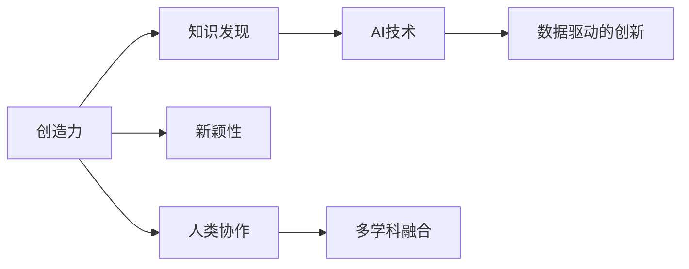

                 

# 创造力与知识发现的关系

在人工智能（AI）领域，创造力与知识发现（Knowledge Discovery）之间的关系一直是研究的热点。本文将深入探讨这一关系，包括其定义、原理以及如何通过AI技术实现这一过程。

## 1. 背景介绍

创造力在现代社会的各个层面都至关重要，从艺术创作到科技创新，无处不在。然而，尽管创造力对社会和经济发展具有深远影响，但其机制仍未被完全理解。知识发现则是指从大规模数据中提取有用信息的过程，是AI技术的重要应用之一。

### 1.1 问题的由来

随着大数据、云计算和AI技术的不断发展，知识发现的效率和准确性得到了显著提升。与此同时，如何利用这些技术来激发创造力，成为学界和业界共同关注的问题。研究表明，知识发现不仅能够帮助人们更有效地获取信息，还能在此基础上产生新的想法，从而促进创新。

### 1.2 问题核心关键点

1. 创造力的定义和测量。
2. 知识发现的具体实现方法。
3. 创造力和知识发现之间的相互影响。
4. AI技术在促进知识发现和创造力中的作用。

## 2. 核心概念与联系

### 2.1 核心概念概述

- **创造力**：指产生新的、有价值的想法或解决方案的能力。它包括原创性、新颖性、实用性和创新性等多个维度。
- **知识发现**：指通过数据分析、模式识别等技术，从数据中提取有用信息，以支持决策或发现新知识的过程。
- **人工智能**：指通过计算机模拟人类智能行为的技术，包括机器学习、深度学习、自然语言处理等。

### 2.2 核心概念原理和架构的 Mermaid 流程图



该流程图展示了创造力、知识发现和AI技术之间的关系。创造力依赖于新颖性的产生，而新颖性往往来自于知识发现。AI技术通过处理大规模数据，辅助知识发现，进而促进创造力的发展。此外，人类协作和多学科融合也是创造力产生的重要因素。

## 3. 核心算法原理 & 具体操作步骤

### 3.1 算法原理概述

基于AI技术进行知识发现和创造力激发，主要包括以下几个关键步骤：

1. **数据收集与预处理**：收集相关领域的数据，并进行清洗、标注等预处理工作。
2. **特征提取**：通过向量化技术将数据转换为模型可以处理的形式。
3. **模型训练与评估**：选择适当的算法进行训练，并通过验证集评估模型性能。
4. **知识发现与创造力激发**：利用训练好的模型，从数据中提取知识，并结合人类创造力，生成新的想法或解决方案。

### 3.2 算法步骤详解

1. **数据收集与预处理**：
   - **数据来源**：包括公开数据集、互联网爬取的数据、企业内部数据等。
   - **预处理**：包括去除噪声、处理缺失值、归一化等操作，以提高数据质量。

2. **特征提取**：
   - **技术**：常用的特征提取方法包括TF-IDF、Word2Vec、BERT等。
   - **目标**：将数据转换为向量形式，便于模型处理。

3. **模型训练与评估**：
   - **算法**：常用的算法包括支持向量机（SVM）、随机森林（Random Forest）、神经网络（Neural Network）等。
   - **评估指标**：包括准确率、召回率、F1分数等。

4. **知识发现与创造力激发**：
   - **技术**：结合自然语言处理（NLP）、计算机视觉（CV）等技术，提取知识并生成创意。
   - **示例**：使用BERT模型进行文本分类，提取关键信息；使用GAN生成新的艺术作品等。

### 3.3 算法优缺点

**优点**：
- **高效性**：AI技术可以快速处理大量数据，提高知识发现的效率。
- **准确性**：通过优化算法，可以提高知识发现的准确性。
- **创造力激发**：结合人类创造力，生成新的想法和解决方案。

**缺点**：
- **数据质量依赖**：模型的效果高度依赖于数据的质量和代表性。
- **算法复杂度**：复杂的算法可能难以解释，增加了理解和使用的难度。
- **创造力局限**：AI无法完全替代人类的创造力，仍需要人类参与。

### 3.4 算法应用领域

基于AI的知识发现和创造力激发技术，已经在多个领域得到了应用：

1. **医疗**：通过分析医学数据，发现新药物、治疗方案等。
2. **金融**：通过分析金融数据，发现新的投资策略、风险管理方法等。
3. **艺术**：利用生成对抗网络（GAN）等技术，生成新的艺术作品。
4. **教育**：通过分析学生的学习数据，发现学习模式和改进教学方法。
5. **智能制造**：通过分析生产数据，优化生产流程和提高产品质量。

## 4. 数学模型和公式 & 详细讲解 & 举例说明

### 4.1 数学模型构建

知识发现的过程可以通过数学模型进行建模。以下是一个简单的数学模型示例：

假设有一组数据集 $D=\{(x_i,y_i)\}_{i=1}^N$，其中 $x_i$ 为特征向量，$y_i$ 为标签。目标是从数据中学习一个模型 $f(x)$，使其能够准确预测标签 $y$。

$$
\min_{f(x)} \frac{1}{N}\sum_{i=1}^N L(f(x_i), y_i)
$$

其中 $L$ 为损失函数，常见的有均方误差（MSE）、交叉熵（Cross-Entropy）等。

### 4.2 公式推导过程

以线性回归为例，假设模型为 $f(x)=wx+b$，目标为最小化均方误差：

$$
\min_{w,b} \frac{1}{N}\sum_{i=1}^N (y_i - f(x_i))^2
$$

通过求导得到 $w$ 和 $b$ 的解：

$$
w = (\mathbf{X}^T\mathbf{X})^{-1}\mathbf{X}^T\mathbf{y}
$$

其中 $\mathbf{X}$ 为特征矩阵，$\mathbf{y}$ 为标签向量。

### 4.3 案例分析与讲解

假设我们有一组电影评分数据集，目标是通过评分预测用户是否会喜欢某部电影。可以将评分数据作为特征 $x$，用户是否喜欢作为标签 $y$，应用线性回归模型进行预测。通过模型训练，我们可以发现评分和用户喜好之间的关系，并用于新电影的推荐。

## 5. 项目实践：代码实例和详细解释说明

### 5.1 开发环境搭建

为了进行知识发现和创造力激发，我们首先需要搭建开发环境。以下是使用Python进行TensorFlow开发的简单流程：

1. 安装Anaconda：从官网下载并安装Anaconda，用于创建独立的Python环境。

2. 创建并激活虚拟环境：
```bash
conda create -n tf-env python=3.8 
conda activate tf-env
```

3. 安装TensorFlow：根据CUDA版本，从官网获取对应的安装命令。例如：
```bash
conda install tensorflow==2.7 -c tf
```

4. 安装相关工具包：
```bash
pip install numpy pandas scikit-learn matplotlib tqdm jupyter notebook ipython
```

### 5.2 源代码详细实现

下面以线性回归为例，展示如何使用TensorFlow进行模型训练和评估。

```python
import tensorflow as tf
import numpy as np
import matplotlib.pyplot as plt

# 准备数据
x_train = np.random.rand(100, 1)
y_train = 3 * x_train + 1 + np.random.randn(100, 1)
x_test = np.random.rand(10, 1)
y_test = 3 * x_test + 1 + np.random.randn(10, 1)

# 定义模型
w = tf.Variable(np.random.randn(), dtype=tf.float32)
b = tf.Variable(np.random.randn(), dtype=tf.float32)
model = tf.keras.Sequential([tf.keras.layers.Dense(1)])

# 定义损失函数和优化器
loss_fn = tf.keras.losses.MeanSquaredError()
optimizer = tf.keras.optimizers.SGD(learning_rate=0.01)

# 训练模型
for i in range(1000):
    with tf.GradientTape() as tape:
        y_pred = model(x_train)
        loss = loss_fn(y_pred, y_train)
    grads = tape.gradient(loss, [w, b])
    optimizer.apply_gradients(zip(grads, [w, b]))

# 评估模型
y_pred = model(x_test)
mse = loss_fn(y_pred, y_test).numpy()
plt.scatter(x_test, y_test)
plt.plot(x_test, y_pred)
plt.show()
```

### 5.3 代码解读与分析

**数据准备**：
- 使用Numpy生成随机数据，作为模型输入和标签。
- 将输入和标签作为张量传递给模型。

**模型定义**：
- 定义一个线性回归模型，使用TensorFlow的Sequential API。
- 添加一层Dense层，输出1个节点，表示回归任务。

**损失函数和优化器**：
- 使用均方误差作为损失函数。
- 使用随机梯度下降（SGD）优化器进行参数更新。

**模型训练**：
- 使用GradientTape记录梯度，计算损失函数。
- 根据梯度更新模型参数。

**模型评估**：
- 在测试集上预测输出。
- 计算均方误差（MSE），并可视化预测结果。

## 6. 实际应用场景

### 6.1 医疗诊断

在医疗领域，基于AI的知识发现和创造力激发技术可以用于诊断和治疗方案的发现。通过分析大量医学数据，可以发现新的疾病模式和治疗方法。例如，通过分析基因数据，可以发现新的基因突变与疾病之间的关系。

### 6.2 金融风险管理

在金融领域，知识发现技术可以用于发现新的投资策略和风险管理方法。通过分析市场数据，可以发现新的市场趋势和投资机会。例如，通过分析历史交易数据，可以发现新的交易模式和风险因素。

### 6.3 智能制造

在智能制造领域，知识发现技术可以用于优化生产流程和提高产品质量。通过分析生产数据，可以发现生产过程中的瓶颈和优化点。例如，通过分析设备运行数据，可以发现设备的故障模式和维护周期。

## 7. 工具和资源推荐

### 7.1 学习资源推荐

为了帮助开发者掌握知识发现和创造力激发的技术，以下是一些优质的学习资源：

1. **TensorFlow官方文档**：提供了TensorFlow的详细文档和示例，帮助开发者快速上手。
2. **Kaggle**：全球最大的数据科学竞赛平台，提供了丰富的数据集和案例分析，适合实战练习。
3. **Coursera**：提供多个机器学习和数据科学相关的课程，包括深度学习、自然语言处理等。
4. **GitHub**：可以找到许多开源项目和代码示例，帮助开发者快速学习和实践。
5. **KDnuggets**：提供了大量数据科学和机器学习相关的文章和资源，适合深度学习。

### 7.2 开发工具推荐

以下是一些常用的开发工具：

1. **Jupyter Notebook**：轻量级的交互式开发环境，适合快速迭代和实验。
2. **TensorBoard**：可视化工具，可以帮助开发者监测模型训练状态。
3. **Keras**：高层次API，提供简单易用的模型构建和训练接口。
4. **PyTorch**：灵活的深度学习框架，支持动态计算图。
5. **Scikit-learn**：经典的机器学习库，提供多种算法和工具。

### 7.3 相关论文推荐

以下是几篇奠基性的相关论文，推荐阅读：

1. **Google Brain团队提出的深度学习技术**：展示了深度学习在图像、语音、自然语言处理等领域的应用。
2. **IBM Watson**：介绍了IBM Watson的架构和应用，展示了知识发现和创造力激发技术的实际应用。
3. **DeepMind AlphaGo**：展示了AlphaGo如何在围棋中战胜人类，展示了AI技术在游戏领域的潜力。
4. **GAN技术的提出**：展示了生成对抗网络在图像生成和艺术创作中的应用。
5. **自然语言处理（NLP）技术的发展**：展示了NLP技术在文本分析和生成中的应用。

## 8. 总结：未来发展趋势与挑战

### 8.1 研究成果总结

本文深入探讨了创造力与知识发现之间的关系，并展示了通过AI技术实现这一过程的方法和工具。研究表明，AI技术可以显著提高知识发现的效率和准确性，并在多种应用领域中展现出巨大潜力。

### 8.2 未来发展趋势

1. **多模态数据融合**：未来的知识发现技术将更加注重多模态数据的融合，结合视觉、语音、文本等多种信息，提高知识发现的全面性和准确性。
2. **自适应学习**：未来的知识发现技术将更加注重自适应学习，根据用户需求和数据变化动态调整模型。
3. **人机协作**：未来的知识发现技术将更加注重人机协作，结合人类创造力和AI技术，实现更高效的知识发现和创造力激发。

### 8.3 面临的挑战

尽管AI技术在知识发现和创造力激发方面取得了显著进展，但仍面临诸多挑战：

1. **数据质量问题**：知识发现的效果高度依赖于数据的质量和代表性，如何获取高质量的数据是关键问题。
2. **算法复杂性**：复杂的算法增加了理解和使用的难度，需要更加易于理解和使用的算法。
3. **创造力局限**：AI无法完全替代人类的创造力，仍需要人类参与。

### 8.4 研究展望

未来的研究需要在以下几个方面寻求新的突破：

1. **多模态融合技术**：如何更好地融合视觉、语音、文本等多种信息，提高知识发现的全面性和准确性。
2. **自适应学习算法**：如何设计更加自适应的学习算法，根据用户需求和数据变化动态调整模型。
3. **人机协作技术**：如何更好地结合人类创造力和AI技术，实现更高效的知识发现和创造力激发。

## 9. 附录：常见问题与解答

**Q1: 什么是知识发现？**

A: 知识发现是指通过数据分析、模式识别等技术，从数据中提取有用信息的过程，以支持决策或发现新知识。

**Q2: 知识发现和创造力之间的关系是什么？**

A: 知识发现和创造力之间存在密切的关系。知识发现能够帮助人们获取和理解更多的信息，从而激发新的想法和解决方案。

**Q3: 如何通过AI技术实现知识发现和创造力激发？**

A: 通过数据收集、预处理、特征提取、模型训练和评估等步骤，使用AI技术实现知识发现和创造力激发。常用的技术包括机器学习、深度学习、自然语言处理等。

**Q4: 知识发现和创造力激发技术在实际应用中面临哪些挑战？**

A: 数据质量、算法复杂性、创造力局限等问题是知识发现和创造力激发技术面临的主要挑战。

**Q5: 未来知识发现和创造力激发技术的发展方向是什么？**

A: 多模态融合、自适应学习、人机协作等技术将推动知识发现和创造力激发技术的发展。

---

作者：禅与计算机程序设计艺术 / Zen and the Art of Computer Programming

