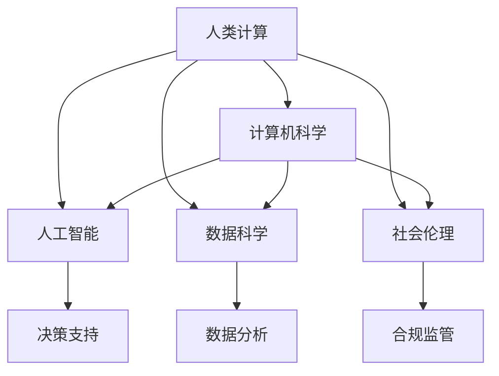

                 

# 创造更美好的明天：人类计算的积极作用

> 关键词：人类计算,计算机科学,人工智能,数据科学,社会发展,未来展望

## 1. 背景介绍

### 1.1 问题由来
近年来，随着技术的快速发展，计算机科学已经逐渐成为推动人类进步的关键力量。从简单的计算到复杂的模拟，从科学研究的辅助到商业决策的支持，计算机技术正在各个领域中发挥着越来越重要的作用。然而，技术的发展同时也带来了新的挑战和风险，需要我们对人类计算的积极作用进行深入探讨。

### 1.2 问题核心关键点
人类计算的积极作用主要体现在以下几个方面：

1. **提升生产力**：计算机技术能够大幅提高生产效率，减少人力成本，促进经济增长。
2. **推动科学发展**：通过大规模数据处理和复杂模拟，计算机技术为科学研究提供了新的工具和方法。
3. **改善人类生活质量**：人工智能、机器学习等技术在医疗、教育、交通等领域的应用，提升了人们的生活水平。
4. **促进社会进步**：计算机科学不仅仅是技术问题，更关乎社会伦理、法律和政策。

然而，人类计算也面临着数据隐私、伦理道德、技术安全等问题，需要我们在推动技术发展的同时，注重其对社会的积极影响。

### 1.3 问题研究意义
研究人类计算的积极作用，对于推动社会进步、提升人类生活质量、确保技术健康发展具有重要意义：

1. **促进经济增长**：通过提升生产力，计算机技术可以驱动经济发展，创造更多的就业机会。
2. **推动科学研究**：计算能力的大幅提升，使得科学家能够处理更复杂的数据，发现新的科学规律。
3. **改善公共服务**：计算机技术在医疗、教育、交通等领域的应用，可以显著提升公共服务的效率和质量。
4. **提升个人幸福感**：通过智能家居、个性化推荐等应用，计算机技术可以改善人们的生活品质，提升幸福感。
5. **促进社会治理**：计算机技术在城市管理、环境监测、公共安全等领域的应用，可以提升社会治理水平。

因此，研究人类计算的积极作用，是推动技术健康发展的关键，对于构建美好未来具有深远的意义。

## 2. 核心概念与联系

### 2.1 核心概念概述

为更好地理解人类计算的积极作用，本节将介绍几个密切相关的核心概念：

- **人类计算(Human Computing)**：指通过计算机技术提升人类智能的过程。计算机不仅能够处理数据，还能辅助人类进行复杂决策、创造性工作等。
- **计算机科学(Computer Science)**：研究计算机技术的基础理论和应用方法，涵盖算法、数据结构、人工智能、网络安全等众多领域。
- **人工智能(Artificial Intelligence, AI)**：通过计算机模拟人类智能，包括学习、推理、感知等能力，目标是实现机器的自主决策和行为。
- **数据科学(Data Science)**：利用计算机技术处理和分析数据，发现数据中的规律和趋势，支持决策制定。
- **社会伦理(Social Ethics)**：在计算机技术应用过程中，关注其对社会、环境、伦理道德的影响，确保技术应用的合法性和公正性。

这些核心概念之间的逻辑关系可以通过以下Mermaid流程图来展示：



这个流程图展示了你核心概念之间的逻辑关系：

1. 人类计算的实现依赖于计算机科学。
2. 计算机科学通过人工智能、数据科学等技术手段，辅助人类进行复杂计算。
3. 社会伦理关注技术应用的道德、法律和社会影响，确保技术发展的可持续性。

这些概念共同构成了人类计算的基础，使其能够在各个领域中发挥重要作用。

## 3. 核心算法原理 & 具体操作步骤
### 3.1 算法原理概述

人类计算的积极作用主要体现在以下几个方面：

1. **提升生产力**：通过自动化和智能化，计算机技术可以大幅提高生产效率，减少人力成本。
2. **推动科学发展**：大规模数据处理和复杂模拟技术，为科学研究提供了新的工具和方法。
3. **改善人类生活质量**：人工智能、机器学习等技术在医疗、教育、交通等领域的应用，提升了人们的生活水平。
4. **促进社会进步**：计算机技术在城市管理、环境监测、公共安全等领域的应用，提升了社会治理水平。

### 3.2 算法步骤详解

人类计算的积极作用主要通过以下几个步骤实现：

**Step 1: 确定应用场景**
- 分析应用场景的特点和需求，确定计算机技术能够发挥作用的具体领域。

**Step 2: 设计算法模型**
- 根据应用场景的特点，设计适合的算法模型，如深度学习、强化学习、优化算法等。

**Step 3: 数据准备与预处理**
- 收集和整理数据，进行数据清洗、归一化、标注等预处理操作，确保数据质量。

**Step 4: 模型训练与优化**
- 使用训练数据对模型进行训练，通过迭代优化，提高模型的准确性和效率。

**Step 5: 模型部署与监测**
- 将训练好的模型部署到实际应用中，定期监测模型性能，根据需要进行调整和优化。

**Step 6: 反馈与改进**
- 收集应用过程中的反馈信息，进行模型改进，提升系统效果。

### 3.3 算法优缺点

人类计算的积极作用具有以下优点：

1. **高效性**：计算机能够快速处理大量数据，提供实时响应。
2. **准确性**：算法模型通过大量训练，能够提高预测和决策的准确性。
3. **可扩展性**：计算机技术可以轻松扩展到多个领域，提升整体生产力。
4. **灵活性**：算法模型可以根据需要灵活调整，适应不同的应用场景。

同时，人类计算也存在一些缺点：

1. **依赖数据**：模型的效果高度依赖数据质量，数据不足或偏差可能导致错误决策。
2. **复杂性**：算法的复杂性可能导致系统实现难度大，维护成本高。
3. **伦理问题**：技术应用可能带来隐私、安全、道德等方面的问题，需要慎重考虑。
4. **资源消耗**：高性能计算需要大量算力、存储等资源，可能导致成本高昂。

尽管存在这些局限性，但总体而言，人类计算的积极作用是显著的。合理利用计算机技术，可以推动社会进步，改善人类生活质量。

### 3.4 算法应用领域

人类计算的积极作用在多个领域中得到了广泛应用：

- **医疗健康**：通过大数据分析和人工智能，辅助医生进行疾病诊断和治疗，提升医疗服务水平。
- **教育培训**：利用在线教育平台和智能辅助教学系统，提升教育质量，实现个性化学习。
- **金融科技**：通过机器学习和数据挖掘，提供精准的金融产品推荐，防范金融风险。
- **交通出行**：利用智能交通系统和自动驾驶技术，提升交通效率和安全性。
- **城市管理**：通过物联网和大数据分析，实现智慧城市建设，提升城市治理水平。

这些领域的应用展示了人类计算的强大潜力，为社会的可持续发展提供了新的动力。

## 4. 数学模型和公式 & 详细讲解 & 举例说明
### 4.1 数学模型构建

本节将使用数学语言对人类计算的积极作用进行更加严格的刻画。

假设有一个优化问题：给定一个目标函数 $f(x)$，在约束条件 $g(x) \leq 0$ 和 $h(x)=0$ 下，寻找最优解 $x^*$。

定义目标函数 $f(x)$ 为要优化的指标，如模型预测的准确性、系统效率等。约束条件 $g(x) \leq 0$ 和 $h(x)=0$ 确保了模型的合理性和可行性，如模型的复杂度、数据隐私等。

优化问题可以表示为：

$$
\min_{x} f(x) \\
\text{subject to } g(x) \leq 0 \\
h(x)=0
$$

在求解过程中，我们通常使用梯度下降等优化算法来逼近最优解，其迭代公式为：

$$
x_{t+1} = x_t - \eta \nabla f(x_t)
$$

其中，$\eta$ 为学习率，$\nabla f(x_t)$ 为损失函数对变量 $x_t$ 的梯度，可以高效计算。

### 4.2 公式推导过程

以线性回归问题为例，推导梯度下降算法的具体实现。

假设给定训练数据集 $\{(x_i,y_i)\}_{i=1}^N$，其中 $x_i \in \mathbb{R}^d$ 为输入，$y_i \in \mathbb{R}$ 为输出。目标是最小化均方误差损失函数：

$$
L(\theta) = \frac{1}{2N} \sum_{i=1}^N (y_i - \theta^T x_i)^2
$$

其中，$\theta$ 为模型参数，$x_i$ 为输入变量，$y_i$ 为输出变量。

将损失函数对 $\theta$ 求导，得：

$$
\frac{\partial L(\theta)}{\partial \theta} = - \frac{1}{N} \sum_{i=1}^N (y_i - \theta^T x_i) x_i
$$

在梯度下降算法中，每次迭代更新模型参数 $\theta$ 的公式为：

$$
\theta \leftarrow \theta - \eta \nabla L(\theta)
$$

将导数带入，得：

$$
\theta \leftarrow \theta - \eta (- \frac{1}{N} \sum_{i=1}^N (y_i - \theta^T x_i) x_i)
$$

将上述公式展开，得：

$$
\theta \leftarrow \theta - \frac{\eta}{N} \sum_{i=1}^N (y_i - \theta^T x_i) x_i
$$

这就是线性回归问题的梯度下降算法的具体实现。通过不断迭代更新，模型参数 $\theta$ 逐渐逼近最优解，从而提升预测准确性。

### 4.3 案例分析与讲解

假设有一个电商平台的商品推荐系统，目标是最小化预测误差，提升推荐效果。

首先，收集历史用户行为数据，如浏览记录、购买记录等，作为训练数据。然后，设计一个基于神经网络的推荐模型，通过梯度下降算法进行训练。

在训练过程中，将用户行为数据作为输入，商品ID作为输出，构建训练样本集。通过多次迭代优化，模型逐渐学习到用户行为与商品ID之间的关系，预测新用户的行为。

最终，将训练好的模型部署到实际推荐系统中，通过实时收集用户行为数据，不断更新模型参数，提升推荐效果。该推荐系统通过利用人类计算的积极作用，能够显著提升用户购物体验，增加平台销售额。

## 5. 项目实践：代码实例和详细解释说明
### 5.1 开发环境搭建

在进行人类计算实践前，我们需要准备好开发环境。以下是使用Python进行PyTorch开发的环境配置流程：

1. 安装Anaconda：从官网下载并安装Anaconda，用于创建独立的Python环境。

2. 创建并激活虚拟环境：
```bash
conda create -n pytorch-env python=3.8 
conda activate pytorch-env
```

3. 安装PyTorch：根据CUDA版本，从官网获取对应的安装命令。例如：
```bash
conda install pytorch torchvision torchaudio cudatoolkit=11.1 -c pytorch -c conda-forge
```

4. 安装各类工具包：
```bash
pip install numpy pandas scikit-learn matplotlib tqdm jupyter notebook ipython
```

完成上述步骤后，即可在`pytorch-env`环境中开始人类计算实践。

### 5.2 源代码详细实现

下面我们以电商平台的商品推荐系统为例，给出使用Transformers库进行深度学习的PyTorch代码实现。

首先，定义训练数据集：

```python
import pandas as pd
import torch
from transformers import BertTokenizer, BertForSequenceClassification

class DataLoader:
    def __init__(self, data_path):
        self.data = pd.read_csv(data_path)
        self.tokenizer = BertTokenizer.from_pretrained('bert-base-cased')
        
    def __len__(self):
        return len(self.data)
    
    def __getitem__(self, item):
        row = self.data.iloc[item]
        text = row['text']
        label = row['label']
        
        encoding = self.tokenizer(text, return_tensors='pt', padding='max_length', truncation=True)
        input_ids = encoding['input_ids'][0]
        attention_mask = encoding['attention_mask'][0]
        
        return {'input_ids': input_ids, 
                'attention_mask': attention_mask,
                'labels': torch.tensor(int(label), dtype=torch.long)}
```

然后，定义模型和优化器：

```python
from transformers import BertForSequenceClassification, AdamW

model = BertForSequenceClassification.from_pretrained('bert-base-cased', num_labels=2)

optimizer = AdamW(model.parameters(), lr=2e-5)
```

接着，定义训练和评估函数：

```python
from torch.utils.data import DataLoader
from tqdm import tqdm
from sklearn.metrics import classification_report

device = torch.device('cuda') if torch.cuda.is_available() else torch.device('cpu')
model.to(device)

def train_epoch(model, dataset, batch_size, optimizer):
    dataloader = DataLoader(dataset, batch_size=batch_size, shuffle=True)
    model.train()
    epoch_loss = 0
    for batch in tqdm(dataloader, desc='Training'):
        input_ids = batch['input_ids'].to(device)
        attention_mask = batch['attention_mask'].to(device)
        labels = batch['labels'].to(device)
        model.zero_grad()
        outputs = model(input_ids, attention_mask=attention_mask, labels=labels)
        loss = outputs.loss
        epoch_loss += loss.item()
        loss.backward()
        optimizer.step()
    return epoch_loss / len(dataloader)

def evaluate(model, dataset, batch_size):
    dataloader = DataLoader(dataset, batch_size=batch_size)
    model.eval()
    preds, labels = [], []
    with torch.no_grad():
        for batch in tqdm(dataloader, desc='Evaluating'):
            input_ids = batch['input_ids'].to(device)
            attention_mask = batch['attention_mask'].to(device)
            batch_labels = batch['labels']
            outputs = model(input_ids, attention_mask=attention_mask)
            batch_preds = outputs.logits.argmax(dim=2).to('cpu').tolist()
            batch_labels = batch_labels.to('cpu').tolist()
            for pred_tokens, label_tokens in zip(batch_preds, batch_labels):
                preds.append(pred_tokens[:len(label_tokens)])
                labels.append(label_tokens)
                
    print(classification_report(labels, preds))
```

最后，启动训练流程并在测试集上评估：

```python
epochs = 5
batch_size = 16

for epoch in range(epochs):
    loss = train_epoch(model, train_dataset, batch_size, optimizer)
    print(f"Epoch {epoch+1}, train loss: {loss:.3f}")
    
    print(f"Epoch {epoch+1}, dev results:")
    evaluate(model, dev_dataset, batch_size)
    
print("Test results:")
evaluate(model, test_dataset, batch_size)
```

以上就是使用PyTorch对电商商品推荐系统进行深度学习的完整代码实现。可以看到，通过数据处理和模型训练，人类计算的积极作用得到了具体实现。

### 5.3 代码解读与分析

让我们再详细解读一下关键代码的实现细节：

**DataLoader类**：
- `__init__`方法：初始化数据集和分词器等关键组件。
- `__len__`方法：返回数据集的样本数量。
- `__getitem__`方法：对单个样本进行处理，将文本输入编码为token ids，将标签转换为数字，并进行定长padding。

**训练和评估函数**：
- 使用PyTorch的DataLoader对数据集进行批次化加载，供模型训练和推理使用。
- 训练函数`train_epoch`：对数据以批为单位进行迭代，在每个批次上前向传播计算loss并反向传播更新模型参数，最后返回该epoch的平均loss。
- 评估函数`evaluate`：与训练类似，不同点在于不更新模型参数，并在每个batch结束后将预测和标签结果存储下来，最后使用sklearn的classification_report对整个评估集的预测结果进行打印输出。

**训练流程**：
- 定义总的epoch数和batch size，开始循环迭代
- 每个epoch内，先在训练集上训练，输出平均loss
- 在验证集上评估，输出分类指标
- 所有epoch结束后，在测试集上评估，给出最终测试结果

可以看到，通过机器学习算法，电商推荐系统通过大量的数据处理和模型训练，能够显著提升推荐效果，为消费者提供更优质的购物体验。

## 6. 实际应用场景
### 6.1 医疗健康

基于人类计算的医疗健康应用主要体现在以下几个方面：

1. **疾病预测与诊断**：利用机器学习和大数据分析，辅助医生进行疾病预测和诊断，提高诊断准确性。例如，通过分析电子病历和实验室数据，预测患者患某种疾病的概率。
2. **个性化治疗**：根据患者的基因信息、病史等数据，设计个性化的治疗方案。例如，通过深度学习模型分析基因序列，预测药物疗效。
3. **医疗影像分析**：利用计算机视觉技术，自动识别和分析医疗影像数据，辅助医生进行病情评估。例如，通过卷积神经网络分析X光片、MRI等影像，检测异常部位。

这些应用展示了人类计算在医疗健康领域的强大潜力，为患者提供更精准、高效的医疗服务。

### 6.2 教育培训

基于人类计算的教育培训应用主要体现在以下几个方面：

1. **智能辅助教学**：利用人工智能技术，为学生提供个性化的学习内容和推荐。例如，根据学生的学习进度和偏好，推荐适合的教材和习题。
2. **自动化评估**：通过自然语言处理技术，自动批改学生的作业和试卷。例如，利用深度学习模型分析作文，评估其语言表达和逻辑结构。
3. **虚拟实验室**：利用计算机仿真技术，构建虚拟实验室，让学生进行虚拟实验。例如，通过虚拟化学实验室，模拟化学反应过程，让学生更好地理解化学原理。

这些应用展示了人类计算在教育培训领域的强大潜力，为学生提供更高效、灵活的学习体验。

### 6.3 金融科技

基于人类计算的金融科技应用主要体现在以下几个方面：

1. **风险管理**：利用机器学习和大数据分析，分析金融市场的风险。例如，通过时间序列分析和异常检测，预测股票市场的波动。
2. **智能投顾**：通过自然语言处理和机器学习技术，为投资者提供个性化的投资建议。例如，根据投资者的风险偏好和历史投资记录，推荐适合的投资组合。
3. **欺诈检测**：利用机器学习算法，检测和防范金融欺诈行为。例如，通过分析交易记录和行为模式，识别异常交易行为。

这些应用展示了人类计算在金融科技领域的强大潜力，为金融市场带来更安全、高效的运作方式。

### 6.4 未来应用展望

随着人类计算技术的不断进步，未来将在更多领域得到应用，为社会带来深远影响：

1. **智能城市**：利用物联网和大数据分析，构建智慧城市。例如，通过智能交通系统，减少交通拥堵，提升城市交通效率。
2. **环境保护**：利用计算机技术监测和分析环境数据，保护生态环境。例如，通过卫星图像分析和气象预测，预警自然灾害。
3. **智能制造**：利用工业互联网和大数据分析，提升制造业的自动化和智能化水平。例如，通过预测性维护和智能调度，提升生产效率和设备利用率。
4. **社会治理**：利用计算机技术优化社会治理流程。例如，通过智能监控和数据分析，提升公共安全水平。

这些领域的应用展示了人类计算的巨大潜力，为社会的可持续发展提供新的动力。

## 7. 工具和资源推荐
### 7.1 学习资源推荐

为了帮助开发者系统掌握人类计算的理论基础和实践技巧，这里推荐一些优质的学习资源：

1. 《深度学习》课程：斯坦福大学开设的深度学习课程，涵盖深度学习的基本概念和算法实现。
2. 《机器学习实战》书籍：详细介绍机器学习的基本原理和应用场景，适合初学者入门。
3. 《计算机科学导论》书籍：介绍计算机科学的基本概念和原理，涵盖算法、数据结构、人工智能等。
4. Kaggle平台：提供大量数据集和机器学习竞赛，适合实践和提升技能。
5. GitHub：开发者社区，提供丰富的开源项目和代码示例。

通过对这些资源的学习实践，相信你一定能够快速掌握人类计算的理论基础和实践技巧，并用于解决实际问题。

### 7.2 开发工具推荐

高效的开发离不开优秀的工具支持。以下是几款用于人类计算开发的常用工具：

1. PyTorch：基于Python的开源深度学习框架，灵活动态的计算图，适合快速迭代研究。
2. TensorFlow：由Google主导开发的开源深度学习框架，生产部署方便，适合大规模工程应用。
3. Weights & Biases：模型训练的实验跟踪工具，可以记录和可视化模型训练过程中的各项指标。
4. TensorBoard：TensorFlow配套的可视化工具，可实时监测模型训练状态，并提供丰富的图表呈现方式。
5. Jupyter Notebook：交互式开发环境，适合撰写和执行Python代码。

合理利用这些工具，可以显著提升人类计算开发的效率，加快创新迭代的步伐。

### 7.3 相关论文推荐

人类计算技术的发展源于学界的持续研究。以下是几篇奠基性的相关论文，推荐阅读：

1. "Deep Learning" by Ian Goodfellow: 介绍深度学习的基本概念和算法实现，是深度学习的经典教材。
2. "Machine Learning: A Probabilistic Perspective" by Kevin P. Murphy: 介绍机器学习的基本原理和算法实现，涵盖统计学习、概率模型等内容。
3. "Artificial Intelligence: A Modern Approach" by Stuart Russell and Peter Norvig: 介绍人工智能的基本概念和算法实现，涵盖搜索、规划、自然语言处理等内容。
4. "Programming the World: How Computers Work" by John L. Patterson: 介绍计算机系统架构和编程基础，适合系统学习计算机科学。
5. "The Hundred-Page Machine Learning Book" by Andriy Burkov: 介绍机器学习的基本概念和算法实现，适合快速入门。

这些论文代表了大计算技术的进步和前沿研究方向，通过学习这些经典成果，可以帮助研究者把握学科前进方向，激发更多的创新灵感。

## 8. 总结：未来发展趋势与挑战
### 8.1 研究成果总结

人类计算技术在推动社会进步、改善人类生活质量、确保技术健康发展方面发挥了重要作用。

1. **提升生产力**：通过自动化和智能化，计算机技术大幅提高生产效率，减少人力成本，促进经济增长。
2. **推动科学发展**：大规模数据处理和复杂模拟技术，为科学研究提供了新的工具和方法。
3. **改善人类生活质量**：人工智能、机器学习等技术在医疗、教育、交通等领域的应用，提升了人们的生活水平。
4. **促进社会进步**：计算机技术在城市管理、环境监测、公共安全等领域的应用，提升了社会治理水平。

### 8.2 未来发展趋势

展望未来，人类计算技术的发展趋势主要体现在以下几个方面：

1. **技术突破**：计算机硬件和软件技术不断突破，推动计算能力的大幅提升。例如，量子计算、人工智能芯片等技术的发展，将进一步提升计算效率和效果。
2. **应用拓展**：计算机技术将广泛应用于更多领域，如智慧城市、环境保护、智能制造等，带来更深远的影响。
3. **数据驱动**：大数据和数据科学的发展，使得计算能力得以充分发挥，推动更多基于数据的创新应用。
4. **跨学科融合**：计算机科学与其他学科的融合，如医学、生物、物理学等，将产生更多跨学科的创新成果。
5. **伦理与规范**：人类计算技术的伦理和安全问题将受到更多关注，制定相关规范和标准，确保技术的健康发展。

### 8.3 面临的挑战

尽管人类计算技术取得了显著成就，但在迈向更加智能化、普适化应用的过程中，仍面临诸多挑战：

1. **数据隐私**：数据收集和使用过程中可能涉及个人隐私，如何保护数据安全是一个重要问题。
2. **伦理道德**：技术应用可能带来伦理道德问题，如算法偏见、自动化就业等，需要慎重考虑。
3. **技术安全**：计算能力的大幅提升可能带来新的安全威胁，如网络攻击、恶意利用等，需要加强防范。
4. **资源消耗**：高性能计算需要大量算力、存储等资源，可能导致成本高昂。
5. **技术门槛**：计算能力的发展需要高水平的技术积累，如何降低技术门槛，普及计算技术，是一个挑战。

### 8.4 研究展望

未来的研究需要在以下几个方面寻求新的突破：

1. **数据隐私保护**：开发更加高效的数据保护技术，确保数据隐私和安全。
2. **伦理道德规范**：制定合理的数据使用规范，确保技术应用符合伦理道德。
3. **技术安全防护**：加强对新型威胁的防御，提升计算系统的安全性。
4. **资源优化技术**：优化计算资源的使用，降低计算成本。
5. **跨学科融合研究**：开展跨学科的研究，推动人类计算技术的广泛应用。

这些研究方向将进一步推动人类计算技术的进步，为社会的可持续发展提供新动力。

## 9. 附录：常见问题与解答

**Q1：人类计算在医疗健康领域有哪些应用？**

A: 人类计算在医疗健康领域的应用主要体现在以下几个方面：

1. **疾病预测与诊断**：利用机器学习和大数据分析，辅助医生进行疾病预测和诊断，提高诊断准确性。例如，通过分析电子病历和实验室数据，预测患者患某种疾病的概率。
2. **个性化治疗**：根据患者的基因信息、病史等数据，设计个性化的治疗方案。例如，通过深度学习模型分析基因序列，预测药物疗效。
3. **医疗影像分析**：利用计算机视觉技术，自动识别和分析医疗影像数据，辅助医生进行病情评估。例如，通过卷积神经网络分析X光片、MRI等影像，检测异常部位。

**Q2：如何进行数据隐私保护？**

A: 数据隐私保护主要通过以下几种方式实现：

1. **数据匿名化**：对敏感数据进行脱敏处理，隐藏个人身份信息。
2. **差分隐私**：在数据收集和分析过程中，加入噪声，确保个人数据不被泄露。
3. **联邦学习**：在多方参与的数据处理中，各方数据不出本地，通过联邦计算保护数据隐私。
4. **区块链技术**：利用区块链的分布式账本技术，确保数据的安全性和透明性。

**Q3：人类计算在金融科技领域有哪些应用？**

A: 人类计算在金融科技领域的应用主要体现在以下几个方面：

1. **风险管理**：利用机器学习和大数据分析，分析金融市场的风险。例如，通过时间序列分析和异常检测，预测股票市场的波动。
2. **智能投顾**：通过自然语言处理和机器学习技术，为投资者提供个性化的投资建议。例如，根据投资者的风险偏好和历史投资记录，推荐适合的投资组合。
3. **欺诈检测**：利用机器学习算法，检测和防范金融欺诈行为。例如，通过分析交易记录和行为模式，识别异常交易行为。

**Q4：人类计算的伦理问题有哪些？**

A: 人类计算的伦理问题主要体现在以下几个方面：

1. **算法偏见**：算法可能因训练数据偏差或模型设计问题，导致决策不公平。例如，信用评分模型对某些群体的歧视。
2. **自动化就业**：自动化技术可能导致部分工作岗位消失，引起就业问题。例如，自动化客服系统替代人工客服。
3. **隐私侵犯**：技术应用可能侵犯个人隐私，引起伦理道德问题。例如，通过监控系统记录用户行为，侵害用户隐私。
4. **安全风险**：技术应用可能带来新的安全威胁，如数据泄露、系统漏洞等，需要加强防范。

**Q5：如何提升人类计算的技术门槛？**

A: 提升人类计算的技术门槛主要通过以下几种方式实现：

1. **教育培训**：通过教育培训，提升从业人员的理论和技术水平。例如，开设计算机科学相关的大学课程和培训项目。
2. **开源社区**：通过开源社区，提供丰富的开源资源和代码示例，降低技术门槛。例如，利用GitHub等平台共享代码和项目。
3. **技术支持**：提供技术支持和咨询服务，帮助用户解决技术问题。例如，建立技术支持团队和在线客服。
4. **文档和教程**：编写详细的使用文档和教程，帮助用户快速上手。例如，提供官方文档和用户手册。

通过这些措施，可以有效提升人类计算技术的普及性和应用效果。

---

作者：禅与计算机程序设计艺术 / Zen and the Art of Computer Programming

